# Toyota Insurance Services Philippines – User Manual

## Document Control

| Item | Value |
|---|---|
| Title | Toyota Insurance Services Philippines – User Manual |
| Version | 1.3 |
| Date | 10 October 2026 |
| Status | Draft |
| Classification | Internal |
| Prepared by | iorta TechNXT |
| Owner | Toyota Insurance Services Philippines |
| Reviewed by | Pending review |
| Approved by | Pending approval |
| Sign-off reference | - |

**Change log**

| Version | Date | Author | Change |
|---|---|---|---|
| 1.0 | 10 October 2026 | iorta TechNXT | First TISPH edition: TISPH roles, process and screens (Draft for TISPH review) |
| 1.3 | 10 October 2026 | iorta TechNXT | Edition of release 2026.1.3: the Help panel shows the release, the environment, the build and release date and the approvers of the release (Draft for TISPH review) |

**Approval**

| Role | Name | Date | Signature |
|---|---|---|---|
| TISPH Project Manager |  |  | |
| TISPH Head of IT |  |  | |

## About this manual {#about-this-manual}
### Purpose {#purpose}
This manual tells the staff of Toyota Insurance Services Philippines how to do their work in the system: Sales,
Operations, Cash Control, Finance and General Accounting, IT AppSupport and the General Manager. It covers the work
from the first contact with a client (a TFS referral, a dealer lead, a walk-in client or a renewal) to the quotation,
the placement with the panel insurers, the policy, the collection, the remittance to the insurer, the commission, the
claims, the renewals and the month-end close.

### How the manual is organised {#how-the-manual-is-organised}
| Chapter | Content |
|---|---|
| Getting started | Signing in with your Microsoft 365 account, the screen layout, My Work, lists, forms, approvals and maker-checker, the audit trail and the Help panel. |
| The TISPH process end to end | Each step of the work, from the lead to the month-end close, with the roles that do it and the screen where it is done. |
| One chapter per role | The thirteen roles of TISPH by department: Sales, Operations, Cash Control, Finance and Accounting, IT and Management. Each chapter lists the menus of the role, what it can view, change and approve, who approves its work, its segregation-of-duties rules, its tasks and its procedures. |
| Screen reference | Every screen of the TISPH menus, in menu order, with the roles that open it. |
| Reports | The report menus and the Report Builder. |
| Glossary | The insurance, accounting and system terms and the abbreviations used on the screens and in this manual. |

The chapters and their sections are numbered in the same way on the help page and in the Word and PDF files. A
reference to another section gives its number in the Word and PDF files, for example "see Menu search (2.2.1)", and
the screenshots are numbered by chapter (Figure 4.2).

Read Getting started and The TISPH process end to end first, then the chapter of your role. In the system, open
Help (F1) on any screen: **Open this section** opens the section of that screen, and **Open my role chapter** opens the
chapter of your role.

The menus, access levels, approvals and segregation-of-duties rules in the role chapters are produced from the
delivered configuration of the system. They describe the roles as delivered. The access in force for a person is on
Master > Users and Access > User Access Matrix.

### Conventions {#conventions}
| Convention | Meaning |
|---|---|
| Operations > Sales & Marketing > Prospects | A menu path: open each item in the side bar in turn. |
| **Create Prospect** | A button, tab, field or status, written exactly as it appears on the screen. |
| Choose | Opening a menu path ("Choose Operations > Policy"), or taking a value from a list or a calendar ("choose the **Due date**"). |
| Select | Clicking a button, tab, link, icon, check box or row ("Select **Save**"). |
| PHP 1,250,000.00 | Amounts in Philippine pesos. The screens show the peso sign, for example ₱1,250,000.00. |
| 03/10/2026 | The screens show dates as DD/MM/YYYY, in Manila time. |
| Maker and checker | The maker enters a record; a different user, the checker, approves it. |

> The screenshots show fictional sample data of a test system: clients, vehicles, policies and amounts are not real.
> Your screens show your own data, and your menu shows only the screens of your role.

## Getting started {#getting-started}
This chapter explains what every user of the system needs, whatever the role: signing in, finding your way around the
screens, your work list, your profile, and the rules that apply on every screen (lists, forms, uploads, approvals,
the audit trail and the masking of personal data).

### Signing in {#signing-in}
Every person has his or her own account. Never share an account: every action is recorded against the user in the
audit trail.

1. Open the address of the system given by IT AppSupport in Chrome or Edge.
2. Choose **Sign in with Microsoft**. The page says **Sign in with your Microsoft 365 account.**
3. Sign in with your Toyota Insurance Services Philippines Microsoft 365 account, and complete the verification that
   Microsoft asks for (see [Two-step verification (2.1.3)](#two-step-verification)).
4. The system opens [My Work (2.3)](#my-work).

The first time you sign in, the system links your Microsoft account to your user: the e-mail address of the Microsoft
account must be the e-mail address or the user ID that IT AppSupport entered for you. From then on only that Microsoft
account opens your user.

#### When the sign-in is refused {#when-the-sign-in-is-refused}
| Message | What to do |
|---|---|
| **The Microsoft sign-in was cancelled or refused. Try again, or contact the administrator.** | You closed the Microsoft window or did not complete the verification. Choose **Sign in with Microsoft** again. |
| Your Microsoft account is not set up for this application. | No user has the e-mail address of your Microsoft account. Ask IT AppSupport to create your user or correct its e-mail address. |
| Your Microsoft account matches more than one user. | Two users share your e-mail address. Ask IT AppSupport to correct them. |
| Your user is linked to another Microsoft account. | Your user was first opened with a different Microsoft account. Ask IT AppSupport. |
| Account locked. / Account inactive. | IT AppSupport has locked or deactivated your user. Ask IT AppSupport. |

#### Sign in with a user ID and password {#sign-in-with-a-user-id-and-password}
Some accounts are set up by IT AppSupport to sign in with a user ID and password instead of Microsoft. On the sign-in
page, select **Sign in with a user ID and password** if the password form is not already shown.

1. In **User ID**, type your user ID.
2. In **Password**, type your password. The eye icon shows the password while you type.
3. Select **Sign in**.

A password must have at least 8 characters, an upper-case letter (A-Z), a lower-case letter (a-z), a digit (0-9) and a
symbol (for example ! @ # $), and must not be one of your last 5 passwords. Every screen where you choose a password
lists these rules and ticks each rule as soon as the new password meets it.

One more step can follow the password:

| Screen after the password | When it appears |
|---|---|
| **Change password** | You signed in with a temporary password from IT AppSupport, or your password is older than 90 days. Type the password you signed in with in **Current password**, the new password in **New password** and **Confirm new password**, then select **Change password and continue**. |
| **Two-step verification** | Two-step verification is on for your user: type the 6-digit code of your authenticator app. |

**Forgotten password.** Select **Forgot password?**, type your **User ID or e-mail address** and select **Send code**.
The system e-mails a 6-digit code to the e-mail address of your user. Type it in **Verification code (from the
e-mail)**, choose the new password and select **Reset password**. The code is valid for 15 minutes and is withdrawn
after 5 wrong entries; **Send a new code** sends another.

**Locked account.** After 5 wrong passwords in a row your user is locked. IT AppSupport unlocks it on
Master > Users and Access > User, or gives you a temporary password that you change at the next sign-in.

#### Two-step verification {#two-step-verification}
With **Sign in with Microsoft**, the second step is Microsoft's own verification (for example a code or an approval in
Microsoft Authenticator), as the Microsoft 365 policy of Toyota Insurance Services Philippines requires. The system
asks for nothing more.

A user who signs in with a user ID and password can add a second step of the system itself:

1. Select your initials at the top right, then **Two-step verification** (or **Two-step verification** on
   [My Profile (2.5)](#my-profile)). The dialog says **Two-step verification is off.**
2. Select **Turn on**.
3. Install an authenticator app on your phone if you do not have one, for example Google Authenticator or Microsoft
   Authenticator.
4. In the app, add an account and scan the QR code. If you cannot scan it, type the key shown under **Can't scan?
   Enter this key instead:**.
5. In **Authentication code**, type the 6-digit code the app now shows, and select **Turn on**. The dialog says
   **Two-step verification is on.**

From then on the sign-in page asks for the current code after the password (**Authentication code**, then
**Verify**). The page waits 5 minutes for the code; after that select **Back to sign in** and start again. To turn
the second step off, open **Two-step verification**, select **Turn off** and type a current code. If you lose your
phone, IT AppSupport turns two-step verification off for your user and you set it up again.

#### Signing out {#signing-out}
Select your initials at the top right, then **Sign out**. The system also signs you out after 30 minutes without
activity, and when your password is changed or reset, your user is deactivated or your role changes. Anything not
saved on the screen is lost, so save before you leave your desk.

### The screen layout {#the-screen-layout}

| Area | What it does |
|---|---|
| Logo | The Toyota Insurance Services logo and the **TISPH** tag. |
| **Search menu...** | Finds a screen of your menus by name: see [Menu search (2.2.1)](#menu-search). |
| Side bar | The menus of your role, in business order: My Work, Dashboard, Operations, Accounts, Commission, Reports, Master and Product Configurator. You see only the menus and screens your role may open. Select a menu to open its items; the screen you are on is marked in red. |
| Bell | Your notifications, with the number unread: see [Notifications (2.4)](#notifications). |
| Your initials | The account menu: see [The account menu (2.2.2)](#the-account-menu). |
| Page title and breadcrumb | The name of the screen and where it sits in the menus (for example Operations • Prospects). |
| Page actions | The main actions of the screen, at the top right: the black button is the main one (for example **Create Prospect**). |

To return to your work list at any time, choose **My Work** at the top of the side bar.

#### Menu search {#menu-search}
1. Select **Search menu...** above the side bar, or press **/** outside a text field.
2. Type part of the screen name, for example quot.
3. The list shows each matching screen of your menus with its menu path. Select one, or move with the arrow keys and
   press **Enter**. **Esc** clears the search.

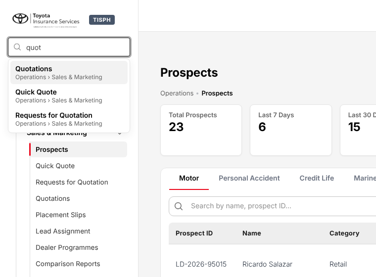
#### The account menu {#the-account-menu}
Select your initials at the top right. The menu shows your name and your role, then:

| Item | What it does |
|---|---|
| **Profile** | Opens [My Profile (2.5)](#my-profile). |
| **Change password** | Changes the password of a user who signs in with a password: see [My Profile (2.5)](#my-profile). |
| **Two-step verification** | Turns the second sign-in step on or off: see [Two-step verification (2.1.3)](#two-step-verification). |
| **Help** | Opens [the Help panel (2.12)](#the-help-panel). |
| **Show full identifiers** | Shown to the roles that see personal identifiers in full: see [Personal data masking (2.11)](#personal-data-masking). |
| **Sign out** | Ends your session. |

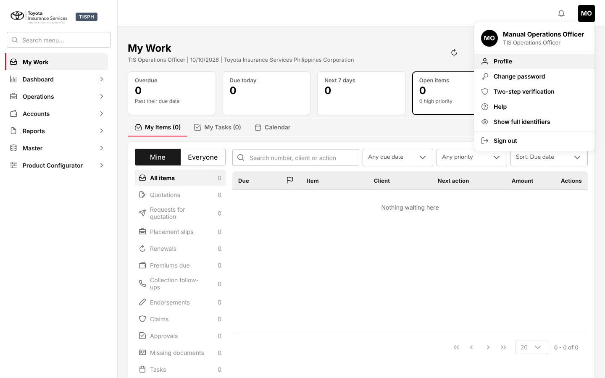
### My Work {#my-work}
**Menu:** My Work

| Role | Access |
|---|---|
| TIS Sales Associate | View |
| TIS Sales Officer | View |
| TIS Sales Unit Head | View |
| TIS Operations Associate | View |
| TIS Operations Officer | View |
| TIS Operations Unit Head | View |
| CCD-PDU (Post-Dated Cheques) | View |
| CCD-PDC / CCD-ADA | View |
| CCD-BP / QRPh (Receipting) | View |
| CCD-Recon (Reconciliation and Reversals) | View |
| TIS Finance & General Accounting | View |
| TIS IT AppSupport / Admin | View |
| TIS General Manager | View |

My Work is the first screen after sign-in and the one place where you find what is waiting for you. The line under
the title shows your role, today's date and the company.

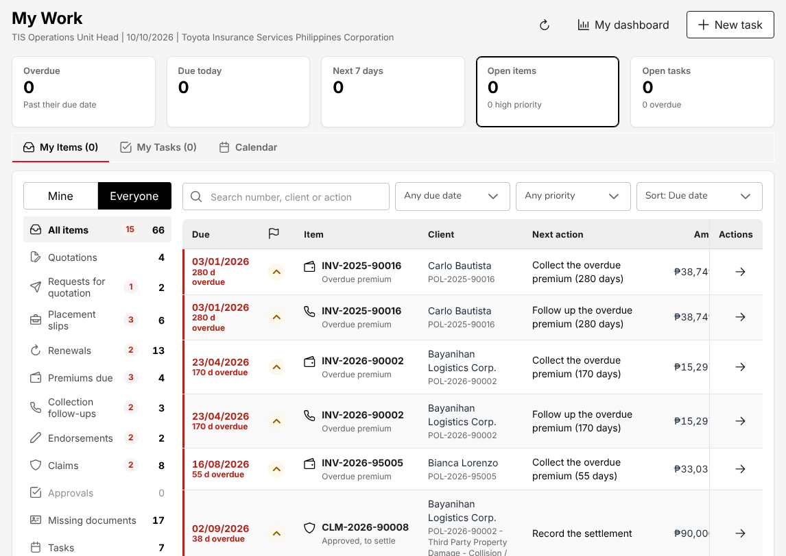
| Part | What it shows |
|---|---|
| **Overdue**, **Due today**, **Next 7 days**, **Open items**, **Open tasks** | The number of your items in each group. Select a figure to filter the list. |
| **My Items** | Every open item you own or may act on, by category on the left: Quotations, Requests for quotation, Placement slips, Renewals, Premiums due, Collection follow-ups, Endorsements, Claims, Approvals, Missing documents and Tasks, and for finance and IT roles Bank reconciliations, Period close, Users and access and System health. You see only the categories your role may read. The red badge is the number overdue. |
| **My Team** | Shown only to a user to whom other employees report: one row per person with open, overdue and due-today counts, and **Reassign** to move an item to yourself or to someone in the team. |
| **My Tasks** | Your work diary: tasks you created, tasks given to you and tasks you gave to others. |
| **Calendar** | Your tasks and items by due date, for one day or a week, with the overdue ones above. |
| **My dashboard** | Opens the first dashboard of your role. |

To work your items:

1. Choose **My Work**. **My Items** opens on **Mine**. Select **Everyone** to see the items of all users within your
   access, or **My team** if people report to you.
2. Choose a category on the left, or use **Search number, client or action**, **Any due date**, **Any priority** and
   **Sort**.
3. Select the arrow at the end of a row to open the record (quotation, renewal, claim, receipt) and act on it there.
   The item leaves the list when the record no longer needs your action.

To add a task:

1. Select **New task**. The task form opens on the right.
2. In **Task**, type what is to be done, and choose the **Due date** (today by default).
3. Optionally choose a **Time**, the **Priority** (Normal by default) and the **Reminder** (1 hour before by default).
4. Optionally choose the **Related record** type and find the record by number or name in **Record**, and type
   **Notes**.
5. Select **Save**. The reminder arrives as a notification at the time chosen.

Mark a task **Mark done** when finished; **Reopen** reopens it. The system also creates follow-up tasks by itself (for
example from a client's promise to pay, a renewal next step or a claim follow-up date) and closes them when the record
is closed. An overdue task sends one notification to its owner.

### Notifications {#notifications}
The system notifies you when something needs your action or concerns your work, for example:

- a quotation, renewal, claim settlement or other record waiting for your approval (approval requests go only to the
  users who may approve them);
- a claim assigned to you, a task given to you, a task due or overdue;
- post-dated cheques due for deposit, a bounced cheque, a cover note about to expire, a policy renewed or lapsed;
- a month-end close still open, an access review waiting for decisions.

Select the bell at the top right. The **Notifications** panel shows your six latest notifications, newest first, with
the number unread. A dot marks an unread notification.

- Select a notification to mark it as read. Open the record from [My Work (2.3)](#my-work) or from its screen.
- Select the X on a notification to remove it (**Remove notification**).
- Select **Mark all as read** to clear the badge.
- Select **View all notifications** for the **Notification** page with every notification you received.

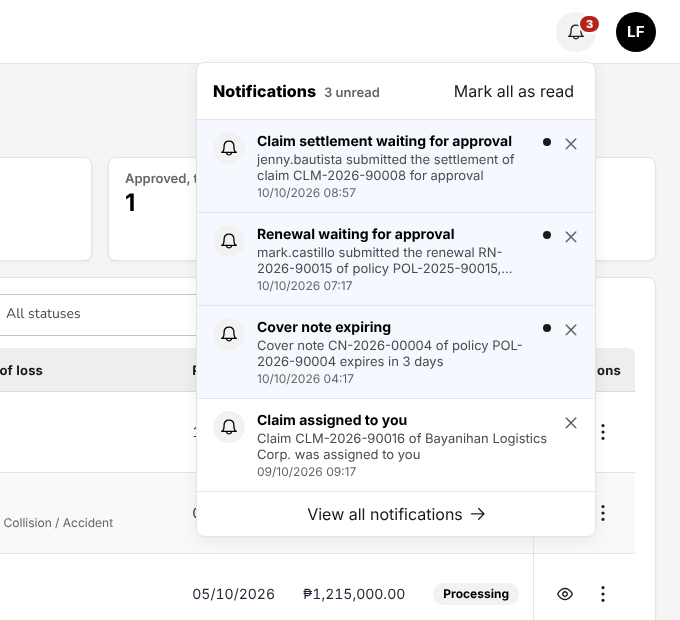
### My Profile {#my-profile}
Select your initials, then **Profile**. **My Profile** (Home • My Account • My Profile) has two parts.

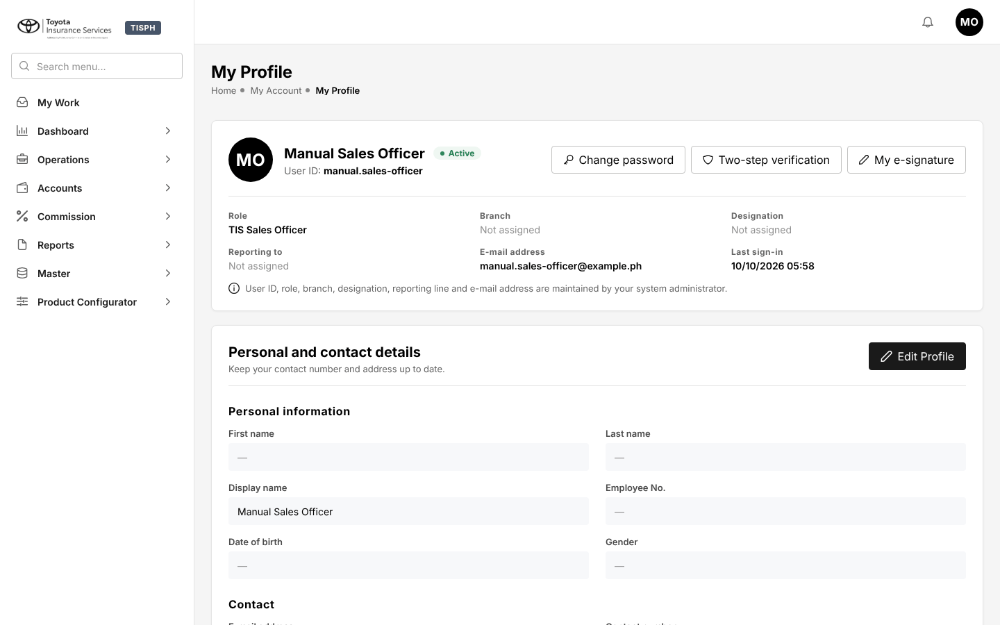
The account summary shows your name, status (**Active**), **User ID**, **Role**, **Branch**, **Designation**,
**Reporting to**, **E-mail address** and **Last sign-in**. IT AppSupport maintains these; you cannot change them here.
The buttons **Change password**, **Two-step verification** and **My e-signature** are at the top right.

**Personal and contact details** shows **Personal information** (**First name**, **Last name**, **Display name**,
**Employee No.**, **Date of birth**, **Gender**), **Contact** (**E-mail address**, **Contact number**) and **Address**
(**House No. / Unit No. / Street**, **Barangay / Subdivision**, **City / Municipality**, **Province**, **Region**,
**ZIP code**, **Country**).

To change them:

1. Select **Edit Profile**. The fields you may change open; fields marked * are required.
2. Correct the fields. Choose the address from the top down: **Country**, then **Province**, then **City /
   Municipality**, then **Barangay / Subdivision**. Choosing a barangay fills an empty **ZIP code**.
3. Select **Save changes**. The system shows **Your profile has been updated.** The new display name appears at once
   at the top right. **Cancel** closes the form without saving.

| Message | Meaning |
|---|---|
| Enter your first name. / Enter the name to display. | **First name** or **Display name** is empty. |
| Enter a Philippine number, for example 0917 123 4567 or (02) 8123 4567. | The contact number is not a Philippine mobile number (0917 123 4567 or +63 917 123 4567) or a landline with its area code. |
| Enter a valid date of birth in the past. | The date of birth is in the future or not a date. |
| A Philippine ZIP code has 4 digits. | The ZIP code does not have 4 digits. |

Your **Display name** is the name shown at the top right, in My Work and on the audit trail. The activity log of some
records (for example the timeline of a renewal) shows your user ID instead. To change your e-mail address, ask IT
AppSupport.

**Change password** (users who sign in with a password): type **Current password**, then **New password** and
**Confirm new password**, and select **Change password**. The system shows **Password changed. Your other sessions
have been signed out.**

**My e-signature** records the signature printed on the documents you issue or approve, where
[Document Signatures (20.22)](#document-signatures) maps it:

1. Select **My e-signature**.
2. **Draw** the signature on screen, or **Upload image** (PNG or JPEG, up to 512 KB).
3. Choose **Effective from**, tick the confirmation that this is your own signature, and select **Save signature**.

**Versions** lists every signature you saved. **Revoke** stops a version from being printed, with the reason;
documents printed before keep the signature they were printed with.

### Working with lists {#working-with-lists}
Most screens open on a list. The lists work the same way everywhere.

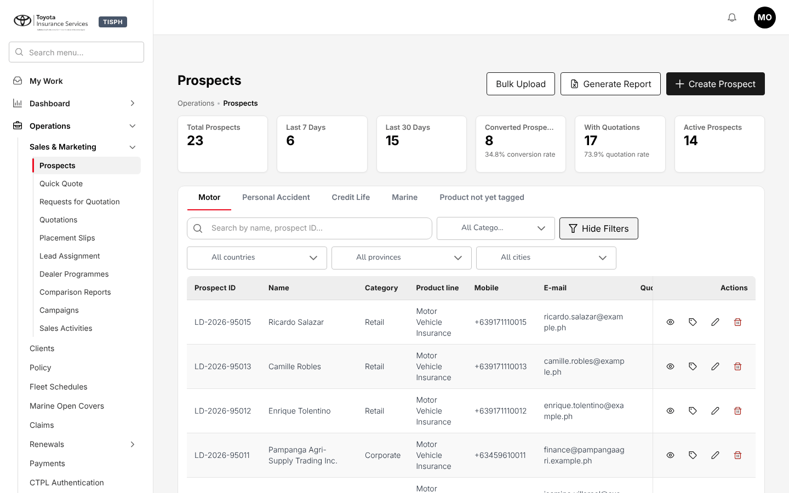
- **Figures**: many lists show figure cards at the top (for example **Total Prospects** and **Last 7 Days** on
  Prospects). Some cards filter the list when selected.
- **Tabs**: some lists are split by tab, for example by line of business on Prospects (**Motor**, **Personal
  Accident**, **Credit Life**, **Marine**, **Product not yet tagged**).
- **Search**: type in the search box above the list; the placeholder says what is searched (for example **Search by
  name, prospect ID...**).
- **Filters**: choose values in the filter lists next to the search box (for example **All Status**). Where the screen
  has **Show Filters**, select it for more filters and **Hide Filters** to close them. The list follows at once.
- **Sorting**: select a column heading to sort by it; select it again to reverse the order.
- **Paging**: the list shows 20 rows per page; change the number at the bottom right. The arrows go to the first,
  previous, next and last page, and the text next to them shows the rows on screen and the total (for example 1 - 16
  of 16). Search and filters apply to the whole list, not only to the page on screen.
- **Row actions**: at the end of the row. **View** (the eye) opens the record and **Edit** (the pencil) changes it;
  on lists with more actions, the three dots open the row menu, with **View** first. An action your role may not use
  is not shown; an action that cannot be taken now is greyed out in the menu with the reason.
- **Export**: lists that can be exported have **Generate Report**, **Export** or **Excel** and **CSV**. The file
  downloads to your computer and contains the rows of the search and filters.

Statuses show as coloured tags: green for completed, active or paid; amber for pending or waiting; red for rejected,
overdue or lost.

### Working with forms {#working-with-forms}
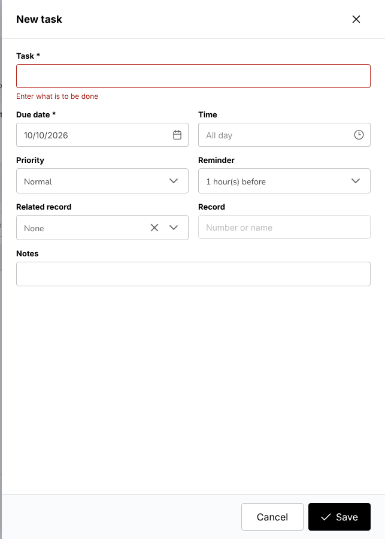
- Required fields are marked with an asterisk (*). The form is not saved until every required field is filled in.
- When a value breaks a rule, the field is outlined in red and the message under it says what to correct, for example
  **Enter what is to be done**. Messages about the whole record appear at the top right. Correct the field and save
  again.
- Short forms open as a panel on the right of the screen; longer forms (a quotation, a placement slip, a receipt)
  open as a page of their own.
- Lists in a form offer only active records of the masters. Where one list depends on another, choose the first one
  first: province, then city; vehicle brand, then model.
- Dates are entered and shown as DD/MM/YYYY; amounts are in pesos with two decimals, for example PHP 1,250,000.00.
- **Save**, or the action named on the button (for example **Create Placement Slip**), stores the record. **Cancel**
  or the X closes the form without saving. Nothing is stored until you save.
- After a save the system shows a confirmation at the top right and, for most records, the number it issued.
- An action that changes or removes a record asks for confirmation first (see [Confirmations (2.7.1)](#confirmations)).

#### Confirmations {#confirmations}
A confirmation says in one sentence what is about to happen, lists the facts of the record it applies to (amounts in
pesos on the right, dates as DD/MM/YYYY) and says what follows. The button names the action, for example
**Submit 3 remittances**, **Register cheque** or **Escalate**; **Cancel** or the X closes the confirmation and
changes nothing.

- A rejection, return, reversal, cancellation or escalation asks for the **Reason**, chosen from the list of reasons
  that TIS IT AppSupport / Admin keeps on [Reason Codes (20.6)](#lead-sources-and-reason-codes). The reason **Other** also needs a **Note**.
- The button shows that the action is running. The confirmation closes when the action is done; if the system refuses
  it, the confirmation stays open with the message, and nothing is changed.

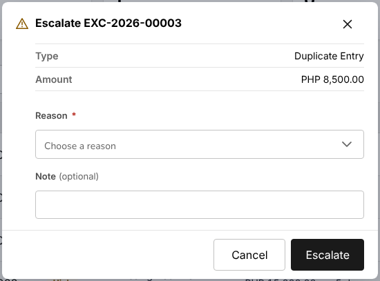
#### Record details {#record-details}
**View** in a list opens the details of the record, in a window or on a page of its own. The details show the number,
the status and the main facts at the top, then the facts in groups (label above, value below), and the record's
activity. **Close** closes the window; **Edit** is shown to the roles that may change the record. Personal data is
masked as in [Personal data masking (2.11)](#personal-data-masking).

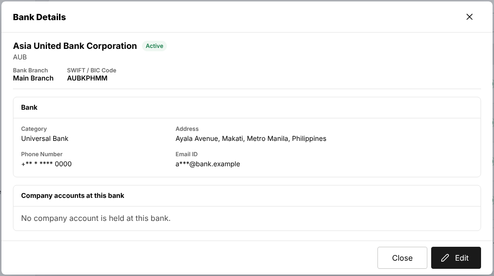
#### Printing {#printing}
**Print** prints the document of the record (receipt, voucher, debit note, schedule), on the letterhead of Toyota
Insurance Services Philippines, and never the screen: the browser's print window opens with the document only. Where
the browser cannot print from the page, the document opens in a new tab to print from there. While a print is being
prepared its button shows that it is working. Documents such as the remittance schedule and advice are downloaded as
PDF or XLSX files instead. A print is recorded in the activity of the record; repeated prints show as one entry.

### Uploads and templates {#uploads-and-templates}
Some screens load many records at once from a spreadsheet, for example **Bulk Upload** on Prospects or **Import open
items** on Collections. The upload works the same way on every screen.

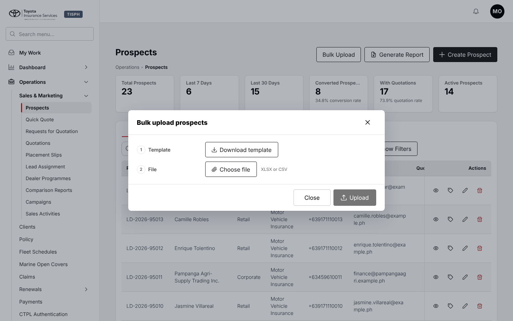
1. Select the upload button of the screen (**Bulk Upload**, **Import**, **Upload**). The upload dialog opens.
2. Select **Download template** and fill in the template. Keep its columns and headings as they are: the template has
   the exact columns the system reads.
3. Select **Choose file** and choose the filled template (XLSX or CSV). The dialog shows the file name and size;
   the X removes it.
4. Where the dialog offers **Validate**, select it first. The **Validation result** shows the number of rows and the
   errors, with the row, the column and the message. Nothing is saved at this step.
5. Select **Upload**. The **Upload result** shows the rows loaded and the rows refused, each with its row, column and
   message.
6. Correct the refused rows in the file and upload them again.

A file may not be larger than 10 MB. Uploads of receipts, payment vouchers, journal vouchers and authority limits
accept up to 1,000 rows per file.

Documents attached to a record (for example the documents of a claim) are uploaded on the record itself, in the
formats and size shown next to the upload button.

### Approvals and maker-checker {#statuses-approvals-and-maker-checker}
The user who enters a record never approves it: a different user, holding the approval of that record, approves it.
The system refuses the approval of your own record (for example **Maker-checker: the approver must be different from
the user who created the quotation**) and notifies the users who may approve. Your role chapter lists what your role
approves and who approves your work.

| Record | Approved by |
|---|---|
| Quotation | TIS Sales Officer, TIS Sales Unit Head, TIS Operations Unit Head or TIS General Manager |
| Check of a placement against the slip | TIS Sales Officer, TIS Sales Unit Head, TIS Operations Unit Head or TIS General Manager |
| Endorsement with return premium, and policy cancellation | TIS Sales Officer, TIS Sales Unit Head, TIS Operations Unit Head or TIS General Manager |
| Quotation referred by an acceptance rule of the product (underwriting referral) | TIS Operations Unit Head |
| Renewal terms | TIS Sales Officer, TIS Sales Unit Head, TIS Operations Unit Head or TIS General Manager |
| Claim decisions and settlement | TIS Operations Unit Head or TIS General Manager |
| Supplier invoice | TIS Sales Unit Head, TIS Operations Unit Head, TIS Finance & General Accounting or TIS General Manager |
| Journal voucher, payment voucher and cheque | Another TIS Finance & General Accounting user |
| Remittance to an insurer, and its settlement or adjustment | TIS Finance & General Accounting or TIS General Manager, within the approval limit, never the user who prepared or submitted it |
| Bank reconciliation | TIS Finance & General Accounting |
| Insurer statement reconciliation | CCD-Recon (Reconciliation and Reversals) |
| Credit control decisions | TIS Finance & General Accounting |
| Incentive calculation batch | TIS Sales Unit Head |
| Month-end and year-end close | TIS Finance & General Accounting |
| Posting rules and account determination | TIS Finance & General Accounting |
| Role access changes and authority limits | TIS IT AppSupport / Admin |

**Approval limits.** The [Authority Matrix (20.10)](#authority-matrix) sets the largest amount each role may approve per
transaction. As delivered:

- a remittance, and its settlement or adjustment, is approved by TIS Finance & General Accounting up to
  PHP 1,000,000.00 and by the TIS General Manager without limit. A user without a remittance limit cannot approve
  or reject a remittance;
- the other transactions hold no limit, which the role chapters show as "Not set": a claim settlement, for example,
  is approved by the approver whatever its amount.

To approve:

1. Choose **My Work** and the category **Approvals**. Each row shows the record, the client, the amount and **Approve
   or reject**.
2. Select the arrow at the end of the row. The record opens with its approval actions.
3. Check the record, then choose **Approve**, or the decline action of the screen (**Reject** or **Return**) with
   the reason. The decision is recorded in the activity of the record.

When you may not decide a record (you entered or submitted it, or its amount is above your limit), the decision
buttons are greyed out or not shown, and a line next to them says why and, where the system knows them, who can
decide. The system applies the same rule when the decision is sent.

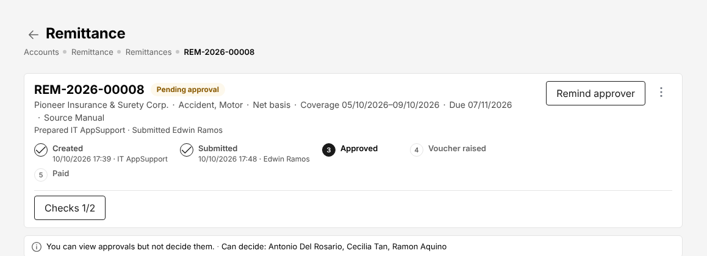
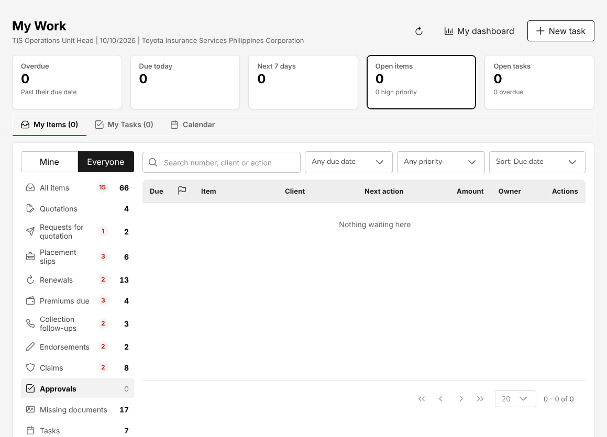
On top of maker-checker:

- once a limit is set on the [Authority Matrix (20.10)](#authority-matrix), an approval above the approver's limit is
  refused;
- the [Segregation of Duties (20.12)](#segregation-of-duties) rules warn or block when one person is given roles that should
  stay apart;
- a [Delegation (20.11)](#delegations) lends your approval limit to the person who covers for you during an absence, for the
  transactions and dates chosen; it applies once TIS IT AppSupport / Admin approves it.

### Where the audit trail is {#where-the-audit-trail-is}
The system records every creation, change, approval and sign-in with the user, the time and the values before and
after.

| Where | What you see | Who |
|---|---|---|
| Master > System > Audit Trail | Every recorded action of every user | TIS Finance & General Accounting, TIS IT AppSupport / Admin or TIS General Manager |
| The **Audit Trail**, **History** or **Activity** tab of a record (quotation, policy, endorsement, claim, prospect, receipt, collection, voucher, period) | The events of that record | Users who may open the record |
| **Sign-in history** of a user (Master > Users and Access > User) | Every sign-in attempt with its result and method | TIS IT AppSupport / Admin |

To search the audit trail:

1. Choose Master > System > Audit Trail.
2. Narrow the list with **Date range**, **All users**, **All record types**, **Record number** and **All actions**.
3. Each row shows **Date & Time**, **User** (name and role), **Record**, **Event**, **Changes** (the fields changed)
   and **Source** (the screen or the job that made the change). Select a row to see each field with its value before
   and after.
4. Select **Export** to download the rows of the search.

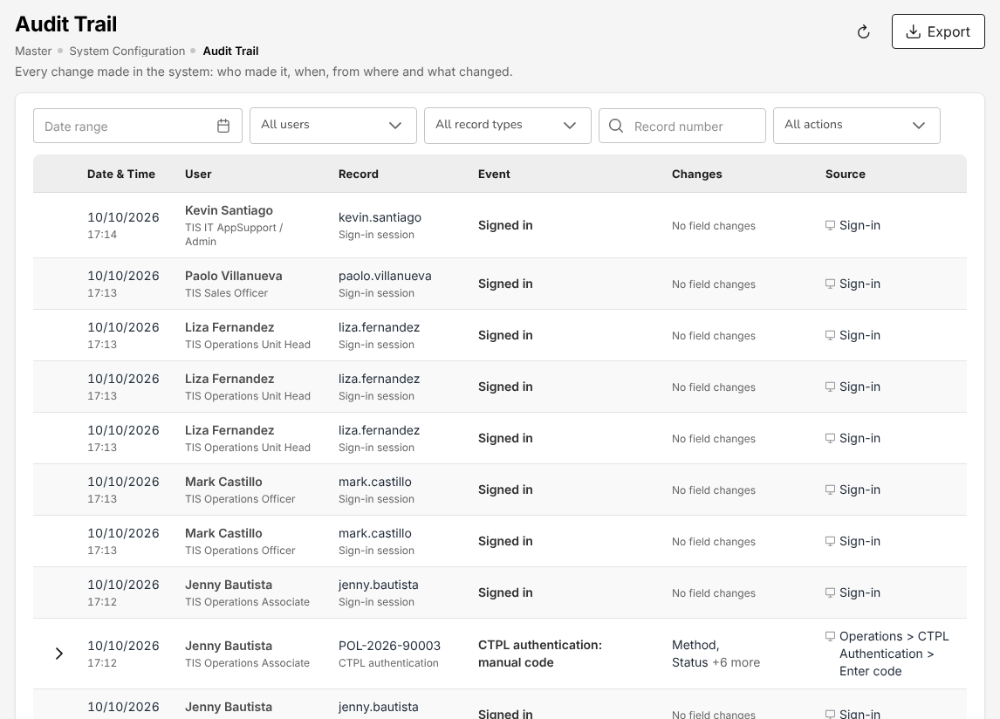
On a record, the activity log (the **Activity**, **History** or **Audit Trail** tab) lists the events newest first,
grouped by day. Each event shows what was done, the date and time, the user's name and role, the status before and
after, the remarks or reason given and, under **What changed**, each field changed with its value **Before** and
**After**. Masked personal data stays masked. Where the record offers them, search the events, filter by **User** and
**Kind of event**, or export them (**Export**, **Download log (XLSX)**).

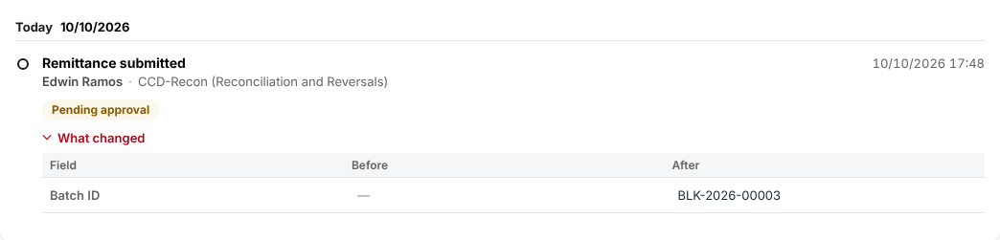
### Personal data masking {#personal-data-masking}
Personal identifiers of clients and prospects are protected under Republic Act No. 10173. On every screen, export and
report, the system shows them in full only to a user of one of the roles that need them: the Sales roles, the Operations roles, TIS Finance & General Accounting or TIS General Manager.

For the other roles the identifiers are masked:

| Identifier | Shown as |
|---|---|
| E-mail address | First letter and the domain, for example j***@example.ph |
| Mobile and telephone number | The last 4 digits, for example +********0015 |
| TIN, government ID number, bank account number | The last 4 characters |
| Date of birth | The year only |

Your own details on My Profile are always shown in full. When you save a form that shows a masked value, the masked
value is ignored and the stored value is kept. **Show full identifiers** appears in the account menu of the roles that
see full identifiers; with the set-up of Toyota Insurance Services Philippines these roles see them at all times.

### The Help panel {#the-help-panel}
Press F1, or **?** outside a text field, or choose **Help** in the account menu. The panel shows:

- **Help for this screen**: the section of this manual for the screen you are on (**Open this section**);
- **Download user manual (PDF)**, **Download user manual (Word)** and **Browse the whole user manual**;
- **Your role**: your role and **Open my role chapter**;
- **Contact support**: the support e-mail address, telephone number, hours and portal that TIS IT AppSupport / Admin
  sets up on Master > System > Configuration. Until they are set up, the panel says
  **Support contacts not set up. Contact TIS IT AppSupport / Admin.**;
- **Keyboard shortcuts**: F1 or ? opens the panel, / goes to the menu search, the arrows and Enter open a menu search
  result, Esc closes the panel or clears the search;
- **About Toyota Insurance Services**: the version of the system, the environment, the build and release date, the
  version of this manual, and who approved the requirements and the release of this version. TIS IT AppSupport / Admin
  keeps these on Master > System > Configuration (Release).

### When the system refuses an action {#when-the-system-refuses-an-action}
| Message or situation | Reason | What to do |
|---|---|---|
| **Not authorised**: Your role does not give access to this screen | The link (for example from a notification or My Work) leads to a screen that is not in the menus of your role | Ask a user of the role that works on the record; see the chapter of your role for your menus |
| A decision button (for example **Confirm check**, **Approve**) is greyed out, or the system says the approver must be different | You entered the record: the decision is made by another user (maker-checker) | Ask a user of the approving role named in your role chapter |
| An error on a claim decision (**Proceed to adjuster report**, **Proceed to settlement**, **Reject claim**) | Claim decisions are made by TIS Operations Unit Head or TIS General Manager | Hand the claim to a user of that role |
| An approval is refused for its amount | The amount is above your limit on the Authority Matrix | Ask an approver with a higher limit |
| A cancellation or a return premium cannot be completed | Money going back to the client is completed by another user | A user who approves policy checks completes it (see [Approvals and maker-checker (2.9)](#statuses-approvals-and-maker-checker)) |
| **Endorsement** or **Claim** is not offered on a policy | The policy's payment is **Pending** or **Reviewing**, or the policy is no longer in force | Check the policy's payment on [Payments (17.19)](#payments) |

## The TISPH process end to end {#the-business-process-end-to-end}
The work of Toyota Insurance Services Philippines follows one chain: a lead becomes a quotation, the quotation is
placed with a panel insurer, the insurer's policy is booked and billed, Cash Control collects the premium, the premium
is remitted to the insurer, the commission is earned and paid, claims are followed up with the insurer, the policy is
renewed, and Finance closes the month and files the BIR returns. Each section below names the roles that do the
step, as delivered, and the screens where it is done.

The chapter follows two policies through the chain:

- **A motor policy financed by Toyota Financial Services (TFS).** TFS refers the buyer of a financed Toyota. The
  account executive quotes the car, the client accepts, the placement slip goes to the panel insurer, the insurer's
  e-policy is checked and booked with TFS as mortgagee, and the client pays TISPH.
- **A dealer programme policy.** A Toyota dealer sells brand-new cars under a programme agreed with TISPH (and, for
  financed cars, with TFS). The dealer's sales file creates the prospects and quotations, or issues the policies at
  once, with the free or subsidised first-year premium billed to the dealer or the bank.

From the booking onwards both policies follow the same steps.

### The chain at a glance {#process-at-a-glance}
| Step | Who does it | Screen | Result |
|---|---|---|---|
| Prospect | the Sales roles or TIS General Manager | [Prospects (17.1)](#prospects) | Prospect **New**, assigned to an account executive |
| Dealer sales | TIS IT AppSupport / Admin | [Dealer Programmes (17.7)](#dealer-programmes) | Prospects and quotations, or booked policies |
| Quotation | the Sales roles, the Operations roles or TIS General Manager | [Quotations (17.4)](#quotations), [Quick Quote (17.2)](#quick-quote) | Quotation **Pending Customer**, then **Customer Accepted** |
| Request for quotation | the Sales roles, the Operations roles or TIS General Manager | [Requests for Quotation (17.3)](#requests-for-quotation-broker-slips) | Insurers' offers compared |
| Placement | the Sales roles, the Operations roles or TIS General Manager | [Placement Slips (17.5)](#placement-slips) | **Sent to insurer**, **Acknowledged**, **e-Policy received** |
| Check of the e-policy | TIS Sales Officer, TIS Sales Unit Head, TIS Operations Unit Head or TIS General Manager | [Placement Slips (17.5)](#placement-slips) | **Checked against slip** |
| Booking | the Sales roles, the Operations roles or TIS General Manager | [Placement Slips (17.5)](#placement-slips) | Policy, bill, journal and commission; **Insurer issued (Booked)** |
| Collection | the Cash Control roles | [Receipts (18.1)](#verify-payments-and-post-official-receipts), [Post-Dated Cheques (18.4)](#post-dated-cheques) | Official receipt; policy payment **Completed** |
| Remittance | CCD-Recon (Reconciliation and Reversals) or TIS Finance & General Accounting | [Remittance to insurers (18.9)](#remittance-to-insurers) | Remittance approved, settled and paid to the insurer |
| Commission | TIS Finance & General Accounting | [Commission to agents and referrers (19.4)](#commission-to-agents-and-referrers) | Commission lines **Approved**, then **Paid** |
| Endorsement | the Sales roles, the Operations roles or TIS General Manager | [Policies (17.10)](#policies) | Policy changed; additional premium billed |
| Claim | the Operations roles or TIS General Manager | [The claims list (17.13)](#the-claims-list) | Claim **Pending** to **Closed** |
| Renewal | the Sales roles, the Operations roles or TIS General Manager | [Renewal Queue (17.16)](#renewal-queue-and-at-risk-policies) | Renewal quotation, then a new placement |
| Month-end and tax | TIS Finance & General Accounting | [Period end (18.20)](#period-end), [Tax: BIR forms and returns (18.17)](#tax-bir-forms-and-returns) | Period **Closed**; returns filed |

Work that waits for you appears in [My Work (2.3)](#my-work). Each approval in the chain is made by another user than the
one who entered the record (see [Approvals and maker-checker (2.9)](#statuses-approvals-and-maker-checker)).

### Leads from TFS, dealers and walk-in clients {#process-leads}
Prospects are entered by the Sales roles or TIS General Manager, on [Prospects (17.1)](#prospects). Leads are assigned to the sales team on
[Lead Assignment (17.6)](#lead-assignment) by TIS Sales Officer, TIS Sales Unit Head or TIS General Manager.

TISPH receives its leads from four sources:

- **Toyota Financial Services.** TFS refers the buyers of the Toyota cars it finances. The prospect carries the TFS
  office as its channel (TFS Head Office or a TFS branch) and the lead source of the referral (for example
  **Bundling**, **Promo**, **Used-Cars - SCR** or **Used-Cars - UCFP**).
- **Toyota dealers.** A dealer sale under a dealer programme creates the prospect itself, with the dealer branch as
  its channel (see [Dealer programme policies (3.3)](#process-dealer-programme)).
- **Walk-in clients and referrals.** A client who walks in at a Toyota showroom or is referred by an agent, with the
  lead source **Walk-In**, **Referral** or **Agent**.
- **Renewals.** An expiring policy comes back through the [Renewals (3.11)](#process-renewals) step, not as a new prospect.

The lead sources are those of Master > Insurance > Lead Sources.

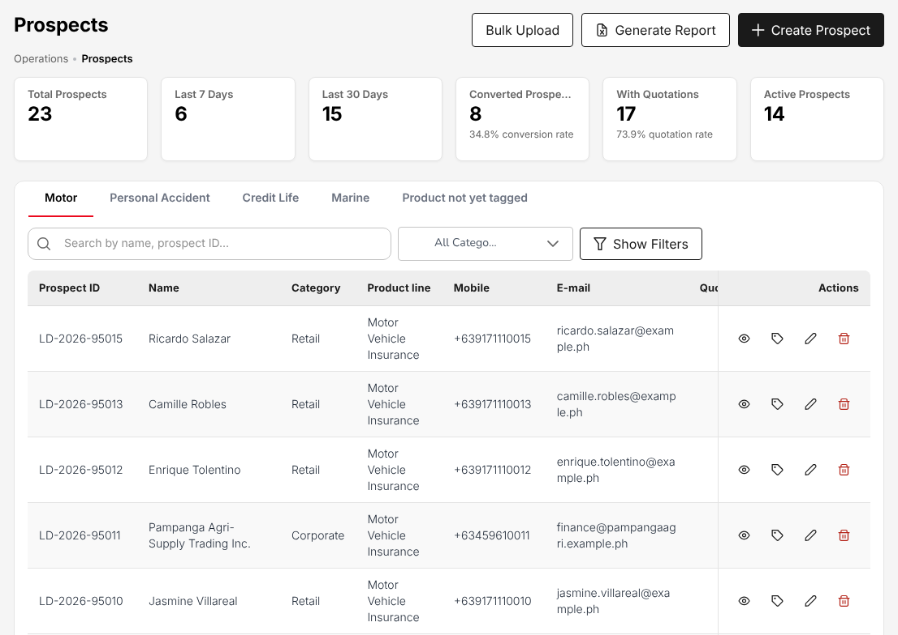
To record a TFS referral:

1. Choose Operations > Sales & Marketing > Prospects.
2. Select **Create Prospect**.
3. Enter the buyer's name, mobile number and e-mail, the category (**Retail** or **Corporate**) and the product line
   (Motor for a financed car).
4. Select the TFS office as the channel and the lead source of the referral.
5. Save the prospect. It is created with the status **New**.

The assignment rules of [Lead Assignment (17.6)](#lead-assignment) give the prospect to an account executive of the sales
team; a prospect that no rule can assign waits in the **Reassignment Queue** for TIS Sales Officer, TIS Sales Unit Head or TIS General Manager. The
account executive follows the prospect up from [My Work (2.3)](#my-work) and logs the calls and visits on
[Sales activities (17.8)](#sales-activities). Logging the first activity marks the prospect **Contacted**. The prospect
becomes **Quote Generated** with its first quotation, **Converted** when the policy is booked, or **Lost**.

### Dealer programme policies {#process-dealer-programme}
A dealer programme holds the terms agreed with a Toyota dealer and, for financed cars, the financing bank: the
insurer, the own damage and acts of nature rates, the excess liability limits, the CTPL term, whether the first year
is free or subsidised and who pays it, and what the dealer's sales upload creates.

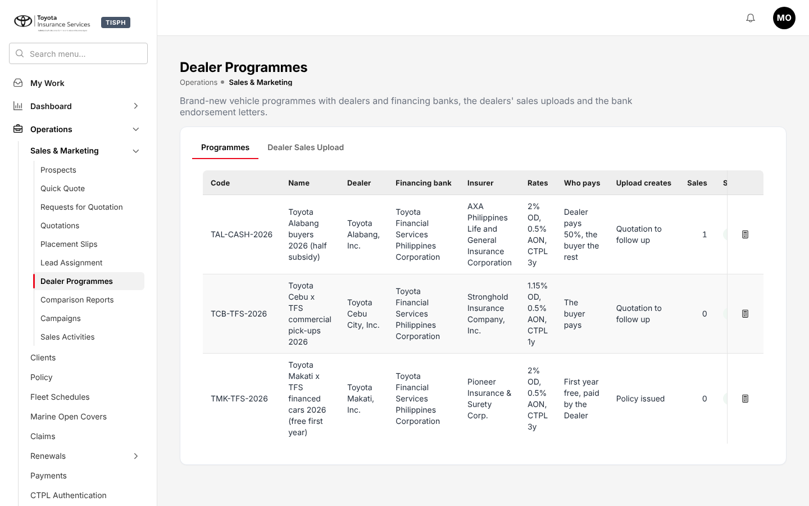
As delivered, the programmes are set up, and the dealers' sales files uploaded, by TIS IT AppSupport / Admin.
Every sales and operations role can open the programmes and print the bank endorsement letters.

To upload a dealer's sales:

1. Choose Operations > Sales & Marketing > Dealer Programmes.
2. Open the **Dealer Sales Upload** tab.
3. Select the programme of the dealer. The programme must be **Active**.
4. Upload the dealer's file of vehicle sales (sale date, invoice number, buyer, vehicle, chassis and engine numbers,
   invoice price and, for a financed car, the loan amount).
5. Check the result: each row is processed on its own. A row with an error (for example a missing chassis number) is
   kept with its error and creates nothing.

For each sale the system creates the prospect, with the dealer branch as its channel, and the motor quotation priced
on the programme's rates, with CTPL at the tariff of the vehicle class. A financed car carries the bank as mortgagee
with its mortgagee clause. What follows depends on the programme's **Upload creates** column:

- **Quotation to follow up**: the quotation stays in **Draft** and the account executive follows it up with the buyer
  like any other quotation, from [Quotation and request for quotation (3.4)](#process-quotation) onwards.
- **Policy issued**: the buyer becomes a client and the policy is booked at once, starting on the sale date. The
  premium is billed to who pays it: the buyer, the dealer or the bank. With a free first year the dealer (or the bank)
  receives the whole bill; with a subsidy, the dealer's share and the buyer's share are billed separately.

From the bill onwards the policy follows [Collection by Cash Control (3.7)](#process-collection).

### Quotation and request for quotation {#process-quotation}
Quotations and requests for quotation to the panel insurers are prepared by the Sales roles, the Operations roles or TIS General Manager. A quotation is
approved by another user: TIS Sales Officer, TIS Sales Unit Head, TIS Operations Unit Head or TIS General Manager.

Which steps a product needs is set per product: every TISPH line of business needs a placement slip; a motor policy
and the package products (for example Compulsory Credit Life, Personal Accident and Parcel / Courier Insurance) need a
quotation; a request for quotation to several insurers is optional.

#### Motor quotation for a TFS-financed car {#process-motor-quotation}
1. Choose Operations > Sales & Marketing > Quotations.
2. Select **Create Quote** and choose the motor product.
3. Select the prospect, the Toyota model, variant and year of the vehicle master, the vehicle type and the insurer.
4. Enter the sum insured (the invoice price) and the covers. The premium is computed on the motor tariff: own damage
   and acts of nature at the rate of the vehicle class, the excess bodily injury and property damage limits, auto
   passenger personal accident per seat, and CTPL at the tariff amount for 1 or 3 years. DST, VAT and LGT are added
   to give the gross premium.
5. Save the quotation. It is created as **Draft**.
6. Open the quotation (**View Details**, the eye icon) and select **Send for Customer Approval**. The status becomes
   **Pending Customer**.

For a package product, [Quick Quote (17.2)](#quick-quote) prices the quotation from the product's rates in one screen.

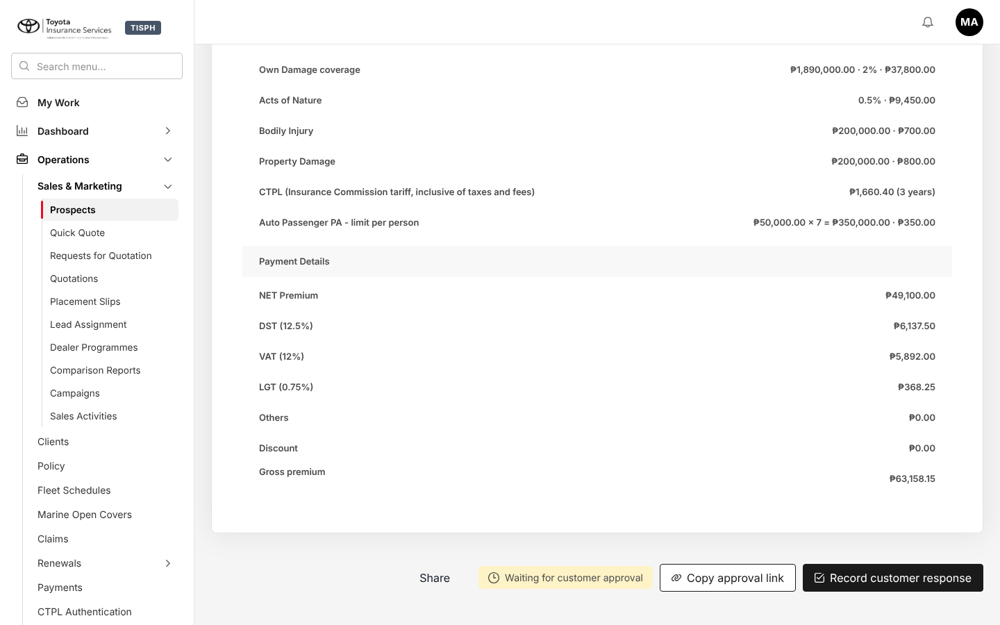
#### The client's answer {#process-client-acceptance}
The client accepts the quotation through the approval link, or you record the answer:

1. Open the quotation from Operations > Sales & Marketing > Quotations (**View Details**, the eye icon).
2. Select **Copy approval link** to send the link to the client again, or **Record customer response** when the client
   answered by phone, e-mail or in person.
3. Record the acceptance. The status becomes **Customer Accepted**.

When the quotation is accepted, the system raises the placement slip at once (status **Placement raised**) and
stores the slip PDF. If the slip cannot be raised, the quotation's owner receives the notification
"Placement slip not raised" with the reason. A quotation that the client turns down is set to **Rejected** or
**Dropped** with a reason.

The status **Approved** is set only by TIS Sales Officer, TIS Sales Unit Head, TIS Operations Unit Head or TIS General Manager, and never by the user who created the
quotation.

#### Request for quotation to the panel insurers {#process-rfq}
For a risk that needs the insurers' own terms (for example a fleet or a group personal accident), ask several
insurers first:

1. Choose Operations > Sales & Marketing > Requests for Quotation.
2. Select **New Request for Quotation**, enter the risk and choose the insurers to approach.
3. Select **Save and submit to market**. The request is **Submitted** and each insurer receives it by e-mail.
4. As each insurer answers, select **Record response** (premium, rate, taxes, deductibles, validity and the share it
   writes) or **Record decline**. With the answers in, the request is **Responses in**.
5. Compare the offers and select **Prepare Quotation Slip** for the offer the client takes, or
   **Prepare Placement Slip** where the product needs no quotation.

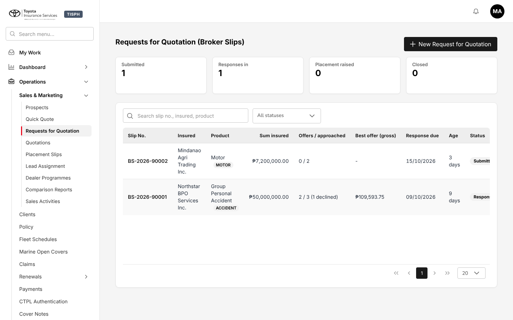
### Placement with the insurer {#process-placement}
The placement slip goes to the insurer, which returns the e-policy. The check of the e-policy against the slip is
decided by TIS Sales Officer, TIS Sales Unit Head, TIS Operations Unit Head or TIS General Manager, never by the user who recorded the e-policy. See
[Placement Slips (17.5)](#placement-slips).

The placement slip is a firm order to the insurer. TISPH never issues the cover itself: a policy exists only once the
insurer's e-policy has been received, checked against the slip and booked.

Placement is done by the Sales roles, the Operations roles or TIS General Manager:

1. Choose Operations > Sales & Marketing > Placement Slips and open the placement slip (status **Placement raised**).
2. Check the insurer, the participants and the premium. For co-insurance, select **Edit participants**: one lead
   insurer, and the shares must total 100%.
3. Select **Send to insurer(s)**. Each insurer receives the slip of its share by e-mail (a direct CTPL also with the
   LTO document). The status becomes **Sent to insurer**.
4. When the insurer confirms the order, select **Record acknowledgement** and enter the insurer's reference. The
   status becomes **Acknowledged**.
5. When the e-policy arrives, select **Upload e-policy**, attach the e-policy file and enter what it says: the insurer
   policy number, the participant name, the sum insured, the net and gross premium, the commission, and the issue,
   issuance, effective and production dates. For a motor policy, correct the chassis, engine and plate numbers to
   those of the e-policy: the plate number or the MV file number is required, even where the quotation said TBA.
   The status becomes **e-Policy received**.

The system compares the e-policy with the slip at once. Amounts within PHP 1.00 of the slip match.

If the insurer declines the placement, select **Record decline**; to stop a placement, select **Cancel slip**.

#### Check the e-policy against the slip {#process-epolicy-check}
The check is made by TIS Sales Officer, TIS Sales Unit Head, TIS Operations Unit Head or TIS General Manager, a user other than the one who uploaded the e-policy:

1. Open the placement slip (status **e-Policy received**).
2. Select **Check against slip**. The dialog lists each item (premiums, sum insured, commission, dates, insured,
   vehicle identifiers) on the slip and on the e-policy, with the difference and the result **Matches** or **Differs**.
3. Decide:
   - **Confirm check** when every item matches.
   - **Accept differences** when the e-policy differs but is right. A reason is required; accepting differences also
     needs the right to record policies.
   - **Return to insurer** when the e-policy is wrong. A reason is required. The lead insurer receives the
     discrepancy by e-mail and the placement waits for the corrected e-policy, which is uploaded again.

After **Confirm check** or **Accept differences** the status is **Checked against slip**.

### Policy, billing and endorsements {#process-policy}
Policies, cover notes and CTPL certificates are recorded by the Sales roles, the Operations roles or TIS General Manager; endorsements and cancellations by
the Sales roles, the Operations roles or TIS General Manager. See [Policies (17.10)](#policies).

#### Book the policy {#process-booking}
1. Open the placement slip (status **Checked against slip**).
2. Select **Book (Insurer issued)**.
3. For a motor policy, complete the client's ID details the client file lacks: ID type, ID number and the ID card
   image. The chassis number, engine number and plate or MV file number are also required.
4. Confirm the booking.

Booking creates the policy, the bill (or, for a direct-bill insurer, the commission receivable from the insurer), the
journal and the commission lines, ends the cover notes of the risk and e-mails the policy schedule with the e-policy
to the client. The placement becomes **Insurer issued (Booked)** and the quotation **Converted to Policy**. For the
TFS-financed car, the policy shows TFS in **Mortgage**.

When the client needs proof of cover before the e-policy arrives, issue a cover note on
[Cover Notes (17.20)](#cover-notes-binders).

#### Billing statement {#process-billing}
The booked policy appears on Operations > Policy with its payment status in the **Payment** column (**Pending**,
**Reviewing**, **Partial** or **Completed**). The billing statement of the policy is printed or
e-mailed to the client from the policy, and the bill is collected by Cash Control.

#### Endorsements and cancellations {#process-endorsement}
A change to a policy in force (insured details, vehicle, cover, an extension) is an endorsement:

1. Choose Operations > Policy.
2. In the row of the policy, select **More actions** (the three dots), then **Endorsement**. The action is not
   available while the policy's payment is **Pending** or **Reviewing**, or once the policy has expired, lapsed, was
   cancelled or renewed.
3. Enter the change and upload the endorsement document.
4. Complete the endorsement. The system applies the change and the premium difference to the policy, bills an
   additional premium to the client and notifies the policy owner.

An endorsement that returns premium, and a cancellation, is completed by TIS Sales Officer, TIS Sales Unit Head, TIS Operations Unit Head or TIS General Manager, a user other than
the one who entered it. The return premium of a cancellation is computed on
[Cancel a policy: computed return premium (17.21)](#cancel-a-policy-computed-return-premium). Commission already paid on the
returned premium is clawed back from the referrer.

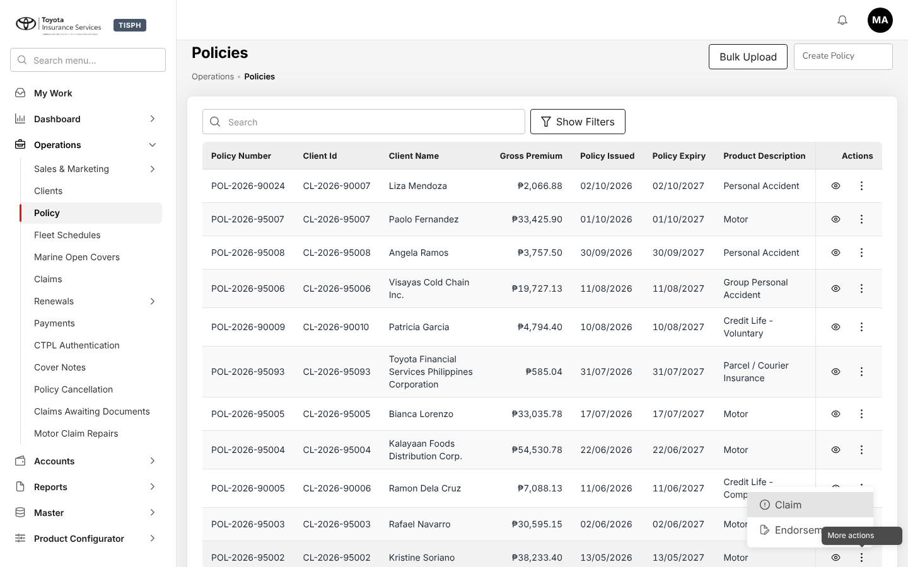
### Collection by Cash Control {#process-collection}
Cash Control (CCD) collects the premium of every bill. The work is split between the four Cash Control roles; each
role works only on its own part:

| Collection | Role | Screen |
|---|---|---|
| Over-the-counter payments, bank transfers, bills payment and QRPh | [CCD-BP / QRPh (Receipting) (chapter 12)](#ccd-bp-qrph-receipting) | [Receipts (18.1)](#verify-payments-and-post-official-receipts) |
| Post-dated cheques | [CCD-PDU (Post-Dated Cheques) (chapter 10)](#ccd-pdu-post-dated-cheques), [CCD-PDC / CCD-ADA (chapter 11)](#ccd-pdc-ccd-ada) | [Post-dated cheques (18.4)](#post-dated-cheques) |
| Auto-debit arrangements | [CCD-PDC / CCD-ADA (chapter 11)](#ccd-pdc-ccd-ada) | [Receipts (18.1)](#verify-payments-and-post-official-receipts) |
| Daily reconciliation, reversals and adjustments | [CCD-Recon (Reconciliation and Reversals) (chapter 13)](#ccd-recon-reconciliation-and-reversals) | [Bank reconciliation (18.15)](#bank-reconciliation), [Receipts (18.1)](#verify-payments-and-post-official-receipts) |

The roles that issue receipts do not cancel or reverse them: see [Reconciliation and reversals (3.7.3)](#process-reversals).

#### Official receipt for a payment {#process-official-receipt}
1. Choose Accounts > Receipts.
2. Select **Receipt**. The **Add Receipts** screen opens with today's date as **Receipt Date**.
3. In **Customer Code**, select the client. **Customer Name** is filled in.
4. In **Policy Number**, select the policy paid.
5. Keep **Transaction Code** at **OR – Official Receipt**.
6. In **Receipt Mode**, select how the client paid: **Dollar/Peso** (cash), **Cheque**, **Managers Check/Demand
   Draft**, **Direct Credit/Transfer to Account**, **Telegraphic Transfer**, **Authority to Debit** (auto-debit),
   **Online Banking** or **Credit Ticket-Inter Office**. A cheque asks for the cheque details.
7. Select **Record payment**.

The system issues the official receipt number, posts the payment (cash in the bank account of the receipt mode
against the premium receivable) and reduces the bill. When the bill is fully paid the policy's payment becomes
**Completed**. Print the receipt or e-mail it to the client from the confirmation.

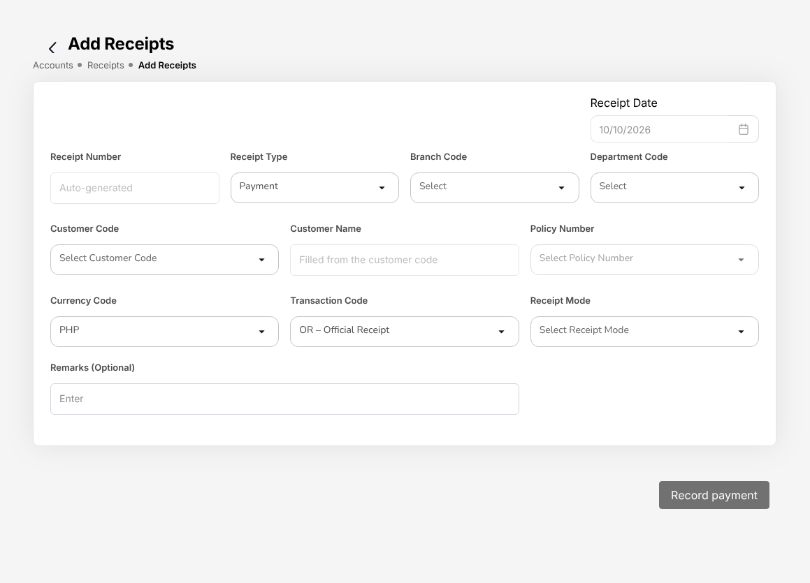
Collections received in a file (bills payment and QRPh settlement reports) are receipted together with
**Bulk Upload** on Receipts: each row pays a policy.

#### Post-dated cheques {#process-pdc}
A client who pays by post-dated cheques hands them to Cash Control. Nothing is posted until a cheque is deposited.

1. Choose Accounts > Post-Dated Cheques.
2. Select **Register cheque** and enter the bill or policy, the drawee bank, the cheque number, the cheque date
   (picked from the calendar), the amount and where the cheque is kept. The cheque is **On Hand**.
3. Cheques due within three days appear under **Deposit due**. On or after the cheque date, select **Deposit** and
   the bank account. The system creates and posts the official receipt.
4. When the bank clears the cheque, record it as cleared.
5. If the cheque bounces, record the bounce with the reason. The system cancels its receipt (the journal is reversed
   and the bill is open again) and informs Accounting and the client. Select **Replace** to register the new cheque.

**Return** gives a cheque back to the client; **Cancel** removes a cheque registered in error.

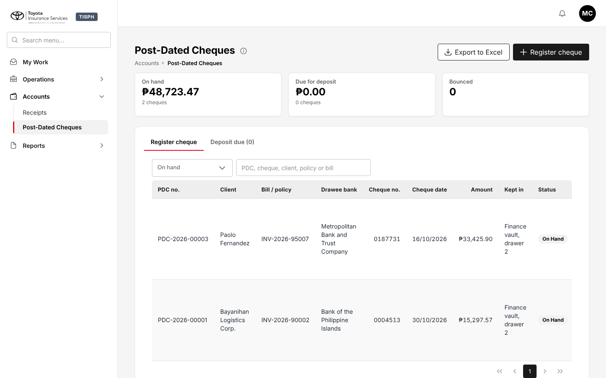
#### Reconciliation and reversals {#process-reversals}
Each day the bank statements are matched by CCD-Recon (Reconciliation and Reversals) or TIS Finance & General Accounting with the receipts on
[Bank reconciliation (18.15)](#bank-reconciliation), and the reconciliation is approved by TIS Finance & General Accounting.

Receipts are never cancelled on the Receipts screen, which has no cancel action. The receipt of a cheque that the
bank returns is cancelled by CCD-Recon (Reconciliation and Reversals): on the Reconciliation Workspace (adjustment
**RCHQ – Returned cheque**) or, for a post-dated cheque, by recording the bounce on Post-Dated Cheques. The payment
journals are reversed and the bill is open again. Any other receipt issued in error is reported to CCD-Recon, who
corrects it with TIS Finance & General Accounting. The user who issued a receipt never reverses it; the
segregation-of-duties rule **Receipting and reversals** warns when one person holds both roles.

Premium warranty extensions, instalment plans and client credit limits are handled on
[Credit control (18.3)](#credit-control) and approved by TIS Finance & General Accounting.

### Remittance to the insurers {#process-remittance}
Remittances to the insurers are prepared and submitted by CCD-Recon (Reconciliation and Reversals) or TIS Finance & General Accounting, and approved by
TIS Finance & General Accounting or TIS General Manager within their approval limit, never by the user who prepared or submitted them. See
[Remittance to insurers (18.9)](#remittance-to-insurers).

TISPH collects the premium from the client and remits it to the insurer net of its commission: the remittance pays
the premium collected, less the commission and the output VAT on it, plus the withholding tax the insurer deducts
from the commission. For an insurer and product remitted gross, the whole premium is remitted and the commission is
billed to the insurer separately on [Insurer billing (18.10)](#direct-bill-commission-debit-notes).

1. Every Monday at 06:15 the weekly run creates the draft remittances of the policies paid in the Monday to Friday
   before, one per insurer and product line ([Setup: remittance schedules (18.9.7)](#remittance-schedules)). An off-cycle
   remittance is created from a list of policies with
   [Import policy list (18.9.2)](#remittance-import-policy-list).
2. Choose Accounts > Remittance > Remittances. On **My work**, check each draft (policies and amounts), tick it and
   select **Submit for approval (n)**.
3. The approver decides on Accounts > Remittance > Approvals: **Approve**, or **Reject** with a reason, which
   returns the remittance to its maker as **Returned**.
4. The approved remittance is settled on Accounts > Remittance > Settlement. The approved settlement
   raises the insurer's payment voucher on [Disbursement (18.7)](#disbursement-payment-vouchers-and-cheques) and the
   remittance shows **Settled (voucher raised)**.
5. The voucher is paid from [Insurer payments (18.9.5)](#insurer-payments): by a bank payment batch on
   [Bank payment files (18.8)](#bank-payment-files) or by cheque on Disbursement. The payment posts the journal and the
   remittance reaches the step **Paid**.
6. The remittance schedule (XLSX and PDF) and, once the voucher is raised, the remittance advice are downloaded from
   the remittance and sent to the insurer.

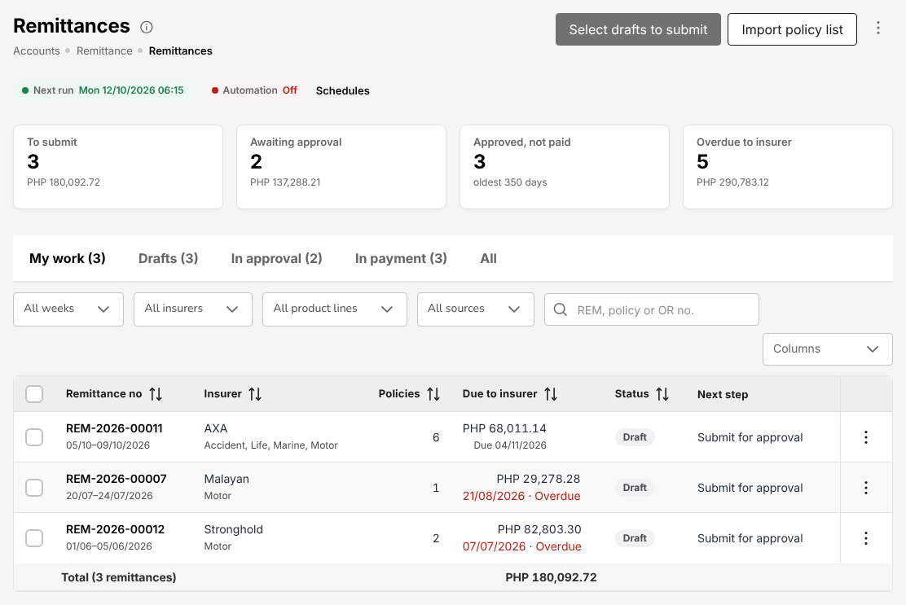
Each month the insurers' statements are matched with TISPH's records on
[Insurer statement reconciliation (18.16)](#insurer-statement-reconciliation); the reconciliation and its adjustments are
approved by CCD-Recon (Reconciliation and Reversals).

### Commission and incentives {#process-commission}
Commission is processed by TIS Finance & General Accounting. The telesales incentive is calculated by a
TIS Sales Unit Head user and approved by another user of that role: the user who runs a calculation never
approves it. See [Commission to agents and referrers (19.4)](#commission-to-agents-and-referrers) and
[Incentives (18.22)](#incentives).

TISPH earns its brokerage commission from the insurer: it is kept when the premium is remitted net, or billed to the
insurer for gross and direct-bill business.

TISPH shares part of the commission with the agents, sub-agents and dealers who referred the business: the referrer
commission (shown as **Comsub** on the screens). The referrer commission lines of each policy move through four
statuses:

| Status | When |
|---|---|
| **Accrued** | At the booking of the policy |
| **Eligible** | When the client's premium is collected |
| **Approved** | When a user of Finance, other than the maker, approves the eligible lines (the accrual journal is posted) |
| **Paid** | When the approved lines are paid on a payment voucher, net of withholding tax |

To pay a referrer:

1. Choose Commission > Agents/Referrer Accounts and open the referrer.
2. Approve the **Eligible** lines.
3. Generate the payout: the approved lines go to a payment voucher on
   [Disbursement (18.7)](#disbursement-payment-vouchers-and-cheques), with the withholding tax of the referrer (5% for an
   individual, 10% for a company in the delivered setup).

When premium is returned (an endorsement or a cancellation), the referrer commission of a paid line is clawed back
from the referrer.

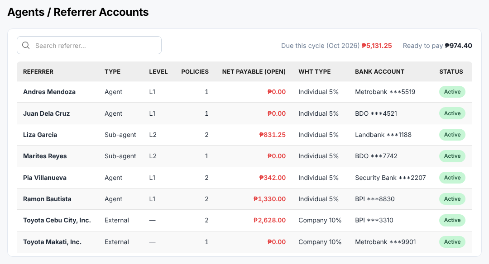
### Claims {#process-claims}
Claims are registered and followed up by the Operations roles or TIS General Manager. Claim decisions and settlement approvals are made by
TIS Operations Unit Head or TIS General Manager. See [Claims (17.13)](#the-claims-list).

TISPH registers the client's claim, advises the insurer and follows the claim up to the settlement; the insurer decides
and pays.

1. Choose Operations > Policy, select **More actions** on the policy, then **Claim**. The action is not available
   while the policy's payment is **Pending** or **Reviewing**.
2. Enter the date, time and place of the loss and the cause of loss (for a motor claim: own damage, theft, third
   party property damage and the other causes of the line), with the driver and vehicle for a motor claim.
3. Save the claim. The claim is **Pending**. The system refuses a claim on a policy whose premium is unpaid or whose
   loss date is outside the policy period, and sends the Preliminary Loss Advice to the insurer by e-mail.
4. Collect the claim documents of the checklist of the line; claims still missing documents are listed on
   [Claims awaiting documents (17.22)](#claims-awaiting-documents). The claim goes **Processing** while the insurer reviews
   it.
5. Record the adjuster's report when it arrives.
6. For a motor claim, follow the repair on
   [Motor claim repairs and letters of authority (17.23)](#motor-claim-repairs-and-letters-of-authority): the shop's estimate,
   the insurer adjuster's decision, the letter of authority to the shop and the release of the vehicle.
7. Enter the settlement agreed by the insurer and submit it. The claim is **Pending Approval**.
8. The approver (TIS Operations Unit Head or TIS General Manager) approves or returns the settlement; the approver must be another user than
   the one who submitted it. As delivered, the approval also releases the settlement: the claim is **Settled** at once.
9. Close the claim when the claimant has been paid. A claim the insurer repudiates is **Rejected**, with a reason, and
   then closed.

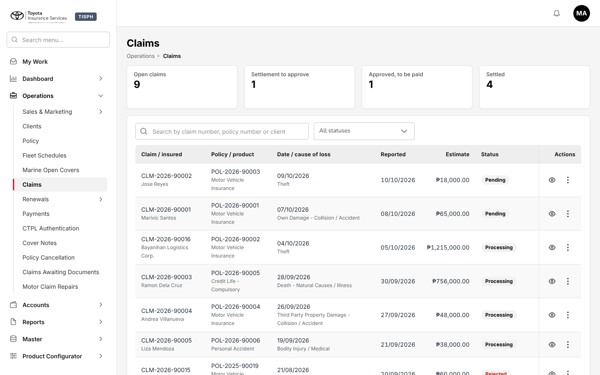
### Renewals {#process-renewals}
Renewals are prepared by the Sales roles, the Operations roles or TIS General Manager; renewal terms are approved by TIS Sales Officer, TIS Sales Unit Head, TIS Operations Unit Head or TIS General Manager. See
[Renewal Queue (17.16)](#renewal-queue-and-at-risk-policies).

Policies come into the renewal pipeline 90 days before their expiry.

1. Choose Operations > Renewals > Renewal Queue. The queue lists the policies due for renewal with their stage, their risk of not
   renewing and the account executive.
2. Send the renewal notices in order (**First Notice Sent**, **Second Notice Sent**, **Final Notice Sent**), one by one
   or for many policies at once with [Renewal Batch (17.15)](#renewal-batch-lapse-management-and-the-analytics).
3. Prepare the renewal terms: open the policy on [Renewal Policy (17.14)](#renewal-policy) and complete the renewal (cover,
   dates, premium). The renewal quotation is linked to the expiring policy, is valid for 30 days and is sent to the
   client: the renewal is **Quote Sent**. Price and cover discussions with the client or the insurer are followed on
   [Negotiations (17.18)](#negotiations).
4. When the terms are agreed, select **Submit for approval** on Negotiations. The renewal is **Pending Approval**.
5. The approver (TIS Sales Officer, TIS Sales Unit Head, TIS Operations Unit Head or TIS General Manager) approves the terms (**Approved**) or returns them (back to
   **Quote Sent**, to revise); the approver must be another user than the one who submitted them.
6. With the terms approved and accepted by the client, the renewal is completed like a new policy: placement slip,
   insurer's e-policy, check against the slip and booking. The booked policy is **Renewed** and its bill is collected
   by Cash Control.

A policy not renewed by its expiry stays **In Grace Period** for 30 days and is then **Lapsed**; a lapsed policy can
still be renewed within 90 days on [Lapse Management (17.15)](#renewal-batch-lapse-management-and-the-analytics).

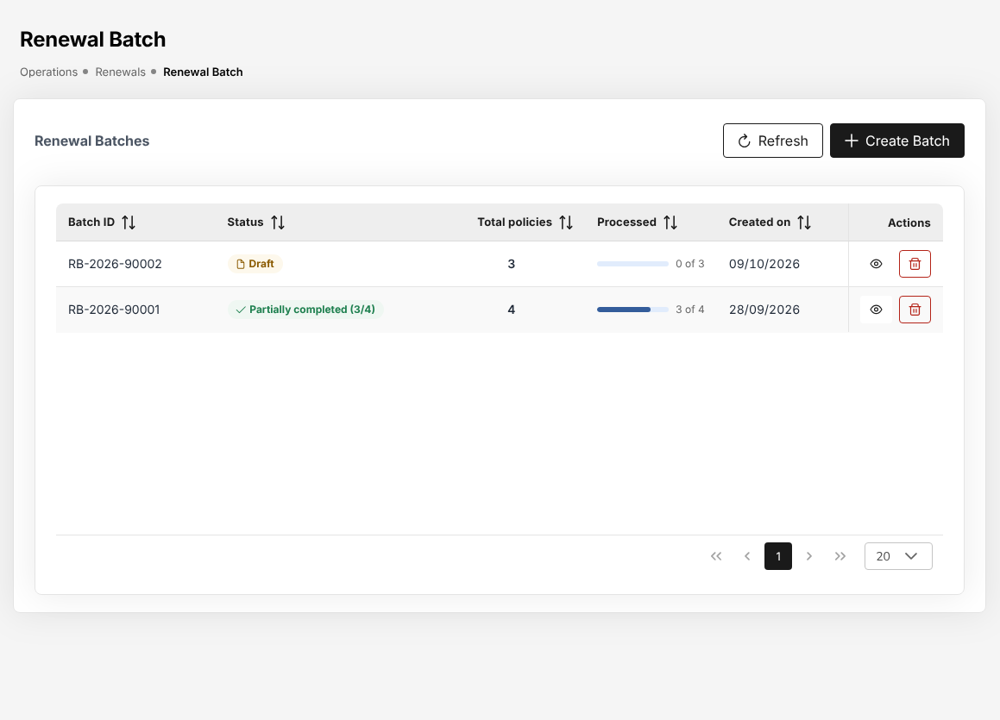
### Month-end and tax {#process-month-end}
The month-end and year-end steps and the BIR returns are run by TIS Finance & General Accounting; the close is approved by
TIS Finance & General Accounting. See [Period end (18.20)](#period-end) and [Tax: BIR forms and returns (18.17)](#tax-bir-forms-and-returns).

The TISPH fiscal year runs from April to March (FY2027: 01/04/2026 to 31/03/2027), with twelve monthly periods and an
adjustment period 13.

#### Every day {#process-daily}
- The day's journals are sent to SAP in the [SAP GL export (18.12)](#sap-gl-export) file.
- Cash Control reconciles the bank accounts (see [Reconciliation and reversals (3.7.3)](#process-reversals)).

#### Month-end {#process-month-end-close}
1. Make sure the month's work is posted: receipts, remittances, payment vouchers, commission, journal vouchers.
2. Finish the bank reconciliations of the month and have them approved.
3. Choose Accounts > Period End > Month-End Close and select **New close run** for the period.
4. Execute the run: the accruals, the recurring journals, the commission deferral, the revaluation and the close
   checklist. Executing again first reverses the run's own journals, so the result is the same.
5. Sign off the manual items of the checklist and submit the run.
6. A second user of TIS Finance & General Accounting approves the run. The period is **Closed**.

A period can first be **Soft-closed** on Accounts > Period End > Period Management: only TIS Finance & General Accounting can
then still post into it. Closing and reopening a period need a reason. A period becomes **Locked** only with the
year-end close.

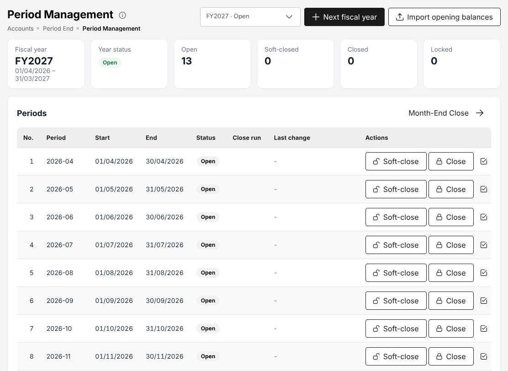
#### BIR returns {#process-bir}
The BIR forms and returns are prepared on Accounts > Tax from the payment vouchers and the ledger:

| Return | When | Screen |
|---|---|---|
| BIR Form 2307 to suppliers | With each payment subject to withholding | [BIR Form 2307 for suppliers (18.6)](#bir-form-2307-for-suppliers) |
| VAT Summary, SAWT, SLSP Sales and Purchases | Each quarter | [Tax: BIR forms and returns (18.17)](#tax-bir-forms-and-returns) |

#### Year-end {#process-year-end}
After the twelve periods are closed, a user of TIS Finance & General Accounting starts the year-end close on
[Year-end close (18.21)](#year-end-close-preparer). The pre-checks must pass (periods closed, no unposted journal in the year,
suspense account nil, trial balance balanced, closing accounts set up, previous year closed); the adjustments of
period 13 are posted and approved. A user of TIS Finance & General Accounting other than the one who started the run then
closes the year: the system posts the closing entries, carries the balances forward as the opening balances of the
next year, locks the year and creates the next one.

## TIS Sales Associate {#tis-sales-associate}
### Role summary {#tis-sales-associate-summary}
**Department:** Sales. Leads, clients, quotations, placements, policies, endorsements and renewals; no approvals.

The TIS Sales Associate is the account executive who turns a lead into a policy. You work the prospects referred by
Toyota Financial Services (TFS), the Toyota dealers and walk-in clients, quote them, follow the client's answer, and
see the business through placement with the panel insurer up to the booked policy. You keep your clients' records,
raise the endorsements they ask for and follow up their renewals.

You work with the TIS Sales Officer and the TIS Sales Unit Head, who assign the prospects, check the insurer's
e-policy against the placement slip and approve your renewal terms, and with the TIS Operations roles, who share the
placement and policy work and handle the claims. Cash Control collects the premiums of the policies you book. You
approve nothing: every decision on your work is made by another user.

### Menus available {#tis-sales-associate-menus}
The menus of this role as delivered. Access: View (open and read), Create and edit (enter and change records), Approve (decide the records of other users).

| Menu | Screen | Access |
|---|---|---|
| My Work | My Work | View |
| Dashboard | Executive Dashboard | View |
| Operations > Sales & Marketing | Prospects | Create and edit |
| Operations > Sales & Marketing | Quick Quote | Create and edit |
| Operations > Sales & Marketing | Requests for Quotation | Create and edit |
| Operations > Sales & Marketing | Quotations | Create and edit |
| Operations > Sales & Marketing | Placement Slips | Create and edit |
| Operations > Sales & Marketing | Lead Assignment | View |
| Operations > Sales & Marketing | Dealer Programmes | View |
| Operations > Sales & Marketing | Sales Activities | Create and edit |
| Operations | Clients | Create and edit |
| Operations | Policy | Create and edit |
| Operations | Fleet Schedules | Create and edit |
| Operations | Marine Open Covers | Create and edit |
| Operations | Claims | View |
| Operations > Renewals | Renewal Policy | Create and edit |
| Operations > Renewals | Renewal Batch | Create and edit |
| Operations > Renewals | Renewal Queue | Create and edit |
| Operations > Renewals | Lock-in Accounts | Create and edit |
| Operations > Renewals | Negotiations | Create and edit |
| Operations > Renewals | Lapse Management | Create and edit |
| Operations | Payments | Create and edit |
| Operations | Cover Notes | Create and edit |
| Operations | Policy Cancellation | Create and edit |
| Accounts | Receipts | View |
| Accounts | Collections | View |
| Accounts > Incentive | My Programs | View |
| Accounts > Incentive | Statement | View |
| Commission | Commission Dashboard | View |
| Reports | All Reports | View |
| Reports > Operational Reports | Production | View |
| Reports > Operational Reports | Claims | View |
| Reports > Operational Reports | Renewal | View |
| Reports > Operational Reports | Remittance | View |
| Reports > Operational Reports | Broker Commission | View |
| Reports > Operational Reports | Dealer Production | View |
| Reports | Report Builder | View |
| Master > Insurance | Distribution Channels | View |
| Product Configurator | Dashboard | View |
| Product Configurator | Product Templates | View |

### What you can view, change and approve {#tis-sales-associate-access}
Where: the screens of your menus that show the module. A module without a screen of its own is seen inside the screens of other modules (for example the remittance status of a policy).

| Area | Module | Access | What it allows | Where |
|---|---|---|---|---|
| Sales & Marketing | Prospects and leads | View | See prospects and leads | Prospects and Quick Quote |
| Sales & Marketing | Prospects and leads | Create and edit | Create and edit prospects and leads |  |
| Sales & Marketing | Quotations and placement | View | See quotations, requests for quotation, placement slips and comparison reports | Quick Quote, Requests for Quotation, Quotations and Placement Slips |
| Sales & Marketing | Quotations and placement | Create and edit | Create quotations (Quick Quote too), send requests for quotation, prepare placement slips |  |
| Sales & Marketing | Lead assignment | View | See assignment rules, the reassignment queue and every team's prospects | Lead Assignment |
| Sales & Marketing | Dealer programmes | View | See brand-new vehicle programmes and dealer sales uploads; print bank endorsement letters | Dealer Programmes |
| Sales & Marketing | Marketing campaigns | View | See campaigns, segments, templates and results | No screen of its own |
| Sales & Marketing | Sales activities | View | See activity timelines and the activity report | Sales Activities |
| Sales & Marketing | Sales activities | Create and edit | Log, change and cancel calls, meetings, e-mails and visits |  |
| Operations | Clients | View | See clients | Clients |
| Operations | Clients | Create and edit | Create and edit clients |  |
| Operations | Policies | View | See policies, cover notes, payments and CTPL authentication | Policy, Payments and Cover Notes |
| Operations | Policies | Create and edit | Record and issue policies, cover notes and CTPL certificates |  |
| Operations | Endorsements and cancellations | View | See endorsements and cancellations | Policy Cancellation |
| Operations | Endorsements and cancellations | Create and edit | Request and process endorsements and cancellations |  |
| Operations | Renewals | View | See renewals | Renewal Policy, Renewal Batch, Renewal Queue, Lock-in Accounts, Negotiations and Lapse Management |
| Operations | Renewals | Create and edit | Prepare renewals and renewal terms |  |
| Operations | Claims | View | See claims | Claims |
| Operations | Fleet schedules | View | See fleet schedules and print the schedule of vehicles | Fleet Schedules |
| Operations | Fleet schedules | Create and edit | Prepare and issue fleet schedules; add or delete vehicles by endorsement |  |
| Operations | Marine open covers | View | See open covers, certificates and declarations; print certificates | Marine Open Covers |
| Operations | Marine open covers | Create and edit | Set up open covers, issue certificates, submit and bill declarations |  |
| Accounts | Receipts | View | See receipts and post-dated cheques | Receipts |
| Accounts | Collections and credit control | View | See collections, instalment plans and credit limits | Collections |
| Accounts | Remittance and insurer reconciliation | View | See remittances to insurers and insurer statements | No screen of its own |
| Accounts | Incentives | View | See incentive programmes, calculations and statements | My Programs and Statement |
| Commission | Commission | View | See commission, referrer accounts and insurer overrides | Commission Dashboard |
| Reports | Reports | View | Run and download reports | Production, Claims, Renewal, Remittance, Broker Commission, Dealer Production and Report Builder |
| Product Configurator | Products | View | See products and product templates | Dashboard and Product Templates |
| Master data and configuration | Reference masters | View | See reference masters | No screen of its own |
| Master data and configuration | Distribution channels | View | See dealers, financing banks, affinity partners and their production | Distribution Channels |
| Master data and configuration | Schedules | View | See scheduled jobs and their runs | No screen of its own |
| Master data and configuration | Integrations | View | See connectors and the integration outbox and inbox | No screen of its own |
| Basic and special access | Basic access | View | Own profile and the look-up lists of every form | No screen of its own |
| Basic and special access | Full personal data | Special | See TIN, government ID numbers, mobile, e-mail, bank account and birth date unmasked on screens and exports | No screen of its own |

### Approvals {#tis-sales-associate-approvals}
This role approves nothing.

Who approves the work of this role:

| Work | Approval | Approved by |
|---|---|---|
| Policies | Decide the check of a placement against the slip, and complete the cancellations and return premiums of another user | TIS Sales Officer, TIS Sales Unit Head, TIS Operations Unit Head or TIS General Manager |
| Quotations and placement | Approve a quotation created by another user | TIS Sales Officer, TIS Sales Unit Head, TIS Operations Unit Head or TIS General Manager |
| Renewals | Approve or return renewal terms of another user | TIS Sales Officer, TIS Sales Unit Head, TIS Operations Unit Head or TIS General Manager |
| Accounts > Remittance > Approvals | Remittance approval within the approver's limit | TIS Finance & General Accounting or TIS General Manager |
| Accounts > Remittance > Approvals (settlement, adjustment, transfer) | Remittance settlement, adjustment and transfer within the approver's limit | TIS Finance & General Accounting or TIS General Manager |
| Operations > Sales & Marketing > Quotations > Underwriting referral | Underwriting referral approval within the approver's limit | TIS Operations Unit Head |

The user who enters a record never approves it: the approval is always another user's.

### Segregation of duties {#tis-sales-associate-sod}
| Rule | Conflict | When given together | Reason |
|---|---|---|---|
| Administration and transactions | Policies (create and edit), Quotations and placement (create and edit) with Users (create and edit), Roles (create and edit), Access control (create and edit) held by the same person | Warning | The person who administers users and access should not enter business or accounting transactions |
| Placing and paying insurers | Quotations and placement (create and edit), Policies (create and edit) with Remittance and insurer reconciliation (create and edit), Disbursements and petty cash (create and edit) held by the same person | Warning | The person who places business with an insurer should not also prepare the payments to insurers |
| Receipting and selling | Quotations and placement (create and edit), Policies (create and edit) with Receipts (create and edit) held by the same person | Warning | The person who issues receipts and posts cash should not also sell or issue the policies paid for |

These are the delivered rules. The rules in force are on Master > Users and Access > Segregation of Duties.

### Daily and periodic tasks {#tis-sales-associate-tasks}
| Task | When | Screen |
|---|---|---|
| Work through your prospects, quotations, placement slips and renewals | Every morning and through the day | [My Work (2.3)](#my-work) |
| Contact the new prospects assigned to you and log each call, meeting, e-mail or visit | Daily | [Prospects (17.1)](#prospects), [Sales Activities (17.8)](#sales-activities) |
| Record walk-in clients and referrals as prospects | As they come in | [Prospects (17.1)](#prospects) |
| Prepare motor and package quotations and send them to the client | Daily | [Quotations (17.4)](#quotations), [Quick Quote (17.2)](#quick-quote) |
| Record the client's answer to a quotation | As the client answers | [Quotations (17.4)](#quotations) |
| Ask the panel insurers for terms on fleet and corporate risks | As needed | [Requests for Quotation (17.3)](#requests-for-quotation-broker-slips) |
| Send the placement slips, record the acknowledgements and upload the e-policies | Daily | [Placement Slips (17.5)](#placement-slips) |
| Book the policies checked against the slip | Daily | [Placement Slips (17.5)](#placement-slips) |
| Issue cover notes and CTPL certificates while the insurer's policy is pending | As needed | [Cover Notes (17.20)](#cover-notes-binders) |
| Raise the endorsements and cancellations your clients ask for | As requested | [Policy (17.10)](#policies), [Policy Cancellation (17.21)](#cancel-a-policy-computed-return-premium) |
| Send the renewal notices and prepare the renewal terms | Weekly, for policies expiring in the next 90 days | [Renewal Queue (17.16)](#renewal-queue-and-at-risk-policies), [Negotiations (17.18)](#negotiations) |
| Follow up policies in their grace period and lapsed policies | Weekly | [Lapse Management (17.15)](#renewal-batch-lapse-management-and-the-analytics) |
| Check your pipeline and your incentive progress | Weekly and at month-end | [Incentive (18.22)](#incentives) |

### Procedures {#tis-sales-associate-procedures}
#### Start the day from My Work {#tis-sales-associate-my-work}
1. Choose **My Work**. **Mine** lists the records you own.
2. Select a category on the left (**Quotations**, **Requests for quotation**, **Placement slips**, **Renewals**,
   **Endorsements**) to narrow the list. The **Next action** column says what each record waits for, for example
   "Obtain and upload the e-policy" or "Follow up the client".
3. Select the arrow at the end of a row to open the record on its screen.

See [My Work (2.3)](#my-work) for the filters, tasks and calendar.

#### Work a new prospect {#tis-sales-associate-prospect}
A prospect from TFS or a dealer reaches you through the assignment rules of [Lead Assignment (17.6)](#lead-assignment): it
appears in My Work and you receive a notification. When no rule matches a prospect, it stays with the user who
created it. A walk-in client or a referral you record yourself is yours.

1. Choose Operations > Sales & Marketing > Prospects. To record a new prospect, select **Create Prospect** and follow
   [Create a prospect (17.1.1)](#create-a-prospect).
2. Contact the prospect. Choose Operations > Sales & Marketing > Sales Activities and log the call, meeting, e-mail or visit with its
   outcome and, where there is one, the next step and its follow-up date. Logging the first activity marks a
   **New** prospect **Contacted**.
3. When the prospect wants cover, prepare the quotation (next procedure). The prospect becomes **Quote Generated**.
4. If the prospect does not go ahead, set it to **Lost**.

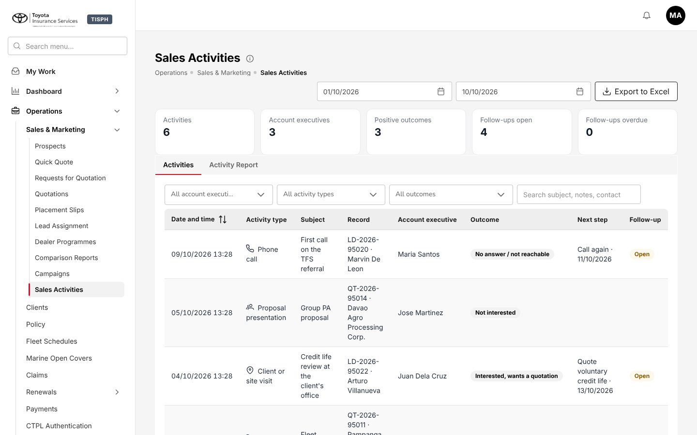
Open follow-ups are counted on the Sales Activities screen; follow them up on the date you set.

#### Quote and close the sale {#tis-sales-associate-quotation}
1. Choose Operations > Sales & Marketing > Quotations and select **Create Quote**, or use Operations > Sales & Marketing > Quick Quote for a package
   product priced from its rates in one screen. See [Create a motor quotation (17.4.1)](#create-a-motor-quotation) for the
   fields of a motor quotation.
2. Save the quotation. It is **Draft**.
3. Open the quotation (**View Details**, the eye icon) and select **Send for Customer Approval**. The status becomes **Pending Customer**
   and the client receives the quotation by e-mail with its approval link.
4. When the client answers by phone, e-mail or in person, open the quotation and select **Record customer response**.
   On acceptance the status becomes **Customer Accepted** and the system raises the placement slip at once
   (**Placement raised**).

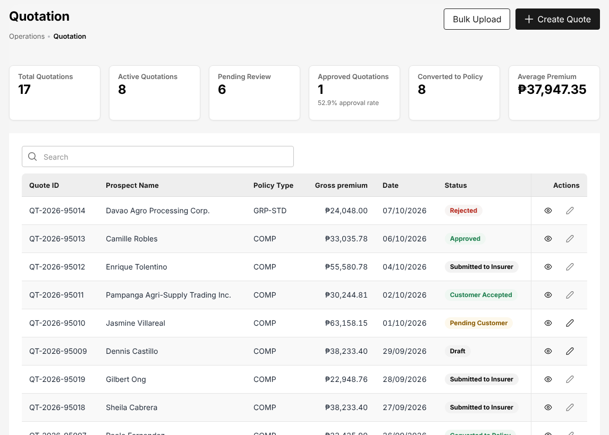
> A quotation referred by an acceptance rule of the product shows **Referred: awaiting approval**. It cannot be sent
> to the client, placed or issued until the TIS Operations Unit Head approves the referral.

For a risk that needs the insurers' own terms, send a request for quotation to the panel insurers first: see
[Request for quotation to the panel insurers (3.4.3)](#process-rfq).

#### Place the business and book the policy {#tis-sales-associate-placement}
1. Choose Operations > Sales & Marketing > Placement Slips and open the placement slip of the quotation (**Placement raised**).
2. Select **Send to insurer(s)**. The status becomes **Sent to insurer**.
3. When the insurer confirms the order, select **Record acknowledgement** and enter the insurer's reference
   (**Acknowledged**).
4. When the e-policy arrives, select **Upload e-policy**, attach the file and enter what it says. For a motor policy
   the chassis, engine and plate (or MV file) numbers must be those of the e-policy. The status becomes
   **e-Policy received**.
5. Wait for the check: a TIS Sales Officer, TIS Sales Unit Head, TIS Operations Unit Head or TIS General Manager, other
   than you, compares the e-policy with the slip and confirms it (**Checked against slip**) or returns it to the
   insurer. You can open **Check against slip** to see the differences, but the decision is not yours.
6. Open the checked placement slip and select **Book (Insurer issued)**. Complete the client's ID details if the
   client file lacks them and confirm.

Booking creates the policy and its bill, and e-mails the policy schedule with the e-policy to the client. The
placement becomes **Insurer issued (Booked)** and the quotation **Converted to Policy**. See
[Placement Slips (17.5)](#placement-slips) and [Book the policy (3.6.1)](#process-booking).

#### Raise an endorsement for your client {#tis-sales-associate-endorsement}
1. Choose Operations > Policy.
2. In the row of the policy, select **More actions** (the three dots), then **Endorsement**. The action is not offered
   while the policy's payment is **Pending** or **Reviewing**, or once the policy has expired, lapsed, was cancelled or
   renewed.
3. Enter the change, upload the endorsement document and complete the endorsement.

An endorsement that adds premium is billed to the client at once. An endorsement that returns premium, and a
cancellation, is completed by a TIS Sales Officer, TIS Sales Unit Head, TIS Operations Unit Head or TIS General
Manager. See [Raise an endorsement request (17.10.1)](#raise-an-endorsement-request) and
[Endorsements and cancellations (3.6.3)](#process-endorsement).

#### Renew your clients' policies {#tis-sales-associate-renewal}
Policies enter the renewal pipeline 90 days before they expire.

1. Choose Operations > Renewals > Renewal Queue. Filter on your name in **All account executives**.
2. In the row of a policy, select **More actions** and send the next notice: **Send First Notice**, then
   **Send Second Notice**, then the final notice. The notices go in this order. Use **Record reminder** for a
   reminder given by phone or in person.
3. Prepare the renewal terms on [Renewal Policy (17.14.1)](#renew-a-policy). The renewal quotation is valid for 30 days and is
   sent to the client (**Quote Sent**).
4. Choose Operations > Renewals > Negotiations, select **View** on the renewal and record the discussions with
   **Log communication** or **Add update**.
5. When the terms are agreed, select **Submit for approval**. The renewal is **Pending Approval** until another user
   approves or returns the terms; returned terms come back to **Quote Sent** for you to revise.
6. Once the terms are approved and the client accepts, the renewal goes through placement like a new policy.

A policy not renewed by its expiry stays **In Grace Period** for 30 days and is then **Lapsed**. See
[Renewals (3.11)](#process-renewals).

## TIS Sales Officer {#tis-sales-officer}
### Role summary {#tis-sales-officer-summary}
**Department:** Sales. As the Sales Associate, plus lead allocation, campaigns and approving the work of others.

The TIS Sales Officer leads a sales team. You do the work of the TIS Sales Associate on your own accounts and, for the
team, you keep the lead assignment rules, move prospects between account executives, prepare the e-mail campaigns to
clients and prospects, and make the checker's decisions of the sales chain: the check of the insurer's e-policy
against the placement slip, the renewal terms and the return premiums prepared by other users.

You work with the TIS Sales Associates of your team, with the TIS Sales Unit Head, who heads the unit, and with the TIS
Operations roles, who share the placement and policy work. You never decide a record you entered yourself: the
system refuses it and another approver decides it.

### Menus available {#tis-sales-officer-menus}
The menus of this role as delivered. Access: View (open and read), Create and edit (enter and change records), Approve (decide the records of other users).

| Menu | Screen | Access |
|---|---|---|
| My Work | My Work | View |
| Dashboard | Executive Dashboard | View |
| Operations > Sales & Marketing | Prospects | Create and edit |
| Operations > Sales & Marketing | Quick Quote | Create and edit |
| Operations > Sales & Marketing | Requests for Quotation | Create and edit |
| Operations > Sales & Marketing | Quotations | Approve |
| Operations > Sales & Marketing | Placement Slips | Approve |
| Operations > Sales & Marketing | Lead Assignment | Create and edit |
| Operations > Sales & Marketing | Dealer Programmes | View |
| Operations > Sales & Marketing | Sales Activities | Create and edit |
| Operations | Clients | Create and edit |
| Operations | Policy | Approve |
| Operations | Fleet Schedules | Create and edit |
| Operations | Marine Open Covers | Create and edit |
| Operations | Claims | View |
| Operations > Renewals | Renewal Policy | Approve |
| Operations > Renewals | Renewal Batch | Create and edit |
| Operations > Renewals | Renewal Queue | Create and edit |
| Operations > Renewals | Lock-in Accounts | Create and edit |
| Operations > Renewals | Negotiations | Approve |
| Operations > Renewals | Lapse Management | Create and edit |
| Operations | Payments | Create and edit |
| Operations | Cover Notes | Create and edit |
| Operations | Policy Cancellation | Create and edit |
| Accounts | Receipts | View |
| Accounts | Collections | View |
| Accounts > Incentive | My Programs | View |
| Accounts > Incentive | Statement | View |
| Commission | Commission Dashboard | View |
| Reports | All Reports | View |
| Reports > Operational Reports | Production | View |
| Reports > Operational Reports | Claims | View |
| Reports > Operational Reports | Renewal | View |
| Reports > Operational Reports | Remittance | View |
| Reports > Operational Reports | Broker Commission | View |
| Reports > Operational Reports | Dealer Production | View |
| Reports | Report Builder | View |
| Master > Insurance | Distribution Channels | View |
| Product Configurator | Dashboard | View |
| Product Configurator | Product Templates | View |

### What you can view, change and approve {#tis-sales-officer-access}
Where: the screens of your menus that show the module. A module without a screen of its own is seen inside the screens of other modules (for example the remittance status of a policy).

| Area | Module | Access | What it allows | Where |
|---|---|---|---|---|
| Sales & Marketing | Prospects and leads | View | See prospects and leads | Prospects and Quick Quote |
| Sales & Marketing | Prospects and leads | Create and edit | Create and edit prospects and leads |  |
| Sales & Marketing | Quotations and placement | View | See quotations, requests for quotation, placement slips and comparison reports | Quick Quote, Requests for Quotation, Quotations and Placement Slips |
| Sales & Marketing | Quotations and placement | Create and edit | Create quotations (Quick Quote too), send requests for quotation, prepare placement slips |  |
| Sales & Marketing | Quotations and placement | Approve | Approve a quotation created by another user |  |
| Sales & Marketing | Lead assignment | View | See assignment rules, the reassignment queue and every team's prospects | Lead Assignment |
| Sales & Marketing | Lead assignment | Create and edit | Maintain assignment rules and reassign prospects |  |
| Sales & Marketing | Dealer programmes | View | See brand-new vehicle programmes and dealer sales uploads; print bank endorsement letters | Dealer Programmes |
| Sales & Marketing | Marketing campaigns | View | See campaigns, segments, templates and results | No screen of its own |
| Sales & Marketing | Marketing campaigns | Create and edit | Prepare and send campaigns; maintain segments and templates |  |
| Sales & Marketing | Sales activities | View | See activity timelines and the activity report | Sales Activities |
| Sales & Marketing | Sales activities | Create and edit | Log, change and cancel calls, meetings, e-mails and visits |  |
| Operations | Clients | View | See clients | Clients |
| Operations | Clients | Create and edit | Create and edit clients |  |
| Operations | Policies | View | See policies, cover notes, payments and CTPL authentication | Policy, Payments and Cover Notes |
| Operations | Policies | Create and edit | Record and issue policies, cover notes and CTPL certificates |  |
| Operations | Policies | Approve | Decide the check of a placement against the slip, and complete the cancellations and return premiums of another user |  |
| Operations | Endorsements and cancellations | View | See endorsements and cancellations | Policy Cancellation |
| Operations | Endorsements and cancellations | Create and edit | Request and process endorsements and cancellations |  |
| Operations | Renewals | View | See renewals | Renewal Policy, Renewal Batch, Renewal Queue, Lock-in Accounts, Negotiations and Lapse Management |
| Operations | Renewals | Create and edit | Prepare renewals and renewal terms |  |
| Operations | Renewals | Approve | Approve or return renewal terms of another user |  |
| Operations | Renewals | Special | Reassign a renewal to another user or mark it not for renewal |  |
| Operations | Claims | View | See claims | Claims |
| Operations | Fleet schedules | View | See fleet schedules and print the schedule of vehicles | Fleet Schedules |
| Operations | Fleet schedules | Create and edit | Prepare and issue fleet schedules; add or delete vehicles by endorsement |  |
| Operations | Marine open covers | View | See open covers, certificates and declarations; print certificates | Marine Open Covers |
| Operations | Marine open covers | Create and edit | Set up open covers, issue certificates, submit and bill declarations |  |
| Accounts | Receipts | View | See receipts and post-dated cheques | Receipts |
| Accounts | Collections and credit control | View | See collections, instalment plans and credit limits | Collections |
| Accounts | Remittance and insurer reconciliation | View | See remittances to insurers and insurer statements | No screen of its own |
| Accounts | Incentives | View | See incentive programmes, calculations and statements | My Programs and Statement |
| Commission | Commission | View | See commission, referrer accounts and insurer overrides | Commission Dashboard |
| Reports | Reports | View | Run and download reports | Production, Claims, Renewal, Remittance, Broker Commission, Dealer Production and Report Builder |
| Product Configurator | Products | View | See products and product templates | Dashboard and Product Templates |
| Master data and configuration | Reference masters | View | See reference masters | No screen of its own |
| Master data and configuration | Distribution channels | View | See dealers, financing banks, affinity partners and their production | Distribution Channels |
| Master data and configuration | Schedules | View | See scheduled jobs and their runs | No screen of its own |
| Master data and configuration | Integrations | View | See connectors and the integration outbox and inbox | No screen of its own |
| Basic and special access | Basic access | View | Own profile and the look-up lists of every form | No screen of its own |
| Basic and special access | Full personal data | Special | See TIN, government ID numbers, mobile, e-mail, bank account and birth date unmasked on screens and exports | No screen of its own |

### Approvals {#tis-sales-officer-approvals}
This role approves the work of other users:

- Decide the check of a placement against the slip, and complete the cancellations and return premiums of another user
- Approve a quotation created by another user
- Approve or return renewal terms of another user

Who approves the work of this role:

| Work | Approval | Approved by |
|---|---|---|
| Policies | Decide the check of a placement against the slip, and complete the cancellations and return premiums of another user | TIS Sales Officer, TIS Sales Unit Head, TIS Operations Unit Head or TIS General Manager |
| Quotations and placement | Approve a quotation created by another user | TIS Sales Officer, TIS Sales Unit Head, TIS Operations Unit Head or TIS General Manager |
| Renewals | Approve or return renewal terms of another user | TIS Sales Officer, TIS Sales Unit Head, TIS Operations Unit Head or TIS General Manager |
| Accounts > Remittance > Approvals | Remittance approval within the approver's limit | TIS Finance & General Accounting or TIS General Manager |
| Accounts > Remittance > Approvals (settlement, adjustment, transfer) | Remittance settlement, adjustment and transfer within the approver's limit | TIS Finance & General Accounting or TIS General Manager |
| Operations > Sales & Marketing > Quotations > Underwriting referral | Underwriting referral approval within the approver's limit | TIS Operations Unit Head |

The user who enters a record never approves it: the approval is always another user's.

### Segregation of duties {#tis-sales-officer-sod}
| Rule | Conflict | When given together | Reason |
|---|---|---|---|
| Administration and transactions | Policies (create and edit), Quotations and placement (create and edit) with Users (create and edit), Roles (create and edit), Access control (create and edit) held by the same person | Warning | The person who administers users and access should not enter business or accounting transactions |
| Placing and paying insurers | Quotations and placement (create and edit), Policies (create and edit) with Remittance and insurer reconciliation (create and edit), Disbursements and petty cash (create and edit) held by the same person | Warning | The person who places business with an insurer should not also prepare the payments to insurers |
| Receipting and selling | Quotations and placement (create and edit), Policies (create and edit) with Receipts (create and edit) held by the same person | Warning | The person who issues receipts and posts cash should not also sell or issue the policies paid for |

These are the delivered rules. The rules in force are on Master > Users and Access > Segregation of Duties.

### Daily and periodic tasks {#tis-sales-officer-tasks}
| Task | When | Screen |
|---|---|---|
| Work through your own records and the work waiting for you | Every morning and through the day | [My Work (2.3)](#my-work) |
| Check the e-policies received against their placement slips | Daily | [Placement Slips (17.5)](#placement-slips) |
| Approve or return the renewal terms submitted by your team | Daily | [Negotiations (17.18)](#negotiations) |
| Complete the endorsements and cancellations that return premium, raised by other users | As notified | [Policy (17.10)](#policies), [Policy Cancellation (17.21)](#cancel-a-policy-computed-return-premium) |
| Check the team's open prospects and reassign those not worked | Daily | [Lead Assignment (17.6)](#lead-assignment) |
| Assign the prospects waiting in the reassignment queue | Daily | [Lead Assignment (17.6)](#lead-assignment) |
| Review the team's activities and open follow-ups | Weekly | [Sales Activities (17.8)](#sales-activities) |
| Keep the assignment rules in line with the team and the TFS offices | When the team or the channels change | [Lead Assignment (17.6)](#lead-assignment) |
| Review the team's pipeline, conversion and renewals | Weekly and at month-end | [Renewal Queue (17.16)](#renewal-queue-and-at-risk-policies) |

The sales work on your own accounts (prospects, quotations, placement, booking, endorsements, renewals) follows the
procedures of the [TIS Sales Associate (4.7)](#tis-sales-associate-procedures).

### Procedures {#tis-sales-officer-procedures}
#### Check an e-policy against the placement slip {#tis-sales-officer-epolicy-check}
The placement slips waiting for the check have the status **e-Policy received**. You cannot check an e-policy that
you uploaded yourself.

1. Choose Operations > Sales & Marketing > Placement Slips and select the count **e-Policy received** to list them.
2. Open the placement slip and select **Check against slip**. The dialog shows the insurer policy number, who recorded
   the e-policy and, for each item (premiums, sum insured, commission, dates, insured, chassis, engine and plate
   numbers), the slip, the e-policy, the difference and the result **Matches** or **Differs**.
3. Decide:
   - **Confirm check** when every item matches. Amounts within PHP 1.00 of the slip match.
   - **Accept differences** when the e-policy differs but is right. Enter the reason.
   - **Return to insurer** when the e-policy is wrong. Enter the reason. The lead insurer receives the differences by
     e-mail and the placement goes back to **Acknowledged** until the corrected e-policy is uploaded.

After **Confirm check** or **Accept differences** the placement is **Checked against slip** and can be booked. See
[Check the e-policy against the slip (3.5.1)](#process-epolicy-check).

#### Approve renewal terms {#tis-sales-officer-renewal-approval}
Renewal terms submitted by an account executive are **Pending Approval**. The approver must be another user than the
one who submitted them.

1. Choose Operations > Renewals > Negotiations and select the count **Pending approval**.
2. Select **View** on the renewal. The panel shows the product, insurer, expiry, current and proposed premium, the
   premium change and the timeline of the negotiation.
3. Check the proposed premium against the current one and the reasons in the timeline.
4. Select **Approve** to approve the terms, or **Reject** to return them to the account executive for revision.

Approved terms show **Approved**; the account executive then completes the renewal with the client. Returned terms
go back to **Quote Sent**. The account executive is notified of your decision.

> The renewal terms waiting for approval are listed in the My Work of the TIS Sales Unit Head and the TIS Operations
> Unit Head. As TIS Sales Officer you find them on Negotiations.

#### Complete a return of premium {#tis-sales-officer-returns}
An endorsement that returns premium, and a policy cancellation, is completed by an approver other than the user who
raised it. When one is raised, every approver receives the notification **Return premium** or **Cancellation** with
the endorsement number, the policy and the amount.

1. Select the bell and open the notification. The endorsement opens.
2. Check the change, the return premium and the endorsement document.
3. Complete the endorsement. The system applies the change and the return premium to the policy. Commission
   already paid on the returned premium is clawed back from the referrer.

See [Endorsements and cancellations (3.6.3)](#process-endorsement) and
[Cancel a policy: computed return premium (17.21)](#cancel-a-policy-computed-return-premium).

#### Reassign prospects {#tis-sales-officer-reassign}
1. Choose Operations > Sales & Marketing > Lead Assignment. The **Team View** tab lists the team members with their open, new,
   converted and lost prospects.
2. In the first list, select the account executive whose team you want to see, or keep **My team**. The
   **Prospects of the team** list shows each prospect with its status, line, territory, channel, account executive and
   assignment.
3. Select the prospects to move (tick box), or select the reassign icon at the end of a row. The clock icon shows the
   assignment history of the prospect.
4. In **To account executive**, choose the new account executive. The account executives of the assignment rule of
   the prospect are listed first.
5. In **Reason**, choose the reason of the reassignment and add a note where the reason asks for one.
6. Select **Reassign**. The new account executive is notified and the move is kept in the prospect's history.

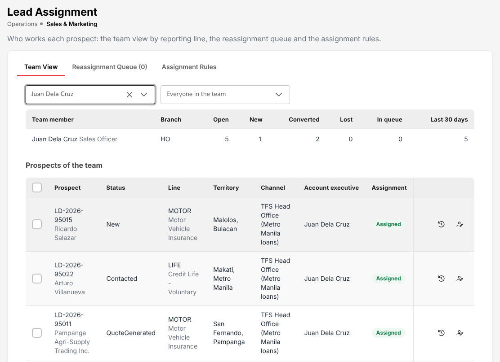
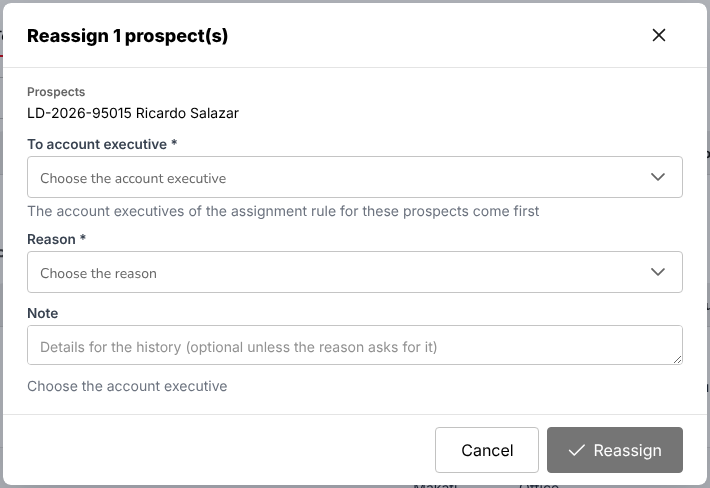
The **Reassignment Queue** tab lists the prospects waiting for an account executive, with the reason they are there
(for example, no active account executive in the matching rule). Assign them the same way.

#### Maintain the assignment rules {#tis-sales-officer-rules}
The first active rule, by priority, whose conditions match a new prospect gives it an account executive. A rule with
empty conditions matches every prospect. When no rule matches, the prospect stays with the user who created it.

1. Choose Operations > Sales & Marketing > Lead Assignment and open the **Assignment Rules** tab.
2. Select **Add rule**, or the pencil icon of a rule to change it.
3. Enter the name and the conditions: branch, line of business, product, lead source, category, distribution channel
   (for example **TFS Head Office (Metro Manila loans)** or a TFS branch), province and city. Choose the method:
   **Round robin** (the next account executive in turn), the account executive with the fewest open prospects, or
   always the first account executive. Select the account executives who receive the prospects.
4. Save the rule. Use the arrows to change its priority and the **Active** switch to stop or restart it.

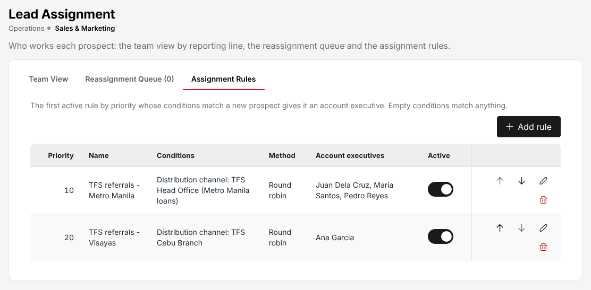
## TIS Sales Unit Head {#tis-sales-unit-head}
### Role summary {#tis-sales-unit-head-summary}
**Department:** Sales. As the Sales Officer, plus telesales incentives and supplier invoice approval.

The TIS Sales Unit Head heads the sales unit. You have every right of the TIS Sales Officer (the sales work, lead
assignment, campaigns and the checker's decisions of the sales chain) and, in addition, you run and approve the
telesales incentives of the sales force and approve the supplier invoices of the unit before they are posted.

You work with the TIS Sales Officers and TIS Sales Associates of the unit, with the TIS Operations Unit Head on the
renewals escalated to you, and with TIS Finance & General Accounting, who records the supplier invoices you approve
and pays them. You never decide a record you entered yourself.

### Menus available {#tis-sales-unit-head-menus}
The menus of this role as delivered. Access: View (open and read), Create and edit (enter and change records), Approve (decide the records of other users).

| Menu | Screen | Access |
|---|---|---|
| My Work | My Work | View |
| Dashboard | Executive Dashboard | View |
| Operations > Sales & Marketing | Prospects | Create and edit |
| Operations > Sales & Marketing | Quick Quote | Create and edit |
| Operations > Sales & Marketing | Requests for Quotation | Create and edit |
| Operations > Sales & Marketing | Quotations | Approve |
| Operations > Sales & Marketing | Placement Slips | Approve |
| Operations > Sales & Marketing | Lead Assignment | Create and edit |
| Operations > Sales & Marketing | Dealer Programmes | View |
| Operations > Sales & Marketing | Sales Activities | Create and edit |
| Operations | Clients | Create and edit |
| Operations | Policy | Approve |
| Operations | Fleet Schedules | Create and edit |
| Operations | Marine Open Covers | Create and edit |
| Operations | Claims | View |
| Operations > Renewals | Renewal Policy | Approve |
| Operations > Renewals | Renewal Batch | Create and edit |
| Operations > Renewals | Renewal Queue | Create and edit |
| Operations > Renewals | Lock-in Accounts | Create and edit |
| Operations > Renewals | Negotiations | Approve |
| Operations > Renewals | Lapse Management | Create and edit |
| Operations | Payments | Create and edit |
| Operations | Cover Notes | Create and edit |
| Operations | Policy Cancellation | Create and edit |
| Accounts | Receipts | View |
| Accounts | Collections | View |
| Accounts > Payables | Suppliers | View |
| Accounts > Payables | Supplier 2307 | View |
| Accounts | Disbursement | View |
| Accounts > Incentive | My Programs | View |
| Accounts > Incentive | Calculations | Approve |
| Accounts > Incentive | Approvals | Approve |
| Accounts > Incentive | Statement | View |
| Accounts > Incentive | Reports | Create and edit |
| Commission | Commission Dashboard | View |
| Reports | All Reports | View |
| Reports > Operational Reports | Production | View |
| Reports > Operational Reports | Claims | View |
| Reports > Operational Reports | Renewal | View |
| Reports > Operational Reports | Remittance | View |
| Reports > Operational Reports | Broker Commission | View |
| Reports > Operational Reports | Dealer Production | View |
| Reports | Report Builder | View |
| Master > Insurance | Distribution Channels | View |
| Product Configurator | Dashboard | View |
| Product Configurator | Product Templates | View |

### What you can view, change and approve {#tis-sales-unit-head-access}
Where: the screens of your menus that show the module. A module without a screen of its own is seen inside the screens of other modules (for example the remittance status of a policy).

| Area | Module | Access | What it allows | Where |
|---|---|---|---|---|
| Sales & Marketing | Prospects and leads | View | See prospects and leads | Prospects and Quick Quote |
| Sales & Marketing | Prospects and leads | Create and edit | Create and edit prospects and leads |  |
| Sales & Marketing | Quotations and placement | View | See quotations, requests for quotation, placement slips and comparison reports | Quick Quote, Requests for Quotation, Quotations and Placement Slips |
| Sales & Marketing | Quotations and placement | Create and edit | Create quotations (Quick Quote too), send requests for quotation, prepare placement slips |  |
| Sales & Marketing | Quotations and placement | Approve | Approve a quotation created by another user |  |
| Sales & Marketing | Lead assignment | View | See assignment rules, the reassignment queue and every team's prospects | Lead Assignment |
| Sales & Marketing | Lead assignment | Create and edit | Maintain assignment rules and reassign prospects |  |
| Sales & Marketing | Dealer programmes | View | See brand-new vehicle programmes and dealer sales uploads; print bank endorsement letters | Dealer Programmes |
| Sales & Marketing | Marketing campaigns | View | See campaigns, segments, templates and results | No screen of its own |
| Sales & Marketing | Marketing campaigns | Create and edit | Prepare and send campaigns; maintain segments and templates |  |
| Sales & Marketing | Sales activities | View | See activity timelines and the activity report | Sales Activities |
| Sales & Marketing | Sales activities | Create and edit | Log, change and cancel calls, meetings, e-mails and visits |  |
| Operations | Clients | View | See clients | Clients |
| Operations | Clients | Create and edit | Create and edit clients |  |
| Operations | Policies | View | See policies, cover notes, payments and CTPL authentication | Policy, Payments and Cover Notes |
| Operations | Policies | Create and edit | Record and issue policies, cover notes and CTPL certificates |  |
| Operations | Policies | Approve | Decide the check of a placement against the slip, and complete the cancellations and return premiums of another user |  |
| Operations | Endorsements and cancellations | View | See endorsements and cancellations | Policy Cancellation |
| Operations | Endorsements and cancellations | Create and edit | Request and process endorsements and cancellations |  |
| Operations | Renewals | View | See renewals | Renewal Policy, Renewal Batch, Renewal Queue, Lock-in Accounts, Negotiations and Lapse Management |
| Operations | Renewals | Create and edit | Prepare renewals and renewal terms |  |
| Operations | Renewals | Approve | Approve or return renewal terms of another user |  |
| Operations | Renewals | Special | Reassign a renewal to another user or mark it not for renewal |  |
| Operations | Claims | View | See claims | Claims |
| Operations | Fleet schedules | View | See fleet schedules and print the schedule of vehicles | Fleet Schedules |
| Operations | Fleet schedules | Create and edit | Prepare and issue fleet schedules; add or delete vehicles by endorsement |  |
| Operations | Marine open covers | View | See open covers, certificates and declarations; print certificates | Marine Open Covers |
| Operations | Marine open covers | Create and edit | Set up open covers, issue certificates, submit and bill declarations |  |
| Accounts | Receipts | View | See receipts and post-dated cheques | Receipts |
| Accounts | Collections and credit control | View | See collections, instalment plans and credit limits | Collections |
| Accounts | Disbursements and petty cash | View | See payment vouchers, petty cash and bank payment files | Disbursement |
| Accounts | Payables | View | See suppliers, supplier invoices and payments, AP ageing | Suppliers and Supplier 2307 |
| Accounts | Payables | Approve | Approve supplier invoices (not the preparer) |  |
| Accounts | Remittance and insurer reconciliation | View | See remittances to insurers and insurer statements | No screen of its own |
| Accounts | Incentives | View | See incentive programmes, calculations and statements | My Programs, Calculations, Approvals, Statement and Reports |
| Accounts | Incentives | Create and edit | Calculate, submit and pay incentives |  |
| Accounts | Incentives | Approve | Approve or reject an incentive calculation batch submitted by another user |  |
| Commission | Commission | View | See commission, referrer accounts and insurer overrides | Commission Dashboard |
| Reports | Reports | View | Run and download reports | Production, Claims, Renewal, Remittance, Broker Commission, Dealer Production and Report Builder |
| Product Configurator | Products | View | See products and product templates | Dashboard and Product Templates |
| Master data and configuration | Reference masters | View | See reference masters | No screen of its own |
| Master data and configuration | Distribution channels | View | See dealers, financing banks, affinity partners and their production | Distribution Channels |
| Master data and configuration | Schedules | View | See scheduled jobs and their runs | No screen of its own |
| Master data and configuration | Integrations | View | See connectors and the integration outbox and inbox | No screen of its own |
| Basic and special access | Basic access | View | Own profile and the look-up lists of every form | No screen of its own |
| Basic and special access | Full personal data | Special | See TIN, government ID numbers, mobile, e-mail, bank account and birth date unmasked on screens and exports | No screen of its own |

### Approvals {#tis-sales-unit-head-approvals}
This role approves the work of other users:

- Approve or reject an incentive calculation batch submitted by another user
- Approve supplier invoices (not the preparer)
- Decide the check of a placement against the slip, and complete the cancellations and return premiums of another user
- Approve a quotation created by another user
- Approve or return renewal terms of another user

Who approves the work of this role:

| Work | Approval | Approved by |
|---|---|---|
| Incentives | Approve or reject an incentive calculation batch submitted by another user | TIS Sales Unit Head |
| Policies | Decide the check of a placement against the slip, and complete the cancellations and return premiums of another user | TIS Sales Officer, TIS Sales Unit Head, TIS Operations Unit Head or TIS General Manager |
| Quotations and placement | Approve a quotation created by another user | TIS Sales Officer, TIS Sales Unit Head, TIS Operations Unit Head or TIS General Manager |
| Renewals | Approve or return renewal terms of another user | TIS Sales Officer, TIS Sales Unit Head, TIS Operations Unit Head or TIS General Manager |
| Accounts > Remittance > Approvals | Remittance approval within the approver's limit | TIS Finance & General Accounting or TIS General Manager |
| Accounts > Remittance > Approvals (settlement, adjustment, transfer) | Remittance settlement, adjustment and transfer within the approver's limit | TIS Finance & General Accounting or TIS General Manager |
| Operations > Sales & Marketing > Quotations > Underwriting referral | Underwriting referral approval within the approver's limit | TIS Operations Unit Head |

The user who enters a record never approves it: the approval is always another user's.

### Segregation of duties {#tis-sales-unit-head-sod}
| Rule | Conflict | When given together | Reason |
|---|---|---|---|
| Administration and transactions | Policies (create and edit), Quotations and placement (create and edit) with Users (create and edit), Roles (create and edit), Access control (create and edit) held by the same person | Warning | The person who administers users and access should not enter business or accounting transactions |
| Placing and paying insurers | Quotations and placement (create and edit), Policies (create and edit) with Remittance and insurer reconciliation (create and edit), Disbursements and petty cash (create and edit) held by the same person | Warning | The person who places business with an insurer should not also prepare the payments to insurers |
| Receipting and selling | Quotations and placement (create and edit), Policies (create and edit) with Receipts (create and edit) held by the same person | Warning | The person who issues receipts and posts cash should not also sell or issue the policies paid for |

These are the delivered rules. The rules in force are on Master > Users and Access > Segregation of Duties.

### Daily and periodic tasks {#tis-sales-unit-head-tasks}
| Task | When | Screen |
|---|---|---|
| Work through the approvals and the records waiting for you | Every morning and through the day | [My Work (2.3)](#my-work) |
| Approve or return the renewal terms submitted by the unit | Daily | [Negotiations (17.18)](#negotiations) |
| Check the e-policies received against their placement slips | Daily | [Placement Slips (17.5)](#placement-slips) |
| Follow up the renewals escalated to you | As notified | [At-Risk Policies (17.16)](#renewal-queue-and-at-risk-policies) |
| Approve or reject the supplier invoices recorded by Finance | As notified | [Payables (18.5)](#accounts-payable) |
| Review the team assignment and the reassignment queue | Weekly | [Lead Assignment (17.6)](#lead-assignment) |
| Run the incentive calculation of the month and submit it | Month-end, after the month's policies are booked | [Incentive (18.22)](#incentives) |
| Approve or reject the incentive calculation submitted by another user | Month-end | [Incentive (18.22)](#incentives) |
| Mark the approved incentives as paid | When paid | [Incentive (18.22)](#incentives) |
| Run the incentive and production reports | Month-end | [Incentive (18.22)](#incentives), [All Reports (22.1)](#reports-catalogue) |

The sales work, lead assignment, campaigns, the check of the e-policies and the approval of renewal terms follow the
procedures of the [TIS Sales Associate (4.7)](#tis-sales-associate-procedures) and the
[TIS Sales Officer (5.7)](#tis-sales-officer-procedures).

### Procedures {#tis-sales-unit-head-procedures}
#### Follow an escalated renewal {#tis-sales-unit-head-escalation}
An account executive escalates an at-risk renewal from At-Risk Policies. The escalation goes to the account
executive's manager (the reporting line of the user); when the account executive reports to no one, it goes to the
TIS Sales Unit Head and the TIS Operations Unit Head. You receive the notification "Renewal ... escalated".

1. Open the notification. At-Risk Policies opens.
2. Check the risk factors of the renewal (premium increase, claims, unpaid premium, no contact, expiry) and the
   suggested actions.
3. Agree the next step with the account executive and record it on the renewal timeline on
   [Negotiations (17.18)](#negotiations).

#### Run the incentive calculation {#tis-sales-unit-head-incentive-run}
The incentive programmes give the sales force (TIS Sales Associates, Sales Officers and Sales Unit Heads) a payout by
the tier their achievement reaches. A program is calculated once per calculation period (month, quarter, half or year);
a quarterly program is run in the last month of its quarter.

1. Choose Accounts > Incentive > Calculations and select **New Calculation**.
2. Choose the month and the programs to calculate. The system computes each account executive's achievement over the
   program's period and the payout of the tier reached. A run with no agent line is refused.
3. Open the batch (**View Details**) and check the agent lines. Select **Adjust** on a line to change its payout: the
   adjustment takes a reason of the reason list and a note, and the user who adjusted it is kept.
4. Select **Submit for approval**. The batch is **Pending Approval**.

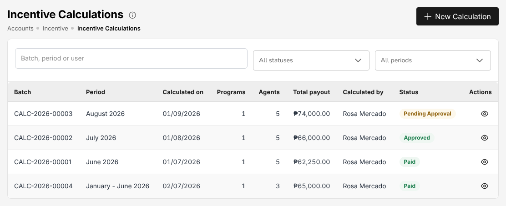
#### Approve an incentive calculation {#tis-sales-unit-head-incentive-approval}
A batch is approved or rejected by a user other than the one who ran it, adjusted its lines or submitted it. The
batches waiting for you are also listed in My Work.

1. Choose Accounts > Incentive > Approvals. The board shows the batches pending approval, the pending amount and how long
   each has been waiting.
2. Select **View Details** on the batch. Check the period, the programs, the total payout and the agent results
   (achievement, tier, adjustment and payout of each account executive).
3. Select **Approve batch**, or **Reject** and give the reason of the rejection.

The approval posts the incentive accrual. The batch is then **Approved**; when the incentives have been paid, open the
batch on Calculations and select **Mark as paid**, which posts the payment.

> Only the TIS Sales Unit Head runs and approves incentive calculations, and never the same batch: one Sales Unit Head
> runs and submits the batch, another approves it.

Each account executive follows their own progress on Accounts > Incentive > My Programs and their earnings and payments
on Accounts > Incentive > Statement.

## TIS Operations Associate {#tis-operations-associate}
### Role summary {#tis-operations-associate-summary}
**Department:** Operations. Placements, policies, endorsements, renewals and claims; no approvals.

The TIS Operations Associate does the day-to-day operations work after the sale. You send the placement slips to the
insurers, record their acknowledgements, upload the insurers' e-policies and book the policies once they have been
checked. You issue cover notes and CTPL certificates, raise endorsements and cancellations, prepare renewals, and
register and follow up claims, their documents and motor repairs up to the insurer's settlement.

You work with the TIS Sales Associate and TIS Sales Officer, who quote and close the business, and with the TIS
Operations Unit Head, who checks the e-policies, decides the claims and approves your renewal terms, cancellations and
return premiums. Cash Control (the CCD roles) collects the premiums that your bookings bill to the client.

### Menus available {#tis-operations-associate-menus}
The menus of this role as delivered. Access: View (open and read), Create and edit (enter and change records), Approve (decide the records of other users).

| Menu | Screen | Access |
|---|---|---|
| My Work | My Work | View |
| Dashboard | Executive Dashboard | View |
| Dashboard | Claims Dashboard | View |
| Dashboard | Processing Dashboard | View |
| Operations > Sales & Marketing | Prospects | View |
| Operations > Sales & Marketing | Quick Quote | Create and edit |
| Operations > Sales & Marketing | Requests for Quotation | Create and edit |
| Operations > Sales & Marketing | Quotations | Create and edit |
| Operations > Sales & Marketing | Placement Slips | Create and edit |
| Operations > Sales & Marketing | Lead Assignment | View |
| Operations > Sales & Marketing | Dealer Programmes | View |
| Operations > Sales & Marketing | Sales Activities | View |
| Operations | Clients | View |
| Operations | Policy | Create and edit |
| Operations | Fleet Schedules | Create and edit |
| Operations | Marine Open Covers | Create and edit |
| Operations | Claims | Create and edit |
| Operations > Renewals | Renewal Policy | Create and edit |
| Operations > Renewals | Renewal Batch | Create and edit |
| Operations > Renewals | Renewal Queue | Create and edit |
| Operations > Renewals | Lock-in Accounts | Create and edit |
| Operations > Renewals | Negotiations | Create and edit |
| Operations > Renewals | Lapse Management | Create and edit |
| Operations | Payments | Create and edit |
| Operations | Cover Notes | Create and edit |
| Operations | Policy Cancellation | Create and edit |
| Operations | Claims Awaiting Documents | Create and edit |
| Operations | Motor Claim Repairs | Create and edit |
| Accounts | Receipts | View |
| Accounts | Collections | View |
| Accounts > Remittance | Remittances | View |
| Reports | All Reports | View |
| Reports > Operational Reports | Production | View |
| Reports > Operational Reports | Claims | View |
| Reports > Operational Reports | Renewal | View |
| Reports > Operational Reports | Remittance | View |
| Reports > Operational Reports | Broker Commission | View |
| Reports > Operational Reports | Dealer Production | View |
| Reports | Report Builder | View |
| Master > Insurance | Claim Document Checklist | View |
| Master > Insurance | Repair Shops | View |
| Master > Insurance | Distribution Channels | View |
| Product Configurator | Dashboard | View |
| Product Configurator | Product Templates | View |

### What you can view, change and approve {#tis-operations-associate-access}
Where: the screens of your menus that show the module. A module without a screen of its own is seen inside the screens of other modules (for example the remittance status of a policy).

| Area | Module | Access | What it allows | Where |
|---|---|---|---|---|
| Sales & Marketing | Prospects and leads | View | See prospects and leads | Prospects and Quick Quote |
| Sales & Marketing | Quotations and placement | View | See quotations, requests for quotation, placement slips and comparison reports | Quick Quote, Requests for Quotation, Quotations and Placement Slips |
| Sales & Marketing | Quotations and placement | Create and edit | Create quotations (Quick Quote too), send requests for quotation, prepare placement slips |  |
| Sales & Marketing | Lead assignment | View | See assignment rules, the reassignment queue and every team's prospects | Lead Assignment |
| Sales & Marketing | Dealer programmes | View | See brand-new vehicle programmes and dealer sales uploads; print bank endorsement letters | Dealer Programmes |
| Sales & Marketing | Sales activities | View | See activity timelines and the activity report | Sales Activities |
| Operations | Clients | View | See clients | Clients |
| Operations | Policies | View | See policies, cover notes, payments and CTPL authentication | Policy, Payments and Cover Notes |
| Operations | Policies | Create and edit | Record and issue policies, cover notes and CTPL certificates |  |
| Operations | Endorsements and cancellations | View | See endorsements and cancellations | Policy Cancellation |
| Operations | Endorsements and cancellations | Create and edit | Request and process endorsements and cancellations |  |
| Operations | Renewals | View | See renewals | Renewal Policy, Renewal Batch, Renewal Queue, Lock-in Accounts, Negotiations and Lapse Management |
| Operations | Renewals | Create and edit | Prepare renewals and renewal terms |  |
| Operations | Claims | View | See claims | Claims, Claims Awaiting Documents and Motor Claim Repairs |
| Operations | Claims | Create and edit | Move a claim to review and submit its settlement, partial or final, for approval |  |
| Operations | Claims | Create and edit | Register and follow up claims, claim documents and repairs |  |
| Operations | Fleet schedules | View | See fleet schedules and print the schedule of vehicles | Fleet Schedules |
| Operations | Fleet schedules | Create and edit | Prepare and issue fleet schedules; add or delete vehicles by endorsement |  |
| Operations | Marine open covers | View | See open covers, certificates and declarations; print certificates | Marine Open Covers |
| Operations | Marine open covers | Create and edit | Set up open covers, issue certificates, submit and bill declarations |  |
| Accounts | Receipts | View | See receipts and post-dated cheques | Receipts |
| Accounts | Collections and credit control | View | See collections, instalment plans and credit limits | Collections |
| Accounts | Remittance and insurer reconciliation | View | See remittances to insurers and insurer statements | Remittances |
| Accounts | Incentives | View | See incentive programmes, calculations and statements | No screen of its own |
| Commission | Commission | View | See commission, referrer accounts and insurer overrides | No screen of its own |
| Reports | Reports | View | Run and download reports | Production, Claims, Renewal, Remittance, Broker Commission, Dealer Production and Report Builder |
| Product Configurator | Products | View | See products and product templates | Dashboard and Product Templates |
| Master data and configuration | Reference masters | View | See reference masters | Claim Document Checklist and Repair Shops |
| Master data and configuration | Distribution channels | View | See dealers, financing banks, affinity partners and their production | Distribution Channels |
| Master data and configuration | Schedules | View | See scheduled jobs and their runs | No screen of its own |
| Master data and configuration | Integrations | View | See connectors and the integration outbox and inbox | No screen of its own |
| Basic and special access | Basic access | View | Own profile and the look-up lists of every form | No screen of its own |
| Basic and special access | Full personal data | Special | See TIN, government ID numbers, mobile, e-mail, bank account and birth date unmasked on screens and exports | No screen of its own |

### Approvals {#tis-operations-associate-approvals}
This role approves nothing.

Who approves the work of this role:

| Work | Approval | Approved by |
|---|---|---|
| Claims | Claim decisions: review, reject, settle, approve a settlement, close | TIS Operations Unit Head or TIS General Manager |
| Policies | Decide the check of a placement against the slip, and complete the cancellations and return premiums of another user | TIS Sales Officer, TIS Sales Unit Head, TIS Operations Unit Head or TIS General Manager |
| Quotations and placement | Approve a quotation created by another user | TIS Sales Officer, TIS Sales Unit Head, TIS Operations Unit Head or TIS General Manager |
| Renewals | Approve or return renewal terms of another user | TIS Sales Officer, TIS Sales Unit Head, TIS Operations Unit Head or TIS General Manager |
| Operations > Claims > Settlement approval | Claim settlement approval within the approver's limit | TIS Operations Unit Head or TIS General Manager |
| Accounts > Remittance > Approvals | Remittance approval within the approver's limit | TIS Finance & General Accounting or TIS General Manager |
| Accounts > Remittance > Approvals (settlement, adjustment, transfer) | Remittance settlement, adjustment and transfer within the approver's limit | TIS Finance & General Accounting or TIS General Manager |
| Operations > Sales & Marketing > Quotations > Underwriting referral | Underwriting referral approval within the approver's limit | TIS Operations Unit Head |

The user who enters a record never approves it: the approval is always another user's.

### Segregation of duties {#tis-operations-associate-sod}
| Rule | Conflict | When given together | Reason |
|---|---|---|---|
| Administration and transactions | Policies (create and edit), Quotations and placement (create and edit), Claims (create and edit) with Users (create and edit), Roles (create and edit), Access control (create and edit) held by the same person | Warning | The person who administers users and access should not enter business or accounting transactions |
| Claims and payment | Claims (create and edit) with Disbursements and petty cash (create and edit) held by the same person | Warning | The claims handler should not also prepare the claim payments |
| Placing and paying insurers | Quotations and placement (create and edit), Policies (create and edit) with Remittance and insurer reconciliation (create and edit), Disbursements and petty cash (create and edit) held by the same person | Warning | The person who places business with an insurer should not also prepare the payments to insurers |
| Receipting and selling | Quotations and placement (create and edit), Policies (create and edit) with Receipts (create and edit) held by the same person | Warning | The person who issues receipts and posts cash should not also sell or issue the policies paid for |

These are the delivered rules. The rules in force are on Master > Users and Access > Segregation of Duties.

### Daily and periodic tasks {#tis-operations-associate-tasks}
| Task | When | Screen |
|---|---|---|
| Work through the placement slips, renewals, endorsements and claims assigned to you | Every morning and through the day | [My Work (2.3)](#my-work) |
| Send new placement slips to the insurers and record their acknowledgements | Daily | [Placement Slips (17.5)](#placement-slips) |
| Upload the e-policies received from the insurers | Daily, as they arrive | [Placement Slips (17.5)](#placement-slips), [Record e-Policy (17.5.1)](#record-e-policy) |
| Book the policies checked against the slip | Daily | [Placement Slips (17.5)](#placement-slips) |
| Issue cover notes while the insurer's policy is pending; follow up those expiring | Daily | [Cover Notes (17.20)](#cover-notes-binders) |
| Register new claims and advise the insurers | Daily, as clients report losses | [Policy (17.10)](#policies), [Claims (17.13)](#the-claims-list) |
| Collect claim documents and remind claimants | Daily | [Claims Awaiting Documents (17.22)](#claims-awaiting-documents) |
| Record repair estimates, adjuster decisions, letters of authority and vehicle releases | Daily | [Motor Claim Repairs (17.23)](#motor-claim-repairs-and-letters-of-authority) |
| Raise endorsements and cancellations requested by clients | As requested | [Policy (17.10)](#policies), [Policy Cancellation (17.21)](#cancel-a-policy-computed-return-premium) |
| Check the payment status of policies before an endorsement or a claim | As needed | [Payments (17.19)](#payments) |
| Send renewal notices and prepare the renewal quotations | Weekly, for policies expiring in the next 90 days | [Renewal Queue (17.16)](#renewal-queue-and-at-risk-policies), [Renewal Batch (17.15)](#renewal-batch-lapse-management-and-the-analytics) |
| Follow up lapsed policies and the policies in their grace period | Weekly | [Lapse Management (17.15)](#renewal-batch-lapse-management-and-the-analytics) |
| Maintain fleet schedules and marine open covers of corporate clients | As requested | [Fleet Schedules (17.11)](#fleet-schedules), [Marine Open Covers (17.12)](#marine-open-covers) |
| Run the claims and renewal reports | Month-end | [All Reports (22.1)](#reports-catalogue) |

### Procedures {#tis-operations-associate-procedures}
#### Start the day from My Work {#tis-operations-associate-my-work}
1. Choose **My Work**. **Mine** lists the records you own; **Everyone** lists the open work of all users.
2. Select a category on the left (**Placement slips**, **Renewals**, **Endorsements**, **Claims**, **Missing
   documents**) to narrow the list. The **Next action** column says what the record waits for, for example "Obtain
   and upload the e-policy" or "Check the e-policy against the slip".
3. Select the arrow at the end of a row to open the record on its screen.

See [My Work (2.3)](#my-work) for the filters, tasks and calendar.

#### Place the business with the insurer {#tis-operations-associate-placement}
The quotation accepted by the client raises a placement slip with the status **Placement raised**. See
[Placement Slips (17.5)](#placement-slips) for the whole screen.

1. Choose Operations > Sales & Marketing > Placement Slips and open the placement slip.
2. Check the insurer, its share, the sum insured and the premium under **Security (participating insurers)**.
3. Select **Send to insurer(s)**. Each participating insurer receives the slip of its share by e-mail. The status
   becomes **Sent to insurer**.
4. When the insurer confirms the order, select **Record acknowledgement**, type the **Insurer acknowledgement
   reference** and select **Record acknowledgement** in the dialog. The status becomes **Acknowledged**.
5. When the e-policy arrives, select **Upload e-policy**. Attach the **e-Policy file**, type the **Insurer policy
   number**, check the **Participant name (insured on the policy)**, the **Sum insured**, **Net premium**, **Gross
   premium**, **Commission** and the dates against the e-policy, and correct the **Chassis number**, **Engine / motor
   number** and **Plate number** or **MV file number** to those on the e-policy. The plate number or the MV file
   number is required, even where the quotation said TBA.
6. Select **Save e-policy**. The status becomes **e-Policy received**.

> The e-policy you uploaded is checked against the slip by another user: the TIS Operations Unit Head, the TIS Sales
> Officer, the TIS Sales Unit Head or the TIS General Manager. You cannot check your own upload.

If the insurer declines, select **Record decline** in the insurer's row. To stop a placement, select **Cancel slip**.

#### Book the policy {#tis-operations-associate-booking}
Once the placement slip is **Checked against slip**:

1. Open the placement slip and select **Book (Insurer issued)**.
2. Check the client's ID details shown in the dialog: for a motor policy the ID type, the ID number and the ID card
   image are required, with the chassis number, engine number and plate or MV file number.
3. Select **Book (Insurer issued)** in the dialog.

The system creates the policy, the bill (or, for a direct-bill insurer, the commission receivable from the insurer),
the journal and the commission lines, ends the cover notes of the risk and e-mails the policy schedule with the
e-policy to the client. The placement slip becomes **Insurer issued (Booked)**. See
[Book the policy (3.6.1)](#process-booking).

#### Issue a cover note or authenticate a CTPL certificate {#tis-operations-associate-cover-notes}
1. Choose Operations > Cover Notes and select **Issue cover note**.
2. Select the quotation or the placement slip in the list. The list offers the accepted and approved quotations and
   the placement slips already with the insurer.
3. Enter **Cover from** and **Cover period (days)**, and the **Insurer binder reference** and **Special conditions**
   where the insurer gave them.
4. Select **Issue cover note**. The cover note is **Active** until the insurer's policy is booked, which ends it, or
   until its end date.

#### Raise an endorsement or a cancellation {#tis-operations-associate-endorsement}
1. Choose Operations > Policy and find the policy by number or client.
2. Select **More actions** (the three dots) in the row of the policy, then **Endorsement**. The action is not offered
   while the policy's payment is **Pending** or **Reviewing**, or after the policy has expired, lapsed, been
   cancelled or renewed.
3. Enter the change and send the endorsement to the client and the insurer. The insurer receives the endorsement
   request with the endorsement PDF by e-mail.
4. When the insurer has issued its endorsement, upload it and complete the endorsement. The system applies the change
   to the policy and bills an additional premium to the client.

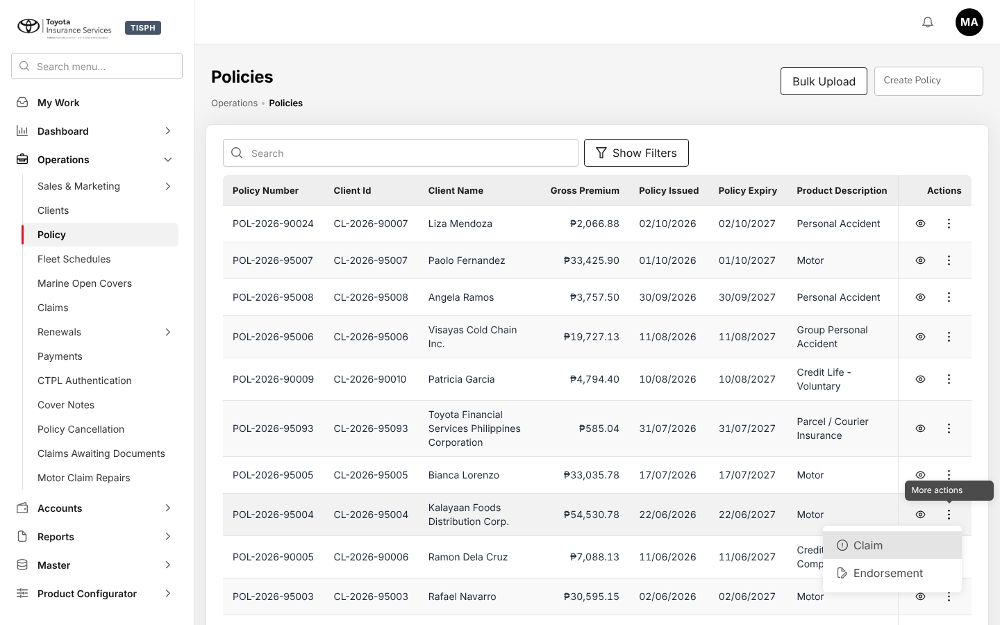
To cancel a policy, choose Operations > Policy Cancellation, type the **Policy number**, the **Cancellation
date** and the **Reason**, select **Compute return premium**, check the result and select **Create cancellation
endorsement**.

> A cancellation, and an endorsement that returns premium, is completed by the TIS Operations Unit Head or the TIS
> General Manager, never by you. They are notified when you send it. See
> [Cancel a policy: computed return premium (17.21)](#cancel-a-policy-computed-return-premium).

#### Register a claim {#tis-operations-associate-register-claim}
1. Choose Operations > Policy, select **More actions** in the row of the policy, then **Claim**. The action is not
   offered while the policy's payment is **Pending** or **Reviewing**.
2. On **Claim notification**, check the insurer, the policy and the insured's address.
3. Under **Incident Details**, enter the **Date of loss**, the **Time of loss**, the **Cause of loss**, the **Place of
   loss** and the **Estimated Claim Amount**.
4. For a motor claim, complete **Driver at the time of loss** (or tick **Same as Policy Holder**) and the **Third
   party** where there is one.
5. Select **Next**. On **Advice to the insurer**, check the message and attach the proof of loss if you have it.
6. Select **Register claim and send**. The claim is registered with the status **Pending** and the Preliminary Loss
   Advice is e-mailed to the insurer.

The system refuses the claim when the premium is unpaid or the date of loss is outside the period of cover.

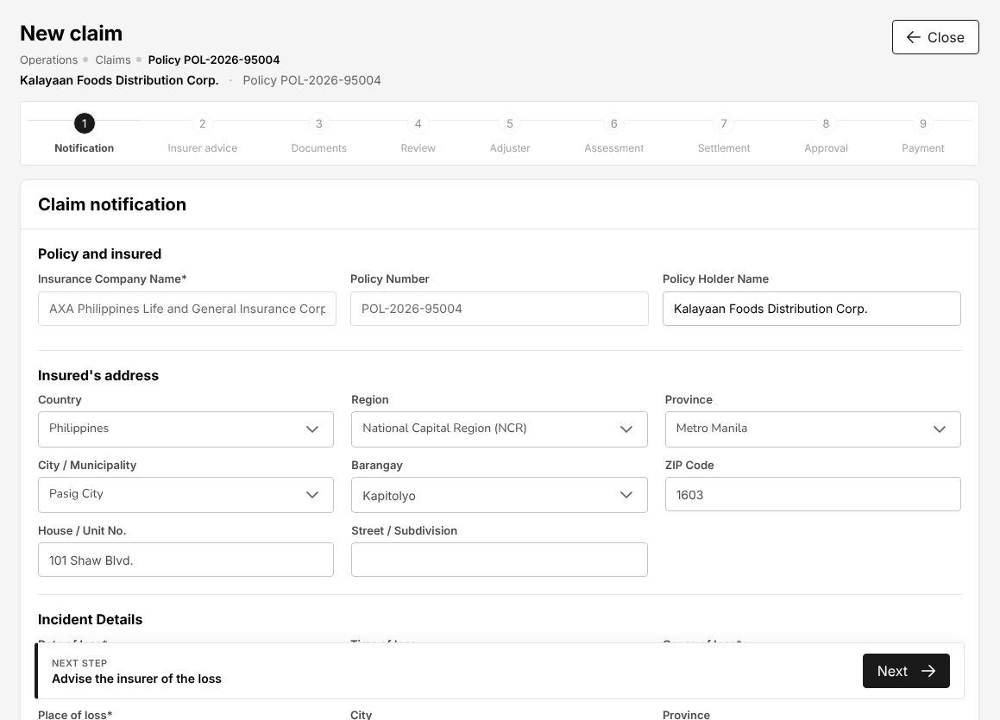
#### Collect the claim documents {#tis-operations-associate-claim-documents}
1. Choose Operations > Claims Awaiting Documents. **Claims missing documents** and **Ready to submit** count the open
   claims whose file has not gone to the insurer.
2. Select the folder icon of a claim. The checklist lists the documents of the line of business and cause of loss.
3. For each document received, select **Upload a copy** or **Mark received**. A document the claim does not need is
   waived with **Waive** and the reason.
4. While required documents are missing, select **Remind the claimant**. The claimant receives the list of missing
   documents by e-mail.
5. When the required documents are in, select **Submit to insurer**, type the **Reference (e-mail, transmittal)** and
   confirm. The claim file is recorded as submitted to the insurer.

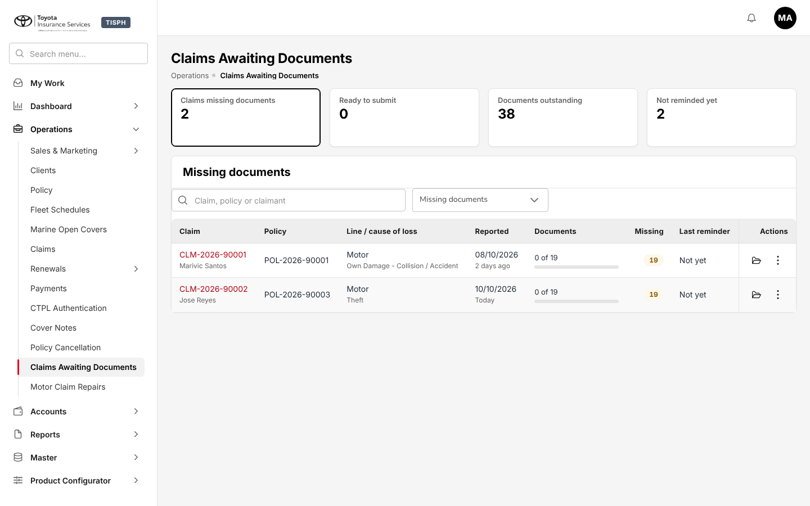
> The next step, **Proceed to adjuster report** on **Review**, moves the claim to **Processing**. It is a claim
> decision made by the TIS Operations Unit Head or the TIS General Manager. Ask your unit head to take the claim on.

Once the claim is **Processing**, you record the adjuster's name and report on the claim's **Adjuster** step. See
[Adjuster report (17.13.2)](#adjuster-report).

#### Follow a motor repair {#tis-operations-associate-motor-repair}
1. Choose Operations > Motor Claim Repairs. The list shows each motor claim with the stage of its repair:
   **No Estimate Yet**, **Awaiting approval**, **Approved**, **In repair**, **Released**.
2. Select the claim. Its repair file opens with the estimates and the letters of authority.
3. Select **Record estimate**: the accredited repair shop, the **Shop estimate no.**, the date and the amounts.
4. When the insurer's adjuster decides, select **Record adjuster decision** on the estimate: approve with the
   **Approved amount**, or reject with the reason.
5. Select **Issue letter of authority**. The letter goes to the shop with the participation of the insured and the
   amount payable by the insurer; print it from its row.
6. When the shop has finished, select **Release vehicle**, enter the release date and the person the vehicle is
   released to, and print the release form for the insured's signature.

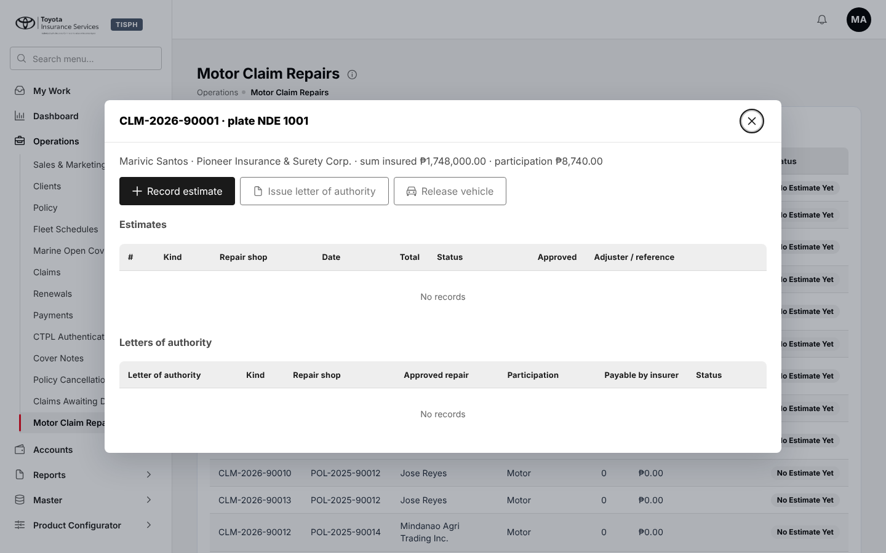
See [Motor claim repairs and letters of authority (17.23)](#motor-claim-repairs-and-letters-of-authority).

#### Prepare a renewal {#tis-operations-associate-renewal}
1. Choose Operations > Renewals > Renewal Queue. The queue lists the policies due for renewal with their stage and risk.
2. In the row of a policy, open the menu and select the next notice to send it (first, second, final notice). For
   many policies at once, use [Renewal Batch (17.15)](#renewal-batch-lapse-management-and-the-analytics).
3. Record each call or e-mail with the client with **Record reminder**.
4. Select **Prepare renewal quote**. Go through **Policy Review**, **Premium Calculation**, **Retention Offers** and
   **Quote Summary**, then select **Generate Quote**.
5. Select **Send Quote**, then **Send**. The renewal terms go for approval with the status **Pending Approval**; the
   unit heads are notified.
6. When the terms are **Approved**, select **Complete renewal** in the queue. The system creates the new policy term,
   marks the expiring policy renewed and raises the premium to collect.

If the terms are rejected, the renewal comes back to you to prepare again. Price discussions with the client are
logged on [Negotiations (17.18)](#negotiations).

When the system refuses one of these actions, see [When the system refuses an action (2.13)](#when-the-system-refuses-an-action).

## TIS Operations Officer {#tis-operations-officer}
### Role summary {#tis-operations-officer-summary}
**Department:** Operations. As the Operations Associate, plus reading journal vouchers and fixed assets.

The TIS Operations Officer does the same operations work as the TIS Operations Associate: placement with the insurers,
e-policies and policy booking, cover notes and CTPL certificates, endorsements and cancellations, renewals, claims,
claim documents and motor repairs. In addition, you can open the journal vouchers and the fixed asset register, so you
can answer questions on the accounting of a booking or a claim without asking Finance.

Like the associate, you approve nothing: the e-policies you upload, the claim decisions, your renewal terms and the
cancellations you raise are decided by the TIS Operations Unit Head (or the other approvers named below). You work with
the TIS Sales roles, who close the business, with Cash Control, who collects the premiums, and with TIS Finance &
General Accounting, who owns the journals.

### Menus available {#tis-operations-officer-menus}
The menus of this role as delivered. Access: View (open and read), Create and edit (enter and change records), Approve (decide the records of other users).

| Menu | Screen | Access |
|---|---|---|
| My Work | My Work | View |
| Dashboard | Executive Dashboard | View |
| Dashboard | Claims Dashboard | View |
| Dashboard | Processing Dashboard | View |
| Operations > Sales & Marketing | Prospects | View |
| Operations > Sales & Marketing | Quick Quote | Create and edit |
| Operations > Sales & Marketing | Requests for Quotation | Create and edit |
| Operations > Sales & Marketing | Quotations | Create and edit |
| Operations > Sales & Marketing | Placement Slips | Create and edit |
| Operations > Sales & Marketing | Lead Assignment | View |
| Operations > Sales & Marketing | Dealer Programmes | View |
| Operations > Sales & Marketing | Sales Activities | View |
| Operations | Clients | View |
| Operations | Policy | Create and edit |
| Operations | Fleet Schedules | Create and edit |
| Operations | Marine Open Covers | Create and edit |
| Operations | Claims | Create and edit |
| Operations > Renewals | Renewal Policy | Create and edit |
| Operations > Renewals | Renewal Batch | Create and edit |
| Operations > Renewals | Renewal Queue | Create and edit |
| Operations > Renewals | Lock-in Accounts | Create and edit |
| Operations > Renewals | Negotiations | Create and edit |
| Operations > Renewals | Lapse Management | Create and edit |
| Operations | Payments | Create and edit |
| Operations | Cover Notes | Create and edit |
| Operations | Policy Cancellation | Create and edit |
| Operations | Claims Awaiting Documents | Create and edit |
| Operations | Motor Claim Repairs | Create and edit |
| Accounts | Receipts | View |
| Accounts | Collections | View |
| Accounts > Remittance | Remittances | View |
| Accounts > Remittance | Exceptions | View |
| Accounts > Remittance | Insurer billing | View |
| Accounts | Journal Voucher | View |
| Reports | All Reports | View |
| Reports > Operational Reports | Production | View |
| Reports > Operational Reports | Claims | View |
| Reports > Operational Reports | Renewal | View |
| Reports > Operational Reports | Remittance | View |
| Reports > Operational Reports | Broker Commission | View |
| Reports > Operational Reports | Dealer Production | View |
| Reports | Report Builder | View |
| Master > Insurance | Claim Document Checklist | View |
| Master > Insurance | Repair Shops | View |
| Master > Insurance | Distribution Channels | View |
| Product Configurator | Dashboard | View |
| Product Configurator | Product Templates | View |

### What you can view, change and approve {#tis-operations-officer-access}
Where: the screens of your menus that show the module. A module without a screen of its own is seen inside the screens of other modules (for example the remittance status of a policy).

| Area | Module | Access | What it allows | Where |
|---|---|---|---|---|
| Sales & Marketing | Prospects and leads | View | See prospects and leads | Prospects and Quick Quote |
| Sales & Marketing | Quotations and placement | View | See quotations, requests for quotation, placement slips and comparison reports | Quick Quote, Requests for Quotation, Quotations and Placement Slips |
| Sales & Marketing | Quotations and placement | Create and edit | Create quotations (Quick Quote too), send requests for quotation, prepare placement slips |  |
| Sales & Marketing | Lead assignment | View | See assignment rules, the reassignment queue and every team's prospects | Lead Assignment |
| Sales & Marketing | Dealer programmes | View | See brand-new vehicle programmes and dealer sales uploads; print bank endorsement letters | Dealer Programmes |
| Sales & Marketing | Sales activities | View | See activity timelines and the activity report | Sales Activities |
| Operations | Clients | View | See clients | Clients |
| Operations | Policies | View | See policies, cover notes, payments and CTPL authentication | Policy, Payments and Cover Notes |
| Operations | Policies | Create and edit | Record and issue policies, cover notes and CTPL certificates |  |
| Operations | Endorsements and cancellations | View | See endorsements and cancellations | Policy Cancellation |
| Operations | Endorsements and cancellations | Create and edit | Request and process endorsements and cancellations |  |
| Operations | Renewals | View | See renewals | Renewal Policy, Renewal Batch, Renewal Queue, Lock-in Accounts, Negotiations and Lapse Management |
| Operations | Renewals | Create and edit | Prepare renewals and renewal terms |  |
| Operations | Claims | View | See claims | Claims, Claims Awaiting Documents and Motor Claim Repairs |
| Operations | Claims | Create and edit | Move a claim to review and submit its settlement, partial or final, for approval |  |
| Operations | Claims | Create and edit | Register and follow up claims, claim documents and repairs |  |
| Operations | Fleet schedules | View | See fleet schedules and print the schedule of vehicles | Fleet Schedules |
| Operations | Fleet schedules | Create and edit | Prepare and issue fleet schedules; add or delete vehicles by endorsement |  |
| Operations | Marine open covers | View | See open covers, certificates and declarations; print certificates | Marine Open Covers |
| Operations | Marine open covers | Create and edit | Set up open covers, issue certificates, submit and bill declarations |  |
| Accounts | Receipts | View | See receipts and post-dated cheques | Receipts |
| Accounts | Collections and credit control | View | See collections, instalment plans and credit limits | Collections |
| Accounts | Fixed assets | View | See the fixed asset register and depreciation | No screen of its own |
| Accounts | Journal vouchers | View | See journal vouchers and the SAP GL export | Journal Voucher |
| Accounts | Remittance and insurer reconciliation | View | See remittances to insurers and insurer statements | Remittances, Exceptions and Insurer billing |
| Accounts | Incentives | View | See incentive programmes, calculations and statements | No screen of its own |
| Commission | Commission | View | See commission, referrer accounts and insurer overrides | No screen of its own |
| Reports | Reports | View | Run and download reports | Production, Claims, Renewal, Remittance, Broker Commission, Dealer Production and Report Builder |
| Product Configurator | Products | View | See products and product templates | Dashboard and Product Templates |
| Master data and configuration | Reference masters | View | See reference masters | Claim Document Checklist and Repair Shops |
| Master data and configuration | Distribution channels | View | See dealers, financing banks, affinity partners and their production | Distribution Channels |
| Master data and configuration | Schedules | View | See scheduled jobs and their runs | No screen of its own |
| Master data and configuration | Integrations | View | See connectors and the integration outbox and inbox | No screen of its own |
| Basic and special access | Basic access | View | Own profile and the look-up lists of every form | No screen of its own |
| Basic and special access | Full personal data | Special | See TIN, government ID numbers, mobile, e-mail, bank account and birth date unmasked on screens and exports | No screen of its own |

### Approvals {#tis-operations-officer-approvals}
This role approves nothing.

Who approves the work of this role:

| Work | Approval | Approved by |
|---|---|---|
| Claims | Claim decisions: review, reject, settle, approve a settlement, close | TIS Operations Unit Head or TIS General Manager |
| Policies | Decide the check of a placement against the slip, and complete the cancellations and return premiums of another user | TIS Sales Officer, TIS Sales Unit Head, TIS Operations Unit Head or TIS General Manager |
| Quotations and placement | Approve a quotation created by another user | TIS Sales Officer, TIS Sales Unit Head, TIS Operations Unit Head or TIS General Manager |
| Renewals | Approve or return renewal terms of another user | TIS Sales Officer, TIS Sales Unit Head, TIS Operations Unit Head or TIS General Manager |
| Operations > Claims > Settlement approval | Claim settlement approval within the approver's limit | TIS Operations Unit Head or TIS General Manager |
| Accounts > Remittance > Approvals | Remittance approval within the approver's limit | TIS Finance & General Accounting or TIS General Manager |
| Accounts > Remittance > Approvals (settlement, adjustment, transfer) | Remittance settlement, adjustment and transfer within the approver's limit | TIS Finance & General Accounting or TIS General Manager |
| Operations > Sales & Marketing > Quotations > Underwriting referral | Underwriting referral approval within the approver's limit | TIS Operations Unit Head |

The user who enters a record never approves it: the approval is always another user's.

### Segregation of duties {#tis-operations-officer-sod}
| Rule | Conflict | When given together | Reason |
|---|---|---|---|
| Administration and transactions | Policies (create and edit), Quotations and placement (create and edit), Claims (create and edit) with Users (create and edit), Roles (create and edit), Access control (create and edit) held by the same person | Warning | The person who administers users and access should not enter business or accounting transactions |
| Claims and payment | Claims (create and edit) with Disbursements and petty cash (create and edit) held by the same person | Warning | The claims handler should not also prepare the claim payments |
| Placing and paying insurers | Quotations and placement (create and edit), Policies (create and edit) with Remittance and insurer reconciliation (create and edit), Disbursements and petty cash (create and edit) held by the same person | Warning | The person who places business with an insurer should not also prepare the payments to insurers |
| Receipting and selling | Quotations and placement (create and edit), Policies (create and edit) with Receipts (create and edit) held by the same person | Warning | The person who issues receipts and posts cash should not also sell or issue the policies paid for |

These are the delivered rules. The rules in force are on Master > Users and Access > Segregation of Duties.

### Daily and periodic tasks {#tis-operations-officer-tasks}
| Task | When | Screen |
|---|---|---|
| Work through the placement slips, renewals, endorsements and claims waiting for you | Every morning and through the day | [My Work (2.3)](#my-work) |
| Send placement slips, record acknowledgements, upload e-policies, book checked policies | Daily | [Placement Slips (17.5)](#placement-slips) |
| Issue cover notes and authenticate CTPL certificates | Daily | [Cover Notes (17.20)](#cover-notes-binders) |
| Register claims, collect their documents, follow motor repairs | Daily | [Claims (17.13)](#the-claims-list), [Claims Awaiting Documents (17.22)](#claims-awaiting-documents), [Motor Claim Repairs (17.23)](#motor-claim-repairs-and-letters-of-authority) |
| Raise endorsements and cancellations | As requested | [Policy (17.10)](#policies), [Policy Cancellation (17.21)](#cancel-a-policy-computed-return-premium) |
| Send renewal notices and prepare renewal quotations | Weekly | [Renewal Queue (17.16)](#renewal-queue-and-at-risk-policies) |
| Look up the journal of a booking, an endorsement or a claim settlement | When a client, an insurer or Finance asks | [Journal Voucher (18.11)](#journal-vouchers) |
| Follow the work in flight and the claims position | Weekly | [Processing Dashboard (19.3)](#processing-dashboard), [Claims Dashboard (19.2)](#claims-dashboard) |
| Run the production, claims and renewal reports | Month-end | [All Reports (22.1)](#reports-catalogue) |

### Procedures {#tis-operations-officer-procedures}
The operations procedures of this role are those of the TIS Operations Associate:

- [Start the day from My Work (7.7.1)](#tis-operations-associate-my-work)
- [Place the business with the insurer (7.7.2)](#tis-operations-associate-placement)
- [Book the policy (7.7.3)](#tis-operations-associate-booking)
- [Issue a cover note or authenticate a CTPL certificate (7.7.4)](#tis-operations-associate-cover-notes)
- [Raise an endorsement or a cancellation (7.7.5)](#tis-operations-associate-endorsement)
- [Register a claim (7.7.6)](#tis-operations-associate-register-claim)
- [Collect the claim documents (7.7.7)](#tis-operations-associate-claim-documents)
- [Follow a motor repair (7.7.8)](#tis-operations-associate-motor-repair)
- [Prepare a renewal (7.7.9)](#tis-operations-associate-renewal)

The same rules apply: the e-policy you upload is checked by another user, claim decisions (moving a claim to
processing, submitting the settlement, rejecting) are made by the TIS Operations Unit Head or the TIS General Manager, and a
cancellation or return premium you raise is completed by another user.

#### Look up the journal of a transaction {#tis-operations-officer-journal}
1. Choose Accounts > Journal Voucher.
2. In **Search Transactions**, type the journal number or a word of the description; use **Search by** to search on
   another column.
3. Select the eye icon in **View** to open the journal with its lines (accounts, cost centre, debit and credit).
4. To see the journals the system has parked for approval, tick **System journals parked for approval**.

The status column shows **Posted** for a journal in the books and **Awaiting approval** for one waiting for the
TIS Finance & General Accounting approver.

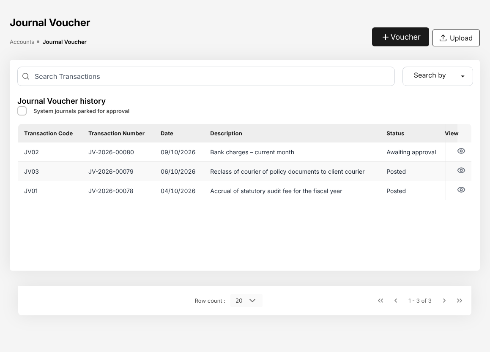
> Your access to journal vouchers is View only. The **Voucher** and **Upload** buttons are for TIS Finance & General
> Accounting: the system refuses a voucher entered or uploaded by your role. See [Journal vouchers (18.11)](#journal-vouchers).

## TIS Operations Unit Head {#tis-operations-unit-head}
### Role summary {#tis-operations-unit-head-summary}
**Department:** Operations. As the Operations Officer, plus approving quotations, placements, renewals and claims.

The TIS Operations Unit Head runs the operations team and is its checker. You check the insurers' e-policies against
the placement slips, make the claim decisions (taking a claim into processing, submitting the settlement, rejecting it) and
approve the claim settlements, approve the renewal terms and the quotations of other users, decide the underwriting
referrals of the acceptance rules, complete the cancellations and return premiums raised by your team, and approve
supplier invoices.

You can do the operations work of your team yourself, but you never approve your own work: a settlement, renewal,
quotation or e-policy check you entered goes to another approver, usually the TIS General Manager. You work with the
TIS Operations Associate and Officer, whose work you check, with the TIS Sales Unit Head, who shares the approval of
quotations and renewals, and with the TIS General Manager.

### Menus available {#tis-operations-unit-head-menus}
The menus of this role as delivered. Access: View (open and read), Create and edit (enter and change records), Approve (decide the records of other users).

| Menu | Screen | Access |
|---|---|---|
| My Work | My Work | View |
| Dashboard | Executive Dashboard | View |
| Dashboard | Claims Dashboard | View |
| Dashboard | Processing Dashboard | View |
| Operations > Sales & Marketing | Prospects | View |
| Operations > Sales & Marketing | Quick Quote | Create and edit |
| Operations > Sales & Marketing | Requests for Quotation | Create and edit |
| Operations > Sales & Marketing | Quotations | Approve |
| Operations > Sales & Marketing | Placement Slips | Approve |
| Operations > Sales & Marketing | Lead Assignment | View |
| Operations > Sales & Marketing | Dealer Programmes | View |
| Operations > Sales & Marketing | Sales Activities | View |
| Operations | Clients | View |
| Operations | Policy | Approve |
| Operations | Fleet Schedules | Create and edit |
| Operations | Marine Open Covers | Create and edit |
| Operations | Claims | Approve |
| Operations > Renewals | Renewal Policy | Approve |
| Operations > Renewals | Renewal Batch | Create and edit |
| Operations > Renewals | Renewal Queue | Create and edit |
| Operations > Renewals | Lock-in Accounts | Create and edit |
| Operations > Renewals | Negotiations | Approve |
| Operations > Renewals | Lapse Management | Create and edit |
| Operations | Payments | Create and edit |
| Operations | Cover Notes | Create and edit |
| Operations | Policy Cancellation | Create and edit |
| Operations | Claims Awaiting Documents | Create and edit |
| Operations | Motor Claim Repairs | Create and edit |
| Accounts | Receipts | View |
| Accounts | Collections | View |
| Accounts > Payables | Suppliers | View |
| Accounts > Payables | Supplier 2307 | View |
| Accounts | Disbursement | View |
| Accounts > Remittance | Remittances | View |
| Accounts > Remittance | Exceptions | View |
| Accounts > Remittance | Insurer billing | View |
| Accounts | Journal Voucher | View |
| Reports | All Reports | View |
| Reports > Operational Reports | Production | View |
| Reports > Operational Reports | Claims | View |
| Reports > Operational Reports | Renewal | View |
| Reports > Operational Reports | Remittance | View |
| Reports > Operational Reports | Broker Commission | View |
| Reports > Operational Reports | Dealer Production | View |
| Reports | Report Builder | View |
| Master > Insurance | Claim Document Checklist | View |
| Master > Insurance | Repair Shops | View |
| Master > Insurance | Distribution Channels | View |
| Product Configurator | Dashboard | View |
| Product Configurator | Product Templates | View |

### What you can view, change and approve {#tis-operations-unit-head-access}
Where: the screens of your menus that show the module. A module without a screen of its own is seen inside the screens of other modules (for example the remittance status of a policy).

| Area | Module | Access | What it allows | Where |
|---|---|---|---|---|
| Sales & Marketing | Prospects and leads | View | See prospects and leads | Prospects and Quick Quote |
| Sales & Marketing | Quotations and placement | View | See quotations, requests for quotation, placement slips and comparison reports | Quick Quote, Requests for Quotation, Quotations and Placement Slips |
| Sales & Marketing | Quotations and placement | Create and edit | Create quotations (Quick Quote too), send requests for quotation, prepare placement slips |  |
| Sales & Marketing | Quotations and placement | Approve | Approve a quotation created by another user |  |
| Sales & Marketing | Lead assignment | View | See assignment rules, the reassignment queue and every team's prospects | Lead Assignment |
| Sales & Marketing | Dealer programmes | View | See brand-new vehicle programmes and dealer sales uploads; print bank endorsement letters | Dealer Programmes |
| Sales & Marketing | Sales activities | View | See activity timelines and the activity report | Sales Activities |
| Operations | Clients | View | See clients | Clients |
| Operations | Policies | View | See policies, cover notes, payments and CTPL authentication | Policy, Payments and Cover Notes |
| Operations | Policies | Create and edit | Record and issue policies, cover notes and CTPL certificates |  |
| Operations | Policies | Approve | Decide the check of a placement against the slip, and complete the cancellations and return premiums of another user |  |
| Operations | Endorsements and cancellations | View | See endorsements and cancellations | Policy Cancellation |
| Operations | Endorsements and cancellations | Create and edit | Request and process endorsements and cancellations |  |
| Operations | Renewals | View | See renewals | Renewal Policy, Renewal Batch, Renewal Queue, Lock-in Accounts, Negotiations and Lapse Management |
| Operations | Renewals | Create and edit | Prepare renewals and renewal terms |  |
| Operations | Renewals | Approve | Approve or return renewal terms of another user |  |
| Operations | Renewals | Special | Reassign a renewal to another user or mark it not for renewal |  |
| Operations | Claims | View | See claims | Claims, Claims Awaiting Documents and Motor Claim Repairs |
| Operations | Claims | Create and edit | Move a claim to review and submit its settlement, partial or final, for approval |  |
| Operations | Claims | Create and edit | Register and follow up claims, claim documents and repairs |  |
| Operations | Claims | Approve | Claim decisions: review, reject, settle, approve a settlement, close |  |
| Operations | Fleet schedules | View | See fleet schedules and print the schedule of vehicles | Fleet Schedules |
| Operations | Fleet schedules | Create and edit | Prepare and issue fleet schedules; add or delete vehicles by endorsement |  |
| Operations | Marine open covers | View | See open covers, certificates and declarations; print certificates | Marine Open Covers |
| Operations | Marine open covers | Create and edit | Set up open covers, issue certificates, submit and bill declarations |  |
| Accounts | Receipts | View | See receipts and post-dated cheques | Receipts |
| Accounts | Collections and credit control | View | See collections, instalment plans and credit limits | Collections |
| Accounts | Disbursements and petty cash | View | See payment vouchers, petty cash and bank payment files | Disbursement |
| Accounts | Payables | View | See suppliers, supplier invoices and payments, AP ageing | Suppliers and Supplier 2307 |
| Accounts | Payables | Approve | Approve supplier invoices (not the preparer) |  |
| Accounts | Fixed assets | View | See the fixed asset register and depreciation | No screen of its own |
| Accounts | Journal vouchers | View | See journal vouchers and the SAP GL export | Journal Voucher |
| Accounts | Remittance and insurer reconciliation | View | See remittances to insurers and insurer statements | Remittances, Exceptions and Insurer billing |
| Accounts | Incentives | View | See incentive programmes, calculations and statements | No screen of its own |
| Commission | Commission | View | See commission, referrer accounts and insurer overrides | No screen of its own |
| Reports | Reports | View | Run and download reports | Production, Claims, Renewal, Remittance, Broker Commission, Dealer Production and Report Builder |
| Product Configurator | Products | View | See products and product templates | Dashboard and Product Templates |
| Master data and configuration | Reference masters | View | See reference masters | Claim Document Checklist and Repair Shops |
| Master data and configuration | Distribution channels | View | See dealers, financing banks, affinity partners and their production | Distribution Channels |
| Master data and configuration | Schedules | View | See scheduled jobs and their runs | No screen of its own |
| Master data and configuration | Integrations | View | See connectors and the integration outbox and inbox | No screen of its own |
| Basic and special access | Basic access | View | Own profile and the look-up lists of every form | No screen of its own |
| Basic and special access | Full personal data | Special | See TIN, government ID numbers, mobile, e-mail, bank account and birth date unmasked on screens and exports | No screen of its own |

### Approvals {#tis-operations-unit-head-approvals}
This role approves the work of other users:

- Claim decisions: review, reject, settle, approve a settlement, close
- Approve supplier invoices (not the preparer)
- Decide the check of a placement against the slip, and complete the cancellations and return premiums of another user
- Approve a quotation created by another user
- Approve or return renewal terms of another user

Approval limits of this role on the Authority Matrix:

| Transaction | Approval step | Limit of the role |
|---|---|---|
| Claim settlement approval | Operations > Claims > Settlement approval | PHP 500,000.00 |
| Underwriting referral approval | Operations > Sales & Marketing > Quotations > Underwriting referral | Not set: no amount limit applies |

Who approves the work of this role:

| Work | Approval | Approved by |
|---|---|---|
| Claims | Claim decisions: review, reject, settle, approve a settlement, close | TIS Operations Unit Head or TIS General Manager |
| Policies | Decide the check of a placement against the slip, and complete the cancellations and return premiums of another user | TIS Sales Officer, TIS Sales Unit Head, TIS Operations Unit Head or TIS General Manager |
| Quotations and placement | Approve a quotation created by another user | TIS Sales Officer, TIS Sales Unit Head, TIS Operations Unit Head or TIS General Manager |
| Renewals | Approve or return renewal terms of another user | TIS Sales Officer, TIS Sales Unit Head, TIS Operations Unit Head or TIS General Manager |
| Operations > Claims > Settlement approval | Claim settlement approval within the approver's limit | TIS Operations Unit Head or TIS General Manager |
| Accounts > Remittance > Approvals | Remittance approval within the approver's limit | TIS Finance & General Accounting or TIS General Manager |
| Accounts > Remittance > Approvals (settlement, adjustment, transfer) | Remittance settlement, adjustment and transfer within the approver's limit | TIS Finance & General Accounting or TIS General Manager |
| Operations > Sales & Marketing > Quotations > Underwriting referral | Underwriting referral approval within the approver's limit | TIS Operations Unit Head |

The user who enters a record never approves it: the approval is always another user's.

### Segregation of duties {#tis-operations-unit-head-sod}
| Rule | Conflict | When given together | Reason |
|---|---|---|---|
| Administration and transactions | Policies (create and edit), Quotations and placement (create and edit), Claims (create and edit) with Users (create and edit), Roles (create and edit), Access control (create and edit) held by the same person | Warning | The person who administers users and access should not enter business or accounting transactions |
| Claims and payment | Claims (create and edit) with Disbursements and petty cash (create and edit) held by the same person | Warning | The claims handler should not also prepare the claim payments |
| Placing and paying insurers | Quotations and placement (create and edit), Policies (create and edit) with Remittance and insurer reconciliation (create and edit), Disbursements and petty cash (create and edit) held by the same person | Warning | The person who places business with an insurer should not also prepare the payments to insurers |
| Receipting and selling | Quotations and placement (create and edit), Policies (create and edit) with Receipts (create and edit) held by the same person | Warning | The person who issues receipts and posts cash should not also sell or issue the policies paid for |

These are the delivered rules. The rules in force are on Master > Users and Access > Segregation of Duties.

### Daily and periodic tasks {#tis-operations-unit-head-tasks}
| Task | When | Screen |
|---|---|---|
| Decide the claim settlements and renewal terms waiting for you | Every morning and through the day | [My Work (2.3)](#my-work) (**Approvals**) |
| Check the e-policies received against the placement slips | Daily, as the team uploads them | [Placement Slips (17.5)](#placement-slips) |
| Take registered claims into processing; reject claims the insurer repudiates | Daily | [Claims (17.13)](#the-claims-list) |
| Submit the settlements agreed by the insurers | Daily | [Assessment and settlement (17.13.3)](#assessment-and-settlement-maker) |
| Approve the claim settlements of other users | Daily | [Approve a settlement (17.13.4)](#approve-a-settlement-checker) |
| Complete the cancellations and return premiums raised by the team | Daily | [Policy (17.10)](#policies), [Policy Cancellation (17.21)](#cancel-a-policy-computed-return-premium) |
| Approve or return renewal terms | Daily | [Negotiations (17.18)](#negotiations) |
| Approve quotations and decide underwriting referrals | As referred | [Quotations (17.4)](#quotations) |
| Approve supplier invoices | As submitted | [Payables (18.5)](#accounts-payable) |
| Review the renewals at risk and the escalations from the team | Weekly | [At-Risk Policies (17.16)](#renewal-queue-and-at-risk-policies) |
| Review the team's workload, open claims and claims ageing | Weekly | [Processing Dashboard (19.3)](#processing-dashboard), [Claims Dashboard (19.2)](#claims-dashboard) |
| Review the claims, renewal and production reports | Month-end | [All Reports (22.1)](#reports-catalogue) |

### Procedures {#tis-operations-unit-head-procedures}
For the operations work you do yourself, follow the procedures of the
[TIS Operations Associate (7.7)](#tis-operations-associate-procedures).

#### Work through your approvals {#tis-operations-unit-head-my-work}
1. Choose **My Work** and select **Approvals**. The list shows the claim settlements and renewal terms waiting for
   your decision, with the amount and the due date. Records you submitted yourself are not listed.
2. Select the arrow at the end of a row. A claim settlement opens on the claim, ready to decide. A renewal opens the
   **Negotiations** list without a selection: select the renewal there by its number (RN-YYYY-NNNNN), shown in the
   row of My Work.
3. For the e-policies to check, the cancellations to complete and the claims to take into processing, select
   **Everyone**, then **Placement slips**, **Endorsements** or **Claims**.

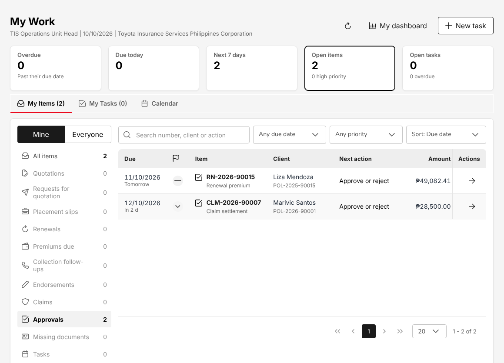
#### Check an e-policy against the slip {#tis-operations-unit-head-epolicy-check}
1. Choose Operations > Sales & Marketing > Placement Slips and open a placement slip with the status **e-Policy received**.
2. Select **Check against slip**. The dialog shows the **Insurer policy number**, who recorded the e-policy, and each
   item on the placement slip and on the e-policy with the **Difference** and the result **Matches** or **Differs**.
   Amounts within PHP 1.00 of the slip match.
3. Decide:
   - **Confirm check** when every item matches.
   - **Accept differences** when the e-policy differs but is right. Type the **Reason**.
   - **Return to insurer** when the e-policy is wrong. Type the **Reason**. The lead insurer receives the discrepancy
     by e-mail and the team uploads the corrected e-policy when it arrives.

After **Confirm check** or **Accept differences**, the status is **Checked against slip** and the policy can be booked.
You cannot check an e-policy you uploaded yourself. See [Check the e-policy against the slip (3.5.1)](#process-epolicy-check).

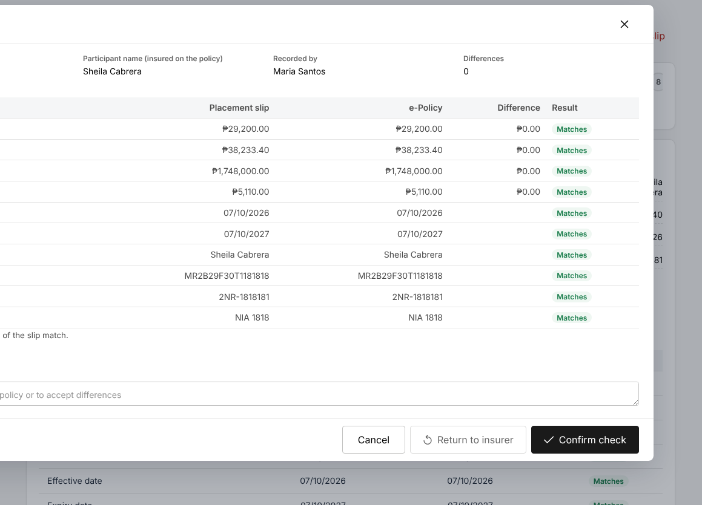
#### Take a claim into processing or reject it {#tis-operations-unit-head-claim-decisions}
1. Choose Operations > Claims and open a **Pending** claim.
2. Select **Continue: Review** at the foot of the claim (or **Continue claim** in the row menu of the list). The
   claim is at **Review** once its file has gone to the insurer.
3. Check what was reported and select **Proceed to adjuster report**. The claim becomes **Processing** and the team
   records the adjuster's report.
4. On **Assessment**, check the key facts and the **Assessment basis** (date reported, adjuster and adjuster status).
5. Select **Proceed to settlement** to enter the settlement, or **Reject claim** when the insurer repudiates it: pick
   the **Repudiation reason** or type the **Reason for rejection**. A rejected claim is **Rejected**.

#### Submit a settlement {#tis-operations-unit-head-submit-settlement}
1. On **Settlement**, select the **Settlement type**, type the settlement amount agreed by the insurer and the **Issue
   date** and **Settlement date**, and attach the settlement documents. For co-insurance the screen shows each
   insurer's share of the amount.
2. Select **Submit settlement**. The claim becomes **Pending Approval**.

The amount cannot exceed the policy's sum insured. A settlement you submit is approved by another holder of the claim
decision right: the TIS General Manager, or another TIS Operations Unit Head user.

#### Approve a claim settlement {#tis-operations-unit-head-approve-settlement}
1. In **My Work**, open the **Claim settlement** item, or open the claim on Operations > Claims and select
   **Continue: Approval**.
2. On **Settlement approval**, check the **Settlement to approve**: date reported, adjuster, adjuster status,
   **Settlement type** and **Settlement amount**.
3. Select **Approve settlement**, or **Return for correction** to send it back to **Processing**. The decision takes
   effect at once, without a confirmation.

On approval the claim is settled at once and the user who submitted it is notified. You cannot approve a settlement
you submitted. When the Authority Matrix sets you a limit for claim settlements, the amount must be within it.

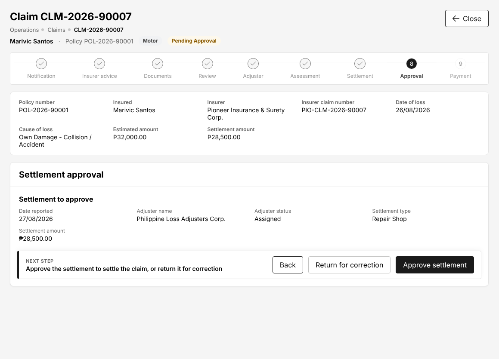
#### Complete a cancellation or a return premium {#tis-operations-unit-head-cancellations}
When a user of your team sends a cancellation, or an endorsement that returns premium, you receive a notification.

1. Open the notification, or choose **My Work**, select **Everyone** and **Endorsements**, and open the item with the
   next action "Complete the cancellation".
2. Check the return premium, the reason and the insurer's endorsement.
3. Complete the endorsement. The system applies the cancellation or the return premium to the policy and the
   commission already paid on it is clawed back.

You cannot complete a cancellation or return premium you raised yourself. When the Authority Matrix sets you a limit
for return premiums, the amount must be within it. See
[Cancel a policy: computed return premium (17.21)](#cancel-a-policy-computed-return-premium).

#### Approve or reject renewal terms {#tis-operations-unit-head-renewals}
1. Choose Operations > Renewals > Negotiations and select **Pending approval** (the arrow of a **Renewal premium** item in
   My Work opens the same list).
2. Select the renewal by its number. The side panel shows the **Renewal terms** (product, insurer, expiry, current and proposed
   premium, the premium change) and the timeline of notices and negotiations.
3. Select **Approve**, or **Reject** with a note. The decision takes effect at once, without a confirmation.

An approved renewal is completed by the team on the Renewal Queue. You cannot approve terms you submitted yourself.

#### Approve a quotation or an underwriting referral {#tis-operations-unit-head-quotations}
Quotations created by other users are approved on [Quotations (17.4)](#quotations). You cannot approve a quotation you
created.

When an acceptance rule of the product refers a quotation, the quotation shows the panel **Underwriting referral**
with the status "Referred: awaiting approval", the **Referral reasons** and the loadings added by the rules. The
quotation cannot be sent to the client, approved, placed or issued until the referral is decided.

1. Choose Operations > Sales & Marketing > Quotations and open the quotation.
2. In **Underwriting referral**, check the reasons and the sum insured, type the **Insurer underwriter reference**
   and the **Remarks**.
3. Select **Approve referral**, or **Decline referral**. A declined referral rejects the quotation.

The referral is decided by the role named as the authority of the acceptance rule; when the Authority Matrix sets you
a limit for underwriting referrals, the referral must be within it.

## CCD-PDU (Post-Dated Cheques) {#ccd-pdu-post-dated-cheques}
### Role summary {#ccd-pdu-post-dated-cheques-summary}
**Department:** Cash Control. Post-dated cheques: encoding, acknowledgement, deposit and cancellation.

CCD-PDU keeps the register of post-dated cheques that clients hand to Toyota Insurance Services Philippines for their
premiums. You register each cheque against the client's bill or policy when you receive it, record where it is
kept, deposit it on or after its date, record whether the bank cleared or returned it, and replace, return or cancel
cheques when the client asks. The cheque is acknowledged by its registration: the **On Hand** status and the PDC
number on the register are the record that Cash Control holds the cheque.
Depositing a cheque is what issues the official receipt: nothing is posted while a cheque is on hand.

You work with CCD-PDC / CCD-ADA, who handles post-dated cheques and auto-debit arrangements on the same register, with
CCD-BP / QRPh (Receipting), who receipts the other collections, and with CCD-Recon (Reconciliation and Reversals), who
matches your deposits with the bank statement. The TIS Operations and Sales users see the result on the policy's
payment status.

### Menus available {#ccd-pdu-post-dated-cheques-menus}
The menus of this role as delivered. Access: View (open and read), Create and edit (enter and change records), Approve (decide the records of other users).

| Menu | Screen | Access |
|---|---|---|
| My Work | My Work | View |
| Operations | Payments | View |
| Accounts | Receipts | Create and edit |
| Accounts | Post-Dated Cheques | Create and edit |
| Reports | All Reports | View |
| Reports > Financial Reports | SOA/Premium Receivable | View |
| Reports > Financial Reports | Collection Report | View |

### What you can view, change and approve {#ccd-pdu-post-dated-cheques-access}
Where: the screens of your menus that show the module. A module without a screen of its own is seen inside the screens of other modules (for example the remittance status of a policy).

| Area | Module | Access | What it allows | Where |
|---|---|---|---|---|
| Accounts | Receipts | View | See receipts and post-dated cheques | Receipts and Post-Dated Cheques |
| Accounts | Receipts | Create and edit | Issue official receipts, post cash, verify payments, handle post-dated cheques |  |
| Reports | Reports | View | Run and download reports | SOA/Premium Receivable and Collection Report |
| Master data and configuration | Reference masters | View | See reference masters | No screen of its own |
| Basic and special access | Basic access | View | Own profile and the look-up lists of every form | No screen of its own |

### Approvals {#ccd-pdu-post-dated-cheques-approvals}
This role approves nothing.

Who approves the work of this role:

| Work | Approval | Approved by |
|---|---|---|
| Accounts > Remittance > Approvals | Remittance approval within the approver's limit | TIS Finance & General Accounting or TIS General Manager |
| Accounts > Remittance > Approvals (settlement, adjustment, transfer) | Remittance settlement, adjustment and transfer within the approver's limit | TIS Finance & General Accounting or TIS General Manager |

The user who enters a record never approves it: the approval is always another user's.

### Segregation of duties {#ccd-pdu-post-dated-cheques-sod}
| Rule | Conflict | When given together | Reason |
|---|---|---|---|
| Administration and transactions | Receipts (create and edit) with Users (create and edit), Roles (create and edit), Access control (create and edit) held by the same person | Warning | The person who administers users and access should not enter business or accounting transactions |
| Receipting and selling | Receipts (create and edit) with Quotations and placement (create and edit), Policies (create and edit) held by the same person | Warning | The person who issues receipts and posts cash should not also sell or issue the policies paid for |

These are the delivered rules. The rules in force are on Master > Users and Access > Segregation of Duties.

### Daily and periodic tasks {#ccd-pdu-post-dated-cheques-tasks}
| Task | When | Screen |
|---|---|---|
| Read the morning notification of the cheques due for deposit | Every morning | [Notifications (2.4)](#notifications) |
| Register the post-dated cheques received from clients | Daily, as cheques arrive | [Post-Dated Cheques (18.4)](#post-dated-cheques) |
| Deposit the cheques dated today or earlier | Daily | [Post-Dated Cheques (18.4)](#post-dated-cheques) |
| Record the cheques cleared by the bank | Daily, from the bank's advice | [Post-Dated Cheques (18.4)](#post-dated-cheques) |
| Record bounced cheques and ask the client for a replacement | As the bank returns them | [Post-Dated Cheques (18.4)](#post-dated-cheques) |
| Return or cancel cheques no longer needed | As requested | [Post-Dated Cheques (18.4)](#post-dated-cheques) |
| Check the payment status of a policy before answering a client | As needed | [Payments (17.19)](#payments), [Receipts (18.1)](#verify-payments-and-post-official-receipts) |
| Count the cheques in the vault against the register | Month-end | [Post-Dated Cheques (18.4)](#post-dated-cheques) |
| Run the collection report and the statement of account | Month-end | [All Reports (22.1)](#reports-catalogue) |

### Procedures {#ccd-pdu-post-dated-cheques-procedures}
#### Find a cheque in the register {#ccd-pdu-post-dated-cheques-register}
1. Choose Accounts > Post-Dated Cheques. The cards show the cheques **On hand**, the cheques **Due for
   deposit** and the number **Bounced**.
2. On the **Cheques** tab, select the status in
   the first list (**On hand** is shown first; **All** shows every cheque) and type a PDC number, cheque number,
   client, policy or bill in the search box.
3. Select **Export to Excel** to download the register with the status selected.

The **Deposit due** tab lists the cheques on hand dated within the next three days, with their total. Each morning
the system sends a notification of these cheques to the Cash Control users.

#### Register a post-dated cheque {#ccd-pdu-post-dated-cheques-encode}
1. Choose Accounts > Post-Dated Cheques and select **Register cheque**.
2. In **Against**, keep **Bill number** to apply the cheque to one bill, or select **Policy number**.
3. In **Reference**, type the bill number (for example INV-2026-95007) or the policy number.
4. In **Drawee bank**, select the client's bank. If the bank is not in the list, type it in **Drawee bank (if not in
   the list)**.
5. Type the **Cheque no.**, the **Cheque date** (DD/MM/YYYY, or pick it from the calendar of the field) and the
   **Amount**.
6. In **Kept in**, type where the cheque is filed, for example "Finance vault, drawer 2". Add **Remarks** if needed.
7. Select **Register cheque**. The system gives the cheque its PDC number (PDC-2026-00004) with the status **On Hand**.

| Field | Required | What to enter | Rule |
|---|---|---|---|
| **Against** | Yes | Bill number or Policy number | A policy billed directly by the insurer is refused: the client pays the insurer |
| **Reference** | Yes | The bill or policy number | The bill must have an open balance |
| **Drawee bank** | Yes, one of the two | The client's bank | Type it in **Drawee bank (if not in the list)** when it is not listed |
| **Cheque no.** | Yes | The number printed on the cheque | |
| **Cheque date** | Yes | The date on the cheque | The cheque cannot be deposited before this date |
| **Amount** | Yes | The amount of the cheque | Not more than the bill balance left after the cheques already on hand for it |
| **Kept in** | No | Vault, drawer or folder | Printed on the register and the export |

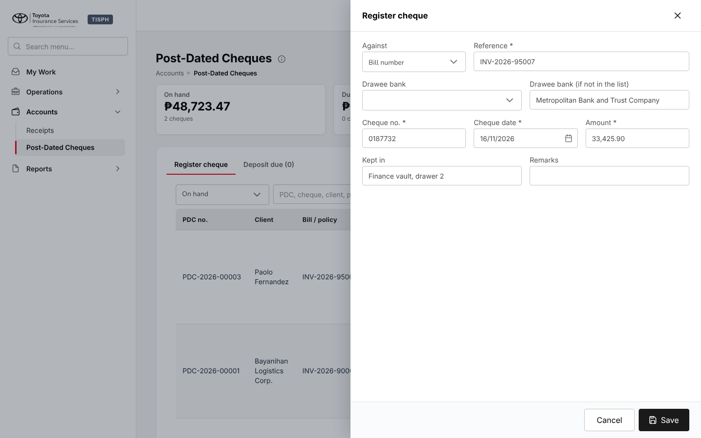
#### Deposit a cheque on its date {#ccd-pdu-post-dated-cheques-deposit}
1. Choose Accounts > Post-Dated Cheques and open the **Deposit due** tab.
2. Select **Deposit** in the row of the cheque.
3. Check the cheque details shown, then select the **Bank account** the cheque is deposited to and the **Deposit
   date** (today by default).
4. Select **Deposit cheque**.

The system issues the official receipt for the cheque, posts it to the bank account selected and reduces the bill.
The cheque becomes **Deposited** and its receipt number is shown in the **Receipt** column. A deposit dated before the
cheque date is refused. Print or e-mail the receipt from [Receipts (18.1)](#verify-payments-and-post-official-receipts).

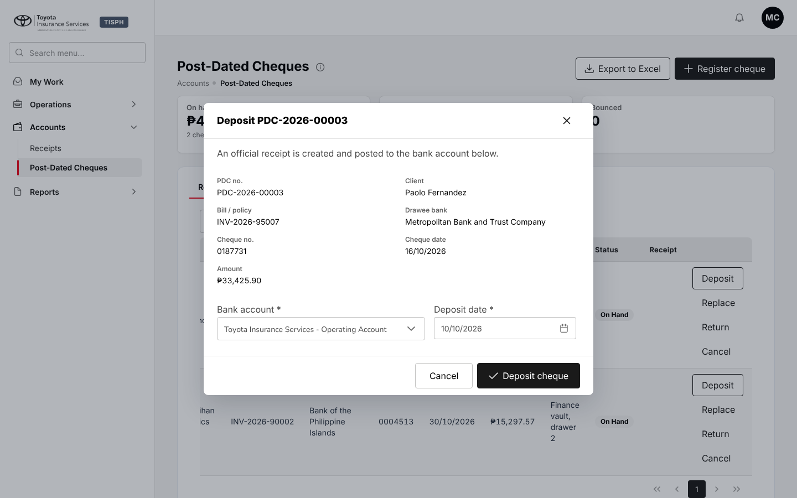
#### Record the bank's answer: cleared or bounced {#ccd-pdu-post-dated-cheques-clear}
When the bank has honoured the cheque:

1. Select **All** (or **Deposited**) in the status list and find the cheque.
2. Select **Cleared**, check the cheque and its receipt, and select **Mark as cleared**. The cheque becomes
   **Cleared**.

When the bank returns the cheque unpaid:

1. Find the deposited or cleared cheque and select **Bounced**.
2. In **Reason given by the bank**, type the reason, for example "DAIF (drawn against insufficient funds)". Type the
   **Bank charge** if the bank charged one.
3. Select **Mark as bounced**.

The system cancels the official receipt of the cheque: its journals are reversed and the bill is open again. The
cheque becomes **Bounced**, the Cash Control users receive a high-priority notification and the client, when an
e-mail address is on file, receives an e-mail about the returned cheque.

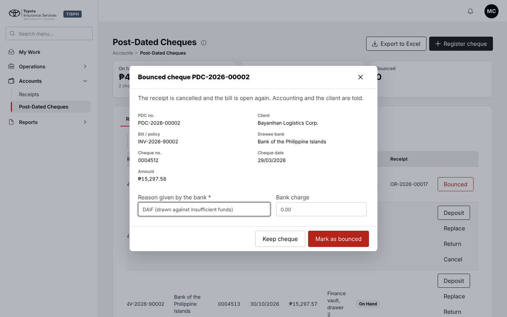
#### Replace, return or cancel a cheque {#ccd-pdu-post-dated-cheques-replace}
- **Replace** (on a cheque **On Hand** or **Bounced**): enter the new cheque as in
  [Register a post-dated cheque (10.7.2)](#ccd-pdu-post-dated-cheques-encode) and select **Register replacement**. The old cheque becomes
  **Replaced** and the new one is linked to it, against the same bill (or the policy when the bill is closed).
- **Return** (on a cheque **On Hand**): type why the cheque goes back to the client and select **Return cheque**. The
  cheque becomes **Returned**; the bill stays open.
- **Cancel** (on a cheque **On Hand** registered in error): type the reason and select **Cancel registration**. The
  cheque becomes **Cancelled**.

A cheque already deposited cannot be returned or cancelled: when it bounces, record it as bounced and replace it.

See [Post-dated cheques (18.4)](#post-dated-cheques) for the whole screen and [Post-dated cheques (3.7.2)](#process-pdc) in the
TISPH process.

## CCD-PDC / CCD-ADA {#ccd-pdc-ccd-ada}
### Role summary {#ccd-pdc-ccd-ada-summary}
**Department:** Cash Control. Post-dated cheques and auto-debit arrangements.

CCD-PDC / CCD-ADA collects the premiums paid by post-dated cheque and by auto-debit arrangement. On the post-dated
cheque register you work like CCD-PDU (Post-Dated Cheques): you register, deposit, clear, replace and return cheques.
For a client who pays by authority to debit, you record each debit made by the bank as an official receipt with the
receipt mode **Authority to Debit**. You also read the collections, the bank reconciliation and the insurer statements
to answer clients and follow the cheques and debits you posted until the bank statement shows them.

You work with CCD-PDU (Post-Dated Cheques) on the cheque register, with CCD-BP / QRPh (Receipting) for the other
collections and with CCD-Recon (Reconciliation and Reversals), who matches your receipts with the bank statement and
handles returned debits.

### Menus available {#ccd-pdc-ccd-ada-menus}
The menus of this role as delivered. Access: View (open and read), Create and edit (enter and change records), Approve (decide the records of other users).

| Menu | Screen | Access |
|---|---|---|
| My Work | My Work | View |
| Operations | Payments | View |
| Accounts | Receipts | Create and edit |
| Accounts | Collections | View |
| Accounts | Post-Dated Cheques | Create and edit |
| Accounts > Remittance | Remittances | View |
| Accounts > Remittance | Reconciliation | View |
| Accounts > Remittance | Exceptions | View |
| Accounts > Bank Reconciliation | Reconciliation Workspace | View |
| Accounts > Bank Reconciliation | Reconciliations | View |
| Accounts > Bank Reconciliation | Reconciliation Statement Report | View |
| Accounts > Bank Reconciliation | Outstanding Cheques | View |
| Accounts > Bank Reconciliation | Deposits in Transit | View |
| Accounts > Bank Reconciliation | Unmatched Bank Lines | View |
| Accounts > Bank Reconciliation | Bank Book | View |
| Reports | All Reports | View |
| Reports > Financial Reports | SOA/Premium Receivable | View |
| Reports > Financial Reports | Collection Report | View |

### What you can view, change and approve {#ccd-pdc-ccd-ada-access}
Where: the screens of your menus that show the module. A module without a screen of its own is seen inside the screens of other modules (for example the remittance status of a policy).

| Area | Module | Access | What it allows | Where |
|---|---|---|---|---|
| Accounts | Receipts | View | See receipts and post-dated cheques | Receipts and Post-Dated Cheques |
| Accounts | Receipts | Create and edit | Issue official receipts, post cash, verify payments, handle post-dated cheques |  |
| Accounts | Collections and credit control | View | See collections, instalment plans and credit limits | Collections |
| Accounts | Remittance and insurer reconciliation | View | See remittances to insurers and insurer statements | Remittances, Reconciliation and Exceptions |
| Accounts | Bank reconciliation | View | See bank reconciliations | Reconciliation Workspace, Reconciliations, Reconciliation Statement Report, Outstanding Cheques, Deposits in Transit, Unmatched Bank Lines and Bank Book |
| Reports | Reports | View | Run and download reports | SOA/Premium Receivable and Collection Report |
| Master data and configuration | Reference masters | View | See reference masters | No screen of its own |
| Basic and special access | Basic access | View | Own profile and the look-up lists of every form | No screen of its own |

### Approvals {#ccd-pdc-ccd-ada-approvals}
This role approves nothing.

Who approves the work of this role:

| Work | Approval | Approved by |
|---|---|---|
| Accounts > Remittance > Approvals | Remittance approval within the approver's limit | TIS Finance & General Accounting or TIS General Manager |
| Accounts > Remittance > Approvals (settlement, adjustment, transfer) | Remittance settlement, adjustment and transfer within the approver's limit | TIS Finance & General Accounting or TIS General Manager |

The user who enters a record never approves it: the approval is always another user's.

### Segregation of duties {#ccd-pdc-ccd-ada-sod}
| Rule | Conflict | When given together | Reason |
|---|---|---|---|
| Administration and transactions | Receipts (create and edit) with Users (create and edit), Roles (create and edit), Access control (create and edit) held by the same person | Warning | The person who administers users and access should not enter business or accounting transactions |
| Receipting and selling | Receipts (create and edit) with Quotations and placement (create and edit), Policies (create and edit) held by the same person | Warning | The person who issues receipts and posts cash should not also sell or issue the policies paid for |

These are the delivered rules. The rules in force are on Master > Users and Access > Segregation of Duties.

### Daily and periodic tasks {#ccd-pdc-ccd-ada-tasks}
| Task | When | Screen |
|---|---|---|
| Read the morning notification of the cheques due for deposit | Every morning | [Notifications (2.4)](#notifications) |
| Register post-dated cheques and deposit those due | Daily | [Post-Dated Cheques (18.4)](#post-dated-cheques) |
| Record the cleared and bounced cheques | Daily, from the bank's advice | [Post-Dated Cheques (18.4)](#post-dated-cheques) |
| Receipt the auto-debits made by the bank | On each debit date, from the bank's debit advice | [Receipts (18.1)](#verify-payments-and-post-official-receipts) |
| Check the premiums still open and their ageing | Daily | [Collections (18.2)](#collections) |
| Check that your deposits and debits appear on the bank statement | Daily | [Bank Reconciliation (18.15)](#bank-reconciliation) |
| Look up an insurer statement when the insurer asks about a payment | As needed | [Insurer Statements (18.16)](#insurer-statement-reconciliation) |
| Run the collection report, the statement of account and the deposits in transit | Month-end | [All Reports (22.1)](#reports-catalogue), [Bank Reconciliation (18.15)](#bank-reconciliation) |

### Procedures {#ccd-pdc-ccd-ada-procedures}
#### Post-dated cheques {#ccd-pdc-ccd-ada-cheques}
You register, deposit and follow the post-dated cheques on Accounts > Post-Dated Cheques exactly as
CCD-PDU (Post-Dated Cheques) does:

- [Register a post-dated cheque (10.7.2)](#ccd-pdu-post-dated-cheques-encode)
- [Deposit a cheque on its date (10.7.3)](#ccd-pdu-post-dated-cheques-deposit): the deposit issues the official receipt
- [Record the bank's answer: cleared or bounced (10.7.4)](#ccd-pdu-post-dated-cheques-clear): a bounced cheque cancels its
  receipt and opens the bill again
- [Replace, return or cancel a cheque (10.7.5)](#ccd-pdu-post-dated-cheques-replace)

#### Receipt an auto-debit {#ccd-pdc-ccd-ada-auto-debit}
When the bank has debited the client's account under the client's authority to debit:

1. Choose Accounts > Receipts and select **Receipt**. **Add Receipts** opens with today's date as **Receipt
   Date**; change it to the debit date if needed.
2. Keep **Receipt Type** at **Payment**. Select the **Branch Code** and the **Department Code**.
3. In **Customer Code**, select the client. The list shows the clients with an open premium and the amount open.
   **Customer Name** is filled in.
4. In **Policy Number**, select the policy debited. Keep **Currency Code** at **PHP** and **Transaction Code** at
   **OR – Official Receipt**.
5. In **Receipt Mode**, select **Authority to Debit**. In **Reference No. (Optional)**, type the bank's debit
   reference.
6. Under **Open bills for policy**, select the bill debited. In **Amount received**, type the amount debited, or
   select **Pay full balance**.
7. Select **Record payment**, check the client, the bill, the amount and the **Balance after payment**, and select
   **Record** with the amount.

The system issues the official receipt number, posts the payment to the bank account and reduces the bill. The
amount cannot be more than the bill balance; a partial debit leaves the rest open. Back on **Receipts**, print the
receipt or e-mail it to the client from the confirmation.

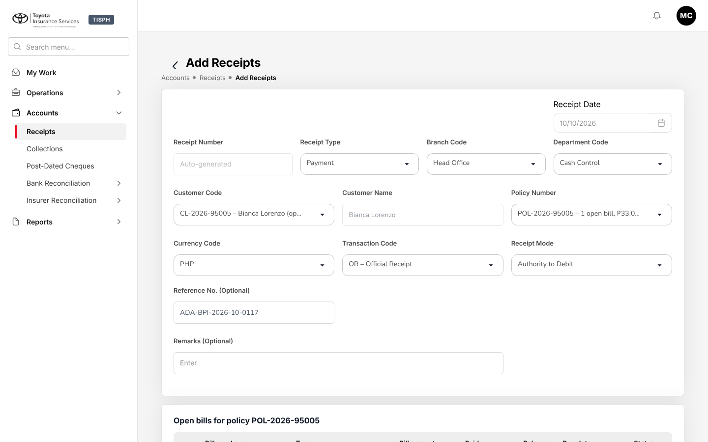
If the bank reports that a debit failed after you receipted it, tell CCD-Recon (Reconciliation and Reversals), who
handles the reversals of Cash Control: you do not reverse the receipt yourself. See
[Reverse a returned cheque (13.7.5)](#ccd-recon-reconciliation-and-reversals-returned-cheque).

#### Follow the open premiums {#ccd-pdc-ccd-ada-collections}
1. Choose Accounts > Collections. The cards show the premium **Outstanding**, **Overdue**, **Committed**,
   **Escalated** and **Collected this month**.
2. Filter by status (**All Status**) and overdue level (**All Levels**), or search by policy or client name.
3. Select **View** in a row to see the bill, its ageing, the follow-up history and the payments.

Your role reads this screen; the follow-up of overdue premiums is done by CCD-BP / QRPh (Receipting) and CCD-Recon
(Reconciliation and Reversals). See [Collections (18.2)](#collections).

#### Check that a deposit or a debit reached the bank {#ccd-pdc-ccd-ada-bank}
1. Choose Accounts > Bank Reconciliation > Reconciliation Workspace. Select the **Bank account** and the **Period**.
2. Search the **Book entries** for your receipt and the **Bank statement lines** for the deposit or the debit. A
   receipt matched with the bank shows **Matched**; an **Unmatched** receipt is not yet on the statement.
3. For a list, choose Accounts > Bank Reconciliation > Deposits in Transit, type the dates and select **Generate**.

Your role reads the bank reconciliation; the matching and adjustments are the work of CCD-Recon (Reconciliation and
Reversals). See [Bank reconciliation (18.15)](#bank-reconciliation).

## CCD-BP / QRPh (Receipting) {#ccd-bp-qrph-receipting}
### Role summary {#ccd-bp-qrph-receipting-summary}
**Department:** Cash Control. Official and acknowledgement receipts, bills payment and QRPh; no reversals.

CCD-BP / QRPh (Receipting) issues the official receipts of Toyota Insurance Services Philippines for the premiums
paid over the counter, by bank transfer, through bills payment and by QRPh. You post every collection against the
client's bill, print or e-mail the receipt, follow up the overdue premiums and record the claim settlement funds that
insurers pay to the broker. You also handle post-dated cheques on the same register as CCD-PDU (Post-Dated Cheques).

The acknowledgement receipt (AR) is not issued on your screens: the system issues it when an account executive
records a client's payment on the policy. You then confirm that payment against the bank, and the confirmation issues
the official receipt.

On Collections you record the follow-ups, the promises to pay and the receipts of the premiums. You do not cancel,
reverse or adjust receipts and collections: the Receipts screen has no cancel action, and a returned payment or a
receipt issued in error is handled by CCD-Recon (Reconciliation and Reversals).
Premium warranty extensions and client credit limits are approved by TIS Finance & General Accounting.

### Menus available {#ccd-bp-qrph-receipting-menus}
The menus of this role as delivered. Access: View (open and read), Create and edit (enter and change records), Approve (decide the records of other users).

| Menu | Screen | Access |
|---|---|---|
| My Work | My Work | View |
| Operations | Payments | View |
| Accounts | Receipts | Create and edit |
| Accounts | Collections | Create and edit |
| Accounts | Post-Dated Cheques | Create and edit |
| Accounts > Remittance | Remittances | View |
| Accounts > Remittance | Reconciliation | View |
| Accounts > Remittance | Exceptions | View |
| Accounts > Bank Reconciliation | Reconciliation Workspace | View |
| Accounts > Bank Reconciliation | Reconciliations | View |
| Accounts > Bank Reconciliation | Reconciliation Statement Report | View |
| Accounts > Bank Reconciliation | Outstanding Cheques | View |
| Accounts > Bank Reconciliation | Deposits in Transit | View |
| Accounts > Bank Reconciliation | Unmatched Bank Lines | View |
| Accounts > Bank Reconciliation | Bank Book | View |
| Reports | All Reports | View |
| Reports > Financial Reports | SOA/Premium Receivable | View |
| Reports > Financial Reports | Collection Report | View |

### What you can view, change and approve {#ccd-bp-qrph-receipting-access}
Where: the screens of your menus that show the module. A module without a screen of its own is seen inside the screens of other modules (for example the remittance status of a policy).

| Area | Module | Access | What it allows | Where |
|---|---|---|---|---|
| Operations | Claims | Special | Record claim settlement funds received from an insurer | No screen of its own |
| Accounts | Receipts | View | See receipts and post-dated cheques | Receipts and Post-Dated Cheques |
| Accounts | Receipts | Create and edit | Issue official receipts, post cash, verify payments, handle post-dated cheques |  |
| Accounts | Collections and credit control | View | See collections, instalment plans and credit limits | Collections |
| Accounts | Collections and credit control | Create and edit | Record collections and adjustments |  |
| Accounts | Remittance and insurer reconciliation | View | See remittances to insurers and insurer statements | Remittances, Reconciliation and Exceptions |
| Accounts | Bank reconciliation | View | See bank reconciliations | Reconciliation Workspace, Reconciliations, Reconciliation Statement Report, Outstanding Cheques, Deposits in Transit, Unmatched Bank Lines and Bank Book |
| Reports | Reports | View | Run and download reports | SOA/Premium Receivable and Collection Report |
| Master data and configuration | Reference masters | View | See reference masters | No screen of its own |
| Basic and special access | Basic access | View | Own profile and the look-up lists of every form | No screen of its own |

### Approvals {#ccd-bp-qrph-receipting-approvals}
This role approves nothing.

Who approves the work of this role:

| Work | Approval | Approved by |
|---|---|---|
| Collections and credit control | Approve premium warranty extensions and client credit limits (not the requester) | TIS Finance & General Accounting |
| Accounts > Remittance > Approvals | Remittance approval within the approver's limit | TIS Finance & General Accounting or TIS General Manager |
| Accounts > Remittance > Approvals (settlement, adjustment, transfer) | Remittance settlement, adjustment and transfer within the approver's limit | TIS Finance & General Accounting or TIS General Manager |

The user who enters a record never approves it: the approval is always another user's.

### Segregation of duties {#ccd-bp-qrph-receipting-sod}
| Rule | Conflict | When given together | Reason |
|---|---|---|---|
| Administration and transactions | Receipts (create and edit), Collections and credit control (create and edit) with Users (create and edit), Roles (create and edit), Access control (create and edit) held by the same person | Warning | The person who administers users and access should not enter business or accounting transactions |
| Receipting and selling | Receipts (create and edit) with Quotations and placement (create and edit), Policies (create and edit) held by the same person | Warning | The person who issues receipts and posts cash should not also sell or issue the policies paid for |
| Receipting and reversals | CCD-BP / QRPh (Receipting) and CCD-Recon (Reconciliation and Reversals) held by the same person | Warning | CCD-BP issues the receipts and has no reversal rights; reversals and adjustments sit with CCD-Recon |

These are the delivered rules. The rules in force are on Master > Users and Access > Segregation of Duties.

### Daily and periodic tasks {#ccd-bp-qrph-receipting-tasks}
| Task | When | Screen |
|---|---|---|
| Work through the overdue premiums and the promises to pay assigned to Cash Control | Every morning | [My Work (2.3)](#my-work) |
| Issue official receipts for payments over the counter and bank transfers | Daily, as payments arrive | [Receipts (18.1)](#verify-payments-and-post-official-receipts) |
| Receipt the bills payment and QRPh collections of the day | Daily, from the settlement report | [Receipts (18.1)](#verify-payments-and-post-official-receipts) |
| Print or e-mail the receipts to the clients | Daily | [Receipts (18.1)](#verify-payments-and-post-official-receipts) |
| Follow up overdue premiums, record notes and promises to pay | Daily | [Collections (18.2)](#collections) |
| Send payment reminders to the clients when needed (each morning the system also e-mails the clients whose premiums fall due) | As needed | [Collections (18.2)](#collections) |
| Register and deposit post-dated cheques | Daily | [Post-Dated Cheques (18.4)](#post-dated-cheques) |
| Print the receipts of a client for a period | As requested | [Receipts (18.1)](#verify-payments-and-post-official-receipts) |
| Run the collection report and the statement of account | Month-end | [All Reports (22.1)](#reports-catalogue) |

### Procedures {#ccd-bp-qrph-receipting-procedures}
#### Issue an official receipt {#ccd-bp-qrph-receipting-official-receipt}
1. Choose Accounts > Receipts. **Receipts history** lists the receipts issued, the latest first.
2. Select **Receipt**. **Add Receipts** opens with today's date as **Receipt Date** and the **Receipt Number**
   generated on saving.
3. Keep **Receipt Type** at **Payment**. In **Branch Code** choose your branch (**Head Office**) and in
   **Department Code** choose **Cash Control**.
4. In **Customer Code**, select the client. The list shows each client with an open premium and the amount open;
   type part of the code or name to find it. **Customer Name** is filled in.
5. In **Policy Number**, select the policy paid. Keep **Currency Code** at **PHP** and **Transaction Code** at
   **OR – Official Receipt**. The other code of the list, **CM – Credit Memo**, records a credit to the client's
   account that is not money received; use it only when TIS Finance & General Accounting asks for it.
6. In **Receipt Mode**, select how the client paid: **Dollar/Peso** (cash), **Cheque**, **Managers Check/Demand
   Draft**, **Direct Credit/Transfer to Account**, **Telegraphic Transfer**, **Online Banking** or **Credit
   Ticket-Inter Office**. A cheque asks for the cheque number and date; for the other modes type the bank or
   transfer reference in **Reference No. (Optional)**.
7. Under **Open bills for policy**, select the bill paid. Type the **Amount received**, or select **Pay full
   balance**.
8. Select **Record payment**. Check the client, the bill, the receipt mode and the **Balance after payment**, and
   select **Record** with the amount.

The system issues the official receipt number, posts the payment (cash in the bank account against the premium
receivable) and reduces the bill. When the bill is fully paid, the policy's payment becomes **Completed**. Back on
**Receipts**, the confirmation offers **Print receipt**, **E-mail receipt** and **Record another**.

| Field | Required | What to enter | Rule |
|---|---|---|---|
| **Receipt Date** | Yes | The date the payment was received | Must be in an open accounting period |
| **Branch Code**, **Department Code** | Yes | **Head Office** and **Cash Control** | |
| **Customer Code** | Yes | The client paying | Only clients with an open premium are listed |
| **Policy Number** | Yes | The policy paid | Only policies with an open bill are listed |
| **Receipt Mode** | Yes | How the client paid | A cheque or manager's check needs the cheque number |
| **Amount received** | Yes | The amount paid for the bill | Greater than zero and not more than the bill balance; a partial payment leaves the rest open |

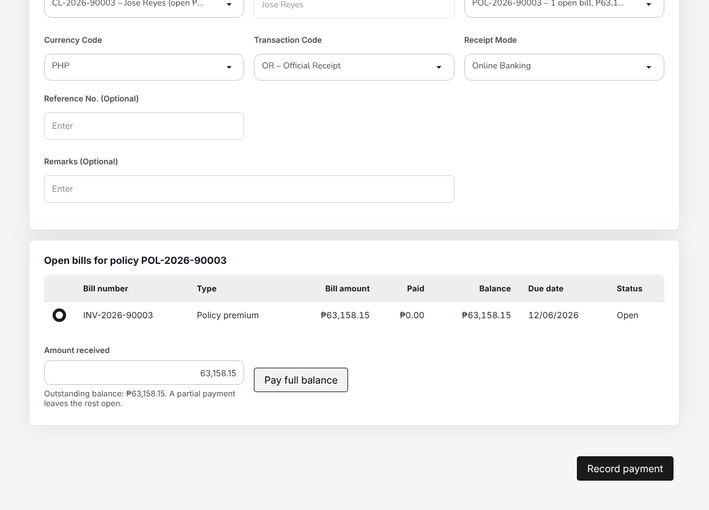
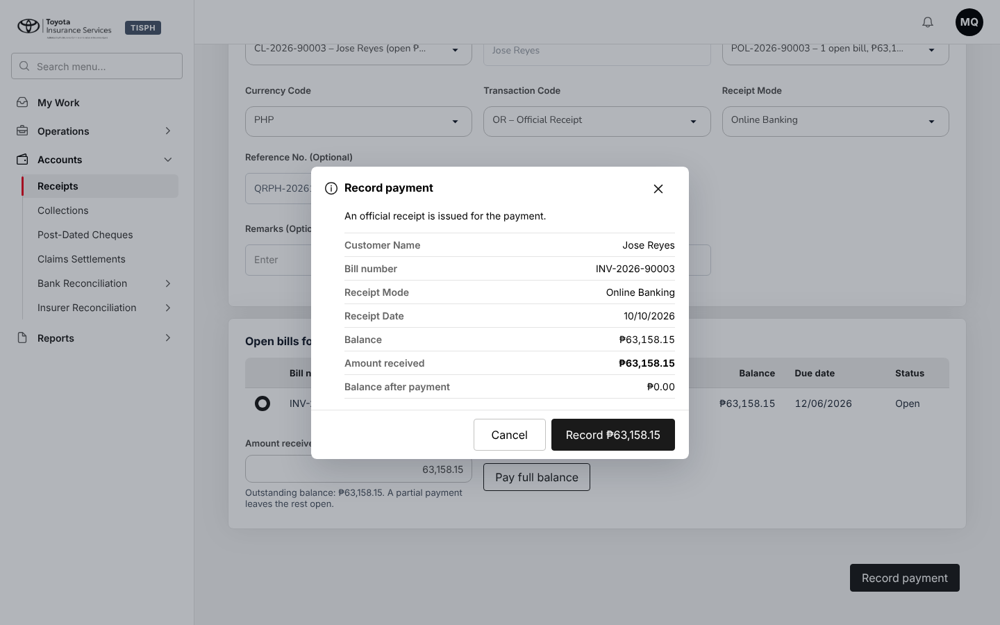
#### Receipt bills payment and QRPh collections {#ccd-bp-qrph-receipting-bills-payment}
Payments that clients make through bills payment or QRPh reach the bank with a reference; the day's settlement
report of the bank lists them.

For a few payments, issue one receipt per payment as in
[Issue an official receipt (12.7.1)](#ccd-bp-qrph-receipting-official-receipt), with the receipt mode **Online Banking** and the
bills payment or QRPh reference in **Reference No. (Optional)**.

For the whole settlement report:

1. Choose Accounts > Receipts and select **Bulk Upload**.
2. Select **Download template**. The workbook has the **Data** sheet to fill in, and the **Columns** and
   **Instructions** sheets.
3. Copy one row per payment into the **Data** sheet: **Policy Number** and **Amount** are required; give the
   **Receipt Date**, the **Payment Mode** (for example online), the **Reference No** of the bills payment or QRPh
   transaction and, if needed, the **Customer Code** and **Remarks**.
4. Select **Choose file**, pick the completed file (XLSX or CSV) and select **Upload**.

Each row issues one official receipt against the open bill of the policy. The result gives the number of rows
processed, the receipts created and the rows that failed, with the row number and the reason (for example a policy
billed directly by the insurer, an amount above the balance or a date in a closed period). Correct the failed rows
and upload them again; the rows already receipted must not be uploaded twice.

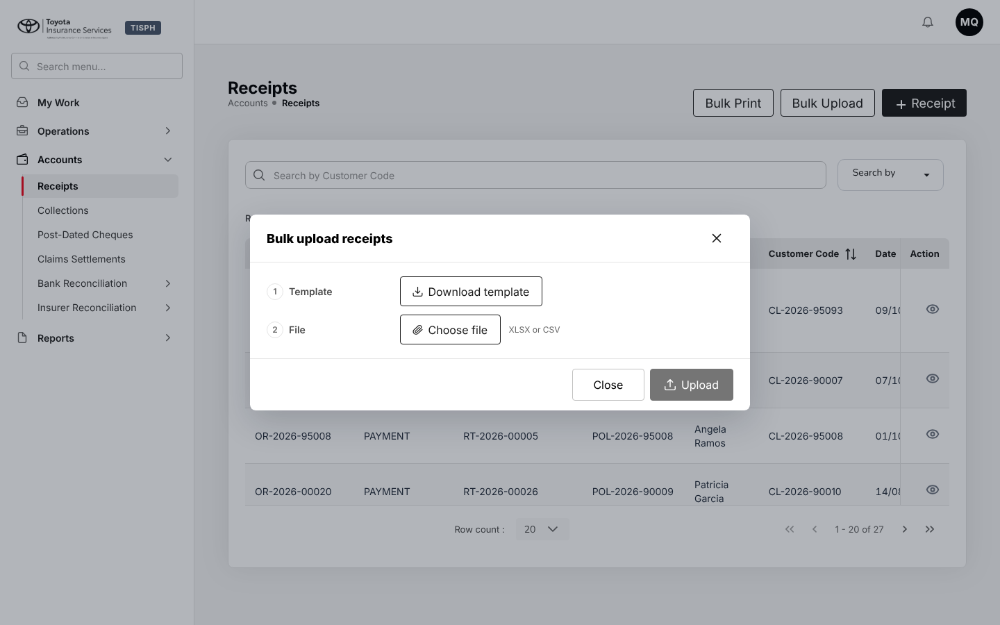
#### Print and e-mail receipts {#ccd-bp-qrph-receipting-print}
- One receipt: select the eye icon in its row on **Receipts**. **Receipt Detail View** shows the policy lines with
  the premium, taxes and amounts paid. Select **E-mail receipt**, **Print All** or **Print Selected**.
- A batch: select **Bulk Print**, select the **Customer Code From** (and **Customer Code To** for a range of
  clients), the **Date From** and the **Date To**, and select **Generate**. These three fields are required. The
  receipts are printed one per page in one PDF.

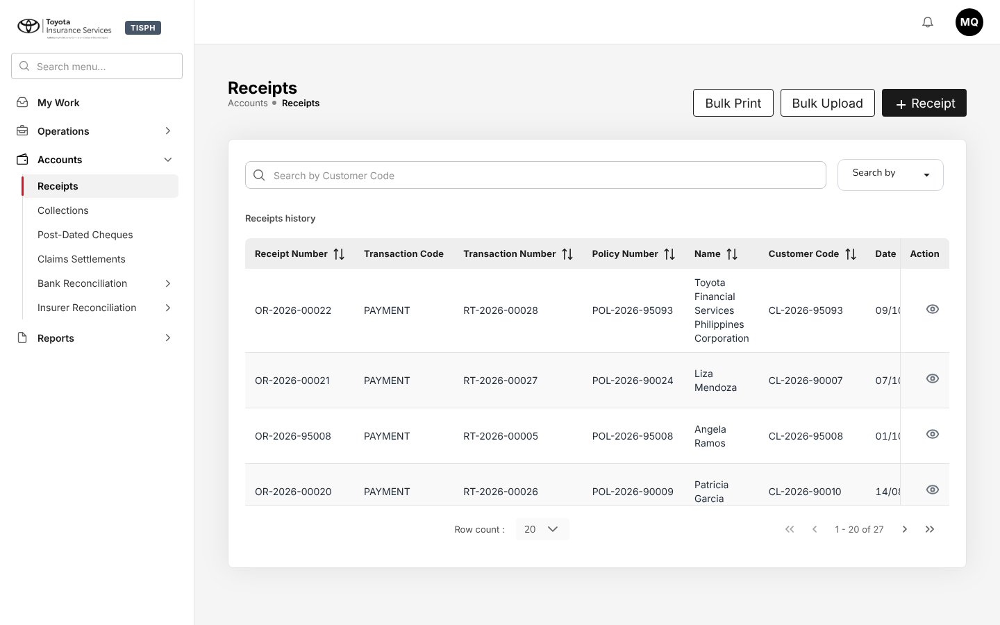
In the list, **Status** is **Converted** for a receipt whose lines are all paid and posted (the usual status of an
issued receipt), **Draft** for a receipt with a line not yet paid and **Cancelled** for a cancelled receipt.
**Transaction Code** is **OR** for a receipt issued on Add Receipts or by Bulk Upload, and **PAYMENT** for a receipt
issued when a payment recorded on the policy (with its acknowledgement receipt) was confirmed.

#### Follow up an overdue premium {#ccd-bp-qrph-receipting-follow-up}
1. Choose **My Work**. Under **Collection follow-ups**, each overdue bill shows its next action, for example "Follow
   up the overdue premium (120 days)", and each promise to pay shows "Confirm the payment promised".
2. Select the arrow of a row, or choose Accounts > Collections and select **View** in the row of the premium.
3. **Collection Details** shows the bill, the **Financial Breakdown**, the **Aging Analysis**, the **Follow-Up
   History** and the **Payment History**.
4. Under **Collection Actions**, select:
   - **Send Email** to write to the client, or **E-mail invoice** to send the premium invoice of the bill;
   - **Add Note** to record a call or a visit;
   - **Set Commitment Date** when the client promises to pay: give the **Commitment Date** and the **Reason for
     Delay**. The promise appears in My Work on that date.
5. When the client pays, select **Record receipt**: **Add Receipts** opens for the bill.

To remind every client with a premium due or overdue at once, select **Send Payment Reminders Now** on Collections,
then **Send reminders**. Each reminder is recorded in the follow-up history of its collection.

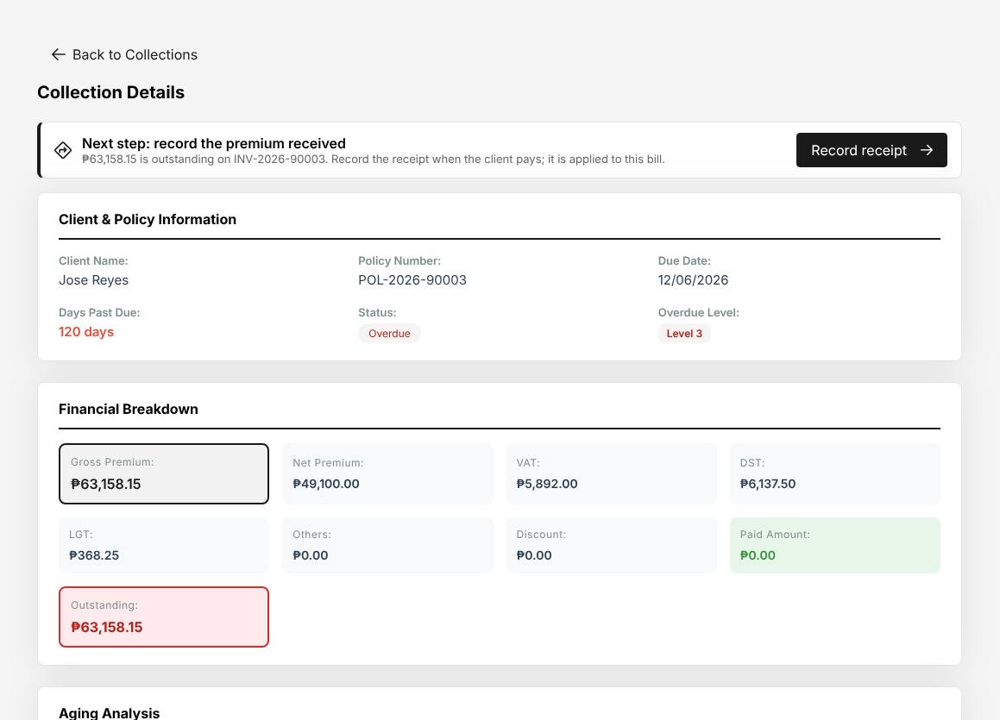
#### Post-dated cheques {#ccd-bp-qrph-receipting-cheques}
A client paying the counter with post-dated cheques: register them on Accounts > Post-Dated Cheques as in
[Register a post-dated cheque (10.7.2)](#ccd-pdu-post-dated-cheques-encode). The official receipt is issued when the cheque is
deposited on its date ([Deposit a cheque on its date (10.7.3)](#ccd-pdu-post-dated-cheques-deposit)).

## CCD-Recon (Reconciliation and Reversals) {#ccd-recon-reconciliation-and-reversals}
### Role summary {#ccd-recon-reconciliation-and-reversals-summary}
**Department:** Cash Control. Payment reconciliation, reversals and adjustments, bank and insurer statements.

CCD-Recon (Reconciliation and Reversals) checks every day that the collections posted by Cash Control agree with the
bank. You import the bank statements, match them with the receipts and payments in the books, post the bank items not
yet booked, reverse the receipts of cheques returned by the bank and prepare the monthly bank reconciliation. You also
reconcile the insurers' statements of account with the remittances and approve the insurer statement reconciliations
prepared by another user. With TIS Finance & General Accounting you prepare the remittances to the insurers and
submit them for approval; TIS Finance & General Accounting and the TIS General Manager approve them.

You work with CCD-BP / QRPh (Receipting), CCD-PDU (Post-Dated Cheques) and CCD-PDC / CCD-ADA, whose receipts you
match and reverse; the receipting roles do not reverse their own receipts. TIS Finance & General Accounting approves
your bank reconciliations and the bank adjustments that need approval.

### Menus available {#ccd-recon-reconciliation-and-reversals-menus}
The menus of this role as delivered. Access: View (open and read), Create and edit (enter and change records), Approve (decide the records of other users).

| Menu | Screen | Access |
|---|---|---|
| My Work | My Work | View |
| Operations | Payments | View |
| Accounts | Receipts | Create and edit |
| Accounts | Collections | Create and edit |
| Accounts | Post-Dated Cheques | Create and edit |
| Accounts | Disbursement | View |
| Accounts > Remittance | Remittances | Create and edit |
| Accounts > Remittance | Approvals | Approve |
| Accounts > Remittance | Insurer payments | Create and edit |
| Accounts > Remittance | Reconciliation | Create and edit |
| Accounts > Remittance | Exceptions | Create and edit |
| Accounts > Remittance | Insurer billing | Create and edit |
| Accounts | Open Entry Matching | View |
| Accounts | Open Entry Unmatching | View |
| Accounts > Bank Reconciliation | Reconciliation Workspace | Create and edit |
| Accounts > Bank Reconciliation | Reconciliations | Create and edit |
| Accounts > Bank Reconciliation | Reconciliation Statement Report | View |
| Accounts > Bank Reconciliation | Outstanding Cheques | View |
| Accounts > Bank Reconciliation | Deposits in Transit | View |
| Accounts > Bank Reconciliation | Unmatched Bank Lines | View |
| Accounts > Bank Reconciliation | Bank Book | View |
| Reports | All Reports | View |
| Reports > Financial Reports | SOA/Premium Receivable | View |
| Reports > Financial Reports | Collection Report | View |

### What you can view, change and approve {#ccd-recon-reconciliation-and-reversals-access}
Where: the screens of your menus that show the module. A module without a screen of its own is seen inside the screens of other modules (for example the remittance status of a policy).

| Area | Module | Access | What it allows | Where |
|---|---|---|---|---|
| Operations | Claims | Special | Reverse claim settlement funds or a payment to the claimant recorded in error | No screen of its own |
| Operations | Claims | Special | Record claim settlement funds received from an insurer |  |
| Accounts | Receipts | View | See receipts and post-dated cheques | Receipts and Post-Dated Cheques |
| Accounts | Receipts | Create and edit | Issue official receipts, post cash, verify payments, handle post-dated cheques |  |
| Accounts | Collections and credit control | View | See collections, instalment plans and credit limits | Collections |
| Accounts | Collections and credit control | Create and edit | Record collections and adjustments |  |
| Accounts | Disbursements and petty cash | View | See payment vouchers, petty cash and bank payment files | Disbursement and Insurer payments |
| Accounts | Remittance and insurer reconciliation | View | See remittances to insurers and insurer statements | Remittances, Approvals, Insurer payments, Reconciliation, Exceptions and Insurer billing |
| Accounts | Remittance and insurer reconciliation | Create and edit | Prepare remittances and insurer statement reconciliations |  |
| Accounts | Remittance and insurer reconciliation | Approve | Approve insurer statement reconciliations and post their adjustments (not the preparer) |  |
| Accounts | Bank reconciliation | View | See bank reconciliations | Reconciliation Workspace, Reconciliations, Reconciliation Statement Report, Outstanding Cheques, Deposits in Transit, Unmatched Bank Lines and Bank Book |
| Accounts | Bank reconciliation | Create and edit | Prepare bank reconciliations |  |
| Reports | Reports | View | Run and download reports | SOA/Premium Receivable and Collection Report |
| Master data and configuration | Reference masters | View | See reference masters | No screen of its own |
| Basic and special access | Basic access | View | Own profile and the look-up lists of every form | No screen of its own |

### Approvals {#ccd-recon-reconciliation-and-reversals-approvals}
This role approves the work of other users:

- Approve insurer statement reconciliations and post their adjustments (not the preparer)

Who approves the work of this role:

| Work | Approval | Approved by |
|---|---|---|
| Bank reconciliation | Approve and reopen bank reconciliations (not the preparer) | TIS Finance & General Accounting |
| Collections and credit control | Approve premium warranty extensions and client credit limits (not the requester) | TIS Finance & General Accounting |
| Remittance and insurer reconciliation | Approve insurer statement reconciliations and post their adjustments (not the preparer) | CCD-Recon (Reconciliation and Reversals) |
| Remittance and insurer reconciliation | Approve or reject remittances, settlements, adjustments and transfers within the Authority Matrix limit (not the preparer or submitter) | TIS Finance & General Accounting or TIS General Manager |
| Accounts > Remittance > Approvals | Remittance approval within the approver's limit | TIS Finance & General Accounting or TIS General Manager |
| Accounts > Remittance > Approvals (settlement, adjustment, transfer) | Remittance settlement, adjustment and transfer within the approver's limit | TIS Finance & General Accounting or TIS General Manager |

The user who enters a record never approves it: the approval is always another user's.

### Segregation of duties {#ccd-recon-reconciliation-and-reversals-sod}
| Rule | Conflict | When given together | Reason |
|---|---|---|---|
| Administration and transactions | Receipts (create and edit), Collections and credit control (create and edit), Remittance and insurer reconciliation (create and edit) with Users (create and edit), Roles (create and edit), Access control (create and edit) held by the same person | Warning | The person who administers users and access should not enter business or accounting transactions |
| Placing and paying insurers | Remittance and insurer reconciliation (create and edit) with Quotations and placement (create and edit), Policies (create and edit) held by the same person | Warning | The person who places business with an insurer should not also prepare the payments to insurers |
| Receipting and selling | Receipts (create and edit) with Quotations and placement (create and edit), Policies (create and edit) held by the same person | Warning | The person who issues receipts and posts cash should not also sell or issue the policies paid for |
| Receipting and reversals | CCD-Recon (Reconciliation and Reversals) and CCD-BP / QRPh (Receipting) held by the same person | Warning | CCD-BP issues the receipts and has no reversal rights; reversals and adjustments sit with CCD-Recon |

These are the delivered rules. The rules in force are on Master > Users and Access > Segregation of Duties.

### Daily and periodic tasks {#ccd-recon-reconciliation-and-reversals-tasks}
| Task | When | Screen |
|---|---|---|
| Work through the follow-ups and approvals waiting for you | Every morning | [My Work (2.3)](#my-work) |
| Import the bank statement of each bank account | Daily | [Bank Reconciliation (18.15)](#bank-reconciliation) |
| Match the statement lines with the receipts and payments | Daily | [Bank Reconciliation (18.15)](#bank-reconciliation) |
| Post bank charges, interest and direct credits not yet booked | Daily | [Bank Reconciliation (18.15)](#bank-reconciliation) |
| Reverse the receipts of cheques returned by the bank | As the bank returns them | [Bank Reconciliation (18.15)](#bank-reconciliation), [Post-Dated Cheques (18.4)](#post-dated-cheques) |
| Follow up overdue premiums and promises to pay | Daily | [Collections (18.2)](#collections) |
| Cancel stale cheques not presented within the stale period | Month-end | [Bank Reconciliation (18.15)](#bank-reconciliation) |
| Prepare the bank reconciliation of each account for TIS Finance & General Accounting | Month-end | [Bank Reconciliation (18.15)](#bank-reconciliation) |
| Import and reconcile the insurers' statements of account | Monthly, as statements arrive | [Insurer Statements (18.16)](#insurer-statement-reconciliation) |
| Approve the insurer statement reconciliations prepared by another user | As submitted | [Insurer Statements (18.16)](#insurer-statement-reconciliation) |
| Check and submit the weekly draft remittances to the insurers | Every Monday, after the weekly run | [Remittances (18.9.1)](#remittances-worklist) |
| Follow the remittances you submitted until they are approved | Daily | [Approvals (18.9.4)](#remittance-approvals) |
| Follow up the remittance exceptions assigned to you | Daily | [Exceptions (18.9.6)](#remittance-exceptions) |
| Run the bank book, deposits in transit, outstanding cheques and reconciliation statement | Month-end | [Bank Reconciliation (18.15)](#bank-reconciliation), [All Reports (22.1)](#reports-catalogue) |

### Procedures {#ccd-recon-reconciliation-and-reversals-procedures}
#### Start the day from My Work {#ccd-recon-reconciliation-and-reversals-my-work}
1. Choose **My Work**. The categories on the left are **Collection follow-ups**, **Approvals**, **Bank
   reconciliations** and **Tasks**.
2. Under **Collection follow-ups**, each overdue bill shows "Follow up the overdue premium" and each promise to pay
   "Confirm the payment promised". Work them as in
   [Follow up an overdue premium (12.7.4)](#ccd-bp-qrph-receipting-follow-up).
3. Under **Approvals**, select the arrow of an insurer statement reconciliation to open it and decide it.
4. The remittances you submitted are followed on Accounts > Remittance > Approvals, under **Submitted by me**:
   see [Follow a remittance you submitted (13.7.11)](#ccd-recon-reconciliation-and-reversals-remittance-approve).

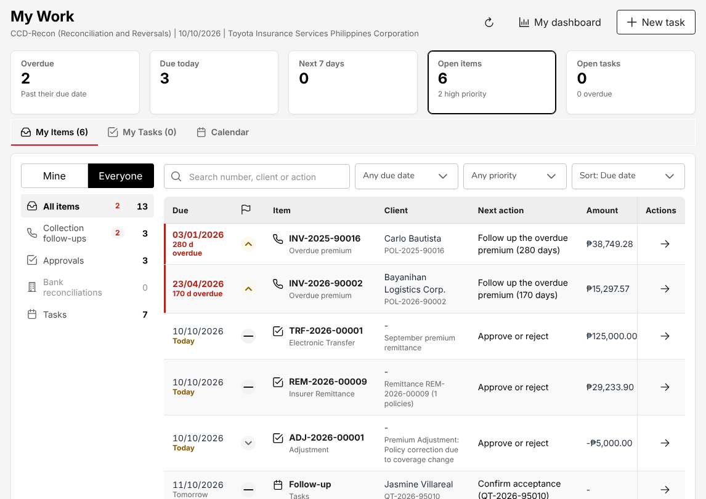
#### Import a bank statement {#ccd-recon-reconciliation-and-reversals-import}
1. Choose Accounts > Bank Reconciliation > Reconciliation Workspace. Select the **Bank account** and the **Period**.
2. Select **Import statement**. The **Statement format** of the bank is proposed; select **Download template** for
   the standard layout if the bank's export cannot be read.
3. Attach the **Statement file (CSV / XLSX)**. Type the **Bank statement no.**, and the **Opening balance** and
   **Closing balance** if they are not in the file. Keep **Leave out lines already on file** ticked.
4. Select **Preview**. Check the lines, the credits and debits, and that opening balance plus credits less debits
   equals the closing balance. The preview warns of lines already on file and of an opening balance that does not
   continue from the previous statement.
5. Select **Import**. The statement is saved and its lines are matched automatically where they can be.

The cards show the **Balance per bank**, the **Balance per books**, the **Unmatched bank lines**, the **Unmatched
book entries** and the **Difference**.

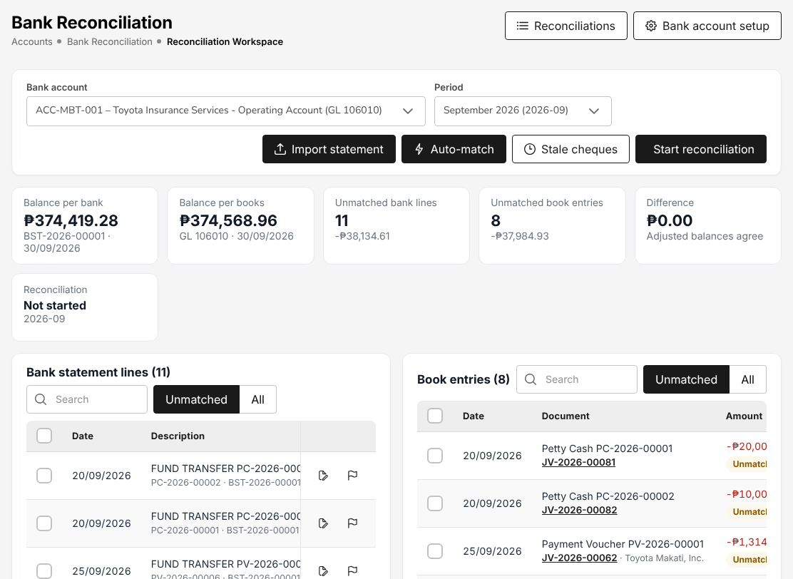
#### Match the bank lines with the books {#ccd-recon-reconciliation-and-reversals-match}
1. Select **Auto-match**. The matching rules pair bank lines and book entries of the same amount (by reference, by
   date, one to many and many to one); the number of matches found is shown.
2. For the lines left, tick the bank line(s) under **Bank statement lines** and the receipt(s) or payment(s) under
   **Book entries**. The selection shows **Bank** and **Books** with the number ticked.
3. Select **Match selected**. When the amounts differ, **Match with a difference** asks for the **Treatment of the
   difference**: **Adjustment journal** (with the **Bank transaction type**), **Bank error** or **Book error**, and
   **Remarks**.
4. For a bank line that is the bank's mistake, select the flag icon (**Mark as bank error**): the line becomes a
   reconciling item on the bank side and no journal is posted.

To undo a match, select **All** on either side, find the matched line and select **Unmatch** with the reason. The
undone match stays in the audit trail. A match in an approved reconciliation cannot be undone.

#### Post a bank item not yet in the books {#ccd-recon-reconciliation-and-reversals-bank-adjustments}
1. In the row of the bank line, select **Create adjustment**.
2. In **Bank transaction type**, select the item: **Bank charges**, **Interest income**, **Final tax on interest**,
   **Direct credit from client**, **Direct credit from insurer** or **Other bank debit**.
3. Check the **Posting date**, type the **Remarks** and select **Post**.

The adjustment journal is posted and matched with the bank line. **Direct credit from insurer** and **Other bank
debit** require approval: the journal is sent to TIS Finance & General Accounting, who approves and posts it; it is
matched when approved.

#### Reverse a returned cheque {#ccd-recon-reconciliation-and-reversals-returned-cheque}
A cheque deposited by Cash Control that the bank returns unpaid (DAIF, DAUD, account closed) appears as a bank debit
on the statement.

For a post-dated cheque of the register, record the return on Accounts > Post-Dated Cheques: see
[Record the bank's answer: cleared or bounced (10.7.4)](#ccd-pdu-post-dated-cheques-clear). The receipt is cancelled there.

For any other cheque receipted on Receipts:

1. On the Reconciliation Workspace, select **Create adjustment** in the row of the returned cheque.
2. In **Bank transaction type**, select **RCHQ – Returned cheque**.
3. In **Official receipt of the returned cheque**, type the receipt number (for example OR-2026-00018).
4. Type the **Remarks**, for example the bank's reason, and select **Post**.

The system cancels the official receipt: its journals are reversed, the bill is open again and the reversal is
matched to the bank line. The receipt shows **Cancelled** on Receipts. Ask the client for a new payment; it is
receipted again by CCD-BP / QRPh (Receipting).

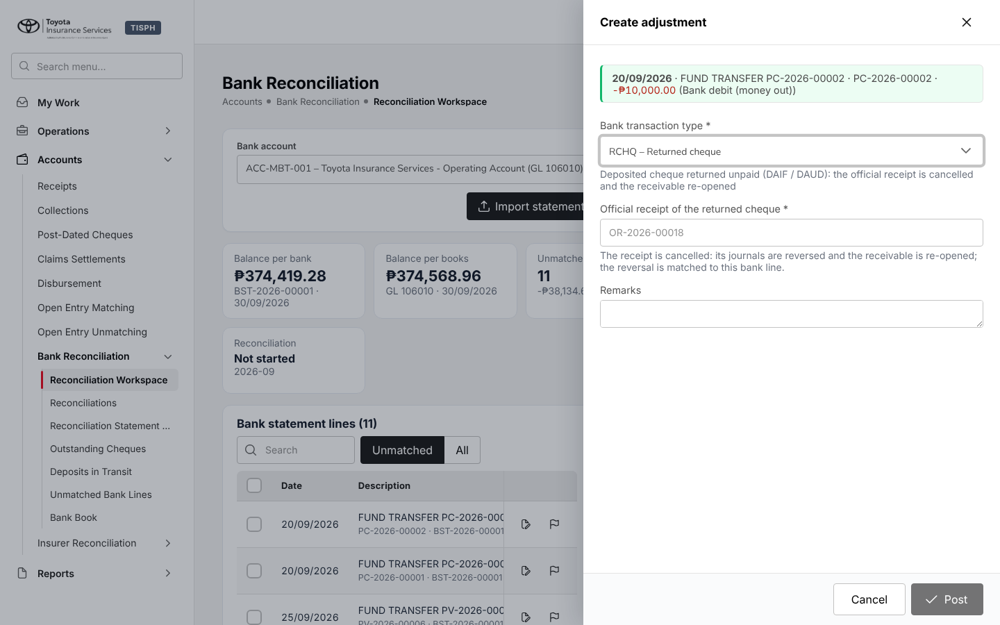
#### Cancel a stale cheque {#ccd-recon-reconciliation-and-reversals-stale}
1. Select **Stale cheques**. The list shows the payments in the books that have not cleared the bank within the
   stale period.
2. Select **Cancel cheque** in the row, type the reason (for example "Not presented within the stale period") and
   confirm. The payment journal is reversed and the payable is open again.

#### Prepare the monthly bank reconciliation {#ccd-recon-reconciliation-and-reversals-prepare}
1. On the Reconciliation Workspace, select the bank account and the period and select **Start reconciliation** (or
   **New reconciliation** on Reconciliations). The reconciliation (BRC-2026-00001) opens as **Draft** with live
   figures.
2. Check the statement: balance per bank, deposits in transit, outstanding cheques and bank errors against the
   balance per books, bank credits and charges not yet booked and book errors.
3. When every line is matched or explained and the adjusted balances agree (**Difference** **₱0.00**), select
   **Prepare** and confirm. The statement of the period must have been imported. The figures are frozen and the
   reconciliation goes to TIS Finance & General Accounting for approval.

The approver cannot be you. When approved, every match cleared up to the period end is locked. An approver can
**Reopen** a reconciliation with remarks: it returns to **Draft** and you receive a notification. **Print PDF** gives
the Bank Reconciliation Statement. **Cancel** cancels a draft started in error; the matches are kept.

All reconciliations are listed on Accounts > Bank Reconciliation > Reconciliations, with the preparer and the
approver.

#### Reconcile an insurer's statement of account {#ccd-recon-reconciliation-and-reversals-insurer}
1. Choose Accounts > Remittance > Reconciliation and select **Import statement**.
2. Select the **Insurer** and the **Statement type**: **Premium remittance confirmation** (the premium the insurer
   received from the broker) or **Commission statement** (the commission the insurer recognises on direct-bill
   business).
3. Type **Period from** and **Period to**, the **Insurer reference** and, if needed, the **Tolerance (PHP)**. Keep
   **Statement format** at the insurer's own format.
4. Attach the **File (CSV or XLSX)**, select **Preview** to check the lines read, then **Import and match**.
5. Open the statement. The tabs **Amount differences**, **Not found at the broker**, **Missing on the insurer
   statement** and **All lines** show what does not agree.
6. For each line not matched, select **Match by hand** and pick the broker record, or **Resolve** the difference
   with **Explain with a note** or **Adjustment journal (posted on approval)**, giving the premium and commission
   adjustment.
7. Select **Submit for approval**. The reconciliation is **Pending approval** and the other CCD-Recon (Reconciliation
   and Reversals) users are notified.

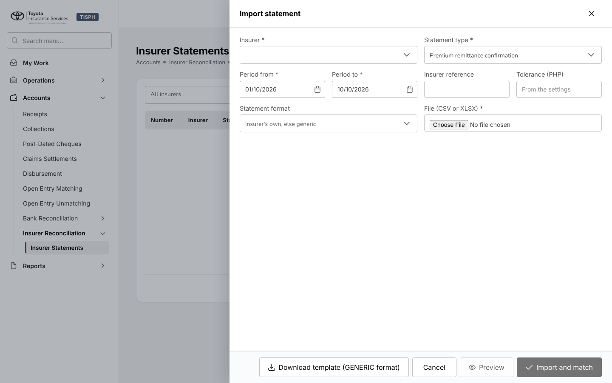
#### Approve an insurer statement reconciliation {#ccd-recon-reconciliation-and-reversals-insurer-approve}
1. Open the statement **Pending approval** from **Approvals** in My Work or from Remittance > Reconciliation.
2. Check the matched lines, the differences and their resolutions.
3. Select **Approve** (with optional remarks) and confirm with **Approve reconciliation**: the adjustment journals
   are posted and the reconciliation is locked. Or select **Reject**, type the reason and confirm with **Reject
   reconciliation**: the statement returns to **Draft** for the preparer.

You cannot approve a reconciliation you submitted yourself: another CCD-Recon (Reconciliation and Reversals) user
approves it. See [Insurer statement reconciliation (18.16)](#insurer-statement-reconciliation).

#### Prepare a remittance to an insurer {#ccd-recon-reconciliation-and-reversals-remittance}
1. Choose Accounts > Remittance > Remittances. **My work** lists the drafts to submit: those of the weekly run
   and those created from a list of policies with
   [Import policy list (18.9.2)](#remittance-import-policy-list).
2. Select the remittance number to open it. On **Lines**, check its policies, the total premium, the commission, the
   tax and the amount due to the insurer against the collections.
3. Select **Submit for approval** and confirm. To submit several drafts at once, tick them on **My work** and select
   **Submit for approval (n)**.

The remittance is **Pending approval**. The users who can approve its amount are notified; you cannot approve a
remittance yourself.

#### Follow a remittance you submitted {#ccd-recon-reconciliation-and-reversals-remittance-approve}
1. Choose Accounts > Remittance > Approvals. The chip **View only** shows that you do not decide remittances.
   **Submitted by me** lists what you submitted, with the approvers each one waits on and its **SLA**.
2. If an approval is late, select **Remind approver** in the row menu (or on the remittance page). A reminder can be
   sent again after a few hours; the menu shows when.
3. A rejected remittance returns to **My work** as **Returned**. Read the reason on its **Activity** tab before you
   submit it again.

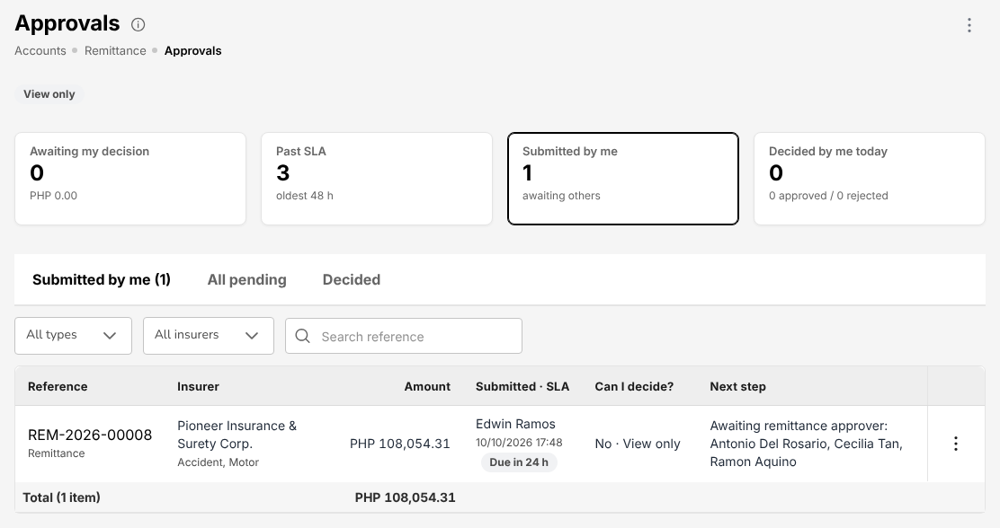
#### Collections, receipts and claim settlement funds {#ccd-recon-reconciliation-and-reversals-other}
You also hold the receipting work of Cash Control when needed:

- [Issue an official receipt (12.7.1)](#ccd-bp-qrph-receipting-official-receipt) and
  [Receipt bills payment and QRPh collections (12.7.2)](#ccd-bp-qrph-receipting-bills-payment)
- [Follow up an overdue premium (12.7.4)](#ccd-bp-qrph-receipting-follow-up)

Disbursement, Open Entry Matching and Open Entry Unmatching are open to you to look up payment vouchers and matched
entries; the changes there are made by TIS Finance & General Accounting.

## TIS Finance & General Accounting {#tis-finance-and-general-accounting}
### Role summary {#tis-finance-and-general-accounting-summary}
**Department:** Finance and Accounting. Disbursements, journal vouchers, payables, fixed assets, commission, remittance and period end.

TIS Finance & General Accounting keeps the books of Toyota Insurance Services Philippines. You prepare the payment
vouchers, cheques and bank payment files, enter the supplier invoices and the journal vouchers, run the depreciation,
prepare the remittances to the insurers and pay the commission of the agents and referrers. Every day the posted
journals go to SAP in the SAP GL export; every month you reconcile the banks, close the period and prepare the BIR
returns; once a year you close the fiscal year.

You are also the checker of the accounting: you approve the cheques, the journal vouchers, the supplier invoices, the
bank reconciliations, the month-end close and the changes to the posting rules of another user. Because the user who
enters a record never approves it, TISPH needs at least two users with this role. You work with Cash Control, who
collect the premiums and reconcile the payments, with the TIS Operations roles, whose bookings, endorsements and claims
create the journals, and with the TIS General Manager and the unit heads, who also approve supplier invoices.

### Menus available {#tis-finance-and-general-accounting-menus}
The menus of this role as delivered. Access: View (open and read), Create and edit (enter and change records), Approve (decide the records of other users).

| Menu | Screen | Access |
|---|---|---|
| My Work | My Work | View |
| Dashboard | Executive Dashboard | View |
| Operations | Payments | View |
| Accounts | Receipts | View |
| Accounts | Collections | View |
| Accounts > Credit Control | Instalment Plans | Approve |
| Accounts > Credit Control | Premium Warranty Monitor | Approve |
| Accounts > Credit Control | Remittance Ageing | View |
| Accounts | Post-Dated Cheques | View |
| Accounts > Payables | Suppliers | Create and edit |
| Accounts > Payables | Supplier 2307 | View |
| Accounts | Disbursement | Create and edit |
| Accounts | Bank Payment Files | Create and edit |
| Accounts > Remittance | Remittances | Create and edit |
| Accounts > Remittance | Approvals | Approve |
| Accounts > Remittance | Insurer payments | Create and edit |
| Accounts > Remittance | Reconciliation | Create and edit |
| Accounts > Remittance | Exceptions | Create and edit |
| Accounts > Remittance | Insurer billing | Create and edit |
| Accounts > Remittance | Setup | Create and edit |
| Accounts > Remittance | Settlement | Create and edit |
| Accounts | Journal Voucher | Create and edit |
| Accounts | SAP GL Export | Create and edit |
| Accounts | Correction JV | Create and edit |
| Accounts | Reversal JV | Create and edit |
| Accounts | Open Entry Matching | View |
| Accounts | Open Entry Unmatching | View |
| Accounts | Accounting Query | View |
| Accounts | All Clients Accounting | View |
| Accounts > Bank Reconciliation | Reconciliation Workspace | Approve |
| Accounts > Bank Reconciliation | Reconciliations | Approve |
| Accounts > Bank Reconciliation | Reconciliation Statement Report | View |
| Accounts > Bank Reconciliation | Outstanding Cheques | View |
| Accounts > Bank Reconciliation | Deposits in Transit | View |
| Accounts > Bank Reconciliation | Unmatched Bank Lines | View |
| Accounts > Bank Reconciliation | Bank Book | View |
| Accounts > Tax | BIR Form 2307 | Create and edit |
| Accounts > Tax | Sales Invoices | Create and edit |
| Accounts > Tax | CAS Books and Documents | Approve |
| Accounts > Period End | Period Management | Approve |
| Accounts > Period End | Month-End Close | Approve |
| Accounts > Period End | Year-End Close | Approve |
| Accounts > Period End | Financial Statements | View |
| Accounts > Incentive | My Programs | View |
| Accounts > Incentive | Calculations | View |
| Accounts > Incentive | Approvals | View |
| Accounts > Incentive | Statement | View |
| Accounts > Incentive | Reports | View |
| Commission | Commission Dashboard | Create and edit |
| Commission | Agents/Referrer Accounts | Create and edit |
| Reports | All Reports | View |
| Reports > Operational Reports | Remittance | View |
| Reports > Operational Reports | Broker Commission | View |
| Reports > Financial Reports | SOA/Premium Receivable | View |
| Reports > Financial Reports | Collection Report | View |
| Reports > Financial Reports | Payables | View |
| Reports > Financial Reports | Journal | View |
| Reports > Financial Reports | Trial Balance | View |
| Reports > Financial Reports | Income Statement | View |
| Reports > Financial Reports | Balance Sheet | View |
| Reports > Financial Reports | Trial Balance Movement | View |
| Reports > Financial Reports | General Ledger Detail | View |
| Reports > Financial Reports | Aged Payables to Insurers | View |
| Reports > Financial Reports | Month-End Close Status | View |
| Reports | Report Builder | View |
| Master > Finance | Account Determination | Approve |
| Master > Finance | Posting Rules | Approve |
| Master > Finance | Configuration Approvals | Approve |
| Master > Finance | Accounting Flow | View |
| Master > Finance | Premium Taxes & LGU Rates | View |
| Master > Finance | Taxation | View |
| Master > Finance | Close Checklist | View |
| Master > Finance | Cost Centres | View |
| Master > Finance | Bank Statement Formats | View |
| Master > Finance | Bank Transaction Types | View |
| Master > Finance | Insurer Statement Formats | View |
| Master > Finance | Bank File Layouts | View |
| Master > System | Schedules | View |
| Master > System | Audit Trail | View |

### What you can view, change and approve {#tis-finance-and-general-accounting-access}
Where: the screens of your menus that show the module. A module without a screen of its own is seen inside the screens of other modules (for example the remittance status of a policy).

| Area | Module | Access | What it allows | Where |
|---|---|---|---|---|
| Sales & Marketing | Prospects and leads | View | See prospects and leads | No screen of its own |
| Sales & Marketing | Quotations and placement | View | See quotations, requests for quotation, placement slips and comparison reports | No screen of its own |
| Sales & Marketing | Dealer programmes | View | See brand-new vehicle programmes and dealer sales uploads; print bank endorsement letters | No screen of its own |
| Operations | Clients | View | See clients | No screen of its own |
| Operations | Policies | View | See policies, cover notes, payments and CTPL authentication | Payments |
| Operations | Endorsements and cancellations | View | See endorsements and cancellations | No screen of its own |
| Operations | Renewals | View | See renewals | No screen of its own |
| Operations | Claims | View | See claims | No screen of its own |
| Operations | Claims | Special | Reverse claim settlement funds or a payment to the claimant recorded in error |  |
| Accounts | Receipts | View | See receipts and post-dated cheques | Receipts and Post-Dated Cheques |
| Accounts | Collections and credit control | View | See collections, instalment plans and credit limits | Collections, Instalment Plans, Premium Warranty Monitor and Remittance Ageing |
| Accounts | Collections and credit control | Approve | Approve premium warranty extensions and client credit limits (not the requester) |  |
| Accounts | Disbursements and petty cash | View | See payment vouchers, petty cash and bank payment files | Disbursement, Bank Payment Files and Insurer payments |
| Accounts | Disbursements and petty cash | Create and edit | Prepare payment vouchers, petty cash and bank payment files |  |
| Accounts | Payables | View | See suppliers, supplier invoices and payments, AP ageing | Suppliers and Supplier 2307 |
| Accounts | Payables | Create and edit | Enter supplier invoices and payments; maintain suppliers |  |
| Accounts | Payables | Approve | Approve supplier invoices (not the preparer) |  |
| Accounts | Fixed assets | View | See the fixed asset register and depreciation | No screen of its own |
| Accounts | Fixed assets | Create and edit | Register assets and run the monthly depreciation |  |
| Accounts | Journal vouchers | View | See journal vouchers and the SAP GL export | Journal Voucher, SAP GL Export, Correction JV and Reversal JV |
| Accounts | Journal vouchers | Create and edit | Enter, correct and reverse journal vouchers; run the SAP GL export |  |
| Accounts | Remittance and insurer reconciliation | View | See remittances to insurers and insurer statements | Remittances, Approvals, Insurer payments, Reconciliation, Exceptions, Insurer billing, Setup and Settlement |
| Accounts | Remittance and insurer reconciliation | Create and edit | Prepare remittances and insurer statement reconciliations |  |
| Accounts | Remittance and insurer reconciliation | Approve | Approve or reject remittances, settlements, adjustments and transfers within the Authority Matrix limit (not the preparer or submitter) |  |
| Accounts | Bank reconciliation | View | See bank reconciliations | Reconciliation Workspace, Reconciliations, Reconciliation Statement Report, Outstanding Cheques, Deposits in Transit, Unmatched Bank Lines and Bank Book |
| Accounts | Bank reconciliation | Create and edit | Prepare bank reconciliations |  |
| Accounts | Bank reconciliation | Approve | Approve and reopen bank reconciliations (not the preparer) |  |
| Accounts | Period end and tax | View | See period status, the close checklist and BIR tax | BIR Form 2307, Sales Invoices, CAS Books and Documents, Period Management, Month-End Close, Year-End Close and Financial Statements |
| Accounts | Period end and tax | Create and edit | Run the month-end and year-end steps and BIR tax returns |  |
| Accounts | Period end and tax | Approve | Approve the close, post into soft-closed periods, reopen periods, reverse a year-end close |  |
| Accounts | Incentives | View | See incentive programmes, calculations and statements | My Programs, Calculations, Approvals, Statement and Reports |
| Commission | Commission | View | See commission, referrer accounts and insurer overrides | Commission Dashboard and Agents/Referrer Accounts |
| Commission | Commission | Create and edit | Process commission and insurer overrides |  |
| Reports | Reports | View | Run and download reports | Remittance, Broker Commission, SOA/Premium Receivable, Collection Report, Payables, Journal, Trial Balance, Income Statement, Balance Sheet, Trial Balance Movement, General Ledger Detail, Aged Payables to Insurers, Month-End Close Status and Report Builder |
| Product Configurator | Products | View | See products and product templates | No screen of its own |
| Master data and configuration | Reference masters | View | See reference masters | Accounting Flow, Taxation, Close Checklist, Cost Centres, Bank Statement Formats, Bank Transaction Types, Insurer Statement Formats and Bank File Layouts |
| Master data and configuration | Distribution channels | View | See dealers, financing banks, affinity partners and their production | No screen of its own |
| Master data and configuration | Posting rules and account determination | Create and edit | Propose changes to posting rules and account determination | Account Determination, Posting Rules and Configuration Approvals |
| Master data and configuration | Posting rules and account determination | Approve | Approve changes to posting rules and account determination (not the requester) |  |
| Master data and configuration | Schedules | View | See scheduled jobs and their runs | Schedules |
| Master data and configuration | Integrations | View | See connectors and the integration outbox and inbox | No screen of its own |
| Master data and configuration | Audit trail | View | See the audit trail | Audit Trail |
| Basic and special access | Basic access | View | Own profile and the look-up lists of every form | No screen of its own |
| Basic and special access | Full personal data | Special | See TIN, government ID numbers, mobile, e-mail, bank account and birth date unmasked on screens and exports | No screen of its own |

### Approvals {#tis-finance-and-general-accounting-approvals}
This role approves the work of other users:

- Approve and reopen bank reconciliations (not the preparer)
- Approve premium warranty extensions and client credit limits (not the requester)
- Approve supplier invoices (not the preparer)
- Approve the close, post into soft-closed periods, reopen periods, reverse a year-end close
- Approve changes to posting rules and account determination (not the requester)
- Approve or reject remittances, settlements, adjustments and transfers within the Authority Matrix limit (not the preparer or submitter)

Approval limits of this role on the Authority Matrix:

| Transaction | Approval step | Limit of the role |
|---|---|---|
| Payment voucher and cheque release | Accounts > Disbursements > Cheque approval, and bank payment batch approval | Not set: no amount limit applies |
| Journal voucher approval | Accounts > Journal Vouchers > Approve | Not set: no amount limit applies |
| Remittance approval | Accounts > Remittance > Approvals | PHP 1,000,000.00 |
| Remittance settlement, adjustment and transfer | Accounts > Remittance > Approvals (settlement, adjustment, transfer) | PHP 1,000,000.00 |

Who approves the work of this role:

| Work | Approval | Approved by |
|---|---|---|
| Bank reconciliation | Approve and reopen bank reconciliations (not the preparer) | TIS Finance & General Accounting |
| Payables | Approve supplier invoices (not the preparer) | TIS Sales Unit Head, TIS Operations Unit Head, TIS Finance & General Accounting or TIS General Manager |
| Period end and tax | Approve the close, post into soft-closed periods, reopen periods, reverse a year-end close | TIS Finance & General Accounting |
| Posting rules and account determination | Approve changes to posting rules and account determination (not the requester) | TIS Finance & General Accounting |
| Remittance and insurer reconciliation | Approve insurer statement reconciliations and post their adjustments (not the preparer) | CCD-Recon (Reconciliation and Reversals) |
| Remittance and insurer reconciliation | Approve or reject remittances, settlements, adjustments and transfers within the Authority Matrix limit (not the preparer or submitter) | TIS Finance & General Accounting or TIS General Manager |
| Accounts > Disbursements > Cheque approval, and bank payment batch approval | Payment voucher and cheque release within the approver's limit | TIS Finance & General Accounting |
| Accounts > Journal Vouchers > Approve | Journal voucher approval within the approver's limit | TIS Finance & General Accounting |
| Accounts > Remittance > Approvals | Remittance approval within the approver's limit | TIS Finance & General Accounting or TIS General Manager |
| Accounts > Remittance > Approvals (settlement, adjustment, transfer) | Remittance settlement, adjustment and transfer within the approver's limit | TIS Finance & General Accounting or TIS General Manager |

The user who enters a record never approves it: the approval is always another user's.

### Segregation of duties {#tis-finance-and-general-accounting-sod}
| Rule | Conflict | When given together | Reason |
|---|---|---|---|
| Administration and transactions | Disbursements and petty cash (create and edit), Journal vouchers (create and edit), Remittance and insurer reconciliation (create and edit) with Users (create and edit), Roles (create and edit), Access control (create and edit) held by the same person | Warning | The person who administers users and access should not enter business or accounting transactions |
| Claims and payment | Disbursements and petty cash (create and edit) with Claims (create and edit) held by the same person | Warning | The claims handler should not also prepare the claim payments |
| Placing and paying insurers | Remittance and insurer reconciliation (create and edit), Disbursements and petty cash (create and edit) with Quotations and placement (create and edit), Policies (create and edit) held by the same person | Warning | The person who places business with an insurer should not also prepare the payments to insurers |

These are the delivered rules. The rules in force are on Master > Users and Access > Segregation of Duties.

### Daily and periodic tasks {#tis-finance-and-general-accounting-tasks}
| Task | When | Screen |
|---|---|---|
| Decide the cheques, journal vouchers, remittances, petty cash requests and other approvals waiting for you | Every morning and through the day | [My Work (2.3)](#my-work) |
| Check the SAP GL file of the previous day; re-generate a day when needed | Every morning | [SAP GL Export (18.12)](#sap-gl-export) |
| Prepare payment vouchers; issue the cheque or the bank transfer | Daily | [Disbursement (18.7)](#disbursement-payment-vouchers-and-cheques), [Bank Payment Files (18.8)](#bank-payment-files) |
| Enter supplier invoices and pay suppliers; issue BIR Form 2307 | As invoices arrive; on the payment run | [Payables (18.5)](#accounts-payable), [BIR Form 2307 for suppliers (18.6)](#bir-form-2307-for-suppliers) |
| Enter, correct or reverse journal vouchers | As needed | [Journal Voucher (18.11)](#journal-vouchers) |
| Prepare the remittances to the insurers and decide those of another user | Every Monday, after the weekly run, and as submitted | [Remittance (18.9)](#remittance-to-insurers) |
| Approve the eligible commission lines and pay the agents and referrers | On each payout | [Agents/Referrer Accounts (19.4)](#commission-to-agents-and-referrers) |
| Reconcile each bank account; approve the reconciliations of another user | Month-end | [Bank Reconciliation (18.15)](#bank-reconciliation) |
| Reconcile the insurers' statements | Month-end | [Insurer Statements (18.16)](#insurer-statement-reconciliation) |
| Run the month-end close and approve the close of another user | Month-end | [Period End (18.20)](#period-end) |
| Prepare and file the BIR returns | Monthly, quarterly and yearly (see [BIR returns (3.12.3)](#process-bir)) | [Tax (18.17)](#tax-bir-forms-and-returns) |
| Approve changes to the posting rules and account determination | When another user proposes one | [Posting configuration (20.14)](#posting-configuration-configuration-approvals-posting-rules-account-determination) |
| Close the fiscal year (April to March) | Once a year, after period 12 | [Year-End Close (18.21)](#year-end-close-preparer) |
| Run the financial reports | Month-end and on request | [All Reports (22.1)](#reports-catalogue) |

### Procedures {#tis-finance-and-general-accounting-procedures}
#### Start the day from My Work {#tis-finance-and-general-accounting-my-work}
1. Choose **My Work**. The tiles show what is overdue, due today and due in the next seven days.
2. Select **Approvals** in the list on the left. The list shows each item waiting for your decision: insurer
   remittances, remittance adjustments, cheque releases, journal vouchers and petty cash requests, with the amount and
   the due date.
3. Select the arrow in **Actions** to open the item on its own screen, check it and approve or reject it there.

Items you entered yourself are not listed for your approval: they wait for another user of your role.

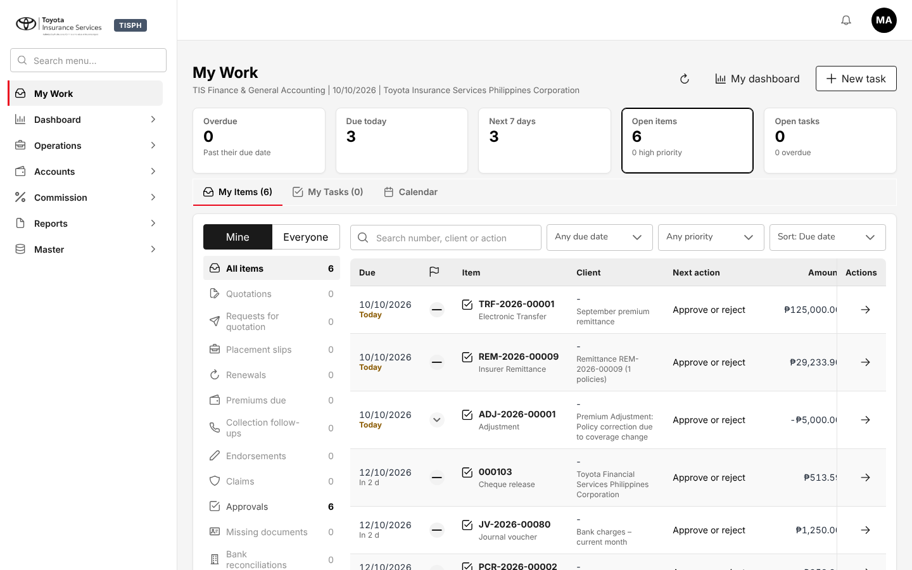
#### Enter a journal voucher {#tis-finance-and-general-accounting-journal-voucher}
1. Choose Accounts > Journal Voucher and select **Voucher**.
2. In **Transaction Code**, select the type of voucher; type the **Transaction Description**; check the **Date**.
3. Select **Add Data** to add a line. In the **Add Journal Voucher** window:
   1. Select the **Main Account** and, where the account has them, the **Sub Account**.
   2. In **Entry Type**, select debit or credit.
   3. Select the **Branch Code** and the **Department Code**. The **Cost Centre** shows the default cost centre;
      change it when the line belongs to another cost centre.
   4. Select the **Currency Code** and type the **Amount**. Add **Remarks** if needed.
   5. Select **Save**.
4. Repeat for every line. **Total Debit** and **Total credit** must be equal (**Net** zero).
5. Select **Submit for approval**. The voucher is **Awaiting approval**.

Another user of TIS Finance & General Accounting approves the voucher from My Work or from the journal voucher list;
the voucher is then **Posted** and goes into the SAP GL file of the day it is approved. The approver must not be the
user who entered it, and must be within the approver's limit for journal vouchers on the
[Authority Matrix (20.10)](#authority-matrix).

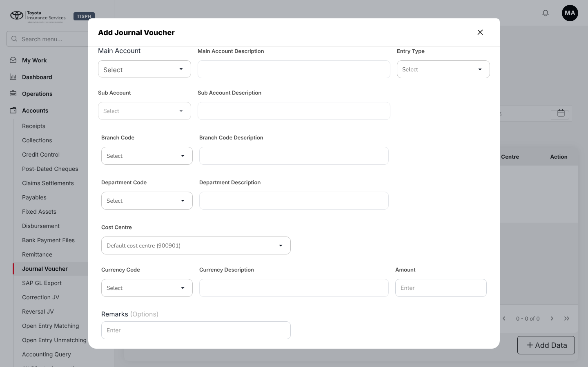
To enter many vouchers at once, select **Upload** and use the template of the screen: one row per line, the same
voucher reference for the lines of one voucher. The whole file is checked first (debits equal credits, accounts open
to manual entries, cost centres valid, period open); one error saves nothing and lists every row to correct. Uploaded
vouchers always wait for approval.

The system's own journals that are parked for approval (for example the bank charges of a statement) are listed when
you tick **System journals parked for approval**, and are approved in the same way. To correct or reverse a posted
voucher, use Accounts > Correction JV or Accounts > Reversal JV.
See [Journal vouchers (18.11)](#journal-vouchers).

#### Check the SAP GL export {#tis-finance-and-general-accounting-sap-gl}
The SAP GL header and line files are written every night at the cut-off with the journals posted since the previous
cut-off.

1. Choose Accounts > SAP GL Export.
2. Check the run of the previous day: **Status**, **Journals / lines**, **Debit** and **Credit** (always equal), and
   **Warnings** (lines on an account outside the SAP chart, or without a cost centre).
3. To send a day again, select **Run now / re-generate**. A re-generation is a new run; every run keeps its files,
   which you download from **Files**.

A journal approved after the cut-off is in the next day's file. See [SAP GL export (18.12)](#sap-gl-export).

#### Pay by cheque: payment voucher and cheque release {#tis-finance-and-general-accounting-disbursement}
1. Choose Accounts > Disbursement and select **Create**.
2. Enter the **Disbursement Date**, **Department Code**, **Branch Code**, **Payee Type** and **Criteria**; select the
   payee (**Customer Code**, **Customer Name**) and, for a policy payment, the **Policy Number**; select the
   **Transaction Type** and the **Payment Currency**; type the **Payment Description**.
3. Select **Next**. In the invoice list, select the payables to pay and select **Next**.
4. In **Select Bank Details**, select the bank account (**Main Account**, **Bank Code**) and the cheque book
   (**Instrument Book ID**), check the **Instrument No** and **Instrument Date** and the **Total Amount**, and select
   **Create Voucher**. The voucher is **Draft** and its cheque **Pending**. A voucher saved without a cheque shows
   **Issue payment** on its detail page.
5. Another user of TIS Finance & General Accounting opens the voucher, selects the cheque in **Cheque book details**
   and selects **Approve**, then **Approve cheque**. The user who created the voucher or issued the cheque cannot
   approve it.
6. When the cheque is printed, select it and select **Print**, then **Print cheque**. The cheque is **Printed** and the
   voucher **Paid**. This cannot be undone.

Payment vouchers are also raised by the system: an approved remittance settlement raises the insurer's voucher, and a commission
payout raises the referrer's voucher. A voucher paid by bank transfer goes into a batch of
Accounts > Bank Payment Files (**New batch**): the batch is approved, its file is uploaded to the bank portal
and the bank's results post each payment. See
[Disbursement: payment vouchers and cheques (18.7)](#disbursement-payment-vouchers-and-cheques) and
[Bank payment files (18.8)](#bank-payment-files).

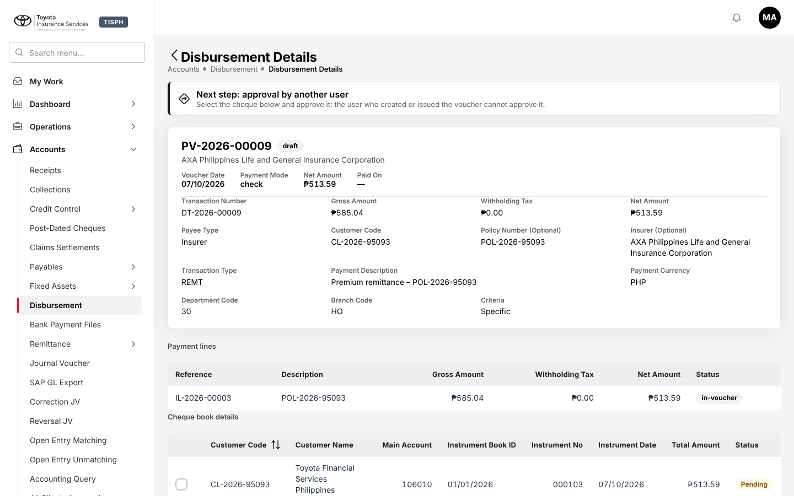
#### Prepare and approve a remittance to an insurer {#tis-finance-and-general-accounting-remittance}
1. Choose Accounts > Remittance > Remittances. **My work** lists the drafts to submit, from the weekly run or
   from [Import policy list (18.9.2)](#remittance-import-policy-list).
2. Open a draft, check its policies and amounts, and select **Submit for approval**. The remittance is **Pending
   approval**.
3. To decide the remittances of another user, choose Accounts > Remittance > Approvals. **Awaiting my decision**
   lists what you may decide within your limit (PHP 1,000,000.00 as delivered). Select the reference, check the review
   panel and select **Approve**, or **Reject** with a reason from the list.
4. Settle the approved remittances on Accounts > Remittance > Settlement and submit the settlement for
   approval. The approved settlement raises the insurer's payment voucher on Disbursement.
5. Pay the voucher from Accounts > Remittance > Insurer payments: in a bank payment batch, or by cheque on Disbursement.

You cannot approve a remittance you prepared or submitted. A remittance above your limit waits for the TIS General
Manager. See [Remittance to insurers (18.9)](#remittance-to-insurers) and [Remittance to the insurers (3.8)](#process-remittance).

#### Pay the commission of agents and referrers {#tis-finance-and-general-accounting-commission}
1. Choose Commission > Agents/Referrer Accounts and open the agent or referrer.
2. Approve the **Eligible** commission lines (the premium of their policy is collected). The accrual journal is posted.
3. Generate the payout. The approved lines go to a payment voucher, net of the referrer's withholding tax, and are
   **Paid** when the voucher is paid.

#### Reconcile a bank account {#tis-finance-and-general-accounting-bank-reconciliation}
1. Choose Accounts > Bank Reconciliation > Reconciliation Workspace, select the **Bank account** and the **Period**.
2. Select **Import statement** and load the bank's statement file (or enter it by hand). A file already imported is
   refused.
3. Select **Auto-match**. The matching rules pair the statement lines with the book entries.
4. Match the remaining lines by hand: tick a bank line and its book entries. Explain a difference with an adjustment
   journal (bank charges, interest, withholding tax on interest) or mark it as a bank or book error.
5. Check the tiles: **Difference** must be PHP 0.00 ("Adjusted balances agree").
6. Select **Start reconciliation**, then **Prepare**. The reconciliation is **Prepared**.
7. Another user of TIS Finance & General Accounting opens the reconciliation on
   Accounts > Bank Reconciliation > Reconciliations and selects **Approve reconciliation**. Every match cleared up
   to the period end is then locked. The user who prepared it cannot approve it.

To change an approved reconciliation, the approver reopens it with remarks: it returns to draft and its matches are
unlocked. Cheques not presented after the stale period are listed with **Stale cheques**. See
[Bank reconciliation (18.15)](#bank-reconciliation).

#### Close the month {#tis-finance-and-general-accounting-month-end}
1. Make sure the month's receipts, remittances, payment vouchers, commission and journal vouchers are posted and the
   bank reconciliations approved.
2. Choose Accounts > Period End > Month-End Close and select **New close run**.
3. Select the **Period**, add **Remarks** if needed and select **Start**.
4. Open the run and select **Run steps**: the accruals, recurring journals, commission deferral, revaluation and the
   close checklist. **Rerun steps** first reverses the run's own journals, so the result is the same as one run.
5. Correct what the **Blocking failures** show and select **Re-run checks**.
6. **Sign off** the manual items of the **Checklist**.
7. Select **Submit close**.
8. Another user of TIS Finance & General Accounting opens the run and selects **Approve close**, or
   **Return to preparer** with a reason. On approval the period is **Closed**.

A period can first be soft-closed on Accounts > Period End > Period Management: only the approvers of the close can then
still post into it. Closing or reopening a period asks for a reason. See [Period end (18.20)](#period-end) and
[Month-end (3.12.2)](#process-month-end-close).

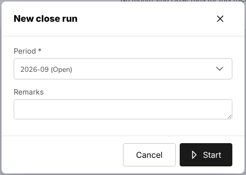
#### Approve a change to the posting rules {#tis-finance-and-general-accounting-posting-rules}
A new version of a posting rule, a change of account determination or of the commission taxes changes no journal until
another user approves it.

1. Choose Master > Finance > Configuration Approvals. **Pending approval** lists each change with what it
   changes, the value before and after, and who requested it.
2. Check the change; for a posting rule, look at its sample journal on Master > Finance > Posting Rules.
3. Approve it, or reject it with a reason. You cannot decide a change you requested.

See [Posting configuration (20.14)](#posting-configuration-configuration-approvals-posting-rules-account-determination).

#### Close the fiscal year {#tis-finance-and-general-accounting-year-end}
1. After period 12 (March) is closed, choose Accounts > Period End > Year-End Close and select
   **Start year-end close**. The pre-checks run at once.
2. Resolve each failed check; post the adjustments of period 13 (they are approved like journal vouchers).
3. Another user of TIS Finance & General Accounting, not the one who started the run, closes the year: the closing
   entries are posted, the balances are carried forward to the next year, the year is locked and the next one created.

See [Year-end (3.12.4)](#process-year-end) and [Year-end close (18.21)](#year-end-close-preparer).

## TIS IT AppSupport / Admin {#tis-it-appsupport-admin}
### Role summary {#tis-it-appsupport-admin-summary}
**Department:** IT. Users, roles, settings, reference masters and interfaces; no business transactions.

TIS IT AppSupport / Admin runs the system for the business. You create the user accounts and give them their TISPH
role, unlock accounts and reset passwords, maintain the access of the roles, the approval limits, the delegations and
the segregation-of-duties rules, and run the quarterly access reviews. You also keep the reference masters (insurers,
products, covers, vehicles, branches, banks), the products of the Product Configurator, the document layouts and
numbering, the scheduled jobs and the interfaces (SMS, e-mail, CTPL authentication, insurers, banks).

You read the business data to answer support questions. As delivered, the role also sets up the dealer programmes
and uploads the dealers' sales files (see [Dealer programme policies (3.3)](#process-dealer-programme)); apart from these,
you enter no business or accounting transaction. Every
change of access you make waits for another user of this role: TISPH needs at least two users with this role. You work
with the department heads, who ask for the access of their staff, with TIS Finance & General Accounting, who approves
the changes to the posting rules, and with the TIS General Manager, who decides the approval limits.

### Menus available {#tis-it-appsupport-admin-menus}
The menus of this role as delivered. Access: View (open and read), Create and edit (enter and change records), Approve (decide the records of other users).

| Menu | Screen | Access |
|---|---|---|
| My Work | My Work | View |
| Dashboard | Executive Dashboard | View |
| Operations > Sales & Marketing | Prospects | View |
| Operations > Sales & Marketing | Requests for Quotation | View |
| Operations > Sales & Marketing | Quotations | View |
| Operations > Sales & Marketing | Placement Slips | View |
| Operations > Sales & Marketing | Lead Assignment | View |
| Operations > Sales & Marketing | Dealer Programmes | Create and edit |
| Operations | Clients | View |
| Operations | Policy | View |
| Operations | Claims | View |
| Operations > Renewals | Renewal Policy | View |
| Operations > Renewals | Renewal Batch | View |
| Operations > Renewals | Renewal Queue | View |
| Operations > Renewals | Lock-in Accounts | View |
| Operations > Renewals | Negotiations | View |
| Operations > Renewals | Lapse Management | View |
| Operations | Payments | View |
| Operations | Cover Notes | View |
| Operations | Policy Cancellation | View |
| Accounts | Receipts | View |
| Accounts | Collections | View |
| Accounts | Post-Dated Cheques | View |
| Accounts > Payables | Suppliers | View |
| Accounts > Payables | Supplier 2307 | View |
| Accounts | Disbursement | View |
| Accounts > Remittance | Remittances | View |
| Accounts > Remittance | Approvals | View |
| Accounts > Remittance | Insurer payments | View |
| Accounts > Remittance | Reconciliation | View |
| Accounts > Remittance | Exceptions | View |
| Accounts > Remittance | Insurer billing | View |
| Accounts > Remittance | Setup | View |
| Accounts > Remittance | Settlement | View |
| Accounts | Journal Voucher | View |
| Commission | Commission Dashboard | View |
| Reports | All Reports | View |
| Reports > Operational Reports | Production | View |
| Reports > Operational Reports | Claims | View |
| Reports > Operational Reports | Renewal | View |
| Reports > Operational Reports | Remittance | View |
| Reports > Operational Reports | Broker Commission | View |
| Reports > Operational Reports | Dealer Production | View |
| Reports > Financial Reports | SOA/Premium Receivable | View |
| Reports > Financial Reports | Collection Report | View |
| Reports > Financial Reports | Payables | View |
| Reports > Financial Reports | Journal | View |
| Reports > Financial Reports | Trial Balance | View |
| Reports > Financial Reports | Income Statement | View |
| Reports > Financial Reports | Balance Sheet | View |
| Reports > Financial Reports | Trial Balance Movement | View |
| Reports > Financial Reports | General Ledger Detail | View |
| Reports > Financial Reports | Aged Payables to Insurers | View |
| Reports > Financial Reports | Month-End Close Status | View |
| Master > Organization | Company | Create and edit |
| Master > Organization | Branch | Create and edit |
| Master > Organization | Sales Activity Types | Create and edit |
| Master > Organization | Sales Activity Outcomes | Create and edit |
| Master > Insurance | Insurance Company | Create and edit |
| Master > Insurance | Line of Business | Create and edit |
| Master > Insurance | Product | Create and edit |
| Master > Insurance | Cover | Create and edit |
| Master > Insurance | Signatories | Create and edit |
| Master > Insurance | Vehicle | Create and edit |
| Master > Insurance | Short-Period Rates | Create and edit |
| Master > Insurance | Cancellation Reasons | Create and edit |
| Master > Insurance | Claim Document Checklist | Create and edit |
| Master > Insurance | Repair Shops | Create and edit |
| Master > Insurance | Lead Sources | Create and edit |
| Master > Insurance | Reason Codes | Create and edit |
| Master > Insurance | Distribution Channels | Create and edit |
| Master > Location | Country | Create and edit |
| Master > Location | Province | Create and edit |
| Master > Location | City / Municipality | Create and edit |
| Master > Employees | Hierarchy | Create and edit |
| Master > Employees | Designation | Create and edit |
| Master > Users and Access | User | Create and edit |
| Master > Users and Access | Role | Create and edit |
| Master > Users and Access | User Access Matrix | Create and edit |
| Master > Users and Access | Role Permissions | Create and edit |
| Master > Users and Access | Authority Matrix | Approve |
| Master > Users and Access | Delegations | Approve |
| Master > Users and Access | Segregation of Duties | Approve |
| Master > Users and Access | Access Reviews | Approve |
| Master > Finance | Premium Taxes & LGU Rates | Create and edit |
| Master > Finance | Commission Rate Matrix | Create and edit |
| Master > Finance | Transaction Code | Create and edit |
| Master > Finance | Currency | Create and edit |
| Master > Finance | Bank | Create and edit |
| Master > System | E-mail Layout | Create and edit |
| Master > System | Documents and Reports Layout | Create and edit |
| Master > System | Document Signatures | Create and edit |
| Master > System | Configuration | Create and edit |
| Master > System | Document Numbering | Create and edit |
| Master > System | Schedules | Create and edit |
| Master > System | Audit Trail | View |
| Master > System | E-mail Outbox | Create and edit |
| Master > System | Integrations | Create and edit |
| Master > System | Features & Releases | View |
| Product Configurator | Dashboard | Create and edit |
| Product Configurator | Product Templates | Create and edit |
| Product Configurator | Coverage Builder | Create and edit |
| Product Configurator | Rating Engine | Create and edit |
| Product Configurator | Acceptance Rules | Create and edit |
| Product Configurator | Document Manager | Create and edit |
| Product Configurator | Market Mapping | Create and edit |
| Product Configurator | Risk Mapping | Create and edit |

### What you can view, change and approve {#tis-it-appsupport-admin-access}
Where: the screens of your menus that show the module. A module without a screen of its own is seen inside the screens of other modules (for example the remittance status of a policy).

| Area | Module | Access | What it allows | Where |
|---|---|---|---|---|
| Sales & Marketing | Prospects and leads | View | See prospects and leads | Prospects |
| Sales & Marketing | Quotations and placement | View | See quotations, requests for quotation, placement slips and comparison reports | Requests for Quotation, Quotations and Placement Slips |
| Sales & Marketing | Dealer programmes | View | See brand-new vehicle programmes and dealer sales uploads; print bank endorsement letters | Dealer Programmes |
| Sales & Marketing | Dealer programmes | Create and edit | Maintain programmes and upload dealer vehicle sales |  |
| Operations | Clients | View | See clients | Clients |
| Operations | Policies | View | See policies, cover notes, payments and CTPL authentication | Policy, Payments and Cover Notes |
| Operations | Endorsements and cancellations | View | See endorsements and cancellations | Policy Cancellation |
| Operations | Renewals | View | See renewals | Renewal Policy, Renewal Batch, Renewal Queue, Lock-in Accounts, Negotiations and Lapse Management |
| Operations | Claims | View | See claims | Claims |
| Accounts | Receipts | View | See receipts and post-dated cheques | Receipts and Post-Dated Cheques |
| Accounts | Collections and credit control | View | See collections, instalment plans and credit limits | Collections |
| Accounts | Disbursements and petty cash | View | See payment vouchers, petty cash and bank payment files | Disbursement and Insurer payments |
| Accounts | Payables | View | See suppliers, supplier invoices and payments, AP ageing | Suppliers and Supplier 2307 |
| Accounts | Fixed assets | View | See the fixed asset register and depreciation | No screen of its own |
| Accounts | Journal vouchers | View | See journal vouchers and the SAP GL export | Journal Voucher |
| Accounts | Remittance and insurer reconciliation | View | See remittances to insurers and insurer statements | Remittances, Approvals, Insurer payments, Reconciliation, Exceptions, Insurer billing, Setup and Settlement |
| Accounts | Incentives | View | See incentive programmes, calculations and statements | No screen of its own |
| Commission | Commission | View | See commission, referrer accounts and insurer overrides | Commission Dashboard |
| Reports | Reports | View | Run and download reports | Production, Claims, Renewal, Remittance, Broker Commission, Dealer Production, SOA/Premium Receivable, Collection Report, Payables, Journal, Trial Balance, Income Statement, Balance Sheet, Trial Balance Movement, General Ledger Detail, Aged Payables to Insurers and Month-End Close Status |
| Product Configurator | Products | View | See products and product templates | Dashboard, Product Templates, Coverage Builder, Rating Engine, Acceptance Rules, Document Manager, Market Mapping and Risk Mapping |
| Product Configurator | Products | Create and edit | Configure products, covers, rating and rules |  |
| Master data and configuration | Reference masters | View | See reference masters | Company, Branch, Sales Activity Types, Sales Activity Outcomes, Insurance Company, Line of Business, Product, Cover, Signatories, Vehicle, Short-Period Rates, Cancellation Reasons, Claim Document Checklist, Repair Shops, Lead Sources, Reason Codes, Country, Province, City / Municipality, Hierarchy, Designation, Commission Rate Matrix, Transaction Code, Currency, Bank, E-mail Layout, Documents and Reports Layout, Document Signatures, Document Numbering and E-mail Outbox |
| Master data and configuration | Reference masters | Create and edit | Maintain reference masters |  |
| Master data and configuration | Distribution channels | View | See dealers, financing banks, affinity partners and their production | Distribution Channels |
| Master data and configuration | Distribution channels | Create and edit | Maintain distribution channels |  |
| Master data and configuration | Premium taxes and LGU rates | Create and edit | Maintain premium taxes and charges and the LGU tax rates | Premium Taxes & LGU Rates |
| Master data and configuration | System settings | View | See system settings | Configuration |
| Master data and configuration | System settings | Create and edit | Change system settings |  |
| Master data and configuration | Schedules | View | See scheduled jobs and their runs | Schedules |
| Master data and configuration | Schedules | Create and edit | Run, switch on or off and reschedule jobs |  |
| Master data and configuration | Integrations | View | See connectors and the integration outbox and inbox | Integrations |
| Master data and configuration | Integrations | Create and edit | Configure connectors and message templates; resend or cancel messages |  |
| Master data and configuration | Audit trail | View | See the audit trail | Audit Trail |
| Master data and configuration | Features and releases | View | See the catalogue of features and releases with their status (read only) | Features & Releases |
| Users and access | Users | View | See users and their sign-in history | User and User Access Matrix |
| Users and access | Users | Create and edit | Create users, change their roles, reset passwords, lock and unlock |  |
| Users and access | Roles | Create and edit | Create roles and request changes to their access | Role and Role Permissions |
| Users and access | Access control | View | See access matrices, role permissions, authority limits, delegations, segregation of duties and access reviews | Authority Matrix, Delegations, Segregation of Duties and Access Reviews |
| Users and access | Access control | Create and edit | Propose authority limits, record delegations, maintain segregation of duties, run access reviews |  |
| Users and access | Access control | Approve | Approve role access changes and authority limits of another administrator |  |
| Basic and special access | Basic access | View | Own profile and the look-up lists of every form | No screen of its own |

### Approvals {#tis-it-appsupport-admin-approvals}
This role approves the work of other users:

- Approve role access changes and authority limits of another administrator

Who approves the work of this role:

| Work | Approval | Approved by |
|---|---|---|
| Access control | Approve role access changes and authority limits of another administrator | TIS IT AppSupport / Admin |
| Accounts > Remittance > Approvals | Remittance approval within the approver's limit | TIS Finance & General Accounting or TIS General Manager |
| Accounts > Remittance > Approvals (settlement, adjustment, transfer) | Remittance settlement, adjustment and transfer within the approver's limit | TIS Finance & General Accounting or TIS General Manager |

The user who enters a record never approves it: the approval is always another user's.

### Segregation of duties {#tis-it-appsupport-admin-sod}
| Rule | Conflict | When given together | Reason |
|---|---|---|---|
| Administration and transactions | Users (create and edit), Roles (create and edit), Access control (create and edit) with Receipts (create and edit), Collections and credit control (create and edit), Disbursements and petty cash (create and edit), Journal vouchers (create and edit), Remittance and insurer reconciliation (create and edit), Policies (create and edit), Quotations and placement (create and edit), Claims (create and edit) held by the same person | Warning | The person who administers users and access should not enter business or accounting transactions |

These are the delivered rules. The rules in force are on Master > Users and Access > Segregation of Duties.

### Daily and periodic tasks {#tis-it-appsupport-admin-tasks}
| Task | When | Screen |
|---|---|---|
| Decide the changes of access of the other administrator waiting for you | Every morning and through the day | [My Work (2.3)](#my-work), [Role Permissions (20.8)](#roles-and-role-permissions) |
| Check the scheduled jobs: last run, last status, failures | Every morning | [Schedules (20.25)](#schedules) |
| Check the messages waiting or failed: e-mails, SMS, insurer and bank interfaces | Every morning | [E-mail Outbox (20.28)](#e-mail-outbox), [Integrations (20.29)](#integrations) |
| Create accounts for new staff; deactivate leavers | On the request of the department head; on the last working day | [User (20.7)](#users) |
| Unlock an account, reset a password, turn off two-step verification after a lost phone | On the user's request | [User (20.7)](#users) |
| Change the access of a role | On an approved access request | [Role Permissions (20.8)](#roles-and-role-permissions) |
| Record the approval limits decided by Management | When Management changes them | [Authority Matrix (20.10)](#authority-matrix) |
| Record the cover for an approver who is away | Before the leave | [Delegations (20.11)](#delegations) |
| Follow the segregation-of-duties conflicts and their exceptions | Weekly | [Segregation of Duties (20.12)](#segregation-of-duties), [User Access Matrix (20.9)](#user-access-matrix) |
| Review the access of every user | At least every quarter | [Access Reviews (20.13)](#access-reviews) |
| Set up the dealer programmes and upload the dealers' sales files | When a programme is agreed; as the dealers send their files | [Dealer Programmes (17.7)](#dealer-programmes) |
| Maintain the reference masters | On the request of the business | [Masters that work the same way (20.4)](#masters-that-work-the-same-way) |
| Configure products, covers, rating and acceptance rules | On the request of the business | [Product Templates (21.2)](#product-templates) |
| Maintain the document layouts, signatures and numbering | On the request of the business | [Documents and Reports Layout (20.21)](#documents-and-reports-layout), [Document Numbering (20.24)](#document-numbering) |
| Answer audit questions: who changed what and when | On request | [Audit Trail (20.26)](#audit-trail) |

### Procedures {#tis-it-appsupport-admin-procedures}
#### Create a user account {#tis-it-appsupport-admin-create-user}
1. Choose Master > Users and Access > User and select **Add**.
2. Type the **Username**, the **E-mail** and the **Display Name**.
3. Leave **Password** empty: the system creates a temporary password.
4. Select the **Branch**, the **Designation** and **Reporting to**.
5. Under **Roles**, tick the TISPH role of the user. The roles are grouped by department, each with a one-line summary.
6. Select **Save**.
7. The temporary password is shown once. Give it to the user in person or by phone. The user must choose a new
   password at the first sign-in.

Users who sign in with **Sign in with Microsoft** are matched to their account by e-mail: the **E-mail** (or the
**Username**) must be the user's Microsoft 365 address. At the first sign-in the account is bound to that Microsoft
account; later sign-ins must come from the same Microsoft account. When you give roles that one person should not hold together, the system warns
you, or refuses a combination its rule blocks; see [Segregation of Duties (20.12)](#segregation-of-duties).

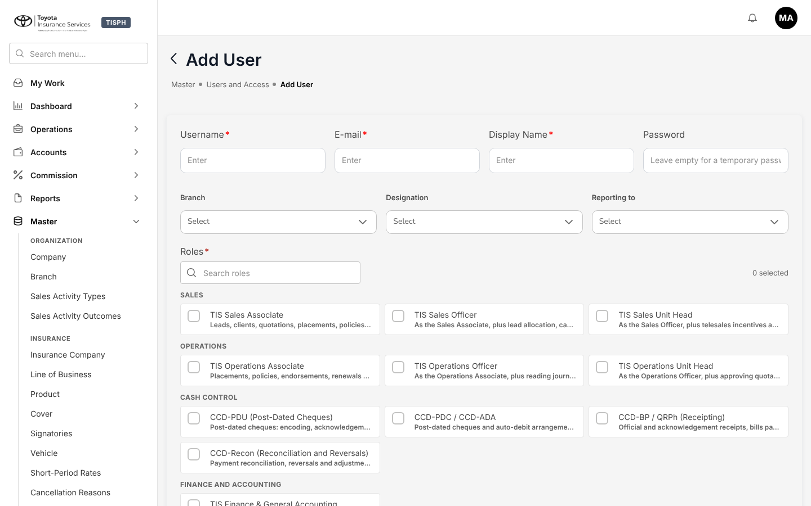
> You cannot change your own account or roles, nor give a role that includes the built-in administrator. Another
> administrator changes your account.

#### Unlock an account or reset a password {#tis-it-appsupport-admin-account-actions}
1. Choose Master > Users and Access > User and find the user.
2. Open the account actions of the user's row and select one of:
   - **Unlock**: the account is unlocked and its failed sign-in attempts are cleared. Confirm with **Unlock account**.
   - **Reset password**: the account receives a temporary password, shown once; the user's sessions end and the user
     must choose a new password at the next sign-in. Give the password to the user in person or by phone.
   - **Turn off two-step verification** (for example after a lost phone): the user signs in with the password alone
     until two-step verification is set up again.
   - **Sign-in history**: the user's sign-ins with the device and the result.

To stop a leaver from signing in, switch off the **Status** of the user in the list; the account is inactive. Each action is recorded in the
[Audit Trail (20.26)](#audit-trail). See [Users (20.7)](#users).

#### Change the access of a role {#tis-it-appsupport-admin-role-access}
1. Choose Master > Users and Access > Role Permissions.
2. On **By role**, select the role. The modules of the role show their access: **View**, **Create and edit**,
   **Approve**.
3. Select **Edit access** and switch the access on or off module by module. The bar at the bottom counts the changes.
4. Select **Review and submit**. The system lists the segregation-of-duties rules the change would break, for the
   role and for its users.
5. Select the reason and submit the change. It waits on **Waiting for approval**; one change per role waits at a time.
6. Another user of TIS IT AppSupport / Admin opens **Waiting for approval** (or My Work) and selects **Approve**, or
   **Reject** with the reason. The change applies at once to every active user of the role, whose sessions are
   renewed.

The approver is never the requester and must not hold the role changed. You cannot change a role you hold: a change to
the TIS IT AppSupport / Admin role itself is made by the built-in administrator. The requester can **Withdraw** a change
before it is decided. Use **Compare roles** to see two roles side by side and **Export to Excel** for the access of
every role. See [Roles and role permissions (20.8)](#roles-and-role-permissions).

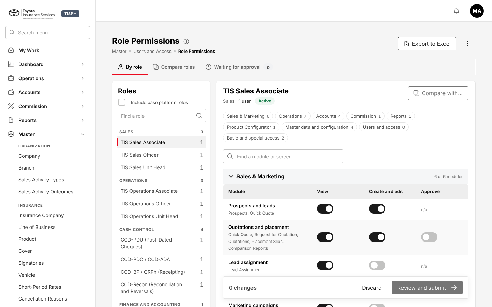
#### Record approval limits {#tis-it-appsupport-admin-authority-matrix}
1. Choose Master > Users and Access > Authority Matrix. The matrix shows the transactions down and the
   approver roles across, by department, with the limit in effect in each cell; a cell without a limit shows
   **Not set**.
2. Select the cell and **Set a limit** (amount in PHP), or no limit, with the **Effective from** date (today or
   later), the **Authority reference** and its **Reference date**, and the **Remarks for the approver**. To change many cells at once, select **Download**, fill the file
   and select **Upload**: the whole file is checked and nothing is saved while one row is wrong.
3. Submit the change. It waits on **Pending approval**.
4. Another user of TIS IT AppSupport / Admin approves it, or rejects it with the reason. The limits apply from their
   effective date.

Nobody approves a change to his or her own personal limit or to the limit of a role he or she holds. While a cell is
**Not set**, the delivered rule lets the approver approve without an amount check (shown as "Approver without a limit:
may approve"). See [Authority Matrix (20.10)](#authority-matrix).

#### Record a delegation {#tis-it-appsupport-admin-delegation}
1. Choose Master > Users and Access > Delegations and select **New delegation**.
2. Select the approver who is away, the person covering, the transactions and the dates (from today, for a limited
   number of days), and the reason.
3. Submit. The delegation waits for approval by another user of TIS IT AppSupport / Admin, who is neither the
   requester nor the person covering.

Once approved, the person covering approves the chosen transactions with the limit of the approver who is away, for
the dates chosen; both people are told. Select **End early** with the **Reason for ending** to stop a delegation. See
[Delegations (20.11)](#delegations).

#### Follow segregation-of-duties conflicts {#tis-it-appsupport-admin-conflicts}
1. Choose Master > Users and Access > Segregation of Duties.
2. On **Conflicts**, check each user with an **Open** conflict: the roles held, the rule broken and its state.
3. Remove the conflicting role from the user, or select **Request exception** with a reason and an end date. The
   exception waits for approval by another administrator; the person concerned does not approve it.

New rules (**New rule**), changes (**Edit rule**) and switching a rule off (**Switch off**) also wait for the approval of
another administrator. A **Block** rule refuses the combination of roles when they are given; a **Warn** rule allows it
and lists the person here. The delivered TISPH rules warn. The Master > Users and Access > User Access Matrix
shows, for each user, the roles, the last sign-in, two-step verification, the password age and the conflicts. See
[Segregation of Duties (20.12)](#segregation-of-duties) and [User Access Matrix (20.9)](#user-access-matrix).

#### Run the quarterly access review {#tis-it-appsupport-admin-access-review}
1. Choose Master > Users and Access > Access Reviews and select **Start a review**.
2. Check the **Review** name and the **Due** date; choose the **Scope**: **All active users**, **Departments** or
   **Roles**. The window counts the users to be reviewed. Select **Start**.
3. For each user, with the department head, decide: **Keep access**, **Remove roles** or **Deactivate account** (a
   removal needs a reason). You cannot decide your own line.
4. When every line is decided, select **Submit for sign-off**.
5. Another user of TIS IT AppSupport / Admin, who decided none of its lines, selects **Sign off**. The roles removed are taken away, the
   accounts deactivated and the users' sessions renewed; the review is closed.

See [Access Reviews (20.13)](#access-reviews).

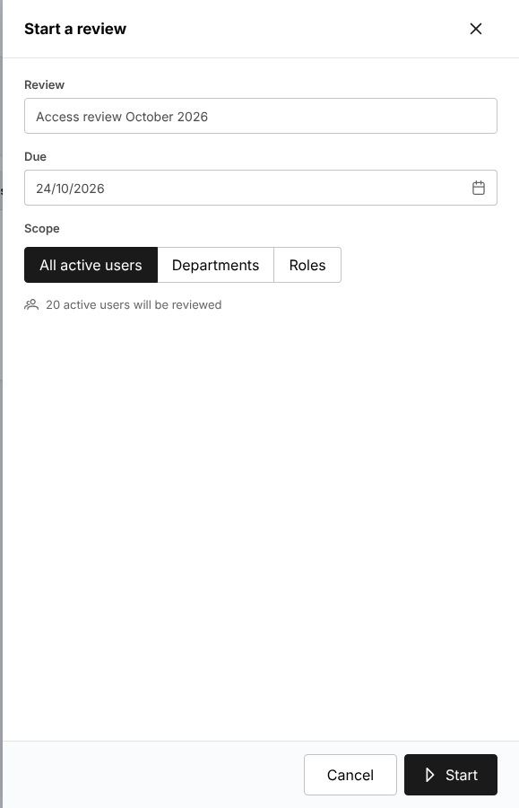
#### Maintain a reference master {#tis-it-appsupport-admin-masters}
1. Choose the master on the Master menu, for example Master > Insurance > Insurance Company or
   Master > Insurance > Vehicle.
2. Select **Add** for a new record, or the edit icon of a record; fill in the form and save.
3. To withdraw a record, set it inactive rather than deleting it: the records already using it keep it.

Some finance masters (posting rules, account determination, account roles) are maintained by TIS Finance &
General Accounting; a change you propose to the accounting accounts waits for their approval on
Master > Finance > Configuration Approvals. See [Masters that work the same way (20.4)](#masters-that-work-the-same-way),
[Insurance companies (20.3)](#insurance-companies) and [Distribution Channels (20.1)](#distribution-channels).

#### Configure a product {#tis-it-appsupport-admin-product}
1. Choose Product Configurator > Product Templates. The template marked **In use** is the one the business applies to
   its product.
2. Select **Create Template**, or the edit icon of a template, and set its covers
   (Product Configurator > Coverage Builder), rating (Product Configurator > Rating Engine), acceptance rules
   (Product Configurator > Acceptance Rules), documents (Product Configurator > Document Manager) and insurer
   market (Product Configurator > Market Mapping).
3. Select **Activate** and confirm with **Activate template**. The template applies to new quotations; quotations
   already issued are not changed. **Deactivate** stops its use for new quotations.

See [Product Templates (21.2)](#product-templates) and the other sections of the Product Configurator.

#### Watch the scheduled jobs {#tis-it-appsupport-admin-schedules}
1. Choose Master > System > Schedules. Each job shows what it does, its schedule (Asia/Manila time), its
   status (**Scheduled** or **Switched off**), the next run, the last run and the last status.
2. Select the run history icon of a job to see its runs and the error of a failed run.
3. To run a job outside its schedule, select the run icon and confirm with **Run job**: what the job sends or updates
   is sent or updated as on a scheduled run.
4. To change the schedule of a job or switch it on or off (**Enabled**), select **Edit schedule**.

Agree with TIS Finance & General Accounting before you switch on or reschedule an accounting job (recurring journals,
accrual auto-reversal, period auto soft-close, SAP GL export). See [Schedules (20.25)](#schedules).

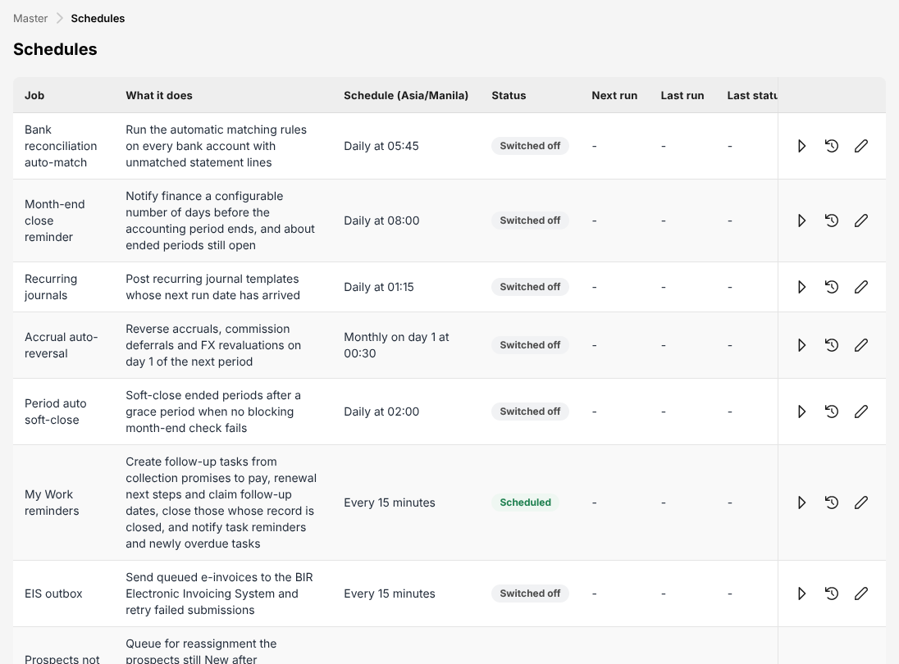
#### Resend a message that failed {#tis-it-appsupport-admin-messages}
1. Choose Master > System > Integrations. **Connectors** shows each interface with its mode, the messages
   waiting, failed and sent today, and the last success and failure.
2. Open **Outbox** to see the messages sent and failed, with the error; resend or cancel a failed message.
3. Select **Send due messages** to send the messages waiting now.
4. For e-mails, choose Master > System > E-mail Outbox: each e-mail shows its status, attempts and last
   error.

See [Integrations (20.29)](#integrations) and [E-mail Outbox (20.28)](#e-mail-outbox).

## TIS General Manager {#tis-general-manager}
### Role summary {#tis-general-manager-summary}
**Department:** Management. Front office with every approval; reads accounting and the audit trail.

The TIS General Manager oversees the business of Toyota Insurance Services Philippines. You hold every approval of
the front office: the check of the insurers' e-policies against the placement slips, the renewal terms, the return
premiums and cancellations, and the claim decisions and settlement approvals. You approve supplier invoices and the
remittances to the insurers above the limit of TIS Finance & General Accounting, follow the business on the dashboards
and reports, and review who has access to what.

Apart from the remittance approvals, you read the accounting (receipts, remittances, journals, period end, tax)
without changing it, and you read users,
roles, access, the Authority Matrix, segregation of duties and the audit trail without changing them: those are kept
by TIS Finance & General Accounting and TIS IT AppSupport / Admin. You never decide a record you entered yourself.

### Menus available {#tis-general-manager-menus}
The menus of this role as delivered. Access: View (open and read), Create and edit (enter and change records), Approve (decide the records of other users).

| Menu | Screen | Access |
|---|---|---|
| My Work | My Work | View |
| Dashboard | Executive Dashboard | View |
| Dashboard | Claims Dashboard | View |
| Dashboard | Processing Dashboard | View |
| Operations > Sales & Marketing | Prospects | Create and edit |
| Operations > Sales & Marketing | Quick Quote | Create and edit |
| Operations > Sales & Marketing | Requests for Quotation | Create and edit |
| Operations > Sales & Marketing | Quotations | Approve |
| Operations > Sales & Marketing | Placement Slips | Approve |
| Operations > Sales & Marketing | Lead Assignment | Create and edit |
| Operations > Sales & Marketing | Dealer Programmes | View |
| Operations > Sales & Marketing | Sales Activities | Create and edit |
| Operations | Clients | Create and edit |
| Operations | Policy | Approve |
| Operations | Fleet Schedules | Create and edit |
| Operations | Marine Open Covers | Create and edit |
| Operations | Claims | Approve |
| Operations > Renewals | Renewal Policy | Approve |
| Operations > Renewals | Renewal Batch | Create and edit |
| Operations > Renewals | Renewal Queue | Create and edit |
| Operations > Renewals | Lock-in Accounts | Create and edit |
| Operations > Renewals | Negotiations | Approve |
| Operations > Renewals | Lapse Management | Create and edit |
| Operations | Payments | Create and edit |
| Operations | Cover Notes | Create and edit |
| Operations | Policy Cancellation | Create and edit |
| Operations | Claims Awaiting Documents | Create and edit |
| Operations | Motor Claim Repairs | Create and edit |
| Accounts | Receipts | View |
| Accounts | Collections | View |
| Accounts > Credit Control | Instalment Plans | View |
| Accounts > Credit Control | Premium Warranty Monitor | View |
| Accounts > Credit Control | Remittance Ageing | View |
| Accounts | Post-Dated Cheques | View |
| Accounts > Payables | Suppliers | View |
| Accounts > Payables | Supplier 2307 | View |
| Accounts | Disbursement | View |
| Accounts | Bank Payment Files | View |
| Accounts > Remittance | Remittances | View |
| Accounts > Remittance | Approvals | Approve |
| Accounts > Remittance | Insurer payments | View |
| Accounts > Remittance | Reconciliation | View |
| Accounts > Remittance | Exceptions | View |
| Accounts > Remittance | Insurer billing | View |
| Accounts > Remittance | Settlement | View |
| Accounts | Journal Voucher | View |
| Accounts | SAP GL Export | View |
| Accounts | Correction JV | View |
| Accounts | Reversal JV | View |
| Accounts | Open Entry Matching | View |
| Accounts | Open Entry Unmatching | View |
| Accounts | Accounting Query | View |
| Accounts | All Clients Accounting | View |
| Accounts > Bank Reconciliation | Reconciliation Workspace | View |
| Accounts > Bank Reconciliation | Reconciliations | View |
| Accounts > Bank Reconciliation | Reconciliation Statement Report | View |
| Accounts > Bank Reconciliation | Outstanding Cheques | View |
| Accounts > Bank Reconciliation | Deposits in Transit | View |
| Accounts > Bank Reconciliation | Unmatched Bank Lines | View |
| Accounts > Bank Reconciliation | Bank Book | View |
| Accounts > Tax | BIR Form 2307 | View |
| Accounts > Tax | Sales Invoices | View |
| Accounts > Tax | CAS Books and Documents | View |
| Accounts > Period End | Period Management | View |
| Accounts > Period End | Month-End Close | View |
| Accounts > Period End | Year-End Close | View |
| Accounts > Period End | Financial Statements | View |
| Accounts > Incentive | My Programs | View |
| Accounts > Incentive | Calculations | View |
| Accounts > Incentive | Approvals | View |
| Accounts > Incentive | Statement | View |
| Accounts > Incentive | Reports | View |
| Commission | Commission Dashboard | View |
| Commission | Agents/Referrer Accounts | View |
| Reports | All Reports | View |
| Reports > Operational Reports | Production | View |
| Reports > Operational Reports | Claims | View |
| Reports > Operational Reports | Renewal | View |
| Reports > Operational Reports | Remittance | View |
| Reports > Operational Reports | Broker Commission | View |
| Reports > Operational Reports | Dealer Production | View |
| Reports > Financial Reports | SOA/Premium Receivable | View |
| Reports > Financial Reports | Collection Report | View |
| Reports > Financial Reports | Payables | View |
| Reports > Financial Reports | Journal | View |
| Reports > Financial Reports | Trial Balance | View |
| Reports > Financial Reports | Income Statement | View |
| Reports > Financial Reports | Balance Sheet | View |
| Reports > Financial Reports | Trial Balance Movement | View |
| Reports > Financial Reports | General Ledger Detail | View |
| Reports > Financial Reports | Aged Payables to Insurers | View |
| Reports > Financial Reports | Month-End Close Status | View |
| Master > Insurance | Distribution Channels | View |
| Master > Users and Access | User | View |
| Master > Users and Access | Role | View |
| Master > Users and Access | User Access Matrix | View |
| Master > Users and Access | Role Permissions | View |
| Master > Users and Access | Authority Matrix | View |
| Master > Users and Access | Segregation of Duties | View |
| Master > System | Audit Trail | View |
| Master > System | Features & Releases | View |
| Product Configurator | Dashboard | View |
| Product Configurator | Product Templates | View |

### What you can view, change and approve {#tis-general-manager-access}
Where: the screens of your menus that show the module. A module without a screen of its own is seen inside the screens of other modules (for example the remittance status of a policy).

| Area | Module | Access | What it allows | Where |
|---|---|---|---|---|
| Sales & Marketing | Prospects and leads | View | See prospects and leads | Prospects and Quick Quote |
| Sales & Marketing | Prospects and leads | Create and edit | Create and edit prospects and leads |  |
| Sales & Marketing | Quotations and placement | View | See quotations, requests for quotation, placement slips and comparison reports | Quick Quote, Requests for Quotation, Quotations and Placement Slips |
| Sales & Marketing | Quotations and placement | Create and edit | Create quotations (Quick Quote too), send requests for quotation, prepare placement slips |  |
| Sales & Marketing | Quotations and placement | Approve | Approve a quotation created by another user |  |
| Sales & Marketing | Lead assignment | View | See assignment rules, the reassignment queue and every team's prospects | Lead Assignment |
| Sales & Marketing | Lead assignment | Create and edit | Maintain assignment rules and reassign prospects |  |
| Sales & Marketing | Dealer programmes | View | See brand-new vehicle programmes and dealer sales uploads; print bank endorsement letters | Dealer Programmes |
| Sales & Marketing | Marketing campaigns | View | See campaigns, segments, templates and results | No screen of its own |
| Sales & Marketing | Marketing campaigns | Create and edit | Prepare and send campaigns; maintain segments and templates |  |
| Sales & Marketing | Sales activities | View | See activity timelines and the activity report | Sales Activities |
| Sales & Marketing | Sales activities | Create and edit | Log, change and cancel calls, meetings, e-mails and visits |  |
| Operations | Clients | View | See clients | Clients |
| Operations | Clients | Create and edit | Create and edit clients |  |
| Operations | Policies | View | See policies, cover notes, payments and CTPL authentication | Policy, Payments and Cover Notes |
| Operations | Policies | Create and edit | Record and issue policies, cover notes and CTPL certificates |  |
| Operations | Policies | Approve | Decide the check of a placement against the slip, and complete the cancellations and return premiums of another user |  |
| Operations | Endorsements and cancellations | View | See endorsements and cancellations | Policy Cancellation |
| Operations | Endorsements and cancellations | Create and edit | Request and process endorsements and cancellations |  |
| Operations | Renewals | View | See renewals | Renewal Policy, Renewal Batch, Renewal Queue, Lock-in Accounts, Negotiations and Lapse Management |
| Operations | Renewals | Create and edit | Prepare renewals and renewal terms |  |
| Operations | Renewals | Approve | Approve or return renewal terms of another user |  |
| Operations | Renewals | Special | Reassign a renewal to another user or mark it not for renewal |  |
| Operations | Claims | View | See claims | Claims, Claims Awaiting Documents and Motor Claim Repairs |
| Operations | Claims | Create and edit | Register and follow up claims, claim documents and repairs |  |
| Operations | Claims | Approve | Claim decisions: review, reject, settle, approve a settlement, close |  |
| Operations | Fleet schedules | View | See fleet schedules and print the schedule of vehicles | Fleet Schedules |
| Operations | Fleet schedules | Create and edit | Prepare and issue fleet schedules; add or delete vehicles by endorsement |  |
| Operations | Marine open covers | View | See open covers, certificates and declarations; print certificates | Marine Open Covers |
| Operations | Marine open covers | Create and edit | Set up open covers, issue certificates, submit and bill declarations |  |
| Accounts | Receipts | View | See receipts and post-dated cheques | Receipts and Post-Dated Cheques |
| Accounts | Collections and credit control | View | See collections, instalment plans and credit limits | Collections, Instalment Plans, Premium Warranty Monitor and Remittance Ageing |
| Accounts | Disbursements and petty cash | View | See payment vouchers, petty cash and bank payment files | Disbursement, Bank Payment Files and Insurer payments |
| Accounts | Payables | View | See suppliers, supplier invoices and payments, AP ageing | Suppliers and Supplier 2307 |
| Accounts | Payables | Approve | Approve supplier invoices (not the preparer) |  |
| Accounts | Fixed assets | View | See the fixed asset register and depreciation | No screen of its own |
| Accounts | Journal vouchers | View | See journal vouchers and the SAP GL export | Journal Voucher, SAP GL Export, Correction JV and Reversal JV |
| Accounts | Remittance and insurer reconciliation | View | See remittances to insurers and insurer statements | Remittances, Approvals, Insurer payments, Reconciliation, Exceptions, Insurer billing and Settlement |
| Accounts | Remittance and insurer reconciliation | Approve | Approve or reject remittances, settlements, adjustments and transfers within the Authority Matrix limit (not the preparer or submitter) |  |
| Accounts | Bank reconciliation | View | See bank reconciliations | Reconciliation Workspace, Reconciliations, Reconciliation Statement Report, Outstanding Cheques, Deposits in Transit, Unmatched Bank Lines and Bank Book |
| Accounts | Period end and tax | View | See period status, the close checklist and BIR tax | BIR Form 2307, Sales Invoices, CAS Books and Documents, Period Management, Month-End Close, Year-End Close and Financial Statements |
| Accounts | Incentives | View | See incentive programmes, calculations and statements | My Programs, Calculations, Approvals, Statement and Reports |
| Commission | Commission | View | See commission, referrer accounts and insurer overrides | Commission Dashboard and Agents/Referrer Accounts |
| Reports | Reports | View | Run and download reports | Production, Claims, Renewal, Remittance, Broker Commission, Dealer Production, SOA/Premium Receivable, Collection Report, Payables, Journal, Trial Balance, Income Statement, Balance Sheet, Trial Balance Movement, General Ledger Detail, Aged Payables to Insurers and Month-End Close Status |
| Product Configurator | Products | View | See products and product templates | Dashboard and Product Templates |
| Master data and configuration | Reference masters | View | See reference masters | No screen of its own |
| Master data and configuration | Distribution channels | View | See dealers, financing banks, affinity partners and their production | Distribution Channels |
| Master data and configuration | Schedules | View | See scheduled jobs and their runs | No screen of its own |
| Master data and configuration | Integrations | View | See connectors and the integration outbox and inbox | No screen of its own |
| Master data and configuration | Audit trail | View | See the audit trail | Audit Trail |
| Master data and configuration | Features and releases | View | See the catalogue of features and releases with their status (read only) | Features & Releases |
| Users and access | Users | View | See users and their sign-in history | User and User Access Matrix |
| Users and access | Access control | View | See access matrices, role permissions, authority limits, delegations, segregation of duties and access reviews | Authority Matrix and Segregation of Duties |
| Basic and special access | Basic access | View | Own profile and the look-up lists of every form | No screen of its own |
| Basic and special access | Full personal data | Special | See TIN, government ID numbers, mobile, e-mail, bank account and birth date unmasked on screens and exports | No screen of its own |

### Approvals {#tis-general-manager-approvals}
This role approves the work of other users:

- Claim decisions: review, reject, settle, approve a settlement, close
- Approve supplier invoices (not the preparer)
- Decide the check of a placement against the slip, and complete the cancellations and return premiums of another user
- Approve a quotation created by another user
- Approve or reject remittances, settlements, adjustments and transfers within the Authority Matrix limit (not the preparer or submitter)
- Approve or return renewal terms of another user

Approval limits of this role on the Authority Matrix:

| Transaction | Approval step | Limit of the role |
|---|---|---|
| Claim settlement approval | Operations > Claims > Settlement approval | No limit |
| Remittance approval | Accounts > Remittance > Approvals | No limit |
| Remittance settlement, adjustment and transfer | Accounts > Remittance > Approvals (settlement, adjustment, transfer) | No limit |

Who approves the work of this role:

| Work | Approval | Approved by |
|---|---|---|
| Claims | Claim decisions: review, reject, settle, approve a settlement, close | TIS Operations Unit Head or TIS General Manager |
| Policies | Decide the check of a placement against the slip, and complete the cancellations and return premiums of another user | TIS Sales Officer, TIS Sales Unit Head, TIS Operations Unit Head or TIS General Manager |
| Quotations and placement | Approve a quotation created by another user | TIS Sales Officer, TIS Sales Unit Head, TIS Operations Unit Head or TIS General Manager |
| Renewals | Approve or return renewal terms of another user | TIS Sales Officer, TIS Sales Unit Head, TIS Operations Unit Head or TIS General Manager |
| Operations > Claims > Settlement approval | Claim settlement approval within the approver's limit | TIS Operations Unit Head or TIS General Manager |
| Accounts > Remittance > Approvals | Remittance approval within the approver's limit | TIS Finance & General Accounting or TIS General Manager |
| Accounts > Remittance > Approvals (settlement, adjustment, transfer) | Remittance settlement, adjustment and transfer within the approver's limit | TIS Finance & General Accounting or TIS General Manager |
| Operations > Sales & Marketing > Quotations > Underwriting referral | Underwriting referral approval within the approver's limit | TIS Operations Unit Head |

The user who enters a record never approves it: the approval is always another user's.

### Segregation of duties {#tis-general-manager-sod}
| Rule | Conflict | When given together | Reason |
|---|---|---|---|
| Administration and transactions | Policies (create and edit), Quotations and placement (create and edit), Claims (create and edit) with Users (create and edit), Roles (create and edit), Access control (create and edit) held by the same person | Warning | The person who administers users and access should not enter business or accounting transactions |
| Claims and payment | Claims (create and edit) with Disbursements and petty cash (create and edit) held by the same person | Warning | The claims handler should not also prepare the claim payments |
| Placing and paying insurers | Quotations and placement (create and edit), Policies (create and edit) with Remittance and insurer reconciliation (create and edit), Disbursements and petty cash (create and edit) held by the same person | Warning | The person who places business with an insurer should not also prepare the payments to insurers |
| Receipting and selling | Quotations and placement (create and edit), Policies (create and edit) with Receipts (create and edit) held by the same person | Warning | The person who issues receipts and posts cash should not also sell or issue the policies paid for |

These are the delivered rules. The rules in force are on Master > Users and Access > Segregation of Duties.

### Daily and periodic tasks {#tis-general-manager-tasks}
| Task | When | Screen |
|---|---|---|
| Decide the approvals waiting for you (claim settlements and the other queues) | Every morning and through the day | [My Work (2.3)](#my-work) |
| Approve or return claim settlements | Daily | [Approve a settlement (checker) (17.13.4)](#approve-a-settlement-checker) |
| Decide claims: review, reject, settle, close | As needed | [Claims (17.13)](#the-claims-list) |
| Check the e-policies received against their placement slips, when the sales and operations approvers are not available | As needed | [Placement Slips (17.5)](#placement-slips) |
| Approve or return renewal terms and complete return premiums | As needed | [Negotiations (17.18)](#negotiations), [Policy (17.10)](#policies) |
| Approve or reject supplier invoices | As notified | [Payables (18.5)](#accounts-payable) |
| Approve or reject the remittances to the insurers, without amount limit | As notified | [Approvals (18.9.4)](#remittance-approvals) |
| Review premium, new business, claims rate, retention and receivables | Weekly | [Dashboard (19.1)](#dashboard), [Claims Dashboard (19.2)](#claims-dashboard), [Processing Dashboard (19.3)](#processing-dashboard) |
| Review the month's financial reports after the month-end close | Monthly | [All Reports (22.1)](#reports-catalogue) |
| Review who has access to what and the open segregation-of-duties conflicts | Quarterly, and before an audit | [User Access Matrix (20.9)](#user-access-matrix), [Segregation of Duties (20.12)](#segregation-of-duties) |
| Review the approval limits of the roles | Quarterly | [Authority Matrix (20.10)](#authority-matrix) |
| Look up who changed a record and when | As needed | [Audit Trail (20.26)](#audit-trail) |

### Procedures {#tis-general-manager-procedures}
#### Decide the approvals in My Work {#tis-general-manager-my-work}
1. Choose **My Work**. The **Approvals** category lists the records waiting for your decision, with the due date, the
   client, the amount and the next action **Approve or reject**.
2. Select the arrow at the end of a row. The record opens on its approval screen.
3. Decide it there (see the procedures below). The item leaves My Work once decided.

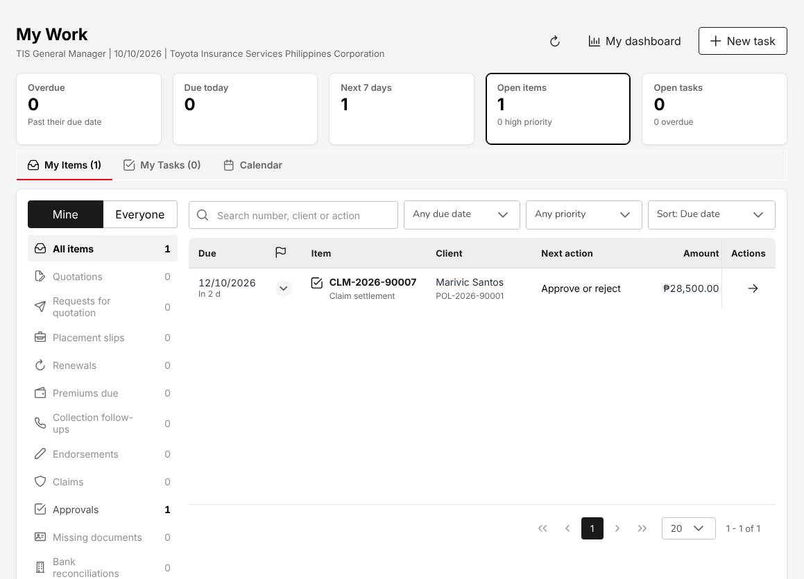
#### Approve a claim settlement {#tis-general-manager-claim-settlement}
A claim settlement submitted by the TIS Operations roles is **Pending Approval**. The approver must be another user
than the one who submitted it, and the amount must be within the approver's limit on the Authority Matrix. The TIS
General Manager has no amount limit set as delivered (see [Approvals (16.4)](#tis-general-manager-approvals)).

1. Open the settlement from My Work, or choose Operations > Claims and select the count **Settlement to approve**.
2. Check the policy, the insurer and the insurer claim number, the date and cause of loss, the estimate, the adjuster,
   the settlement type and the settlement amount.
3. Select **Approve settlement**, or **Return for correction** when the settlement must be revised.

An approved settlement settles the claim at once (**Settled**) and the user who submitted it is notified. A returned
settlement goes back to **Processing** for correction. See [Approve a settlement (checker) (17.13.4)](#approve-a-settlement-checker).

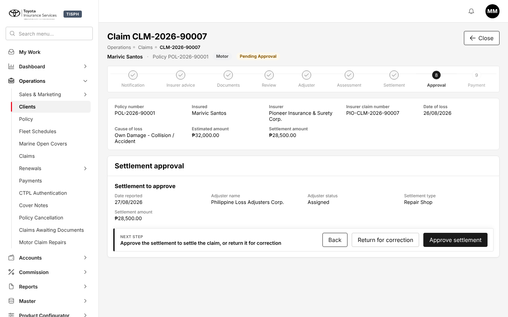
#### Approve the decisions of the front office {#tis-general-manager-front-office}
The TIS General Manager holds the same front-office approvals as the TIS Sales Officer, the TIS Sales Unit Head and the
TIS Operations Unit Head, and decides them the same way:

- **Check of an e-policy against the placement slip**: see
  [Check an e-policy against the placement slip (5.7.1)](#tis-sales-officer-epolicy-check).
- **Renewal terms**: see [Approve renewal terms (5.7.2)](#tis-sales-officer-renewal-approval). The terms waiting for approval
  are on Operations > Renewals > Negotiations (count **Pending approval**).
- **Return premiums and cancellations**: see [Complete a return of premium (5.7.3)](#tis-sales-officer-returns).

An underwriting referral of a quotation is decided by the TIS Operations Unit Head, not by the TIS General Manager.

#### Review the business on the dashboards {#tis-general-manager-dashboards}
1. Choose Dashboard > Executive Dashboard.
2. Choose the period (for example **This month**) and the comparison (**Previous period**). **Data as of** shows when
   the figures were computed; the refresh icon computes them again.
3. Read the cards: total revenue and new business against their targets, active policies, the claims rate, the
   retention rate, the premium receivable with its overdue part, and the commission receivable. Select a card's arrow
   to open the records behind it.
4. Scroll down for premium written by month, revenue by product line, claims by stage, the regional performance and
   the top products and sales performance.
5. Select **Export Report** to save the dashboard.

Choose another dashboard in the first list, or on the side bar: Claims Dashboard, Processing Dashboard, Sales
Dashboard. See [Dashboard (19.1)](#dashboard).

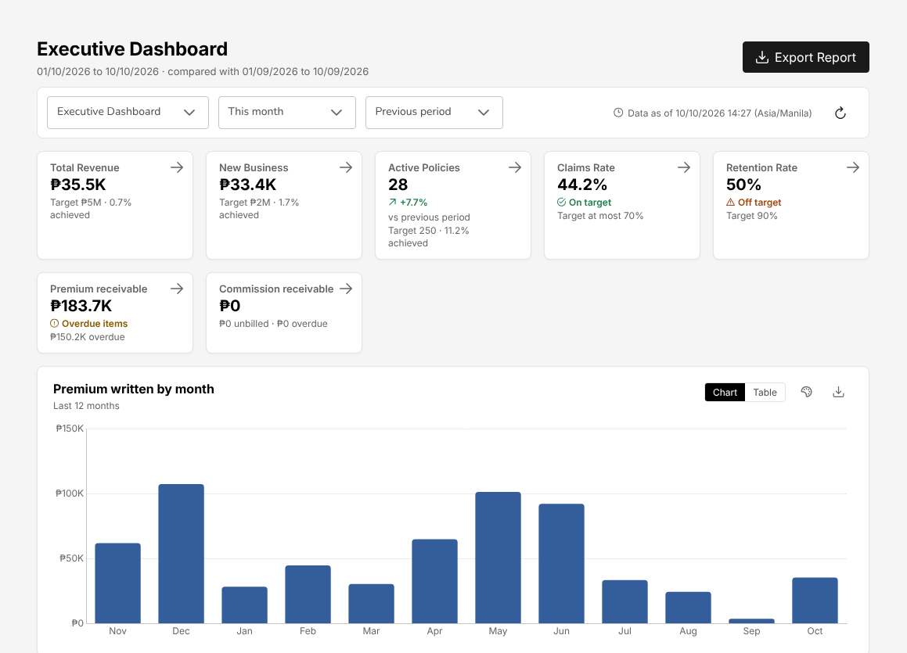
#### Review access and segregation of duties {#tis-general-manager-access-review}
You review access; changes are made and approved by TIS IT AppSupport / Admin.

1. Choose Master > Users and Access > User Access Matrix. The cards count the active and dormant users, the
   duty conflicts without an accepted exception, the users without two-step sign-in and the changes pending.
2. Filter by department or role. Each user shows the roles held, the branch, the status, the last sign-in, two-step
   sign-in, the password age and the segregation-of-duties rules the user breaks.
3. Select **Export to Excel** to keep the review with its date.
4. Choose Master > Users and Access > Segregation of Duties to see each conflict with the roles behind
   it, its rule and whether an exception was accepted.
5. Choose Master > Users and Access > Authority Matrix to see the largest amount each role may approve
   per transaction. A limit shown as **Not set** means the role may approve any amount.
6. Ask TIS IT AppSupport / Admin to correct what you find: remove a role, end a user, set a limit.

See [User Access Matrix (20.9)](#user-access-matrix), [Segregation of Duties (20.12)](#segregation-of-duties) and
[Authority Matrix (20.10)](#authority-matrix).

#### Look up a change in the audit trail {#tis-general-manager-audit-trail}
1. Choose Master > System > Audit Trail.
2. Filter by user, record type or action. Each line shows the date and time, the user and role, the record, the event,
   the fields changed and the source (for example **Sign-in**).
3. Select **Export** to keep the result.

See [Audit Trail (20.26)](#audit-trail).

## Screen reference: Operations {#screens-operations}
The screens of the Operations menu, in menu order: prospects, quotations and placement, clients, policies, claims, renewals and the policy services.

Each section names the menu of the screen and the roles that open it, with their access. Your own menu shows only the screens of your role. The step-by-step business procedures are in [The TISPH process end to end (chapter 3)](#the-business-process-end-to-end); this chapter describes each screen: what it shows, its fields, its buttons and its statuses.

### Prospects {#prospects}
A prospect is a person or company that TISPH quotes before it becomes a client: a buyer referred by Toyota Financial Services (TFS), a dealer sale, a walk-in client or a referral.

**Menu:** Operations > Sales & Marketing > Prospects

| Role | Access |
|---|---|
| TIS Sales Associate | Create and edit |
| TIS Sales Officer | Create and edit |
| TIS Sales Unit Head | Create and edit |
| TIS Operations Associate | View |
| TIS Operations Officer | View |
| TIS Operations Unit Head | View |
| TIS IT AppSupport / Admin | View |
| TIS General Manager | Create and edit |

The cards at the top count **Total Prospects**, **Last 7 Days**, **Last 30 Days**, **Converted Prospects** (with the conversion rate), **With Quotations** (with the quotation rate) and **Active Prospects**. The chips below them (**Motor**, **Personal Accident**, **Credit Life**, **Marine**, **Product not yet tagged**) filter the list by product line; **All Categories** filters by **Retail** or **Corporate**. **Show Filters** adds the country, province and city.

The list shows **Prospect ID** (LD-YYYY-NNNNN), **Name**, **Category**, **Product line**, **Mobile**, **E-mail**, **Quotations**, **Created on**, **Status** and **Actions**.

| Status | Meaning |
|---|---|
| **New** | Created, not yet contacted |
| **Contacted** | A sales activity has been logged on the prospect |
| **Quote Generated** | At least one quotation exists |
| **Converted** | A policy has been booked; the prospect is now a client |
| **Lost** | The prospect did not buy |

The buttons above the list are **Bulk Upload** (prospects from an Excel file, validated before they are created), **Generate Report** (the list as an Excel file) and **Create Prospect**.

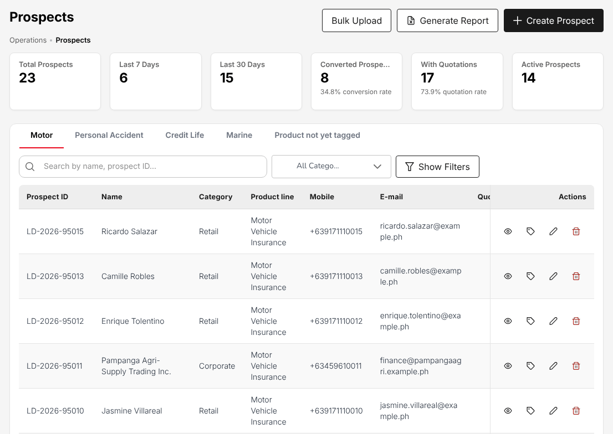
#### Create a prospect {#create-a-prospect}
1. Choose Operations > Sales & Marketing > Prospects and select **Create Prospect**.
2. Choose **New customer**, or **Existing client** to find a client by name, mobile number or e-mail (the prospect is then linked to that client). Select **Continue**.
3. Choose the **Line of Business** and the **Product** the prospect is for, and select **Continue**. If the product is not known yet, select **Skip - tag product later**: the first quotation asks for it.
4. Fill in the prospect form and select **Save & Continue**.

| Field | Required | What to enter | Rule |
|---|---|---|---|
| **Category** | Yes | **Retail** (a person) or **Corporate** (a company) | A corporate prospect asks for the company name instead of the personal details |
| **First name**, **Last name**, **Preferred name** | Yes | As on the client's ID | |
| **Date of birth**, **Gender** | Yes | | |
| **E-mail** | Yes | The e-mail address | Used for the quotation approval link and campaign offers |
| **Mobile number** | Yes | For example 0917 123 4567 or +63 917 123 4567 | |
| **Country**, **Province**, **City / Municipality**, **Barangay**, **ZIP Code**, **House / Unit No.** | Yes | The address | The city list follows the province; **Region** and **Street / Subdivision** are optional |
| **Source** | No | Where the lead came from, for example **Walk-In**, **Referral**, **Bundling** | From [Lead sources and reason codes (20.6)](#lead-sources-and-reason-codes) |
| **Product** | No | The product chosen in step 3 | **Product not yet tagged** when skipped |

The prospect is created with the status **New** and the next number of the prospect series. The assignment rules of [Lead Assignment (17.6)](#lead-assignment) give it an account executive.

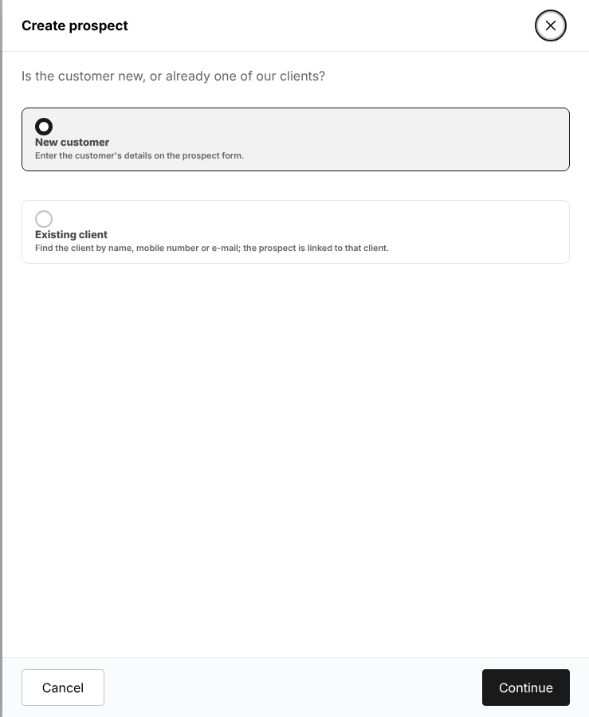
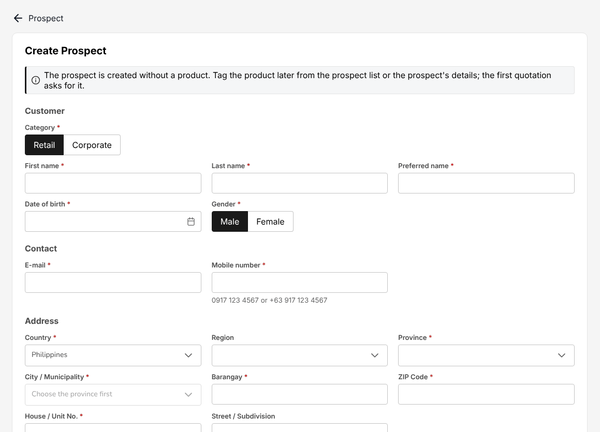
#### View, edit or delete a prospect {#view-edit-or-delete-a-prospect}
Select a row (or the eye in **Actions**) to open the prospect. The prospect page shows the prospect's quotations with the same counters as the quotations list, **Add Quote** to quote the prospect, and **Convert** on an approved quotation. The pencil opens the prospect form for a change.

A prospect is not deleted once it has a quotation or a sales activity: set it to **Lost** instead. Every change is kept in the history of the prospect.

### Quick Quote {#quick-quote}
Quick Quote prices a package product on the spot from the product's rates, without the steps of a full quotation: for example Compulsory Credit Life, Personal Accident or Parcel / Courier Insurance.

**Menu:** Operations > Sales & Marketing > Quick Quote

| Role | Access |
|---|---|
| TIS Sales Associate | Create and edit |
| TIS Sales Officer | Create and edit |
| TIS Sales Unit Head | Create and edit |
| TIS Operations Associate | Create and edit |
| TIS Operations Officer | Create and edit |
| TIS Operations Unit Head | Create and edit |
| TIS General Manager | Create and edit |

1. Choose Operations > Sales & Marketing > Quick Quote.
2. In **Line of Business**, choose the line; in **Product**, choose the package product. Only package products are offered.
3. Choose the plan or package and enter the details the product asks for (insured, sum insured or plan, period).
4. Check the premium shown with its taxes and create the quotation.

The quotation is created in **Draft** on [Quotations (17.4)](#quotations) and follows the same steps as any quotation. When a product has no quick quote on this build (for example **Credit Life - Compulsory**), the screen says so and offers **Request quotation**, which opens a request for quotation to the insurers. For a product that is not a package, use **Request for Quotation (non-package)** at the top of the screen, which opens [Requests for quotation (17.3)](#requests-for-quotation-broker-slips).

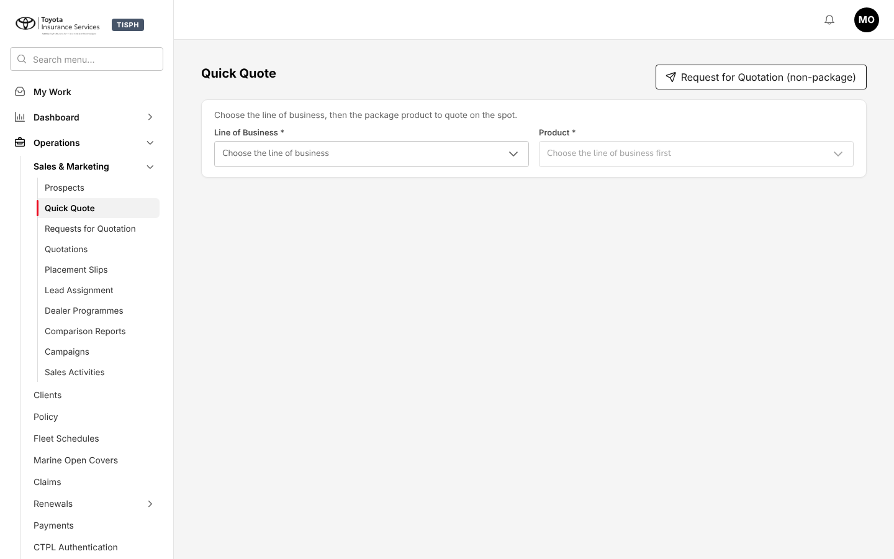
### Requests for quotation (broker slips) {#requests-for-quotation-broker-slips}
A request for quotation asks several panel insurers for their terms on one risk, for example a fleet or a group personal accident cover. It is optional: most motor quotations are priced on the motor tariff.

Choose Operations > Sales & Marketing > Request for Quotation (Broker Slip). The cards count the requests by status (**Submitted**, **Responses in**, **Placement raised**, **Closed**); select a card to filter. Each row shows **Slip No.**, **Insured**, **Product**, **Sum insured**, **Offers / approached** (with the number declined), **Best offer (gross)**, **Response due**, **Age**, **Status** and the **Quotation Slip** made from it. Select a row to open it.

**Menu:** Operations > Sales & Marketing > Requests for Quotation

| Role | Access |
|---|---|
| TIS Sales Associate | Create and edit |
| TIS Sales Officer | Create and edit |
| TIS Sales Unit Head | Create and edit |
| TIS Operations Associate | Create and edit |
| TIS Operations Officer | Create and edit |
| TIS Operations Unit Head | Create and edit |
| TIS IT AppSupport / Admin | View |
| TIS General Manager | Create and edit |

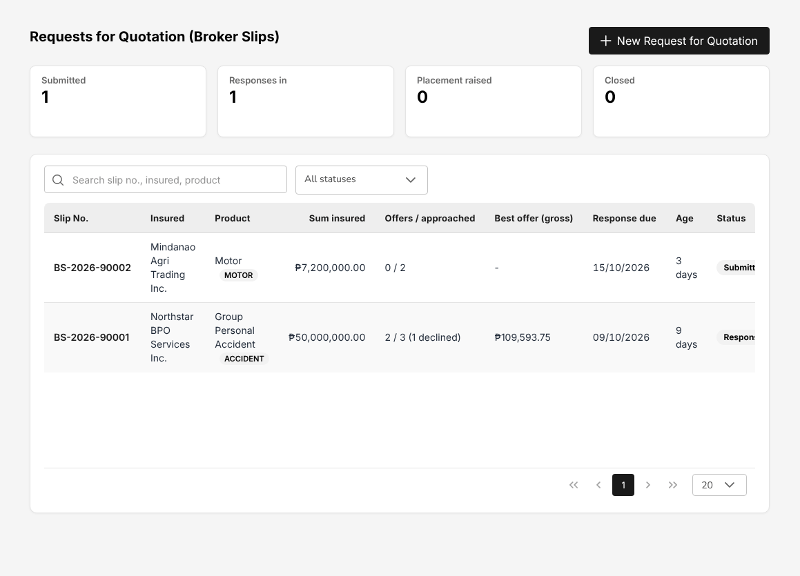
To create a request, select **New Request for Quotation**:

| Field | Required | What to enter | Rule |
|---|---|---|---|
| **Customer** | Yes | **Client**, **Prospect** or **New prospect**, then the name | |
| **Line of Business**, **Product** | Yes | The line and the product of the risk | The product decides the risk details and the covers offered |
| **Insured** | No | The insured named on the policy, if not the customer | |
| **Inception**, **Expiry** | No | The period of cover asked for | |
| **Response due** | No | The date by which the insurers must answer | Shown as overdue afterwards |
| **Risk details** | Depends on the product | For example the vehicles or the number of employees | |
| **Requested covers** | No | Each cover with its **Sum insured** and **Deductible**; **Add cover** adds a row | |
| **Insurers to approach** | Yes | One or more panel insurers | Each receives the request by e-mail |
| **Remarks** | No | What the client asked for | Printed on the slip |

**Save draft** keeps the request as **Draft**. **Save and submit to market** sends it to the insurers: the status becomes **Submitted**.

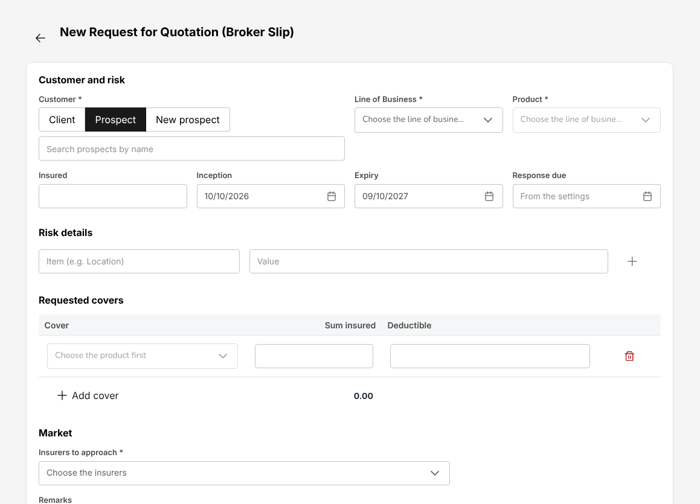
On the request, the tabs are **Market responses**, **Compare offers**, **Risk and covers** and **History**. Record each insurer's answer (premium, rate, deductibles, special terms, the line it writes) or its decline; with the answers in, the status becomes **Responses in**. On **Compare offers**, the best offer is marked **Best** and the others show their difference (**vs best**). Select the offer or offers to place and the lead insurer: the shares must total exactly 100%. Then select **Prepare Quotation Slip**.

The buttons of the request are **Print slip**, **Client comparison report** (see Comparison Reports), **Add insurer**, **Close (not taken up)** and **Cancel slip**. The stepper at the top shows the journey: **Request for Quotation**, **Quotation Slip**, **Placement raised**, **Insurer issued (Booked)**.

### Quotations {#quotations}
The quotation (quotation slip) is the offer given to the client: the insurer, the covers and the premium with its taxes.

**Menu:** Operations > Sales & Marketing > Quotations

| Role | Access |
|---|---|
| TIS Sales Associate | Create and edit |
| TIS Sales Officer | Approve |
| TIS Sales Unit Head | Approve |
| TIS Operations Associate | Create and edit |
| TIS Operations Officer | Create and edit |
| TIS Operations Unit Head | Approve |
| TIS IT AppSupport / Admin | View |
| TIS General Manager | Approve |

The cards count **Total Quotations**, **Active Quotations**, **Pending Review**, **Approved Quotations** (with the approval rate), **Converted to Policy** and the **Average Premium**. The list shows **Quote ID** (QT-YYYY-NNNNN), **Prospect Name**, **Policy Type**, **Gross premium**, **Date**, **Status** and **Actions** (**View Details**; **Edit Quotation** while the quotation can still be changed).

| Status | Meaning |
|---|---|
| **Draft** | Saved, not yet sent to the client |
| **Pending Customer** | Sent to the client for approval |
| **Customer Accepted** | The client accepted; the placement slip is raised |
| **Submitted to Insurer** | The placement slip has gone to the insurer |
| **Approved** | Approved by TIS Sales Officer, TIS Sales Unit Head, TIS Operations Unit Head or TIS General Manager, a user other than the one who created it |
| **Rejected** | Turned down, with a reason |
| **Converted to Policy** | The insurer's policy has been booked |

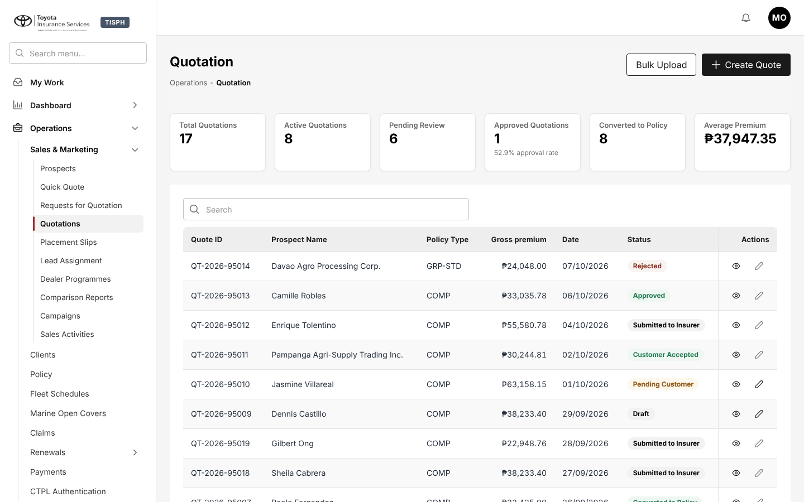
The quotation page has the tabs **Details**, **Activities** and **Audit Trail**. **Details** shows the placement journey, the policy details (insurer, co-insurance, policy type, referrer), the assured, the vehicle (for motor), the coverage details and the payment details: **NET Premium**, **DST (12.5%)**, **VAT (12%)**, **LGT (0.75%)**, **Others**, **Discount** and **Gross premium**. The actions depend on the status: **Send for Customer Approval** on a draft, **Copy approval link** and **Record customer response** while it waits for the client, **Proceed to Policy** once accepted. See [Quotation and request for quotation (3.4)](#process-quotation).

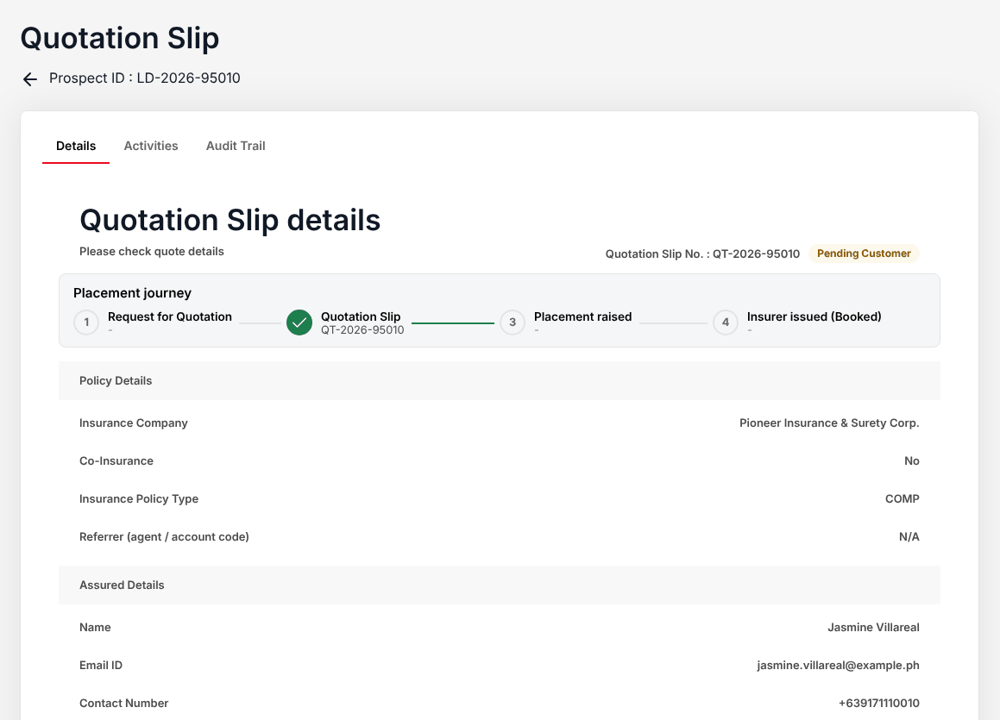
#### Create a motor quotation {#create-a-motor-quotation}
A motor quotation is made for a prospect and has four steps: **Policy details**, **Coverage**, **Accessories** and **Summary**. Nothing is saved until the last step, so you can move with **Back** and **Next**.

1. Choose Operations > Sales & Marketing > Prospects and open the prospect (or select **Create Quote** on Operations > Sales & Marketing > Quotations, choose the motor product and then the prospect).
2. Select **Add Quote**. In **Line of Business**, choose **Motor**; in **Product**, choose the motor product. Select **Continue**.
3. **Policy details**: choose the insurer (**Select Insurance Company**, or **Co-Insurance** for several insurers), the **Insurance Policy Type**, the **Referrer (agent / account code)** if any, and the **Payment Type** (required). Under **Insurance Vehicle Details**, choose **Vehicle Type** (the tariff class), **Vehicle Brand**, **Vehicle use**, **Model Year**, **Vehicle Model**, **Model Variant**, **Vehicle Color** and **Seating Capacity** from the vehicle master. Under **Risk details for the product rules**, enter the **Fair market value of the vehicle**, the **Claims in the last 3 years** and the **Driver's date of birth** (required: the acceptance rules of the product check them), and if they apply **The vehicle has modifications**, **Claim-free years (NCB)** and **Vehicles in the fleet**. Select **Next**.
4. **Coverage**: the mandatory covers of the product are always included; tick the optional covers to quote. Enter the own damage sum insured (the invoice price for a new car) and rates, acts of nature, the bodily injury and property damage limits, auto passenger personal accident per seat, and CTPL for 1 or 3 years at the Insurance Commission tariff. Select **Calculate**; **Override** lets an authorised user change a computed premium.
5. **Accessories**: add the accessories with their value, if any.
6. **Summary**: check the premium (net premium, DST, VAT, LGT, gross premium) and complete the quotation.

The quotation is created in **Draft**. Open it and select **Send for Customer Approval** to send it to the client.

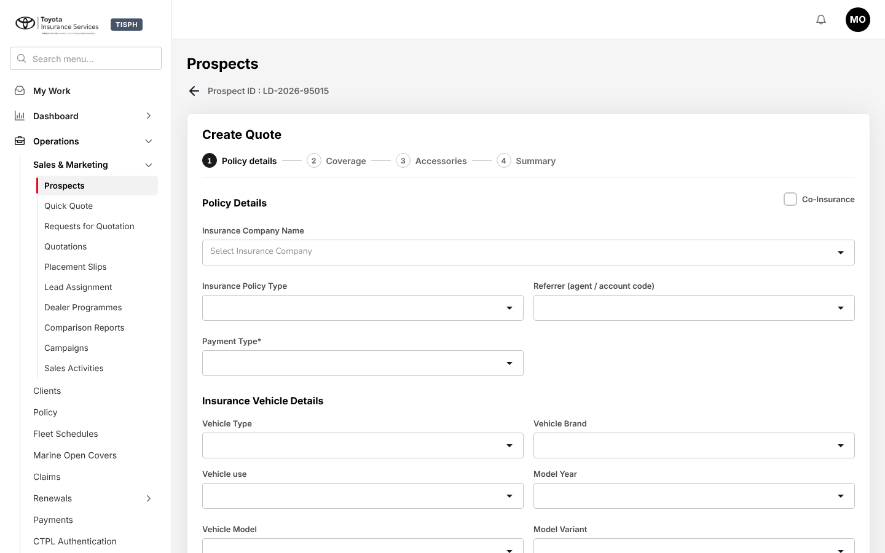
### Placement Slips {#placement-slips}
The broker never issues cover. A placement slip goes to the insurer, the insurer acknowledges it and returns the e-policy, the e-policy is checked against the slip and only then is the policy booked. No screen lets a user complete cover without the insurer.

**Menu:** Operations > Sales & Marketing > Placement Slips

| Role | Access |
|---|---|
| TIS Sales Associate | Create and edit |
| TIS Sales Officer | Approve |
| TIS Sales Unit Head | Approve |
| TIS Operations Associate | Create and edit |
| TIS Operations Officer | Create and edit |
| TIS Operations Unit Head | Approve |
| TIS IT AppSupport / Admin | View |
| TIS General Manager | Approve |

The cards count the placements at each step: **Placement raised**, **Sent to insurer**, **Acknowledged**, **e-Policy received**, **Checked against slip** and **Insurer issued (Booked)**. The list shows **Placement No.** (PS-YYYY-NNNNN), **Insured**, **Product**, **Lead insurer**, **Gross premium**, **Period**, **Source** (**From quotation slip** or **Direct placement**), **Status** and the booked **Policy**. Filter by status and by source.

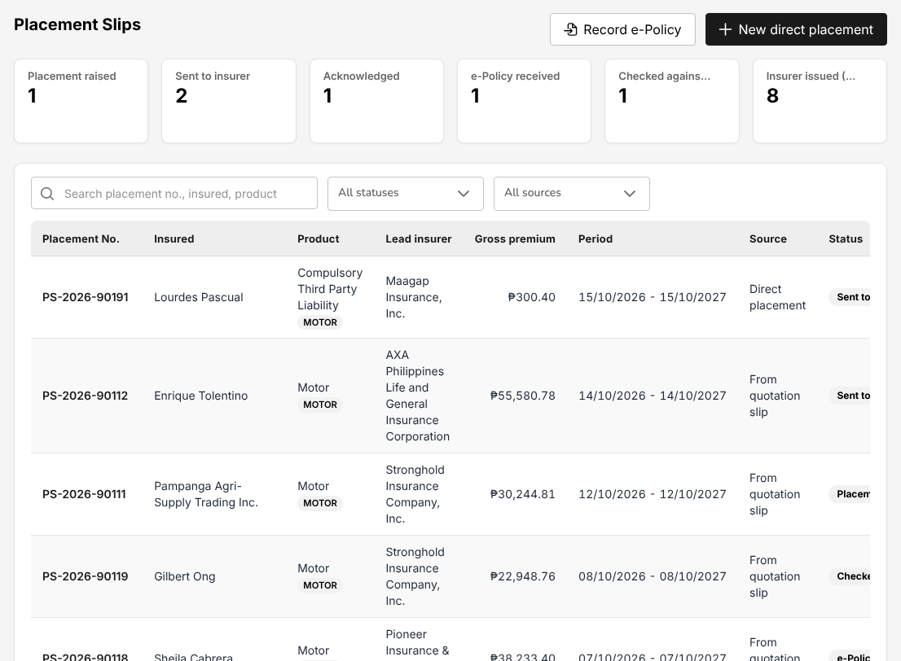
A placement slip is raised by the client's acceptance of a quotation, or directly with **New direct placement** for a risk that needs no quotation (for example a CTPL cover):

| Field | Required | What to enter | Rule |
|---|---|---|---|
| **Customer** | Yes | **Client**, **Prospect** or **New insured** | |
| **Line of Business**, **Product** | Yes | The line and product | |
| **Risk details** | Depends on the product | For motor: the vehicle and its identifiers | |
| **Inception** | Yes | The start of cover | |
| **Expiry** | No | The end of cover | One year after inception if left empty |
| **Sum insured** | No | The sum insured | |
| **Net premium** | Yes | The premium before taxes | Taxes are computed |
| **Commission rate** | No | The broker's commission rate | Defaults from the commission rate matrix |
| **Billing mode** | No | **System default**, or broker bill or direct bill | |
| **Security (participating insurers)** | Yes | Each insurer with its **Share**; mark the **Lead** | One lead insurer; the shares must total exactly 100% |

Select **Create Placement Slip**. The status is **Placement raised**.

On the placement slip the buttons follow the status: **Edit participants** and **Send to insurer(s)** (placement raised), **Record acknowledgement**, **Upload e-policy** or **Record decline** (sent), **Check against slip** (e-policy received), **Book (Insurer issued)** (checked), and at every step **Print slip** and **Cancel slip**. The page shows the stepper, the **e-Policy** panel with the result of the comparison, the **Security (participating insurers)** with each insurer's share, premium, taxes, commission and policy number, the **Premium** breakdown, the **Summary**, the **Risk** and the **History**.

The check against the slip compares the net and gross premium, the sum insured, the commission, the effective and expiry dates, the insured and, for motor, the chassis, engine and plate numbers. Amounts within PHP 1.00 of the slip match. The check is decided by TIS Sales Officer, TIS Sales Unit Head, TIS Operations Unit Head or TIS General Manager, never by the user who recorded the e-policy: **Confirm check**, **Accept differences** (with a reason) or **Return to insurer** (with a reason). See [Placement with the insurer (3.5)](#process-placement) and [Book the policy (3.6.1)](#process-booking).

#### Record e-Policy {#record-e-policy}
Use **Record e-Policy** to key the e-policies the insurers send back without searching for each placement slip. Choose Placement Slips and select **Record e-Policy**: the list shows the placement slips sent to the insurer or acknowledged, with **Placement No.**, **Insured**, **Product**, **Lead insurer**, **Gross premium**, **Sent** and **Status**. Select a row, then fill in the e-policy:

| Field | Required | What to enter |
|---|---|---|
| e-Policy file | Yes | The PDF the insurer sent |
| Insurer policy number | Yes | As printed on the e-policy |
| Participant name | Yes | The insured named on the e-policy |
| Sum insured, net premium, gross premium, commission | Yes | As on the e-policy |
| Issue date, issuance date, effective date, production date | Yes | As on the e-policy |
| Chassis number, engine / motor number, plate number (motor) | Yes | As on the e-policy; the plate number or the MV file number is required |

The placement slip becomes **e-Policy received** and opens afterwards for the check against the slip by another user.

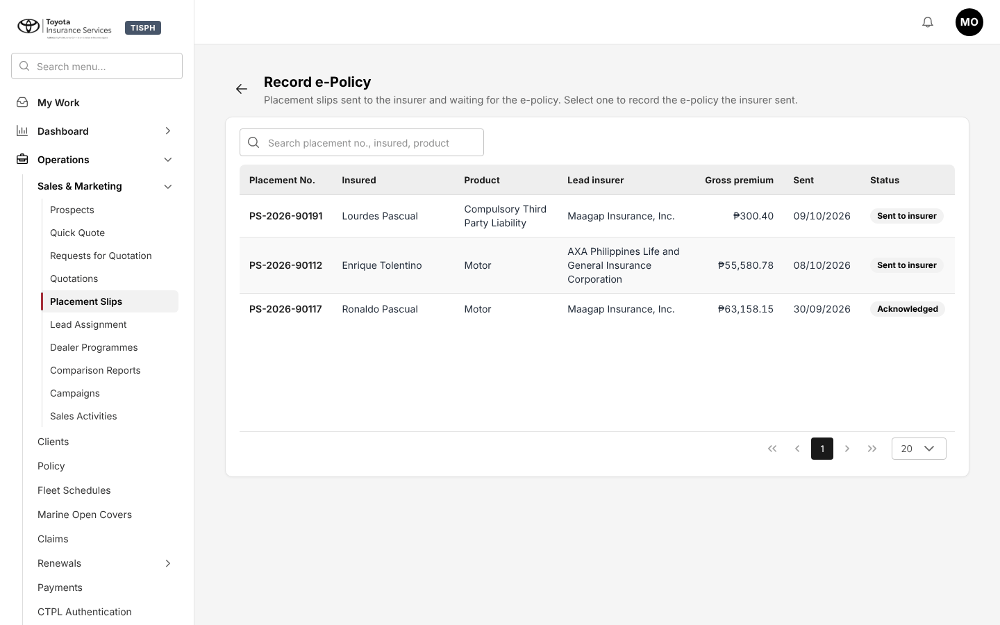
### Lead Assignment {#lead-assignment}
Lead Assignment decides who works each prospect.

**Menu:** Operations > Sales & Marketing > Lead Assignment

| Role | Access |
|---|---|
| TIS Sales Associate | View |
| TIS Sales Officer | Create and edit |
| TIS Sales Unit Head | Create and edit |
| TIS Operations Associate | View |
| TIS Operations Officer | View |
| TIS Operations Unit Head | View |
| TIS IT AppSupport / Admin | View |
| TIS General Manager | Create and edit |

The screen has three tabs:

- **Team View**: for each team member (filter **My team** or the whole team), the prospects **Open**, **New**, **Converted**, **Lost**, **In queue** and of the **Last 30 days**, and below the prospects of the team with their **Status**, **Line**, **Territory**, **Channel**, **Account executive** and **Assignment**.
- **Reassignment Queue**: the prospects no rule could assign, or released by their account executive. Select a prospect and assign it to an account executive.
- **Assignment Rules**: the rules that give a new prospect its account executive. The first active rule by **Priority** whose **Conditions** match the prospect applies; empty conditions match any prospect. **Method** is **Round robin** between the rule's **Account executives**, or a fixed account executive. **Add rule** creates a rule; the switch in **Active** turns it off.

At TISPH the rules send the TFS referrals of each TFS office to the account executives of that territory.

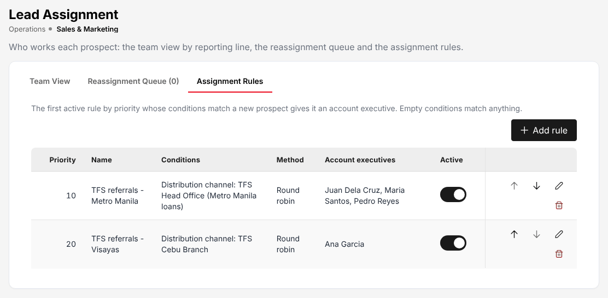
### Dealer Programmes {#dealer-programmes}
Choose Operations > Sales & Marketing > Dealer Programmes. A programme holds the terms agreed with a dealer, and optionally its financing bank, for brand-new vehicles.

**Menu:** Operations > Sales & Marketing > Dealer Programmes

| Role | Access |
|---|---|
| TIS Sales Associate | View |
| TIS Sales Officer | View |
| TIS Sales Unit Head | View |
| TIS Operations Associate | View |
| TIS Operations Officer | View |
| TIS Operations Unit Head | View |
| TIS IT AppSupport / Admin | Create and edit |
| TIS General Manager | View |

The **Programmes** tab lists **Code**, **Name**, **Dealer**, **Financing bank**, **Insurer**, **Rates**, **Who pays**, **Upload creates**, **Sales** and **Status**. **Add programme** opens the programme form:

| Field | Required | What to enter | Rule |
|---|---|---|---|
| **Code**, **Name** | Yes | For example TMK-TFS-2026, "Toyota Makati x TFS financed cars 2026" | The code is unique |
| **Dealer** | Yes | The dealer of [Distribution Channels (20.1)](#distribution-channels) | |
| **Financing bank**, **Mortgagee of the financed cars** | No | The bank, for financed cars | The bank is the mortgagee on the policy |
| **Insurer** | Yes | The panel insurer of the programme | |
| **Default vehicle class** | Yes | The tariff class of the cars sold | |
| **Own damage rate %**, **Acts of nature rate %** | Yes | The rates agreed | |
| **Excess bodily injury**, **Property damage** | No | The limits included | |
| **CTPL**, **Include CTPL** | No | Whether CTPL is included and for **1** or **3 year(s)** | |
| **Upload creates** | Yes | **Quotation to follow up** or **Policy issued** | What a row of the dealer's sales file creates |
| **Free first year** | No | The dealer (or bank) pays the whole first-year premium | |
| **Subsidy paid by**, **Subsidy**, **Subsidy value** | No | Who pays part of the premium (**Nobody (buyer pays)**, the dealer or the bank), as a percent of premium or an amount | |
| **Effective from**, **Effective to** | Yes | The period of the programme | Sales outside the period are refused |
| **Mortgagee clause** | No | The clause printed on the policy | Used when the bank has no clause of its own |
| **Status**, **Notes** | | **Active** or inactive | Only an active programme accepts uploads |

The **Dealer Sales Upload** tab takes the dealer's sales file: choose the programme, download the **Template** if needed and select **Upload sales**. Each upload is a batch (DSB-YYYY-NNNNN) with its **Created** and **Failed** rows and its status (**Completed** or **Partial**). See [Dealer programme policies (3.3)](#process-dealer-programme).

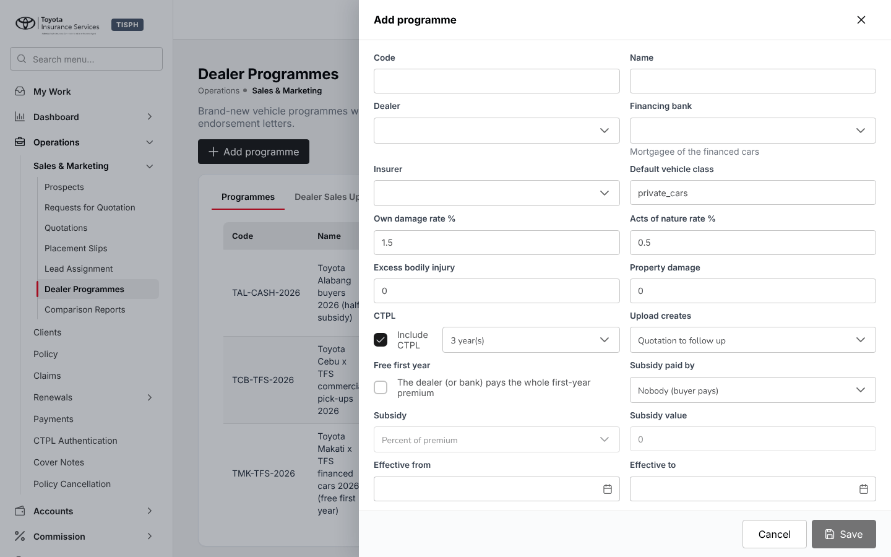
### Sales activities {#sales-activities}
Account executives log every call, meeting, e-mail and visit with a prospect, a client or on a quotation. Each prospect, client and quotation shows its activities as a timeline, newest first: a prospect and a client also show the activities logged on their quotations (with the quotation number), and a client those of the prospect it came from. The open next step is shown above the timeline.

**Menu:** Operations > Sales & Marketing > Sales Activities

| Role | Access |
|---|---|
| TIS Sales Associate | Create and edit |
| TIS Sales Officer | Create and edit |
| TIS Sales Unit Head | Create and edit |
| TIS Operations Associate | View |
| TIS Operations Officer | View |
| TIS Operations Unit Head | View |
| TIS General Manager | Create and edit |

**Menu:** Master > Organization > Sales Activity Types

| Role | Access |
|---|---|
| TIS IT AppSupport / Admin | Create and edit |

**Menu:** Master > Organization > Sales Activity Outcomes

| Role | Access |
|---|---|
| TIS IT AppSupport / Admin | Create and edit |

The cards count **Activities**, **Account executives**, **Positive outcomes**, **Follow-ups open** and **Follow-ups overdue**. The **Activities** tab lists **Date and time**, **Activity type**, **Subject**, **Record**, **Account executive**, **Outcome**, **Next step** and **Follow-up**, filtered by account executive, activity type and outcome. The **Activity Report** tab totals the activities per account executive (calls, meetings, e-mails, visits; on prospects, clients and quotations; positive outcomes; next steps done, open and overdue), by activity type and by outcome. **Export to Excel** downloads the list.

To log an activity, open the prospect, client or quotation, select the activity log and enter the **Activity type**, **Subject**, date and time, **Outcome** and, if there is one, the **Next step** with its follow-up date. The next step appears in [My Work (2.3)](#my-work) on its date.

The activity types (phone call, meeting, e-mail, visit, proposal presentation) and outcomes are kept on Master > Organization > Sales Activity Types and Master > Organization > Sales Activity Outcomes, by TIS IT AppSupport / Admin.

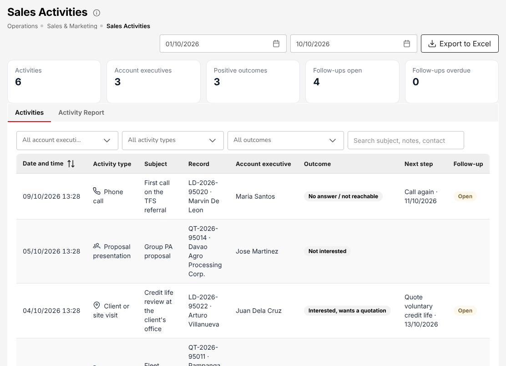
### Clients {#clients}
A client is created when a prospect's first policy is booked, or before it by onboarding.

**Menu:** Operations > Clients

| Role | Access |
|---|---|
| TIS Sales Associate | Create and edit |
| TIS Sales Officer | Create and edit |
| TIS Sales Unit Head | Create and edit |
| TIS Operations Associate | View |
| TIS Operations Officer | View |
| TIS Operations Unit Head | View |
| TIS IT AppSupport / Admin | View |
| TIS General Manager | Create and edit |

The list shows **Client ID** (CL-YYYY-NNNNN), **Assured Name**, **Category**, **E-mail**, **Mobile**, **Client Since**, **Policies**, **Latest Policy Status** and **Actions**; the tabs **All**, **Individual** and **Corporate** filter it. The buttons are **Onboard client** and **Create Prospect** (for a client who asks for a new quotation).

Select a client to open the client view: the cards **Active policies**, **Premium in force**, **Open claims**, **Renewals due** and **Outstanding balance**, and the tabs **Policies**, **Quotations**, **Claims**, **Renewals**, **Endorsements**, **Receipts**, **Documents**, **Activity** and **History**. The header shows whether the identification is **Complete** or **Incomplete**; **Identification and due diligence** opens it.

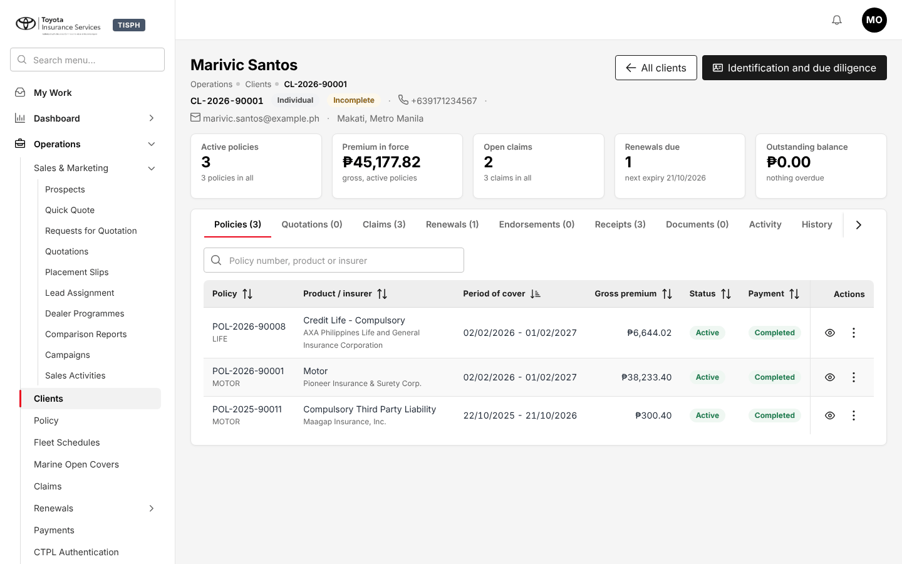
#### Onboard a client before the first policy {#onboard-a-client-before-the-first-policy}
A client can be created, identified and checked before any quotation or policy, as customer due diligence requires. A client created by the first policy (a prospect converted, a direct placement) is completed the same way, from **Identification and due diligence** on the client view.

1. Choose Operations > Clients and select **Onboard client**.
2. Choose the **Client type**: **Individual** or **Juridical (company, cooperative, partnership)**.
3. Fill in the form and select **Onboard client**.
4. Upload the ID, the registration and the board resolution once the client is saved.

| Group | Fields | Rule |
|---|---|---|
| **Identity** (individual) | **First name**, **Middle name**, **Last name**, **Suffix**, **Date of birth**, **Place of birth**, **Gender**, **Civil status**, **Nationality**, **Occupation or nature of work**, **Employer or business name**, **Source of funds**, **TIN** | |
| **Government ID presented** | **ID type**, **ID number**, **ID expiry date** | An expired ID is refused |
| **Contact and address** | **Mobile number**, **E-mail**, **Country**, **Region**, **Province**, **City / Municipality** (required), **Barangay**, **ZIP Code**, **House / Unit No.**, **Street / Subdivision** | The city list follows the province |
| **Expected business and PEP** | **Lines of business expected**, **Usual payment mode**, **Expected annual premium (PHP)**, **Politically exposed person (or family member or close associate)** | A politically exposed person needs enhanced due diligence |

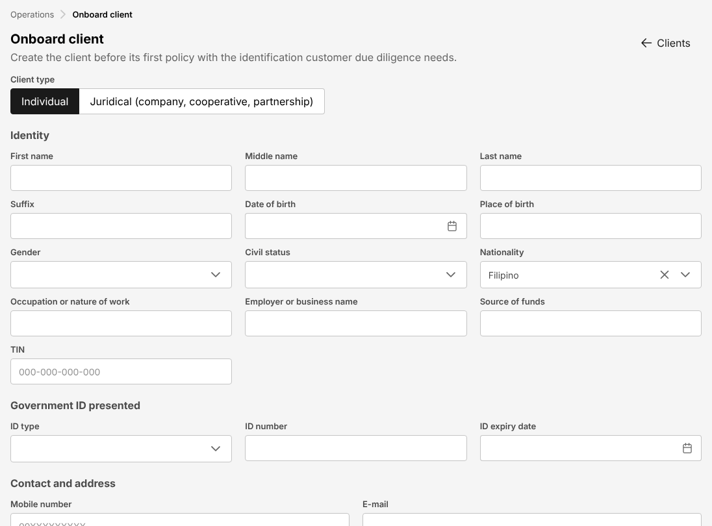
### Policies {#policies}
Choose Operations > Policy. The list shows **Policy Number**, **Client Id**, **Client Name**, **Gross Premium**, **Policy Issued**, **Policy Expiry**, **Product Description** and **Payment** status. The search box finds a policy by number or client. **Show Filters** offers **Payment Status**, **Product Type**, **Insurance Company**, **Client Name**, issue and expiry date ranges and minimum and maximum premium.

**Menu:** Operations > Policy

| Role | Access |
|---|---|
| TIS Sales Associate | Create and edit |
| TIS Sales Officer | Approve |
| TIS Sales Unit Head | Approve |
| TIS Operations Associate | Create and edit |
| TIS Operations Officer | Create and edit |
| TIS Operations Unit Head | Approve |
| TIS IT AppSupport / Admin | View |
| TIS General Manager | Approve |

Policies are booked from the placement slip (see [Placement Slips (17.5)](#placement-slips)); **Bulk Upload** loads policies from a file, validated first. The **Payment** status is **Pending** (billed, not paid), **Reviewing** (a payment waits for Cash Control), **Partial** or **Completed**.

In **Actions**, the eye (**View policy**) opens the policy and **More actions** offers **Claim** (register a claim on the policy, see [Register a claim (17.13.1)](#register-a-claim)) and **Endorsement**.

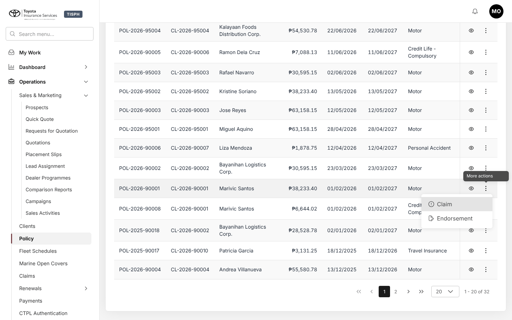
The policy page shows the cards **Gross Premium**, **Expiry Date** and **Client ID**, and the panels **Policy Details**, **Insured Details**, **Vehicle Details** (motor: motor, chassis and plate numbers, mortgagee), **Coverage Details**, **Premium Breakdown**, **Endorsements**, **History** and **Documents & Billing** (**Generate Policy Invoice**, **Premium Accounting Entries**, the policy document to **Preview**, **Open** or **Print**). **View Policy** opens the policy schedule.

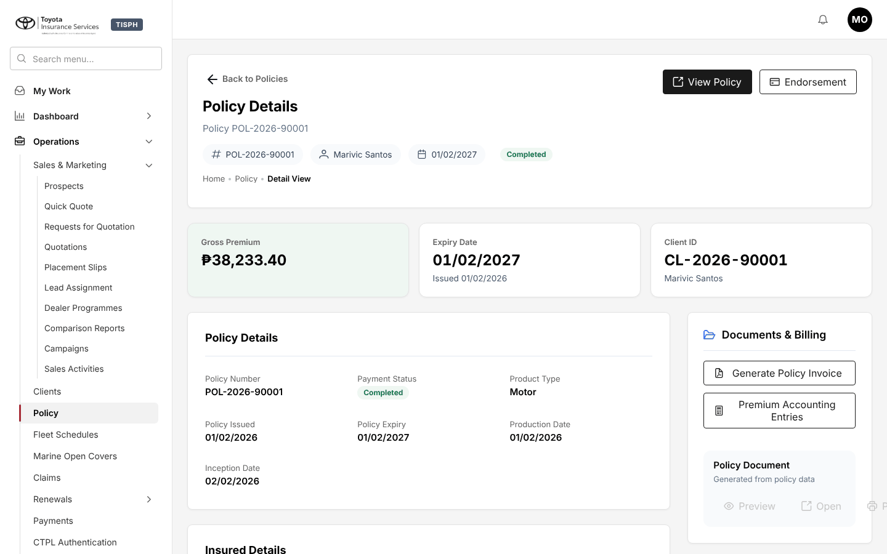
#### Raise an endorsement request {#raise-an-endorsement-request}
1. Choose Operations > Policy.
2. In the row of the policy, select **More actions**, then **Endorsement** (or **Endorsement** on the policy page).
3. Choose the kind of change (insured details, vehicle, cover, extension), enter the new values and the effective date.
4. Upload the endorsement document of the insurer.
5. Complete the endorsement.

The endorsement is not available while the payment is **Pending** or **Reviewing**, or once the policy has expired, lapsed, was cancelled or renewed. An additional premium is billed to the client. An endorsement that returns premium is completed by TIS Sales Officer, TIS Sales Unit Head, TIS Operations Unit Head or TIS General Manager, a user other than the one who entered it. See [Endorsements and cancellations (3.6.3)](#process-endorsement).

### Fleet Schedules {#fleet-schedules}
Choose Operations > Fleet Schedules. A fleet schedule is one motor policy covering many vehicles of a client.

**Menu:** Operations > Fleet Schedules

| Role | Access |
|---|---|
| TIS Sales Associate | Create and edit |
| TIS Sales Officer | Create and edit |
| TIS Sales Unit Head | Create and edit |
| TIS Operations Associate | Create and edit |
| TIS Operations Officer | Create and edit |
| TIS Operations Unit Head | Create and edit |
| TIS General Manager | Create and edit |

Each vehicle has its own premium and CTPL; vehicles added or deleted during the period are endorsed at the pro-rata premium. The list shows **Fleet schedule**, **Client**, **Insurer**, **Policy**, **Period**, **Vehicles on cover**, **Sum insured**, **Annual premium** and **Status**.

1. Select **New fleet schedule**.
2. Enter **Client** (required), **Insurer** (can be chosen later, before the policy is issued), **Period from** (required), **Period to** (one year after the start unless changed) and **Description**.
3. Select **Start**. Add the vehicles one by one or from a file; each line is rated on the motor tariff.
4. Place the schedule with the insurer; the policy is booked like any other.

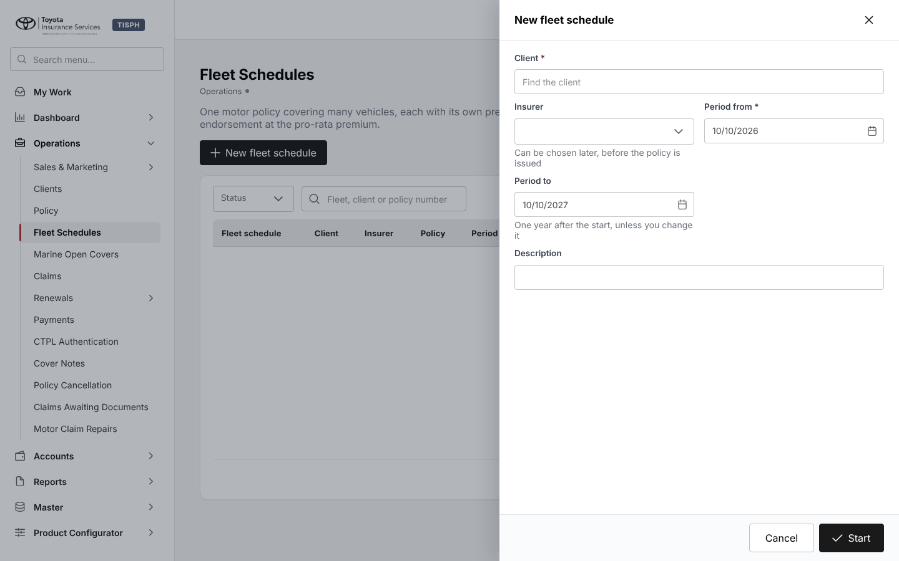
### Marine Open Covers {#marine-open-covers}
Choose Operations > Marine Open Covers. An open cover insures a client's cargo shipments for a period: each shipment is certified or declared and the premium is billed per declaration period.

**Menu:** Operations > Marine Open Covers

| Role | Access |
|---|---|
| TIS Sales Associate | Create and edit |
| TIS Sales Officer | Create and edit |
| TIS Sales Unit Head | Create and edit |
| TIS Operations Associate | Create and edit |
| TIS Operations Officer | Create and edit |
| TIS Operations Unit Head | Create and edit |
| TIS General Manager | Create and edit |

The list shows **Open cover** (MOC-YYYY-NNNNN), **Client**, **Insurer**, **Policy**, **Period**, **Conveyances**, **Certificates**, **Billed premium** and **Status**. **New open cover** asks for **Client**, **Insurer**, **Period from**, **Period to**, **Goods insured**, **Voyages**, **Clauses**, the rate % and limit per conveyance (**Sea**, **Air**, **Land**), **Mark-up on invoice %**, **Minimum premium per certificate**, **Declarations** (**Monthly**) and **Insurer's reference**.

The open cover page has the tabs **Contract**, **Certificates** (one per shipment, rated at the conveyance rate with the minimum premium), **Declarations** (the shipments of each period, billed on the open policy) and **History**. **Cancel cover** ends it. At TISPH the parcel cover of TFS (registration papers, plates, keys and loan documents couriered to its customers) is kept this way.

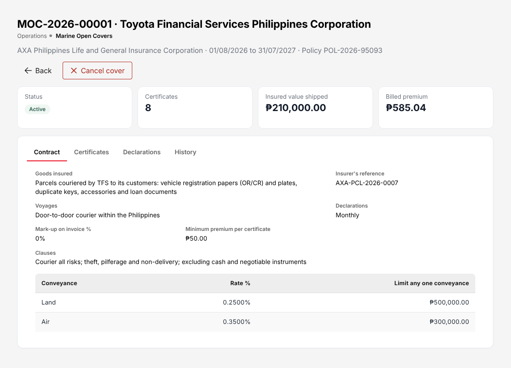
### The claims list {#the-claims-list}
TISPH registers the client's claim, advises the insurer, collects the documents and follows the claim to its settlement. The insurer decides and pays.

**Menu:** Operations > Claims

| Role | Access |
|---|---|
| TIS Sales Associate | View |
| TIS Sales Officer | View |
| TIS Sales Unit Head | View |
| TIS Operations Associate | Create and edit |
| TIS Operations Officer | Create and edit |
| TIS Operations Unit Head | Approve |
| TIS IT AppSupport / Admin | View |
| TIS General Manager | Approve |

The cards count **Open claims**, **Settlement to approve**, **Approved, to be paid** and **Settled**. The list shows **Claim / insured**, **Policy / product**, **Date / cause of loss**, **Reported**, **Estimate**, **Status** and **Actions**; filter by status.

| Status | Meaning |
|---|---|
| **Pending** | Registered, documents being collected |
| **Processing** | Advised to the insurer, under review or with the adjuster |
| **Pending Approval** | The settlement waits for the checker |
| **Approved** | The settlement is approved and not yet released (only when the release on approval is switched off) |
| **Partially Settled** | A partial settlement is approved; the claim stays open for the final settlement |
| **Settled** | The settlement is approved and released |
| **Rejected** | Declined by the insurer, with a reason |
| **Cancelled** | Registered in error or a duplicate notification, with a reason |

A claim follows nine steps, shown at the top of the claim: **Notification**, **Insurer advice**, **Documents**, **Review**, **Adjuster**, **Assessment**, **Settlement**, **Approval** and **Payment**. The **Next step** bar at the bottom names what is to be done and leads to it.

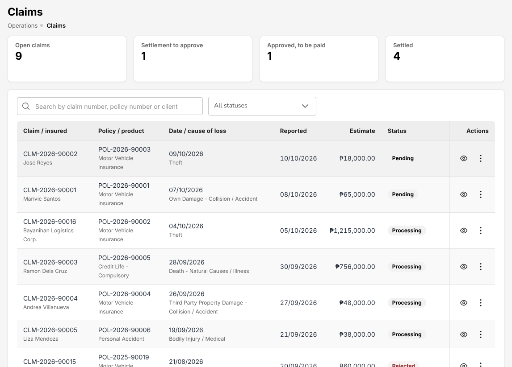
#### Register a claim {#register-a-claim}
1. Choose Operations > Policy, select **More actions** in the row of the policy, then **Claim**. (Or select **Register claim** in [My Work (2.3)](#my-work).)
2. On **Claim notification**, check the policy and insured, and the insured's address.
3. Enter the incident: **Date of loss** (required), **Time of loss**, **Cause of loss** (required), **Place of loss** (required, with city and province), **Estimated Claim Amount**, **Reported through** (TFS, call centre, insurer, dealer, walk-in or e-mail), for a motor claim the **Loss extent** (**Partial loss** or **Total loss**) and, if known, the **Insurance Company Claim Number**.
4. Enter the **Driver at the time of loss** (**Same as Policy Holder**, or the **Driver's name** and address) and the **Third party** if any (name, contact number, plate number, unit, shop, insurer).
5. Select **Next**, then on **Insurer advice** select **Register claim and send**.
6. When the policy has premium outstanding, the claim is reported late or a claim of the same date of loss is already registered on the policy, **Check before registering** shows the **Outstanding premium**, the **Claims ratio of the client**, the days between the loss and the report and the claims of the same date. Select **Register claim and send** to register the claim anyway, or **Cancel**.
7. The claim is created (CLM-YYYY-NNNNN) as **Pending**, assigned to the claims handler with the fewest open claims, and the Preliminary Loss Advice is e-mailed to the insurer.

The date of loss must fall within the period of cover of the policy and cannot be in the future. A claim reported more than the late intimation days after the loss (30 as delivered) is marked **Late** and the claims handlers are alerted. The follow-up date of the claim depends on the line and the loss extent (for example 30 days for a partial motor loss, 60 for a total loss, 90 for fire, marine and engineering). For Credit Life the claim is a death benefit claim on the TFS loan.

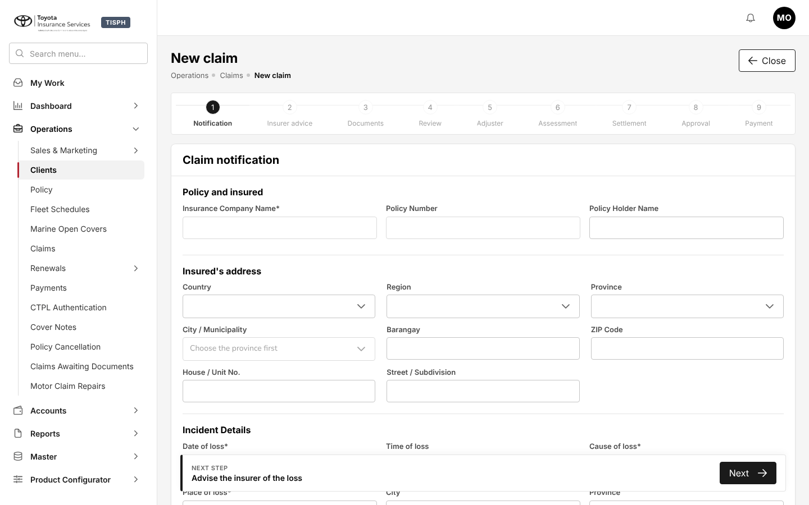
On **Documents**, the claim lists the documents its cause of loss needs (from [Claim documents (20.5)](#claim-documents)) with their status **Missing**, **Received** or **Waived**. Upload each document as it arrives, or waive it. **Remind the claimant** e-mails the list of missing documents; **Continue to review** moves on once the documents are in.

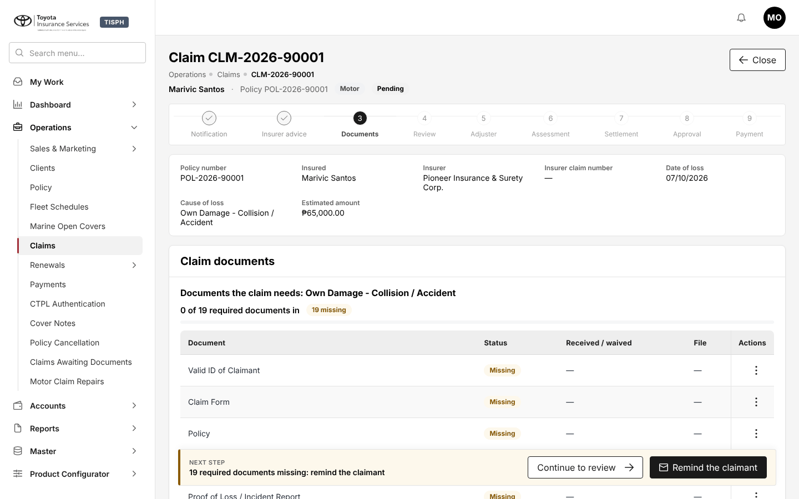
#### Adjuster report {#adjuster-report}
On **Adjuster**, record the adjuster the insurer appointed (**Adjuster name**), the **Adjuster status** (assigned, report received) and upload the adjuster's report with the amount the adjuster recommends. For a motor repair, the estimates and the letter of authority are kept on [Motor claim repairs (17.23)](#motor-claim-repairs-and-letters-of-authority).

#### Assessment and settlement (maker) {#assessment-and-settlement-maker}
The claim is moved to review and its settlement submitted by the Operations roles. Rejection, cancellation and closing are decisions of TIS Operations Unit Head or TIS General Manager.

On **Assessment**, check the key facts of the claim and the **Assessment basis** (date reported, adjuster and adjuster status) and choose **Proceed to settlement**, or **Reject claim** with the **Reason for rejection**.

On **Settlement**, choose **Final** or **Partial**, enter the **Settlement type** (for example **Repair Shop**, or payment to the insured), the **Settlement amount** the insurer agreed, the deductible or participation and the payee, and select **Submit settlement**. The claim becomes **Pending Approval**: a second claims user must approve it before the claim is settled. A partly settled claim shows **Settled so far** and is settled further, or finally, from the same step.

#### Approve a settlement (checker) {#approve-a-settlement-checker}
The settlement is approved by TIS Operations Unit Head or TIS General Manager, never by the user who submitted it.

1. Open the claim from [My Work (2.3)](#my-work) or from the list (**Settlement to approve**).
2. On **Approval**, check the settlement against the adjuster's report and the documents: the **Settlement** (partial or final), **Requested by** and what was **Settled before**.
3. Enter the **Approved amount** (the amount requested, or less), then approve it, or return it with a reason.

The approved amount must be within the approver's claim settlement limit on the [Authority Matrix (20.10)](#authority-matrix) when the limit is enforced. **Requested by** and **Approved by** show the users' names.

As delivered, the approval also releases the settlement: the claim is **Settled** at once, without the status **Approved** in between.

#### Claim details, documents and audit trail {#claim-details-documents-and-audit-trail}
Open a claim from the list (the eye in **Actions**). The claim page shows the key facts (**Policy number**, **Insured**, **Insurer**, **Insurer claim number**, **Date of loss**, **Cause of loss**, **Estimated amount**, **Settlement amount**, **Reported through**, **Loss extent**, **Follow-up due**) and the panels **Claim details** (loss, policy and insured, driver, third party), **Adjuster report**, **Settlement details** and **Documents**. **History** shows every change: who made it, when and what changed. **Close** returns to the list.

#### Insurer advice and communications {#insurer-advice-and-communications}
The **Insurer** panel shows the insurer claim number, the **Insurer claims handler**, the **Insurer advice** (**Under evaluation**, **Incomplete requirements**, **LOA issued**, **Cheque available**, **Approved by the insurer**, **Denied by the insurer**), the **Authorisation code** and the **Amount offered**. **Record insurer advice** updates them.

The **Communications** panel logs each exchange with the insurer, the client, the adjuster or the repair shop: date, party, sent or received, method, message, **Follow-up date** and who logged it. An overdue follow-up shows **Overdue** until **Mark follow-up done**. **Log communication** records one; **Follow up insurer** e-mails the insurer and logs it. The claims handlers are alerted of overdue follow-ups and of claims past their follow-up date.

The **Settlements** panel lists each settlement of the claim, partial and final, with the amount requested and approved, its status, **Requested by** and **Decided by**.

#### Cancel a claim or verify a death {#cancel-a-claim-or-verify-a-death}
**Cancel claim** cancels a claim registered in error or notified twice: choose the reason (**Registered in error**, **Duplicate notification of the same loss**) and add a note. A settlement waiting for approval is returned.

On a death benefit claim (Credit Life), **Verify death** records the date the death was verified; the follow-up date counts from it.

### Renewal Policy {#renewal-policy}
Renewal Policy lists the policies coming up for renewal and those already in progress.

**Menu:** Operations > Renewals > Renewal Policy

| Role | Access |
|---|---|
| TIS Sales Associate | Create and edit |
| TIS Sales Officer | Approve |
| TIS Sales Unit Head | Approve |
| TIS Operations Associate | Create and edit |
| TIS Operations Officer | Create and edit |
| TIS Operations Unit Head | Approve |
| TIS IT AppSupport / Admin | View |
| TIS General Manager | Approve |

The cards count **Due for renewal**, **In grace period**, **Lapsed, renewable**, **Renewal in progress** and **Renewed**. The list shows **Policy / client**, **Product / insurer**, **Account executive**, **Expiry** (with the days before or since), **Premium**, **Payment**, **Renewal state** and **Actions**. Search by policy number, client or client code, and choose the expiry date range.

#### Renew a policy {#renew-a-policy}
1. Choose Operations > Renewals > Renewal Policy.
2. In the row of the policy, select the renew action (the arrow). The renewal quotation opens on **Renewal Details** with the client and the covers of the expiring policy.
3. Check the covers (mandatory covers are always included; tick the optional ones), the sums insured and the rates, and select **Calculate**. Then **Next** to the following steps, as for a new quotation.
4. Save the renewal quotation and send it to the client.

From the client's acceptance the renewal follows the same steps as a new policy: placement slip, e-policy, check and booking. Renewal terms submitted for approval on [Negotiations (17.18)](#negotiations) are approved by TIS Sales Officer, TIS Sales Unit Head, TIS Operations Unit Head or TIS General Manager. A lapsed policy (**Lapsed, renewable**) can still be renewed.

### Renewal Batch, Lapse Management and the analytics {#renewal-batch-lapse-management-and-the-analytics}
**Menu:** Operations > Renewals > Renewal Batch

| Role | Access |
|---|---|
| TIS Sales Associate | Create and edit |
| TIS Sales Officer | Create and edit |
| TIS Sales Unit Head | Create and edit |
| TIS Operations Associate | Create and edit |
| TIS Operations Officer | Create and edit |
| TIS Operations Unit Head | Create and edit |
| TIS IT AppSupport / Admin | View |
| TIS General Manager | Create and edit |

**Menu:** Operations > Renewals > Lapse Management

| Role | Access |
|---|---|
| TIS Sales Associate | Create and edit |
| TIS Sales Officer | Create and edit |
| TIS Sales Unit Head | Create and edit |
| TIS Operations Associate | Create and edit |
| TIS Operations Officer | Create and edit |
| TIS Operations Unit Head | Create and edit |
| TIS IT AppSupport / Admin | View |
| TIS General Manager | Create and edit |

**Renewal Batch** prepares the renewal quotations of many policies at once. Select **Create Batch**, choose the **Selection Criteria** (**Expiry Date From**, **Expiry Date To**, **Insurance Company**, **Product Type**, **Min premium**, **Max premium**, **Client Name**, **Payment Status**) and select **Generate policy list**. Check the list and process the batch. The list of batches shows **Batch ID** (RB-YYYY-NNNNN), **Status** (**Draft**, **Partially completed**, **Completed**), **Total policies**, **Processed** and **Created on**.

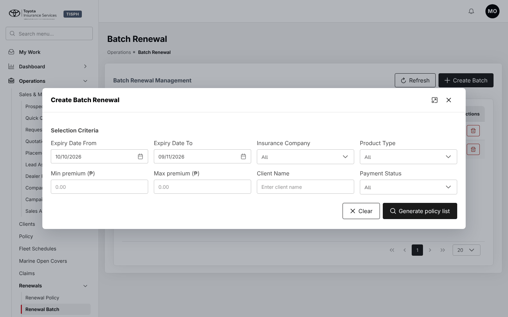
**Lapse Management** shows the policies **Lapsed**, **In grace period** and that **Can be reinstated**, with the **Premium lost or at risk**. The tab **Lapsed and grace period** lists each policy with its days lapsed or left in the grace period, the **Lapse reason** and the win-back offers made. The tab **Win-back campaigns** holds the campaigns offering lapsed clients a discount to come back, with the clients contacted and converted and the premium recovered; **New campaign** creates one.

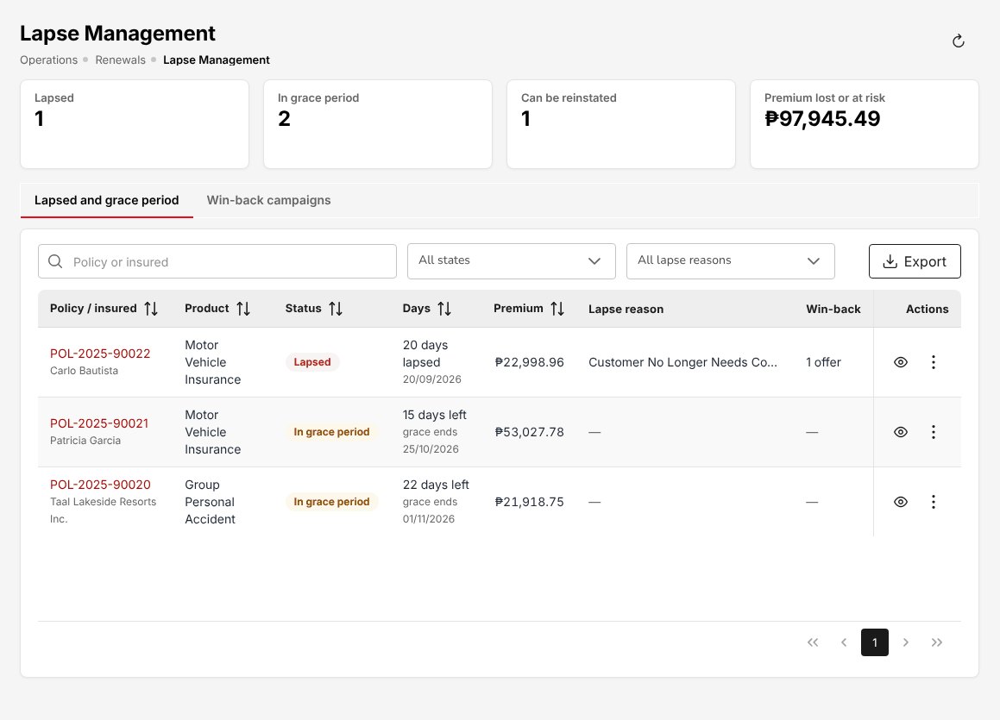
**Retention Analytics** shows, for the period, line of business and account executive chosen, the **Renewal rate**, the **Premium retention**, the **Average cycle time** (from renewal opened to renewed) and the **Open renewals now**, with the tabs **Monthly trend**, **By line of business**, **By account executive** and **Open renewals profile**.

**Performance** compares the renewal results with the targets: the **KPI scorecard** shows each KPI (renewal rate, premium retention, average cycle time) with **Target**, **Achieved**, **Variance** and the status **Met** or **Below target**, also **By account executive**, **By line of business** and as a **Monthly trend**. **Export** downloads each view.

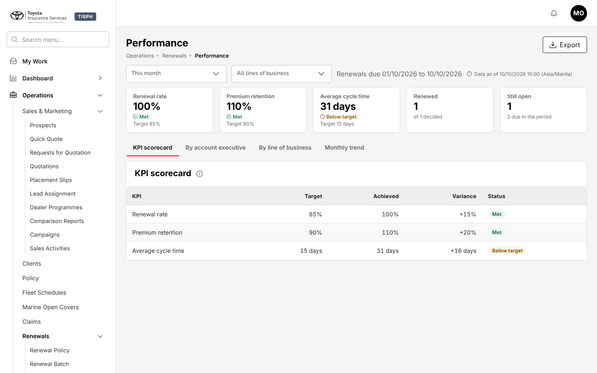
### Renewal Queue and At-Risk Policies {#renewal-queue-and-at-risk-policies}
**Menu:** Operations > Renewals > Renewal Queue

| Role | Access |
|---|---|
| TIS Sales Associate | Create and edit |
| TIS Sales Officer | Create and edit |
| TIS Sales Unit Head | Create and edit |
| TIS Operations Associate | Create and edit |
| TIS Operations Officer | Create and edit |
| TIS Operations Unit Head | Create and edit |
| TIS IT AppSupport / Admin | View |
| TIS General Manager | Create and edit |

The **Renewal Queue** is the work list of open renewals. The cards count **Open renewals**, **Expiring within 30 days**, **High risk**, **In grace period** and the **Premium due for renewal**. Each row shows the policy and insured, product and insurer, **Expiry**, **Premium**, **Stage**, **Risk** and **Account executive**; filter by stage, risk level and account executive. **Refresh pipeline** adds the policies newly due; **Export** downloads the queue.

The stages follow the renewal: **Pending**, **First Notice Sent**, **Second Notice Sent**, **Final Notice Sent**, **Quote Sent**, **Pending Approval**, **Approved**, **In Grace Period**, then **Renewed**, lapsed or **Not for renewal**. The renewal notices are e-mailed to the client 90, 60 and 30 days before expiry (30 and 15 days for Credit Life), on working days; a notice missed on a holiday goes out on the next working day.

The notices of a policy in a lock-in or under Scheme 2 are not sent, and those of a policy whose TFS loan is past due, terminated, in legal dispute or under fraud review are held: the stage shows **Lock-in: not sent** or **Held**, and **Notices withheld** replaces the send action.

Under **More actions**, TIS Sales Officer, TIS Sales Unit Head, TIS Operations Unit Head or TIS General Manager can:

- **Reassign**: move the renewal to another owner, with a reason.
- **Not for renewal**: close the renewal with a reason; no more notices are sent and the policy shows **Not for renewal** on Lapse Management, where it can still be reinstated within the reinstatement period.

A renewal opened from [My Work (2.3)](#my-work) or a notification opens on the selected renewal.

### Lock-in Accounts {#lock-in-accounts}
**Menu:** Operations > Renewals > Lock-in Accounts

| Role | Access |
|---|---|
| TIS Sales Associate | Create and edit |
| TIS Sales Officer | Create and edit |
| TIS Sales Unit Head | Create and edit |
| TIS Operations Associate | Create and edit |
| TIS Operations Officer | Create and edit |
| TIS Operations Unit Head | Create and edit |
| TIS IT AppSupport / Admin | View |
| TIS General Manager | Create and edit |

Lock-in Accounts lists the lock-in (promotion, Scheme 1 ARA) and Scheme 2 accounts expiring within the review window (60 days as delivered) or the days chosen. The cards count the **Accounts**, those whose **Review due** date is reached, **Notices suppressed** and **Notices held**. Each row shows the policy and insured, the lock-in and its year, **Expiry**, **Review date**, **TFS loan status** with the loan account, the notice treatment and the owner. Filter by lock-in, loan status and notice treatment, or search by policy, client or loan account.

**Download Excel** downloads the list. **Open renewal** opens the renewal of the account. **Set loan status** records the TFS loan status (**Current**, **Past due**, **Fraud**, **Terminated**, **Legal dispute**, **Closed**); a status that holds the notices needs a note, and the notices already queued for the policy are skipped. A review task is created in [My Work (2.3)](#my-work) for the owner when the review date is reached.

**At-Risk Policies** is the risk register: open renewals with a **Medium** or higher retention risk. The cards count the **Policies at risk**, **High**, **Medium**, the **Premium at risk** and those **Without a next action**. Each row shows the risk score and its **Main drivers** (for example claims in the current term, first renewal with the broker, premium up on the renewal quote, expiry close), and the **Next action** with its due date. Open the policy to plan the next action.

### Negotiations {#negotiations}
**Menu:** Operations > Renewals > Negotiations

| Role | Access |
|---|---|
| TIS Sales Associate | Create and edit |
| TIS Sales Officer | Approve |
| TIS Sales Unit Head | Approve |
| TIS Operations Associate | Create and edit |
| TIS Operations Officer | Create and edit |
| TIS Operations Unit Head | Approve |
| TIS IT AppSupport / Admin | View |
| TIS General Manager | Approve |

Negotiations lists the renewals being discussed with the client. The cards count **In negotiation**, **Quote sent**, **Pending approval**, **Approved** and **Expiring within 15 days**. Each row shows the policy and client, **Stage**, **Expiry**, **Current premium**, **Proposed premium** (with the change against the current premium), **Last activity** and **Account executive**.

Select a renewal to see its **Renewal terms** (RN-YYYY-NNNNN), and the **Timeline** of notices, quotes, meetings and counter-offers, with the outcome and next step of each. The buttons are:

- **Add update**: a change of terms or stage.
- **Log communication**: a call, e-mail or meeting with the client, its outcome and the next step.
- **Submit for approval**: the renewal terms go to TIS Sales Officer, TIS Sales Unit Head, TIS Operations Unit Head or TIS General Manager, a user other than the one who submitted them.

While the terms wait for approval they cannot be changed. The approved premium is the premium booked on the renewed policy, and an expired renewal quote cannot be submitted or completed. When the renewal terms limit is enforced, the premium must be within the approver's limit on the [Authority Matrix (20.10)](#authority-matrix). The new term starts the day after the expiring term ends.

### Payments {#payments}
Operations > Payments shows **Gross Premium**, **Collected Premium**, **Receivables** and **Earned Commission**, and the bills in the tabs **Paid**, **Pending** and **Reviewing**. The **Type** column says whether the bill is for a **Policy**, a **Renewal Policy** or an **Endorsement**. Receipts are posted by Accounting; this screen shows the result.

**Menu:** Operations > Payments

| Role | Access |
|---|---|
| TIS Sales Associate | Create and edit |
| TIS Sales Officer | Create and edit |
| TIS Sales Unit Head | Create and edit |
| TIS Operations Associate | Create and edit |
| TIS Operations Officer | Create and edit |
| TIS Operations Unit Head | Create and edit |
| CCD-PDU (Post-Dated Cheques) | View |
| CCD-PDC / CCD-ADA | View |
| CCD-BP / QRPh (Receipting) | View |
| CCD-Recon (Reconciliation and Reversals) | View |
| TIS Finance & General Accounting | View |
| TIS IT AppSupport / Admin | View |
| TIS General Manager | Create and edit |

Each row shows **Type**, **Assured Name**, **Client ID**, **Policy Number**, **Gross Premium**, **Bill date**, **Due date**, **Status** and **Actions**. When a client pays you directly, record the payment from the bill: the bill moves to **Reviewing** and Cash Control receives it to verify and receipt on [Verify payments and post official receipts (18.1)](#verify-payments-and-post-official-receipts). Once receipted, the bill is **Paid**.

### Cover notes (binders) {#cover-notes-binders}
**Menu:** Operations > Cover Notes

| Role | Access |
|---|---|
| TIS Sales Associate | Create and edit |
| TIS Sales Officer | Create and edit |
| TIS Sales Unit Head | Create and edit |
| TIS Operations Associate | Create and edit |
| TIS Operations Officer | Create and edit |
| TIS Operations Unit Head | Create and edit |
| TIS IT AppSupport / Admin | View |
| TIS General Manager | Create and edit |

A cover note gives the client temporary cover while the insurer's policy is pending. It is issued from an accepted quotation or from a placement slip sent to the insurer or later. It is superseded when the policy is booked and expires after its end date.

The cards count the cover notes **Active** and **Expiring within 7 days**, and show those where you must **Follow up the insurer's policy**. The list shows **Cover note / insured**, **Insurer**, **Quotation / placement**, **Cover period**, **Premium**, **Status** and **Policy**.

1. Select **Issue cover note**.
2. Search and select the quotation or placement slip.
3. Enter **Cover from**, **Cover period (days)** (the default applies if left empty), the **Insurer binder reference** and any **Special conditions**.
4. Select **Issue cover note**. Print it or e-mail it to the client.

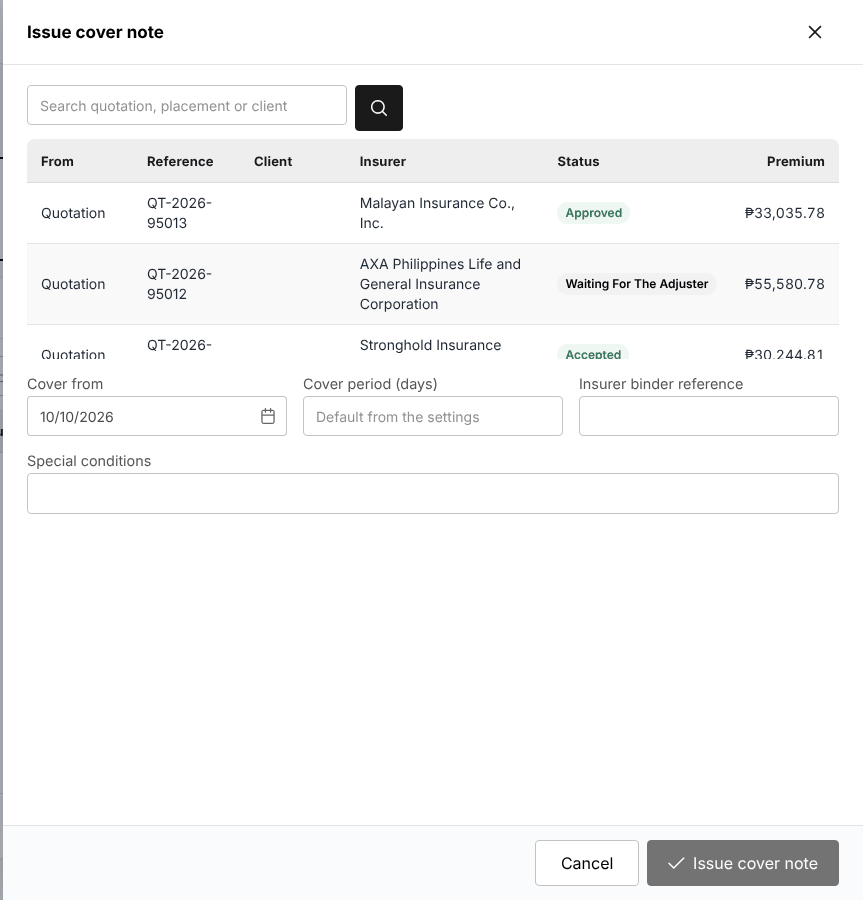
### Cancel a policy: computed return premium {#cancel-a-policy-computed-return-premium}
**Menu:** Operations > Policy Cancellation

| Role | Access |
|---|---|
| TIS Sales Associate | Create and edit |
| TIS Sales Officer | Create and edit |
| TIS Sales Unit Head | Create and edit |
| TIS Operations Associate | Create and edit |
| TIS Operations Officer | Create and edit |
| TIS Operations Unit Head | Create and edit |
| TIS IT AppSupport / Admin | View |
| TIS General Manager | Create and edit |

**Menu:** Master > Insurance > Short-Period Rates

| Role | Access |
|---|---|
| TIS IT AppSupport / Admin | Create and edit |

**Menu:** Master > Insurance > Cancellation Reasons

| Role | Access |
|---|---|
| TIS IT AppSupport / Admin | Create and edit |

Policy Cancellation computes the return premium of a policy from the days left: pro-rata when the insurer cancels, at the short-period rates when the insured cancels, and in full (flat) when the policy is cancelled from inception.

1. Choose Operations > Policy Cancellation.
2. Enter the **Policy number** (required) and the **Cancellation date**.
3. Choose the **Reason** (from Master > Insurance > Cancellation Reasons). The reason gives the **Return premium method**; you may choose another method.
4. Choose **Cancellation**: **Whole policy**, or one risk of the policy.
5. Select **Compute return premium**. The screen shows the method, the days in force and left, the return net premium with its taxes, the gross return, the commission taken back and the amount returned by the insurer.

Nothing is saved by this screen. The cancellation itself is made as an endorsement of the policy (**More actions** > **Endorsement**, cancellation), which computes the same figures on the server; see [Raise an endorsement request (17.10.1)](#raise-an-endorsement-request). It is completed by TIS Sales Officer, TIS Sales Unit Head, TIS Operations Unit Head or TIS General Manager, a user other than the one who entered it. The return premium is credited to the client and commission already paid on it is clawed back. The short-period rates (the percentage of the annual premium earned for each period in force) are kept on Master > Insurance > Short-Period Rates.

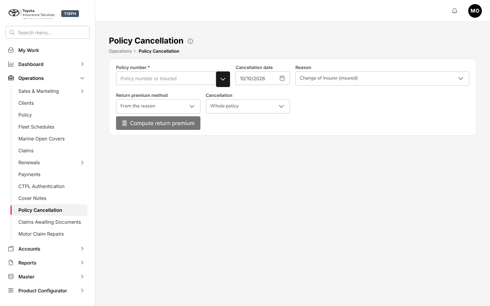
### Claims awaiting documents {#claims-awaiting-documents}
**Menu:** Operations > Claims Awaiting Documents

| Role | Access |
|---|---|
| TIS Operations Associate | Create and edit |
| TIS Operations Officer | Create and edit |
| TIS Operations Unit Head | Create and edit |
| TIS General Manager | Create and edit |

This screen lists the open claims that still miss documents. The cards count the **Claims missing documents**, those **Ready to submit**, the **Documents outstanding** and the claims **Not reminded yet**. Each row shows the claim, policy, line and cause of loss, **Reported**, **Documents** (received of required), **Missing**, **Last reminder** and **Actions**.

Select a claim to open its **Documents** step: upload or waive each document, or select **Remind the claimant** to e-mail the list of what is missing. The reminder date is recorded.

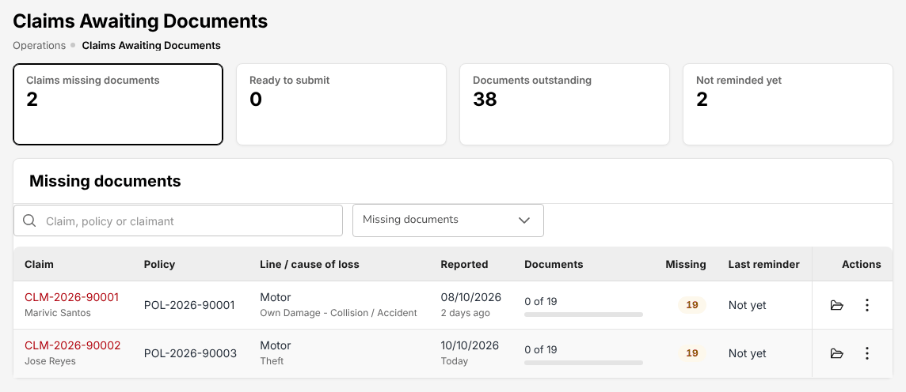
### Motor claim repairs and letters of authority {#motor-claim-repairs-and-letters-of-authority}
Operations > Motor Claim Repairs lists the motor claims with the stage of their repair: no estimate yet, awaiting approval, approved, in repair, released. Select a claim to open its repair file.

**Menu:** Operations > Motor Claim Repairs

| Role | Access |
|---|---|
| TIS Operations Associate | Create and edit |
| TIS Operations Officer | Create and edit |
| TIS Operations Unit Head | Create and edit |
| TIS General Manager | Create and edit |

**Menu:** Master > Insurance > Repair Shops

| Role | Access |
|---|---|
| TIS Operations Associate | View |
| TIS Operations Officer | View |
| TIS Operations Unit Head | View |
| TIS IT AppSupport / Admin | Create and edit |

The repair file shows the plate number, insured, insurer, sum insured and the participation of the insured (the deductible the insured pays the shop), and the buttons:

- **Record estimate**: the estimate of an accredited repair shop (from Master > Insurance > Repair Shops), its total and the adjuster's decision.
- **Issue letter of authority**: the insurer's authority to the shop to repair, with the **Approved repair**, the **Participation** and the amount **Payable by insurer**.
- **Release vehicle**: the date the repaired vehicle was released to the insured.

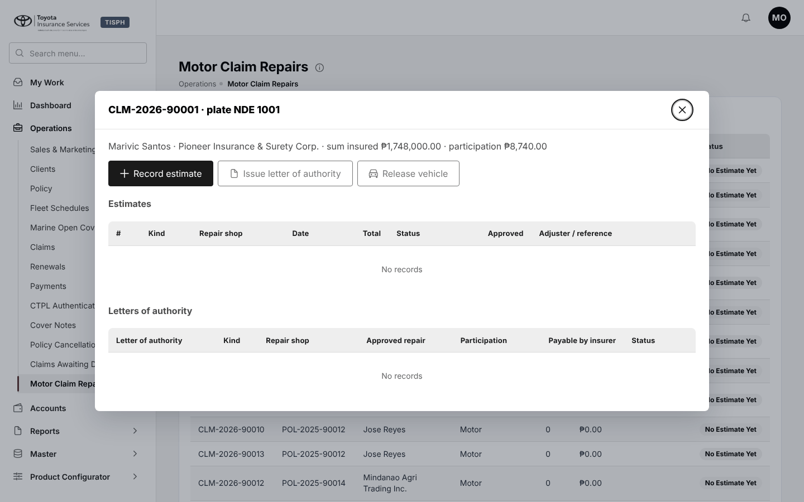
## Screen reference: Accounts {#screens-accounts}
The screens of the Accounts menu, in menu order: receipts and collections, Cash Control, disbursements and payables, remittance to insurers, journal vouchers, reconciliations, tax, period end and incentives.

Each section names the menu of the screen and the roles that open it, with their access. Your own menu shows only the screens of your role. Every amount is in pesos; every posting goes to the general ledger through the posting rules of [Posting configuration (20.14)](#posting-configuration-configuration-approvals-posting-rules-account-determination), and each document can be traced to its journal on [Accounting Query (18.14)](#accounting-query-and-all-clients-accounting).

### Verify payments and post official receipts {#verify-payments-and-post-official-receipts}
When Operations or Sales record a client payment on the policy, the system issues the acknowledgement receipt (AR), the policy payment status becomes **Reviewing** and Cash Control receives the notification to verify it. Open the notification, check the payment against the bank statement and confirm it (the official receipt is posted, with the transaction code **PAYMENT**) or reject it with a reason.

**Menu:** Accounts > Receipts

| Role | Access |
|---|---|
| TIS Sales Associate | View |
| TIS Sales Officer | View |
| TIS Sales Unit Head | View |
| TIS Operations Associate | View |
| TIS Operations Officer | View |
| TIS Operations Unit Head | View |
| CCD-PDU (Post-Dated Cheques) | Create and edit |
| CCD-PDC / CCD-ADA | Create and edit |
| CCD-BP / QRPh (Receipting) | Create and edit |
| CCD-Recon (Reconciliation and Reversals) | Create and edit |
| TIS Finance & General Accounting | View |
| TIS IT AppSupport / Admin | View |
| TIS General Manager | View |

The list (**Receipts history**) shows **Receipt Number** (OR-YYYY-NNNNN), **Transaction Code**, **Transaction Number** (RT-YYYY-NNNNN), **Policy Number**, **Name**, **Customer Code**, **Date**, **Amount**, **Paid**, **UnPaid**, **Status**, **Payments** and **Action**. **Status** is **Converted** when every line of the receipt is paid and posted (the usual status of an issued receipt), **Draft** while a line is not yet paid, and **Cancelled** after a cancellation. **Transaction Code** is **OR** for a receipt issued on Add Receipts or by Bulk Upload, **PAYMENT** for a receipt issued on the confirmation of a payment recorded on the policy, and **CM** for a credit memo. **Search by** chooses the column searched. The buttons are **Bulk Print** (receipts of a period as one PDF), **Bulk Upload** (bills payment and QRPh settlement files: each row pays a policy; the file is validated before anything is posted) and **Receipt**.

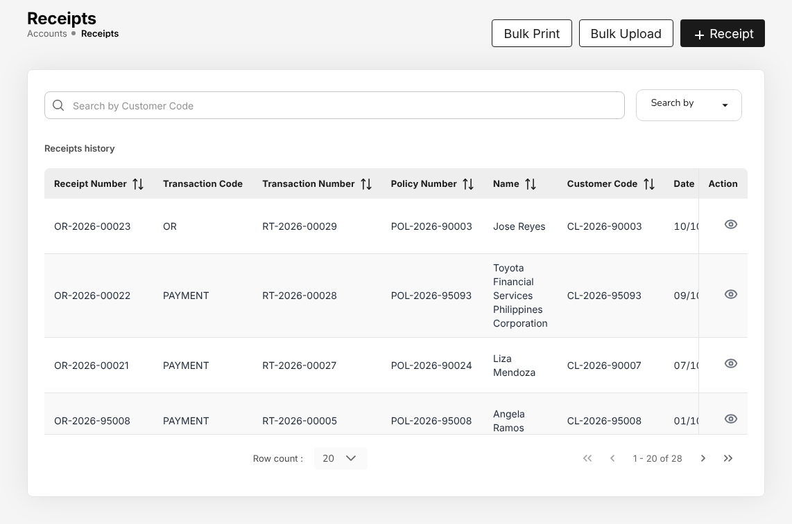
To issue an official receipt, select **Receipt**:

| Field | Required | What to enter | Rule |
|---|---|---|---|
| **Receipt Date** | Yes | Today's date is proposed | Must fall in an open period |
| **Receipt Number** | | Issued by the system on save | From the official receipt series |
| **Receipt Type** | Yes | **Payment** | |
| **Branch Code**, **Department Code** | No | The branch (**Head Office**) and the department (**Cash Control**) of the receipt | |
| **Customer Code** | Yes | The client | **Customer Name** is filled in |
| **Policy Number** | Yes | The policy paid | Only the client's policies with an open bill |
| **Currency Code** | Yes | **PHP** | |
| **Transaction Code** | Yes | **OR – Official Receipt** | **CM – Credit Memo** only when TIS Finance & General Accounting asks for it |
| **Receipt Mode** | Yes | **Dollar/Peso** (cash), **Cheque**, **Managers Check/Demand Draft**, **Direct Credit/Transfer to Account**, **Telegraphic Transfer**, **Authority to Debit**, **Online Banking** or **Credit Ticket-Inter Office** | A cheque asks for the cheque details; the mode gives the bank account debited |
| **Remarks** | No | | |

Select **Record payment**. The system issues the receipt number, posts the payment (cash in the bank account of the receipt mode against the premium receivable) and reduces the bill. When the bill is fully paid the policy's payment becomes **Completed**. Print the receipt or e-mail it to the client. A receipt issued in error is cancelled with a reason by CCD-Recon (Reconciliation and Reversals): the journal is reversed and the bill is open again. See [Collection by Cash Control (3.7)](#process-collection).

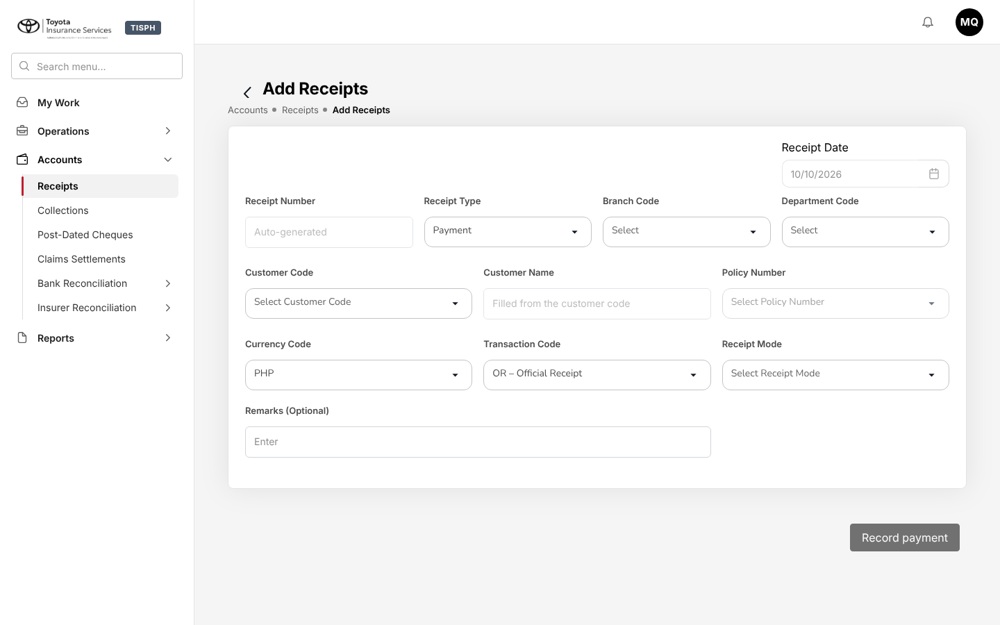
### Collections {#collections}
Accounts > Collections lists every open premium with **Client Name**, **Policy No.**, **Outstanding** spread over the ageing buckets (**Current**, **1-30 Days**, **31-60 Days**, **61-90 Days**, **Over 90 Days**), **Due Date**, **Status** (Pending, Committed, Overdue), **Days Overdue** and **View**. Filter by status and overdue level.

**Menu:** Accounts > Collections

| Role | Access |
|---|---|
| TIS Sales Associate | View |
| TIS Sales Officer | View |
| TIS Sales Unit Head | View |
| TIS Operations Associate | View |
| TIS Operations Officer | View |
| TIS Operations Unit Head | View |
| CCD-PDC / CCD-ADA | View |
| CCD-BP / QRPh (Receipting) | Create and edit |
| CCD-Recon (Reconciliation and Reversals) | Create and edit |
| TIS Finance & General Accounting | View |
| TIS IT AppSupport / Admin | View |
| TIS General Manager | View |

The cards show the **Outstanding** and **Overdue** amounts, the items **Committed** (the client gave a payment date) and **Escalated**, and the amount **Collected this month**. **Send Payment Reminders Now** e-mails the reminders of the overdue items at once; **Import open items** loads open premiums from a file.

Select **View** to open an item. **Collection Details** shows the client and policy, the overdue level, the financial breakdown of the bill (gross premium, net premium, VAT, DST, LGT, paid, outstanding), the ageing, the **Follow-Up History** and the **Payment History**. The **Collection Actions** are **Send Email**, **E-mail invoice**, **Add Note** and **Set Commitment Date**; **Record receipt** opens the receipt for this bill.

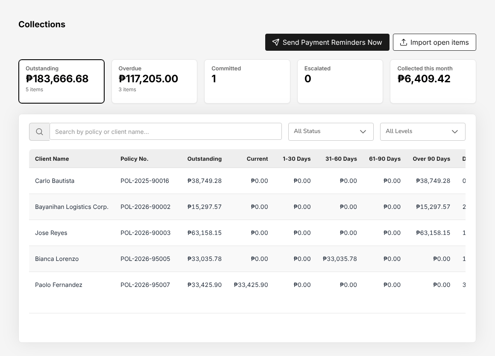
### Credit control {#credit-control}
**Menu:** Accounts > Credit Control > Instalment Plans

| Role | Access |
|---|---|
| TIS Finance & General Accounting | Approve |
| TIS General Manager | View |

**Menu:** Accounts > Credit Control > Premium Warranty Monitor

| Role | Access |
|---|---|
| TIS Finance & General Accounting | Approve |
| TIS General Manager | View |

**Menu:** Accounts > Credit Control > Remittance Ageing

| Role | Access |
|---|---|
| TIS Finance & General Accounting | View |
| TIS General Manager | View |

Changes on the Credit Control screens that need approval (a credit limit, a warranty extension) are approved by TIS Finance & General Accounting, a user other than the one who requested them.

- **Instalment Plans** lists the open instalments of policies paid by instalment, with **Policy no.**, **Client**, the instalment number, **Due date**, **Outstanding**, **Days past due** and **Ageing**, and the totals per ageing bucket. **Overdue only** narrows the list.
- **Premium Warranty Monitor** follows the premium payment warranty: the premium must be paid by the warranty deadline after inception, or the cover is at risk. The cards count the policies **Warranty breached** and **At risk** and the **Extensions to approve**. Each row shows the policy, client, insurer, **Inception**, **Warranty deadline**, **Days past deadline**, **Premium due** and **Status**. Request an extension from the row; the extension is approved by another user.
- **Client Credit Limits** shows each client's **Credit limit** (or **No limit**), **Open premium**, **Available** and **Last changed**. Set or change a client's limit from the row. **Issued over the limit** lists the policies booked over a client's limit.
- **Remittance Ageing** ages the premium collected and not yet remitted to each insurer, by the insurer's remittance terms (**Not yet due**, **1-30**, **31-60**, **61-90**, **Over 90**), with the detail by policy and receipt. **Excel** downloads it.

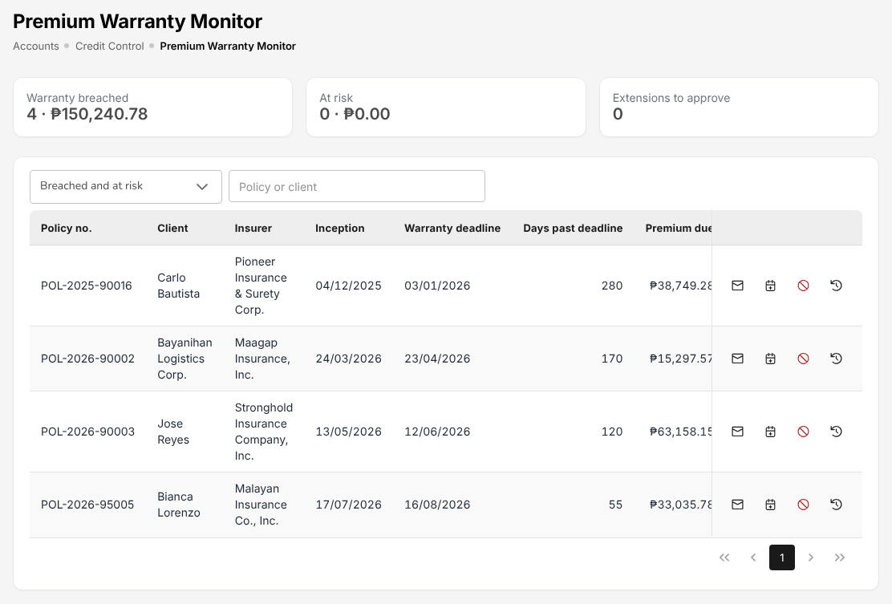
### Post-dated cheques {#post-dated-cheques}
Accounts > Post-Dated Cheques is the register of cheques received from clients before their date.

**Menu:** Accounts > Post-Dated Cheques

| Role | Access |
|---|---|
| CCD-PDU (Post-Dated Cheques) | Create and edit |
| CCD-PDC / CCD-ADA | Create and edit |
| CCD-BP / QRPh (Receipting) | Create and edit |
| CCD-Recon (Reconciliation and Reversals) | Create and edit |
| TIS Finance & General Accounting | View |
| TIS IT AppSupport / Admin | View |
| TIS General Manager | View |

The cards show the cheques **On hand**, **Due for deposit** and **Bounced**. The tabs **Cheques** and **Deposit due** (cheques due within three days) list **PDC no.** (PDC-YYYY-NNNNN), **Client**, **Bill / policy**, **Drawee bank**, **Cheque no.**, **Cheque date**, **Amount**, **Kept in**, **Status** and **Receipt**. **Export to Excel** downloads the list.

To register a cheque, select **Register cheque**:

| Field | Required | What to enter |
|---|---|---|
| **Against** | Yes | **Bill number** (or the policy) |
| **Reference** | Yes | The bill or policy number |
| **Drawee bank** | Yes | From the bank list, or **Drawee bank (if not in the list)** |
| **Cheque no.** | Yes | |
| **Cheque date** | Yes | The date on the cheque, picked from the calendar |
| **Amount** | Yes | |
| **Kept in** | No | Where the cheque is kept, for example "Finance vault, drawer 2" |
| **Remarks** | No | |

The cheque is **On Hand**. Nothing is posted until it is deposited. The actions of a cheque are:

- **Deposit**: choose the **Bank account** and the **Deposit date** and select **Deposit cheque**. An official receipt is created and posted to that bank account.
- **Replace**: register the new cheque that replaces this one (for example after a bounce).
- **Return**: give the cheque back to the client.
- **Cancel**: remove a cheque registered in error.

A cheque that bounces is recorded as bounced with the reason: its receipt is cancelled, the journal reversed and the bill is open again.

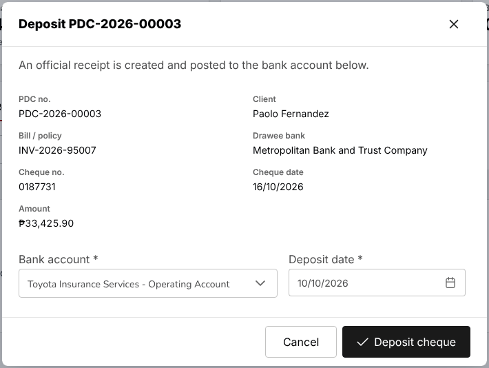
### Accounts payable {#accounts-payable}
Suppliers are kept on Accounts > Payables > Suppliers: TIN, address, VAT registration, the EWT tax code withheld (Master > Finance > Taxation, for example WC158 goods, WC160 services, WC100 rentals), payment terms and the default expense account.

**Menu:** Accounts > Payables > Suppliers

| Role | Access |
|---|---|
| TIS Sales Unit Head | View |
| TIS Operations Unit Head | View |
| TIS Finance & General Accounting | Create and edit |
| TIS IT AppSupport / Admin | View |
| TIS General Manager | View |

**Suppliers**: **Add** opens the supplier form: **Code** and **Supplier** (required), **TIN**, **Registered Address**, **VAT Registered**, **EWT Tax Code**, **Payment Terms (days)**, **Default Expense Account**, **Contact Person**, **E-mail**, **Phone**, **Bank** and **Bank Account No.**

**Supplier Invoices** lists **AP voucher**, **Supplier**, **Supplier invoice no.**, **Invoice date**, **Due date**, **Gross**, **EWT**, **Balance** and **Status**. To record an invoice:

1. Select **New supplier invoice**.
2. Enter **Supplier**, **Supplier invoice no.** and **Invoice date** (required), the **Description** and the **EWT tax code** (the supplier's is proposed).
3. Add a line per expense: **Description**, **Account**, **Asset class** (for a fixed asset), **Vatable** and **Amount**. The total net of VAT is shown.
4. Select **Save draft**, or **Save and submit**.

The invoice is approved by TIS Sales Unit Head, TIS Operations Unit Head, TIS Finance & General Accounting or TIS General Manager, a user other than the one who submitted it, and is posted on approval: expense (or asset), input VAT, EWT payable and the payable to the supplier. A line with an asset class creates the asset on the Asset Register.

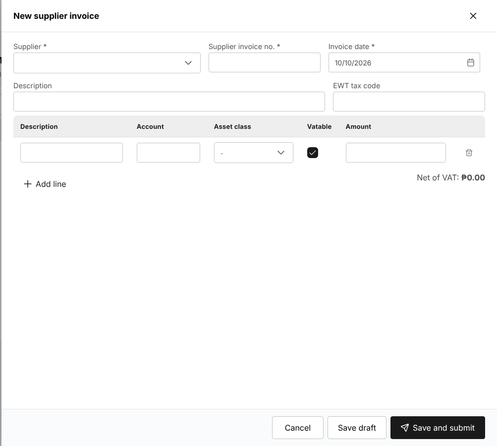
**Supplier Payments** pays approved invoices: select **New supplier payment**, choose the **Supplier**, the **Date**, the **Payment mode** (for example **Cheque**), the **Bank account** (required), the **Cheque no.** and **Reference**, tick the invoices to pay and select **Pay**. The payment is posted and the invoices' balance reduced.

**AP Ageing** ages the open supplier invoices on their due dates (**Not due**, **1-30**, **31-60**, **61-90**, **Over 90**), by supplier and by invoice. **Export to Excel** downloads it.

### BIR Form 2307 for suppliers {#bir-form-2307-for-suppliers}
The expanded withholding tax withheld from a supplier on an approved supplier invoice (the supplier's EWT tax code, on the amount net of VAT) is creditable tax of the supplier: the broker issues BIR Form 2307 for it each quarter.

**Menu:** Accounts > Payables > Supplier 2307

| Role | Access |
|---|---|
| TIS Sales Unit Head | View |
| TIS Operations Unit Head | View |
| TIS Finance & General Accounting | View |
| TIS IT AppSupport / Admin | View |
| TIS General Manager | View |

Choose the year and the quarter. The cards show the number of **Payees**, the **Income payments subject to expanded withholding tax** and the **Tax withheld for the quarter**. Each row is one supplier: **Payee's name**, **Taxpayer Identification Number (TIN)**, **ATC**, **Transactions**, the income payments, the tax withheld and the **Certificate no.** Print the certificate of a supplier from its row. The same figures are in the QAP of [Tax: BIR forms and returns (18.17)](#tax-bir-forms-and-returns).

### Disbursement: payment vouchers and cheques {#disbursement-payment-vouchers-and-cheques}
A payment voucher (PV-YYYY-NNNNN, with the disbursement transaction DT-YYYY-NNNNN) pays an insurer, an agent or referrer, a client or a supplier.

**Menu:** Accounts > Disbursement

| Role | Access |
|---|---|
| TIS Sales Unit Head | View |
| TIS Operations Unit Head | View |
| CCD-Recon (Reconciliation and Reversals) | View |
| TIS Finance & General Accounting | Create and edit |
| TIS IT AppSupport / Admin | View |
| TIS General Manager | View |

The list (**Disbursement history**) shows **Disbursement Number**, **Transaction Number**, **Customer Code**, **Disbursement Date**, **Amount**, **Status** (**Draft**, **Approved**, **Paid**) and **Action**. The buttons are **Bulk Print**, **Bulk Upload**, **Bulk Disburse** (one voucher per referrer with approved commission) and **Create**.

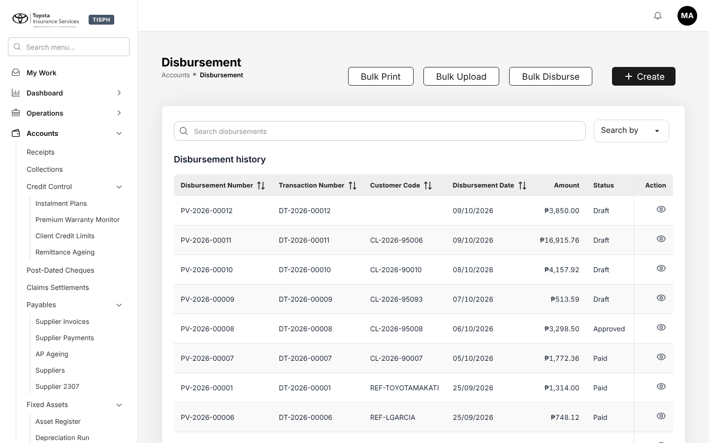
To create a payment voucher, select **Create**:

1. Enter the **Disbursement Date**, **Department Code** and **Branch Code**.
2. Choose the **Payee Type** (insurer, agent or referrer, client, supplier) and the **Criteria**, then the payee (**Customer Code**, **Customer Name**) and, if the payment is for one policy, the **Policy Number**.
3. Choose the **Transaction Type**, enter the **Payment Description**, the **Payment Currency** and any **Payment Notes**. Select **Next**.
4. Enter the amounts and the accounts debited, and the withholding tax where it applies.
5. Choose the bank account and the payment method (cheque, bank transfer or bank payment file) and save.

The voucher is approved by a user other than the one who prepared it, within his or her limit of the [Authority Matrix (20.10)](#authority-matrix). An approved voucher is paid by cheque (the cheque number and release are recorded) or by a [bank payment file (18.8)](#bank-payment-files); on payment the journal is posted and the voucher becomes **Paid**.

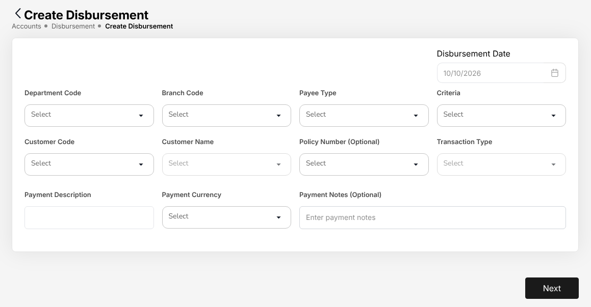
### Bank payment files {#bank-payment-files}
**Menu:** Accounts > Bank Payment Files

| Role | Access |
|---|---|
| TIS Finance & General Accounting | Create and edit |
| TIS General Manager | View |

Bank Payment Files pays approved payment vouchers through the bank's upload file. The list shows **Batch**, **Layout**, **Value date**, **Payments**, **Amount**, **Status** and **Created**.

1. Select **New batch**.
2. Choose the **Layout** of the bank (see [Bank file layouts and payee bank accounts (20.19)](#bank-file-layouts-and-payee-bank-accounts)), the account to **Pay from**, the **Channel** (for example **PESONet**) and the **Value date**.
3. Tick the payment vouchers waiting for payment and enter **Remarks**.
4. Select **Create batch**.

The batch is approved by another user, the file is downloaded for the bank portal, and the bank's result file is loaded back: each payment it confirms is posted and its voucher becomes **Paid**; a rejected payment returns to the vouchers waiting for payment.

**Approve** and **Return to draft** are shown only to a user who may decide the batch. The user who prepared or submitted the batch, or prepared one of its payment vouchers, reads why instead, and a user whose payment voucher limit is below the batch total sees the limit. The vouchers of insurer remittances are batched from [Insurer payments (18.9.5)](#insurer-payments) with the same batch dialog.

### Remittance to insurers {#remittance-to-insurers}
For broker-billed policies TISPH remits the collected premium, net of the broker's commission, to each insurer by its
share. Remittances are prepared and submitted by CCD-Recon (Reconciliation and Reversals) or TIS Finance & General Accounting; they are approved by
TIS Finance & General Accounting or TIS General Manager, never by the user who prepared or submitted them.

The Remittance menu has eight entries. Each role sees the entries of its work; a role that only reads an entry sees
**View only** at the top of the page and no tick boxes or action buttons.

| Entry | What it is for |
|---|---|
| [Remittances (18.9.1)](#remittances-worklist) | The remittances from draft to payment; **Import policy list** for an off-cycle remittance |
| [Approvals (18.9.4)](#remittance-approvals) | The remittances, settlements and adjustments waiting for a decision |
| [Insurer payments (18.9.5)](#insurer-payments) | The payment vouchers of the approved remittances, with their bank payment batch or cheque |
| **Reconciliation** | The insurers' statements: see [Insurer statement reconciliation (18.16)](#insurer-statement-reconciliation) |
| [Exceptions (18.9.6)](#remittance-exceptions) | Differences and problems found on remittances, to follow up |
| **Insurer billing** | Commission debit notes of direct-bill policies: see [Direct bill: commission debit notes (18.10)](#direct-bill-commission-debit-notes) |
| [Setup (18.9.7)](#remittance-schedules) | The schedules of the weekly remittance runs |
| [Settlement (18.9.8)](#remittance-settlement) | The settlement of approved remittances, which raises the insurer's payment voucher |

A remittance (REM-YYYY-NNNNN) covers one insurer and product line for a coverage week. Its status is **Draft** until
submitted, **Pending approval** until an approver decides, then **Approved**, or **Returned** to its maker when
rejected. **Settled (voucher raised)** means the insurer's payment voucher exists; the step **Paid** of the remittance
shows when the voucher is paid.

#### Remittances {#remittances-worklist}
**Menu:** Accounts > Remittance > Remittances

| Role | Access |
|---|---|
| TIS Operations Associate | View |
| TIS Operations Officer | View |
| TIS Operations Unit Head | View |
| CCD-PDC / CCD-ADA | View |
| CCD-BP / QRPh (Receipting) | View |
| CCD-Recon (Reconciliation and Reversals) | Create and edit |
| TIS Finance & General Accounting | Create and edit |
| TIS IT AppSupport / Admin | View |
| TIS General Manager | View |

The chips at the top show the next weekly run and whether **Automation** (the daily remittance job) is **On** or
**Off**. The cards **To submit**, **Awaiting approval**, **Approved, not paid** and **Overdue to insurer** count the
remittances of the list as filtered; select a card to list them. The tabs are **My work** (the drafts and returned
remittances to submit), **Drafts**, **In approval**, **In payment** and **All**. Filter by coverage week, insurer,
product line and source (**Weekly run**, **Run now**, **Import**), or search a REM, policy or OR number.

Each row shows **Remittance no** with the coverage week, **Insurer** and product line, **Policies**, **Due to insurer**
with the due date (red with **Overdue** when past), **Status** and **Next step**: for a remittance pending approval,
the approvers it waits on. **Columns** adds Source, Voucher no, Paid on, Bank ref, Submitted by and Created on. The
total of the list is under **Due to insurer**.

To submit remittances for approval:

1. Choose Accounts > Remittance > Remittances. Open **My work** or **Drafts**.
2. Tick the drafts and select **Submit for approval (n)**, or choose **Submit for approval** in the row menu.
3. Check the total in the confirmation and select **Submit n remittances**. Each row then says **Submitted**, or why
   it was not submitted (for example, another user submitted it a moment before).

The row menu also offers **View**, the remittance schedule (XLSX and PDF), the remittance advice once the voucher is
raised, and **Open voucher**. The menu at the top right holds **Run now**, **Run history**, **Import history** and
**Export XLSX**.

#### Import policy list {#remittance-import-policy-list}
An off-cycle remittance (opening remittances at go-live, a catch-up, an insurer's list, a correction) is created from
a list of policies. The file names the policies and the insurer; the system computes every amount from the
collections. **Import policy list** replaces the bulk upload of remittances with typed amounts.

1. On Accounts > Remittance > Remittances, select **Import policy list**.
2. Select **Download template** and fill in the **Data** sheet: **Policy No** and **Insurer Code** are required;
   **Product Line**, **Expected Due to Insurer**, **Insurer Reference** and **Remark** are optional.
3. Choose the **Purpose** from the list, type a **Note** if needed, and choose the file (.xlsx or .csv, at most
   10 MB and 5,000 rows).
4. Select **Validate**. Nothing is created yet. The preview shows each row with its result (**Ready**, **Ready ·
   Variance**, **Already on REM**, **Not found**, **Not issued**, **Insurer differs**, **Product line differs**,
   **Direct bill**, **Duplicate in file**) and the remittances to create per insurer and product line.
   **Download error report** lists every row with its result and message.
5. Select **Create n draft remittances** and confirm. One draft is created per insurer and product line from the
   ready rows, marked **Off-cycle** with the purpose. Submit the drafts for approval as above.

**Expected Due to Insurer** is only compared with the amount computed: a difference above PHP 1.00 is shown as a
variance. The same file cannot be imported twice, and a validated file not created within 7 days is discarded.
**Import history** (menu at the top right) lists the imports with their results.

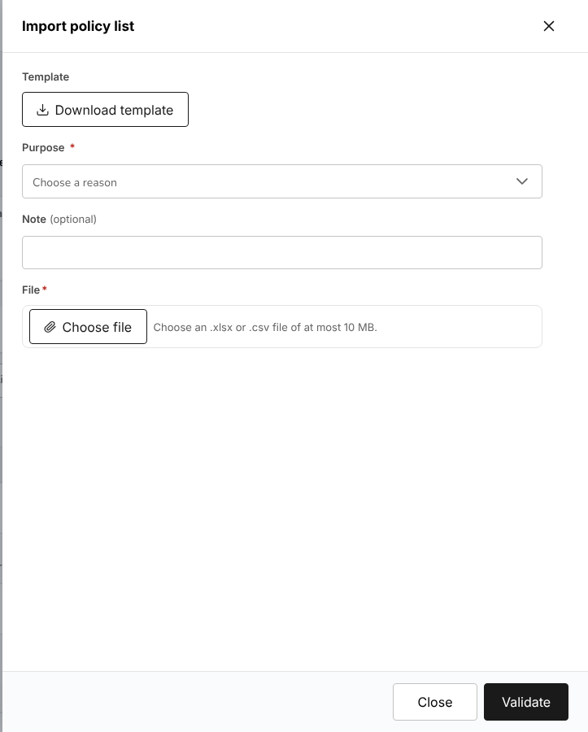
#### The remittance page {#remittance-record}
Select a remittance number to open its page. The header shows the number, status, insurer, product line, basis,
coverage week, due date and source, and the steps **Created**, **Submitted**, **Approved** (or **Returned**),
**Voucher raised** and **Paid**, each with its date and user. Under the header one line says what comes next, or why
you cannot act and who can.

The buttons follow the status and your role: **Submit for approval** for a draft or returned remittance, **Approve**
and **Reject** for an approver who may decide it, **Remind approver** for the user who submitted it. The tabs are
**Lines** (the policies with their totals), **Payment** (the voucher, its payment and value date), **Documents** (the
remittance schedule in XLSX and PDF and, once the voucher is raised, the remittance advice) and **Activity** (the
decisions and the activity log, with **Download log (XLSX)**).

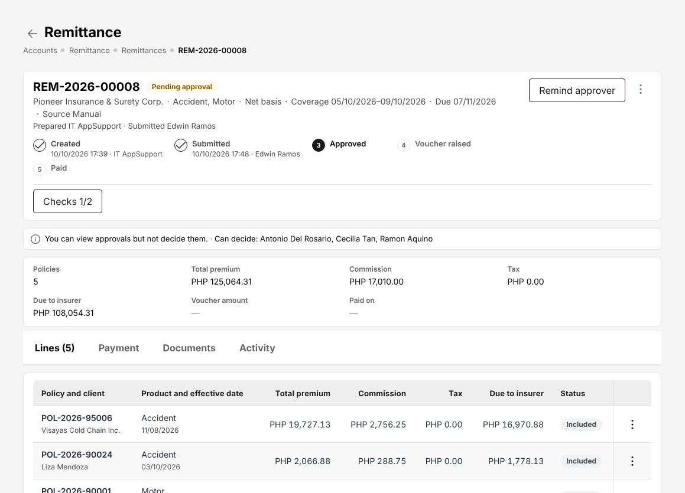
#### Approvals {#remittance-approvals}
**Menu:** Accounts > Remittance > Approvals

| Role | Access |
|---|---|
| CCD-Recon (Reconciliation and Reversals) | Approve |
| TIS Finance & General Accounting | Approve |
| TIS IT AppSupport / Admin | View |
| TIS General Manager | Approve |

The chips at the top say what you may decide, for example **Remittance up to PHP 1,000,000.00**, or **View only**.
As delivered, TIS Finance & General Accounting approves remittances up to PHP 1,000,000.00 and the TIS General
Manager without limit (see the [Authority Matrix (20.10)](#authority-matrix)). A user without a remittance limit cannot
approve or reject. An absent approver is covered by a [Delegation (20.11)](#delegations).

The cards count **Awaiting my decision**, **Past SLA**, **Submitted by me** and **Decided by me today**. The tabs are
**Awaiting my decision**, **Submitted by me** (with the approvers each item waits on, and **Remind approver** in the row
menu), **All pending** (with **Can I decide?**) and **Decided** (the last 30 days).

To decide a remittance:

1. Choose Accounts > Remittance > Approvals, or open the approval from **My Work** or its notification.
2. Select the reference. The review panel shows the remittance and its totals, the previous remittance of the insurer
   with the change in per cent, the checks at submission, the lines, the open exceptions and the activity.
3. Select **Approve** and confirm, or **Reject**, choose the reason from the list and confirm. A rejected remittance
   returns to its maker as **Returned**.

Several items can be approved together: tick them and select **Approve selected (n)**; each is decided on its own and
its result is listed. There is no rejection of several items at once. When you may not decide an item, the panel
says why (you submitted it, it is above your limit, or another user decided it) and shows no buttons.

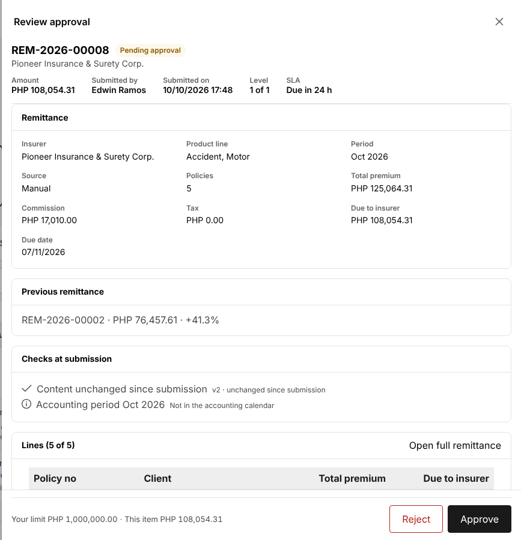
#### Insurer payments {#insurer-payments}
**Menu:** Accounts > Remittance > Insurer payments

| Role | Access |
|---|---|
| CCD-Recon (Reconciliation and Reversals) | Create and edit |
| TIS Finance & General Accounting | Create and edit |
| TIS IT AppSupport / Admin | View |
| TIS General Manager | View |

**Insurer payments** lists the payment vouchers of the approved remittances with their bank payment batch or cheque
and the bank's result. It posts nothing itself: batches are approved and released on
[Bank payment files (18.8)](#bank-payment-files), cheques on [Disbursement (18.7)](#disbursement-payment-vouchers-and-cheques).

The cards and tabs are **To pay**, **In payment**, **Paid** (this week on the card), **Failed** and **All**. Each row
shows the voucher, the insurer with its bank account masked, the amount, method, batch, paid on and the **Next step**
(for example **Submit voucher (Disbursement)**). The row menu starts with **View payment**, then **Open remittance**,
**Open batch**, **Pay by cheque**, **Re-batch** (a failed payment) and **Download advice (PDF)** (a paid one).

To pay insurers by bank file, tick the vouchers to pay (an approved voucher with the insurer's bank account on file)
and select **Create Metrobank batch (n)**. The batch dialog of Bank Payment Files opens with those vouchers and the
Metrobank layout; check the value date and select **Create batch with n payments**, then submit the batch on
[Bank payment files (18.8)](#bank-payment-files). A voucher still in draft shows **Submit voucher (Disbursement)** as its next
step and cannot be ticked.

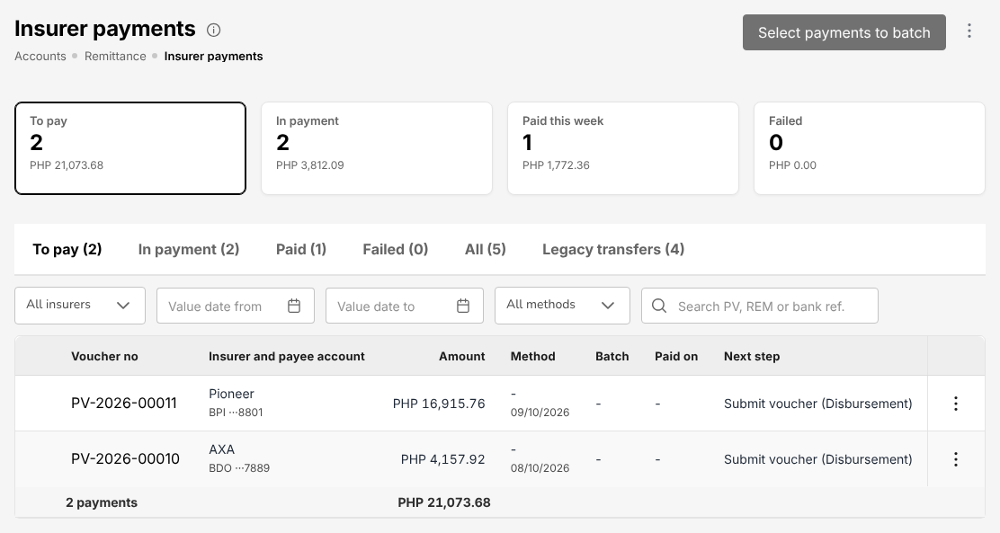
#### Exceptions {#remittance-exceptions}
**Menu:** Accounts > Remittance > Exceptions

| Role | Access |
|---|---|
| TIS Operations Officer | View |
| TIS Operations Unit Head | View |
| CCD-PDC / CCD-ADA | View |
| CCD-BP / QRPh (Receipting) | View |
| CCD-Recon (Reconciliation and Reversals) | Create and edit |
| TIS Finance & General Accounting | Create and edit |
| TIS IT AppSupport / Admin | View |
| TIS General Manager | View |

**Exceptions** lists the differences found on remittances (for example **Amount Mismatch**, **Duplicate Entry**,
**Missing Document**, **Date Discrepancy**) with their severity, amount, age, the user assigned and the status. The
cards **Unresolved**, **In progress**, **Escalated** and **Resolved today** filter the list. The row menu offers
**View**, **Start** (you take it on), **Escalate** (with a reason from the list) and **Resolve** (with the resolution,
the amount if any and a note).

#### Setup: remittance schedules {#remittance-schedules}
**Menu:** Accounts > Remittance > Setup

| Role | Access |
|---|---|
| TIS Finance & General Accounting | Create and edit |
| TIS IT AppSupport / Admin | View |

The weekly schedule **TIS-WEEKLY** runs every Monday at 06:15 for every active insurer and creates one draft per
insurer and product line for the policies of the Monday to Friday before. The **Automation** chip shows whether the
daily remittance job is on; it is **Off** until TISPH switches it on.

The row menu offers **View** (the schedule, its latest runs and its activity log) and, to TIS Finance & General
Accounting: **Edit**, **Preview run** (what a run would create, without creating anything),
**Run now** and **Pause** or **Resume**. **Run now** asks for the off-cycle reason and shows per insurer what will be
created; nothing is created until you select **Create n draft remittances**. A week that has been run cannot be run
again: a later catch-up goes through [Import policy list (18.9.2)](#remittance-import-policy-list).

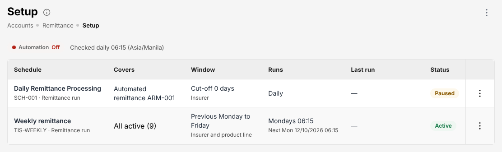
#### Settlement {#remittance-settlement}
**Menu:** Accounts > Remittance > Settlement

| Role | Access |
|---|---|
| TIS Finance & General Accounting | Create and edit |
| TIS IT AppSupport / Admin | View |
| TIS General Manager | View |

An approved remittance is settled with the insurer, and the approved settlement raises the insurer's payment voucher.

1. Choose Accounts > Remittance > Settlement.
2. Choose the **Insurer code** and the period, then select **Add policies** (or **Import**).
3. Select **Calculate**: total premium less commission and tax, plus or minus adjustments, gives the
   **Net Settlement**.
4. Select **Submit for approval**, or **Save draft**.

Another user approves the settlement on [Approvals (18.9.4)](#remittance-approvals). The system then raises the payment voucher
for the net amount on [Disbursement (18.7)](#disbursement-payment-vouchers-and-cheques), and the remittance shows **Settled
(voucher raised)**. The voucher is paid through [Insurer payments (18.9.5)](#insurer-payments).

For a co-insured policy each insurer is remitted its own share. A refund due from an insurer (return premium on premium
already remitted) is netted against its next remittance.

See [Remittance to the insurers (3.8)](#process-remittance) for the order of the steps at TISPH.

### Direct bill: commission debit notes {#direct-bill-commission-debit-notes}
**Menu:** Accounts > Remittance > Insurer billing

| Role | Access |
|---|---|
| TIS Operations Officer | View |
| TIS Operations Unit Head | View |
| CCD-Recon (Reconciliation and Reversals) | Create and edit |
| TIS Finance & General Accounting | Create and edit |
| TIS IT AppSupport / Admin | View |
| TIS General Manager | View |

For a direct-bill policy the client pays the insurer, and TISPH bills the insurer for its commission with a debit note. The cards show the **Unbilled commission**, **Billed, outstanding**, **Overdue** and **Receivable from insurers**. The screen has three tabs:

1. **Raise debit note**: choose the **Insurer** (required), the issue dates (**Issued from**, **Issued to**), **Commission of** and the **Line of business**, and select **Load policies**. Tick the policies to bill: each shows the gross premium, rate, commission, VAT, **Total Due** and EWT. Raise the debit note.
2. **Debit notes**: the debit notes issued, with their balance; record the insurer's payment against them.
3. **Billing mode**: whether each insurer's policies are broker-billed or direct-billed.

A debit note is approved by another user than the one who raised or submitted it; that user reads why instead of
**Approve** and **Reject**. **Reject** and **Cancel debit note** ask for the reason from the list.

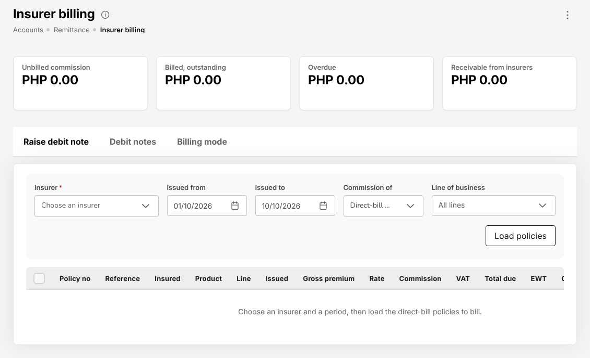
### Journal vouchers {#journal-vouchers}
**Menu:** Accounts > Journal Voucher

| Role | Access |
|---|---|
| TIS Operations Officer | View |
| TIS Operations Unit Head | View |
| TIS Finance & General Accounting | Create and edit |
| TIS IT AppSupport / Admin | View |
| TIS General Manager | View |

**Menu:** Accounts > Correction JV

| Role | Access |
|---|---|
| TIS Finance & General Accounting | Create and edit |
| TIS General Manager | View |

**Menu:** Accounts > Reversal JV

| Role | Access |
|---|---|
| TIS Finance & General Accounting | Create and edit |
| TIS General Manager | View |

**Journal Voucher** lists the manual journals (**Journal Voucher history**) and the **System journals parked for approval**, with **Transaction Code**, **Transaction Number** (JV-YYYY-NNNNN), **Date**, **Description** and **Status** (**Awaiting approval**, **Posted**). **Upload** loads a journal from a file.

To enter a journal, select **Voucher**:

1. Choose the **Transaction Code** (the kind of journal) and enter the **Date** and **Remarks**.
2. Select **Add Data** for each line: **Main A/c**, **Sub A/c**, **Foreign Amount**, **Currency**, **Local Amount**, **Entry** (debit or credit) and **Cost Centre**.
3. Check that **Total Debit** equals **Total credit** (**Net** zero).
4. Select **Submit for approval**.

The journal is approved by TIS Finance & General Accounting other than the user who submitted it, and is posted on approval. A journal cannot be posted into a closed period.

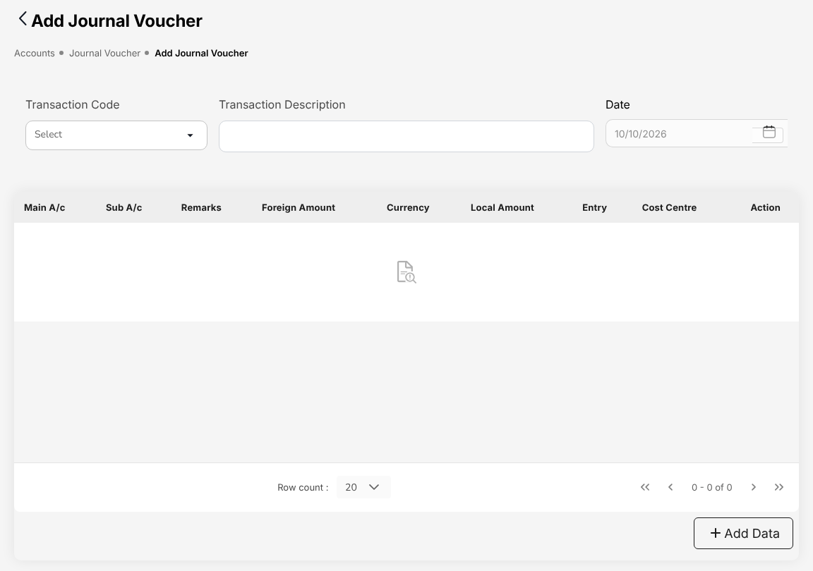
**Correction JV** corrects a posted transaction: choose the **Transaction Code** and **Transaction Number** of the original, the **Corrections JV Transaction Code** and the **Correction Description**, select **Next** and enter the corrected lines. **Reversal JV** reverses a posted transaction in full the same way, with the **Reversal JV Transaction Code** and **Reversal Description**. Both are approved like any journal voucher.

### SAP GL export {#sap-gl-export}
**Menu:** Accounts > SAP GL Export

| Role | Access |
|---|---|
| TIS Finance & General Accounting | Create and edit |
| TIS General Manager | View |

Every day at the cut-off, the journals posted since the previous cut-off are written as the SAP GL header and line files to the SAP pick-up folder. The list shows each **Day**, the period **Posted between**, **Status**, **Journals / lines**, **Debit**, **Credit**, **Started by**, **Warnings** and **Files**. **Run now / re-generate** writes the file of a day again, for example after a correction. Download the files from their row.

### Open entry matching and write-offs {#open-entry-matching-and-write-offs}
Open entry matching settles open debit and credit entries of the same account against each other, for example a receipt against a bill posted without a reference.

**Menu:** Accounts > Open Entry Matching

| Role | Access |
|---|---|
| CCD-Recon (Reconciliation and Reversals) | View |
| TIS Finance & General Accounting | View |
| TIS General Manager | View |

**Menu:** Accounts > Open Entry Unmatching

| Role | Access |
|---|---|
| CCD-Recon (Reconciliation and Reversals) | View |
| TIS Finance & General Accounting | View |
| TIS General Manager | View |

1. Choose Accounts > Open Entry Matching.
2. Enter the **Sub Account Code** (and, if needed, **Division**, **Department**, the analysis codes and **Currency Code**) and select **Pull**, or **Pull By Criteria**.
3. The **Debit Entries** and **Credit Entries** of the account are listed with **Document No**, **Doc Dt**, **Due Dt**, the foreign and local amounts and balances. Tick the entries to match and enter the **Adjustment Amt** of each.
4. If a small difference remains, enter the **Write off Code**, **Write off reason** and **Write off Amount**.
5. Select **Match**.

**Open Entry Unmatching** undoes a match the same way, with **Unmatch**.

### Accounting Query and All Clients Accounting {#accounting-query-and-all-clients-accounting}
**Accounting Query** searches the accounting entries by **Policy ID / Number**, **Client ID**, **Client Name**, **Entry Type**, **Reference Type**, **Status**, **Start Date**, **End Date** and **GL Code**; **Export** downloads the result. **All Clients Accounting** shows, for every client, the number of transactions, total debits, total credits and balance; **Export CSV** downloads it.

**Menu:** Accounts > Accounting Query

| Role | Access |
|---|---|
| TIS Finance & General Accounting | View |
| TIS General Manager | View |

**Menu:** Accounts > All Clients Accounting

| Role | Access |
|---|---|
| TIS Finance & General Accounting | View |
| TIS General Manager | View |

Both screens are read-only. Use them to trace a bill, receipt, remittance or commission line to its journal entries.

### Bank reconciliation {#bank-reconciliation}
**Menu:** Accounts > Bank Reconciliation > Reconciliation Workspace

| Role | Access |
|---|---|
| CCD-PDC / CCD-ADA | View |
| CCD-BP / QRPh (Receipting) | View |
| CCD-Recon (Reconciliation and Reversals) | Create and edit |
| TIS Finance & General Accounting | Approve |
| TIS General Manager | View |

**Menu:** Accounts > Bank Reconciliation > Reconciliations

| Role | Access |
|---|---|
| CCD-PDC / CCD-ADA | View |
| CCD-BP / QRPh (Receipting) | View |
| CCD-Recon (Reconciliation and Reversals) | Create and edit |
| TIS Finance & General Accounting | Approve |
| TIS General Manager | View |

**Menu:** Accounts > Bank Reconciliation > Reconciliation Statement Report

| Role | Access |
|---|---|
| CCD-PDC / CCD-ADA | View |
| CCD-BP / QRPh (Receipting) | View |
| CCD-Recon (Reconciliation and Reversals) | View |
| TIS Finance & General Accounting | View |
| TIS General Manager | View |

**Menu:** Accounts > Bank Reconciliation > Outstanding Cheques

| Role | Access |
|---|---|
| CCD-PDC / CCD-ADA | View |
| CCD-BP / QRPh (Receipting) | View |
| CCD-Recon (Reconciliation and Reversals) | View |
| TIS Finance & General Accounting | View |
| TIS General Manager | View |

**Menu:** Accounts > Bank Reconciliation > Deposits in Transit

| Role | Access |
|---|---|
| CCD-PDC / CCD-ADA | View |
| CCD-BP / QRPh (Receipting) | View |
| CCD-Recon (Reconciliation and Reversals) | View |
| TIS Finance & General Accounting | View |
| TIS General Manager | View |

**Menu:** Accounts > Bank Reconciliation > Unmatched Bank Lines

| Role | Access |
|---|---|
| CCD-PDC / CCD-ADA | View |
| CCD-BP / QRPh (Receipting) | View |
| CCD-Recon (Reconciliation and Reversals) | View |
| TIS Finance & General Accounting | View |
| TIS General Manager | View |

**Menu:** Accounts > Bank Reconciliation > Bank Book

| Role | Access |
|---|---|
| CCD-PDC / CCD-ADA | View |
| CCD-BP / QRPh (Receipting) | View |
| CCD-Recon (Reconciliation and Reversals) | View |
| TIS Finance & General Accounting | View |
| TIS General Manager | View |

The **Reconciliation Workspace** reconciles one bank account for one period:

1. Choose the **Bank account** and the **Period**.
2. Select **Import statement** and load the bank statement file (in the format of the bank, see [Accounting masters (20.17)](#finance-masters-kept-by-accounting)).
3. Select **Auto-match**: statement lines and book entries with the same amount and reference are matched.
4. Match the remaining lines by hand: tick a bank line and the book entries it settles. A bank line with no book entry (bank charges, interest) is flagged and booked with a journal.
5. Select **Stale cheques** to list cheques outstanding too long.
6. When the **Difference** is zero (**Adjusted balances agree**), select **Start reconciliation** and submit it.

The cards show the **Balance per bank**, **Balance per books**, **Unmatched bank lines**, **Unmatched book entries**, **Difference** and the status of the **Reconciliation**. The reconciliation is prepared by CCD-Recon (Reconciliation and Reversals) or TIS Finance & General Accounting and approved by TIS Finance & General Accounting, a user other than the preparer.

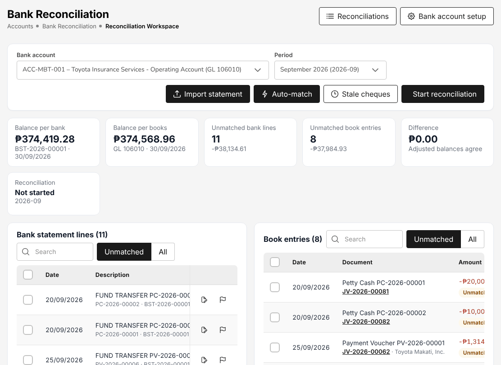
**Reconciliations** lists the reconciliations with **Reconciliation No.**, **Bank account**, **Period**, **Status**, the adjusted bank and book balances, **Difference**, **Prepared by** and **Approved by**. **New reconciliation** starts one.

The five reports (**Reconciliation Statement Report**, **Outstanding Cheques**, **Deposits in Transit**, **Unmatched Bank Lines**, **Bank Book**) are run like any report: choose the criteria (**Overall** or by bank account), **From Date** and **To Date**, the **Bank Account** and the **File format** (**CSV**, **Excel (XLSX)** or **PDF**), then **Preview** or **Generate**. See [Reports (chapter 22)](#reports).

### Insurer statement reconciliation {#insurer-statement-reconciliation}
**Menu:** Accounts > Remittance > Reconciliation

| Role | Access |
|---|---|
| CCD-PDC / CCD-ADA | View |
| CCD-BP / QRPh (Receipting) | View |
| CCD-Recon (Reconciliation and Reversals) | Create and edit |
| TIS Finance & General Accounting | Create and edit |
| TIS IT AppSupport / Admin | View |
| TIS General Manager | View |

An insurer's statement (for example a premium remittance confirmation) is matched with what TISPH recorded. The list shows **Number**, **Insurer**, **Statement type**, **Insurer reference**, **Period**, **Lines**, **Matched**, **Gross premium**, **Commission** and **Status**.

1. Select **Import statement**.
2. Choose the **Insurer** and the **Statement type** (required), the **Period from** and **Period to** (required), the **Insurer reference**, the **Tolerance (PHP)** and the **Statement format** (the insurer's own format, else the standard one).
3. Choose the **File (CSV or XLSX)**. **Download template** gives the standard layout.
4. Select **Preview** to check the lines read, then **Import and match**.

Each statement line is matched with the policy, premium and commission recorded; differences within the tolerance match. Open the statement to resolve the lines that differ. The statement is approved by CCD-Recon (Reconciliation and Reversals).

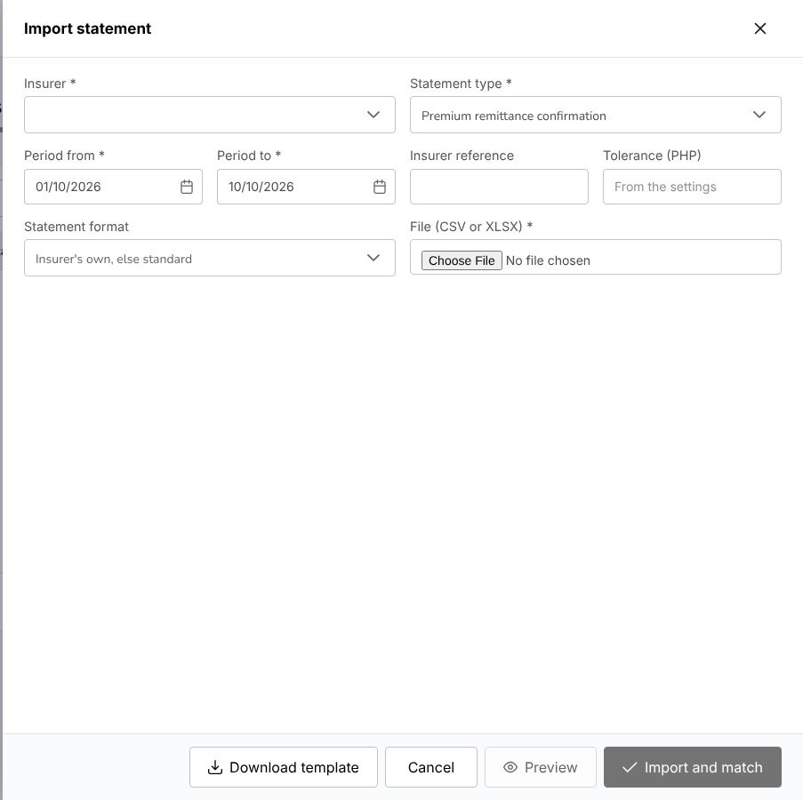
### Tax: BIR forms and returns {#tax-bir-forms-and-returns}
**Menu:** Accounts > Tax > BIR Form 2307

| Role | Access |
|---|---|
| TIS Finance & General Accounting | Create and edit |
| TIS General Manager | View |

**BIR Form 2307** has two tabs: **Issued by us** (the certificates TISPH issues for the tax it withheld from payees: referrers, suppliers) and **Received** (the certificates received from insurers and clients for the tax they withheld from TISPH). Choose the year and the quarter; each row is a payee with its TIN, ATC, income payments and tax withheld. Print a certificate from its row.

The BIR reports are run like any report (criteria, **From Date**, **To Date**, file format, **Preview** or **Generate**):

| Report | Contents |
|---|---|
| **VAT Summary** | Output VAT on the broker's sales and input VAT on purchases, by month |
| **SAWT** | Summary alphalist of the tax withheld from TISPH by its customers (for the income tax return) |
| **QAP** | Quarterly alphalist of payees: the tax TISPH withheld (with the 1601-EQ) |
| **SLSP Sales** | Summary list of sales, by customer (filter by principal insurer) |
| **SLSP Purchases** | Summary list of purchases, by supplier |

### Sales invoices (EOPT Act) {#sales-invoices-eopt-act}
**Menu:** Accounts > Tax > Sales Invoices

| Role | Access |
|---|---|
| TIS Finance & General Accounting | Create and edit |
| TIS General Manager | View |

Under the Ease of Paying Taxes Act (RA 11976, RR 7-2024) the sales invoice is the primary document of the broker's sale of services: commission billed to insurers and fees. The header shows the seller (Toyota Insurance Services Philippines Corporation), its TIN, VAT status, the serial range and whether the **Invoicing setup** is complete; invoices cannot be issued until the ATP or CAS permit number is set up.

The list shows **Invoice no.**, **Invoice date**, **Buyer**, **Invoice for**, **Reference**, **Total sales**, **VAT**, **Total amount due**, **Balance**, **Status** and **EIS**. To issue an invoice by hand, select **New invoice**: **Invoice for** (for example **Fees and other services (manual)**), **Invoice date**, **Buyer type** and **Buyer** (required), **Buyer TIN (with branch code)**, **Buyer business style**, **Buyer address**, the lines (**Description**, **Qty**, **Unit price**, **VAT class**), **Expected withholding** and **Remarks**, then **Issue invoice**. Commission debit notes issue their invoice themselves.

Invoices are numbered in sequence; an invoice is cancelled with a reason and keeps its number, it is never deleted.

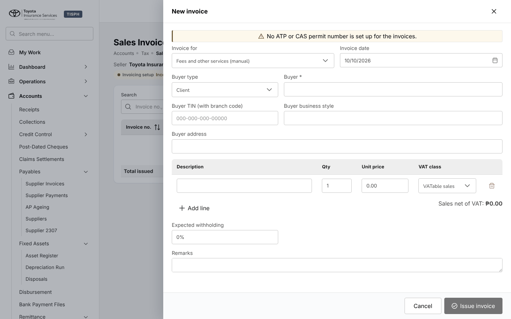
### CAS books and documents {#cas-books-and-documents}
Choose Accounts > Tax > CAS Books and Documents.

**Menu:** Accounts > Tax > CAS Books and Documents

| Role | Access |
|---|---|
| TIS Finance & General Accounting | Approve |
| TIS General Manager | View |

The screen holds the registration pack of the computerized accounting system (CAS). **Readiness** lists the items the BIR registration needs, each **Complete** or **Missing** with its action: taxpayer name, TIN and registered address; RDO code; CAS permit or acknowledgement number and date (**Enter permit**); invoice ATP (**Enter ATP**); backup custodian; system contact person; the approved system description and backup procedure (**Open document**); and the books printed at least once (**Go to books**).

**Documents** holds the system description and controls and the backup and restore procedure, with their approved version; **Open** and **Print**. The books (general journal, general ledger, cash receipts and disbursements books, sales and purchase books) print per month with page numbers that run on through the year.

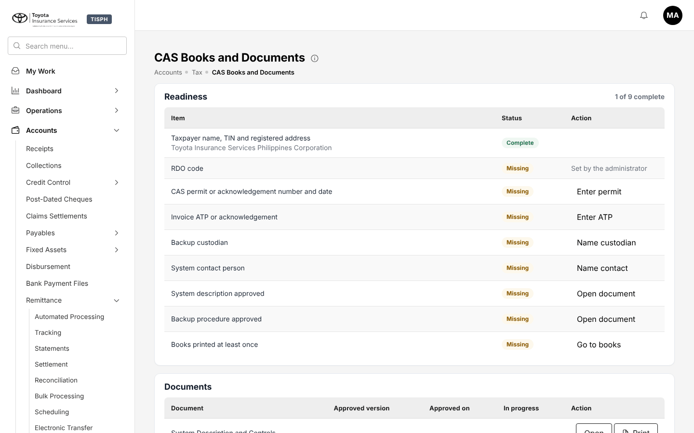
### Period end {#period-end}
A fiscal year (FY2026) has twelve monthly periods and an adjustment period 13 used by the year-end close. The cards count the periods Open, Soft-closed, Closed and Locked.

**Menu:** Accounts > Period End > Period Management

| Role | Access |
|---|---|
| TIS Finance & General Accounting | Approve |
| TIS General Manager | View |

**Menu:** Accounts > Period End > Month-End Close

| Role | Access |
|---|---|
| TIS Finance & General Accounting | Approve |
| TIS General Manager | View |

**Menu:** Accounts > Period End > Financial Statements

| Role | Access |
|---|---|
| TIS Finance & General Accounting | View |
| TIS General Manager | View |

The fiscal year of TISPH runs from April to March. **Period Management** lists the periods of the year chosen with **No.**, **Period**, **Start**, **End**, **Status**, **Close run** and **Last change**, and the actions **Soft-close** and **Close**:

| Status | Postings allowed |
|---|---|
| **Open** | All |
| **Soft-closed** | Only by TIS Finance & General Accounting |
| **Closed** | None; reopened only by TIS Finance & General Accounting |
| **Locked** | None |

**Next fiscal year** creates the next year; **Import opening balances** loads the opening balances (validated first, then imported all or nothing).

**Month-End Close** runs the close of a period:

1. Select **New close run**, choose the **Period** and enter **Remarks**. Select **Start**. The run (MEC-) executes its steps: the accrual journals of the period (reversed on day 1 of the next period), the recurring journals due, the deferral of unearned commission, the foreign exchange revaluation and the checklist.
2. Check the checklist: the automatic checks (for example the sub-ledgers of premium receivable, commission receivable and due to insurers against their control accounts) and sign the manual items. A failed blocking check stops the close; correct it and run the steps again.
3. Submit the run to soft-close or close the period.
4. The run is approved by TIS Finance & General Accounting, a user other than the preparer. The period takes the new status.

**Financial Statements** shows the **Income Statement**, **Balance Sheet** and **Trial Balance** from the posted journals, for a fiscal period or a date range, with the period, year to date and the same columns of the previous year. Select an account to see its postings. **Export** (Excel) and **Print** (PDF).

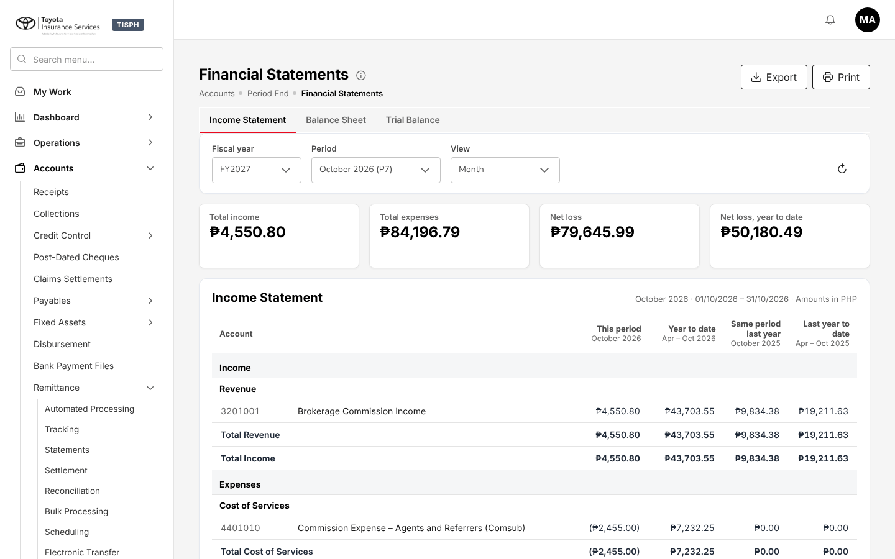
### Year-end close (preparer) {#year-end-close-preparer}
Accounts > Period End > Year-End Close leads through five steps, one card per step; the stepper above the card shows the status of each step. Choose the fiscal year and select **Start year-end close**: the prerequisites are checked at once.

**Menu:** Accounts > Period End > Year-End Close

| Role | Access |
|---|---|
| TIS Finance & General Accounting | Approve |
| TIS General Manager | View |

1. **Prerequisites**: periods 1 to 12 closed, no unposted journals in the year, the suspense account nil, the trial balance balanced at the year end, the closing accounts set up (current year profit and loss, retained earnings) and the previous fiscal year closed. Each shows **Passed**, **Failed** (with a link to correct it) or **Not Applicable**.
2. **Adjustments**: the year-end adjustments are posted in period 13.
3. **Closing entries**: the income and expense accounts are closed to current earnings and retained earnings; the entries are previewed first.
4. **Close**: the close is submitted and approved by TIS Finance & General Accounting, a user other than the preparer.
5. **Opening balances**: the balance sheet accounts open the next fiscal year.

A closed year can be reversed only on a request with a reason, approved by another user.

### Incentives {#incentives}
**Menu:** Accounts > Incentive > My Programs

| Role | Access |
|---|---|
| TIS Sales Associate | View |
| TIS Sales Officer | View |
| TIS Sales Unit Head | View |
| TIS Finance & General Accounting | View |
| TIS General Manager | View |

**Menu:** Accounts > Incentive > Calculations

| Role | Access |
|---|---|
| TIS Sales Unit Head | Approve |
| TIS Finance & General Accounting | View |
| TIS General Manager | View |

**Menu:** Accounts > Incentive > Approvals

| Role | Access |
|---|---|
| TIS Sales Unit Head | Approve |
| TIS Finance & General Accounting | View |
| TIS General Manager | View |

**Menu:** Accounts > Incentive > Statement

| Role | Access |
|---|---|
| TIS Sales Associate | View |
| TIS Sales Officer | View |
| TIS Sales Unit Head | View |
| TIS Finance & General Accounting | View |
| TIS General Manager | View |

**Menu:** Accounts > Incentive > Reports

| Role | Access |
|---|---|
| TIS Sales Unit Head | Create and edit |
| TIS Finance & General Accounting | View |
| TIS General Manager | View |

The incentive screens pay the account executives' incentives earned under the programmes set for them (for example a quarterly motor premium target).

| Screen | What it shows |
|---|---|
| **My Programs** | Your progress in each running programme for its current period: **Target**, **Achieved**, **Achievement**, **Estimated payout** and **Status** (**Running**, **Ended**). |
| **Calculations** | The calculation batches (CALC-YYYY-NNNNN) by period. **New Calculation** runs the calculation of a month for the active programmes; adjust the agent lines and submit the batch for approval. |
| **Approvals** | The batches submitted for approval. A batch is approved or rejected by TIS Sales Unit Head, a user other than the one who ran or submitted it. |
| **Statement** | The earnings of an account executive for a month: the programmes, totals, the trend of the last 13 months and the payments. **Print** and **Export CSV**. |
| **Reports** | The incentive reports (monthly payout summary, agent payout details, target achievement, top performers, programme effectiveness): **Generate report**. |

An approved batch is paid through [Disbursement (18.7)](#disbursement-payment-vouchers-and-cheques); its status becomes **Paid**.

## Screen reference: Dashboards and Commission {#screens-dashboards-and-commission}
The dashboards and the Commission menu.

Each section names the menu of the screen and the roles that open it, with their access. Your own menu shows only the screens of your role.

All dashboards work the same way:

- The selector at the top left switches to another dashboard of your role; the period selector (**This month**, **This year**, a custom range) and the comparison (**Previous period**) set the figures. **Data as of** shows when the figures were read (Asia/Manila time); the refresh button reads them again.
- Each card shows a value, the change against the comparison period and, where a target is set, the target and the status (**On target**, **Off target**). The arrow on a card opens the list behind it.
- Each chart has **Chart** and **Table** views and a download button. **Export Report** downloads the whole dashboard.
- A dashboard shows only the records your role may read.

### Dashboard {#dashboard}
Dashboard > Executive Dashboard is the management view of the business of Toyota Insurance Services Philippines.

**Menu:** Dashboard > Executive Dashboard

| Role | Access |
|---|---|
| TIS Sales Associate | View |
| TIS Sales Officer | View |
| TIS Sales Unit Head | View |
| TIS Operations Associate | View |
| TIS Operations Officer | View |
| TIS Operations Unit Head | View |
| TIS Finance & General Accounting | View |
| TIS IT AppSupport / Admin | View |
| TIS General Manager | View |

The cards show **Total Revenue** and **New Business** against their targets, **Active Policies**, **Claims Rate**, **Retention Rate**, **Premium receivable** (with the overdue amount) and **Commission receivable** (unbilled and overdue). The charts are **Premium written by month** (last 12 months), **Revenue by Product Line**, **Claims Status Distribution**, **Regional Performance** (premium, policies, growth and market share by region) and **Top Performing Products** (premium, policies and claim ratio).

### Claims Dashboard {#claims-dashboard}
Dashboard > Claims Dashboard follows the claims handled by Operations.

**Menu:** Dashboard > Claims Dashboard

| Role | Access |
|---|---|
| TIS Operations Associate | View |
| TIS Operations Officer | View |
| TIS Operations Unit Head | View |
| TIS General Manager | View |

The cards show **Claims reported** (and those reported today), **Total Open Claims**, **Claims Overdue** (past their due date), **Estimated amount** and **Settled amount**. The charts are **Claims Trend Analysis** (claims submitted, approved and rejected by month reported), **Claims by line of business**, **Ageing of open claims** (days since reported), **Claims by stage** and **Claims by Province**. **Recent Claims** lists the latest claims; select one to open it on [The claims list (17.13)](#the-claims-list).

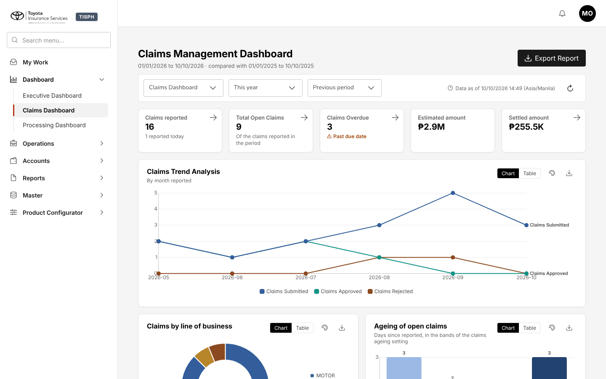
### Processing Dashboard {#processing-dashboard}
Dashboard > Processing Dashboard (the **Processing Workbench**) shows the quotations and placements in flight with Operations.

**Menu:** Dashboard > Processing Dashboard

| Role | Access |
|---|---|
| TIS Operations Associate | View |
| TIS Operations Officer | View |
| TIS Operations Unit Head | View |
| TIS General Manager | View |

The cards show **Newly Received Submissions** (updated in the last 7 days), **Older Submissions** (not updated for more than 7 days: follow them up), **Avg. Cycle Time** (from entry to approval or acceptance), **Unassigned** and **Open Alerts** (duplicates, missing dates, missing line of business). The charts are **Workload Metrics** (submissions per account executive, by stage), **In Progress vs Overdue Tasks** and **Volume by LOB In-flight**. The **Submissions List** shows each quotation with the proposed insured, account executive, sum insured, product, next requirement due, priority and status. **New Submission** starts a quotation.

### Commission to agents and referrers {#commission-to-agents-and-referrers}
The list shows every referrer with **TYPE** (Agent, Sub-agent, External), **LEVEL**, **POLICIES**, **NET PAYABLE (OPEN)**, **WHT TYPE** (Individual 5% or Company 10%), **BANK ACCOUNT** and **STATUS**. The header shows **Due this cycle** and **Ready to pay**.

**Menu:** Commission > Commission Dashboard

| Role | Access |
|---|---|
| TIS Sales Associate | View |
| TIS Sales Officer | View |
| TIS Sales Unit Head | View |
| TIS Finance & General Accounting | Create and edit |
| TIS IT AppSupport / Admin | View |
| TIS General Manager | View |

**Menu:** Commission > Agents/Referrer Accounts

| Role | Access |
|---|---|
| TIS Finance & General Accounting | Create and edit |
| TIS General Manager | View |

The commission paid by TISPH to an agent, sub-agent or external referrer (for example a dealer) on a policy it brought in is computed when the policy is booked, from the commission details of the quotation. Each commission line goes through four statuses:

| Status | Meaning | What the system does |
|---|---|---|
| **Accrued** | The policy is booked | Nothing is posted yet |
| **Eligible** | The client's premium is fully collected | |
| **Approved** | Approved by a user other than the one who prepared it | Posts the accrual: commission expense against commission payable |
| **Paid** | Paid on a payment voucher | Posts the payment: commission payable against cash and withholding tax payable |

A commission line reversed after payment (for example on a cancellation that returns premium) is clawed back from the referrer.

**Commission > Commission Dashboard** has the views **Accounting** and **Management**. The cards show **Brokerage income**, **Comsub (gross)** (the commission due to referrers), **Net margin**, **Outstanding payable** (eligible and approved, net of withholding tax), **WHT withheld (paid)** and **Clawed back**. The charts show the monthly trend of income, payable and margin, the commission by referrer and by product, the payable by status (**Accrued**, **Eligible**, **Approved**, **Paid**) and the brokerage income by insurer.

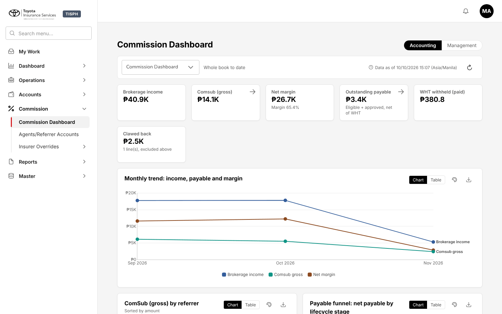
**Commission > Agents/Referrer Accounts** lists the referrers. To pay a referrer:

1. Choose Commission > Agents/Referrer Accounts and select the referrer. The account shows the lines of the current cycle, the future cycles and the past lines.
2. Mark as eligible the accrued lines whose premium is fully collected.
3. Approve the eligible lines. The approval is made by TIS Finance & General Accounting other than the user who prepared the lines.
4. Select the approved lines and generate the payout. The payment voucher is prepared on [Disbursement (18.7)](#disbursement-payment-vouchers-and-cheques) with the withholding tax of the referrer (5% for an individual, 10% for a company, or the referrer's own tax code), and is approved and paid there.

A new referrer is added with its type, level, tax details and bank account; the withholding tax can be switched off for a referrer, which recomputes its unpaid lines.

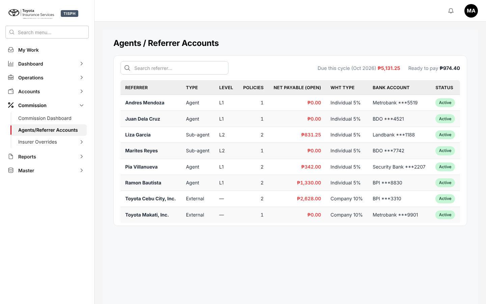
## Screen reference: Master {#screens-master}
The reference masters, users and access, and the system configuration of the Master menu.

Each section names the menu of the screen and the roles that open it, with their access. Your own menu shows only the screens of your role. Most master screens are kept by TIS IT AppSupport / Admin; the finance masters by TIS Finance & General Accounting. A change to access, approval limits, posting rules or account determination applies only after another user approves it.

### Distribution Channels {#distribution-channels}
Choose Master > Insurance > Distribution Channels. A channel is a dealer group or dealer branch, a financing bank or bank branch, or an affinity partner (a company whose members or homeowners are referred to the broker).

**Menu:** Reports > Operational Reports > Dealer Production

| Role | Access |
|---|---|
| TIS Sales Associate | View |
| TIS Sales Officer | View |
| TIS Sales Unit Head | View |
| TIS Operations Associate | View |
| TIS Operations Officer | View |
| TIS Operations Unit Head | View |
| TIS IT AppSupport / Admin | View |
| TIS General Manager | View |

**Menu:** Master > Insurance > Distribution Channels

| Role | Access |
|---|---|
| TIS Sales Associate | View |
| TIS Sales Officer | View |
| TIS Sales Unit Head | View |
| TIS Operations Associate | View |
| TIS Operations Officer | View |
| TIS Operations Unit Head | View |
| TIS IT AppSupport / Admin | Create and edit |
| TIS General Manager | View |

At TISPH the channels are the Toyota dealer groups and their branches (for example Toyota Alabang, Toyota Cebu, Toyota Makati) and Toyota Financial Services with its offices. The list shows **Code**, **Name**, **Channel type**, **Group** (the parent channel), **Referrer**, **Province / City**, **Prospects**, **Policies**, **Premium** and **Status**; filter by channel type and status.

**Add channel** asks for the code, name and channel type, the group it belongs to (its hierarchy), the province and city, the referrer paid for its business (from [Commission to agents and referrers (19.4)](#commission-to-agents-and-referrers)) and, for a financing bank, its mortgagee clause. The pencil changes a channel; a channel with business is deactivated, not deleted.

The channel is chosen on the prospect and drives the lead assignment rules, the dealer programmes and the **Dealer Production** report (Reports > Operational Reports > Dealer Production: premium and policies by channel; see [Reports (chapter 22)](#reports)).

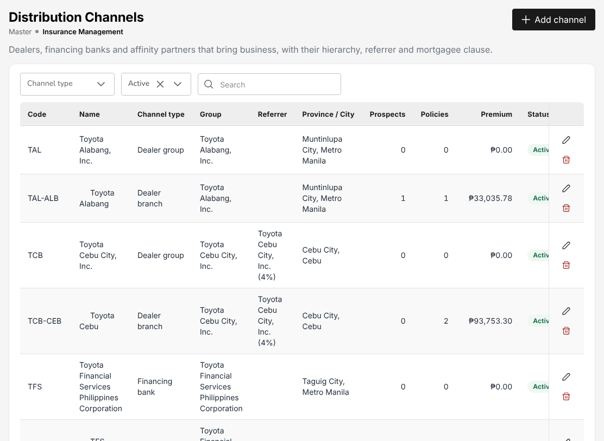
### Company, branches and the letterhead {#company-branches-and-the-letterhead}
Every printed document and report PDF (quotation, request for quotation, placement slip, policy schedule, billing statement, official receipt, payment voucher, debit note, claim letters, BIR forms) carries the letterhead of the company marked as letterhead company.

**Menu:** Master > Organization > Company

| Role | Access |
|---|---|
| TIS IT AppSupport / Admin | Create and edit |

**Menu:** Master > Organization > Branch

| Role | Access |
|---|---|
| TIS IT AppSupport / Admin | Create and edit |

**Company** lists **Company Code**, **Company Name**, **License Number**, **Country**, **Email ID** and **Status**. The company record of Toyota Insurance Services Philippines Corporation holds its legal name, TIN, Insurance Commission licence, address, logo and contacts, and is marked as the letterhead company. **Add** creates a company; the pencil changes it.

**Branch** lists **Branch Code**, **Branch Name**, **Country**, **Email ID** and **Status** (for example the head office and the Cebu branch). The branch is chosen on users, receipts, vouchers and journals.

### Insurance companies {#insurance-companies}
Requests for quotation, placement slips, Preliminary Loss Advices and remittance advices go to the insurer's e-mail. Keep it current.

**Menu:** Master > Insurance > Insurance Company

| Role | Access |
|---|---|
| TIS IT AppSupport / Admin | Create and edit |

The list shows **Company Code**, **Company Name**, **E-mail**, **Phone Number**, **Modified By**, **Modified On**, **Status** and **Actions**. Only the panel insurers of TISPH are **Active**; an inactive insurer is not offered on quotations and placements. **Upload** loads insurers from a file (validated first); **Add** creates one.

The insurer record holds the code, name, address, e-mail and phone of the insurer. Whether an insurer's policies are broker-billed or direct-billed is set on [Direct bill: commission debit notes (18.10)](#direct-bill-commission-debit-notes) (**Billing Mode**); its commission rates on [Commission Rate Matrix (20.16)](#commission-rate-matrix).

### Masters that work the same way {#masters-that-work-the-same-way}
All masters work alike: a list with search, **Add** (the form opens on its own page or as a panel on the right), **Upload** where offered, the eye to view, the pencil to edit and a status switch to deactivate. Records are not deleted; a deactivated record no longer appears in the lists of the other screens.

**Menu:** Master > Insurance > Line of Business

| Role | Access |
|---|---|
| TIS IT AppSupport / Admin | Create and edit |

**Menu:** Master > Insurance > Product

| Role | Access |
|---|---|
| TIS IT AppSupport / Admin | Create and edit |

**Menu:** Master > Insurance > Cover

| Role | Access |
|---|---|
| TIS IT AppSupport / Admin | Create and edit |

**Menu:** Master > Insurance > Signatories

| Role | Access |
|---|---|
| TIS IT AppSupport / Admin | Create and edit |

**Menu:** Master > Insurance > Vehicle

| Role | Access |
|---|---|
| TIS IT AppSupport / Admin | Create and edit |

**Menu:** Master > Location > Country

| Role | Access |
|---|---|
| TIS IT AppSupport / Admin | Create and edit |

**Menu:** Master > Location > Province

| Role | Access |
|---|---|
| TIS IT AppSupport / Admin | Create and edit |

**Menu:** Master > Location > City / Municipality

| Role | Access |
|---|---|
| TIS IT AppSupport / Admin | Create and edit |

**Menu:** Master > Employees > Hierarchy

| Role | Access |
|---|---|
| TIS IT AppSupport / Admin | Create and edit |

**Menu:** Master > Employees > Designation

| Role | Access |
|---|---|
| TIS IT AppSupport / Admin | Create and edit |

**Menu:** Master > Finance > Bank

| Role | Access |
|---|---|
| TIS IT AppSupport / Admin | Create and edit |

| Master | What it holds |
|---|---|
| **Line of Business** | The lines TISPH writes (for example Motor, Accident, Life, Marine), with their code. Only active lines are offered. |
| **Product** | The products of each line: **Product Code**, **Product Name**, **Line of Business**, **Business Type** (for example **Package**), **Customer Segment** (**Retail**, **Corporate**). The rating and covers of a product are kept in the [Product Configurator (chapter 21)](#screens-product-configurator). |
| **Cover** | The covers offered on quotations (for example Own Damage, Acts of Nature, Excess Bodily Injury, Property Damage). |
| **Signatories** | The company signatories printed on documents, with their signature image. |
| **Vehicle** | The vehicle master used by motor quotations: **Vehicle Brand**, **Vehicle Model**, **Vehicle Variant**, code and name. **Upload** loads the Toyota model list. |
| **Country**, **Province**, **City / Municipality** | The address lists. A city or municipality has its province, class (city or municipality) and ZIP code; the local government tax rate is kept on [Other finance masters (20.15)](#finance). |
| **Hierarchy**, **Designation** | The ranks of the sales hierarchy and the job titles of users, by department. |
| **Bank** | The banks: **Bank Code**, **Bank Name**, **Bank Branch**, **SWIFT / BIC Code**, e-mail and phone, used for drawee banks, bank accounts and payee accounts. |

### Claim documents {#claim-documents}
**Menu:** Master > Insurance > Claim Document Checklist

| Role | Access |
|---|---|
| TIS Operations Associate | View |
| TIS Operations Officer | View |
| TIS Operations Unit Head | View |
| TIS IT AppSupport / Admin | Create and edit |

The Claim Document Checklist lists the documents a claim needs, by line of business and claim type: **Code**, **Line of Business** (`*` = all), **Claim Type** (`*` = all), **Document**, **Required**, **Sort Order** and **Status**. When a claim is registered, the documents of its line and cause of loss make the list of its **Documents** step (see [Register a claim (17.13.1)](#register-a-claim)). **Add** adds a document; the switch removes it from new claims.

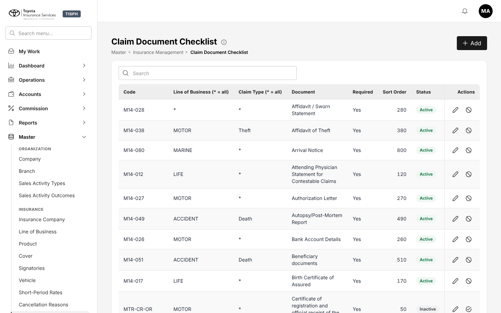
### Lead sources and reason codes {#lead-sources-and-reason-codes}
**Menu:** Master > Insurance > Lead Sources

| Role | Access |
|---|---|
| TIS IT AppSupport / Admin | Create and edit |

**Menu:** Master > Insurance > Reason Codes

| Role | Access |
|---|---|
| TIS IT AppSupport / Admin | Create and edit |

**Lead Sources** lists where prospects come from (for example Walk-In, Referral, Agent, Bundling, Promo, Used-Cars - SCR, Used-Cars - UCFP), with the **Channel Type**, the **Linked Office (branch code)** and the **Sort Order**. The source is chosen on the prospect.

**Reason Codes** holds the coded reasons of decisions, by what they are used for (**Used For**): quotations declined, claims rejected, renewals lost, refunds and adjustments, prospect reassignment, access review removals, the accounting reversals, and the remittance decisions (rejection of a remittance, off-cycle remittance, escalation of a remittance exception, rejection or cancellation of a commission debit note). **Requires Note** asks the user for a note with the reason. A screen that asks for a reason offers only the codes of its use.

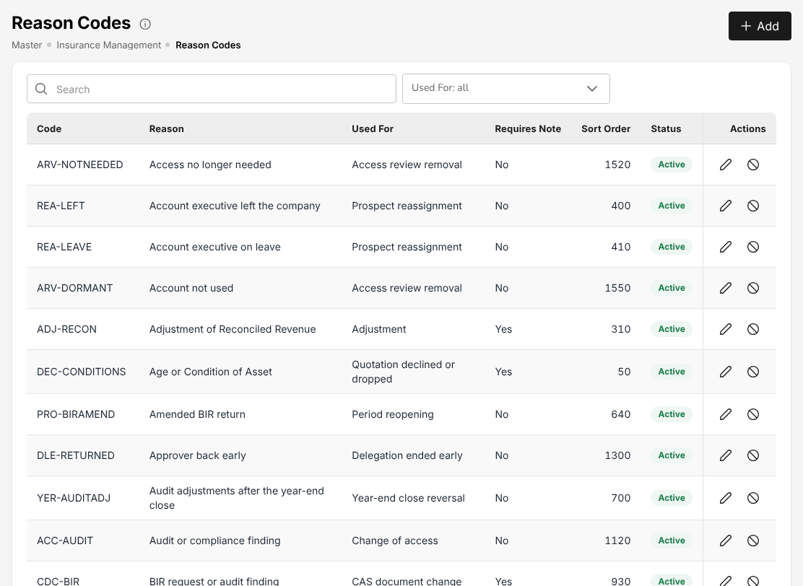
### Users {#users}
A duplicate username is refused. At the first sign-in the user must choose a new password (Getting started).

**Menu:** Master > Users and Access > User

| Role | Access |
|---|---|
| TIS IT AppSupport / Admin | Create and edit |
| TIS General Manager | View |

The **User List** shows **User Name**, **Assigned Role**, **E-mail** (masked), **Display Name**, **Status** and **Actions** (view, edit, and the account actions **Unlock**, **Reset password**, **Turn off two-step verification** and **Sign-in history**). **Add** creates a user: username, e-mail, display name, branch, designation, reporting line and the TISPH role, grouped by department. The status switch deactivates a leaver.

The steps are in [Create a user account (15.7.1)](#tis-it-appsupport-admin-create-user) and [Unlock an account or reset a password (15.7.2)](#tis-it-appsupport-admin-account-actions). An administrator cannot change his or her own account or roles.

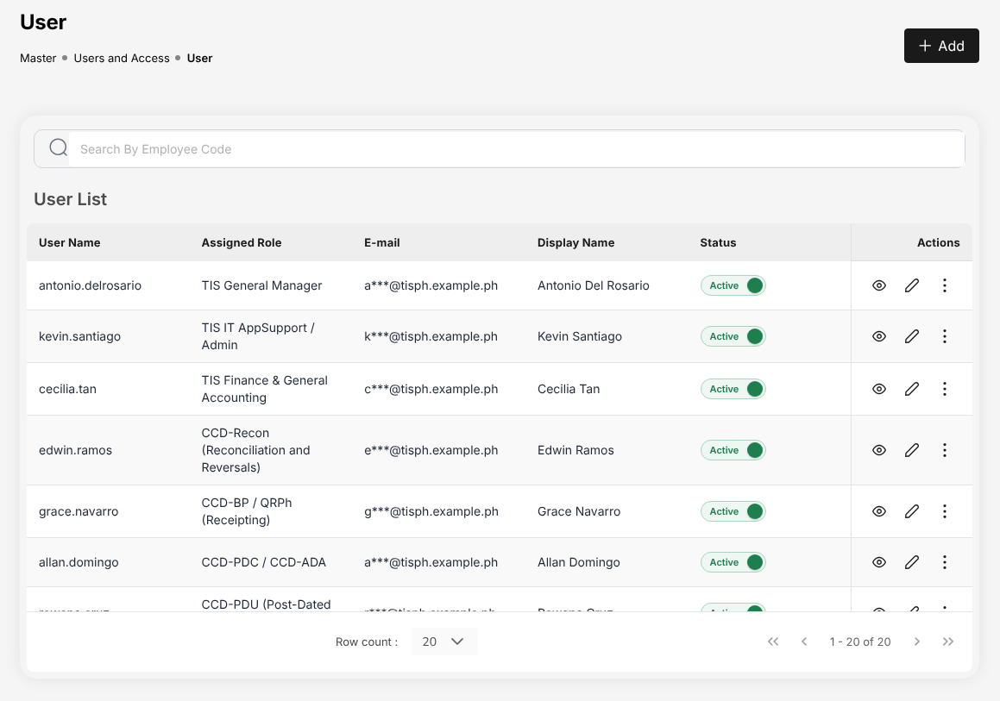
### Roles and role permissions {#roles-and-role-permissions}
**Menu:** Master > Users and Access > Role

| Role | Access |
|---|---|
| TIS IT AppSupport / Admin | Create and edit |
| TIS General Manager | View |

**Menu:** Master > Users and Access > Role Permissions

| Role | Access |
|---|---|
| TIS IT AppSupport / Admin | Create and edit |
| TIS General Manager | View |

**Role** lists the 13 TISPH roles with **Role Code**, **Role Name**, **Department**, **Modified By**, **Modified On** and **Status**. The roles are delivered with the system; their names and departments are those of this manual's role chapters.

**Role Permissions** shows what each role may do, by part of the system: **By role** (each role's access to each screen: view, create and edit, approve) and **Compare roles** (two or more roles side by side). A change of a role's permissions waits in **Waiting for approval** and applies once another administrator approves it. **Export to Excel** downloads the permissions.

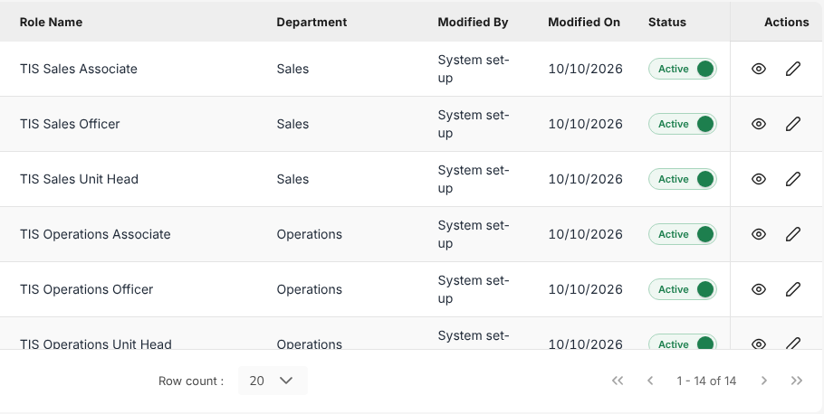
### User Access Matrix {#user-access-matrix}
**Menu:** Master > Users and Access > User Access Matrix

| Role | Access |
|---|---|
| TIS IT AppSupport / Admin | Create and edit |
| TIS General Manager | View |

The User Access Matrix shows who has access to what, for audit. The cards count the **Active users**, the **Dormant** users (no sign-in for 90 days or more), the **Duty conflicts**, the users with **No two-step sign-in** and the **Changes pending**. Each row shows the user, department, roles, branch, status, **Last sign-in**, **Two-step**, **Password age (days)** and the **Segregation of duties** conflicts. Filter by department, role and status; **Export to Excel** downloads the matrix.

### Authority Matrix {#authority-matrix}
**Menu:** Master > Users and Access > Authority Matrix

| Role | Access |
|---|---|
| TIS IT AppSupport / Admin | Approve |
| TIS General Manager | View |

The Authority Matrix sets the largest amount (or percent) each role may approve per transaction: claim settlement approval, payment voucher and cheque release, journal voucher approval, remittance approval, remittance settlement, adjustment and transfer, and the others. Each transaction is a row, each approver role a column, grouped by department.

- **Limits**: the limits in force. A cell **Not set** means no limit is recorded; whether an approver without a limit may approve is shown above the table.
- **Pending approval**: changes waiting for another administrator.
- **Personal limits**: a limit for one user that differs from the role's.
- **History**: every change, with who requested and who approved it.

**Download** and **Upload** exchange the matrix as a file. A change applies after another administrator approves it.

### Delegations {#delegations}
A delegation lets another user approve with the limit of an approver who is away, for chosen transactions and dates. It applies once another administrator who may approve access changes approves it; neither the requester nor the person covering approves it.

**Menu:** Master > Users and Access > Delegations

| Role | Access |
|---|---|
| TIS IT AppSupport / Admin | Approve |

The cards count the delegations **Current and upcoming**, **Waiting for approval** and **Ended**. Each row shows the **Approver away**, **Covered by**, **Transactions**, **Period** and **Status**. **New delegation**: choose the approver, the person covering, the transactions (or all) and the dates, and save. **Export to Excel** downloads the list.

### Segregation of Duties {#segregation-of-duties}
**Menu:** Master > Users and Access > Segregation of Duties

| Role | Access |
|---|---|
| TIS IT AppSupport / Admin | Approve |
| TIS General Manager | View |

A segregation-of-duties rule names roles or permissions one person should not hold together (for example preparing and approving payments). **Block** refuses the combination when the roles are given; **Warn** allows it and lists the person under **Conflicts** until an exception is accepted.

The cards count the **Users with conflicts**, the **Accepted exceptions**, the **Exceptions ending in 30 days** and the **Active rules**. The tabs are **Conflicts** (each user with the roles held and the rule broken; accept an exception with a reason and an end date), **Rules** (**New rule**) and **Waiting for approval**. Rules and exceptions apply after another administrator approves them. The rules that apply to each role are listed in its role chapter, under Segregation of duties.

### Access Reviews {#access-reviews}
Confirm at least every quarter that each active user still needs his or her access.

**Menu:** Master > Users and Access > Access Reviews

| Role | Access |
|---|---|
| TIS IT AppSupport / Admin | Approve |

1. Select **Start a review** and choose the scope (all users, a department) and the due date.
2. For each user, confirm the access or mark the roles to remove, with a reason from the reason codes.
3. Submit the review. The removals apply when another administrator signs the review off.

The list shows **Review**, **Scope**, **Due**, **Progress**, **Removals**, **Status**, **Started by** and **Signed off by**. **Export to Excel** downloads a review as audit evidence.

### Posting configuration {#posting-configuration-configuration-approvals-posting-rules-account-determination}
**Menu:** Master > Finance > Account Determination

| Role | Access |
|---|---|
| TIS Finance & General Accounting | Approve |

**Menu:** Master > Finance > Posting Rules

| Role | Access |
|---|---|
| TIS Finance & General Accounting | Approve |

**Menu:** Master > Finance > Configuration Approvals

| Role | Access |
|---|---|
| TIS Finance & General Accounting | Approve |

**Menu:** Master > Finance > Accounting Flow

| Role | Access |
|---|---|
| TIS Finance & General Accounting | View |

These four screens decide how every business event is posted to the general ledger. They are kept by TIS Finance & General Accounting; a change is approved by TIS Finance & General Accounting, a user other than the one who requested it.

- **Account Determination** gives each account role its general ledger account, by tab (**Premium**, **Customer**, **Miscellaneous**, **Claims**, **Other**, **Payee & payment mode**, **Commission taxes**, **Write-off reasons**), and shows which events use it. For example the brokerage commission income goes to 3201001 Brokerage Commission Income. VAT, DST and LGT on premium are booked in their own accounts.
- **Posting Rules** lists the business events (policy issued, endorsement, renewal, cancellation, premium collection, remittance, direct bill commission, claims, commission) with the version of the rule in force. Open a rule to see its lines (debit or credit, account role, amount); a change creates a new version.
- **Configuration Approvals** lists the changes waiting: what changes, before and after, who requested it and when. **Approve** or **Reject** with a reason.
- **Accounting Flow** is read only: the journal each business event posts with the rules and accounts in force today, grouped (premium billing, collections, remittance to insurers, commission, claims). It shows whether the account mapping is complete. **Export** and **Print** give it for audit.

### Other finance masters {#finance}
**Menu:** Master > Finance > Premium Taxes & LGU Rates

| Role | Access |
|---|---|
| TIS Finance & General Accounting | View |
| TIS IT AppSupport / Admin | Create and edit |

**Menu:** Master > Finance > Transaction Code

| Role | Access |
|---|---|
| TIS IT AppSupport / Admin | Create and edit |

**Menu:** Master > Finance > Currency

| Role | Access |
|---|---|
| TIS IT AppSupport / Admin | Create and edit |

| Master | What it holds |
|---|---|
| **Package Bundles** | Products sold together with a bundle discount, for example TFS Borrower Protect (Credit Life - Compulsory with the borrower's Personal Accident). |
| **Insurer Rate Tables** | Each insurer's rate for a package product: **Rate basis** (percent or per mille of sum insured), **Rate**, **Minimum premium**, **Deductible**, **Key benefits**, **Commission** and the effective dates. [Quick Quote (17.2)](#quick-quote) prices from these rates. |
| **Premium Taxes & LGU Rates** | The local government tax rate of each city or municipality, the tax and charge rules (DST, VAT, LGT) and a **Calculator** to check the taxes of a premium. |
| **Payment Gateways** | The online payment gateway for the client payment links (GCash, Maya, GrabPay, cards): enabled or not, mode, payment methods, who absorbs the fee, link validity and the bank account credited. The merchant keys are kept on the server, never on this screen. |
| **Transaction Code** | The accounting transaction codes: **CM** Credit Memo, **DM** Debit Memo, **JV** Journal Voucher, **OR** Official Receipt, **PV** Payment Voucher, **RM** Remittance to Insurer, with their basis (debit, credit, both). |
| **Currency**, **Exchange Rate** | The currencies (PHP is the base currency) and the monthly exchange rates to PHP, used by foreign currency receipts and the revaluation of the month-end close. |

### Commission Rate Matrix {#commission-rate-matrix}
**Menu:** Master > Finance > Commission Rate Matrix

| Role | Access |
|---|---|
| TIS IT AppSupport / Admin | Create and edit |

The Commission Rate Matrix sets the broker's commission rate that applies to a placement. Each row gives an **Insurer**, **Product**, **Line of business**, **Policy type** (new business or renewal), **Rate (%)**, **Effective from**, **Effective to** and **Applies at**. The rate is chosen in this order: insurer and product, insurer and line of business, insurer, product, line of business; an exact policy type before **Any**; then the insurer's default rate and the system default. With no row, the insurers' default rates apply.

**Add rate** adds a row. **Test rate** finds the rate that would apply to a placement of an insurer, product, line of business, policy type and date.

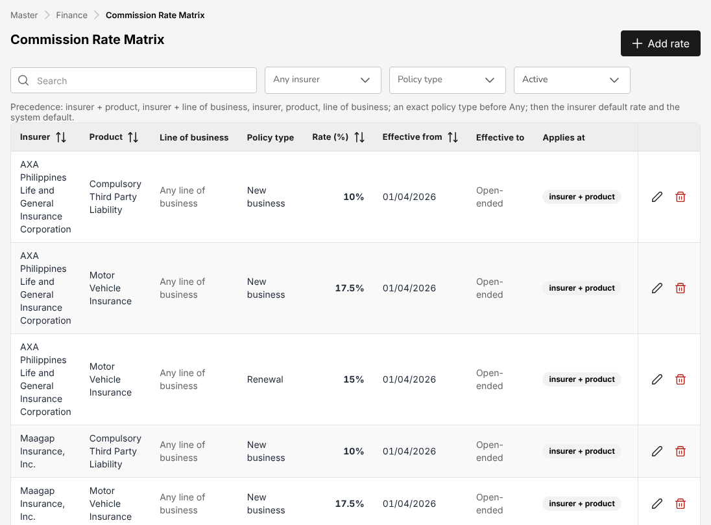
### Accounting masters {#finance-masters-kept-by-accounting}
**Menu:** Master > Finance > Taxation

| Role | Access |
|---|---|
| TIS Finance & General Accounting | View |

**Menu:** Master > Finance > Close Checklist

| Role | Access |
|---|---|
| TIS Finance & General Accounting | View |

**Menu:** Master > Finance > Bank Statement Formats

| Role | Access |
|---|---|
| TIS Finance & General Accounting | View |

**Menu:** Master > Finance > Bank Transaction Types

| Role | Access |
|---|---|
| TIS Finance & General Accounting | View |

**Menu:** Master > Finance > Insurer Statement Formats

| Role | Access |
|---|---|
| TIS Finance & General Accounting | View |

| Master | What it holds |
|---|---|
| **Taxation** | The tax codes: **Code**, **Tax type** (VAT, expanded withholding tax), **ATC**, **Description**, **Rate**, **GL account**, **Applies to** (sales, purchases, both) and **Effective from**. For example VAT12-OUT output VAT 12% on brokerage commission and fees, and the EWT codes WC158, WC160, WC100. |
| **Close Checklist** | The items of the month-end close: **Order**, **Code**, **Item**, **Type** (**Automatic** or manual), **Severity** (blocking or warning). For example no unposted journals in the period, trial balance balanced, suspense account cleared, no unapplied receipts. |
| **Bank Statement Formats** | How each bank's statement file is read: columns, date format, debit and credit or signed amounts (for example the BDO and BPI exports). |
| **Bank Transaction Types** | The bank lines with no book entry (bank charges, interest income, final tax on interest): direction, the account they post to, whether they need approval and the description pattern that recognises them on the statement. |
| **Insurer Statement Formats** | How each insurer's statement file is read; the standard format applies to any insurer without its own. |

### Operational masters {#operational-masters}
**Menu:** Master > Finance > Cost Centres

| Role | Access |
|---|---|
| TIS Finance & General Accounting | View |

**Asset Classes** gives each class of fixed asset its **Useful Life (months)**, **Asset Account**, **Accumulated Depreciation Account** and **Depreciation Expense Account** (for example Computer equipment, 36 months). **Cost Centres** lists the cost centres of journal lines with the company, department and responsible person; the default cost centre (900901 Toyota Insurance Services) goes on journal lines that name none.

### Bank file layouts and payee bank accounts {#bank-file-layouts-and-payee-bank-accounts}
Master > Finance > Bank File Layouts says how each bank's upload file is written and how its status file is read. The system is delivered with starter layouts for BDO, BPI, Metrobank, Landbank and UnionBank and a generic CSV. **The starter layouts are examples: each must be validated against the bank's current file specification, and a test file accepted by the bank, during onboarding.** They are marked **Test mode** until changed.

**Menu:** Master > Finance > Bank File Layouts

| Role | Access |
|---|---|
| TIS Finance & General Accounting | View |

The tab **Layouts** lists **Code**, **Name**, **Bank**, **Payment channels** (bulk credit, InstaPay, PESONet), **File format** (delimited or fixed width) and **Status**. **New layout** defines the header, detail and trailer records of a file and how the bank's status file is read. The tab **Payee bank accounts** holds the bank accounts of the payees (insurers, referrers, suppliers, claimants) used by [Bank payment files (18.8)](#bank-payment-files).

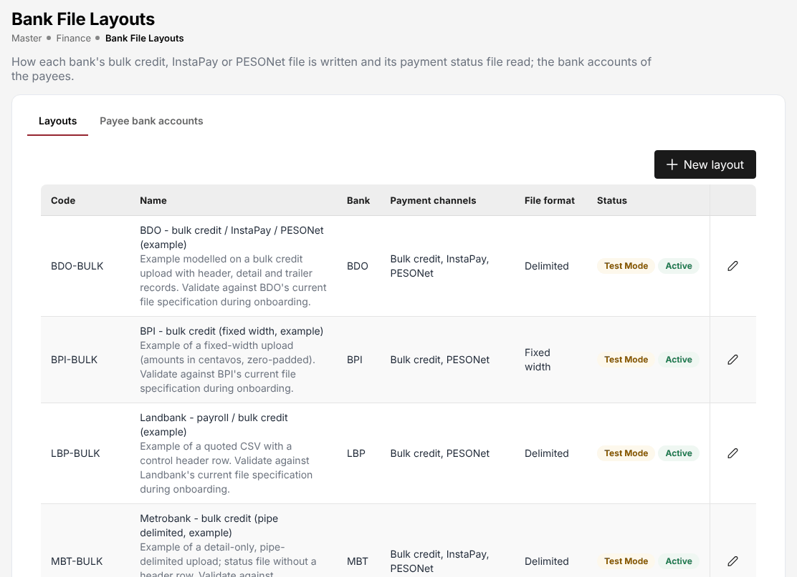
### E-mail Layout {#e-mail-layout}
**Menu:** Master > System > E-mail Layout

| Role | Access |
|---|---|
| TIS IT AppSupport / Admin | Create and edit |

Every e-mail the system sends (quotation links, notices, receipts, reminders, debit notes) uses this layout, with the logo and the details of the primary company. Choose whether e-mails are sent in the branded layout, the header background and text colours, the line under the header, the logo in the header and the footer (company name, address, licence and TIN). **Show a sample e-mail** previews it; **Save** applies it; **Discard changes** returns to the saved layout.

### Documents and Reports Layout {#documents-and-reports-layout}
Master > System > **Documents and Reports Layout** sets how every printed document (quotation, policy schedule, slips, endorsement, receipts, billing statements, vouchers, debit notes, claim letters) and every report PDF or Excel file is printed, together with the logo, legal name, TIN, licence and address of the primary company (Master > Organization > Company).

**Menu:** Master > System > Documents and Reports Layout

| Role | Access |
|---|---|
| TIS IT AppSupport / Admin | Create and edit |

Set the print colours (accent, titles and section headings, section heading band, table header and its text; the contrast ratio is shown for each), the logo height on documents and the other print settings. **Sample document** previews a document; **Save** applies the layout to every document printed afterwards.

### Document Signatures {#document-signatures}
**Menu:** Master > System > Document Signatures

| Role | Access |
|---|---|
| TIS IT AppSupport / Admin | Create and edit |

For each document (for example the policy schedule), the signature slots: **Slot**, **Label**, **Signed by** (a company signatory of Master > Insurance > Signatories, the default signatory, or the user who issued the document, whose signature is kept in My Profile) and **Prints** (for example **Once the document is issued**). **Add slot** adds a slot; **Save** applies the change.

### Configuration {#configuration}
**Menu:** Master > System > Configuration

| Role | Access |
|---|---|
| TIS IT AppSupport / Admin | Create and edit |

Configuration holds the settings of the system, grouped in cards: **Company & Branding**, **Sales, Quotations & Placement**, **Policies, Endorsements & Renewals**, **Claims**, **Billing, Collections & Credit**, **Remittance & Reconciliation**, **Commission & Incentives**, **Accounting & Tax**, **Notifications & E-mail** and the others. Each card shows the number of its settings. Open a card to see and change its settings; the search box finds a setting by its name or description (for example VAT, renewal notice, password).

A setting changes the behaviour of the system for everyone (for example the quotation validity, the renewal notice days, the grace period). Change a setting only on a decision of the business owner; every change is recorded in the [Audit Trail (20.26)](#audit-trail).

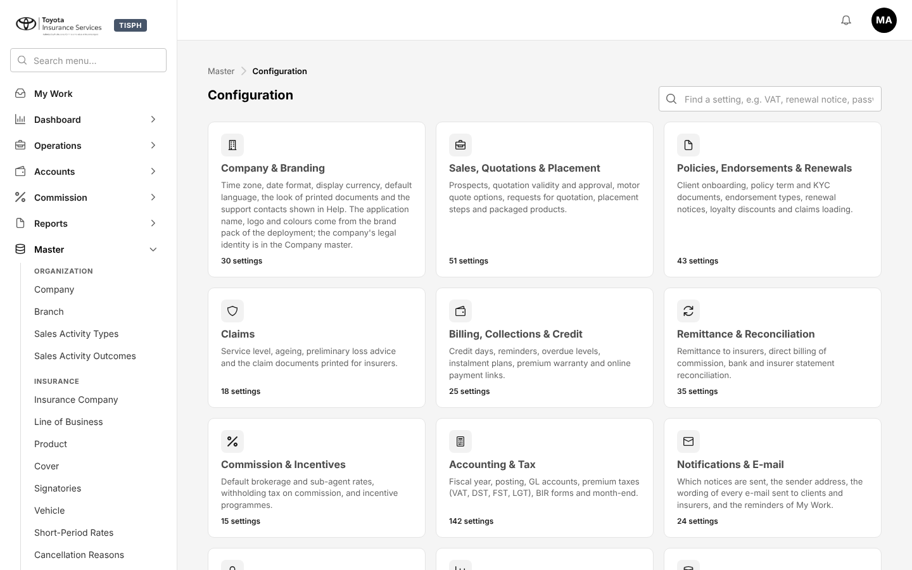
### Document Numbering {#document-numbering}
Every number the system issues comes from a series on Master > Document Numbering: prospect, request for quotation, quotation, placement slip, policy, client, bill, official receipt, payment voucher, journal voucher, claim, endorsement, debit note, close run, reconciliation, BIR Form 2307 and the others. The list shows each series with module, prefix, format, counter reset, last number and next number.

**Menu:** Master > System > Document Numbering

| Role | Access |
|---|---|
| TIS IT AppSupport / Admin | Create and edit |

The usual format is the prefix, the year and a sequence (for example OR-2026-00001), reset every year. Filter by module and status. A number already issued is never issued again; a change to a series applies to the next number.

### Schedules {#schedules}
**Menu:** Master > System > Schedules

| Role | Access |
|---|---|
| TIS Finance & General Accounting | View |
| TIS IT AppSupport / Admin | Create and edit |

Schedules lists the jobs the system runs by itself: **Job**, **What it does**, **Schedule (Asia/Manila)**, **Status** (**Scheduled** or **Switched off**), **Next run**, **Last run** and **Last status**. Among them: bank reconciliation auto-match, month-end close reminder, recurring journals, accrual auto-reversal, period auto soft-close, My Work reminders, the e-invoicing outbox, the remittance schedules and the prospect reassignment queue.

The actions of a job are **Run now** (the play button), the run history and the pencil to change its schedule or switch it on or off. Check the last status of the jobs every morning.

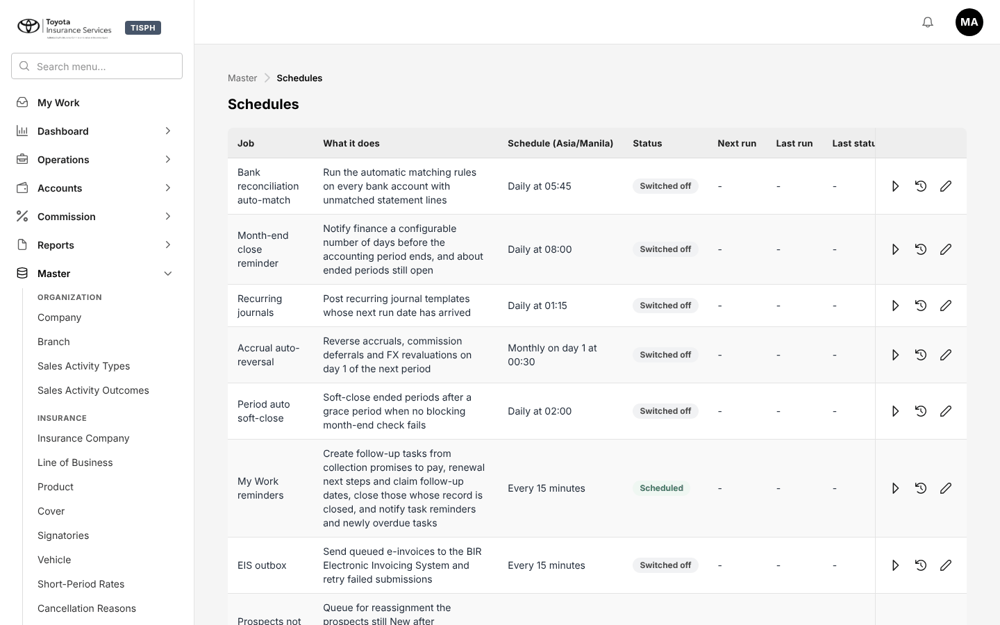
### Audit Trail {#audit-trail}
The history of a single record (claim history, policy and client **History** tab, quotation **Audit Trail** tab, master records) uses the same layout as a timeline grouped by day, newest first, with a search box, a user filter, a filter by kind of event (created, status changes and approvals, other changes, cancelled or removed) and **Export**.

**Menu:** Master > System > Audit Trail

| Role | Access |
|---|---|
| TIS Finance & General Accounting | View |
| TIS IT AppSupport / Admin | View |
| TIS General Manager | View |

Master > System > Audit Trail shows every change made in the system: **Date & Time**, **User** (with the role), **Record**, **Event**, **Changes** (each field with its value before and after) and **Source** (screen, sign-in, file upload, scheduled job). Filter by user, record type and action; **Export** downloads the result.

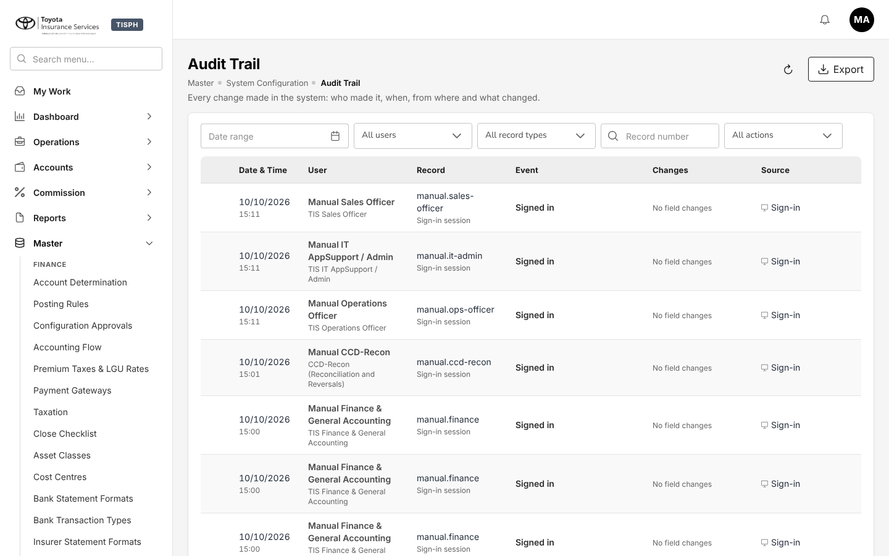
### Features & Releases {#features-and-releases}
**Menu:** Master > System > Features & Releases

| Role | Access |
|---|---|
| TIS IT AppSupport / Admin | View |
| TIS General Manager | View |

Master > System > Features & Releases lists every function of the system with its release: **Phase 1** (the TISPH scope, always on), **Platform** (users, configuration, audit and jobs, always on), **Phase 2** and **Future release** (available on request). Each line shows the **Tier**, the **Status** (Enabled, Read-only or Not enabled), the **Requirement IDs**, the **Enabled On** date, **Enabled By** (the system supplier) and the **Release Reference** of the change that enabled it. **Decision pending** marks a function whose release TISPH still has to confirm; open the line to read the question.

The tab **Future releases** lists the functions TISPH can ask for, with their description. **Export to Excel** downloads both lists.

The screen is read only. Phase 2 and future-release functions are enabled by the platform administrator of the system supplier under a signed change request, approved by a second platform administrator; IT AppSupport / Admin and the General Manager receive an e-mail and a notification when a function is enabled or disabled. A function disabled while it holds records stays **Read-only**: its records can be viewed and exported, not changed. An address of a function that is not enabled shows **Not available in this edition**.

### E-mail Outbox {#e-mail-outbox}
**Menu:** Master > System > E-mail Outbox

| Role | Access |
|---|---|
| TIS IT AppSupport / Admin | Create and edit |

The E-mail Outbox lists every e-mail the system sent or tried to send: **Status** (queued, sent, failed), **To**, **Subject**, **Record**, **Attachments**, **Attempts**, **Last error**, **Created** and **Sent**. When sending is not set up, the screen says so and queued e-mails stay here. **Refresh** reads the list again; the **Last error** of a failed e-mail says why it was not delivered.

### Integrations {#integrations}
**Menu:** Master > System > Integrations

| Role | Access |
|---|---|
| TIS IT AppSupport / Admin | Create and edit |

Integrations lists the connections to the SMS gateways, the CTPL authentication provider, the LTO, the insurers' systems and the banks. The tab **Connectors** shows each connector's **Type**, **Mode** (test or live), whether its **Credentials** are set, the **Messages** waiting, failed and sent today, and the **Last success** and **Last failure**. The tabs **Outbox** and **Inbox** list the messages sent and received. **Send due messages** sends the waiting messages at once. The credentials themselves are kept on the server, never on this screen.

## Screen reference: Product Configurator {#screens-product-configurator}
The screens of the Product Configurator: products, covers, rating, acceptance rules, documents and the mapping to insurers.

Each section names the menu of the screen and the roles that open it, with their access. Your own menu shows only the screens of your role. The products are configured by TIS IT AppSupport / Admin on the request of the business; the other roles that open these screens can view them.

A product is configured as a **product template**. Only the template marked **In use** for a product is applied by the business screens: its covers, rating factors, acceptance rules, insurer market and document templates take effect on quotations, requests for quotation, placements and printed documents. The other templates are kept as drafts, inactive or retired versions. Each screen below filters by **Template**, **Line of business** and **Status**, and shows for each row its template and product and whether the template is in use.

### Product Configurator dashboard {#product-configurator-dashboard}
**Menu:** Product Configurator > Dashboard

| Role | Access |
|---|---|
| TIS Sales Associate | View |
| TIS Sales Officer | View |
| TIS Sales Unit Head | View |
| TIS Operations Associate | View |
| TIS Operations Officer | View |
| TIS Operations Unit Head | View |
| TIS IT AppSupport / Admin | Create and edit |
| TIS General Manager | View |

The dashboard shows the **Active Products**, the **Acceptance rules in force**, the **Total Premium** and the **Avg Loss Ratio** (weighted by premium), and three tabs: **Product Templates** (the list of templates, as on [Product Templates (21.2)](#product-templates)), **Performance Analytics** and **Quick Actions** (shortcuts to the other screens). **Create New Product** starts a new template.

### Product Templates {#product-templates}
**Menu:** Product Configurator > Product Templates

| Role | Access |
|---|---|
| TIS Sales Associate | View |
| TIS Sales Officer | View |
| TIS Sales Unit Head | View |
| TIS Operations Associate | View |
| TIS Operations Officer | View |
| TIS Operations Unit Head | View |
| TIS IT AppSupport / Admin | Create and edit |
| TIS General Manager | View |

The list shows **Template Code**, **Product Name**, **Product**, **Line of Business**, **Version**, **Status** (**Draft**, **Active**, **Inactive**, **Retired**) and **In use**. At TISPH the templates in use are those of the products sold: for example the motor template that prices the motor quotations (Motor Insurance Basic Plan) and the personal accident and travel templates. Templates of lines TISPH does not write stay inactive.

To create a template, select **Create Template**: enter the code, the product name, the product of [Masters that work the same way (20.4)](#masters-that-work-the-same-way) it configures, the line of business and the version, then add its covers, rating factors, acceptance rules, insurers and documents on the other screens. The pencil changes a template; the **In use** mark decides which template the business screens apply to the product. A change to a template in use applies to the quotations priced afterwards.

### Coverage Builder {#coverage-builder}
**Menu:** Product Configurator > Coverage Builder

| Role | Access |
|---|---|
| TIS IT AppSupport / Admin | Create and edit |

The Coverage Builder holds the covers of each template: **Code**, **Coverage Name**, **Template / product**, **Type** (**Mandatory** or optional), **Deductible**, **Priced on quotation as** and **Status**. A mandatory cover is always included in a quotation of the product; an optional cover is ticked on the quotation (see [Create a motor quotation (17.4.1)](#create-a-motor-quotation)).

For the covers quoted, the deductible and main exclusions are printed as cover terms on the quotation slip and the policy schedule. The premiums of the motor covers are priced on the quotation screens with the motor tariff of the template. **Add Coverage** adds a cover: code, name, template, type, deductible, the cover it is priced as and its exclusions.

### Rating Engine {#rating-engine}
**Menu:** Product Configurator > Rating Engine

| Role | Access |
|---|---|
| TIS IT AppSupport / Admin | Create and edit |

Rating factors adjust the net premium of a quotation of the template in use. Each factor has a **Factor Code** and **Factor Name** (for example Vehicle Age, Driver Age, NCB (No Claim Bonus)), what it **Rates on** (vehicle age in years, driver age, claim-free years), a **Type** and its **Bands**:

| Type | Effect |
|---|---|
| **Multiplicative** | The factor of the band the risk falls in multiplies the premium |
| **Discount** | The factor reduces the premium |
| **Additive** | A percentage is added to the premium |

**Add Factor** adds a factor with its bands (from, to, factor). **Test a risk** enters a sample risk and shows the factors that apply and the premium they give, before the template is used.

### Acceptance Rules {#acceptance-rules}
**Menu:** Product Configurator > Acceptance Rules

| Role | Access |
|---|---|
| TIS IT AppSupport / Admin | Create and edit |

Acceptance rules are the insurers' underwriting guidelines. They are checked when a quotation is priced or saved, when a request for quotation approaches an insurer and when a placement is created. Each rule has a **Rule** code and name, the **Template / product**, the **Insurer** (one insurer, or all), a **Condition** on the risk details, an **Outcome** and the **Authority Level**:

| Outcome | What happens |
|---|---|
| **Auto-accept** | The risk passes when the condition holds; otherwise it is referred (or declined) |
| **Refer** | The quotation is held until a user of the authority role approves it within his or her limit of the [Authority Matrix (20.10)](#authority-matrix) (underwriting referral approval) |
| **Decline** | The risk is refused with the rule's message |
| **Apply loading** | The loading (for example 15%) is added to the net premium |

The risk details the rules check are asked on the quotation (for example the fair market value of the vehicle, the claims in the last 3 years, the driver's date of birth). **Add Rule** adds a rule; **Test a risk** shows which rules a sample risk triggers.

### Document Manager {#document-manager}
**Menu:** Product Configurator > Document Manager

| Role | Access |
|---|---|
| TIS IT AppSupport / Admin | Create and edit |

The Document Manager holds the document templates of each product template, printed from the policy and quotation screens and attached to e-mails: **Document**, **Template / product**, **Printed as** (policy schedule, quotation slip, CTPL certificate, member enrolment form), **Stage** (quotation, policy issuance), **Layout** and **Status**.

Without an upload the standard layout is printed. To use TISPH's own layout, select **Add document template** (or edit a row) and upload the layout: a text file with merge fields. **Merge fields** lists the fields that can be placed in a layout (client, policy, vehicle, covers, premium, signature slots of [Document Signatures (20.22)](#document-signatures)).

### Market Mapping {#market-mapping}
**Menu:** Product Configurator > Market Mapping

| Role | Access |
|---|---|
| TIS IT AppSupport / Admin | Create and edit |

Market Mapping lists the insurers that offer each product: **Template / product**, **Insurer**, **Insurer Code** (the product's code at the insurer), **Agreed comm. % (ref.)**, **Target**, **YTD Performance** (premium of the policies issued this year, against the target) and **Status**. Only the insurers on a product's market can be approached on a request for quotation. The agreed commission here is a reference; the commission applied comes from the [Commission Rate Matrix (20.16)](#commission-rate-matrix). **Map Product** adds an insurer to a product.

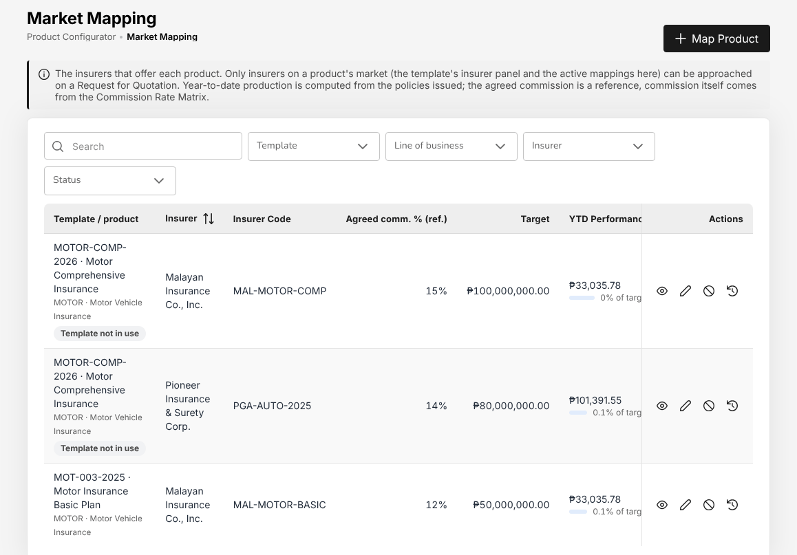
### Risk Mapping {#risk-mapping}
**Menu:** Product Configurator > Risk Mapping

| Role | Access |
|---|---|
| TIS IT AppSupport / Admin | Create and edit |

Risk Mapping lists the risk definitions of the products: **Product**, **Definition** (for example vehicle details for motor, liability cover fields for CTPL), **Risk Sections**, **Used by** and **Status**. The definitions are kept for reference; the risk details of a motor quotation are those of the quotation screens.

## Reports {#reports}
Reports open from the Reports menu. Each role sees the reports of its department, and a report shows only the records
the role may read.

### All Reports and the report menus {#reports-catalogue}
**Menu:** Reports > All Reports

| Role | Access |
|---|---|
| TIS Sales Associate | View |
| TIS Sales Officer | View |
| TIS Sales Unit Head | View |
| TIS Operations Associate | View |
| TIS Operations Officer | View |
| TIS Operations Unit Head | View |
| CCD-PDU (Post-Dated Cheques) | View |
| CCD-PDC / CCD-ADA | View |
| CCD-BP / QRPh (Receipting) | View |
| CCD-Recon (Reconciliation and Reversals) | View |
| TIS Finance & General Accounting | View |
| TIS IT AppSupport / Admin | View |
| TIS General Manager | View |

**Menu:** Reports > Operational Reports > Production

| Role | Access |
|---|---|
| TIS Sales Associate | View |
| TIS Sales Officer | View |
| TIS Sales Unit Head | View |
| TIS Operations Associate | View |
| TIS Operations Officer | View |
| TIS Operations Unit Head | View |
| TIS IT AppSupport / Admin | View |
| TIS General Manager | View |

**Menu:** Reports > Financial Reports > SOA/Premium Receivable

| Role | Access |
|---|---|
| CCD-PDU (Post-Dated Cheques) | View |
| CCD-PDC / CCD-ADA | View |
| CCD-BP / QRPh (Receipting) | View |
| CCD-Recon (Reconciliation and Reversals) | View |
| TIS Finance & General Accounting | View |
| TIS IT AppSupport / Admin | View |
| TIS General Manager | View |

**Menu:** Reports > Financial Reports > Collection Report

| Role | Access |
|---|---|
| CCD-PDU (Post-Dated Cheques) | View |
| CCD-PDC / CCD-ADA | View |
| CCD-BP / QRPh (Receipting) | View |
| CCD-Recon (Reconciliation and Reversals) | View |
| TIS Finance & General Accounting | View |
| TIS IT AppSupport / Admin | View |
| TIS General Manager | View |

**Menu:** Reports > Operational Reports > Claims

| Role | Access |
|---|---|
| TIS Sales Associate | View |
| TIS Sales Officer | View |
| TIS Sales Unit Head | View |
| TIS Operations Associate | View |
| TIS Operations Officer | View |
| TIS Operations Unit Head | View |
| TIS IT AppSupport / Admin | View |
| TIS General Manager | View |

**Menu:** Reports > Operational Reports > Renewal

| Role | Access |
|---|---|
| TIS Sales Associate | View |
| TIS Sales Officer | View |
| TIS Sales Unit Head | View |
| TIS Operations Associate | View |
| TIS Operations Officer | View |
| TIS Operations Unit Head | View |
| TIS IT AppSupport / Admin | View |
| TIS General Manager | View |

**Menu:** Reports > Operational Reports > Remittance

| Role | Access |
|---|---|
| TIS Sales Associate | View |
| TIS Sales Officer | View |
| TIS Sales Unit Head | View |
| TIS Operations Associate | View |
| TIS Operations Officer | View |
| TIS Operations Unit Head | View |
| TIS Finance & General Accounting | View |
| TIS IT AppSupport / Admin | View |
| TIS General Manager | View |

**Menu:** Reports > Operational Reports > Broker Commission

| Role | Access |
|---|---|
| TIS Sales Associate | View |
| TIS Sales Officer | View |
| TIS Sales Unit Head | View |
| TIS Operations Associate | View |
| TIS Operations Officer | View |
| TIS Operations Unit Head | View |
| TIS Finance & General Accounting | View |
| TIS IT AppSupport / Admin | View |
| TIS General Manager | View |

**Menu:** Reports > Financial Reports > Payables

| Role | Access |
|---|---|
| TIS Finance & General Accounting | View |
| TIS IT AppSupport / Admin | View |
| TIS General Manager | View |

**Menu:** Reports > Financial Reports > Journal

| Role | Access |
|---|---|
| TIS Finance & General Accounting | View |
| TIS IT AppSupport / Admin | View |
| TIS General Manager | View |

**Menu:** Reports > Financial Reports > Trial Balance

| Role | Access |
|---|---|
| TIS Finance & General Accounting | View |
| TIS IT AppSupport / Admin | View |
| TIS General Manager | View |

**Menu:** Reports > Financial Reports > Income Statement

| Role | Access |
|---|---|
| TIS Finance & General Accounting | View |
| TIS IT AppSupport / Admin | View |
| TIS General Manager | View |

**Menu:** Reports > Financial Reports > Balance Sheet

| Role | Access |
|---|---|
| TIS Finance & General Accounting | View |
| TIS IT AppSupport / Admin | View |
| TIS General Manager | View |

**Menu:** Reports > Financial Reports > Trial Balance Movement

| Role | Access |
|---|---|
| TIS Finance & General Accounting | View |
| TIS IT AppSupport / Admin | View |
| TIS General Manager | View |

**Menu:** Reports > Financial Reports > General Ledger Detail

| Role | Access |
|---|---|
| TIS Finance & General Accounting | View |
| TIS IT AppSupport / Admin | View |
| TIS General Manager | View |

**Menu:** Reports > Financial Reports > Aged Payables to Insurers

| Role | Access |
|---|---|
| TIS Finance & General Accounting | View |
| TIS IT AppSupport / Admin | View |
| TIS General Manager | View |

**Menu:** Reports > Financial Reports > Month-End Close Status

| Role | Access |
|---|---|
| TIS Finance & General Accounting | View |
| TIS IT AppSupport / Admin | View |
| TIS General Manager | View |

Reports > All Reports shows the reports your role may run, as cards grouped under **Operational Reports** and **Financial Reports**, each with its description. The search box finds a report by name. The same reports open from the menus **Reports > Operational Reports** and **Reports > Financial Reports**; the bank reconciliation and BIR reports also open from their Accounts menus.

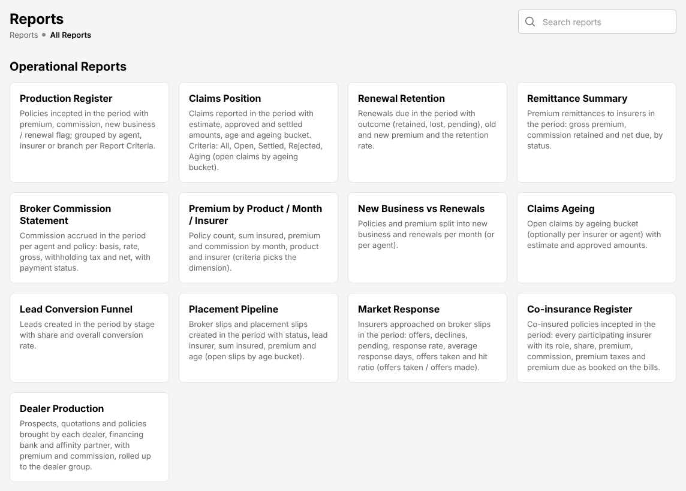
#### Run a report {#reports-run}
1. Choose Reports > All Reports and select the report (or choose it from the report menu).
2. In **Report Criteria**, choose how the report is grouped or which part it shows, for example **Overall**, by **Agent**, **Branch** or **Principal Insurer**; **Summary** or **Detailed**; **Open**, **Partial**, **Settled**, **Rejected**, **Cancelled**, **Aging** or by **Claim Type** for the claims reports.
3. Enter **From Date** and **To Date** (required). Most reports take the records of the period; the ageing and balance reports are computed as of the **To Date**.
4. Narrow the report with the other filters if needed: **Agent**, **Branch**, **Client**, **Status**, **Company (principal insurer)**, **Product**, **Bank Account**, **GL Account**. A filter marked "Used with criteria" applies only with the criteria of that name.
5. Choose the **File format**: **CSV**, **Excel (XLSX)** or **PDF**.
6. Select **Preview** to see the rows on screen, or **Generate** to download the file.

The PDF and Excel files are printed in the layout of [Documents and Reports Layout (20.21)](#documents-and-reports-layout), with the letterhead of Toyota Insurance Services Philippines. Amounts are in pesos.

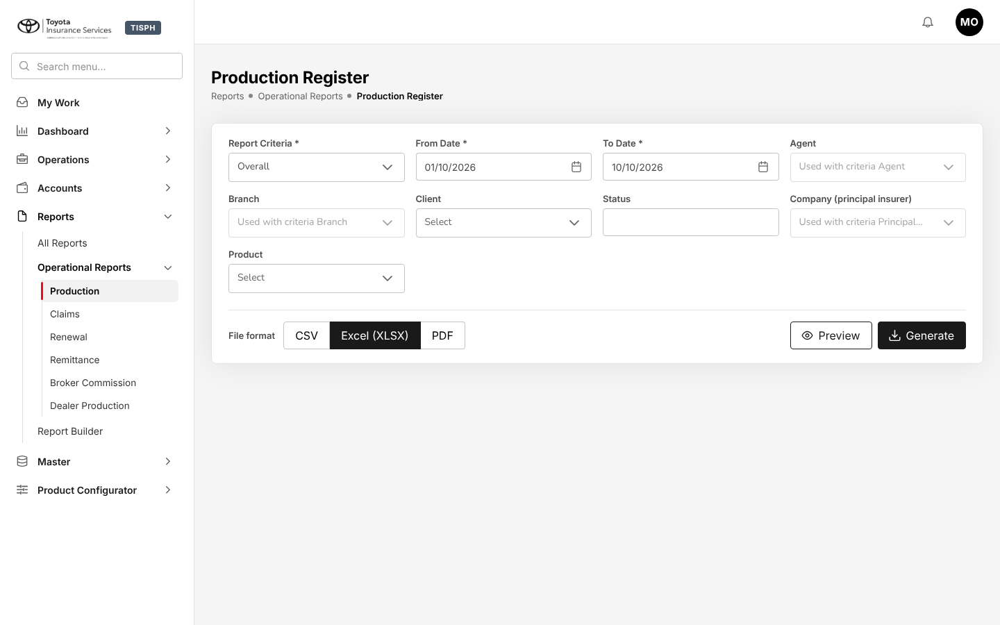
#### Export and keep a report {#reports-export}
- **Excel (XLSX)** keeps the columns as numbers and dates, for further analysis.
- **CSV** is the format to load into another system, and the format of the BIR alphalists from which the BIR DAT files are prepared.
- **PDF** is the format to file or send.

Every list screen of the system also has its own export (**Export**, **Export to Excel**, **Generate Report**) for the rows it shows with the filters chosen.

There is no scheduled or e-mailed report in the TISPH menus: run the reports when you need them, for example at the month-end close.

#### The reports of each department {#reports-by-department}
**Sales** (TIS Sales Associate, TIS Sales Officer, TIS Sales Unit Head):

| Report | Contents |
|---|---|
| **Production Register** | Policies incepted in the period with premium, commission and the new business or renewal flag; grouped by agent, insurer or branch |
| **Lead Conversion Funnel** | Prospects created in the period by stage, with the share and the overall conversion rate |
| **Placement Pipeline** | Requests for quotation and placement slips created in the period with status, lead insurer, sum insured, premium and age |
| **Market Response** | Insurers approached on requests for quotation: offers, declines, pending, response rate, average response days and hit ratio |
| **Dealer Production** | Prospects, quotations and policies brought by each dealer, financing bank and affinity partner, with premium and commission, rolled up to the dealer group |
| **Renewal Retention** | Renewals due in the period with their outcome (retained, lost, pending), old and new premium and the retention rate |
| **New Business vs Renewals** | Policies and premium split into new business and renewals per month (or per agent) |
| **Premium by Product / Month / Insurer** | Policy count, sum insured, premium and commission by month, product or insurer |
| **SOA / Premium Receivable**, **Receivables Ageing** | The premium bills with their balance and ageing |
| **Incentive Results** | The incentive programme results: target, achieved, achievement and payout per agent |

**Operations** (TIS Operations Associate, TIS Operations Officer, TIS Operations Unit Head): the operational reports above, and

| Report | Contents |
|---|---|
| **Claims Position** | Claims reported in the period with claim type, line, estimate, insurer offer, approved and settled amounts, requirements received, follow-up date, settlement date, age and ageing bucket; filter by insurer, product, agent, branch or client |
| **Settled Claims** | Claims settled in the period by settlement date, overall, by principal insurer or by claim type, with the estimate, insurer offer, approved and settled amounts (Reports > All Reports) |
| **Claims Ageing** | Open claims by ageing bucket (optionally per insurer or agent) with estimate and approved amounts |
| **Co-insurance Register** | Co-insured policies incepted in the period: each participating insurer with its role, share, premium, commission, premium taxes and premium due |
| **Remittance Summary**, **Broker Commission Statement** | The remittances and the commission of the period, for information |

**Cash Control** (CCD-PDU (Post-Dated Cheques), CCD-PDC / CCD-ADA, CCD-BP / QRPh (Receipting), CCD-Recon (Reconciliation and Reversals)):

| Report | Contents |
|---|---|
| **SOA / Premium Receivable** | The statement of account: premium bills issued in the period with amount, paid, balance, age and ageing bucket as of the To Date |
| **Collection Report** | Bills due in the period with the amount billed, collected (receipts posted up to the To Date), balance and collection rate |
| **Receivables Ageing** | Outstanding premium receivables as of the To Date by ageing bucket |
| **Receipts Register** | Official receipts of the period with bill, policy, payment mode, bank and reference |
| **Bank Reconciliation Statement**, **Outstanding Cheques**, **Deposits in Transit**, **Unmatched Bank Lines**, **Bank Book** | The bank reconciliation reports; see [Bank reconciliation (18.15)](#bank-reconciliation) |
| **Remittance Summary** | Premium remittances to insurers in the period: gross premium, commission retained and net due, by status |

**Finance and Accounting** (TIS Finance & General Accounting):

| Report | Contents |
|---|---|
| **Remittance Summary**, **Due to Insurers by Co-insurer**, **Aged Payables to Insurers** | The premium due to each insurer: collected, remitted and still held; the open payables aged |
| **Broker Commission Statement**, **Commission Receivable – Direct Bill** | The commission payable to agents and referrers; the commission due from insurers on direct-bill policies |
| **Payables / Disbursement Register** | Payment vouchers raised in the period with approval and payment dates |
| **Journal Register**, **General Ledger Detail** | Journal lines of the period; every movement of an account with its running balance |
| **Trial Balance**, **Trial Balance (Opening / Movement / Closing)** | Per account: opening balance, period debits and credits, closing balance |
| **Income Statement**, **Balance Sheet** | The financial statements for the period and the fiscal year to date, with the prior year |
| **Month-End Close Status** | The periods of the range with their status, the latest close run, failed checks, journals generated and who prepared and approved the close |
| **VAT Summary**, **SAWT**, **QAP**, **SLSP Sales**, **SLSP Purchases** | The BIR working papers; see [Tax: BIR forms and returns (18.17)](#tax-bir-forms-and-returns) |
| Bank reconciliation reports | As for Cash Control |

**Management** (TIS General Manager): every report of the departments above.

The roles that open each report menu, with their access, are listed at the top of this section and in each role chapter.

### Report Builder {#report-builder}
**Menu:** Reports > Report Builder

| Role | Access |
|---|---|
| TIS Sales Associate | View |
| TIS Sales Officer | View |
| TIS Sales Unit Head | View |
| TIS Operations Associate | View |
| TIS Operations Officer | View |
| TIS Operations Unit Head | View |
| TIS Finance & General Accounting | View |

The Report Builder makes a report of your own from a dataset: pick the columns, filters and grouping, run it on screen, export it to Excel, and save it for yourself or share it with roles.

1. Choose Reports > Report Builder. On the **Build** tab, choose a **Dataset**. A dataset shows only the records your role may read.
2. In **Columns**, choose the columns to show.
3. In **Group by**, choose a column to group on: the numeric columns chosen are summed per group. In **Sort by**, choose the sort column and **Ascending** or descending.
4. Select **Add filter** for each condition.
5. Select **Run** to see the result on screen, or **Export to Excel**.
6. Save the report: give it a name and a description, and keep it private or share it with one or more roles.

The tab **Saved reports** lists the reports you may open: your own and those shared with one of your roles, with **Name**, **Dataset**, **Description**, **Owner**, **Shared with** and **Last run**. Open one to run it again or change it.

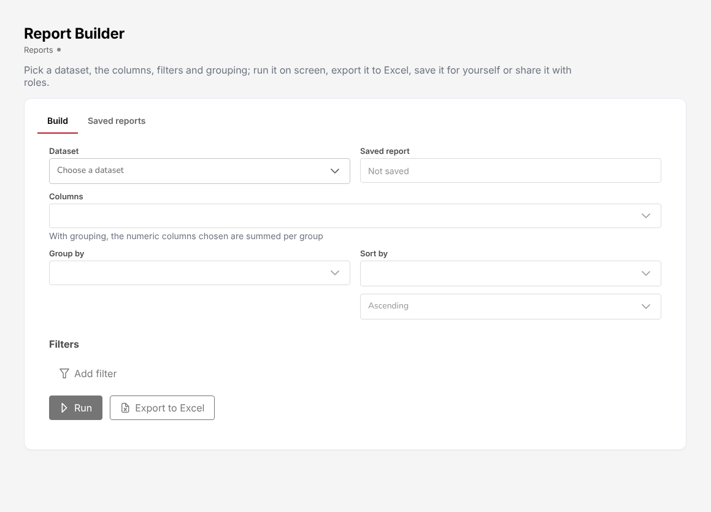
## Glossary {#glossary}
| Term | Meaning |
|---|---|
| Account executive | The TISPH employee who looks after a prospect or client and owns its quotations and renewals. Written in lower case in running text (account executive): it names a person, not a role. |
| ADA | Auto-debit arrangement: the client's bank pays the premium by debit to the client's account. |
| Agency bill | See Broker billed. |
| AP | Accounts payable: the amounts TISPH owes its suppliers. |
| AR | Acknowledgement receipt: the receipt the system issues when a client's payment is recorded on a policy, before Cash Control confirms it with the official receipt. |
| ATC | Alphanumeric tax code of the BIR, which identifies the kind of income on which tax is withheld. |
| ATP | Authority to print: the BIR permit for the series of printed receipts and invoices. |
| Audit trail | The record of every creation, change, approval and sign-in, with the user, the time and the values before and after. |
| Authority Matrix | The largest amount each role may approve per kind of transaction. |
| Bank reconciliation | The matching of the bank statement with the bank book of TISPH. |
| BDO, BPI | Banks of TISPH and its clients: BDO Unibank and the Bank of the Philippine Islands. |
| Billing statement | The statement to a client of the premium due, paid and outstanding. |
| BIR | Bureau of Internal Revenue. |
| BP | Bills payment: premium paid by the client through a bank or a payment centre. |
| Broker billed | The client pays the premium to TISPH, which remits it to the insurer net of commission. Also called agency bill. |
| CAS | Computerized accounting system: the registration of the system with the BIR, with its books and documents. |
| CCD | Cash Control Department of TISPH. |
| Checked against slip | The policy returned by the insurer has been compared with the placement slip and confirmed by a second user. |
| Claim | A request of the insured to the insurer for payment of a loss under a policy. |
| Client | A person or company with at least one policy. |
| CM | Credit memo: a credit to a client's account that is not money received. Transaction code CM on Receipts, used only when TIS Finance & General Accounting asks for it. |
| Co-insurer | An insurer that takes a share of a risk led by another insurer. |
| COC | Certificate of cover of a CTPL policy, authenticated before it is released. |
| Commission | The brokerage the insurer pays TISPH on the premium. |
| Comsub | The label of the referrer commission on the screens (see Referrer commission). |
| Converted | The status of an issued receipt whose lines are all paid and posted. |
| Cover note | Temporary evidence of cover issued while the insurer issues the policy. |
| CTPL | Compulsory third party liability insurance of a motor vehicle, required for its LTO registration. |
| DAIF, DAUD | Reasons a bank returns a cheque: drawn against insufficient funds, drawn against uncollected deposit. |
| Dealer | A Toyota dealer whose vehicle sales bring prospects (dealer leads) and dealer programmes. |
| Delegation | The loan of an approver's approval limit to the person who covers during an absence, for chosen transactions and dates. |
| Direct bill | The client pays the premium directly to the insurer; TISPH bills its commission to the insurer. |
| DST | Documentary stamp tax on the premium. |
| E-mail | Electronic mail. Written e-mail in running text and E-mail at the start of a sentence or a screen label, as on the screens. |
| e-Policy | The issued policy the insurer sends back, recorded against the placement slip. |
| EIS | Electronic Invoicing System of the BIR, to which the sales invoices are reported. |
| Endorsement | A change to a policy during its period: details, cover, period or cancellation, with additional or return premium. |
| EOPT | The Ease of Paying Taxes Act (Republic Act No. 11976), which governs the invoices TISPH issues. |
| EWT | Expanded withholding tax: income tax withheld at source on commission and other payments. |
| Fleet schedule | The list of vehicles insured under one policy of a fleet client. |
| GL | General ledger: the accounts in which every journal is posted. |
| IC | Insurance Commission, the regulator of insurers and insurance agents and brokers. |
| Insurer | An insurance company of the TISPH panel. |
| Insurer statement | The statement of account (SOA) an insurer sends TISPH of premium and commission, reconciled with the records of TISPH. |
| JV | Journal voucher: a journal entered by hand. |
| KPI | Key performance indicator, shown on the dashboards. |
| Lapse | A policy not renewed within the grace period after its expiry. |
| Lead insurer | The insurer that leads a co-insurance and whose terms apply. |
| LGT | Local government tax on the premium, at the rate of the city or municipality. |
| LGU | Local government unit: the city or municipality whose local government tax (LGT) applies to a premium. |
| Line of business | A class of insurance, for example Motor, Personal Accident, Credit Life or Marine. |
| LOB | Line of business. |
| LTO | Land Transportation Office. |
| Maker and checker | The maker enters a record; a different user, the checker, approves it. |
| Marine open cover | A marine cover of a client for all shipments of a period, declared shipment by shipment. |
| Masked value | A personal identifier shown in part only, for example j***@example.ph, to the roles that do not need it in full. |
| MV file number | The motor vehicle file number the LTO gives a vehicle before its plate number is issued. |
| My Work | The first screen after sign-in: the items, approvals and tasks waiting for you. |
| NCB | No-claim bonus: the discount on the motor premium for years without a claim. |
| OR | Official receipt: the receipt registered with the BIR, issued for money received. |
| PCF | Petty cash fund. |
| PDC | Post-dated cheque: a client's cheque received before its date, deposited and receipted on that date. |
| PEP | Politically exposed person, recorded on the client for anti-money laundering checks. |
| Placement slip | The firm order to the insurer to issue cover on the agreed terms. |
| Policy | The insurance contract issued by the insurer, identified by its policy number. |
| Premium payment warranty | The number of days the insurer allows for the payment of the premium. |
| Prospect | A person or company that may become a client. |
| PV | Payment voucher: the document of a payment to a supplier, insurer, referrer or claimant. |
| QAP | Quarterly alphalist of payees: the list of the tax TISPH withheld in a quarter, filed with the BIR Form 1601-EQ. |
| QRPh | The national QR code standard for payments. |
| Quotation | The terms offered to a prospect or client. |
| RDO | Revenue District Office of the BIR. |
| Receipt | The record of a payment received: the official receipt (OR) of Cash Control, or the acknowledgement receipt (AR) the system issues when a payment is recorded on a policy. |
| Referrer commission | The part of the commission TISPH pays to the agent, sub-agent or dealer who referred the business (shown as Comsub on the screens). |
| Remittance | The payment of premium, net of commission, to the insurer. |
| Renewal | The continuation of a policy for a new period. |
| Request for quotation | The request to the insurers for their offers on a risk. |
| SAP | The accounting system of TISPH to which the journals of the day are exported (SAP GL export). |
| SAWT | Summary alphalist of withholding taxes: the tax withheld from TISPH by its customers. |
| SCR, UCFP | Lead sources of TFS for used cars (Used-Cars - SCR, Used-Cars - UCFP), named as TFS names them. |
| Segregation of duties | The rule that one person must not hold roles that should stay apart, for example issuing and reversing receipts. |
| SLA | Service level: the time within which an approval or a task is expected. |
| SLSP | Summary list of sales and purchases, filed with the BIR each quarter. |
| SOA | Statement of account. On screens: Billing statement for a client, insurer statement for an insurer (see Insurer statement reconciliation). |
| Status | The stage a record has reached, shown as a coloured tag, for example Pending, Approved or Rejected. |
| TBA | To be advised: written on a quotation when the plate number is not yet known. |
| TFS | Toyota Financial Services. |
| TIN | Taxpayer identification number. |
| TIS | The prefix of the TISPH role names, for example TIS Sales Officer. The company is written TISPH. |
| TISPH | Toyota Insurance Services Philippines. |
| Two-step verification | A second sign-in step after the password or the Microsoft account: a code from an authenticator app. |
| Underwriting referral | A quotation that an acceptance rule of the product sends to the TIS Operations Unit Head for a decision before it can go to the client. |
| VAT | Value-added tax. |
| WHT | Withholding tax. |
