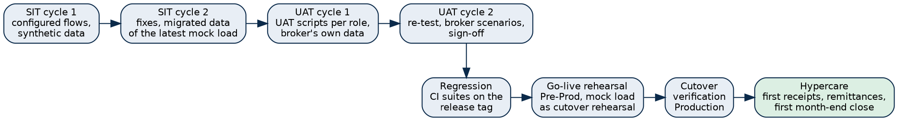

# Introduction

## Purpose

This plan applies the BrokerVerse Test Strategy to the implementation of BrokerVerse OOTB for one broker. It lists what is tested in each module, when each test cycle runs in the implementation plan of the broker's size, who tests, what is delivered, when testing stops and resumes, and who signs off.

Copy this plan at the end of discovery, fill in the broker's name, dates, testers and the broker-specific scenarios (marked [square brackets]), and keep it with the project documents.

| Item | Value |
|---|---|
| Broker | [Broker legal name] |
| Implementation size | [Small 8 weeks / Medium 12 weeks / Large 16 to 20 weeks] |
| Release tested | [vX.Y.Z-rc.N, then vX.Y.Z] |
| Kick-off date | [date] |
| Planned go-live date | [date] |
| QA lead (iorta TechNXT) | [name] |
| UAT coordinator (broker) | [name] |

## References

| Document | Use in this plan |
|---|---|
| Test Strategy | Levels, types, environments, data, entry and exit criteria, defect severity, CI gates |
| Implementation Approach and Plan; Implementation Plan workbook | Phases and weeks by broker size |
| Test Cases workbook | Test cases by module (sheet Test Cases), traceability to automated tests (Traceability), process catalogue to test cases (Requirements Traceability), defects |
| `docs/onboarding/UAT_SCRIPTS.md` | UAT scripts per role |
| Environment Strategy and Production Rollout | Environment set, refreshes, masking, rehearsal, cutover runbook |
| Data Migration and Cutover Plan | Mock loads, reconciliation, go/no-go |
| UAT and Go-Live Acceptance Certificates; Hypercare Exit Certificate | Sign-off forms |

# Scope

## In scope per module

The test case prefixes refer to the sheet Test Cases of the Test Cases workbook. Modules switched off for the broker in discovery are marked out of scope in the copy of this plan.

| Module | What is tested for the broker | Test cases | UAT scripts |
|---|---|---|---|
| Sign-in, security, users and roles | Sign-in, password policy, lockout, two-step verification, users per role, authority matrix, delegations, segregation of duties, masking of personal identifiers by role | BV-SEC, BV-USR, BV-RBA, BV-NPC | A1 to A3, K11 |
| Philippine reference masters | PSGC regions, provinces, cities and municipalities, barangays, ZIP codes, banks, ID types, salutations, holidays, IC insurer list | BV-PHM, BV-MST | A5, A8 |
| Navigation, help and screen behaviour | Side menu by role with Master sections, menu search, Help panel (F1), skeleton loading, screen check per role | BV-NAV, BV-SCR | A9 |
| Configuration, numbering, audit trail | Settings, document numbering, schedules, e-mail outbox, Audit Trail screen | BV-CFG, BV-AUD, BV-EML | A6, A7 |
| Product Configurator in the flow | Templates, governing template, rating factors, acceptance rules (refer, decline, loading with authority), document templates with merge fields, market mapping | BV-PCF, BV-PCR | P6, P7 |
| Go-live data workbench and environment tools | Configuration and migration workbooks, validate, errors workbook, load, reconciliation, environment comparison, transaction reset, masking tool, release pipeline | BV-GOL, BV-GLW | A10, A11, T1 to T3 |
| My Work | My Items, My Team by reporting line, My Tasks, Calendar | BV-MYW | W1 to W3 |
| Prospects, quotation, placement | Prospects, quick quote, quotations and customer response, requests for quotation, placement slips, cover notes | BV-PRS, BV-QQT, BV-QUO, BV-RFQ, BV-OPX | S1 to S4, P1 to P3, O6 |
| Policy servicing | Issuance, endorsements, computed cancellation (pro-rata, short-period), renewals, CTPL COC series and authentication | BV-POL, BV-END, BV-REN, BV-OPX, BV-INT | P4, P5, O2, O7, O8 |
| Claims | Registration, documents and checklist, motor repairs and letters of authority, settlement, settlements paid through the broker | BV-CLM, BV-OPX, BV-ACX | C1 to C7, F18 |
| Billing, collection and money | Payments, receipts, collections, credit control, instalment invoices, post-dated cheques, disbursement, remittance, direct bill, petty cash, bank payment files | BV-PAY, BV-RCT, BV-COL, BV-DSB, BV-REM, BV-DBL, BV-PCH, BV-ACX, BV-INT | F1 to F6, F9 to F11 |
| Commission and incentives | Rate matrix, referrer commission, licence check before payout, overriding and contingent commission, incentives | BV-COM, BV-INC, BV-ICC, BV-BIR | F12, K9 |
| Accounting and period end | Journals, period end, bank and insurer reconciliation, accounts payable, fixed assets and depreciation | BV-JNL, BV-PER, BV-BNK, BV-INR, BV-ACX | F6, F7, F16, F17, M1 to M6 |
| Tax (BIR) | 2307, VAT summary, SAWT, QAP, SLSP, 0619-E, 1601-EQ, 1604-E, 2551Q, DAT files, EOPT sales invoices, CAS books, EIS | BV-TAX, BV-BIR | F8, F13 to F15 |
| AML/CFT | Client onboarding before first policy, juridical clients, signatories and beneficial owners, risk rating, EDD, screening lists and hits, transaction alerts, cases, AMLC report files | BV-AML | K1 to K6, O9 |
| IC and NPC compliance | Licence register and payout block, fit and proper, insurer authority, IC annual statement and production report, complaints register, breach register, consent and data subject requests, field encryption | BV-ICC, BV-NPC | K7 to K12, O10, M7 |
| Distribution | Lead assignment, distribution channels, dealer programmes, fleet schedules, marine open covers, facultative reinsurance, comparison reports, campaigns, report builder and BI extract | BV-DST | S7 to S11, P8 to P10 |
| Integrations | Connectors and outbox, SMS and Viber templates, CTPL authentication, insurer API, bank payment files | BV-INT | A12, A13 |
| Branding | Theme and Branding, logo, sign-in picture, brand packs, branded documents, reports and e-mails, e-signatures mapped to documents | BV-BRD | A14, A15 |
| Reinsurance | Treaties, cessions, recoveries, facultative placements | BV-RIN, BV-DST | P8 |
| Reports and dashboards | Report catalogue, dashboards, scheduled reports, report builder | BV-RPT, BV-DSH, BV-DST | S6, S11, C5 |
| Sales activities, product covers and risk fields, supplier BIR 2307, asset disposal | Sales activity log and report, quote wizard covers and risk fields from the Product Configurator, supplier BIR 2307 and supplier EWT in the returns, fixed asset disposal | BV-PKG | Delivered; cases run in UAT cycle 1 |

## UI standard check

Every screen in scope is checked once against the Enterprise UI standard of the Technical Reference (section Enterprise UI standard), as part of the screen check per role in SIT cycle 1 and again for every screen changed by a fix. The tester opens the screen as each role at a 1280px window, triggers one success and one error message and opens each dialog, and confirms:

- Page header: one title, a breadcrumb, actions on the right with the primary action last.
- Summary figures as compact strips: no dials, gauges, large icons or coloured card edges.
- Tables: one row height, numbers and dates right-aligned on one line, status as a quiet tag, a figure out of 100 as a thin bar with the value written beside it (not inside it).
- Forms: one input height, number spinners as quiet buttons inside the field, a year or period as a drop-down, a select button with one visibly selected segment, filters above the list and actions in the header or footer.
- Buttons: one filled primary button per action bar, the others outlined or text; never a row of filled buttons.
- Messages and toasts: white or neutral tint with a thin coloured rule on the left and dark text; information boxes grey with the rule in the brand colour; no pink or saturated red surface.
- Charts: straight lines, plain captions, no gradients.
- Colour and icons: the brand colour only for the primary action, links and the selected state; icons 16 to 18px, no decorative icons.
- Dialogs: white, form dialogs as a side panel, confirmations centred, one primary button.

A deviation is logged as a severity 4 defect (severity 3 when the selected state, the value of a meter or a message cannot be read) with the screen, the role and a screenshot; the test case prefix is BV-SCR.

## Out of scope

- Retesting the product's internal code paths already covered by the automated suites; the implementation relies on the green CI run of the release tag.
- Browsers other than current Chromium-based browsers and mobile layouts, unless agreed in discovery.
- Certification by third parties (CTPL authentication provider, LTO, insurer APIs, banks, BIR EIS, AMLC portal): the system is tested in test mode; certification is done with each partner during onboarding.
- Load and penetration testing are planned separately (go-live conditions) and reported on their own.

# Schedule

## Test activities by phase

| Implementation phase | Test activities | Owner |
|---|---|---|
| Mobilisation | Test Plan copied and dated; testers named; test environments ordered with the environment set | QA lead, project managers |
| Discovery and fit-gap | Broker-specific scenarios written from the workshops; regulatory values to confirm listed (AML settings, BIR settings, IC settings, complaint deadlines); RTM filtered to the broker's scope | QA lead, business analyst |
| Environment set-up | Smoke test on each environment; CI run of the release tag green; environment names checked | DevOps lead |
| Configuration | Test quotation premiums and taxes against manual calculations; environment comparison after each promotion | Consultants, QA |
| Data migration | Validation and reconciliation of each mock load; errors workbooks | Migration lead, broker data owner |
| System integration test | SIT cycles 1 and 2 | QA lead and testers |
| Training | Training on UAT environment; UAT scripts used as exercises | Trainers, key users |
| User acceptance test | UAT cycles 1 and 2, regression on the fixes, sign-off | Key users, QA support |
| Cutover | Go-live rehearsal in Pre-Prod; cutover verification in Production | Migration lead, DevOps, Accounting Manager |
| Hypercare | Daily then weekly checks; first month-end close; hypercare exit | Project team, key users |

## Test cycles

| Cycle | Environment | Data | Content | Duration |
|---|---|---|---|---|
| SIT cycle 1 | Dev (small, medium) or SIT (large) | Synthetic data from `uat-scenario.js`; the broker's configuration | UAT scenario on the configured system; life-cycle plan; test cases of every in-scope module; screen check per role with the UI standard check | 1 week |
| SIT cycle 2 | Same | As cycle 1; for a large broker the migrated data of mock load 2 | Re-test of cycle 1 defects; broker-specific scenarios; full UAT scenario again; SIT exit report | 1 week |
| UAT cycle 1 | UAT | The broker's configuration and the latest mock load | UAT scripts of every role, broker scenarios | 1 week |
| UAT cycle 2 | UAT | As cycle 1, after fixes and the next mock load | Re-test of cycle 1 defects; scripts that failed or were not run; sign-off | 1 week |
| Regression | CI, then UAT | Automated suites; UAT scenario | Full backend and front-end suites on the release tag; UAT scenario on the tag deployed to UAT; re-test of every fixed defect | With each fix deployment |
| Go-live rehearsal | Pre-Prod (restored from Production) | Fresh extract (last mock load) | `npm run rehearsal:golive`; environment comparison UAT against Pre-Prod; masking verification if testers without production access take part; cutover timings | 2 to 3 days |
| Cutover verification | Production | Final extract | Reconciliation of counts and totals; trial balance and receivables control account; go-live lock; smoke test (client, quotation, policy, receipt) | Cutover weekend |
| Hypercare | Production | Live business | First receipts, remittances, bank imports, scheduled jobs, first month-end close, BIR working papers of the first month | 2 to 6 weeks by size |

## Calendar by broker size

The weeks follow the timelines of the Implementation Approach and Plan.

| Cycle | Small broker (8 weeks) | Medium broker (12 weeks) | Large broker (20 weeks) |
|---|---|---|---|
| Regulatory values to confirm | Week 2 | Week 3 | Weeks 4 to 5 |
| SIT cycle 1 | Week 4 (in Dev) | Week 6 (in Dev) | Week 9 (in SIT) |
| SIT cycle 2 and exit | Week 4 (in Dev) | Week 7 (in Dev) | Weeks 10 to 11 (in SIT) |
| UAT cycle 1 | Week 5 | Week 8 | Week 12 |
| UAT cycle 2 and sign-off | Week 6 | Week 9 | Week 13 |
| Go-live rehearsal in Pre-Prod | Week 6 | Week 9 (mock load 3) | Week 14 (mock load 4) |
| Cutover verification | End of week 6 | End of week 9 | End of week 14 |
| Hypercare | Weeks 7 to 8 | Weeks 10 to 12 | Weeks 15 to 20 |

For a small broker the two SIT cycles share week 4 (cycle 1 early in the week, cycle 2 after the fixes).

# Test cases and traceability

- The Test Cases workbook holds the cases per module with pre-conditions, steps, test data, expected result, regulatory reference, priority and persona.
- The sheet Requirements Traceability maps each process of the fit catalogue (process IDs 1.01 to 15.16 of the PH Fit and ASEAN Rollout Assessment) to its test cases and to the automated test files that cover it. A process in the broker's scope without a test case is a gap of this plan and is closed before SIT.
- UAT scripts are numbered by role in `docs/onboarding/UAT_SCRIPTS.md`: A (System Administrator), S (Sales & Marketing), P (Processing Team), O (Operations), C (Claims), F (Accounting), M (Accounting Manager), W (My Work, every role), K (Compliance Officer and the compliance registers), T (IT checks of the test environments).
- Broker-specific scenarios get IDs BV-BRK-nnn and a row in the workbook copy of the project.
- Priority: High cases run in every cycle; Medium in SIT cycle 1 and UAT cycle 1 and when touched by a fix; Low once.

# Deliverables

| Deliverable | When | Owner | Accepted by |
|---|---|---|---|
| Test Plan (this document, filled in) | End of discovery | QA lead | Both project managers |
| Test Cases workbook for the broker (scope filtered, broker scenarios added) | Before SIT cycle 1 | QA lead | Broker project manager |
| Smoke test record per environment | Environment set-up | DevOps lead | QA lead |
| Environment comparison workbooks | Each promotion | DevOps lead | System Administrator |
| Mock load reconciliation workbooks | Each mock load | Migration lead | Accounting Manager |
| SIT exit report (results, defects, UAT scenario run log) | End of SIT | QA lead | Broker project manager |
| UAT results per script and defect log | Each UAT cycle | UAT coordinator | Process owners |
| UAT Sign-off Certificate | End of UAT | Broker sponsor | Both parties |
| Go-live rehearsal run log and timings | Rehearsal | Migration lead | Steering committee |
| Test Summary Report | Before go/no-go | QA lead | Steering committee |
| Cutover verification record (final reconciliation) | Cutover | Migration lead, Accounting Manager | Steering committee |
| Hypercare log and exit | End of hypercare | Project manager | Broker sponsor, production support |

# Resourcing

| Role | Small | Medium | Large | Notes |
|---|---|---|---|---|
| QA lead (iorta TechNXT) | 0.5 | 0.5 | 1 | From discovery to hypercare exit |
| Testers (iorta TechNXT) | 1 | 1 | 2 | SIT and UAT support |
| DevOps lead | 0.25 | 0.25 | 0.5 | Environments, pipeline, comparison, masking, rehearsal |
| Migration lead | 0.5 | 0.5 | 1 | Mock loads, rehearsal, cutover |
| Broker key users | One per team | One per team | One per team per region | At least 50% during UAT (SOW) |
| Broker Accounting Manager | Part time | Part time | Part time | Accounting, tax, reconciliations |
| Broker compliance officer, DPO, tax adviser | As needed | As needed | As needed | Confirm regulatory values and outputs |

Figures are full-time equivalents during the test phases and are recommendations to confirm in the project plan.

# Suspension and resumption

## Suspension criteria

Testing of a cycle is suspended, by the QA lead with the broker's project manager, when:

1. The environment is unavailable for more than 4 working hours, or the deployed build is not the planned tag.
2. A severity 1 defect blocks a core flow (sign-in, quotation to policy, receipt, remittance, journal posting, month-end close).
3. More than 20% of the cases run in a day fail for the same cause (configuration, data or build).
4. The mock load used by the cycle does not reconcile.
5. Personal data is found unmasked in an environment where testers without production access work: work stops at once and the incident is logged in the breach register.

## Resumption criteria

Testing resumes when the cause is removed and confirmed: the environment is back with the planned tag and its smoke test passed; the blocking defect is fixed, deployed and re-tested; the configuration or data is corrected and compared again; or, for personal data, the copy is masked and the verification scan ends with exit code 0. Cases run during the suspended period are run again.

# Sign-off

| Gate | Criteria (Test Strategy) | Signed by |
|---|---|---|
| SIT exit | All end-to-end flows passed; no open severity 1 or 2 defect | QA lead; broker project manager |
| UAT sign-off | All UAT scripts passed or accepted with a workaround; no open severity 1 or 2 defect; severity 3 and 4 items listed | Each process owner and the broker sponsor (UAT Sign-off Certificate) |
| Rehearsal accepted | All rehearsal checks passed; reconciliation agreed; comparison shows environment-specific differences only | Migration lead; broker Accounting Manager |
| Go decision | Go/no-go criteria of the Data Migration and Cutover Plan | Steering committee |
| Go-live acceptance | Users transacting; first receipts, remittances and bank imports processed | Broker sponsor (Go-Live Acceptance Certificate) |
| Hypercare exit | No open severity 1 or 2 issue; first close completed; handover accepted | Broker sponsor; production support (Hypercare Exit and Handover Certificate) |
