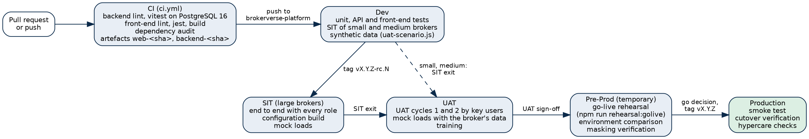
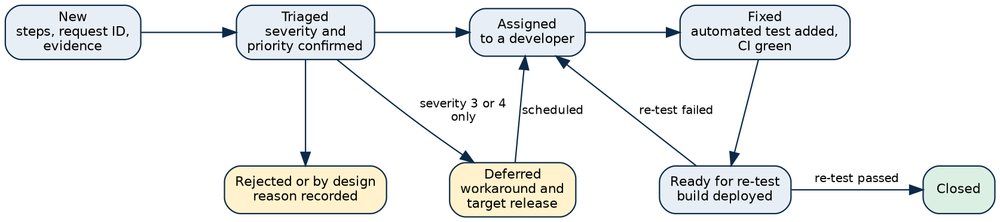

# Introduction

## Purpose

This strategy says how BrokerVerse OOTB is tested: by iorta TechNXT for every product release, and with the broker for every implementation. It sets the test levels, the test types, the environments and data used at each level, when a test phase may start and end, how defects are handled, which automated checks gate a release, and who does what.

The Test Plan applies this strategy to one broker implementation (scope per module, schedule, cycles, resources and sign-off). The Test Summary Report records the results of a test cycle. The test cases, the traceability to the process catalogue and the defect register are in the workbook BrokerVerse_Test_Cases.xlsx.

## Audience

| Reader | Uses this document to |
|---|---|
| QA lead and testers (iorta TechNXT) | Plan and run each level, keep the evidence, report results |
| Developers | Know which automated tests a change needs and which CI checks must pass |
| Broker project manager and key users | Know what they test in UAT, with which data, and what sign-off means |
| Delivery head and project manager | Plan the test phases and the go/no-go evidence |
| Broker Data Protection Officer and compliance officer | Check how personal data is protected in test environments and how regulatory functions are tested |

## Related documents

| Document | Folder | What it adds |
|---|---|---|
| Test Plan | 05_Delivery | The plan of an implementation: scope per module, schedule by phase, cycles, resources, suspension and sign-off |
| Test Cases workbook (with the Requirements Traceability sheet) | 05_Delivery | Every test case; traceability from the process catalogue to test cases and automated test files; defect register |
| Test Summary Report | 05_Delivery | Results of the latest cycle, counts per test file area and coverage by module |
| Implementation Approach and Plan | 05_Delivery | Phases and timelines by broker size |
| Environment Strategy and Production Rollout | 04_Onboarding_and_Go_Live | Environment roles, refresh, masking, release pipeline and cutover runbook |
| Data Migration and Cutover Plan | 04_Onboarding_and_Go_Live | Mock loads, reconciliation and go/no-go |
| UAT and Go-Live Acceptance Certificates | 03_Contracts | Sign-off forms and the severity scale of the SOW |
| Production Support Approach and Standards | 06_Support | Severity P1 to P4 after go-live |
| `docs/onboarding/UAT_SCRIPTS.md` | Repository | UAT scripts per role, run by the key users |

# Test approach

## Principles

- **Test the delivered product, configured.** BrokerVerse OOTB is configured, not customised. Each implementation tests the broker's configuration and data on the released code; it does not retest the product from scratch.
- **Automate every business rule.** A rule of the product (a premium tax, a posting, a maker-checker control, a regulatory deadline) is covered by an automated API test that runs on every change. A defect is fixed together with the test that would have found it.
- **Evidence or it did not happen.** A test case is Pass only with recorded evidence: the automated test that passed, the run log of a scripted scenario, a screen check or a signed UAT script. Without evidence it is Not Run.
- **Same build everywhere.** The artefacts built once by CI (`web-<sha>`, `backend-<sha>`) are the ones tested in SIT and UAT, rehearsed in Pre-Prod and deployed in Production.
- **Real personal data only where it must be.** Synthetic data in Dev and SIT; the broker's data in UAT only under production-grade protection; restored production copies masked before people without production access use them.
- **Regulatory functions are tested against the rule and confirmed by the broker.** iorta TechNXT tests that the system applies the delivered rule (for example the AMLC covered transaction threshold or the NPC 72-hour clock). The broker's compliance officer, tax adviser and Data Protection Officer confirm the values against the rules in force.

## Flow of testing across environments

# Test levels

| Level | What it proves | Tool and location | Who | When |
|---|---|---|---|---|
| Unit and component (front end) | Screen logic: menu permissions, help routes, number and date formats, form checks, rule editors, theme engine and contrast | jest through craco: `brokerverse/src/**/*.test.js`, `*.test.jsx` | Developers | Every pull request and push (CI) |
| API and integration (backend) | Every business rule through the HTTP API against a real PostgreSQL 16 database: postings, approvals, permissions, regulatory rules, scheduled jobs, files produced | vitest with supertest: `backend/test/*.test.js`; each file builds the schema from the migrations and seeds it (`test/helpers.js`) | Developers | Every pull request and push (CI); before each release tag |
| System integration (end to end) | The full broking cycle of a Philippine broker across roles, with one user per role, from set-up to month-end close and reports | `backend/scripts/uat-scenario.js` (433 steps in 12 phases on the merged release, run log `docs/e2e/UAT_SCENARIO_RUN.md`); life-cycle plan `docs/e2e/E2E_TEST_PLAN.md`; screen check of every menu per role | iorta TechNXT QA | SIT cycles; each release candidate |
| User acceptance | The configured system works for the broker's people with the broker's data | `docs/onboarding/UAT_SCRIPTS.md` per role, plus broker scenarios agreed in discovery | Broker key users, supported by iorta TechNXT | UAT cycles 1 and 2 |
| Go-live rehearsal | Configuration promotion, smoke test, transaction reset, migration with reconciliation, new and migrated business side by side, go-live lock | `npm run rehearsal:golive` (`backend/scripts/golive-rehearsal.js`, 52 checks, run log `docs/e2e/GOLIVE_REHEARSAL_RUN.md`) | iorta TechNXT migration lead and DevOps | In Pre-Prod before go-live; before each major release |
| Environment comparison | Configuration and masters of two environments are mirrored apart from environment-specific values | Master > Go-Live Data Load > Compare environments, or `npm run compare:environments` (exit code 0 mirrored, 1 differences, 2 could not run) | DevOps, System Administrator | After each promotion: Dev or SIT to UAT, UAT to Production, Pre-Prod against Production |
| Masking verification | A restored copy holds no unmasked e-mail address, mobile number or TIN | `npm run mask:data -- --verify-only` (exit code 4 when personal data is left) after `--execute` | DevOps, Data Protection Officer | Every copy of production data used outside Production |
| Cutover verification | Production after the final load: counts and totals reconciled, trial balance and receivables control account agreed, lock on | Go-Live Data Load reconciliation workbook; smoke test of the deployment checklist | Migration lead, Accounting Manager | Cutover weekend |
| Hypercare checks | First live receipts, remittances, bank imports, scheduled jobs and first month-end close | Production monitoring, job run history, month-end checklist | Project team, broker key users | Go-live to hypercare exit |

## Unit and component tests (front end)

Front-end tests run with `CI=true npx craco test --watchAll=false` in `brokerverse/`. They cover pure logic and small rendered components without a server: menu permissions and the enterprise side menu tree, `canOpen` for typed addresses, help routes from screen to manual section, My Work grouping and due logic, Product Configurator rule logic, integrations and compliance screens with mocked services, theme engine (CSS variables, WCAG contrast, sign-in picture), Philippine address fields, number, date and table alignment utilities.

## API and integration tests (backend)

Backend tests run with `npx vitest run` in `backend/`, one file after another (`fileParallelism: false`) against the database in `TEST_DATABASE_URL` (default `brokerverse_test` on 127.0.0.1:5432). Each file resets the schema, applies every migration and the reference seeds, starts the application in memory and signs in. A migration that does not apply on an empty database therefore fails the suite. Tests use real SQL, real posting rules and real permissions; external providers (SMS, CTPL authentication, insurer APIs, EIS, screening provider, payment gateways) are exercised through their built-in test modes.

Rules for developers:

1. Each new endpoint, posting rule, approval, setting or scheduled job has at least one positive and one negative test (wrong role, wrong state, missing data, maker equals checker).
2. A regulatory rule is tested at its boundary (for example PHP 500,000.00 covered transaction, 72 hours to notify the NPC, licence expiring within 90 days).
3. Money is asserted to the centavo, and every posting is asserted to balance.
4. A test never depends on another file or on the order of tests within another file.

## System integration test

The scripted scenario `backend/scripts/uat-scenario.js` drives the public API with one persona per role and synthetic Philippine data over six months: personas and masters, retail package business, corporate non-package business with requests for quotation and co-insurance, billing and collection, endorsements, renewals and claims, remittances, commission and petty cash, reinsurance and incentives, bank and insurer reconciliation, month-end close, reports and dashboards. It can be pointed at any environment (`API_BASE`), is repeatable (`UAT_SEED`) and writes a run log. It is completed by:

- the life-cycle plan `docs/e2e/E2E_TEST_PLAN.md` (one motor policy through its whole life);
- a screen check of every menu screen for the administrator and for each role user (access granted and refused, console errors, failed requests, clipped content);
- the broker-specific flows agreed in discovery (lines, placement journeys, integrations switched on).

## User acceptance test

Key users run the UAT scripts of their role with the broker's own products, insurers and data, in UAT. iorta TechNXT supports, logs defects and re-tests. The scripts cover the delivered roles: System Administrator, Sales & Marketing, Processing Team, Operations, Claims, Accounting, Accounting Manager and Compliance Officer (AML/CFT), and the cross-role scripts for compliance registers, BIR, distribution, integrations and branding.

## Go-live rehearsal, environment comparison and masking verification

The go-live rehearsal (`npm run rehearsal:golive`) runs between a SOURCE environment (UAT) and a TARGET going live (Pre-Prod restored from Production, or Production before go-live). It needs `CONFIRM_RESET=yes` and refuses to run on a TARGET whose go-live lock is on unless explicitly allowed. A run passes when every check passes; the run log is kept as go/no-go evidence.

The environment comparison downloads the configuration workbook with current data from both sides and compares them on the natural keys of the workbench. Expected differences (secrets, addresses, numbering counters unless `INCLUDE_NUMBERING=yes`, environment name) are reported as environment-specific and do not fail the comparison.

The masking tool masks a copy in one transaction and then scans every text and JSON column. It refuses a database marked as production. Production is registered once with `--register-production`; a copy restored from it is re-marked and masked in one step with `--remark-copy --confirm-database=<copy> --restore-source=<backup>`. The verification scan must end with exit code 0 before testers sign in. Procedure: `docs/onboarding/DATA_MASKING.md`.

# Test types

| Type | Scope | How it is tested | Evidence |
|---|---|---|---|
| Functional | Every screen and process of the roles | Test cases with steps and expected results; API tests; UAT scripts | Test Cases workbook; vitest and jest results |
| Negative and validation | Wrong input, wrong state, missing permission, duplicates | API tests for each refusal (status code and message); screen checks for field messages | vitest results |
| Regulatory | IC (licences, insurer authority, complaints under RA 11765, annual statement, production report, premium held in trust), BIR (premium taxes, 2307, 0619-E, 1601-EQ, 1604-E, 2551Q, DAT files, EOPT invoices, CAS books, EIS), NPC (consent, data subject requests, breach register and 72-hour clock, masking by role, encryption), AMLC (customer due diligence, risk rating, EDD, screening, covered and suspicious transactions, report files), CTPL (COC series and authentication) | API tests at the boundary of each rule; each test case carries its regulatory reference; values confirmed by the broker's compliance officer, tax adviser and DPO | Regulatory reference column of the Test Cases workbook; Philippine Regulatory Compliance Matrix |
| Accounting | Every posting rule balances; sub-ledgers tie to the ledger; period controls | API tests on journals and balances; month-end checklist in the UAT scenario | vitest results; trial balance at the end of the scenario |
| Role-based access and segregation of duties | Deny by default on every endpoint; maker and checker different users; authority matrix limits; masking by `view:pii` | Permission probes per role in API tests; screen check per role user; typed addresses refused | role-access, access-control, user-access tests; screen check |
| Security | Authentication, tokens, password policy, lockout, two-step verification, rate limits, injection probes, uploads, headers, secrets at start-up, dependency audit | API tests (security, hardening); `npm audit` in CI (high and critical fail the build); external penetration test before the first production go-live | CI audit job; penetration test report |
| Performance | Response times and month-end volumes | Timings observed in the functional runs; load test with the broker's concurrent users and volumes on a production-sized server before go-live | Load test report (go-live condition) |
| Data migration | Configuration and migration workbooks: validation, errors workbook, load, reload without duplicates, reconciliation of counts and totals, opening balances | Go-live workbench tests; mock loads; rehearsal | Reconciliation workbook of each load |
| Integration | E-mail outbox, bank statement import, payment links, bank payment files, SMS and Viber, CTPL authentication and LTO feed, insurer API, screening provider, EIS | Test modes of each connector in API tests and SIT; live test per provider during onboarding | Outbox and inbox records; provider acceptance |
| Accessibility and contrast | Text contrast of every theme (WCAG 2.1 contrast on buttons, header and table header); keyboard access to the help panel (F1) and menu search (/) | Contrast checks of the theme engine (front end) and of the branding API (themes failing contrast are refused or flagged); manual keyboard check in UAT | jest and vitest results; UAT script |
| Usability and layout | Screens at 1440 x 900 without clipped content or horizontal scroll; skeleton loading while data loads | Screen sweep per role | Screen check log |
| Regression | Everything already delivered | Full backend and front-end suites on every change; UAT scenario on each release candidate; re-test of fixed defects | CI history; Test Summary Report |
| Installation and deployment | Migrations forward-only, seeds, smoke test after deploy, rollback | `deploy.yml` smoke test (health, version equals the commit, sign-in page); automatic rollback on failure; `rollback.yml` | Pipeline run |

# Environments

## Environment set by broker size

The environment set follows the Environment Strategy and Production Rollout Plan.

| Environment | Small broker | Medium broker | Large broker | Testing done there |
|---|---|---|---|---|
| Dev | Own instance | Own instance | Own instance | Unit and API tests by developers; configuration build and SIT for small and medium brokers |
| SIT | Done in Dev | Done in Dev | Own instance, separate from UAT | Configuration build, SIT cycles, mock loads 1 and 2 |
| UAT | Own instance | Own instance | Own instance | UAT cycles 1 and 2, mock loads with the broker's data, training |
| Pre-Prod | Temporary | Temporary | Temporary | Go-live rehearsal (last mock load), comparison with Production, rehearsal of each major release |
| Production | Own instance | Own instance | Own instance with high availability | Smoke test, cutover verification, hypercare checks |
| CI service database | Every size | Every size | Every size | Full backend suite on PostgreSQL 16 for each pull request and push |

## Environment rules for testing

- Each environment shows its name (`APP_ENVIRONMENT`) in About BrokerVerse (Help panel) and on exported workbooks, so evidence states where it was taken.
- E-mail sending (`notification.email_enabled`) is off in Dev and SIT, and in UAT until the broker agrees the recipients. Copies made with the masking tool have it switched off.
- Connectors stay in test mode outside Production unless a provider test is planned.
- The transaction reset (`CONFIRM_RESET=yes npm run reset:transactions -- --execute`) is used between cycles and before mock loads; it refuses to run while `golive.locked` is on and is never run in Production after go-live.
- Refreshes follow the refresh policy of the Environment Strategy and are recorded in the environment sheet.

# Test data

| Data | Source | Used in | Rules |
|---|---|---|---|
| Reference data | Migrations and seeds: Philippine masters (PSGC 2Q 2026 regions, provinces, cities and municipalities, barangays; ZIP codes; banks; government ID types; salutations; holidays; IC insurer list), chart of accounts, tax codes, motor tariff, roles | Every environment | Never edited by tests; changes come by migration |
| Demo data | `SEED_SAMPLE_DATA=true` | Dev, training | Never in Production (`SEED_SAMPLE_DATA=false`) |
| Synthetic test data | `backend/scripts/uat-scenario.js` (fictional Philippine names, TINs, mobile numbers and addresses; seed `brokerverse-uat`) | Dev, SIT, release candidates | Repeatable; load once on a database without business records |
| Automated test data | Created by each test file on a fresh schema | CI, developer machines | Isolated per file |
| Broker extracts | The broker's old system, through the configuration and migration workbooks | SIT (large brokers), UAT, Pre-Prod | Treated as production data: access limited, environment protected as Production |
| Masked copies | Production backup restored, then `npm run mask:data` with `--remark-copy` and `--execute`, then `--verify-only` | Pre-Prod used by testers without production access, training copies, support reproduction | Deterministic pseudonyms (secret `MASK_SALT`, never stored); passwords reset, sessions ended, outbox emptied, e-mail off; files purged or replaced; verification exit code 0 |

> No real client, payee or employee data may be used in Dev, in SIT for a small or medium broker, in CI, in screenshots attached to defects, or in training material. A defect raised from UAT or Production quotes record numbers and request IDs, not personal details.

# Entry and exit criteria

| Level | Entry criteria | Exit criteria |
|---|---|---|
| Unit and API (per change) | Pull request opened | CI green: backend lint and full suite, front-end lint, tests and build, dependency audit without high or critical finding |
| SIT | Release candidate tag deployed; configuration of the cycle loaded; persona users created; SIT test cases mapped in the Test Cases workbook; environment comparison against the source environment run | Every end-to-end flow passed (UAT scenario without failed step, life-cycle plan passed); no open severity 1 or 2 defect; screen check without refused request for granted screens; SIT exit report signed |
| UAT cycle 1 | SIT exit; configuration promoted to UAT and compared; mock load reconciled; key users trained and holding one user per role; UAT scripts issued | Every UAT script executed; defects logged with severity |
| UAT cycle 2 and sign-off | Fixes of cycle 1 deployed by the pipeline; re-test list agreed | All UAT scripts passed or accepted with a workaround; no open severity 1 or 2 defect; severity 3 and 4 items listed with owner and date; UAT Sign-off Certificate signed |
| Go-live rehearsal | UAT sign-off; Pre-Prod restored from a production backup; masked if testers without production access take part; release tag equal to the one going live | Every rehearsal check passed; reconciliation agreed; environment comparison shows environment-specific differences only; timings recorded for the cutover plan |
| Cutover verification | Go decision; final extract received | Counts and totals agree with the old system (default: exact); trial balance and receivables control account agreed; go-live lock on; smoke test passed |
| Hypercare | Go-live | No open severity 1 or 2 issue; first month-end close completed; handover accepted |

# Defect management

## Severity and priority

Severity follows the scale of the Implementation SOW and the UAT certificates; after go-live a defect becomes a support ticket with the matching production priority.

| Severity | Meaning | Production priority | Release rule |
|---|---|---|---|
| 1 Critical | A core process cannot be completed, financial postings are wrong, or personal data is exposed, with no workaround | P1 | Blocks exit of SIT, UAT and go-live |
| 2 High | A core process is seriously degraded with no acceptable workaround | P2 | Blocks exit of SIT, UAT and go-live |
| 3 Medium | A function fails and a workaround exists | P3 | Listed in the certificate with owner and target |
| 4 Low | Cosmetic issue, wording or documentation | P4 | Listed with owner and target |

Priority (High, Medium, Low) orders the fixing work within a severity, for example a severity 3 defect on the month-end close before a severity 3 defect on a report rarely used.

## Life cycle

Each defect is recorded on the sheet Defects and Observations of the Test Cases workbook (or the project's tracker with the same fields): ID (BV-DEF-nnn for a defect, BV-OBS-nnn for an observation), title, module, severity, status, type (Defect, Gap, Observation), description with steps, the request ID from the error message, environment and build, workaround, target and linked test cases. A fix is accepted only with an automated test that fails before the fix and passes after it, and with the re-test of the linked test cases on a deployed build.

## Triage

The QA lead and the development lead triage new defects daily during SIT and UAT, with the broker's project manager for UAT defects. A disputed severity goes to the project managers, then to the steering committee.

# Continuous integration gates

`.github/workflows/ci.yml` runs on every pull request and every push, and on release tags:

| Job | Steps | Gate |
|---|---|---|
| Backend lint and tests | Node.js 22; `npm ci`; `npm run lint`; `npm test` against a `postgres:16` service database `brokerverse_test` | Required check |
| Front-end lint, tests and build | `npm ci --legacy-peer-deps`; `npm run lint`; `npx craco test --watchAll=false` with `CI=true`; environment-neutral production build; build output checks (no `%PUBLIC_URL%`, loads `/env-config.js`, no API address in the bundle) | Required check |
| Backend release artefact | `deploy/package-backend.sh` packages `backend-<sha>` | Required for deployment |
| Dependency audit | `npm audit --omit=dev --audit-level=high` for backend and front end | High and critical findings fail |
| Deploy to Dev, UAT, Production | `deploy.yml` with the artefacts of the same run: push to `brokerverse-platform` to Dev; tag `vX.Y.Z-rc.N` to UAT; tag `vX.Y.Z` to Production; SIT and Pre-Prod by manual promotion | Runs only after all four jobs pass; required reviewers per environment; two reviewers for Production |

Each deployment takes a backup first (Pre-Prod and Production), applies migrations and seeds, switches the release and runs the smoke test (`/api/health`, `/api/version` equal to the deployed commit, sign-in page). A failed smoke test rolls back automatically. `rollback.yml` rolls back by hand.

# Roles and responsibilities

| Role | Responsibilities in testing |
|---|---|
| iorta TechNXT QA lead | Owns this strategy and the Test Plan; maintains the Test Cases workbook and the traceability; runs SIT; triages defects; writes the Test Summary Report; recommends exit |
| iorta TechNXT testers | Execute SIT test cases and screen checks; support UAT; re-test fixes; keep evidence |
| iorta TechNXT developers | Write unit and API tests with each change; keep CI green; fix defects with a test |
| iorta TechNXT DevOps lead | Environments, pipeline, refreshes, masking of copies, environment comparison, go-live rehearsal runs |
| iorta TechNXT migration lead | Mock loads, reconciliation, rehearsal, cutover verification |
| iorta TechNXT project manager | Schedule, resources, status reporting, entry and exit decisions with the broker |
| Broker project manager | UAT schedule, testers, defect priorities, sign-off coordination |
| Broker key users (one per team) | Run UAT scripts and broker scenarios; confirm results; sign UAT for their process |
| Broker System Administrator | Users and roles for testing; configuration checks; environment comparison review |
| Broker Accounting Manager | Accounting, tax and reconciliation results; cutover sign-off of balances |
| Broker compliance officer, Data Protection Officer, tax adviser | Confirm regulatory values and outputs (AML settings, AMLC file layout, IC registers and forms, BIR forms and DAT files, breach criteria, masking) |
| Steering committee | Resolves disputes; go/no-go decision |

# Tools

| Need | Tool |
|---|---|
| Backend tests | vitest and supertest, PostgreSQL 16 |
| Front-end tests | jest through craco, React Testing Library |
| End-to-end scenario | `backend/scripts/uat-scenario.js` (Node.js) |
| Go-live rehearsal | `npm run rehearsal:golive` |
| Environment comparison | Master > Go-Live Data Load > Compare environments; `npm run compare:environments` |
| Transaction reset | `npm run reset:transactions` (dry run, then `--execute`) |
| Data masking | `npm run mask:data` (`--register-production`, `--remark-copy`, `--execute`, `--verify-only`) |
| Screen checks | Chromium at 1440 x 900, one user per role |
| CI and deployment | GitHub Actions: `ci.yml`, `deploy.yml`, `rollback.yml` |
| Test management | BrokerVerse_Test_Cases.xlsx (test cases, traceability, requirements traceability, defects), or the project tracker with the same fields |
| Evidence | Run logs in `docs/e2e`, CI run history, signed UAT scripts, reconciliation workbooks |

# Risks

| Risk | Effect | Mitigation |
|---|---|---|
| Key users not available for UAT | UAT late or shallow | Named key users at 50% during UAT in the SOW; UAT dates fixed at kick-off |
| Broker data arrives late or dirty | Mock loads fail; UAT on incomplete data | Data request at mobilisation; errors workbook per load; at least two mock loads before the rehearsal |
| Real personal data in a lower environment | Data Privacy Act breach | Masking tool with verification; environment protected as Production once broker data is loaded; breach register |
| Regulatory value wrong for the broker (threshold, form layout, ATC) | Wrong filing | Values confirmed in writing by the compliance officer, tax adviser and DPO; regulatory reference on each test case |
| Third-party provider not ready (SMTP, SMS, CTPL authentication, insurer API, banks, EIS) | Integration cases blocked | Connectors tested in test mode; live tests planned per provider; Blocked status with reason |
| No load test before go-live | Slow month-end in Production | Load test on a production-sized server is a go-live condition |
| No external penetration test | Unknown vulnerabilities | Penetration test before the first production go-live; findings triaged as defects |
| Configuration drift between environments | UAT result not valid for Production | Promotion with the configuration workbook; environment comparison after each promotion and before go-live |
| Features merged late (work in progress) | Untested scope | A feature joins a release only with its automated tests in CI and its test cases in the workbook; otherwise it stays out of the release |
