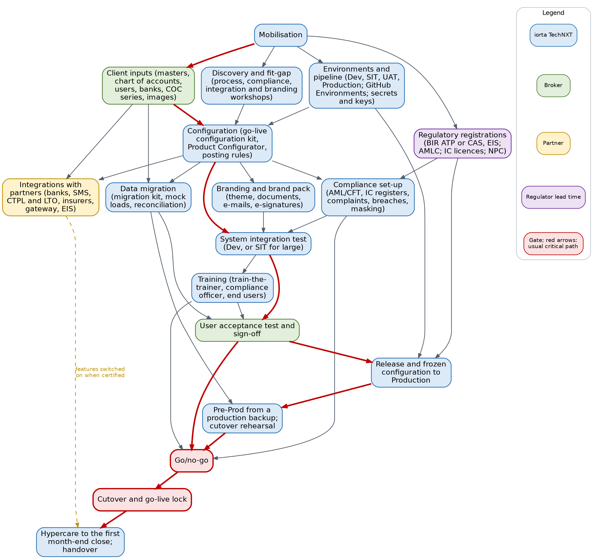
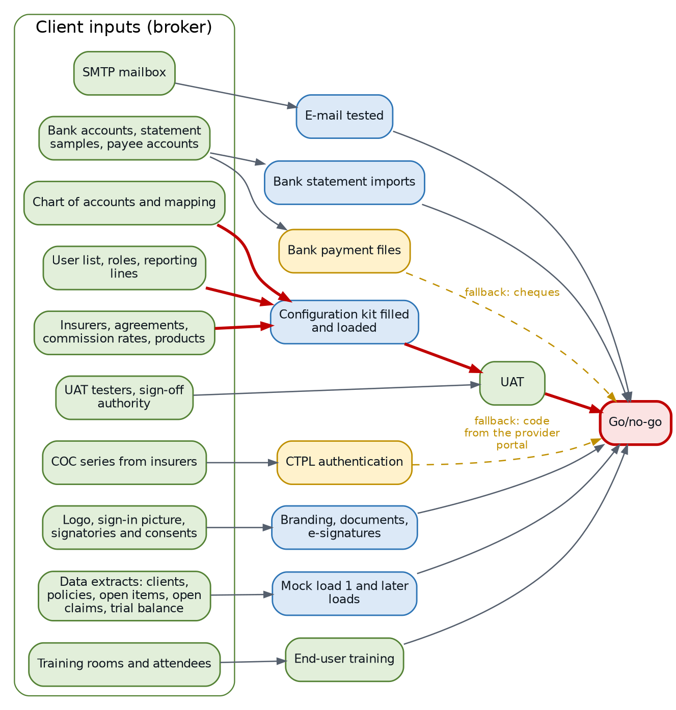
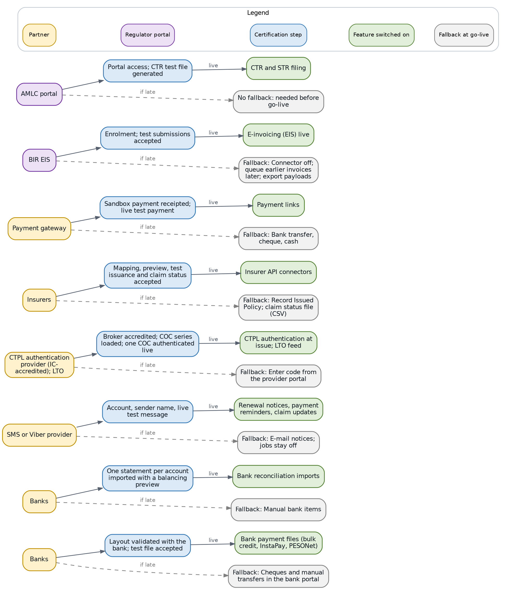
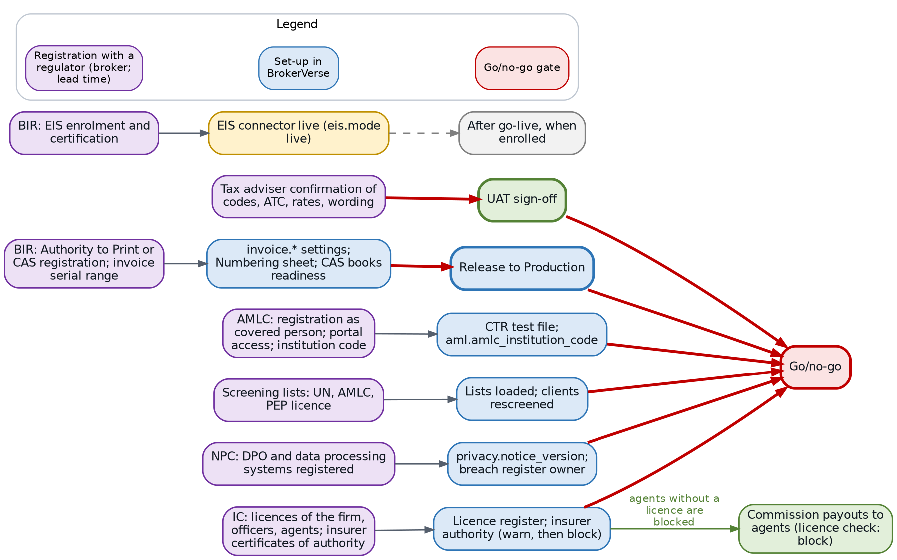
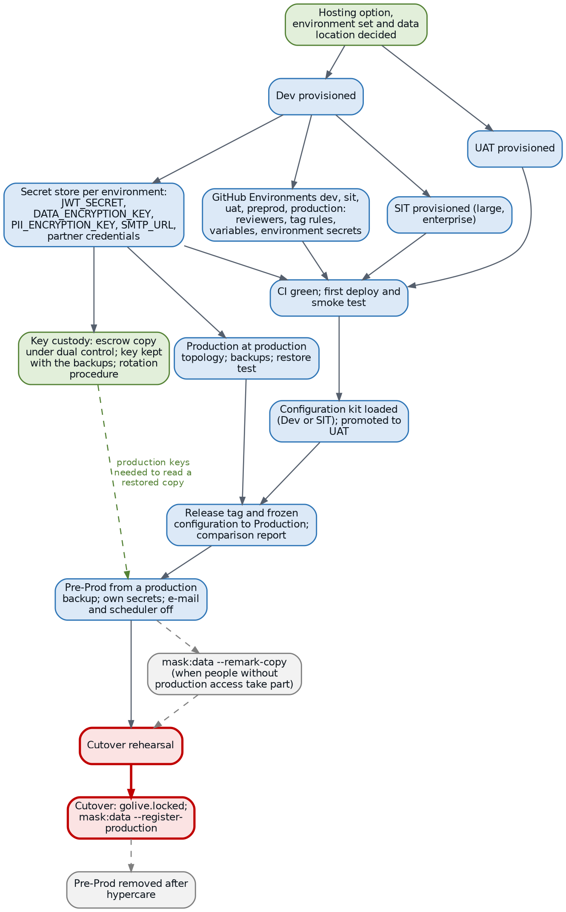
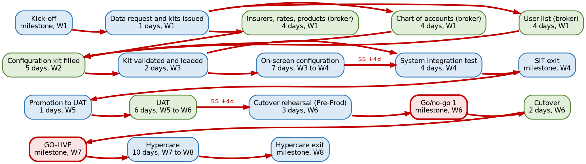
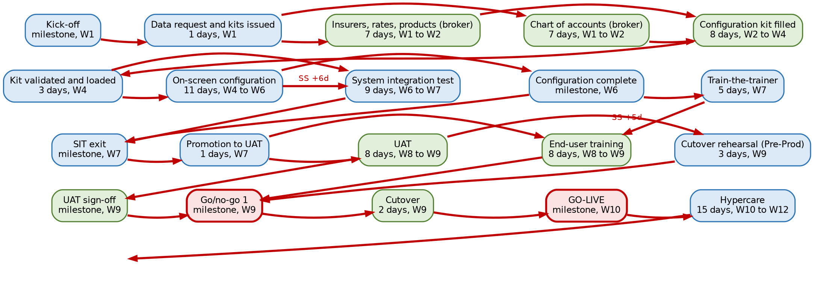
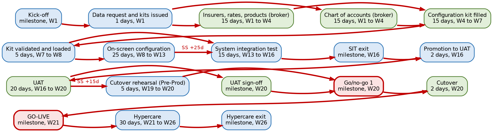

# Introduction

## Purpose

This document shows what a BrokerVerse OOTB implementation depends on, in what order, and what moves when a dependency is late. It is written for the iorta TechNXT head of delivery and project managers, and for the broker's sponsor and project manager. It answers four questions:

1. Which client inputs, partner certifications, regulatory registrations and environment steps does each phase need?
2. Which chain of tasks decides the go-live date for a small, medium, large and enterprise broker?
3. How long does each outside party usually take (lead time), and by when must it start?
4. If a dependency slips, does the go-live move, or only one feature, and by how much?

## How the figures are produced

Every figure in this document comes from one plan model kept with the documentation tools (`docs/package/tools/delivery/plan_model.py`). The model holds each task with its duration by size, its owner party (iorta TechNXT, broker or partner), its predecessors and what it holds back. A forward and backward pass over the links gives the dates, the float of each task and the critical path. The same model builds the companion workbook `BrokerVerse_Implementation_Plan.xlsx` (one task-level Gantt per size, the milestones, every link and the RACI) and the diagrams of this document, so the three never disagree.

> Durations and lead times are planning assumptions of iorta TechNXT for an out-of-the-box implementation. Lead times of regulators and partners are outside the control of both parties. The steering committee re-baselines the plan at mobilisation, once the broker has said which registrations it already holds and which partners it uses.

## Terms

| Term | Meaning |
|---|---|
| Day, week | Working days (5 a week). Week 1 starts on the kick-off date. Go-live is the first day of the go-live week |
| Float to go-live | Working days a task can finish late before the go-live date moves. 0 means the task is on the critical path |
| Holds the go-live | The go/no-go cannot pass while the dependency is open |
| Feature only | The go-live does not wait; the feature is switched on later and a fallback, described in this document, is used meanwhile |
| Lead time | Elapsed time an outside party needs from a complete request to the result |

## Version history

| Version | Date | Change |
|---|---|---|
| 1.0 | 04 October 2026 | Initial issue: dependency diagrams, client inputs, partner certifications, regulatory registrations, environments and keys, critical path by size, lead times, effect of a late dependency |
| 1.0.1 | 04 October 2026 | Client brand packs: basis is the client's contract with iorta TechNXT (management decision of 04 October 2026) |

## Related documents

| Document | Use |
|---|---|
| BrokerVerse Implementation Approach and Plan | Method, phases, timelines by size, roles, governance |
| BrokerVerse_Implementation_Plan.xlsx | Task-level plan by size: durations, owners, predecessors, dates, float, critical path; RACI |
| BrokerVerse_RAID_Log_Template.xlsx | Pre-filled risks, assumptions, issues and dependencies; the dependencies of this document are its D items |
| BrokerVerse Environment Strategy and Production Rollout | Environment sets, pipeline, cutover runbook T-30 to T+30 |
| BrokerVerse Data Migration and Cutover Plan | Mock loads, reconciliation, go/no-go criteria |
| Implementation Statement of Work; Customer Responsibilities and RACI Annex | The contractual form of the client dependencies and their effect when late |

# The dependency map

## Phases and gates

Reading the map:

- **Mobilisation** releases four streams in week 1: the client inputs (the configuration kit and the data request), discovery, the environments and the regulatory registrations. Registrations with a regulator start on day one because their lead times are the longest and are not in the project's hands.
- **Configuration** needs all three of discovery decisions, client inputs and a working Dev (or SIT) environment with the pipeline. It is the hinge of the plan: compliance set-up, branding, integrations and the mock loads all start from a loaded configuration kit.
- **System integration test** needs configuration, compliance set-up and branding finished. UAT needs SIT exit, trained key users and a reconciled mock load.
- **Release to Production** needs UAT under way, the production environment and the BIR invoice registration (ATP or CAS), because the invoice serial range is part of the frozen configuration.
- **Go/no-go** brings everything together: UAT sign-off, the reconciled rehearsal, trained users, compliance set-up (screening lists, AMLC reporting) and the NPC registration.
- **Integrations with partners** mostly do not hold the go-live: each has a fallback, and the feature is switched on when the partner has certified it (chapter Partner certifications).

## Three kinds of gate

| Gate | What happens when the dependency is late | Examples |
|---|---|---|
| Holds the go-live | The go/no-go fails; the go-live date moves by the delay less the float | Configuration kit inputs, UAT, rehearsal, ATP or CAS, AMLC registration, screening lists, NPC registration |
| Feature only | The go-live holds; the feature stays in test mode or switched off and the fallback is used | Bank payment files, SMS, insurer APIs, payment gateway, EIS, CTPL authentication (manual code entry), client brand pack |
| Hypercare exit | Hypercare is extended | First month-end close outside the hypercare window |

# Client inputs

## What the broker provides

| ID | Input | Owner (broker) | Needed by: Small / Medium / Large / Enterprise | Feeds |
|---|---|---|---|---|
| M4 | Named team: PM, key users, Accounting Manager, System Administrator, compliance officer, DPO | Sponsor | W1 for every size | Workshops, decisions |
| I1 | Insurer list and agreements, commission and referrer rates, product list | Key users | W1 / W2 / W3 / W4 | Configuration kit |
| I2 | Chart of accounts and the accountant's mapping decisions | Accounting Manager | W1 / W2 / W3 / W4 | Configuration kit |
| I3 | User list with roles, branches and reporting lines (My Work > My Team follows the reporting line) | System Administrator | W1 / W2 / W3 / W3 | Configuration kit, Users sheet |
| I4 | SMTP mailbox and credentials | IT head | W1 / W2 / W2 / W2 | E-mail test |
| I5 | Bank accounts, one statement export per account, bank contacts, payee bank accounts | Accounting | W2 / W2 / W3 / W3 | Statement formats, bank payment files |
| I6 | Partner contracts and credentials (SMS provider, CTPL authentication provider, payment gateway, insurer API access) | IT head and sponsor | W2 / W3 / W4 / W6 | Partner certifications |
| I7 | COC number series of each insurer | Operations | W2 / W2 / W3 / W3 | COC Series sheet, CTPL authentication |
| I8 | Logo, sign-in picture, signatories with their e-signature consent | Marketing, signatories | W1 / W2 / W2 / W3 | Branding, documents |
| G1 | Extracts of clients, in-force policies, open items, open claims and the trial balance, cleansed | Data owners | W2 / W3 / W5 / W6 | Mock load 1 |
| I9 | Training rooms, devices, attendance list | PM | Before end-user training | Training |
| I10 | UAT testers and sign-off authority | PM | Before UAT | UAT |

The insurer, product and commission data (I1) and the chart of accounts with its mapping (I2) are on the critical path for every size: the configuration kit cannot be completed without them, and everything after configuration waits for it. The user list (I3) has one to three days of float only.

## The kits the inputs go into

The broker fills two workbooks downloaded from Master > Go-Live Data Load:

- the **configuration kit** (company, settings, PSGC regions, provinces, cities and barangays, branches, departments, hierarchy, designations, users, currencies, chart of accounts, banks, bank accounts, signatories, insurers, lines of business, products, covers, vehicles, suppliers, asset classes, short-period rates, cancellation reasons, claim document checklist, repair shops, commission rates, premium taxes, LGU rates, authority limits, numbering, payee bank accounts, COC series);
- the **migration kit** (clients, in-force policies, open items, open claims, opening balances), refused until the cutover date `golive.cutover_date` is set.

Each upload is validated as a trial run, the errors come back as an errors workbook, and a corrected file is loaded again without duplicates. A late or poor input therefore shows quickly as rows in error, which the project manager reports weekly.

# Partner certifications

## Partners and fallbacks

BrokerVerse delivers each connector in test mode (Master > System Configuration > Integrations): the whole process can be tried before the partner contract is signed. What is certified with each partner is done during onboarding with that partner; the system cannot certify it alone.

| Partner | Certified during the project | Owner | Lead time assumption (S / M / L / E) | Fallback at go-live |
|---|---|---|---|---|
| Banks (payment files) | Each starter layout validated against the bank's current specification; a test file accepted by the bank | Bank, with Accounting | 10 / 15 / 20 / 25 days | Cheques and manual transfers in the bank portal |
| Banks (statements) | One statement per account imported with a balancing preview | Accounting, with iorta TechNXT | 3 / 4 / 6 / 8 days | Manual bank items |
| SMS or Viber provider | Account, sender name, live test message | Provider, with the IT head | 5 / 8 / 10 / 10 days | E-mail notices; SMS jobs stay switched off |
| CTPL authentication provider (IC-accredited); LTO | Broker accredited; COC series loaded; one COC authenticated live; LTO feed when the provider does not send it | Provider, with Operations | 8 / 10 / 15 / 15 days | **Enter code from the provider portal** on Operations > CTPL Authentication |
| Insurers | Mapping per insurer, preview, test issuance and claim status accepted | Each insurer, with the Processing Team | 10 / 15 / 20 / 25 days | **Record Issued Policy**; claim status file (CSV) |
| Payment gateway | Sandbox payment receipted; one live test payment | Gateway, with Accounting | 3 / 5 / 5 / 5 days | Bank transfer, cheque, cash |
| BIR EIS | Enrolment; test submissions accepted | Accounting Manager | 30 days for every size | Connector off; **Queue earlier invoices** once live; **Export payloads** for a manual upload |
| AMLC portal | Portal access; a CTR test file generated | Compliance officer | 15 / 20 / 20 / 20 days | None: needed before go-live |

## When each partner must be live

With the planned durations, every partner certification finishes before go-live except the EIS, which waits for the BIR enrolment and is switched on in the first hypercare week. The margin is the number of working days the certification can slip before the go-live starts with the fallback.

| ID | Dependency | Small | Medium | Large | Enterprise |
|---|---|---|---|---|---|
| I6 | Partner contracts and credentials | W1 to W2, 20 days before go-live | W1 to W3, 31 days before go-live | W2 to W4, 50 days before go-live | W2 to W6, 74 days before go-live |
| I7 | COC series | W1 to W2, 24 days before go-live | W1 to W2, 36 days before go-live | W1 to W3, 59 days before go-live | W1 to W3, 89 days before go-live |
| N3 | Bank payment files certified | W3 to W5, 8 days before go-live | W4 to W7, 11 days before go-live | W6 to W10, 21 days before go-live | W8 to W13, 39 days before go-live |
| N4 | SMS or Viber live | W3 to W4, 13 days before go-live | W4 to W6, 18 days before go-live | W6 to W8, 31 days before go-live | W8 to W10, 54 days before go-live |
| N5 | CTPL authentication live | W3 to W4, 10 days before go-live | W4 to W6, 16 days before go-live | W6 to W9, 26 days before go-live | W8 to W11, 49 days before go-live |
| N6 | Insurer API connectors | W3 to W5, 6 days before go-live | W5 to W8, 9 days before go-live | W7 to W11, 19 days before go-live | W8 to W13, 37 days before go-live |
| N7 | Payment gateway live | W3, 15 days before go-live | W4 to W5, 21 days before go-live | W6 to W7, 36 days before go-live | W8 to W9, 59 days before go-live |
| N8 | EIS connector in test mode | W4, 10 days before go-live | W7, 14 days before go-live | W10, 21 days before go-live | W13, 37 days before go-live |
| N9 | EIS connector live | W7, in the go-live week | W10, in the go-live week | W15, in the go-live week | W21, in the go-live week |

> CTPL authentication is the partner dependency with the most effect on daily work: every motor policy with CTPL needs an authenticated COC before release. If the provider is not live at go-live, the go/no-go records the decision to use **Enter code from the provider portal** for every COC, and Operations staff the extra work until the connector is live.

# Regulatory registrations

## What the broker registers, and what it unlocks

The registrations are the broker's own obligations; iorta TechNXT plans around them and sets the system up from their results. A registration the broker already holds takes no lead time: it is confirmed at mobilisation and the task is closed.

| ID | Registration | Owner | Lead time assumption (S / M / L / E) | Set-up in BrokerVerse | Gate |
|---|---|---|---|---|---|
| R1 | BIR: Authority to Print or CAS registration; registered serial range of the sales invoices; last numbers used | Accounting Manager with the tax adviser | 20 / 25 / 30 / 30 days | `invoice.atp_number` or `invoice.cas_permit_number`, `invoice.serial_from`, `invoice.serial_to`; Numbering sheet; CAS Books and Documents readiness (`cas.permit_number`) | Release to Production |
| R2 | BIR: EIS enrolment and certification, when the broker is covered | Accounting Manager | 30 days | `eis.enabled`, `eis.mode`, endpoint, accreditation id; credential variable names | Feature only |
| R3 | AMLC: registration as covered person, portal access, institution code | Compliance officer | 15 / 20 / 20 / 20 days | `aml.amlc_institution_code`, `aml.amlc_transaction_codes`; CTR test file | Go/no-go |
| R4 | IC: licences of the firm, officers, licensed individuals and agents; certificates of authority of the insurers | Compliance officer | 5 / 8 / 10 / 12 days | Compliance > Licence Register, Fit and Proper; insurer **IC Certificate of Authority No.** and validity | Compliance set-up; go/no-go |
| R5 | NPC: registration of the DPO and the data processing systems; privacy notice version | DPO | 20 / 25 / 30 / 30 days | `privacy.notice_version`; breach register owner | Go/no-go |
| R6 | Tax adviser confirmation of tax codes, ATC, rates, invoice and receipt wording, VAT treatment of commission | Tax adviser | 5 / 5 / 8 / 10 days | Taxation, `bir.*`, `invoice.*`, `receipts.document_title` | UAT sign-off |
| R7 | Screening lists: UN and AMLC lists obtained; PEP list licence from a provider when used | Compliance officer | 10 / 12 / 15 / 15 days | Compliance > Screening Lists (no list content is delivered with BrokerVerse); `aml.screening_provider` | Go/no-go |
| R8 | Contract reference covering the use of the client's marks on the engagement file (client brand pack only) | Sponsor | 3 / 5 / 5 / 5 days | Theme and Branding > Brand packs | Feature only |

Points that matter to the plan:

- **ATP or CAS (R1)** is the regulatory item with the least float for a small broker: 2 working days. A broker that must register a new CAS or obtain a new ATP should start on the kick-off day, or the go-live moves.
- **Screening lists (R7)** must be loaded and every client screened before go-live: onboarding, policy issue and payouts check the lists, and a High-risk or matched client gets no policy. The UN and AMLC lists are public; a PEP list is licensed from a provider.
- **IC licence data (R4)** drives the commission payout check: with `compliance.referrer_licence_check` set to block (delivered), commission to an agent without a licence in force is refused. Load the licences before the first commission run after go-live.
- **Insurer certificates of authority** are checked at request for quotation, firm order and issue. Start with `compliance.insurer_authority_check` at warn (delivered) and switch to block once every insurer's certificate is entered.

# Environments, pipeline and keys

## Set-up order

| Environment set | Small and medium | Large | Enterprise |
|---|---|---|---|
| Standing environments | Dev, UAT, Production | Dev, SIT, UAT, Production with high availability | As large, with a cross-region copy of the backups |
| Where SIT runs | Dev (synthetic data only) | SIT | SIT |
| Mock loads | UAT | SIT, then UAT | SIT, then UAT |
| Pre-Prod | Temporary: created from a production backup for the rehearsal, removed after hypercare | Same | Same |

| ID | Step | Owner | Depends on | Float (S / M / L / E days) |
|---|---|---|---|---|
| M5 | Hosting option, environment set and data location decided; transfer of personal data outside the Philippines decided and documented | Broker sponsor and IT head | Kick-off | 4 / 8 / 12 / 17 |
| E1, E2, E3 | Dev, SIT (large, enterprise) and UAT provisioned | iorta TechNXT DevOps lead | M5 | 4 to 6 / 8 to 10 / 12 to 16 / 17 to 21 |
| E4 | GitHub Environments `dev`, `sit`, `uat`, `preprod`, `production`: required reviewers (two on production, prevent self-review), tag rules, variables (`DEPLOY_ENABLED`, targets, addresses) and environment secrets (deploy keys, known hosts, bucket and distribution ids) | iorta TechNXT DevOps lead | Dev | 4 / 8 / 13 / 19 |
| E5 | Application secrets in the secret store of each environment: `JWT_SECRET`, `DATA_ENCRYPTION_KEY`, `PII_ENCRYPTION_KEY` (each at least 32 characters and different), `SMTP_URL`, partner credentials | iorta TechNXT DevOps lead with the broker IT head | Dev | 5 / 9 / 14 / 20 |
| E6 | First deployment through the pipeline (CI green, deploy, smoke test) to Dev, SIT and UAT | iorta TechNXT DevOps lead | E3, E4, E5 | 4 / 8 / 12 / 17 |
| E7 | Production at production topology, backups, monitoring, restore test | iorta TechNXT DevOps lead | E5 | 13 / 23 / 42 / 67 |
| X2 | Pre-Prod from a production backup: own secrets, e-mail off, scheduler stopped; masked first when people without production access take part | iorta TechNXT DevOps lead; masking approved by the broker DPO | Release to Production | 1 / 2 / 2 / 10 |
| X5 | Cutover: `golive.locked` switched on; `npm run mask:data -- --register-production` run once in Production | Broker System Administrator; iorta TechNXT DevOps lead | Go/no-go | 0 |

## Encryption key custody

`PII_ENCRYPTION_KEY` encrypts TIN, government ID numbers and bank account numbers at rest; `DATA_ENCRYPTION_KEY` encrypts two-step verification secrets. A database backup cannot be read without the key it was written with. The key custody record is therefore a dependency of the first deployment, not a formality:

1. Each environment has its own keys; Production keys are generated in the production secret store and never leave it except as the escrow copy.
2. The escrow copy is kept under dual control (one person of the broker, one of iorta TechNXT, or as the hosting contract states), with the backups it opens.
3. Pre-Prod restored from a production backup needs the production keys to read the copy. After masking, the copy is rotated to its own key with the rotation procedure of `deploy/REFERENCE.md` (`npm run pii:rotate`).
4. A rotation keeps the previous key (`PII_ENCRYPTION_KEY_PREVIOUS`) until the dry run reports nothing left, and the old key is kept with the backups taken before the rotation.

If the custody record is not agreed, the first deployment can still go ahead in Dev with a development key, but Production is not provisioned (E7 depends on E5).

# Critical path by size

## How to read the charts

Each chart shows the chain of tasks with no float to the go-live, in rows of five from left to right. Blue boxes are iorta TechNXT tasks, green boxes broker tasks, red boxes the gates. A label on an arrow is a start-to-start link with its lag in working days (for example, SIT starts a number of days after on-screen configuration has started, not after it has finished).

The critical path is the same chain for every size, which is the main message for the project manager:

**Client data for the configuration kit (insurers, rates, products, chart of accounts) > configuration kit filled and loaded > on-screen configuration > system integration test > promotion to UAT > UAT > cutover rehearsal > go/no-go > cutover > go-live.**

Discovery workshops, environments and the regulatory registrations run beside it with some float; the size decides how much.

## Small broker (8 weeks)

| Item | Detail |
|---|---|
| Critical path | Kick-off (W1) > data request and kits issued (W1) > insurers, rates, products; chart of accounts; user list (W1) > configuration kit filled (W2) > kit loaded (W3) > on-screen configuration (W3 to W4) > SIT (W4) > SIT exit (W4) > promotion to UAT (W5) > UAT (W5 to W6) > cutover rehearsal (W6) > go/no-go (W6) > cutover (W6) > go-live (W7) |
| Near-critical (float 1 to 5 days) | Configuration complete, release to Production, Pre-Prod, UAT sign-off, train-the-trainer and end-user training 1 day; process workshops and BIR ATP or CAS 2 days; mock load 2 3 days; hosting decision, Dev, GitHub Environments, first deployment and compliance set-up 4 days; secrets and keys, fit-gap sign-off and branding 5 days |
| What it means | The small plan has almost no slack: 17 tasks are within one week of the critical path. Any input late by more than a week moves the go-live. Start the ATP or CAS request on the kick-off day |

## Medium broker (12 weeks)

| Item | Detail |
|---|---|
| Critical path | Kick-off (W1) > data request and kits issued (W1) > insurers, rates, products and chart of accounts (W1 to W2) > configuration kit filled (W2 to W4) > kit loaded (W4) > on-screen configuration (W4 to W6) > SIT (W6 to W7) > SIT exit (W7) > promotion to UAT (W7) > UAT (W8 to W9) > cutover rehearsal (W9) > go/no-go (W9) > cutover (W9) > go-live (W10). A second critical chain runs through configuration complete (W6) > train-the-trainer (W7) > end-user training (W8 to W9) |
| Near-critical (float 1 to 5 days) | User list 1 day; release to Production and Pre-Prod 2 days; process workshops 3 days; compliance set-up 5 days |
| What it means | Training is as critical as testing: key users who are not released for train-the-trainer in week 7 move the go-live |

## Large broker (20 weeks)

| Item | Detail |
|---|---|
| Critical path | Kick-off (W1) > data request and kits issued (W1) > insurers, rates, products and chart of accounts (W1 to W3) > configuration kit filled (W3 to W5) > kit loaded in SIT (W6) > on-screen configuration (W6 to W10) > SIT (W10 to W12) > SIT exit (W12) > promotion to UAT (W12) > UAT (W12 to W14) > cutover rehearsal (W14) > go/no-go (W14) > cutover (W14) > go-live (W15) |
| Near-critical (float 1 to 5 days) | End-user training 1 day; user list, release to Production, Pre-Prod and mock load 3 2 days; configuration complete and train-the-trainer 5 days |
| What it means | Mock load 3 in UAT has 2 days of float: a poor second mock load in SIT moves the go-live. Branch training must finish in week 14 |

## Enterprise broker (26 weeks)

| Item | Detail |
|---|---|
| Critical path | Kick-off (W1) > data request and kits issued (W1) > insurers, rates, products and chart of accounts (W1 to W4) > configuration kit filled (W4 to W7) > kit loaded in SIT (W7 to W8) > on-screen configuration (W8 to W13) > SIT (W13 to W16) > SIT exit (W16) > promotion to UAT (W16) > UAT (W16 to W20) > cutover rehearsal (W19 to W20) > go/no-go (W20) > cutover (W20) > go-live (W21) |
| Near-critical (float 1 to 5 days) | User list 3 days; mock loads 3 and 4 and end-user training 5 days |
| What it means | The registrations have weeks of float; the risk sits in the volume of the configuration (more lines of business, insurers and products) and in four mock loads before the rehearsal |

# Lead times

| ID | Item | Owner | Small | Medium | Large | Enterprise |
|---|---|---|---|---|---|---|
| R1 | BIR ATP or CAS, invoice serials | Broker Accounting Manager with the tax adviser | 20 days | 25 days | 30 days | 30 days |
| R2 | BIR EIS enrolment | Broker Accounting Manager | 30 days | 30 days | 30 days | 30 days |
| R3 | AMLC registration | Broker compliance officer | 15 days | 20 days | 20 days | 20 days |
| R4 | IC licence data | Broker compliance officer | 5 days | 8 days | 10 days | 12 days |
| R5 | NPC registration | Broker DPO | 20 days | 25 days | 30 days | 30 days |
| R6 | Tax adviser confirmation | Broker tax adviser | 5 days | 5 days | 8 days | 10 days |
| R7 | Screening lists and licence | Broker compliance officer | 10 days | 12 days | 15 days | 15 days |
| R8 | Contract reference for client marks | Broker sponsor | 3 days | 5 days | 5 days | 5 days |
| I6 | Partner contracts and credentials | Broker IT head and sponsor | 8 days | 10 days | 15 days | 20 days |
| N3 | Bank payment files certified | Bank, with Accounting and iorta TechNXT | 10 days | 15 days | 20 days | 25 days |
| N4 | SMS or Viber live | SMS provider, with the broker IT head | 5 days | 8 days | 10 days | 10 days |
| N5 | CTPL authentication live | IC-accredited authentication provider, with Operations | 8 days | 10 days | 15 days | 15 days |
| N6 | Insurer API connectors | Insurers, with the Processing Team | 10 days | 15 days | 20 days | 25 days |
| N7 | Payment gateway live | Payment gateway, with Accounting | 3 days | 5 days | 5 days | 5 days |
| E7 | Production provisioned | iorta TechNXT DevOps lead | 5 days | 8 days | 10 days | 12 days |
| G1 | Extraction and cleansing | Broker data owners | 8 days | 12 days | 20 days | 25 days |

> The lead times of the BIR, the AMLC, the NPC and the IC are assumptions, not commitments of those agencies. Ask the broker at mobilisation which registrations it already holds, which are in progress and their reference numbers, and record each one as a dependency in the RAID log with its expected date.

# What slips if a dependency slips

## Dependencies that hold the go-live

The table gives the float to go-live in working days. A dependency that finishes N days late moves the go-live by N less its float (never less than zero). A float of 0 moves the go-live day for day.

| ID | Dependency | Small | Medium | Large | Enterprise |
|---|---|---|---|---|---|
| M4 | Broker team named | 10 | 14 | 24 | 30 |
| M5 | Hosting and environment set decided | 4 | 8 | 12 | 17 |
| E1 | Dev provisioned | 4 | 8 | 12 | 17 |
| E2 | SIT provisioned | n/a | n/a | 12 | 17 |
| E3 | UAT provisioned | 6 | 10 | 16 | 21 |
| E4 | GitHub Environments set up | 4 | 8 | 13 | 19 |
| E5 | Secrets and encryption keys | 5 | 9 | 14 | 20 |
| E6 | First pipeline deployment | 4 | 8 | 12 | 17 |
| E7 | Production provisioned | 13 | 23 | 42 | 67 |
| D1 | Process workshops | 2 | 3 | 7 | 6 |
| D2 | Compliance workshop | 10 | 15 | 24 | 30 |
| I1 | Insurers, rates, products | 0 (critical) | 0 (critical) | 0 (critical) | 0 (critical) |
| I2 | Chart of accounts | 0 (critical) | 0 (critical) | 0 (critical) | 0 (critical) |
| I3 | User list and reporting lines | 0 (critical) | 1 | 2 | 3 |
| I4 | SMTP mailbox | 23 | 36 | 60 | 90 |
| I5 | Bank accounts and statement samples | 19 | 30 | 51 | 77 |
| I8 | Logo, pictures, signatories | 12 | 18 | 38 | 54 |
| I9 | Training rooms and attendees | 17 | 28 | 52 | 75 |
| I10 | UAT testers named | 18 | 31 | 53 | 72 |
| R1 | BIR ATP or CAS, invoice serials | 2 | 12 | 31 | 58 |
| R3 | AMLC registration | 12 | 22 | 46 | 76 |
| R4 | IC licence data | 10 | 14 | 31 | 48 |
| R5 | NPC registration | 8 | 18 | 38 | 68 |
| R6 | Tax adviser confirmation | 8 | 14 | 23 | 42 |
| R7 | Screening lists and licence | 15 | 26 | 47 | 76 |
| C1 | Configuration kit filled | 0 (critical) | 0 (critical) | 0 (critical) | 0 (critical) |
| C2 | Configuration kit loaded | 0 (critical) | 0 (critical) | 0 (critical) | 0 (critical) |
| C3 | On-screen configuration | 0 (critical) | 0 (critical) | 0 (critical) | 0 (critical) |
| K1 | Compliance set-up | 4 | 5 | 15 | 27 |
| K2 | Screening lists loaded | 11 | 17 | 30 | 51 |
| K3 | AMLC report file test | 11 | 17 | 29 | 50 |
| B1 | Branding and brand pack | 5 | 7 | 18 | 31 |
| N1 | E-mail tested | 21 | 34 | 53 | 82 |
| N2 | Bank statement imports | 13 | 20 | 33 | 54 |
| G1 | Extraction and cleansing | 10 | 20 | 31 | 47 |
| G2 | Mapping to the migration kit | 12 | 22 | 35 | 52 |
| G3 | Mock load 1 | 6 | 13 | 23 | 37 |
| G4 | Mock load 2 | 3 | 7 | 10 | 17 |
| G5 | Mock load 3 | n/a | n/a | 2 | 5 |
| G6 | Mock load 4 | n/a | n/a | n/a | 5 |
| L1 | Train-the-trainer | 1 | 0 (critical) | 5 | 12 |
| L2 | Compliance officer and DPO training | 11 | 17 | 29 | 50 |
| L3 | End-user training | 1 | 0 (critical) | 1 | 5 |
| T1 | System integration test | 0 (critical) | 0 (critical) | 0 (critical) | 0 (critical) |
| T4 | UAT | 0 (critical) | 0 (critical) | 0 (critical) | 0 (critical) |
| X1 | Release to Production | 1 | 2 | 2 | 10 |
| X3 | Cutover rehearsal | 0 (critical) | 0 (critical) | 0 (critical) | 0 (critical) |

## What else moves with it

| Dependency late | Tasks that move with it | Effect beyond the date |
|---|---|---|
| Insurers, rates, products; chart of accounts (I1, I2) | Configuration kit, every task after configuration | Day for day on the go-live; the mock loads cannot reconcile commission and the ledger without them |
| User list (I3) | Configuration kit load; training users | My Work > My Team and the approval routing follow the reporting line: a late or wrong hierarchy shows in UAT as misrouted approvals |
| Discovery decisions (D1) | Fit-gap sign-off; on-screen configuration | Rework of the Product Configurator if acceptance rules or rating factors change after build |
| Hosting decision, environments, keys (M5, E1 to E6) | Configuration kit load, then the critical path | Without the key custody record Production is not provisioned |
| BIR ATP or CAS (R1) | Release to Production, Pre-Prod, rehearsal | Invoices and receipts cannot be issued from BrokerVerse at go-live; a go-live with manual invoices under the old ATP needs the tax adviser's written agreement |
| AMLC registration (R3) | AMLC report file test, go/no-go | Covered transactions cannot be filed within 5 working days (`aml.ctr_due_working_days`) |
| Screening lists (R7, K2) | Go/no-go | Clients are not screened at onboarding and issue; the compliance officer cannot sign the go/no-go |
| IC licence data (R4) | Compliance set-up | Commission payouts to agents are refused (licence check block) until the licences are entered |
| NPC registration (R5) | Go/no-go | The broker processes personal data in a new system without its registration updated; the DPO decides |
| Tax adviser confirmation (R6) | UAT sign-off | VAT, withholding and invoice wording are not accepted; the BIR forms of the first month are at risk |
| Mock loads (G3 to G6) | Later mock loads, rehearsal | Data quality found late; the rehearsal is the last chance to reconcile |
| Training (L1, L3) | Go/no-go | Users without an assessment do not receive production access |
| UAT (T4) | Sign-off, go/no-go, payment milestone | Day for day; the UAT sign-off payment milestone moves with it |

## Feature-only dependencies

| Dependency late | The go-live holds; meanwhile | Switched on when |
|---|---|---|
| Bank payment files (N3) | Cheques and manual transfers in the bank portal | The bank accepts the test file |
| SMS or Viber (N4) | E-mail notices; jobs `sms-renewal-notices` and `sms-payment-reminders` stay off | The connector is live and a test message is sent |
| CTPL authentication (N5) | **Enter code from the provider portal** for each COC | One COC is authenticated live |
| Insurer APIs (N6) | **Record Issued Policy**; claim status file | Each insurer accepts the test requests; insurer by insurer |
| Payment gateway (N7) | Bank transfer, cheque, cash | A live test payment is receipted |
| BIR EIS (R2, N8, N9) | Connector off; invoices issued and kept | Enrolment; then **Queue earlier invoices** sends the invoices issued since go-live |
| Client brand pack (R8, B2) | The broker's own theme or the delivered preset | The contract reference covering the client's marks is on the engagement file |

# Managing the dependencies

1. **At mobilisation**, the project manager walks this map with the broker: which registrations are held, which partners are contracted, who owns each input. Every dependency becomes a D line of the RAID log with its owner, needed-by week and state.
2. **Every week**, the status report lists the dependencies due in the next two weeks and those At risk or Late. A dependency with float of 5 days or less is reported even when on track.
3. **Escalation**: a dependency on the critical path late by 3 working days, or any dependency late by more than its float, goes to the steering committee with the effect on the go-live from the tables above.
4. **Re-baseline**: when a dependency moves the go-live, the steering committee agrees the new date; the plan workbook is rebuilt from the model with the new durations, and the change is recorded under the change control of the Statement of Work.
5. **At go/no-go**, the feature-only dependencies still open are listed with their fallback and the date the feature is expected; the go-live communication tells users which fallback they use.
