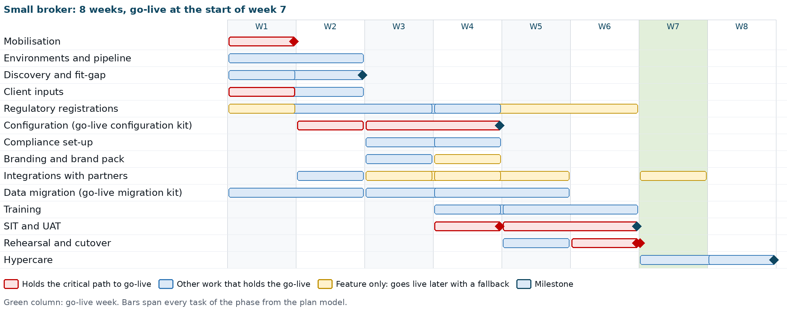
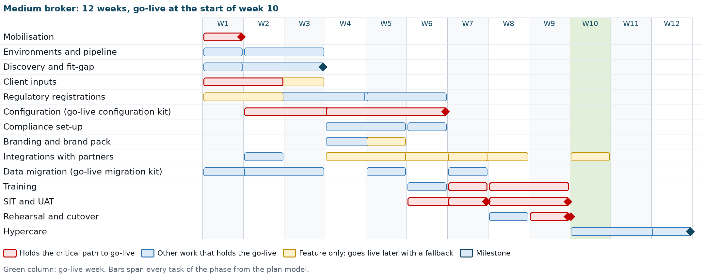
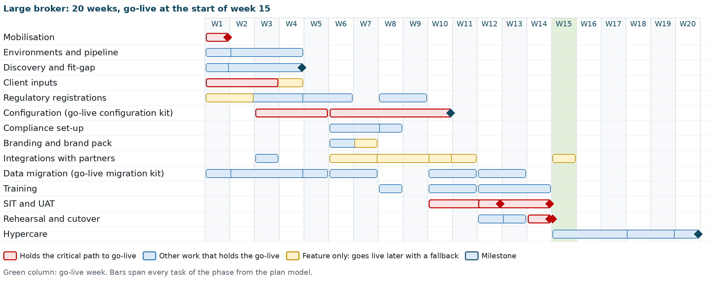
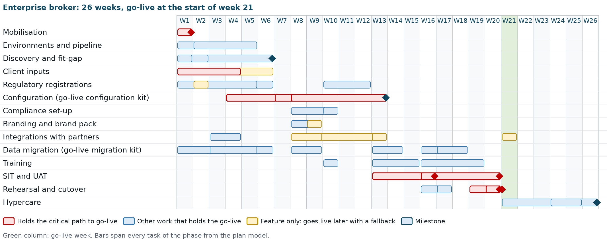

# Introduction

## Purpose

This document describes how iorta TechNXT implements BrokerVerse OOTB for a Philippine non-life insurance broker: the approach, the phases, a week-by-week plan for small, medium, large and enterprise brokers, who does what, how the project is governed, what each phase delivers and how it is accepted, and what is in and out of scope.

## Companion documents

| Document | What it adds |
|---|---|
| `BrokerVerse_Implementation_Plan.xlsx` | The task-level plan of each size: duration, owner party (iorta TechNXT, broker or partner), owner role, deliverable, predecessors, dates from the kick-off date, float and critical path; the milestones; every link; the full RACI |
| BrokerVerse Dependency Map and Critical Path | Diagrams of the dependencies (client inputs, partner certifications, regulatory registrations, environments and keys), the critical path and lead times by size, and what slips when a dependency slips |
| `BrokerVerse_RAID_Log_Template.xlsx` | The RAID log, pre-filled with the risks, assumptions, issues and dependencies typical of an implementation |
| BrokerVerse Data Migration and Cutover Plan | Data objects, templates, load sequence, reconciliation, cutover and rollback |
| BrokerVerse Environment Strategy and Production Rollout | Environment sets, release pipeline, promotion of configuration, cutover runbook T-30 to T+30 |
| BrokerVerse Training Plan | Training per role, including the compliance officer, curriculum, train-the-trainer, assessment |
| BrokerVerse Philippine Regulatory Compliance Matrix | How the system supports the broker's IC, BIR, AMLA and Data Privacy Act obligations |
| BrokerVerse User Manual | Every screen, for every role |
| Go-live data set-up and workbench (`docs/onboarding/GO_LIVE_DATA_SETUP.md`, `GO_LIVE_DATA_WORKBENCH.md`) | The order of set-up and the use of the configuration and migration kits |
| Release pipeline and deployment (`deploy/RELEASE_PIPELINE.md`, `deploy/README.md`, `deploy/REFERENCE.md`) | GitHub Environments, secrets, deployment, rollback, key rotation |

The plan tables of this document, the workbook and the diagrams come from one plan model (`docs/package/tools/delivery/plan_model.py`), so they agree.

## Audience

The broker's management (sponsor and steering committee), the broker's project manager, the process owners of Sales, Placement and Policy Processing, Client Servicing, Claims and Accounting, the broker's compliance officer and data protection officer, the broker's IT or System Administrator, and the iorta TechNXT head of delivery, project manager and project team.

## Version history

| Version | Date | Change |
|---|---|---|
| 1.0 | 03 October 2026 | Initial issue: three sizes, twelve phases, RACI, governance, deliverables |
| 1.1 | 04 October 2026 | Four sizes (enterprise added) with the environment model; configuration through the go-live configuration kit and migration through the migration kit; new phases for compliance set-up (AML/CFT, IC and NPC registers, masking), branding and the brand pack, integrations with partners (banks, SMS, CTPL authentication and LTO, insurers, BIR EIS, AMLC reporting) and regulatory registrations; GitHub Environments and encryption keys in the environment phase; task-level plan with owners, predecessors and milestones; dependencies and risks aligned with the Dependency Map and the RAID log |

# Implementation approach

## Configure, do not customise

BrokerVerse OOTB is a finished product for Philippine non-life broking. It covers the broking cycle from lead to renewal (leads and their assignment, quotations, requests for quotation, placement slips, cover notes, policy issue, endorsements, cancellations, claims with document checklists and motor repairs, renewals), distribution (channels, dealer programmes, fleets, marine open covers, facultative placements, campaigns), the accounting of a broker (billing, instalments, official receipts and sales invoices, post-dated cheques, collections, remittance to insurers, direct bill, commission and insurer overrides, payables, fixed assets, petty cash, journals, bank reconciliation and bank payment files, month-end and year-end close), the BIR forms and files (2307, 0619-E, 1601-EQ, 1604-E, 2551Q, DAT files, EOPT invoices, EIS connector, CAS books), AML/CFT, the IC and NPC registers, and the integration framework (SMS, CTPL authentication, insurer APIs, bank files). The implementation fits the broker to the product through configuration and master data. It does not change the code.

What the broker sets without code:

| Area | Where in BrokerVerse |
|---|---|
| Company, letterhead, branches, departments | Master > Organization; Master > System Configuration > System Settings |
| Theme, logo, sign-in picture, branded documents and e-mails, e-signatures, brand packs | Master > System Configuration > System Settings > Theme and Branding; Signatories; My Profile > My e-signature |
| Users, roles, reporting lines, authority limits | Master > User Management (User, Role, User Access Matrix, Role Permissions, Authority Matrix, Delegations, Segregation of Duties, Access Reviews); Master > Employee Management > Hierarchy |
| Philippine addresses | Master > Location (Country, Province, City / Municipality; regions and barangays from the PSGC) |
| Insurers, lines of business, products, covers, vehicles, distribution channels | Master > Insurance Management |
| Product templates, rating factors, acceptance rules (refer, decline, loading with authority), document templates with merge fields, market and risk mapping | Product Configurator |
| Commission rates, premium taxes and LGU rates, tax codes with ATC, chart of accounts, account determination, posting rules | Master > Finance |
| Banks, bank accounts, statement formats, bank file layouts, payment gateways | Master > Finance |
| Document numbering, business rules, limits, maker-checker switches, security, go-live settings | Master > System Configuration > Document Numbering, Configuration |
| Scheduled jobs; connectors, message templates, insurer mappings | Master > System Configuration > Schedules, Integrations, Message Templates, Insurer Integration |
| AML/CFT settings, risk factors, monitoring rules, screening lists | Compliance > AML Settings, Screening Lists |
| IC licences, fit and proper, insurer authority, complaints, breach register | Compliance > Insurance Commission; Compliance > Data Privacy (NPC) |
| Masking of personal identifiers by role | Role permission `view:pii`; settings `privacy.masking_enabled`, `privacy.pii_reveal_mode` |

A requirement that cannot be met by configuration, master data or a change in the broker's procedure is a gap. Gaps are recorded in the fit-gap register and handled through the change request process (chapter Change request process). They do not enter the go-live scope unless the steering committee approves them as a change request.

## Principles

- **Product first.** The process walk-throughs use the delivered screens with the broker's own examples. The broker adapts a procedure before anyone asks for a change.
- **Data drives the timeline.** The insurer, product and commission data and the chart of accounts are on the critical path for every size. Requests for data and the blank kits go out in week 1.
- **Two kits, loaded again and again.** Configuration moves through the configuration kit and migration through the migration kit (Master > Go-Live and Data > Go-Live Data Load): validate as a trial run, correct with the errors workbook, load, and load again without duplicates. The same kit promotes configuration from Dev or SIT to UAT and Production.
- **Key users own the result.** Each team names one key user who takes part in discovery, tests the configuration, runs UAT and trains the team.
- **Registrations start on day one.** BIR, AMLC, NPC and IC items have lead times outside the project's control; they are confirmed or started at kick-off.
- **Partners certify, the product waits in test mode.** Every connector works in test mode until the partner certifies it; a partner that is late does not stop the go-live when a fallback exists.
- **Evidence for every acceptance.** Each phase ends with named deliverables and acceptance criteria. Sign-off is written.

## Implementation sizes

The size follows the number of named users, as in the Service Catalogue and Rate Annex. The other figures are a typical profile (assumption); the steering committee confirms the size at mobilisation once the data volumes are known.

| Size | Named users | Typical profile (assumption) | Environments | Duration to hypercare exit | Go-live |
|---|---|---|---|---|---|
| Small | 1 to 25 | One office, up to 10 insurers, up to 5,000 in-force policies | Dev, UAT, Production; Pre-Prod temporary | 8 weeks | Start of week 7 |
| Medium | 26 to 100 | Up to 3 offices, up to 25 insurers, up to 25,000 in-force policies, co-insurance | Dev, UAT, Production; Pre-Prod temporary | 12 weeks | Start of week 10 |
| Large | 101 to 300 | Several branches, many insurers, more than 25,000 in-force policies, several bank accounts, referrer networks | Dev, SIT, UAT, Production with high availability; Pre-Prod temporary | 20 weeks (16-week variant possible) | Start of week 15 |
| Enterprise | Above 300 | National network, bank-affiliated or group broker, dealer programmes and fleets | As large, with a cross-region copy of the backups | 26 weeks, planned at mobilisation | Start of week 21 |

An import file holds at most 20,000 data rows (`IMPORT_MAX_ROWS`). Larger books are loaded in several files, which the large and enterprise plans allow for.

## Environment model

The environment set follows the broker size (decision of the product owner, 04 October 2026).

| Size | Where configuration is built and SIT runs | Where mock loads run | Where UAT and training run | Pre-Prod |
|---|---|---|---|---|
| Small and medium | Dev: configuration build, integration and system integration test with synthetic data only | UAT | UAT | Temporary: created from a production backup for the cutover rehearsal, removed after hypercare |
| Large and enterprise | Dev for development and integration; SIT for configuration, system integration test and the first mock loads | SIT, then UAT | UAT (separate from SIT) | Temporary, as above |

One build is promoted unchanged through the environments by the release pipeline (`ci.yml`, `deploy.yml`, `rollback.yml`): Dev automatically from the integration branch, SIT by hand, UAT on a release candidate tag, Pre-Prod by hand, Production on a release tag with two approvers.

# Phases

## Overview

| # | Phase | What happens |
|---|---|---|
| 1 | Mobilisation | Kick-off, team and governance, plan confirmed, data request and kits issued, hosting and environment set decided |
| 2 | Environments and pipeline | Dev, SIT (large, enterprise), UAT and Production; GitHub Environments with reviewers and secrets; application secrets and encryption keys with their custody; first deployment through the pipeline |
| 3 | Discovery and fit-gap | Process, compliance, integration and branding workshops on the delivered system; configuration decisions; fit-gap register |
| 4 | Client inputs | The broker fills the configuration kit, provides the partner contracts and prepares the migration extracts |
| 5 | Regulatory registrations | BIR ATP or CAS and EIS enrolment; AMLC registration; IC licence data; NPC registration; screening lists; tax adviser confirmation |
| 6 | Configuration | Configuration kit validated and loaded; on-screen configuration (Product Configurator, tax codes, posting rules, approvals, roles, schedules) |
| 7 | Compliance set-up | AML/CFT settings, risk factors and rules, screening lists; licence register, fit and proper, insurer authority; complaints and breach settings; masking by role |
| 8 | Branding and brand pack | Theme, letterhead, sign-in page, branded documents and e-mails, e-signatures mapped to documents, brand pack exported for promotion |
| 9 | Integrations with partners | E-mail; bank statement formats and bank payment files; SMS or Viber; CTPL authentication and LTO; insurer APIs; payment gateway; BIR EIS; AMLC report file |
| 10 | Data migration | Mapping to the migration kit, mock loads with reconciliation |
| 11 | Training | Train-the-trainer, compliance officer and DPO training, end-user training per role |
| 12 | SIT and UAT | System integration test in Dev or SIT; UAT with the broker's data; sign-off |
| 13 | Rehearsal and cutover | Release to Production; Pre-Prod from a production backup; rehearsal; go/no-go; cutover; go-live lock |
| 14 | Hypercare | Close support until the first month-end close; handover to production support |

## Mobilisation

- Kick-off meeting with the sponsor, the broker's project manager, the key users, the compliance officer, the DPO and the iorta TechNXT team.
- Confirm the size, the plan, the go-live date and the hypercare window; baseline the plan workbook with the kick-off date.
- Set up the steering committee, the weekly status meeting and the RAID log, pre-filled from the template.
- Issue the data request list and the blank kits (configuration workbook, migration workbook, upload templates).
- Ask which registrations the broker already holds (ATP or CAS, AMLC registration, NPC registration, IC licences) and start the others the same day.
- Decide the hosting option, the environment set and the data location, including any transfer of personal data outside the Philippines.

## Environments and pipeline

- iorta TechNXT provisions the environment set of the size following `deploy/README.md` and the Environment Strategy and Production Rollout: database time zone Asia/Manila, daily snapshots kept at least 30 days, health checks wired to monitoring, a restore test before go-live.
- **GitHub Environments** `dev`, `sit`, `uat`, `preprod` and `production` are set once by the repository owner: required reviewers on `uat`, `preprod` and `production` (production: two, prevent self-review), tag rules, variables (`DEPLOY_ENABLED`, targets, addresses, environment name) and environment secrets (deploy keys, known hosts, bucket and distribution ids). Repository-level secrets of the same names are removed.
- **Application secrets** live in the secret store of each environment, never in GitHub or the repository: `JWT_SECRET`, `DATA_ENCRYPTION_KEY`, `PII_ENCRYPTION_KEY` (each at least 32 characters and different from the others), `DATABASE_URL`, `SMTP_URL` and the partner credentials. The API refuses to start in production without them.
- **Key custody.** `PII_ENCRYPTION_KEY` encrypts TIN, government ID and bank account numbers; without it a backup cannot be read. The broker IT head and the iorta TechNXT DevOps lead sign a custody record: who holds the escrow copy under dual control, where it is kept with the backups, and the rotation procedure of `deploy/REFERENCE.md`.
- Production starts with reference data only (`SEED_SAMPLE_DATA=false`). Dev may carry the delivered sample data; UAT holds the broker's data from the first mock load and is then protected as Production is.

## Discovery and fit-gap

Discovery is limited to configuration. Each workshop shows the delivered screens with the broker's own examples and records the decisions in the configuration workbook.

| Workshop | Participants | Decisions recorded |
|---|---|---|
| Organisation and access | Sponsor, System Administrator | Companies, branches, departments, reporting lines, users per role, two-step verification roles, security policy, `view:pii` per role |
| Sales, distribution and placement | Sales & Marketing, Processing Team | Lead assignment rules, channels, dealer programmes, placement journey per line, quotation validity, maker-checker, product templates, acceptance rules and authority, document templates |
| Policy servicing and renewals | Operations, Processing Team | Endorsements, cover notes, cancellation method (pro-rata, short-period), renewal timetable, fleets and open covers |
| Claims | Claims | Claims controls, document checklist, repair shops and letters of authority, settlement maker-checker |
| Billing, collection and remittance | Accounting, Accounting Manager | Billing mode per insurer, instalments, post-dated cheques, premium payment warranty, remittance terms and approval levels, bank payment files |
| Commission and incentives | Accounting, Sales & Marketing | Commission rules, rate matrix, referrer withholding, payout conditions, insurer overrides |
| Ledger, close and tax | Accounting Manager, tax adviser | Chart of accounts, account determination, posting rules, payables, fixed assets, close checklist, tax codes and ATC, BIR forms, EOPT invoices, CAS books, EIS |
| Compliance | Compliance officer, DPO | AML/CFT risk factors, thresholds, monitoring rules, screening lists and provider; licence register; insurer authority check (warn or block); complaints deadlines; breach procedure |
| Integrations | IT head, Accounting, Operations | Banks and their file layouts, SMS or Viber provider, CTPL authentication provider and LTO feed, insurer APIs, payment gateway, EIS, AMLC reporting |
| Branding | Sponsor, marketing | Theme, logo, sign-in picture, document and e-mail branding, signatories and their e-signatures, brand pack, permission for any client marks |

Output: the configuration workbook and the fit-gap register. Each register line is classed as Fit (delivered), Configure (setting or master data), Procedure (the broker changes how it works) or Gap (needs a change request).

## Client inputs and the configuration kit

The broker fills the configuration kit with the consultants: company, settings, PSGC regions, provinces, cities and barangays, branches, departments, hierarchy, designations, users, currencies, exchange rates, chart of accounts, banks, bank accounts, signatories, transaction codes, write-off reasons, insurers, lines of business, products, policy types, covers, vehicles, suppliers, asset classes, short-period rates, cancellation reasons, claim document checklist, repair shops, commission rates, premium taxes, LGU rates, authority limits, numbering, payee bank accounts and COC series. User passwords are never in the workbook: each new user receives a temporary password once, after the load.

## Regulatory registrations

| Registration | Owner | What it unlocks |
|---|---|---|
| BIR Authority to Print or CAS registration; registered serial range; last numbers used | Accounting Manager with the tax adviser | Sales invoices (`invoice.*`), numbering, CAS books; release to Production |
| BIR EIS enrolment (when covered) | Accounting Manager | EIS connector live; until then it stays off |
| AMLC registration, portal access, institution code | Compliance officer | CTR and STR filing; go/no-go |
| IC licence data and insurer certificates of authority | Compliance officer | Licence register, payout check, insurer authority check |
| NPC registration of the DPO and data processing systems | DPO | Go/no-go |
| Screening lists (UN, AMLC; PEP list licence) | Compliance officer | Screening at onboarding, issue and payout; go/no-go |
| Tax adviser confirmation of codes, ATC, rates and wording | Tax adviser | UAT sign-off |

Lead times are assumptions; the Dependency Map and Critical Path gives them by size with their float.

## Configuration

Configuration follows `GO_LIVE_DATA_SETUP.md` steps 1 to 12. The configuration kit is uploaded on Master > Go-Live and Data > Go-Live Data Load, validated as a trial run, corrected with the errors workbook and loaded, first in Dev (small, medium) or SIT (large, enterprise). The items without a sheet are set on their screens:

| Item | Screen |
|---|---|
| Roles, permissions (including `view:pii`), segregation of duties, delegations, access reviews; approval of the loaded authority limits | Master > User Management |
| Product templates, rating factors, acceptance rules with refer, decline and loading and the authority to override, document templates with merge fields, market and risk mapping, the governing template of each product, the motor tariff | Product Configurator |
| Tax codes and ATC; account determination and posting rules (approved by a second user) | Master > Finance > Taxation, Account Determination, Posting Rules, Configuration Approvals |
| Statement formats, bank transaction types, insurer statement formats, close checklist, bank file layouts, payment gateways | Master > Finance |
| Settings, schedules, connectors, message templates, insurer mappings | Master > System Configuration |
| Fiscal years and periods (periods before the cutover date closed) | Accounts > Period End > Period Management |
| Remittance masters, reinsurance treaties, incentive programmes, referrer accounts, petty cash funds | Their screens |

The delivered data already holds the PSGC addresses, ZIP codes, banks, ID types, holidays, the IC insurer list, Philippine lines of business and products, the motor tariff, the tax codes (VAT 12%, DST PHP 0.50 on each PHP 4.00 or fraction, LGT and expanded withholding codes with ATC) and a Philippine broker chart of accounts. Configuration therefore reviews and adjusts more than it builds. When frozen, configuration moves to UAT and Production as a **Current data** workbook of the source environment, and the comparison report shows the target mirrors the source.

## Compliance set-up

- **AML/CFT:** AML Settings (covered transaction threshold, cash modes, CTR and STR working days, match threshold, risk score limits, KYC refresh months, beneficial owner threshold, retention, institution code), risk factors, monitoring rules, screening provider; the screening lists loaded and every client rescreened. The values delivered follow the AMLA and its rules as known at delivery: the compliance officer confirms them.
- **Insurance Commission:** licence register (firm, officers, licensed individuals, agents), fit and proper records, insurer certificates of authority; `compliance.referrer_licence_check` (block delivered) and `compliance.insurer_authority_check` (warn delivered, block once every certificate is entered); IC line mapping for the production report and account mapping for the annual statement.
- **Complaints:** channels, categories, deadlines (`complaints.*`), letter texts; confirmed against the IC rules in force.
- **Data privacy:** breach register owner and the 72-hour deadline settings, privacy notice version, masking of personal identifiers by role, consent rules for messages.

## Branding and brand pack

The System Administrator brands UAT on Theme and Branding (theme, sign-in page, documents and reports, e-mail, name and images), captures the signatories' e-signatures with their consent and maps signatures to documents. The brand pack is exported and imported in Production with the configuration kit. A client brand pack that carries a third party's marks (for example the Toyota Insurance Services pack) is applied only in that client's environments and only with its written permission on file.

## Data migration

The detail is in the Data Migration and Cutover Plan. In outline:

- The migration kit holds clients, in-force policies, open items, open claims and the GL opening balances as at the cutover date (`golive.cutover_date`). Migrated records keep their old numbers and post nothing; every validation shows a reconciliation of rows and totals.
- The broker extracts and cleanses the data; iorta TechNXT maps it with the broker, runs the loads with the broker and checks the reconciliation.
- Mock loads: small and medium, two in UAT; large, two in SIT and one in UAT; enterprise, two in SIT and two in UAT. Each runs on a fresh extract after a transaction reset. The cutover rehearsal in Pre-Prod is the last load before cutover for every size.

## Integrations with partners

Every connector is delivered in test mode, so the process can be tested before the partner contract is signed. What is certified with each partner is done during onboarding with that partner.

| Integration | Delivered | Implementation work | If the partner is late |
|---|---|---|---|
| E-mail | Outgoing mail through the broker's SMTP mailbox, queued in the E-mail Outbox; branded layout | Mailbox and credentials, sender, texts; password reset and approval link tested | Holds the go-live |
| Bank statements | Statement import with delivered formats; remittance bank transactions import | One statement per account imported with a balancing preview | Manual bank items |
| Bank payment files | Starter layouts for BDO, BPI, Metrobank, Landbank, UnionBank and a generic CSV; status file import | Each layout validated against the bank's current specification and a test file accepted by the bank | Cheques and manual transfers |
| SMS or Viber | Connectors SMS_SEMAPHORE, SMS_GLOBE_LABS, SMS_GENERIC, VIBER_BUSINESS; message templates with consent check | Provider account, sender name, credentials in the secret store, live test | E-mail notices; SMS jobs stay off |
| CTPL authentication and LTO | CTPL_AUTH and LTO_FEED connectors; COC series; authentication at issue | Accreditation with the IC-accredited provider, COC series loaded, one COC authenticated live | Enter code from the provider portal |
| Insurer systems | INSURER_API connector with a mapping per insurer; claim status file | Mapping, preview, test issuance and claim status with each insurer | Record Issued Policy; claim status file |
| Payment gateway | PayMongo and Dragonpay, and a sandbox provider | Merchant account, credentials, notification address; sandbox then live test payment | Bank transfer, cheque, cash |
| BIR EIS | EIS connector (off by default), test mode with a built-in fake provider | Test submissions; live after the BIR enrolment | Connector off; earlier invoices queued later |
| AMLC reporting | CTR and STR report files (BV-AMLC-TXN 1.0) | Portal access; test file checked against the portal requirements | Holds the go-live |

## Training

Train-the-trainer for the key users first, then end-user training per role, delivered by the key users with iorta TechNXT present. The compliance officer, the DPO and the System Administrator are trained by iorta TechNXT on the compliance and privacy screens. The Training Plan gives the curriculum and durations.

## System integration test

iorta TechNXT runs the end-to-end flows across all roles with the configured masters: in Dev with synthetic data for a small or medium broker, in SIT with the migrated data of the latest mock load for a large or enterprise broker. The test follows the end-to-end plan (`docs/e2e/E2E_TEST_PLAN.md`), the scripted scenario `backend/scripts/uat-scenario.js` and the release test cases for the compliance, BIR and integration features, with every connector in test mode. Defects are logged with the request ID shown in error messages.

## User acceptance test

Key users run `docs/onboarding/UAT_SCRIPTS.md` with the broker's own products, insurers and data, plus the scenarios agreed in discovery for the features the broker uses: client onboarding with screening and EDD, transaction alerts and a CTR file, licence and insurer authority checks, a complaint and a breach record, BIR forms and a sales invoice, bank payment files, CTPL authentication and the branded documents. Each scenario is marked Pass or Fail with date, name and, for a failure, the record number and request ID.

## Rehearsal, cutover and go-live

- The release tag and the frozen configuration go to Production before the rehearsal; the production smoke test is followed by a transaction reset.
- Pre-Prod is restored from a production backup with its own secrets, e-mail off and the scheduler stopped; it is masked with `mask:data --remark-copy` first when people without production access take part.
- The rehearsal runs the transaction reset, the migration load of a fresh extract, the reconciliation, the go-live lock on and off, and the comparison against Production, each step timed.
- Cutover follows the Data Migration and Cutover Plan: freeze of the old system, final extract and load, reconciliation signed by Accounting and the Accounting Manager, go/no-go 2, then `golive.locked` and `npm run mask:data -- --register-production` in Production.

## Hypercare

The project team stays with the broker after go-live: daily check-in in the first week, then weekly. Hypercare covers the first receipts, remittances, bank imports and payment files, the first month-end close and the first BIR and AMLC filings that fall in the window. It ends with the handover to production support. Default length: 2 weeks (small), 3 weeks (medium), 6 weeks (large and enterprise); if the first month-end close falls after that window, hypercare extends to cover it. Pre-Prod is removed after hypercare exit.

# Timelines by size

## Phases and milestones

| Phase | Small | Medium | Large | Enterprise |
|---|---|---|---|---|
| Mobilisation | W1 | W1 | W1 | W1 |
| Environments and pipeline | W1 to W2 | W1 to W3 | W1 to W4 | W1 to W5 |
| Discovery and fit-gap | W1 to W2 | W1 to W3 | W1 to W4 | W1 to W6 |
| Client inputs | W1 to W2 | W1 to W3 | W1 to W4 | W1 to W6 |
| Regulatory registrations | W1 to W6 | W1 to W6 | W1 to W9 | W1 to W12 |
| Configuration (go-live configuration kit) | W2 to W4 | W2 to W6 | W3 to W10 | W4 to W13 |
| Compliance set-up | W3 to W4 | W4 to W6 | W6 to W8 | W8 to W10 |
| Branding and brand pack | W3 to W4 | W4 to W5 | W6 to W7 | W8 to W9 |
| Integrations with partners | W2 to W7 | W2 to W10 | W3 to W15 | W3 to W21 |
| Data migration (go-live migration kit) | W1 to W5 | W1 to W7 | W1 to W13 | W1 to W18 |
| Training | W4 to W6 | W6 to W9 | W8 to W14 | W10 to W19 |
| SIT and UAT | W4 to W6 | W6 to W9 | W10 to W14 | W13 to W20 |
| Rehearsal and cutover | W5 to W7 | W8 to W10 | W12 to W15 | W16 to W21 |
| Hypercare | W7 to W8 | W10 to W12 | W15 to W20 | W21 to W26 |

| Milestone | Small | Medium | Large | Enterprise |
|---|---|---|---|---|
| Kick-off | Start of W1 | Start of W1 | Start of W1 | Start of W1 |
| Configuration decisions and fit-gap signed | End of W2 | End of W3 | End of W4 | End of W6 |
| Configuration complete | End of W4 | End of W6 | End of W10 | End of W13 |
| SIT exit | End of W4 | End of W7 | End of W12 | End of W16 |
| UAT sign-off | End of W6 | End of W9 | End of W14 | End of W20 |
| Go/no-go | End of W6 | End of W9 | End of W14 | End of W20 |
| Go-live | Start of W7 | Start of W10 | Start of W15 | Start of W21 |
| Hypercare exit and handover | End of W8 | End of W12 | End of W20 | End of W26 |

Integrations run to the go-live week because the EIS connector is switched on after the BIR enrolment; every other partner certification is planned before go-live.

## Small broker (8 weeks)

| Week | Activities | Milestones |
|---|---|---|
| 1 | Kick-off; charter and RAID log; data request and kits issued; team named; hosting decided; Dev and UAT provisioned; GitHub Environments, secrets and keys; all workshops start; insurers, rates, products, chart of accounts and user list provided; registrations confirmed or started (ATP or CAS, EIS, AMLC, IC licences, NPC); extraction starts | Kick-off held |
| 2 | Workshops completed; configuration kit filled; first pipeline deployment; e-mail tested; Production provisioned; partner contracts and COC series; screening lists sourced | Fit-gap register signed |
| 3 | Configuration kit loaded in Dev; on-screen configuration; configuration promoted to UAT; mock load 1 in UAT starts; compliance set-up; branding and brand pack; bank statement imports; partner certifications start (bank files, SMS, CTPL, insurers, gateway) | |
| 4 | Mock load 1 reconciled; configuration completed; SIT in Dev; screening lists loaded; AMLC report file test; compliance officer and DPO training; tax adviser confirmation; EIS in test mode; ATP or CAS in place; train-the-trainer | Mock load 1 reconciled; configuration complete; SIT exit |
| 5 | Release candidate and frozen configuration to UAT; UAT starts; release to Production and smoke test; Pre-Prod from a production backup; mock load 2; end-user training; bank files and insurer APIs certified | Mock load 2 reconciled |
| 6 | UAT completed; end-user training completed; cutover rehearsal in Pre-Prod; go/no-go; cutover at the close of the week | UAT sign-off; go decision |
| 7 | Go-live; daily hypercare; first receipts, remittances and bank imports watched; EIS live once enrolled | Go-live |
| 8 | Hypercare; first month-end close where it falls; knowledge transfer; handover; Pre-Prod removed | Hypercare exit and handover |

## Medium broker (12 weeks)

| Week | Activities | Milestones |
|---|---|---|
| 1 | Kick-off; governance; data request and kits; team named; hosting decided; Dev and UAT provisioned; workshops start; registrations confirmed or started; extraction starts | Kick-off held |
| 2 | GitHub Environments, secrets and keys; first pipeline deployment; e-mail tested; insurers, rates, products and chart of accounts provided; configuration kit filling starts; Production provisioned | |
| 3 | Workshops completed; mapping to the migration kit; partner contracts | Fit-gap register signed |
| 4 | Configuration kit loaded in Dev; on-screen configuration starts; configuration promoted to UAT; compliance set-up; branding; partner certifications start | |
| 5 | Mock load 1 in UAT; bank statement imports; payment gateway; ATP or CAS in place | Mock load 1 reconciled |
| 6 | Configuration completed; SIT cycle 1; screening lists loaded; AMLC report file test; compliance officer and DPO training; tax adviser confirmation | Configuration complete |
| 7 | SIT cycle 2 and exit; promotion to UAT; mock load 2; train-the-trainer; EIS in test mode; bank payment files certified | SIT exit; mock load 2 reconciled |
| 8 | UAT cycle 1; end-user training; release to Production; Pre-Prod; insurer APIs certified | UAT cycle 1 results |
| 9 | UAT cycle 2; end-user training completed; cutover rehearsal in Pre-Prod; go/no-go; cutover | UAT sign-off; go decision |
| 10 | Go-live; daily hypercare; EIS live once enrolled | Go-live |
| 11 | Hypercare; first remittance run and bank reconciliations | Weekly hypercare review |
| 12 | Hypercare; first month-end close supported; knowledge transfer; handover; Pre-Prod removed | Hypercare exit and handover |

## Large broker (20 weeks)

| Week | Activities | Milestones |
|---|---|---|
| 1 | Kick-off; governance; data request and kits; team named; hosting decided; workshops start; registrations confirmed or started; extraction starts | Kick-off held |
| 2 | Dev, SIT and UAT provisioned; GitHub Environments, secrets and keys; Production provisioning starts; partner contracts | |
| 3 | First pipeline deployment to Dev, SIT and UAT; e-mail tested; insurers, rates, products and chart of accounts provided; configuration kit filling starts | Environments ready |
| 4 | Workshops completed; mapping | Fit-gap register signed |
| 5 | Configuration kit filled | |
| 6 | Configuration kit loaded in SIT; on-screen configuration; compliance set-up; branding; bank statement imports; mock load 1 in SIT; partner certifications start | |
| 7 | Mock load 1 reconciled; branding and brand pack completed | Mock load 1 reconciled |
| 8 | Compliance set-up completed; screening lists loaded; AMLC report file test; compliance officer and DPO training; tax adviser review | |
| 9 | Configuration continues; CTPL authentication certified | |
| 10 | Configuration completed; SIT starts; mock load 2 in SIT; train-the-trainer; EIS in test mode; bank payment files certified | Configuration complete |
| 11 | SIT; mock load 2 reconciled; insurer APIs certified | Mock load 2 reconciled |
| 12 | SIT exit; promotion to UAT; UAT starts; mock load 3 in UAT; end-user training (head office); release to Production | SIT exit |
| 13 | UAT; Pre-Prod from a production backup; end-user training (branches) | Mock load 3 reconciled |
| 14 | UAT completed; cutover rehearsal in Pre-Prod; go/no-go; cutover | UAT sign-off; go decision |
| 15 | Go-live for all branches; daily hypercare at head office; floor walkers in the branches | Go-live |
| 16 to 17 | Hypercare; first remittance runs, bank reconciliations, payment files, collection, commission payout and renewal cycles | Weekly hypercare review |
| 18 to 19 | First month-end close and BIR working papers of the first month (timing depends on the go-live date); settings review | First close completed |
| 20 | Knowledge transfer; handover; Pre-Prod removed | Hypercare exit and handover |

All branches go live on one date, because the ledger, the receivables and the amounts due to insurers move to BrokerVerse at a single cutover. A large broker with one office cluster and a simple product mix can follow a 16-week variant: discovery ends in week 4, configuration in week 8, three mock loads (the last as the rehearsal in Pre-Prod), go-live at the start of week 13 and hypercare in weeks 13 to 16 (extended to the first month-end close if needed).

## Enterprise broker (26 weeks)

| Week | Activities | Milestones |
|---|---|---|
| 1 to 2 | Kick-off; governance; data request and kits; team named; hosting decided; Dev, SIT and UAT provisioned; GitHub Environments, secrets and keys; workshops start; registrations confirmed or started; extraction starts | Kick-off held |
| 3 to 5 | First pipeline deployment; e-mail tested; Production provisioned (high availability, cross-region backup copy); insurers, rates, products and chart of accounts provided; configuration kit filling starts; mapping | Environments ready |
| 6 | Workshops completed; partner contracts completed | Fit-gap register signed |
| 7 to 8 | Configuration kit filled and loaded in SIT; on-screen configuration starts; compliance set-up; branding; mock load 1 in SIT starts; partner certifications start | |
| 9 to 12 | Mock load 1 reconciled; on-screen configuration; screening lists loaded; AMLC report file test; compliance officer and DPO training; CTPL authentication certified; tax adviser confirmation | Mock load 1 reconciled |
| 13 | Configuration completed; SIT starts; mock load 2 in SIT; train-the-trainer starts; EIS in test mode; bank payment files and insurer APIs certified | Configuration complete |
| 14 to 15 | SIT; mock load 2 reconciled; train-the-trainer completed | Mock load 2 reconciled |
| 16 | SIT exit; promotion to UAT; UAT starts; mock load 3 in UAT; end-user training starts; release to Production | SIT exit |
| 17 to 18 | UAT; Pre-Prod; mock load 4 in UAT | Mock loads 3 and 4 reconciled |
| 19 to 20 | UAT completed; end-user training completed; cutover rehearsal in Pre-Prod; go/no-go; cutover | UAT sign-off; go decision |
| 21 | Go-live for every branch and channel; daily hypercare; EIS live once enrolled | Go-live |
| 22 to 23 | Hypercare; remittance, bank, payment file, commission and renewal cycles | Weekly hypercare review |
| 24 to 25 | First month-end close and the first BIR and AMLC filings | First close completed |
| 26 | Knowledge transfer; handover; Pre-Prod removed | Hypercare exit and handover |

The enterprise plan is the reference; the actual plan is set at mobilisation with the number of lines of business, insurers, branches and channels.

## Task-level plan

The workbook holds the task-level plan of each size: 77 tasks in 14 phases (fewer for small and medium, which have no SIT environment and fewer mock loads), each with its duration in working days, owner party, owner role, deliverable or evidence, predecessors, start and finish dates from the kick-off date typed on the sheet, float to go-live and whether it is on the critical path. The table below lists the tasks, their owner and what each holds back.

| ID | Task | Party | Owner role | Holds back |
|---|---|---|---|---|
| M1 to M5 | Kick-off; charter, plan, governance, RAID log; data request and kits; broker team named; hosting and environment set | iorta TechNXT; broker | iorta TechNXT PM; broker sponsor | Go-live |
| E1 to E7 | Dev, SIT, UAT provisioned; GitHub Environments; secrets and keys with custody; first pipeline deployment; Production with backups and restore test | iorta TechNXT | DevOps lead | Go-live |
| D1 to D5 | Process, compliance, integration and branding workshops; fit-gap signed | iorta TechNXT; broker | Consultants; process owners | Go-live |
| I1 to I10 | Insurers and rates; chart of accounts; user list; SMTP; banks; partner contracts; COC series; images and signatories; training rooms; UAT testers | Broker | Key users, Accounting Manager, System Administrator, IT head, PM | Go-live, except partner contracts and COC series (feature only) |
| R1 to R8 | ATP or CAS; EIS enrolment; AMLC registration; IC licence data; NPC registration; tax adviser confirmation; screening lists; permission for client marks | Broker | Accounting Manager, compliance officer, DPO, tax adviser, sponsor | Go-live, except EIS and client marks (feature only) |
| C1 to C5 | Configuration kit filled and loaded; on-screen configuration; promotion to UAT for mock 1; configuration complete | Broker; iorta TechNXT | Key users; consultants | Go-live (critical path) |
| K1 to K3 | Compliance set-up; screening lists loaded; AMLC report file test | iorta TechNXT; broker | Consultant; compliance officer | Go-live |
| B1, B2 | Branding, e-signatures and brand pack; client brand pack with permission | iorta TechNXT | Consultant | Go-live; client pack feature only |
| N1 to N9 | E-mail; bank statements; bank payment files; SMS; CTPL and LTO; insurer APIs; payment gateway; EIS test and live | iorta TechNXT; partner | DevOps lead, consultants; banks, providers, insurers | E-mail and statements: go-live; the others feature only |
| G1 to G6 | Extraction and cleansing; mapping; mock loads 1 to 4 | Broker; iorta TechNXT | Data owners; migration lead | Go-live |
| L1 to L3 | Train-the-trainer; compliance officer and DPO training; end-user training | iorta TechNXT; broker | Consultants; key users | Go-live |
| T1 to T5 | SIT; SIT exit; promotion to UAT; UAT; UAT sign-off | iorta TechNXT; broker | Test lead; key users; sponsor | Go-live (critical path) |
| X1 to X6 | Release to Production; Pre-Prod; rehearsal; go/no-go 1; cutover; go-live | iorta TechNXT; broker | DevOps lead, migration lead; steering committee | Go-live (critical path) |
| H1 to H3 | Hypercare; first month-end close; handover | iorta TechNXT; broker | PM; Accounting Manager; support manager | Hypercare exit |

The critical path is the same for every size: client data for the configuration kit, configuration, SIT, UAT, rehearsal, go/no-go, cutover. The Dependency Map and Critical Path shows it per size with the near-critical tasks and the effect of each late dependency.

# Roles and responsibilities

## Project roles

| Role | Party | Responsibilities |
|---|---|---|
| Project sponsor | Broker | Chairs the steering committee; approves scope, change requests, go/no-go; permission for any client marks |
| Project manager | Broker | Plans the broker's work, obtains data, decisions and registrations, runs UAT and training logistics |
| Process owners and key users | Broker | One per team; take part in discovery, fill the configuration kit, test, train their team |
| System Administrator | Broker | Users, roles, masters, settings, branding and loads after go-live; second line of support |
| Accounting Manager | Broker | Chart of accounts, posting rules, tax set-up, ATP or CAS, EIS enrolment, opening balances, close; signs off the financial reconciliation |
| Compliance officer | Broker | AML/CFT programme and settings, screening lists, AMLC registration and filings, IC licences, complaints |
| Data protection officer | Broker | NPC registration, privacy notice, masking approvals, breach register, privacy impact assessment |
| IT head | Broker | Hosting decision, partner credentials in the secret store, key custody with iorta TechNXT, network and devices |
| Tax adviser | Broker | Confirms tax codes, ATC, rates, invoice and receipt wording |
| Partners | Banks, SMS provider, CTPL authentication provider, insurers, payment gateway | Certify their interface with the broker |
| Head of delivery | iorta TechNXT | Delivery quality and resources; steering committee member when cost or the go-live date is at stake |
| Project manager | iorta TechNXT | Plan, RAID log, dependencies, status reports, steering committee papers |
| Functional consultants | iorta TechNXT | Discovery, configuration, compliance set-up, branding, SIT, training of key users, UAT support |
| Migration lead | iorta TechNXT | Mapping, mock loads, reconciliation, rehearsal, cutover loads |
| Technical and DevOps lead | iorta TechNXT | Environments, pipeline, GitHub Environments, secrets and keys, connectors, backups, monitoring, Pre-Prod, cutover execution |

## RACI

R = Responsible, A = Accountable, C = Consulted, I = Informed. The full matrix, with the broker compliance officer and DPO and the partners as separate columns, is in the workbook.

| Activity | iorta TechNXT PM | iorta TechNXT team | Broker sponsor and PM | Broker key users, IT, compliance |
|---|---|---|---|---|
| Project plan and governance | R | Consultants C Technical C | Sponsor A PM R | Key users I IT I |
| Data request, kits and extraction | C | Consultants C | PM A | Key users R IT R |
| Discovery workshops | A | Consultants R | PM R | Key users R Compliance C |
| Configuration decisions | C | Consultants R | PM A | Key users R IT C |
| Configuration kit and on-screen configuration | A | Consultants R Technical C | PM C | Key users R IT R |
| Environments, pipeline, backups, monitoring | A | Technical R | PM I | IT C |
| Encryption keys and their custody | I | Technical R | PM I | IT A |
| Regulatory registrations | I | Consultants C | Sponsor A PM R | Accounting Manager R Compliance R |
| Compliance set-up | I | Consultants R | PM C | Compliance A |
| Branding, e-signatures, brand pack | A | Consultants R | Sponsor C PM C | IT R |
| Mock loads and reconciliation | A | Consultants R Technical R | PM C | Key users R Accounting Manager R |
| Partner integrations | C | Consultants R Technical R | PM A | IT R Partners R |
| System integration test | A | Consultants R Technical R | PM I | Key users C |
| UAT execution and sign-off | C | Consultants C | Sponsor A PM R | Key users R Compliance R |
| Training | A (TTT) | Consultants R | PM A (end users) | Key users R |
| Cutover execution | A | Consultants R Technical R | PM R | Key users R IT R |
| Go/no-go decision | C | Consultants C Technical C | Sponsor A PM R | Key users C Compliance C |
| Hypercare and handover | A | Consultants R Technical R | PM R | IT R |

# Governance

## Steering committee

| Item | Detail |
|---|---|
| Members | Broker sponsor (chair), broker project manager, Accounting Manager, compliance officer, a business head; iorta TechNXT account manager and project manager, with the head of delivery when cost or the go-live date is at stake |
| Frequency | Every two weeks, plus a meeting for each go/no-go |
| Inputs | Status report, milestone tracker, RAID log extract, dependencies due and late, change requests for decision |
| Decisions | Scope, change requests, plan changes, phase acceptance, go/no-go, hypercare exit |

## Weekly status

A weekly meeting of both project managers and the leads, with a written status report: progress against the plan, milestones due and done, decisions needed, top risks and issues, dependencies due in the next two weeks (data, registrations, partner certifications), next week's activities. Status uses green, amber and red against the baselined plan.

## RAID log

One shared log of risks, assumptions, issues and dependencies, kept by the iorta TechNXT project manager and reviewed in every weekly status meeting. The template is pre-filled with the risks, assumptions and dependencies typical of an implementation, including partner certification, list licences for screening, tax adviser confirmations, regulatory registrations, key custody and data quality of the migration.

| Field | Content |
|---|---|
| ID, type | R, A, I or D with a running number |
| Description | What it is and its effect on scope, time or quality |
| Owner | One named person |
| Rating | Probability and impact for risks (score and High, Medium, Low); impact for issues |
| Action and due date | Mitigation or resolution and when |
| Status | Open, in progress, closed; closure date |

High items go to the steering committee. A dependency on the critical path late by 3 working days, or any dependency late by more than its float, is escalated with its effect on the go-live.

# Deliverables and acceptance criteria

| Phase | Deliverables | Acceptance criteria |
|---|---|---|
| Mobilisation | Project charter, baselined plan workbook, RAID log, data request list, blank kits, governance calendar | Charter and plan signed by both project managers and the sponsor |
| Environments and pipeline | Environment set of the size, environment sheet (addresses, backups, monitoring, GitHub Environments), key custody record | Smoke test passed on each; restore test done once; key custody record signed |
| Discovery and fit-gap | Configuration workbook, fit-gap register | Every process walked through; every register line classed and owned; signed by the process owners |
| Configuration | Configuration kit loaded in Dev or SIT and promoted to UAT; configuration workbook updated | Batches Loaded without errors; each item of `GO_LIVE_DATA_SETUP.md` set; test quotation premiums and taxes agree with manual calculations; comparison report shows UAT mirrors the source |
| Compliance set-up | AML settings, risk factors, rules, screening lists; licence register, fit and proper, insurer authority; complaints and breach settings; role masking | Compliance officer and DPO confirm the settings in writing; every client screened; CTR test file generated |
| Branding | Theme, documents, e-mails, e-signatures, brand pack | Sample documents and e-mails approved by the sponsor; permission on file for any client marks |
| Data migration | Mapping sheets, filled migration kits, load history, reconciliation workbooks of each mock load | Counts and totals agree within the agreed tolerance (default: exact); trial balance as at the cutover date agrees with the old system |
| Integrations | E-mail, bank statement formats, and each partner integration in scope | Password reset e-mail received; one statement per account imported; for each partner in scope, the certification of the Dependency Map passed or its fallback agreed at go/no-go |
| Training | Training schedule, attendance lists, assessment results | Every user trained in the role before go-live; key users pass at 90% |
| SIT | SIT plan, results, defect log, SIT exit report | All end-to-end flows passed; no open severity 1 or 2 defect |
| UAT | UAT results per script, defect log, UAT Sign-off Certificate | All scripts passed or accepted with a workaround; sign-off by each process owner and the sponsor |
| Rehearsal and cutover | Rehearsal log with timings, cutover checklist, final reconciliation, go/no-go minutes | Go/no-go criteria of the Data Migration and Cutover Plan met; registrations of the Dependency Map in place |
| Go-live | Production in use; go-live communication | Users signed in and transacting; first receipts, remittances and bank imports processed |
| Hypercare | Hypercare log, first month-end close support, configuration baseline, handover pack | No open severity 1 or 2 issue; first close completed; handover accepted by production support and the System Administrator |

A deliverable is deemed accepted when the broker has not raised a written objection within 5 business days of submission, as the Statement of Work provides.

# Assumptions

- The implementation is OOTB: the broker uses the delivered screens, workflows, reports and printed documents.
- The broker names a project manager and one key user per team, available at least 50% of their time during discovery, UAT and cutover, an Accounting Manager, a compliance officer and a DPO.
- The broker provides complete and cleansed data in the delivered kits by the dates in the plan.
- Decisions in discovery are made within 3 business days of each workshop.
- The broker holds, or obtains in the lead times of the Dependency Map, its BIR ATP or CAS registration, its AMLC registration, its NPC registration and the IC licences of the firm, officers and agents.
- The broker contracts its partners (banks for payment files, SMS provider, CTPL authentication provider, insurers for APIs, payment gateway) and obtains the screening lists and any PEP list licence.
- iorta TechNXT hosts the environment set of the size and the temporary Pre-Prod on AWS (region ap-southeast-1), priced per environment. Other hosting is priced separately and provides the same set.
- Workshops and training are delivered on site in Metro Manila or online, in English, during Philippine business hours.
- One legal entity and one fiscal year are migrated; opening balances are taken at a single cutover date.
- The broker uses the delivered roles: System Administrator, Sales & Marketing, Processing Team, Operations, Claims, Accounting, Accounting Manager and Compliance Officer (AML/CFT).
- The delivered tax codes, rates, BIR forms and AML values are confirmed by the broker's tax adviser and compliance officer before go-live.

# Exclusions

The following are outside the OOTB implementation. Any of them can be quoted separately through a change request.

- Customisation of screens, workflows, reports, printed documents or the database, and new reports beyond the Report Builder.
- Connectors other than those delivered (SMS, Viber, CTPL authentication, LTO feed, insurer API, bank files, payment gateways PayMongo and Dragonpay, BIR EIS), for example core banking, accounting packages, BIR eFPS or eBIRForms filing, or an IC system.
- The partner's own work and fees: bank file certification fees, SMS and gateway fees, CTPL authentication fees, insurer API access.
- Data cleansing, de-duplication and enrichment of the broker's data, and extraction from the old system.
- Migration of closed or expired policies, settled claims, paid receivables, transaction history and documents, and more than one fiscal year of balances.
- Screening list content and PEP list licences; no list content is delivered with BrokerVerse.
- Hardware, end-user devices, networks, browsers and office software.
- Regulatory filings and registrations: BIR returns, alphalists and DAT files, CAS registration, ATP, EIS enrolment, IC reports and licences, NPC registration and breach notifications, AMLC registration and reports. The system prepares them; filing remains with the broker.
- Tax, legal, actuarial, AML or audit advice.
- Translation of the screens.
- Training beyond the curriculum of the Training Plan and training of users added after go-live.
- Support after hypercare, which is covered by the production support agreement.

# Dependencies on the broker

| Dependency | Needed by (Small / Medium / Large / Enterprise) |
|---|---|
| Named project manager, key users, Accounting Manager, System Administrator, compliance officer and DPO | W1 for every size |
| Hosting option, environment set and data location decision | W1 |
| Insurer list and agreements, commission and referrer rates, product list; chart of accounts and mapping | W1 / W2 / W3 / W4 (critical path) |
| User list with roles, branches and reporting lines | W1 / W2 / W3 / W3 |
| SMTP mailbox; bank accounts, statement samples, payee accounts | W1 to W2 / W2 / W2 to W3 / W2 to W3 |
| Partner contracts and credentials; COC series | W2 / W3 / W4 / W6 |
| BIR ATP or CAS and the invoice serial range; last numbers used | W4 / W5 / W6 / W6 |
| AMLC registration and portal access; screening lists and PEP licence | W3 / W4 / W4 / W5 |
| IC licence data and insurer certificates; NPC registration | W2 to W4 / W2 to W5 / W3 to W6 / W3 to W6 |
| Tax adviser confirmation | W4 / W6 / W9 / W12 |
| Migration extracts in the kit | Before each mock load and at cutover |
| Training rooms, devices and attendance; UAT testers and sign-off authority | Before training and UAT |
| Freeze of the old system and final extract | Cutover |
| Decisions on the fit-gap register and change requests | Within 3 business days |

The Dependency Map and Critical Path gives the float of each dependency and what moves when it is late.

# Risks and mitigations

The RAID log template is pre-filled with these risks and with their scoring; the list below is the summary.

| Risk | Effect | Mitigation |
|---|---|---|
| Insurer, product, commission or chart of accounts data late | Configuration and every later phase slip day for day | Data requests in week 1; kits handed out at kick-off; data readiness tracked weekly; escalation after 3 days |
| Poor data quality in the old system | Rejected rows; balances do not reconcile | Mock loads on fresh extracts; errors workbook; the broker cleanses at source |
| Partner certification late (bank files, CTPL authentication, insurer APIs, SMS, gateway) | Feature not live at go-live | Contracts in week 1 to 2; connectors in test mode; fallbacks agreed at go/no-go |
| Registration late (ATP or CAS, AMLC, NPC) | Go-live moves; invoices or filings not possible | Confirm or start on the kick-off day; tracked as dependencies with the broker owner |
| Screening list licence not obtained | Screening incomplete at go-live | UN and AMLC lists loaded first; PEP list licence started after the compliance workshop |
| Tax adviser confirmation late | VAT, withholding or invoice wording wrong | Review booked in the configuration phase; UAT sign-off depends on it |
| Encryption key lost or not escrowed | Backups unreadable; personal identifiers lost | Key custody record before Production is provisioned; key kept with the backups; rotation procedure |
| Client marks used without permission | Trademark exposure | Client brand pack applied only with written permission on file |
| Requests for customisation | Scope and timeline grow | Configure-first; fit-gap classes; change request process |
| Key users unavailable | Decisions late; weak UAT and training | Named key users with committed time; backups named |
| Opening balances and open items do not agree | Ledger wrong from day one | Reconciliation in every load; Accounting Manager signs off |
| First month-end close outside hypercare | Close issues found late | Hypercare extends to the first close |

# Change request process

A change request covers any change to the agreed scope, plan or deliverables, including any gap from the fit-gap register.

1. The requester writes the change request: description, reason, business impact, priority.
2. The iorta TechNXT project manager logs it and, within 5 business days, returns an impact assessment: effort, cost, effect on the timeline and on other deliverables, and whether it can be met by configuration instead.
3. The broker project manager reviews the assessment with the process owner.
4. The steering committee approves, rejects or defers it. Changes that affect cost or the go-live date need the sponsor's written approval.
5. An approved change request is added to the plan and the RAID log and is tracked to closure.
6. A rejected or deferred change request stays in the log with the reason.

Customisation approved through a change request is built, tested and released under the release process of the Production Support Approach and Standards, and may be scheduled after go-live so the OOTB go-live date holds.
