# Introduction

## Purpose

This document shows how work flows through BrokerVerse OOTB from one role to the next, for every end-to-end process a Philippine non-life broker runs in the system: from the first prospect to the policy, through billing, remittance, commission, claims and renewal, to the month-end close, the BIR returns and the reports to the AMLC, the IC and the NPC, and the go-live and release work around the system.

It is written for the broker's process owners and business analysts, for the iorta TechNXT consultants who run the discovery and fit-gap workshops, for the testers who build end-to-end test scenarios, and for trainers. The Business Requirements Document says what the business needs and which screen meets it; this document shows the order in which the screens are used, who acts at each step, what the system posts and produces, and where the controls sit.

## How to read a flow

Each flow has the same parts:

- **Diagram.** One column (swimlane) per role, the steps from top to bottom. The number on each box is the number of the step in the list below the diagram. Shapes: a rounded green box starts the flow, a grey one ends it, a white box is work done by a user, a teal box is done by BrokerVerse itself, a yellow diamond is a decision, a purple box is done outside the system (insurer, regulator, bank, client). A dashed line goes back to an earlier step.
- **At a glance.** The trigger, the roles, the screens, the postings (the posting rule of Master > Finance > Posting Rules), the documents produced and the controls.
- **Steps.** The numbered steps with the role in bold and the screen path as it is in the menu.
- **Exceptions.** What happens when something goes wrong, and the message or status the user sees.

Settings are named by their key in Master > Configuration with the value delivered, for example `claims.sla_days` (20). The broker can change them. Record numbers follow the series of Master > Document Numbering, for example POL-2026-00001.

## Roles

| Role in the diagrams | Role in BrokerVerse |
|---|---|
| Sales & Marketing | Sales & Marketing (Account Executive) |
| Processing Team | Processing Team (Placement & Policy Processing) |
| Operations | Operations (Client Servicing) |
| Claims, Claims (second user) | Claims; the second user is another Claims user (maker-checker) |
| Accounting, Accounting (second user) | Accounting; the second user is another Accounting user or the Accounting Manager |
| Accounting Manager | Accounting Manager |
| System Administrator | System Administrator (Super Admin Access) |
| Compliance Officer | Compliance Officer (AML/CFT); for the Insurance Commission registers, the users with `read:compliance` and `write:compliance` |
| Complaints officer | Users with `approve:complaints` |
| DPO and privacy team | Users with `read:privacy` and `write:privacy` (System Administrator and Operations as delivered) working for the broker's DPO |
| BrokerVerse | Work done by the system: a posting, a check, a scheduled job, a notification |

## The flows

| No. | Flow | Trigger | Main roles |
|---|---|---|---|
| F01 | Lead to quotation to policy | A prospect asks for cover | Sales & Marketing, Processing Team, client |
| F02 | Request for quotation, co-insurance and placement | A non-package or large risk | Processing Team, insurers, client |
| F03 | Endorsement and cancellation | The client or insurer asks for a change or cancellation | Operations, Processing Team, insurer |
| F04 | Renewal | A policy reaches 90 days before expiry | Operations, Sales & Marketing, Processing Team |
| F05 | Billing, collection, receipts, post-dated cheques and instalments | A bill is raised | Operations, Accounting, Accounting Manager |
| F06 | Remittance to insurers and direct bill | Premium collected; direct-bill commission due | Accounting (maker and checker), insurer |
| F07 | Commission and payout with licence check | A policy with a referrer is issued | Accounting (maker and checker), compliance |
| F08 | Claims, motor repair and claims paid through the broker | A client reports a loss | Claims (maker and checker), Accounting, insurer |
| F09 | Month-end and year-end close | Period end | Accounting, Accounting Manager |
| F10 | BIR monthly, quarterly and annual filing | BIR due dates | Accounting, Accounting Manager or tax adviser |
| F11 | AML onboarding, screening, EDD and AMLC reporting | A new client; a list update; a transaction | Operations, Compliance Officer |
| F12 | Complaints | A complaint is received | Operations or Claims, complaints officers |
| F13 | Personal data breach | A security incident is discovered | IT and support, DPO |
| F14 | Go-live data load and cutover | Go-live | System Administrator, migration lead, Accounting Manager |
| F15 | Environment promotion and masking refresh | A release; a refresh of a test environment | DevOps, release manager, System Administrator, DPO |
| F16 | Dealer programme for brand-new vehicles | A dealer sends its sales | Sales & Marketing, dealer, bank |
| F17 | Fleet schedule | A client insures many vehicles on one policy | Operations, Processing Team |
| F18 | Marine open cover | A client ships cargo through the year | Operations, Accounting |
| F19 | Facultative reinsurance placement | An insurer cedes part of a risk | Processing Team, reinsurers, Accounting |

## Related documents

| Document | What it adds |
|---|---|
| Business Requirements Document | The requirements (BR-xx-nnn) each flow meets, and the functional specification by module |
| User Manual | The screen-by-screen procedure, fields and messages for each role |
| Reports Book | The reports named in the flows, with their columns |
| Schedules and Batch Jobs | The jobs named in the flows, their times and what to do when one fails |
| Philippine Regulatory Compliance Matrix | The regulation behind the controls of F05 to F13 |
| Data Migration and Cutover Plan; Environment Strategy and Production Rollout | The detail behind F14 and F15 |

## Version history

| Version | Date | Change |
|---|---|---|
| 1.0 | 04 October 2026 | Initial issue: 19 flows with swimlane diagrams, covering the modules of the current release (including AML, IC and NPC compliance, BIR returns, cover notes, cancellation computation, post-dated cheques, instalment invoices, claim documents, motor repairs, dealer programmes, fleets, marine open covers, facultative reinsurance, the go-live data workbench, environment comparison and data masking) |

# Sales, placement and issue

## F01 Lead to quotation to policy

A prospect is recorded, given an account executive, quoted, approved by the client and turned into a policy. This is the path for motor and package lines, where the quotation is issued without a placement slip. Risks marketed to several insurers follow F02 from step 3.

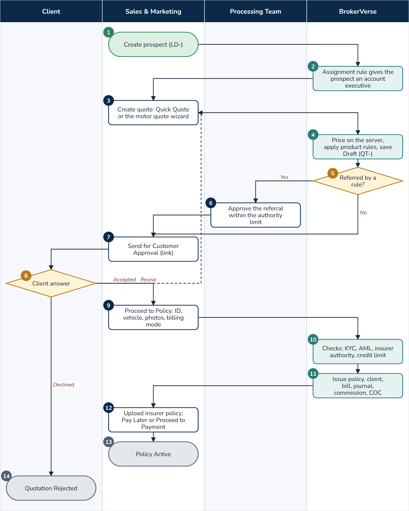

| At a glance | |
|---|---|
| Trigger | A prospect asks for cover, is referred by a channel, or comes from a dealer upload or a campaign |
| Roles | Sales & Marketing or Operations; Processing Team (referrals and approvals); client; BrokerVerse |
| Screens | Operations > Sales & Marketing > Prospects, Lead Assignment, Quick Quote, Quotations; Operations > Policy |
| Postings | policy.issue.broker_billed (broker billed) or directbill.commission (direct bill) at issue |
| Documents | Quotation Slip PDF, approval e-mail with link, policy schedule with the COC number and authentication code (motor with CTPL), premium invoice |
| Controls | Server re-pricing; acceptance rules of the governing product template (refer, decline, loading) with the Underwriting referral limit; quotation maker-checker (`workflow.quote_maker_checker`); discount limit of the Authority Matrix; KYC fields (`policy.kyc_required_fields`); AML checks at issue; insurer authority check (`compliance.insurer_authority_check`); client credit limit warning |

1. **Sales & Marketing.** Operations > Sales & Marketing > Prospects > **Create Prospect**: new customer or existing client, the product (Motor, Fire and Allied Perils, Industrial All Risks, Employee Benefit, package products), the prospect form with the Philippine mobile number, address from the PSGC masters and 4-digit ZIP code. The prospect takes its number LD-YYYY-NNNNN with status New.
2. **BrokerVerse.** The first active assignment rule that matches the prospect (line, channel, province, city, branch, source, category) gives it an account executive by round robin, fewest open prospects or a fixed person (Lead Assignment > Assignment Rules). With no match, `leads.assignment_fallback` keeps it with the creator or sends it to the reassignment queue. The assignment is written to the prospect's history.
3. **Sales & Marketing.** **Create Quote** on the prospect, or Quick Quote > **Start quote**: the motor wizard (policy and vehicle details, plan, coverage with **Calculate**, accessories, order summary with discount, referrer and signatory) or the package product. Products without a wizard go to a Request for Quotation (F02).
4. **BrokerVerse.** On **Completed Quote** the server prices the quotation again from the configured rates and taxes (VAT 12%, DST PHP 0.50 per PHP 4.00, LGT by city or municipality, CTPL from the tariff), applies the rating factors and acceptance rules of the governing product template, and saves the quotation as Draft (QT-YYYY-NNNNN), valid 30 days (`limits.quote_validity_days`). The prospect becomes QuoteGenerated.
5. **BrokerVerse.** Decision: a rule with the action Refer matched (for example a vehicle older than the insurer's limit). A Decline rule refuses the quotation with the rule's message; an Apply Loading rule adds its loading to the net premium.
6. **Processing Team** (or the rule's authority role). Approves the referral within its Underwriting referral limit of the Authority Matrix (sum insured). Until then the quotation cannot be sent, approved, placed or issued.
7. **Sales & Marketing.** **Send for Customer Approval**: the client must have an e-mail address. A signed approval link valid for 7 days is e-mailed, the status becomes Pending Customer and the Processing Team is notified.
8. **Client.** Approves through the link without signing in, or answers by e-mail, phone, Viber, meeting or signed form; the account executive then uses **Record customer response**. Accepted gives Customer Accepted; Revise returns the quotation to Draft (step 3); Declined gives Rejected (step 14).
9. **Sales & Marketing.** **Proceed to Policy**: government ID type, number and scan (PhilSys, UMID, passport, driver's licence and the other types of `policy.kyc_id_types`), motor, chassis and plate or MV file number, mortgagee, five vehicle photos, then the billing mode (broker billed or direct bill, default from the insurer). A cover note can be issued from the accepted quotation while the insurer prepares the policy (Operations > Cover Notes).
10. **BrokerVerse.** Checks before issue: the KYC fields; the client's AML status (no undecided or confirmed screening match, an approved EDD review for a High-risk client, F11); the insurer's IC certificate of authority (warn as delivered, block when set); the placement journey of the line (a line that requires a placement slip is refused); the client's credit limit (issued with a warning to Accounting).
11. **BrokerVerse.** Issues the policy (POL-YYYY-NNNNN), creates the client from the prospect (CL-YYYY-NNNNN), copies the participants, raises the bill (INV-) and posts the journal, accrues the referrer's commission (F07), allocates the next COC number of the insurer's series and sends the CTPL authentication request (`ctpl.register_on_issue`, `ctpl.authenticate_on_issue`). The quotation becomes Converted to Policy and an active cover note becomes Superseded.
12. **Sales & Marketing.** Uploads the insurer's policy document (PDF or image, 10 MB) and chooses **Pay Later** or **Proceed to Payment** (F05).
13. **End.** The policy is Active with payment status Pending.
14. **End.** The quotation is Rejected; it can be reopened as Draft.

**Exceptions**

- A premium changed in the browser is ignored: the server price is saved. A discount above the role's limit is refused by the Authority Matrix.
- A quotation not converted within its validity becomes Expired (Quotation expiry job, daily 00:30); it can be reopened as Draft.
- Issue refused for missing KYC or vehicle identifiers; for an open screening hit or a pending EDD review; for an insurer whose certificate of authority has expired when the check is set to block.
- A COC series with no numbers left: the cover waits on Operations > CTPL Authentication, where the number is entered by hand under **Vehicle details**; an authentication not received within 24 hours is flagged (`ctpl.unauthenticated_alert_hours`).

## F02 Request for quotation, co-insurance and placement

A non-package or large risk is presented to several insurers, the offers are compared, the security is chosen (one insurer, or a lead and co-insurers with shares totalling 100%), the firm order is confirmed by every participant and the policy is issued from the bound slip.

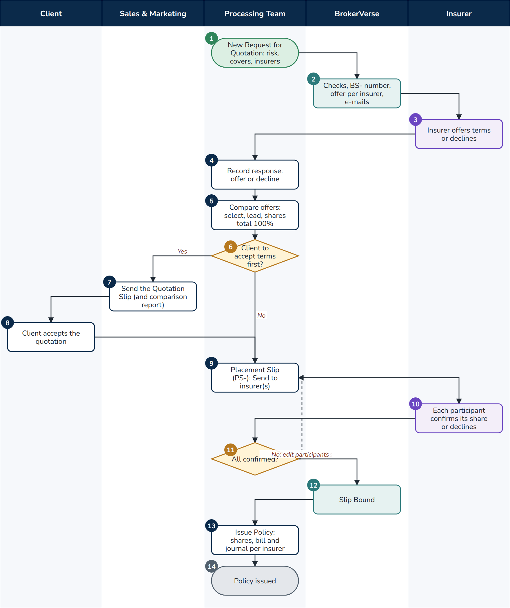

| At a glance | |
|---|---|
| Trigger | A risk that needs the insurers' terms (fire, IAR, marine, engineering, casualty, employee benefits) or a line whose placement journey requires a placement slip |
| Roles | Processing Team; Sales & Marketing; insurers; client; BrokerVerse |
| Screens | Operations > Sales & Marketing > Requests for Quotation, Quotations, Comparison Reports, Placement Slips |
| Postings | policy.issue.broker_billed with one payable and commission line per insurer (rounding to the lead) |
| Documents | Broker slip PDF (whole market or per insurer), Quotation Slip, client comparison report, placing slip per participant, policy schedule |
| Controls | Insurer authority check at submission and at the firm order; insurer market of the product (Market Mapping, `product.market_panel_enforced`); acceptance rules per insurer (a Decline rule refuses that insurer); shares exactly 100% with one lead; issue only when every participant has confirmed |

1. **Processing Team** (Sales and Operations can start one). **New Request for Quotation**: customer (client, prospect or new prospect), product, insured, inception and expiry, response due, risk details as items and values, requested covers with sums insured and deductibles, insurers to approach, remarks.
2. **BrokerVerse.** On **Save and submit to market**: checks each insurer's certificate of authority and the product's insurer market, numbers the slip BS-YYYY-NNNNN, creates one offer record per insurer (OFR-, Pending) and queues the request e-mail to each insurer.
3. **Insurer.** Answers with terms (net premium, rate, line offered, taxes, deductibles, special terms, validity) or declines.
4. **Processing Team.** Market responses > **Record response** (or **Record decline** with the reason). The slip becomes Responses in with the first answer. **Add insurer** approaches another insurer on an open slip.
5. **Processing Team.** Compare offers: the offers ranked by gross premium with the best marked; tick **Select** on each offer placed, choose the **Lead**, enter each **Share taken**; the total must be 100%.
6. **Processing Team.** Decision: must the client see and accept the terms first? The buttons offered follow the placement journey of the line (`placement.journey`).
7. **Sales & Marketing.** **Prepare Quotation Slip** gives a quotation (QT-) with the chosen insurers and shares; the account executive sends it for customer approval as in F01, and may give the client a comparison report (Comparison Reports > **New report** from the slip: options ranked by premium, the recommended option and the reasons, never the commission).
8. **Client.** Accepts the quotation (link or recorded response). **Create Placement Slip** on the accepted quotation.
9. **Processing Team.** The placement slip (PS-YYYY-NNNNN) in Draft lists each participant with role, share, sum insured, premium, taxes, gross and commission. **Send to insurer(s)** e-mails each participant a placing slip showing its own share; the status becomes Sent to insurer. A cover note can be issued from a sent or bound slip.
10. **Insurer.** Each participant confirms its share with its policy or certificate number, or declines its line.
11. **Processing Team.** **Confirm** on each row with the insurer's number, or **Declined** with the reason. Decision: all confirmed? A decline returns to step 9: **Edit participants** to replace the insurer or change the shares.
12. **BrokerVerse.** When every participant has confirmed the slip is Bound.
13. **Processing Team.** **Issue Policy** on the bound slip (a user with policy issuing rights): the participants, shares and insurer references are copied to the policy, the client is created if needed, the bill is raised (or the direct-bill commission booked) and the journal posts each insurer's payable and commission on its own line. The slip becomes Policy issued.
14. **End.** The policy is issued; remittance (F06) pays each insurer its share.

**Exceptions**

- Shares that do not total exactly 100%, no lead or two leads: refused with the message on screen.
- **Cancel / close** on the request: **Cancel slip** (withdrawn) or **Close (not taken up)** with the reason.
- A policy the insurer issued before the account came to BrokerVerse: Placement Slips > **Record Issued Policy** creates the policy, bill and commission in one step, where the line's journey allows it.

## F16 Dealer programme for brand-new vehicles

A dealer, and often its financing bank, agrees terms with the broker for the brand-new vehicles it sells. The dealer's sales are uploaded and become prospects, quotations or issued policies with the bank as mortgagee.

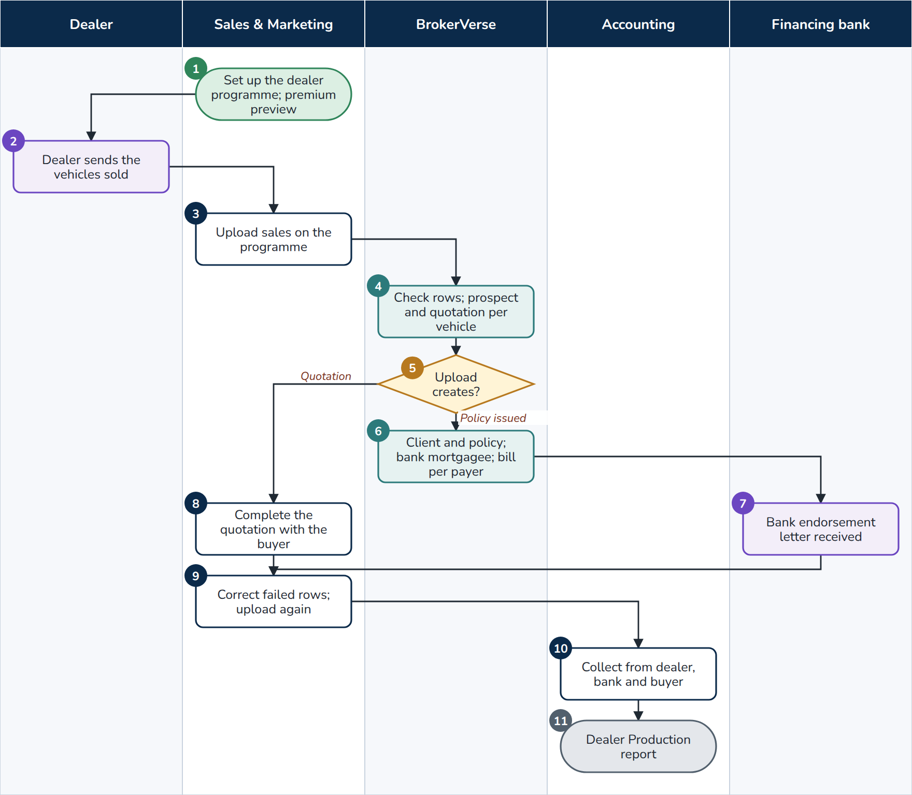

| At a glance | |
|---|---|
| Trigger | A dealer sends its list of vehicles sold |
| Roles | Sales & Marketing (or Processing Team); dealer; financing bank; Accounting; BrokerVerse |
| Screens | Master > Insurance > Distribution Channels; Operations > Sales & Marketing > Dealer Programmes; Reports > Operational Reports > Dealer Production |
| Postings | One bill per payer (dealer or bank for its subsidy, buyer for the rest), each with its booking journal; commission split in proportion |
| Documents | Dealer Sales upload template, upload result, bank endorsement letter per sale or per batch |
| Controls | Row checks (required fields, vehicle class, chassis number not already uploaded); `read:motor-programmes`, `write:motor-programmes` |

1. **Sales & Marketing.** Dealer Programmes > **Add programme**: code, name, dealer (group or branch, from Distribution Channels), financing bank, insurer, own damage and acts of nature rates, excess bodily injury and property damage limits, default vehicle class, CTPL included and for how many years, who pays (free first year, subsidy by dealer or bank as percent, amount or full premium), what the upload creates (quotation to follow up or policy issued), effective dates. **Premium preview** shows a sample vehicle.
2. **Dealer.** Sends the vehicles sold in the Dealer Sales template: branch, date sold, invoice, buyer and contact, make, model, variant, year, colour, vehicle class, plate or conduction sticker, chassis and engine numbers, invoice price, bank branch and loan amount.
3. **Sales & Marketing.** **Upload sales** on the programme.
4. **BrokerVerse.** Checks every row and, for each valid row, creates the prospect (channel: the dealer branch) and the quotation priced with the programme's rates and the motor tariff.
5. **BrokerVerse.** Decision: the programme's upload mode.
6. **BrokerVerse.** Policy issued mode: the client and the policy are issued with the financing bank as mortgagee (the bank's mortgagee clause), billed to each payer, with the commission split.
7. **Financing bank.** Receives the bank endorsement letter (policy, vehicle, loan, mortgagee clause), printed per sale or for the batch, or e-mailed automatically when `motor_programmes.email_bank_letter` is on.
8. **Sales & Marketing.** Quotation mode: completes each draft quotation with the buyer and continues as F01 from step 7.
9. **Sales & Marketing.** Corrects the rows listed as Failed with their reason and uploads them again.
10. **Accounting.** Collects each bill from the dealer, the bank and the buyer (F05).
11. **End.** The Dealer Production report shows prospects, quotations, policies, premium and commission per dealer group and channel.

**Exceptions**

- A chassis number already uploaded, an unknown vehicle class or a missing required field: the row fails with its reason; the other rows are created.
- A channel with business cannot be deleted; it is made Inactive so its history stays.

## F17 Fleet schedule

One motor policy covers many vehicles of a client, each priced on its own, with vehicles added and removed during the term by endorsement.

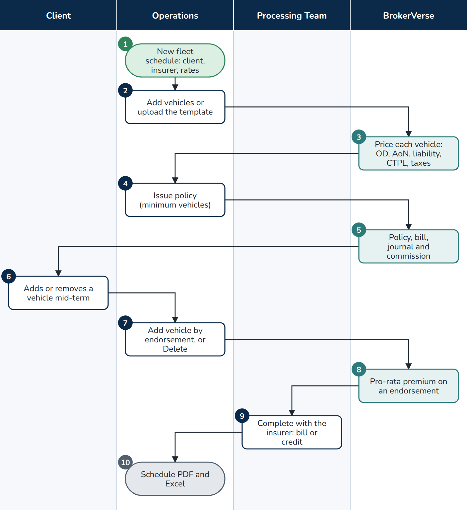

| At a glance | |
|---|---|
| Trigger | A corporate client insures its vehicles on one policy |
| Roles | Operations (or Processing Team); client; BrokerVerse |
| Screens | Operations > Fleet Schedules |
| Postings | policy.issue.broker_billed for the totals; endorsement.additional_premium or endorsement.return_premium for vehicles added or deleted |
| Documents | Fleet Vehicles upload template, schedule of vehicles PDF and Excel |
| Controls | At least `fleet.minimum_vehicles` vehicles; pro-rata premium for changes (`fleet.pro_rata_basis`); `read:fleet`, `write:fleet` |

1. **Operations.** **New fleet schedule**: client, insurer, period, own damage and acts of nature rates, excess bodily injury and property damage.
2. **Operations.** **Add vehicle**, or **Template** and **Upload vehicles**: plate or conduction sticker, chassis and engine numbers, make, model, year, colour, vehicle class (CTPL tariff), usage, sum insured, mortgagee.
3. **BrokerVerse.** Prices each vehicle: own damage and acts of nature on its sum insured, the excess liability premium, the CTPL of its class and the premium taxes; the totals show under **Vehicles on cover**.
4. **Operations.** **Issue policy**.
5. **BrokerVerse.** Issues the policy for the totals, raises the bill with its booking journal and accrues the commission, as for any policy.
6. **Client.** Asks to add or remove a vehicle during the term.
7. **Operations.** **Add vehicle by endorsement**, or **Delete** on the vehicle row.
8. **BrokerVerse.** Each change is an endorsement whose premium is the vehicle's annual premium pro-rata to the days left.
9. **Processing Team.** Completes the endorsement with the insurer's document (F03 from step 7): additional premium billed, or return premium credited (`fleet.return_premium_on_delete`).
10. **End.** **Schedule PDF** and **Excel** give the current schedule of vehicles with each vehicle's premium and CTPL.

## F18 Marine open cover

An open cover insures a client's cargo shipments for a period. Each shipment is certified or declared, and the premium is billed per declaration period on the open policy.

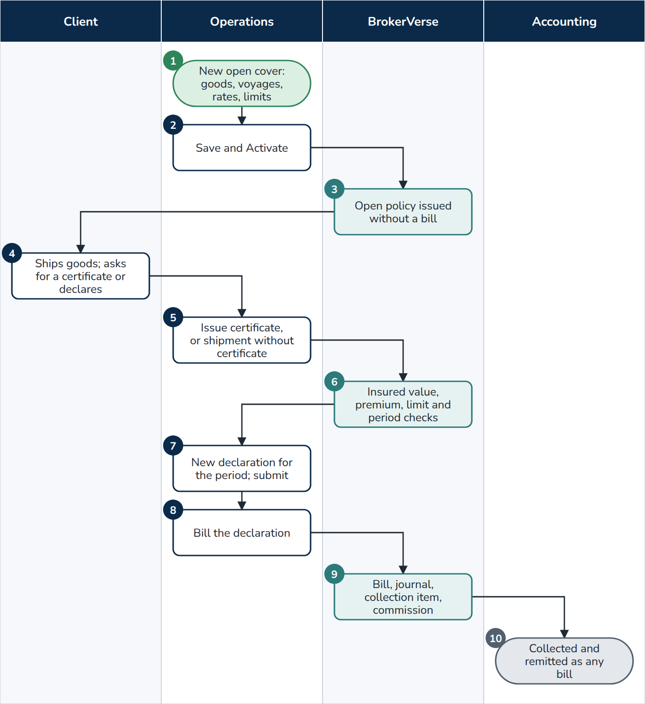

| At a glance | |
|---|---|
| Trigger | A client ships goods regularly |
| Roles | Operations (or Processing Team); client; Accounting; BrokerVerse |
| Screens | Operations > Marine Open Covers |
| Postings | Booking journal of each declaration bill (premium receivable, due to insurer with the premium taxes of the marine line, commission) |
| Documents | Certificate of insurance per shipment (`marine.certificate_wording`), declaration, bill |
| Controls | Limit per conveyance and cover period checked per shipment; minimum premium per certificate; declarations due `marine.declaration_due_days` after the period; `read:marine`, `write:marine` |

1. **Operations.** **New open cover**: client, insurer, period, goods insured, voyages, clauses; for each conveyance (Sea, Air, Land) the rate and the limit any one conveyance; mark-up on invoice (`marine.default_markup_percent`), minimum premium per certificate, declaration frequency (monthly or quarterly).
2. **Operations.** **Save**, then **Activate**.
3. **BrokerVerse.** Activating issues the open policy without a bill.
4. **Client.** Ships goods and asks for a certificate, or declares a shipment made.
5. **Operations.** **Issue certificate** (shipment date, conveyance, vessel or flight, voyage from and to, bill of lading or airway bill, consignee, packing, goods, invoice value) and **Print**; or **Shipment without certificate** for a declared shipment.
6. **BrokerVerse.** Insured value = invoice value plus the mark-up; premium at the conveyance rate and at least the minimum; a shipment over the limit or outside the period is refused.
7. **Operations.** **Declarations** > **New declaration** for the period gathers the certificates and declared shipments with their premium and taxes (a period without shipments is a nil declaration); **Submit**.
8. **Operations.** **Bill** the declaration.
9. **BrokerVerse.** Raises the bill on the open policy with its booking journal, collection item and commission.
10. **End.** The bill is collected, receipted and remitted as any bill (F05, F06).

## F19 Facultative reinsurance placement

The broker acts as reinsurance broker: an insurer (the cedant) offers part of a risk to the facultative market.

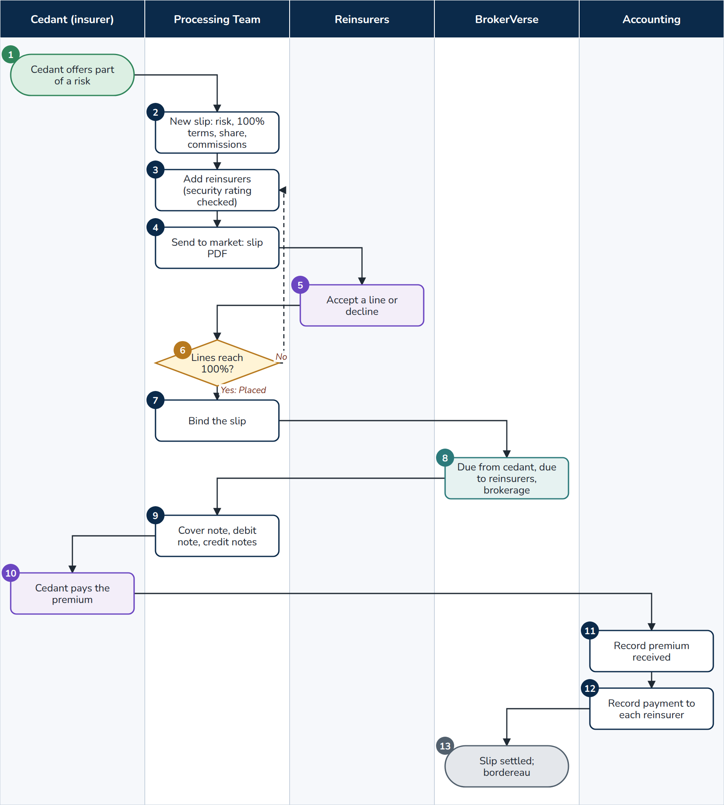

| At a glance | |
|---|---|
| Trigger | A cedant asks the broker to place a share of a risk with reinsurers |
| Roles | Processing Team; cedant; reinsurers; Accounting; BrokerVerse |
| Screens | Reinsurance > Facultative Placements |
| Postings | ri.facultative.bind at binding; ri.facultative.premium_received; ri.facultative.premium_paid |
| Documents | Slip PDF to each reinsurer, cover note to the cedant, debit note (premium due from the cedant), credit note per reinsurer, bordereau of the period |
| Controls | Only reinsurers that meet the security rating of the Reinsurers master can be added; the slip is Placed only when the accepted lines reach 100% of the share offered |

1. **Cedant.** Offers part of a risk to the broker.
2. **Processing Team.** **New slip**: cedant, original insured, original policy number, class, risk, location, period, currency, sum insured and premium at 100%, share offered, reinsurance commission to the cedant and brokerage (defaults `reinsurance.fac_default_ceding_commission_pct` 25, `reinsurance.fac_default_brokerage_pct` 10), deductibles, conditions.
3. **Processing Team.** **Add reinsurer** for each reinsurer approached.
4. **Processing Team.** **Send to market**: the slip is in market and the slip PDF can be e-mailed to each reinsurer.
5. **Reinsurers.** Accept a line (percent of the share offered, with a reference) or decline.
6. **Processing Team.** Records each answer. Decision: the accepted lines reach 100% (the slip is Placed), or more reinsurers are approached (step 3).
7. **Processing Team.** **Bind** the slip.
8. **BrokerVerse.** Posts ri.facultative.bind: the premium due from the cedant net of its reinsurance commission, the net premium due to each reinsurer and the brokerage income.
9. **Processing Team.** Prints the cover note to the cedant, the debit note and a credit note per reinsurer.
10. **Cedant.** Pays the premium.
11. **Accounting.** **Record premium received**.
12. **Accounting.** **Record payment** to each reinsurer.
13. **End.** The slip closes when both sides are settled. **Bordereau** lists the facultative premium of a period by reinsurer; **Generate and keep** saves it as a document of the month.

# Policy servicing

## F03 Endorsement and cancellation

A change to an issued policy, or its cancellation, is raised by Operations, sent to the insurer, completed with the insurer's endorsement and then billed or credited. The return premium of a cancellation is always computed by the system.

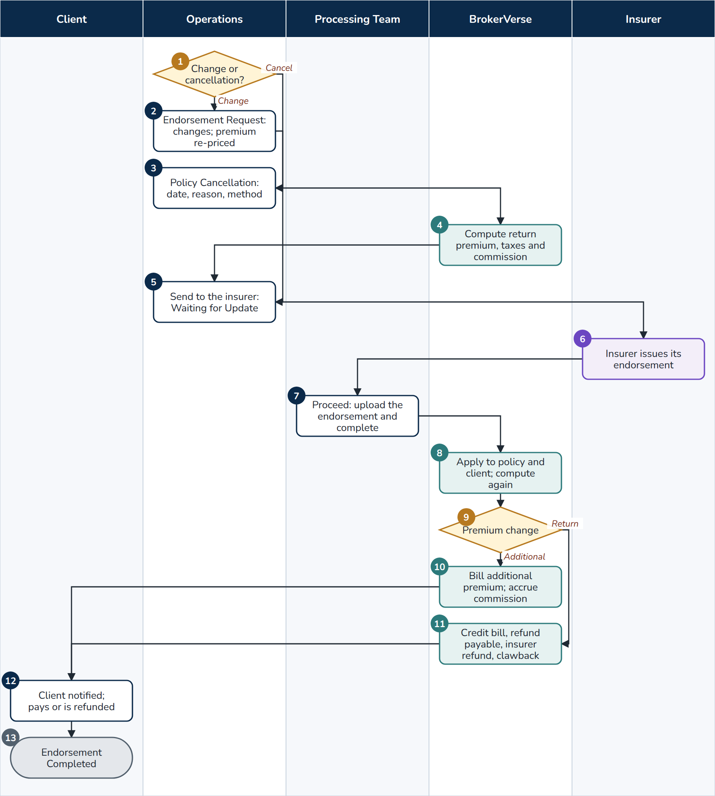

| At a glance | |
|---|---|
| Trigger | The client asks for a change; the client or the insurer cancels the policy |
| Roles | Operations; Processing Team; insurer; client; BrokerVerse |
| Screens | Operations > Policy > **More actions** > **Endorsement**; Operations > Policy Cancellation; Master > Insurance > Short-Period Rates, Cancellation Reasons |
| Postings | endorsement.additional_premium; endorsement.return_premium (partial cancellation, return premium); policy.cancel (cancellation); commission.clawback |
| Documents | Endorsement (END-), additional premium bill or credit, client notice by e-mail |
| Controls | Endorsement not offered while the premium is Pending or Reviewing, or for expired, lapsed, cancelled or renewed policies; re-pricing and return premium computed on the server (`endorsements.compute_cancellation_return`); completion only with the insurer's document |

1. **Operations.** Decision: a change (step 2) or a cancellation (step 3).
2. **Operations.** On the policy row **More actions** > **Endorsement**, tick the types (motor: Personal Details Change, Motor Details Change, Coverage Change, Policy Extend, Policy Cancel; fire: premium change, cancellation) and enter the changes. A coverage change is priced again: net premium, VAT, DST, LGT, gross premium and **Premium change**; CTPL stays as issued. Continue at step 5.
3. **Operations.** Operations > Policy Cancellation: the policy, the **Cancellation date**, the **Reason** (Cancellation Reasons master: who initiates it and its method), the **Return premium method** (from the reason unless chosen), and **Part of the cover** for a partial cancellation. **Compute return premium**.
4. **BrokerVerse.** Computes the return premium: pro-rata (net premium x days left / days of the period) when the insurer cancels; short-period (the insurer keeps the percentage of the Short-Period Rates scale for the days in force) when the insured cancels (`endorsements.short_period_for_insured`); flat from inception. Adds the premium taxes returned (`endorsements.cancellation_returned_taxes`; DST not refundable as delivered) and the commission taken back. **Create cancellation endorsement**.
5. **Operations.** **Save & Next**, check the summary and send it to the insurer. The endorsement waits as Waiting for Update.
6. **Insurer.** Issues its endorsement.
7. **Processing Team.** Opens the endorsement (notification, policy or client), **Proceed**, uploads the insurer's endorsement with its number and dates and completes it.
8. **BrokerVerse.** Applies the change to the policy and the client (a Personal Details Change updates the client record). For a cancellation the server computes the figures again, so a figure changed on the screen is not used.
9. **BrokerVerse.** Decision: additional premium or return premium.
10. **BrokerVerse.** Additional premium: a bill (INV-) with endorsement.additional_premium, split by share for a co-insured policy; commission accrued on the additional premium.
11. **BrokerVerse.** Return premium: the open bill is credited; what the client already paid becomes a refund payable; if the premium was already remitted, the refund due from each insurer is booked and netted on its next remittance; the referrer's comsub is clawed back on the returned part (policy.cancel or endorsement.return_premium; commission.clawback).
12. **Client.** Is notified by e-mail; pays the additional premium (**Proceed to Payment**, F05) or receives the refund by payment voucher.
13. **End.** The endorsement is Completed (a cancellation: Cancelled).

**Exceptions**

- **Endorsement** greyed out: payment Pending or Reviewing, or the policy is expired, lapsed, cancelled or renewed.
- The insurer refuses: the endorsement is Rejected.
- A cancellation for non-payment can start from Accounts > Credit Control > Premium Warranty Monitor, which creates a draft cancellation endorsement; nothing is cancelled automatically.
- A cancellation within 90 days of inception with return premium raises an AML alert (F11).

## F04 Renewal

Every policy enters the renewal pipeline before it expires. Notices go out, the renewal is negotiated and re-rated, the terms are approved, and the accepted renewal becomes the next term.

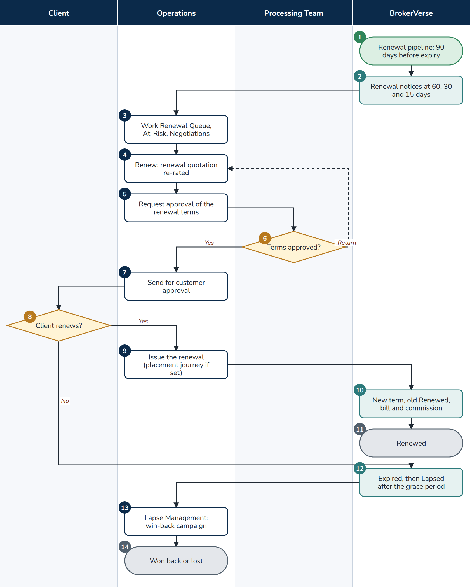

| At a glance | |
|---|---|
| Trigger | A policy reaches `renewals.pipeline_days` (90) before expiry |
| Roles | BrokerVerse (jobs); Operations and Sales & Marketing; Processing Team (approval); client |
| Screens | Operations > Renewals (Renewal Policy, Renewal Batch, Renewal Queue, Retention Analytics, At-Risk Policies, Negotiations, Lapse Management, Performance); Operations > My Work |
| Postings | policy.renewal.broker_billed |
| Documents | Renewal notices (First, Second, Final), renewal quotation, renewal SMS when switched on |
| Controls | Renewal terms maker-checker (`renewals.maker_checker`, approvers `renewals.approver_roles`); optional placement journey for renewals (`placement.journey_applies_to_renewals`) |

1. **BrokerVerse.** The Renewal pipeline job (05:30) puts each policy into the queue 90 days before expiry.
2. **BrokerVerse.** The Renewal notices job (06:00) e-mails notices 60, 30 and 15 days before expiry (`limits.renewal_notice_days`); `sms-renewal-notices` sends SMS 30 and 7 days before when switched on. **Renewal Batch** sends the notices or renewal quotes of up to 500 policies expiring within 30 days in one go.
3. **Operations** (or Sales & Marketing for its own clients). Works the Renewal Queue (days to expiry, status, risk, attempts), At-Risk Policies (risk score from claims, unpaid premium, premium increase, first renewal, expiry within 15 days, no contact) and Negotiations (**Add note** with the next action and follow-up date, which also becomes a task in My Work).
4. **Operations.** **Renew** on Renewal Policy: the renewal quotation opens with the covers of the expiring term, re-rated at the current base rates, a claims loading of 10% per claim in the term up to 30% and a loyalty discount of 2% per completed renewal up to 10%.
5. **Operations.** **Request approval** of the renewal terms.
6. **Processing Team.** Approves the terms or returns them (step 4). The maker cannot approve his or her own terms.
7. **Operations.** Sends the renewal quotation for customer approval as in F01.
8. **Client.** Decision: renews (step 9) or not (step 12).
9. **Operations.** Issues the renewal; where the line's journey applies to renewals, through a placement slip (F02).
10. **BrokerVerse.** Issues the new term, marks the old policy Renewed, bills the premium (`renewals.create_receivable`) and accrues the commission to the original referrer.
11. **End.** Renewed.
12. **BrokerVerse.** The Policy expiry job (00:15) marks the policy Expired; 30 days after expiry (`renewals.grace_period_days`) it is Lapsed. A lapsed policy can still be renewed for 90 days (`renewals.lapsed_renewal_days`).
13. **Operations.** Lapse Management: **Create Campaign** for a win-back offer (segment, dates, discount, budget, benefits).
14. **End.** The client is won back (renewed as a lapsed renewal) or lost; Retention Analytics and Performance show the renewal rate, premium retention and cycle time against the targets.

# Money

## F05 Billing, collection, receipts, post-dated cheques and instalments

Every bill is followed until it is paid. Only Accounting posts official receipts: the other roles record how the client paid, and Accounting verifies it.

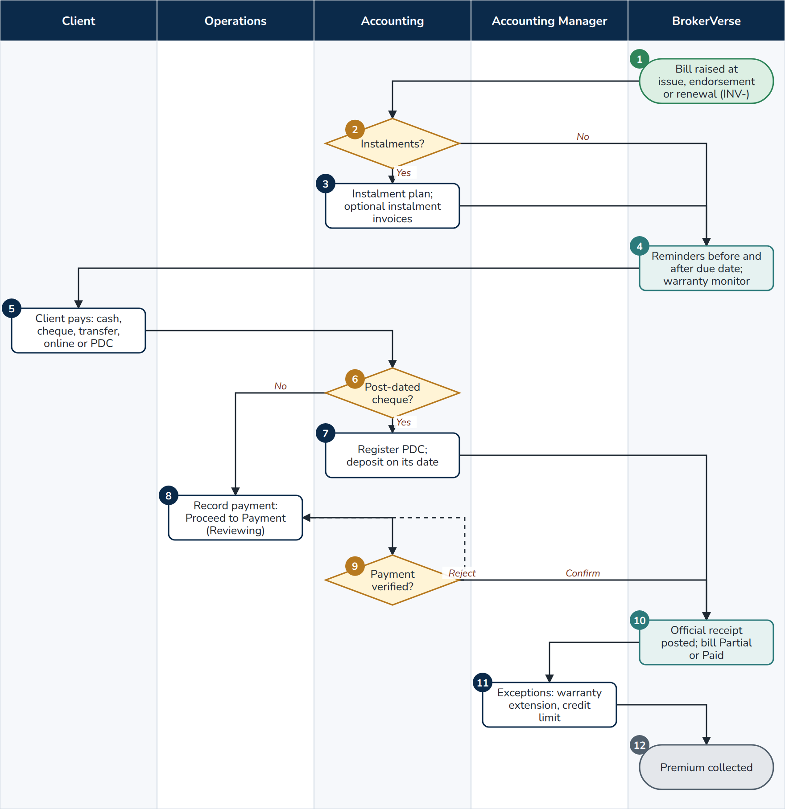

| At a glance | |
|---|---|
| Trigger | A bill is raised at issue, endorsement, renewal, fleet change or marine declaration |
| Roles | Client; Operations, Sales & Marketing or Processing Team (payment capture); Accounting; Accounting Manager; BrokerVerse |
| Screens | Operations > Policy > **Proceed to Payment**; Operations > Payments; Accounts > Receipts, Collections, Credit Control (Instalment Plans, Premium Warranty Monitor, Client Credit Limits), Post-Dated Cheques |
| Postings | receipt.apply (Dr cash in bank or the account of the receipt mode, Cr Premiums Receivable); reversal of the receipt journal on a bounced cheque; booking journal per instalment invoice |
| Documents | Premium invoice and statement of account, payment reminders, official receipt (OR-YYYY-NNNNN, receipt transaction RT-) e-mailed with the PDF, PDC register |
| Controls | Receipt not above the bill balance; payment verification by Accounting; PDCs on hand not above the bill balance; warranty extensions and credit limits by the Accounting Manager; AML covered transaction monitoring on cash |

1. **BrokerVerse.** The bill (INV-YYYY-NNNNN) is raised with its due date: the insurer's premium payment warranty, else `collections.default_credit_days` (30). With `billing.email_on_issue` on, the invoice is e-mailed with the PDF.
2. **Accounting.** Decision: is the premium paid by instalments?
3. **Accounting.** Credit Control > Instalment Plans: the schedule from the terms (4 instalments proposed, up to 12; monthly, quarterly or semi-annual), adjusted as agreed. **Issue instalment invoices** (before any payment, or automatically with `credit.instalment_invoices_on_save`) cancels the bill with the reversal of its booking journal and gives each instalment its own invoice, due date, share of premium, taxes and commission, booking journal and collection item.
4. **BrokerVerse.** The Collection reminders job (08:00) e-mails the client 7 days before the due date and then every 7 days; `sms-payment-reminders` sends SMS 3 days before and on the due date when switched on. The Premium Warranty Monitor lists broker-billed policies unpaid past, or within 7 days of, the insurer's warranty.
5. **Client.** Pays by cash, cheque, bank transfer, the online payment link, or hands over post-dated cheques.
6. **Accounting.** Decision: post-dated cheques?
7. **Accounting.** Accounts > Post-Dated Cheques > **Register cheque** (bill or policy, drawee bank, number, date, amount, **Kept in**); nothing is posted. The **Deposit due** tab lists the cheques dated within 3 days (`pdc.due_window_days`) and the daily job tells Accounting. On or after the date, **Deposit** to a bank account creates and posts the official receipt (step 10); then **Cleared** when the bank confirms.
8. **Operations** (or Sales & Marketing, Processing Team). Policy > **Proceed to Payment**: how the client paid, reference, amount, date, proof; **Record payment**. The payment status becomes Reviewing and Accounting is notified.
9. **Accounting.** Checks the payment against the bank and confirms it, or rejects it with a reason (back to step 8). Accounting can also post directly on Accounts > Receipts > **Receipt**.
10. **BrokerVerse.** Posts the official receipt (receipt.apply), sets the bill to Partial or Paid, closes the collection item when paid, makes the referrer's commission eligible on full payment (F07), and e-mails the receipt PDF when `receipts.email_on_record` is on.
11. **Accounting Manager.** Decides the exceptions: premium warranty extensions requested by Accounting (up to 90 days after inception, `credit.max_warranty_extension_days`) and client credit limits; a policy issued over a client's limit is acknowledged on Client Credit Limits.
12. **End.** The premium is collected; it becomes due to the insurer (F06).

**Exceptions**

- **Bounced** PDC (or a cheque returned on the bank statement): the receipt is cancelled, its journal reversed and the bill reopened; Accounting is notified and the client e-mailed (`pdc.notify_client_on_bounce`). **Replace** registers the new cheque linked to the bounced one; **Return** gives an unused cheque back.
- An online payment that cannot be applied is notified to Accounting.
- Unpaid premium past the warranty: remind, request an extension or ask Operations to cancel for non-payment (F03).
- Cash above PHP 500,000 in one banking day, or several smaller cash payments, raises an AML alert (F11).
- At go-live, open bills of the old system are loaded with the migration workbook (F14) and chased like any bill.

## F06 Remittance to insurers and direct bill

For broker-billed policies, collected premium net of commission is remitted to each insurer by its share. For direct-bill policies the client pays the insurer and the broker bills its commission with a debit note.

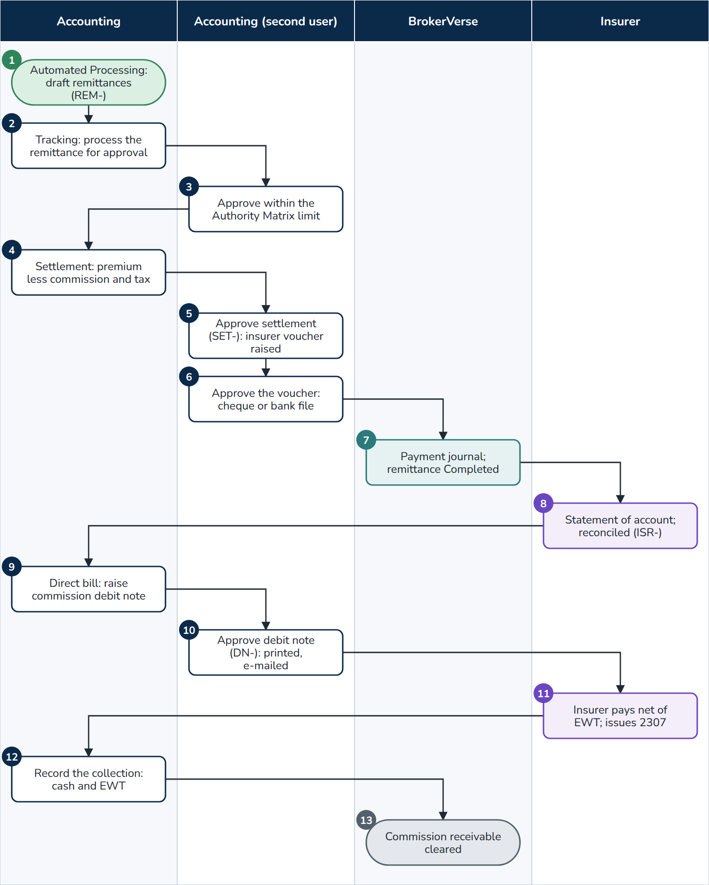

| At a glance | |
|---|---|
| Trigger | Premium collected and not yet remitted; direct-bill commission not yet billed |
| Roles | Accounting (maker); a second Accounting user or the Accounting Manager (checker); insurer; BrokerVerse |
| Screens | Accounts > Remittance (Automated Processing, Tracking, Settlement, Approval Workflow, Direct Bill Processing); Accounts > Disbursement; Accounts > Bank Payment Files; Accounts > Insurer Reconciliation > Insurer Statements |
| Postings | remittance.settlement (adjustments); disbursement.payment (Dr Premiums Payable to Insurers, Cr Cash in Bank); directbill.commission at issue; directbill.collection (Dr cash, Dr Creditable Withholding Tax, Cr Commission Receivable) |
| Documents | Remittance (REM-), settlement (SET-), payment voucher (PV-) and cheque or bank file, remittance statement, commission debit note (DN-) e-mailed with the PDF, sales invoice (SI-) |
| Controls | The initiator cannot approve; approval within the Remittance approval and Remittance settlement limits of the Authority Matrix (Accounting up to PHP 1,000,000.00, Accounting Manager without limit); debit note maker-checker; billing mode change refused once premium was collected or remitted |

1. **Accounting.** Automated Processing: the scheduled remittances per insurer with policies and estimated amount; tick the insurers, **Validate**, **Process Selected**. Draft remittances (REM-) are created, due on the insurer's remittance terms, else `remittance.default_due_days` (30). Credit Control > Remittance Ageing shows what is overdue.
2. **Accounting.** Tracking: process the remittance; it goes for approval.
3. **Second user.** Approval Workflow: approves within his or her limit; a larger remittance waits for the Accounting Manager. Delegations cover leave.
4. **Accounting.** Settlement: the insurer, **Add policies** (or **Import**), **Calculate**: premium less commission less tax plus or minus adjustments gives the net settlement; refunds due from the insurer are netted here. **Submit for approval**.
5. **Second user.** Approves the settlement (SET-); the insurer payment voucher is raised in Disbursement for the net amount.
6. **Second user.** Approves the payment voucher; the cheque is printed. Or the voucher goes into a bank payment file batch (Accounts > Bank Payment Files: layout, pay-from account, channel bulk credit, InstaPay up to PHP 50,000 or PESONet, value date), approved by a user who is not the maker of the batch or its vouchers, written, uploaded to the bank portal and closed with the bank's status file.
7. **BrokerVerse.** Posts the payment journal (disbursement.payment); the voucher is Paid and the remittance Completed.
8. **Insurer.** Sends its statement of account; Accounting imports it on Insurer Reconciliation (ISR-), resolves every difference and submits it; the Accounting Manager approves (F09).
9. **Accounting.** Direct Bill Processing > **1. Raise Debit Note**: the insurer, issued from and to, line of business; **Load policies**; tick the policies: commission, VAT 12%, total due, EWT 10% (`direct_bill.insurer_ewt_rate`), net cash expected. Due 30 days later (`direct_bill.debit_note_due_days`). Submit for approval.
10. **Second user.** Approves the debit note (DN-) on **2. Debit Notes**: printed on the letterhead and e-mailed to the insurer with the PDF. Accounts > Tax > Sales Invoices makes out the sales invoice for it (EOPT).
11. **Insurer.** Pays the commission net of EWT and issues BIR Form 2307.
12. **Accounting.** Opens the debit note and records the collection: cash received, tax withheld, mode, reference (partial payments allowed); directbill.collection posts.
13. **End.** The commission receivable is cleared; the 2307 appears under BIR Form 2307 > Received.

**Exceptions**

- An insurer with nothing to remit shows Below minimum.
- A bank file payment rejected by the bank keeps its reason; its voucher is free for another batch or a cheque.
- **3. Billing Mode** changes an issued policy between direct bill and broker billed with a reason; refused once premium was collected or remitted, or once the commission is on a debit note.

## F07 Commission and payout with licence check

The share of the brokerage paid to an agent or referrer (comsub) is accrued at issue, becomes eligible when the premium is fully collected, is approved by a second user and is paid less withholding tax, only to a referrer whose IC licence is in force where one is required.

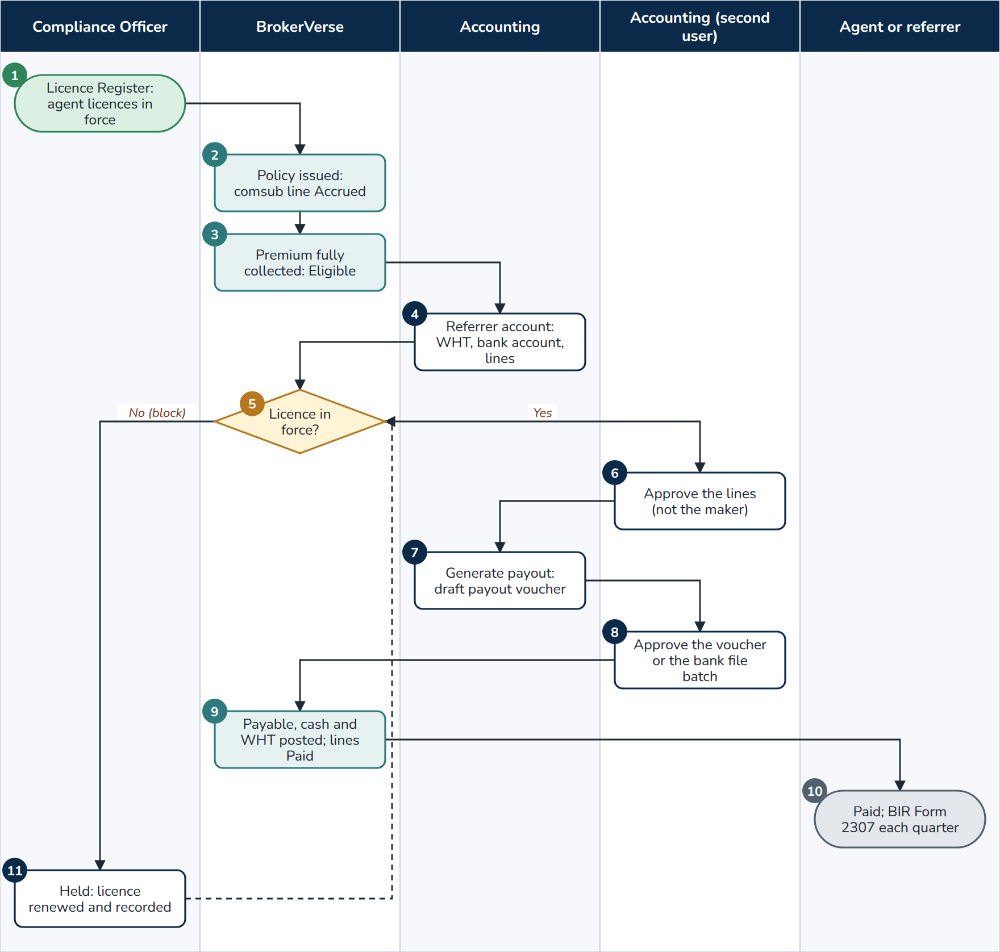

| At a glance | |
|---|---|
| Trigger | A policy with a referrer, or from a channel with a comsub rate, is issued |
| Roles | Compliance team (licence register); Accounting (maker); a second Accounting user (checker); agent or referrer; BrokerVerse |
| Screens | Compliance > Insurance Commission > Licence Register; Commission > Agents/Referrer Accounts, Commission Dashboard; Accounts > Disbursement; Accounts > Tax > BIR Form 2307 |
| Postings | commission.approve (comsub accrual); commission.payout (Dr Commission Payable, Cr Cash in Bank and Withholding Tax Payable); commission.clawback |
| Documents | Payout voucher (PV-), BIR Form 2307 issued per payee and quarter (CWT-), Broker Commission Statement |
| Controls | Payable only after full collection (`commission.require_full_payment`); bank account required (`commission.require_bank_account`); approval by another Accounting user; licence check `compliance.referrer_licence_check` (block as delivered) for the referrer types in `compliance.licence_required_referrer_types` (Agent, Sub-agent) |

1. **Compliance team.** Keeps each agent's licence in the Licence Register (type, number, issue and expiry, documents); records each renewal as a new term. The `compliance-reminders` job reminds the team 90, 60, 30, 15 and 7 days before expiry.
2. **BrokerVerse.** At issue the comsub line is Accrued at the rate of the referrer's level (`commission.comsub_rate_by_level`: L1 8%, L2 5%) or of the channel.
3. **BrokerVerse.** When the premium is fully collected the line becomes Eligible (`commission.auto_eligible_on_full_payment`); Accounting can also **Mark eligible**.
4. **Accounting.** Opens the referrer account (current cycle, future cycles, paid history), checks **Apply WHT** (`commission.wht_rate_by_type`: Agent and Sub-agent 5%, External 10%) and the bank account.
5. **BrokerVerse.** Decision: does the referrer hold a licence in force today? Checked at **Approve**, **Generate payout**, single-line payment and the approval of the payout voucher.
6. **Second user.** **Approve** on the eligible lines prepared by another user; commission.approve posts.
7. **Accounting.** **Generate payout**: a draft payout voucher in Disbursement (or a bulk payout).
8. **Second user.** Approves the voucher, or the bank payment file batch that holds it.
9. **BrokerVerse.** Posts commission.payout; the lines become Paid.
10. **End.** The referrer is paid; each quarter Accounting issues BIR Form 2307 (Issued by us) with ATC WI515 or WC515 (`bir.atc_by_payee`).
11. **Compliance team.** With the check on block, the actions are refused with the reason, shown on the referrer account; the commission is held until the renewed licence is recorded (back to step 5). With warn, the payout goes ahead with a warning recorded in the audit trail.

**Exceptions**

- A referrer without a bank account cannot be approved or paid.
- Return premium claws back the comsub on the returned part (commission.clawback).
- Overriding, profit and contingent commission from insurers follows its own path on Commission > Insurer Overrides: agreement, computation per period (OVC-), approval by a second user (override_commission.accrual), sales invoice, settlement against the insurer's statement (override_commission.settlement).

# Claims

## F08 Claims, motor repair and claims paid through the broker

A loss is registered under the policy, the insurer is advised, the documents are gathered, the adjuster and the assessment are recorded, the settlement is approved by a second Claims user and, when the claim is paid through the broker, the funds are received from each insurer and paid to the claimant.

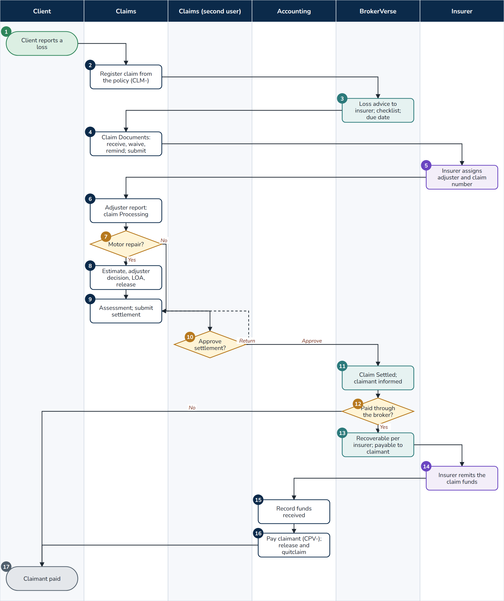

| At a glance | |
|---|---|
| Trigger | A client reports a loss |
| Roles | Client or claimant; Claims (maker); another Claims user (checker); Accounting; insurer; BrokerVerse |
| Screens | Operations > Policy > **More actions** > **Claim**; Operations > Claims, Claim Documents, Motor Claim Repairs; Accounts > Claims Settlements; Reinsurance > Claims Recovery |
| Postings | claim.settlement.paid_through_broker; claim.funds_received; claim.paid_to_claimant |
| Documents | Preliminary Loss Advice to the insurer, missing document reminders, Acknowledgment letter, Claims Discharge Voucher, Claims Data sheet, FIR, letter of authority (LOA-), release acknowledgement, claim payment voucher (CPV-), release and quitclaim |
| Controls | Date of loss inside the policy period (`claims.validate_loss_date`); no claim while premium is unpaid (`claims.block_unpaid_premium`); submission to the insurer refused while a required document is missing; settlement maker-checker (`claims.settlement_maker_checker`); AML screening of the payee at payout; SoD rule SOD-CLM-ACCT |

1. **Client.** Reports a loss.
2. **Claims.** On the policy **More actions** > **Claim**: date and time of the incident, location, cause (`claims.loss_causes`), estimated amount, insurer claim number if known, driver (motor), third party, documents (PNG, JPEG or PDF, 2 MB each). The claim takes its number CLM-YYYY-NNNNN with status Pending.
3. **BrokerVerse.** E-mails the Preliminary Loss Advice to the insurer (`claims.pla_enabled`), notifies the Claims users and the policy owner, sets the due date 20 days after reporting (`claims.sla_days`) and builds the claim's document checklist from Master > Insurance > Claim Document Checklist (line and claim type).
4. **Claims.** Operations > Claim Documents: **Received** (or upload), **Waive** with a reason, **Add document**; **Remind the claimant** e-mails what is missing (the daily job repeats it every 3 days, `claims.document_reminder_days`); **Submit to insurer** once every required document is in.
5. **Insurer.** Assigns an adjuster and gives its claim number.
6. **Claims.** **Adjuster** report: adjuster, insurer claim number, dates, place, driver, third party, proof of loss. The claim is Processing.
7. **Claims.** Decision: a motor claim with a repair?
8. **Claims.** Operations > Motor Claim Repairs: **Record estimate** (accredited repair shop, parts, labour, paint, VAT), **Record adjuster decision** (approved amount or rejection, insurer reference), **Issue letter of authority** (LOA-, with the insured's participation, PHP 2,000 or 0.5% of the sum insured whichever is higher, and the depreciation on parts), supplementary estimates and letters, **Release vehicle** with the release acknowledgement.
9. **Claims.** **Assessment**: **Proceed to settlement** (settlement type, amount, issue and settlement dates, documents) and **Submit settlement**, or **Reject claim** with the reason. The claim goes to Pending Approval.
10. **Claims (second user).** **Approve settlement**, or **Return for correction** (step 9). The maker cannot approve.
11. **BrokerVerse.** The claim is Settled (`claims.auto_settle_on_approval`); the maker is notified; the claimant gets a claim update SMS when switched on.
12. **BrokerVerse.** Decision: is the settlement paid through the broker (settlement type)? If not, the insurer pays the claimant directly (step 17).
13. **BrokerVerse.** Books, by insurer share, the amount recoverable from each insurer against the amount payable to the claimant (claim.settlement.paid_through_broker).
14. **Insurer.** Remits the claim funds to the broker.
15. **Accounting.** Accounts > Claims Settlements > **Funds received**: insurer, amount (never above its share), bank account, remittance advice (claim.funds_received).
16. **Accounting.** **Pay claimant**: payee, mode, bank account, reference; the claim payment voucher (CPV-YYYY-NNNNN) prints; claim.paid_to_claimant posts. **Release form** prints the release and quitclaim.
17. **End.** The claimant is paid; the claim is closed.

**Exceptions**

- Claim refused: date of loss outside the policy period or in the future; premium unpaid.
- A payee with an undecided or confirmed screening match: the payment is refused (F11). A claim payment to a payee whose name does not match the client raises an AML alert.
- Reinsurance recoveries on claims under a treaty: Reinsurance > Claims Recovery > **Register Recovery** (ri.recovery).
- An insurer without an API sends its claim statuses as a CSV file (Master > System Configuration > Insurer Integration > Claim status file).

# Finance close and tax

## F09 Month-end and year-end close

Each month the bank and insurer reconciliations are approved, the close run executes its steps and checklist, and the Accounting Manager approves the close. After the twelfth month the year is closed.

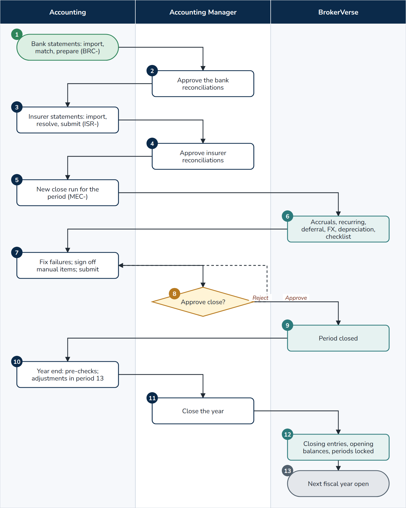

| At a glance | |
|---|---|
| Trigger | The end of an accounting period |
| Roles | Accounting (preparer); Accounting Manager (approver); BrokerVerse |
| Screens | Accounts > Bank Reconciliation; Accounts > Insurer Reconciliation; Accounts > Period End (Period Management, Month-End Close, Year-End Close, Recurring Journals, Financial Statements); Reports > Financial Reports > Month-End Close Status |
| Postings | Accruals and their reversal, recurring journals, commission deferral, FX revaluation, fa.depreciation, bank adjustments, insurer_statement.adjustment, year-end closing entries in period 13 |
| Documents | Bank Reconciliation Statement (BRC-), insurer statement reconciliation (ISR-), close run (MEC-), year-end close (YEC-), financial statements |
| Controls | Approver different from the preparer (`accounting.period_close_requires_approval`); blocking checklist items stop the submit; soft-closed periods accept postings only from the Accounting Manager; closed periods none |

1. **Accounting.** For each bank account: **Import statement** (BST-; balanced statement, duplicate files refused), **Auto-match**, manual matches, adjustments for charges, interest and direct credits, then **New reconciliation** (BRC-) with a difference of PHP 0.00, prepared.
2. **Accounting Manager.** Approves each reconciliation (the matches up to the period end are locked).
3. **Accounting.** For each insurer: **Import statement**, **Import and match** (ISR-), resolve every difference (`insurer_reconciliation.require_resolved`), submit.
4. **Accounting Manager.** Approves the insurer statement reconciliations.
5. **Accounting.** Month-End Close > **New close run** for the period (MEC-YYYY-NNNNN).
6. **BrokerVerse.** Runs the steps in order: (a) accruals, (b) recurring journals, (c) commission deferral (skipped when off), (d) FX revaluation, (e) depreciation of the fixed asset register (`fixed_assets.depreciation_in_month_end`), (f) checklist (no unposted journals, TB balances, suspense cleared as blocking; unapplied receipts, unreconciled bank lines, sub-ledgers tie out, issued policies billed, remittances paid, direct-bill commission billed as warnings; the manual items).
7. **Accounting.** Fixes what failed and re-runs the checks, signs off each manual item, **Submit** the close.
8. **Accounting Manager.** Checks the steps, the checklist and the Month-End Close Status report; **Approve close**, or **Reject** with a reason (back to step 7).
9. **BrokerVerse.** The period is Closed. Period Management keeps each status change with user, time and remarks; **Reopen** needs the Accounting Manager.
10. **Accounting.** With all twelve periods closed: **Start year-end close**, run the pre-checks, post audit adjustments with **Adjustment journal** in period 13 (approved by a second user).
11. **Accounting Manager.** **Close the year**.
12. **BrokerVerse.** Posts the closing entries in period 13 (income and expense to current year profit or loss, then to retained earnings), writes the balance-sheet balances as the opening balances of the next year, locks the periods and creates the next fiscal year.
13. **End.** The next year is open. **Reverse the close** (with a reason) is possible until its first period is closed.

## F10 BIR monthly, quarterly and annual filing

The taxes are posted as business happens; the returns are built from the ledger, reconciled, printed, filed by the broker in the BIR's systems and recorded.

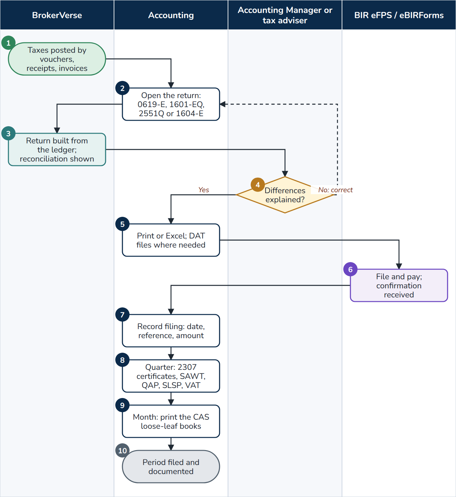

| At a glance | |
|---|---|
| Trigger | The BIR due dates: 0619-E on day `bir.withholding_due_day` (10) of the next month for the first and second month of each quarter; 1601-EQ and 2551Q on the last day of the month after the quarter; 1604-E yearly |
| Roles | Accounting; Accounting Manager or the broker's tax adviser (review); BIR eFPS or eBIRForms (outside the system); BrokerVerse |
| Screens | Accounts > Tax (BIR Form 2307, VAT Summary, SAWT, QAP, SLSP Sales, SLSP Purchases, Withholding Returns, Annual Alphalist 1604-E, Percentage Tax 2551Q, BIR DAT Files, Sales Invoices, E-Invoicing (EIS), CAS Books and Documents) |
| Postings | None at filing; the taxes were posted by payment vouchers, supplier invoices, debit note collections and invoices |
| Documents | Returns in BIR item order (PDF, Excel), DAT files, BIR Form 2307 certificates (CWT-), sales invoices (SI-), loose-leaf books with running page numbers, filing records |
| Controls | Reconciliation of each return with the QAP and the withholding accounts of the ledger (`bir.withholding_ledger_accounts`, else 2204001); filing record kept with the figures as computed; amended returns supersede earlier filings; CAS print order (`cas.enforce_print_order`) |

1. **BrokerVerse.** Throughout the period: EWT is posted on payment vouchers to agents, referrers and suppliers (supplier invoices at the supplier's EWT code); CWT received on debit note and override collections; output VAT on commission; sales invoices numbered in the registered serial range (`invoice.serial_from`, `invoice.serial_to`).
2. **Accounting.** Accounts > Tax > Withholding Returns, the year, **Open** on the return due (0619-E, 1601-EQ), or Percentage Tax 2551Q for a non-VAT broker, or Annual Alphalist 1604-E.
3. **BrokerVerse.** Lays out Part I (TIN with branch code, RDO, name, address from Master > Company and the `bir.*` settings) and Part II with the BIR item numbers (for 1601-EQ one line per ATC, less the 0619-E remittances of the quarter from their filing records) and shows the **Reconciliation**.
4. **Accounting Manager or tax adviser.** Decision: is every difference explained (for example a withholding booked by journal voucher or petty cash)? If not, Accounting corrects the source (step 2).
5. **Accounting.** **Print** (PDF) or **Excel**; Accounts > Tax > BIR DAT Files for the QAP, SAWT, SLSP and 1604-E alphalist, checked with the BIR validation module.
6. **BIR eFPS / eBIRForms.** The broker files and pays outside BrokerVerse and receives the confirmation.
7. **Accounting.** **Record filing**: date filed, filing reference, amount paid, penalties, payment date, reference and channel.
8. **Accounting.** Each quarter: BIR Form 2307 (Issued by us) per payee, SAWT (Received), QAP, SLSP sales and purchases, the VAT Summary as working paper of the VAT return.
9. **Accounting.** Each month: CAS Books and Documents prints the general journal, general ledger, cash receipts, cash disbursements, sales and purchase books in order, with page numbers that run on through the year.
10. **End.** The period is filed and documented; the 1604-E follows the year with its schedules 3 and 4.

**Exceptions**

- A payee without TIN: warning on the DAT file.
- **Amended return** records a new filing that supersedes the earlier one; a record entered in error is cancelled with a reason.
- E-invoicing: when the broker is enrolled, each invoice is queued to the EIS; failures retry, rejections are final; **Export payloads** and **Uploaded manually** are the fallback.

# Compliance

## F11 AML onboarding, screening, EDD and AMLC reporting

A client is identified, rated and screened before its first policy; a High-risk client needs an approved EDD review; transactions are monitored daily; suspicious and covered transactions become cases and report files filed with the AMLC.

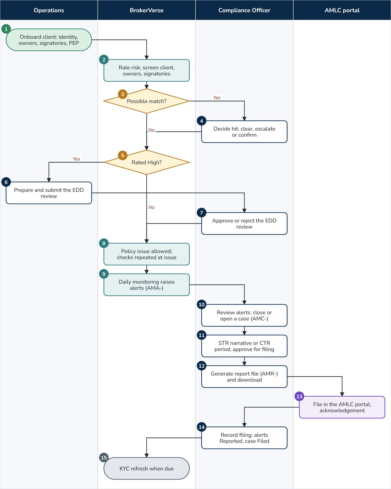

| At a glance | |
|---|---|
| Trigger | A new client; a policy issue; a refund or claim payout; a new list version; a daily monitoring run; a KYC refresh date |
| Roles | Operations; Compliance Officer; AMLC portal (outside the system); BrokerVerse |
| Screens | Operations > Clients > **Onboard client**; Compliance > AML Dashboard, Client Due Diligence, EDD Reviews, KYC Refresh, Screening Hits, Screening Lists, Transaction Alerts, AML Cases, AMLC Reports, AML Settings |
| Postings | None |
| Documents | KYC documents, EDD review (EDD-), alerts (AMA-), cases (AMC-), report files (AMR-, layout BV-AMLC-TXN 1.0) |
| Controls | Policy issue and payouts stopped by an undecided or confirmed match (`aml.screening_block_events`) and by a pending EDD (`aml.block_issue_pending_edd`); decisions reserved to `approve:aml` with a reason; the submitter of an EDD review cannot decide it; covered transactions cannot be closed; records kept `aml.record_retention_years` (5) years |

1. **Operations.** Operations > Clients > **Onboard client**: individual (names, birth date and place, civil status, nationality, occupation, employer, source of funds, TIN, government ID with expiry) or juridical (registered and trade name, SEC, DTI or CDA registration, nature of business, TIN, signatories with their board resolution or secretary's certificate, beneficial owners at 25% or more, `aml.beneficial_owner_threshold`); mobile and PSGC address; expected lines, payment mode and annual premium; PEP details; KYC documents.
2. **BrokerVerse.** Gives the client its code, rates it from the risk factors (Low up to 2, High from 8, Normal between; a PEP always High) and screens the client, owners and signatories against the loaded lists and the provider (match from 0.85).
3. **BrokerVerse.** Decision: a possible match?
4. **Compliance Officer.** Screening Hits > **Decide**: **Clear** (false positive, cleared again automatically next time), **Escalate** (to an AML case; still blocks) or **Confirm** (client Blocked and rated High).
5. **BrokerVerse.** Decision: is the client rated High?
6. **Operations.** EDD Reviews: source of wealth, source of funds, purpose of the relationship, findings, senior management approval, evidence; **Submit**.
7. **Compliance Officer.** **Approve**, or **Reject** with the reason (Operations completes and submits again).
8. **BrokerVerse.** Policies can be issued. At every issue the client is rated again with the new policy and screened; refunds and claim payouts screen the payee and the client.
9. **BrokerVerse.** The aml-transaction-monitoring job runs every morning over the last 3 days: cash above PHP 500,000 in one banking day (`aml.covered_threshold`), several cash payments below it, early cancellation with return premium, refund or claim paid to a third party, overpayment refunded, payer differs from the client. Each alert is AMA-YYYY-NNNNNN.
10. **Compliance Officer.** Transaction Alerts: **Close** an explained suspicious alert with the reason, or **Open or add to a case** (AMC-).
11. **Compliance Officer.** STR case: grounds of suspicion, **Suspicion established on** (due `aml.str_due_working_days`, 1 working day later, holidays of the Holiday master skipped), narrative; **Approve for filing**. Covered transactions: **Generate CTR file** for the period (due in 5 working days).
12. **Compliance Officer.** **Generate report file** (AMR-) and **Download**.
13. **AMLC portal.** The broker files the report; the AMLC acknowledges or rejects it.
14. **Compliance Officer.** **Record filing**: date, acknowledgement reference, later Acknowledged or Rejected; the alerts become Reported and the case Filed.
15. **End.** The weekly aml-kyc-refresh-due job lists clients due for refresh (Low 36, Normal 24, High 12 months); **Complete KYC refresh** rates the client again.

**Exceptions**

- A new list version is loaded on Screening Lists with **Rescreen every client after loading**: new matches enter the hits queue.
- The screening provider is down: the uploaded lists are still screened; aml-provider-retry retries the call and notifies the officer when the attempts run out.
- Master > Data Privacy refuses to anonymise a client before the AML retention ends or while a case is open.

## F12 Complaints

Complaints of clients and claimants are logged, acknowledged and resolved within set periods, escalated when overdue, and reported, under RA 11765 and the IC rules on complaints handling.

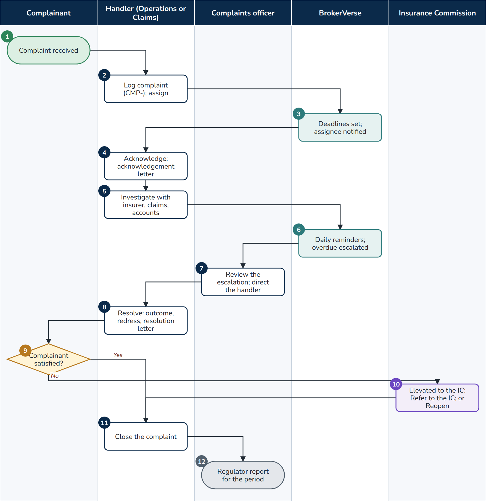

| At a glance | |
|---|---|
| Trigger | A complaint received by any channel (`complaints.channels`) |
| Roles | Complainant; handler (Operations or Claims, `write:complaints`); complaints officers (`approve:complaints`); Insurance Commission; BrokerVerse |
| Screens | Compliance > Insurance Commission > Complaints |
| Postings | None |
| Documents | Complaint (CMP-), acknowledgement letter (`complaints.ack_letter_text`), resolution letter (`complaints.resolution_letter_text`) on the letterhead, regulator report (Excel) |
| Controls | Deadlines in calendar days from receipt: acknowledgement `complaints.ack_days` (2), resolution `complaints.resolution_days_simple` (7) or `complaints.resolution_days_complex` (45); automatic escalation when overdue (`complaints.auto_escalate`); history and audit trail |

1. **Complainant.** Complains by letter, e-mail, phone, walk-in or another channel.
2. **Handler.** **Log complaint**: date received, channel, complainant and contact, complainant type, policy and claim (the policy fills the client and insurer), category (`complaints.categories`), simple or complex, amount disputed, subject, description, letter; **Assigned to**.
3. **BrokerVerse.** Numbers the complaint (CMP-), sets the acknowledgement and resolution deadlines and notifies the person assigned.
4. **Handler.** **Acknowledge** and print the acknowledgement letter.
5. **Handler.** Investigates with the insurer, Claims, Accounting or the account executive.
6. **BrokerVerse.** The daily `complaints-deadlines` job (08:00) reminds the person assigned of each deadline and escalates overdue complaints to the complaints officers. **Acknowledge by** and **Resolve by** show a passed deadline in red.
7. **Complaints officer.** Reviews the escalation (or one raised with **Escalate** and a reason) and directs the handler.
8. **Handler.** **Resolve**: outcome (Upheld, Partially upheld, Not upheld, Withdrawn), resolution, redress amount; prints the resolution letter, which tells the complainant how to elevate the complaint to the IC.
9. **Complainant.** Decision: satisfied?
10. **Insurance Commission.** When the complainant elevates the complaint, **Refer to the IC** records the IC's reference; a contested resolution is reopened with **Reopen** and the reason.
11. **Handler.** **Close** the resolved complaint.
12. **End.** The complaints officers download the regulator report for the period: received, resolved, open, resolved within the deadline, average days, referred to the IC, by category, channel, status and outcome, with the ageing.

## F13 Personal data breach

A security incident is logged at once, assessed against the NPC criteria, notified to the NPC and the data subjects within 72 hours when notifiable, remediated and closed, and counted in the annual report.

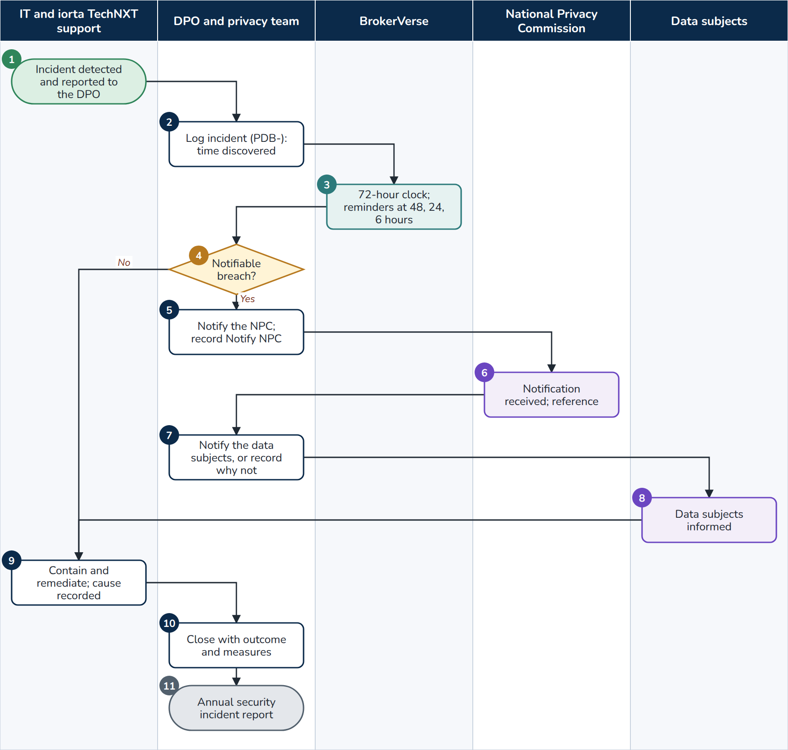

| At a glance | |
|---|---|
| Trigger | A suspected security incident or personal data breach is discovered (by staff, monitoring or iorta TechNXT support) |
| Roles | IT and iorta TechNXT support; DPO and privacy team (`read:privacy`, `write:privacy`); National Privacy Commission; data subjects; BrokerVerse |
| Screens | Compliance > Data Privacy (NPC) > Breach Register; Master > Audit Trail; Master > Users and Access > User Access Matrix and sign-in history |
| Postings | None |
| Documents | Incident record (PDB-), evidence, NPC notification reference, annual security incident report (Excel) |
| Controls | 72-hour deadline from the time discovered (`privacy.breach_notify_hours`); hourly reminders at 48, 24 and 6 hours before and when passed (`privacy-breach-deadlines`); a late notification needs the reason; a notifiable breach closes only after its NPC notification is recorded |

1. **IT and support.** Detect the incident (monitoring alarms, failed sign-ins, the audit trail, a report from a user) and tell the DPO without delay; iorta TechNXT informs the broker of a suspected breach under the support agreement.
2. **DPO.** **Log incident**: personal data breach or security incident, time discovered, title, what happened, nature (confidentiality, integrity, availability), data involved, number of data subjects and records, systems, evidence.
3. **BrokerVerse.** Numbers it (PDB-), notifies the data privacy team and shows the **Clock** of hours left.
4. **DPO.** **Assess** against the criteria: sensitive personal information, information that may enable identity fraud, reasonably believed acquired by an unauthorised person, real risk of serious harm. A decision different from the criteria needs a reason.
5. **DPO.** Notifies the NPC through its channel, then **Notify NPC**: time, NPC reference, method.
6. **National Privacy Commission.** Receives the notification.
7. **DPO.** **Data subjects**: time, number and method of their notification, or the reason they are not notified.
8. **Data subjects.** Are informed.
9. **IT and support.** Contain and remediate; the cause, containment and remediation are recorded with **Edit**.
10. **DPO.** **Close** with the outcome and the measures taken.
11. **End.** **Annual report** gives the year's incidents, breaches, notifications (on time and late) and data subjects affected for the annual security incident report to the NPC.

# Go-live and operations

## F14 Go-live data load and cutover

The configuration is loaded and promoted with the configuration workbook; the open business of the old system is loaded with the migration workbook at cutover, reconciled and signed; the go-live lock closes the migration.

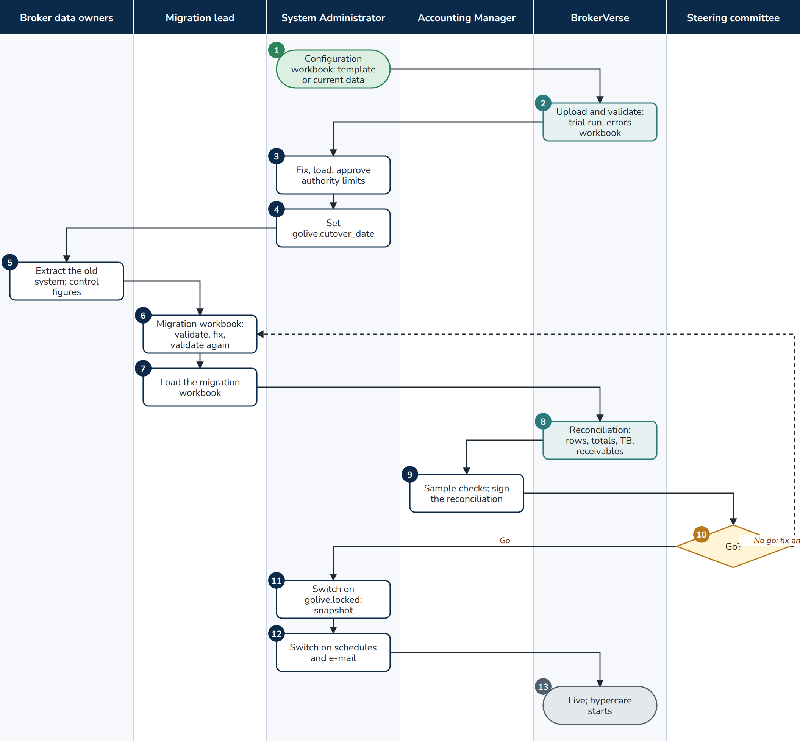

| At a glance | |
|---|---|
| Trigger | The go-live plan (mock loads, rehearsal in Pre-Prod, final load) |
| Roles | Broker data owners; iorta TechNXT migration lead; System Administrator; Accounting Manager; steering committee; BrokerVerse |
| Screens | Master > Go-Live and Data > Go-Live Data Load (Download Template, Upload and Validate, History, Compare environments); Master > Configuration, group Go-live; Accounts > Period End > Period Management |
| Postings | None: migrated records post nothing; the GL opening balances carry the money |
| Documents | Configuration and migration workbooks, errors workbook, reconciliation workbook, temporary passwords of new users (shown once), signed reconciliation report |
| Controls | `read:data-load`, `write:data-load` (System Administrator); trial run in one rolled-back transaction; load in one transaction; natural keys (no duplicates); dates before the cutover date; TB debits equal credits; receivables control equals open items; authority limits approved by a second administrator; `golive.locked` |

1. **System Administrator.** Downloads the configuration workbook (**Blank template**, or **Current data** from the environment where it was built) and fills it with the discovery decisions: company, settings, locations, branches, users, chart of accounts, banks, insurers, products, covers, vehicles, commission rates, premium taxes, LGU rates, authority limits, numbering.
2. **BrokerVerse.** **Upload and validate** runs every sheet in load order as a trial run: rows read, valid, with errors; new, changed, unchanged, for approval; each error with sheet, row, column and message; **Download errors** gives only the rows in error.
3. **System Administrator.** Corrects and uploads again, then **Load** (valid rows only by default). New users' temporary passwords are shown once; another administrator approves the authority limits; the on-screen items (roles, tax codes, posting rules, statement formats, product templates, schedules, periods) are entered.
4. **System Administrator.** Sets `golive.cutover_date` (the first day of live transactions) and the Numbering sheet's next numbers above the old system's range.
5. **Broker data owners.** Extract clients, in-force policies, open receivables, open claims and the trial balance at the close of the day before the cutover date, and sign the control figures.
6. **Migration lead.** Fills the migration workbook, uploads and validates, fixes, validates again. Mock loads repeat this in UAT or SIT after a transaction reset; the rehearsal runs it in Pre-Prod on the cutover timetable.
7. **Migration lead.** **Load** (valid rows only not ticked by default). Migrated records keep their old numbers and post nothing.
8. **BrokerVerse.** The reconciliation per sheet: workbook rows and totals against the records and totals in BrokerVerse, the TB balance check and the premiums receivable control account against the open items (Agrees or Difference); **Download reconciliation**.
9. **Accounting Manager.** With the data owners: sample checks (policies per line, open items, TB line by line) and signature of the reconciliation report.
10. **Steering committee.** Go/no-go (GNG-2). No go: fix and reload (step 6) or keep the old system.
11. **System Administrator.** Switches on `golive.locked`; a snapshot of the go-live baseline is taken. The migration workbook and the transaction reset are refused from then on.
12. **System Administrator.** Switches on the scheduled jobs and **Send e-mails**; the old system becomes read-only.
13. **End.** BrokerVerse is live; hypercare runs until the first month-end close is approved.

**Exceptions**

- Migration workbook refused with **Set the cutover date (golive.cutover_date) first**.
- A row dated on or after the cutover date, a policy not in force at cutover, an unbalanced TB or a number that collides with a series is refused with its reason; the opening balances load all or nothing.
- A record missed after the lock is entered on its screen as an exception agreed with the Accounting Manager.

## F15 Environment promotion and masking refresh

A release moves the same build from Dev to Production through approvals; configuration moves with the configuration workbook and is proved identical with the environment comparison. A copy of production used outside production is masked first.

### F15a Release and configuration promotion

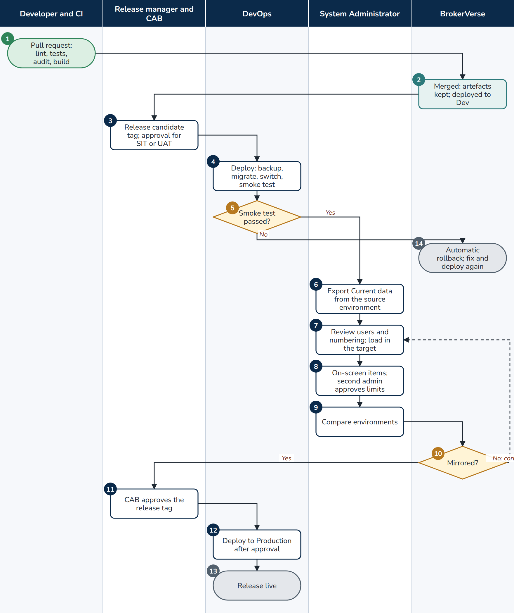

| At a glance | |
|---|---|
| Trigger | A change merged for release; a release candidate; an approved release |
| Roles | Developer and CI; release manager and CAB; iorta TechNXT DevOps; System Administrator; BrokerVerse |
| Screens and tools | GitHub workflows ci.yml, deploy.yml, rollback.yml; Master > Go-Live Data Load (Current data, Compare environments); `npm run compare:environments` |
| Documents | Build artefacts web-<sha> and backend-<sha>, release notes, comparison workbook, promotion checklist |
| Controls | Build once, promote the same artefact; approvals per environment (uat, preprod, production); pre-deployment database backup (always for Pre-Prod and Production); forward-only migrations; smoke test and automatic rollback; Production accepts only a vX.Y.Z tag; configuration freeze from UAT sign-off |

1. **Developer and CI.** A pull request runs lint, tests against PostgreSQL 16, the dependency audit and the build.
2. **BrokerVerse.** Merged into brokerverse-platform: artefacts kept 90 days and deployed to Dev automatically.
3. **Release manager.** Tags a release candidate vX.Y.Z-rc.N; it deploys to UAT after approval (SIT by hand for a large broker; Pre-Prod by hand for the rehearsal).
4. **DevOps.** The deployment backs up the database, installs the release beside the running one, migrates, seeds reference data, switches and runs the smoke test (`/api/health`, `/api/version` equal to the commit, `/login`, `/env-config.js`).
5. **DevOps.** Decision: smoke test passed?
6. **System Administrator.** Downloads **Current data** of the configuration workbook in the source environment.
7. **System Administrator.** Reviews it (removes test users, sets the Numbering sheet for the target) and loads it in the target (validate, fix, load).
8. **System Administrator.** Enters the on-screen items of the promotion checklist; another administrator approves the authority limits.
9. **System Administrator.** Compare environments: **File vs this environment** (or **File A vs file B**), with **Include numbering counters** when needed; the pipeline can run `npm run compare:environments` against two running APIs.
10. **BrokerVerse.** Decision: Mirrored, or Differences found (field by field; environment-specific fields such as addresses and sender settings are listed apart and never count). Differences are corrected (step 7).
11. **Release manager.** The CAB approves the release tag vX.Y.Z.
12. **DevOps.** Deploys to Production after the approval of the production environment.
13. **End.** The release is live; the comparison workbook is kept as evidence.
14. **End.** A failed smoke test rolls the application back to the release that ran before (the database keeps its forward-only migrations); the fix is deployed as a new build.

### F15b Masking refresh of a non-production copy

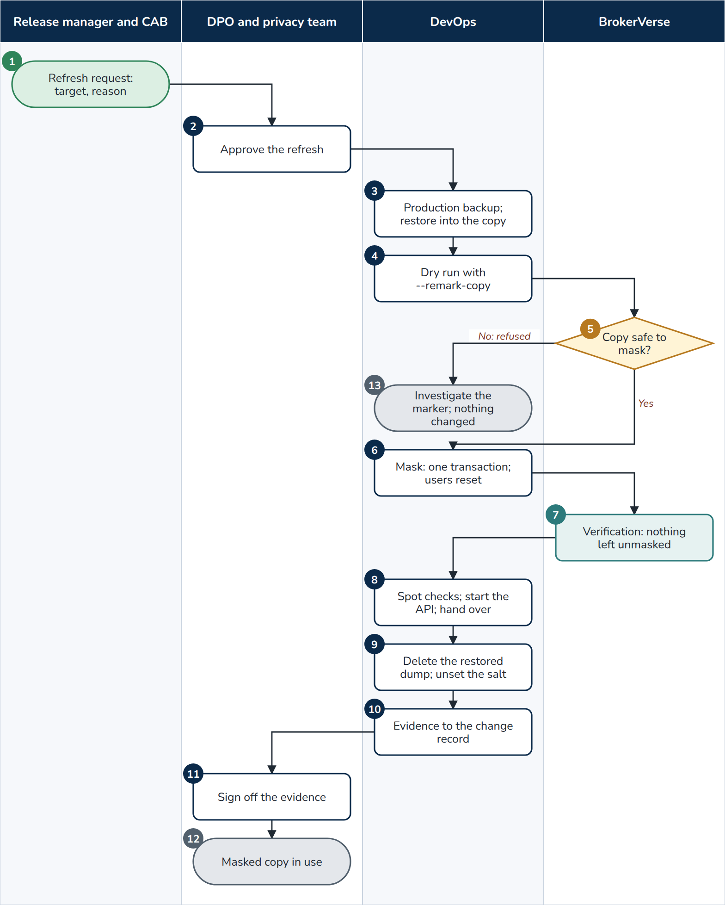

| At a glance | |
|---|---|
| Trigger | SIT, UAT, training or Pre-Prod (when opened to testers) needs production data; a support case needs a copy |
| Roles | Release manager (requester); DPO; DevOps or DBA; BrokerVerse (masking command) |
| Tools | `npm run mask:data` (backend/scripts/mask-data.js) with `--remark-copy`, `--confirm-database`, `--restore-source`, `--verify-only`; `--register-production` run once in Production after go-live |
| Documents | Change record with the DPO approval, dry run and masking output, verification result, audit trail entry (entity database, action mask) |
| Controls | `CONFIRM_MASK=yes`; a salt of at least 16 characters never stored; refuses a database marked production or the registered production server; one transaction; e-mail sending switched off in the copy; Dev never receives production data |

1. **Release manager.** Requests the refresh: target environment and reason.
2. **DPO.** Approves the refresh.
3. **DevOps.** Takes a production backup and restores it into a new, empty database of the target; the copy's API stays stopped.
4. **DevOps.** Runs the dry run with `--environment=<target> --remark-copy --confirm-database=<copy> --restore-source=<backup>`: counts per table and column of what will change.
5. **BrokerVerse.** Decision: the tool refuses a database it cannot prove is a copy (production marker without `--remark-copy`, the registered production server, a database name typed wrongly).
6. **DevOps.** Masks with `--execute`: names, e-mail addresses, mobile numbers, TINs, addresses, ID and vehicle numbers, bank accounts, remarks and files (with `--storage`) replaced by consistent pseudonyms; passwords reset; outbox, sessions and sign-in history emptied; amounts, dates and the ledger kept.
7. **BrokerVerse.** Verification prints that no e-mail address, mobile number or TIN is left unmasked (exit code 4 otherwise).
8. **DevOps.** Spot-checks clients, policies and claims on screen, starts the API and hands over the URL.
9. **DevOps.** Deletes the restored dump and unsets the salt and passwords.
10. **DevOps.** Files the evidence in the change record.
11. **DPO.** Signs off the evidence.
12. **End.** The masked copy is in use until it is destroyed.
13. **End.** Refused: nothing is changed; the marker is investigated before any retry.

# Traceability

| Flow | Business requirement areas (Business Requirements Document) |
|---|---|
| F01 | 01 Client onboarding, 02 Prospecting, 03 Quotation, 05 Policy issuance |
| F02 | 03 Quotation, 04 RFQ and placement |
| F03 | 06 Endorsements and cancellations |
| F04 | 07 Renewals |
| F05 | 08 Billing, collection, credit control and receipts |
| F06 | 09 Remittance, direct bill and insurer reconciliation |
| F07 | 10 Commission, 14 IC compliance (licences) |
| F08 | 11 Claims assistance |
| F09 | 12 Accounting and period end |
| F10 | 13 Taxes and BIR compliance |
| F11 | 01 Client onboarding, KYC and AML |
| F12, F13 | 14 Insurance Commission and Data Privacy compliance |
| F14, F15 | 15 Reporting, administration, security and go-live |
| F16, F17, F18 | 02 Prospecting (channels), 05 Policy issuance (programmes, fleets, open covers) |
| F19 | 04 RFQ, placement, co-insurance and reinsurance |
